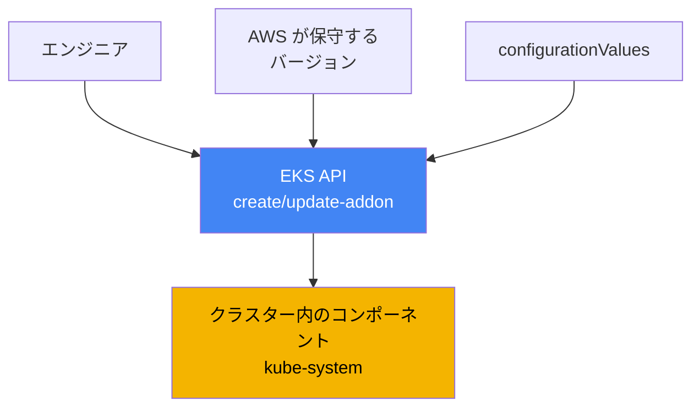
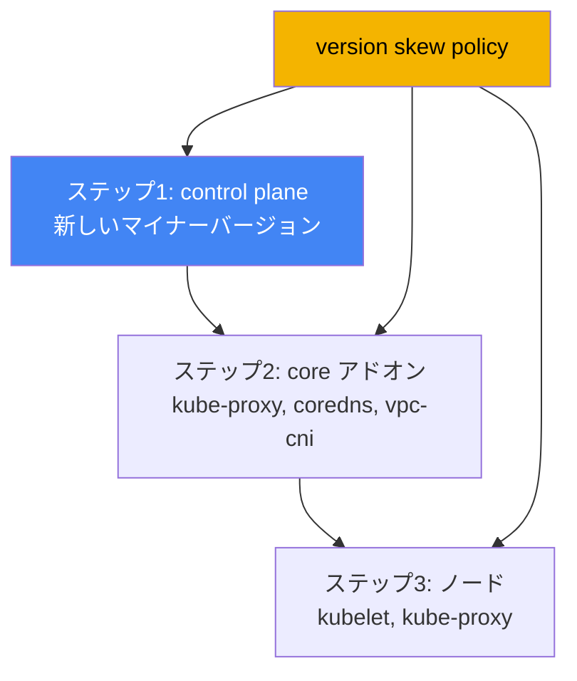

[Eng version](en.md) · [Versión en español](es.md) · [Version française](fr.md) · [Deutsche Version](de.md) · [Русская версия](ru.md) · [ქართული ვერსია](ge.md) · [繁體中文版](tw.md)
# 第37章. EKS アドオン: managed addons と Helm、バージョン、更新順序

> **次は何か。** この章から、すでに作成され稼働しているクラスターの運用である第7部が始まります。運用における最初の問いは、システムコンポーネントのライフサイクルを誰が所有し、クラスターのバージョンとの整合性をどう保つかです。ここではアドオンとそのバージョンの管理を扱います。関連する内容は他の章で扱います。バージョンに沿ったクラスター全体のアップグレードは第38章、バージョンのロールバックは第39章、個別のアドオンはそれぞれの章（VPC CNI は第8章、EBS CSI は第23章、Load Balancer Controller は第26章、オブザーバビリティは第33-36章）、IRSA と Pod Identity によるアドオン用ロールは第16章と第17章です。

## 37.1. 「control plane を更新したのに、CoreDNS が古いまま」

エンジニアがクラスターのバージョンを更新しました。control plane は新しいマイナーバージョンへ移行し、コマンドはエラーなく完了、コンソールも新しいバージョンを表示しています。翌日には苦情が届き始めます。名前を解決できない Pod があり、Service 間のネットワークが切れる箇所もあります。当番担当者が `kube-system` に何があるかを確認すると、バージョンのずれが見つかります。

```bash
kubectl get pods -n kube-system -o wide | grep -E "coredns|kube-proxy|aws-node"
# coredns    古いバージョンのイメージ
# kube-proxy control plane より数マイナー古いイメージ
# aws-node   (VPC CNI) も以前のバージョン
```

control plane は先へ進んでいますが、ノード上のシステムコンポーネントは、アップグレード前にクラスターが使っていたバージョンのままです。これは **version skew**、すなわち control plane とデータコンポーネント間のバージョン差です。kube-proxy と CoreDNS は control plane に追従して自動更新されません。バージョンを個別に、新しいマイナーバージョンと互換性のあるものへ更新する必要があります。それまでの挙動は予測不能です。DNS 解決、kube-proxy による負荷分散、Pod ネットワークが部分的に、しかもすぐではなく壊れることがあります。

同じ問題の別の形は、アップグレードをしなくても、インストール方法が乱立している場合に起こります。VPC CNI は managed addon として導入され、誰かが CoreDNS を Helm チャートで再インストールし、kube-proxy は `kubectl edit` で手作業変更、metrics-server は別のマニフェストで導入されています。バージョンがばらばらになり、「このコンポーネントの更新は誰が責任を持つのか」という問いに、チームの誰も確信を持って答えられません。次のアップグレードでは、AWS コマンドで更新するもの、Helm で更新するもの、手作業で更新するもの、そしてその順序を見極める作業になります。

両方の状況は同じことを示しています。クラスターのシステムコンポーネントには、明確なライフサイクル所有者と予測可能な更新順序が必要です。まさにこれを提供するのが EKS managed addons です。以降では順に、managed addon とは何か、その種類、Helm によるインストールとの違い、設定競合の解決方法、アドオンに AWS 権限を与える方法、そして version skew が更新順序をどのように決めるかを説明します。

## 37.2. EKS managed addon とは

**EKS managed addon**（管理対象アドオン）は、Helm や素のマニフェストではなく EKS API を通じてインストールと更新を管理する、AWS が保守するクラスターのシステムコンポーネントです。AWS はアドオンをビルドし、最新のセキュリティパッチと修正を含め、EKS バージョンとの互換性をテストして、一連のバージョンを公開します。エンジニアはチャートを取得したりアップストリームを追跡したりせず、検証済みリストからアドオンのバージョンを選択します。

管理は個別の EKS API 操作と CLI のラッパーを通じて行います。

```bash
# 必要なバージョンのアドオンをインストールする
aws eks create-addon --cluster-name my-cluster --addon-name coredns \
  --addon-version v1.11.1-eksbuild.4
# 別のバージョンへ更新する
aws eks update-addon --cluster-name my-cluster --addon-name coredns \
  --addon-version v1.11.3-eksbuild.1
# インストール済みの内容とステータスを確認する
aws eks describe-addon --cluster-name my-cluster --addon-name coredns
```

重要な性質は3つあります。第1に、**バージョンはクラスターのバージョンに紐付きます**。AWS は各アドオンバージョンについて、どの Kubernetes マイナーバージョンと互換性があるかを示します。そのためアドオンのアップグレードは「latest を取る」のではなく、「現在のマイナーバージョンと互換性のあるバージョンを取る」ことです。第2に、**アドオンは自動更新されません**。EKS は新リリース時にも、クラスターを新しいマイナーバージョンに更新したときにも、アドオンのバージョンを変更しません。更新は常にエンジニアが開始します。第3に、マニフェストを手作業で変更せず、`configurationValues` フィールドによって**設定を宣言的に指定できます**。

```bash
# アドオン設定を JSON として渡す（構造はアドオンにより異なる）
aws eks update-addon --cluster-name my-cluster --addon-name coredns \
  --configuration-values '{"replicaCount":3}'
# このアドオンバージョンが受け付けるキーを確認する
aws eks describe-addon-configuration --addon-name coredns \
  --addon-version v1.11.3-eksbuild.1
```



要点は単純です。エンジニアとクラスター内のコンポーネントの間に EKS API が入り、バージョン互換性を認識し、選択された設定を保持し、予測可能に適用します。

## 37.3. アドオンの種類とデフォルトでインストールされるもの

AWS が managed addons として提供するコンポーネントは、用途ごとに分類できます。以下は主なものと、`--addon-name` が受け取る名前です。

| カテゴリ | アドオン | 機能 |
|---|---|---|
| ネットワーク（core） | `vpc-cni`, `kube-proxy` | ENI 経由で Pod に IP を割り当てる。ノード上の Service ルール |
| DNS（core） | `coredns` | クラスター内 DNS 解決 |
| ストレージ | `aws-ebs-csi-driver`, `aws-efs-csi-driver`, `aws-mountpoint-s3-csi-driver` | EBS、EFS、S3 ボリューム |
| オブザーバビリティ | `amazon-cloudwatch-observability`, `adot` | メトリクス、ログ、トレース（第33-36章） |
| アイデンティティ | `eks-pod-identity-agent` | Pod Identity エージェント（第17章） |
| その他 | `metrics-server`, `snapshot-controller` | HPA 用メトリクス。CSI スナップショット |

`vpc-cni`、`kube-proxy`、`coredns` の3コンポーネントは **core アドオン**と呼ばれます。Pod ネットワーク、Service の負荷分散、DNS のいずれかがなければ、クラスターはクラスターとして機能しないためです。EKS はすべてのクラスターにこれらを導入します。managed にするか self-managed にするかだけが異なります。

クラスター作成時に実際に導入される内容は、ツールにより異なります。AWS コンソールでは、コア（`kube-proxy`、`vpc-cni`、`coredns`）がすぐに managed addons として導入されます。設定ファイルなしの `eksctl` では（バージョン 0.184.0 以降）、同じ3つに加えて `metrics-server` も、managed として導入されます。他のツールや古い `eksctl` では、同じ3コンポーネントが self-managed として導入されます。自分で維持することも、後から managed へ移行することもできます。EKS Auto Mode では、これらの機能の一部はプラットフォーム自体に組み込まれ、通常のアドオンとして管理されません。

## 37.4. Managed addon と self-managed（Helm またはマニフェスト）

すべてが managed addon として導入されるわけではありません。多くの重要なコンポーネントは Helm チャートまたはマニフェストでしか利用できません。**AWS Load Balancer Controller**（第26章）、**external-dns** と **cert-manager**（第29章）、**Karpenter**（第12章）です。これらのライフサイクルは完全に利用者が管理します。一方、core アドオンといくつかのドライバーは両方の形態で利用でき、そこでは意識的に選択します。

| 基準 | Managed addon | Self-managed（Helm/マニフェスト） |
|---|---|---|
| 更新の所有者 | 利用者が開始し、AWS が適用する | 完全に利用者 |
| バージョンの選択 | AWS が保守するリスト | アップストリームの任意のバージョン |
| クラスターとの互換性 | AWS が検証し保証する | 自分で確認する |
| 設定 | `configurationValues` + クラスターのフィールド | チャートの values、完全な制御 |
| 競合の解決 | API の `resolveConflicts` | Helm の機能 |
| 詳細設定の柔軟性 | 管理対象フィールドに限定 | 最大限 |
| 利用できるもの | コア、CSI、オブザーバビリティなど | Helm 専用を含む任意のもの |

選択の実用的な原則は明確です。managed addon として利用でき、特殊な設定を必要としないものは managed を選びます。手作業が減り、互換性が保証され、アップグレードも予測可能になるためです。保守対象セットにないバージョンや設定が必要な場合、またはコンポーネント自体がアドオンとして提供されない場合は、Helm を使い、ライフサイクルを自分で管理します。同一コンポーネントに両方の方式を混在させることこそ、第37.1節の乱立を生むため避けます。

## 37.5. 競合の解決: resolveConflicts とフィールド所有権

Managed addon は server-side apply の仕組みを通じて設定をクラスターに適用し、一部のフィールドを自らのもの（managed fields）として宣言します。同じフィールドを誰かが手作業や Helm で変更している場合、create/update 時に競合が発生します。その対処は **`resolveConflicts`** フィールド（`--resolve-conflicts` フラグ）で指定します。

| 値 | 挙動 | 適切な場面 |
|---|---|---|
| `NONE` | 競合時に操作はエラーで失敗する | 安全なデフォルト。手作業で確認する |
| `OVERWRITE` | 他者の変更を EKS のデフォルトで上書きする | アドオンを標準状態に戻す |
| `PRESERVE` | 自分によるフィールド変更を保持する | 意図的なカスタマイズがある |

ロジックは次のとおりです。`NONE` は何も黙って壊しません。競合を検出すると、EKS は説明付きのエラーを返し、自分で判断できます。`OVERWRITE` は「信頼できる情報源は EKS」と伝えます。すべての設定がアドオンのデフォルトへ戻され、手作業の変更は失われます。`PRESERVE` は「自分の変更は意図的」と伝えます。EKS は設定済みのフィールドに触れず、残りを適用します。

別の一般的なシナリオは、**以前 self-managed として運用していたものを managed に移行すること**です。CoreDNS を Helm で導入していたものの、後から `create-addon` により EKS 管理下に置くことにしたとします。`--resolve-conflicts OVERWRITE` を指定しなければ、既存オブジェクトとの競合でインストールは失敗します。`OVERWRITE` を使うと、EKS は所有権を取得し、設定を自らのデフォルトへ戻します。そのため必要なカスタム設定は事前に `configurationValues` へ移しておかなければ失われます。管理対象フィールドと競合せずに変更できる具体的なフィールドは、アドオンの field management に関するドキュメントに記載されています。

## 37.6. アドオンの権限: IRSA または Pod Identity

一部のアドオンには AWS 権限が必要です。VPC CNI はネットワークリソースを設定し、EBS CSI はボリュームを作成してアタッチし、ADOT はテレメトリを送信します。権限はキーではなく、アドオンの ServiceAccount に結び付けた IAM ロールで付与します。2つの仕組みは第16章と第17章で扱いました。**IRSA**（OIDC プロバイダー経由のロール）と **EKS Pod Identity**（エージェント経由の関連付け）です。AWS はアドオンには Pod Identity を推奨していますが、IRSA もサポートされます。

Managed addon の便利な点は、ロールまたは関連付けをアドオン操作で直接、単一の呼び出しにより指定でき、別途手作業を行う必要がないことです。

```bash
# IRSA: アドオンの service account 用ロール ARN を指定する
aws eks update-addon --cluster-name my-cluster --addon-name aws-ebs-csi-driver \
  --service-account-role-arn arn:aws:iam::111122223333:role/ebs-csi-role
# Pod Identity: アドオンとともに関連付けを作成する
aws eks update-addon --cluster-name my-cluster --addon-name aws-ebs-csi-driver \
  --pod-identity-associations 'serviceAccount=ebs-csi-controller-sa,roleArn=arn:aws:iam::111122223333:role/ebs-csi-role'
```

重要な詳細がいくつかあります。アドオンに権限が必要かどうかは、`describe-addon-versions` の出力にある `requiresIamPermissions` フラグで確認できます。提案されるポリシーは `describe-addon-configuration` が表示します。アドオン API を通じて作成された Pod Identity 関連付けはアドオンに属します。アドオンを削除すると関連付けも削除されます（削除時の preserve オプションで防止可能です）。アドオンに `serviceAccountRoleArn`（IRSA）と Pod Identity の両方が設定され、Pod Identity エージェントが導入済みの場合、EKS は Pod Identity を使用し、IRSA は無視します。既存アドオンの関連付けを更新すると、その Pod が再起動します。

## 37.7. Version skew と更新順序

第37.1節でなぜ障害が起きたのかは、Kubernetes 自体の **version skew policy** で説明できます。これはコンポーネントのバージョンが kube-apiserver（つまり control plane）のバージョンからどの程度ずれてよいかを定めます。主なルールは、ノード上のコンポーネントは API サーバーより新しくしてはならず、遅れも限られた数のマイナーバージョンまでというものです。

| コンポーネント | kube-apiserver に対するルール |
|---|---|
| kubelet | API サーバーより新しくしてはならない。遅れは最大3マイナー（1.25+） |
| kube-proxy | API サーバーより新しくしてはならない。同じ範囲まで遅れ可能 |
| CoreDNS | version skew policy の対象外。ただしバージョンは対象マイナーと互換性が必要 |

ここから運用上の直接的な結論が得られます。クラスターのアップグレードは単一コマンドではなく、正しい順序での一連の作業です。最初に **control plane** を新しいマイナーバージョンへ上げます。次に **core アドオン**（`kube-proxy`、`coredns`、`vpc-cni`）を、そのマイナーバージョンと互換性のあるバージョンへ更新します。第37.1節で忘れられたのはまさにこの手順です。その後で初めて **ノード**（kubelet）を更新します。この順序なら、各段階で全バージョンを policy の範囲内に保てます。アップグレード全体の詳細は第38章で扱います。



互換性のあるアドオンバージョンは推測せず、API に問い合わせます。指定した Kubernetes マイナーバージョンに対する `describe-addon-versions` はアドオンバージョンのリスト、`clusterVersion` を含む `compatibilities` フィールド、そしてデフォルト推奨の `defaultVersion` フラグを返します。

```bash
# クラスター 1.33 と互換性のある coredns バージョンを確認する
aws eks describe-addon-versions --addon-name coredns --kubernetes-version 1.33 \
  --query 'addons[].addonVersions[].{Version:addonVersion,Default:compatibilities[0].defaultVersion}'
```

アップグレード時の実践は、新しいマイナーバージョンについて、この出力から各 core アドオンの互換バージョン（通常は `defaultVersion`）を取得し、control plane の直後、ノードのロールアウト前に更新することです。そうすれば version skew が範囲を超えず、第37.1節の症状も起こりません。

## 37.8. 本番環境での適用方法

- **コアは手作業ではなく managed addons として維持します。** EKS 管理下の `vpc-cni`、`kube-proxy`、`coredns` は保証された互換性と予測可能なアップグレードを提供します。これらに手作業の変更や並行する Helm を持ち込みません。
- **アドオンのバージョンは明示的に固定し、latest を盲目的に選びません。** アップグレード前に対象マイナーバージョンの `describe-addon-versions` を確認し、互換バージョン、ほとんどの場合 `defaultVersion` を選択します。
- **設定は手作業の変更ではなく `configurationValues` に保持します。** これにより `resolveConflicts` が予測可能になり、コンポーネントを managed へ移行してもカスタマイズを失いません。
- **`resolveConflicts` は意識的に選択します。** 意図的な変更がある場所では `PRESERVE`、標準状態へ戻すときや self-managed コンポーネントを引き継ぐときは `OVERWRITE`、競合を黙って処理せずエラーとして表面化させる安全なデフォルトとして `NONE` を使用します。
- **アドオンへの権限は Pod Identity または IRSA（第16章と第17章）によるロールで付与します。** 別の手作業ではなく、アドオン操作で直接関連付けを指定します。
- **アップグレードは version skew の順序に従います。** control plane、互換バージョンへの core アドオン、ノード（第38章）の順です。アドオンを忘れると、ずれによりネットワークと DNS が壊れます。

## 37.9. ミニ用語集

- **EKS managed addon**: EKS API（`create-addon`、`update-addon`）で管理され、AWS が保証する互換性と AWS のパッチを備えた、AWS 保守のクラスターコンポーネント。
- **self-managed addon**: Helm またはマニフェストで導入したコンポーネント。ライフサイクルと互換性は完全にエンジニアの責任。
- **core アドオン**: `vpc-cni`、`kube-proxy`、`coredns`。すべてのクラスターに導入される必須のコア。
- **configurationValues**: マニフェストを手作業で変更せずに宣言的な設定を行うためのアドオンフィールド。
- **resolveConflicts**: フィールド競合時にアドオンが取る対応。`NONE`、`OVERWRITE`、`PRESERVE`。
- **managed fields / server-side apply**: アドオンが自らのフィールドを宣言し適用する仕組み。競合解決はこれに基づく。
- **version skew**: control plane とノード上のコンポーネント間のバージョン差。Kubernetes の version skew policy により制限される。
- **describe-addon-versions**: アドオンバージョン、その Kubernetes マイナーバージョンとの互換性、`defaultVersion` を返す EKS API 操作。
- **Pod Identity association**: アドオンの ServiceAccount を IAM ロールに結び付けるもの。アドオンに推奨される権限付与方法（第17章）。

## 37.10. 章のまとめ

- control plane の更新後、core アドオン（`kube-proxy`、`coredns`、`vpc-cni`）は自動更新されません。この手順を忘れると version skew が生じ、DNS と Pod ネットワークが壊れます。
- EKS managed addon は EKS API で管理される AWS 保守コンポーネントです。AWS がパッチを提供し、互換性をテストし、バージョンのリストを公開します。
- アドオンは、新リリース時にもクラスターアップグレード時にも自動更新されません。常にエンジニアが更新を開始し、設定は `configurationValues` で指定します。
- コア（`vpc-cni`、`kube-proxy`、`coredns`）はすべてのクラスターに導入されます。コンソールと新しい `eksctl` は managed として導入し、その他のツールは self-managed として導入します。
- 一部のコンポーネント（Load Balancer Controller、external-dns、cert-manager、Karpenter）は Helm でしか利用できません。これらのライフサイクルは完全に利用者が管理します。
- `resolveConflicts` はフィールド競合を管理します。`NONE`（失敗）、`OVERWRITE`（EKS のデフォルト）、`PRESERVE`（利用者の変更を保持）です。self-managed から managed への移行には `OVERWRITE` が必要です。
- アドオンへの権限は、Pod Identity または IRSA（第16章と第17章）によるロールで付与し、アドオン操作で直接関連付けを指定します。両方が設定されエージェントがある場合は Pod Identity が優先されます。
- Version skew policy はアップグレード順序を決めます。control plane、`describe-addon-versions` による互換バージョンへの core アドオン、ノード（第38章）の順です。

## 37.11. 実際の業務での役立ち方

当番対応で「アップグレード後に DNS またはネットワークが落ちた」という症状が出たら、最初にアプリケーションではなく `kube-system` を確認します。`coredns`、`kube-proxy`、`aws-node` のバージョンをクラスターのバージョンと比較します。アドオンが control plane より遅れていれば、互換バージョンへ更新します。多くの場合、それが修正そのものです。アドオンが control plane に自動追従しないと理解していれば、「成功したアップグレードの後になぜすべて壊れたのか」と推測する時間を節約できます。

運用を計画する際には、2つのことを決めます。第1に所有権のレジストリです。システムコンポーネントごとに、managed か Helm か、誰がそのバージョンに責任を持つかを記録し、方式の乱立を避けます。第2にアップグレード手順です。マイナーバージョンを更新する前に、`describe-addon-versions` で core アドオンの互換バージョンを集め、control plane、アドオン、ノードという順序（第38章）にその更新を組み込みます。これにより version skew は常に範囲内に保たれ、更新は驚きの原因ではなくなります。

## 37.12. 自己確認の質問

1. control plane の更新後、CoreDNS と kube-proxy が古いバージョンのまま残るのはなぜで、何を引き起こしますか？
2. EKS managed addon とは何ですか。管理は Helm によるインストールとどう異なりますか？
3. managed addon はクラスターアップグレード時に自動更新されますか？誰が更新を開始しますか？
4. core アドオンと呼ばれる3コンポーネントは何ですか。コンソールおよび `eksctl` によるクラスター作成時には何がデフォルトで導入されますか？
5. Helm でしか利用できないコンポーネントは何ですか。また、なぜ managed addon として利用できないのですか？
6. `resolveConflicts` の `NONE`、`OVERWRITE`、`PRESERVE` は何をしますか？
7. self-managed の CoreDNS を `--resolve-conflicts OVERWRITE` なしで managed へ移行すると何が起こりますか？カスタム設定を失わないにはどうしますか？
8. アドオンには AWS 権限をどのように付与しますか？IRSA と Pod Identity の両方が設定されているときはどちらが優先されますか？
9. アドオン API を通じて作成された Pod Identity association は誰に属し、アドオン削除時にどうなりますか？
10. version skew policy は kube-apiserver に対するノード上のコンポーネントについて何を定めますか？
11. control plane、core アドオン、ノードはどの順序で更新し、なぜその順序ですか？
12. 特定の Kubernetes マイナーバージョンと互換性のあるアドオンバージョンを、どのように確認しますか？

## 実践

このトピックのコースラボ: [ラボ113 - クラスターのアップグレードとロールバック: control plane、アドオン、非推奨 API](../../labs/113/README_JP.MD)。これに加えて、実行中のクラスターでアドオンの状態とバージョンを簡単に確認できます。まず、managed addon として何が導入され、どのステータスかを確認します。

```bash
# クラスターの managed addons 一覧
aws eks list-addons --cluster-name my-cluster
# 特定アドオンのステータス、バージョン、ロール
aws eks describe-addon --cluster-name my-cluster --addon-name coredns \
  --query 'addon.{Version:addonVersion,Status:status,Role:serviceAccountRoleArn}'
```

次に、クラスター内の core コンポーネントのバージョンをクラスター自体のバージョン、および対象マイナーバージョンと互換性のあるアドオンバージョンと照合します。

```bash
# クラスターのバージョン
aws eks describe-cluster --cluster-name my-cluster --query 'cluster.version'
# kube-system で実際に実行中の core コンポーネントのイメージ
kubectl get pods -n kube-system -o wide | grep -E "coredns|kube-proxy|aws-node"
# クラスターのマイナーバージョンと互換性のあるアドオンバージョン（自分の値に置き換える）
aws eks describe-addon-versions --addon-name kube-proxy --kubernetes-version 1.33 \
  --query 'addons[].addonVersions[].{Version:addonVersion,Default:compatibilities[0].defaultVersion}'
```

3つを比較します。クラスターのバージョン、Pod 内の実際の `coredns`、`kube-proxy`、`aws-node` のバージョン、そして `describe-addon-versions` が返す互換セットです。core アドオンが control plane より遅れていれば、それは第37.1節の version skew です。第38章のクラスターアップグレードは、まさにアドオンを互換バージョンにそろえることから始まります。

---
[目次](../README_JP.md) · [第36章](../36/jp.md) · [第38章](../38/jp.md)
