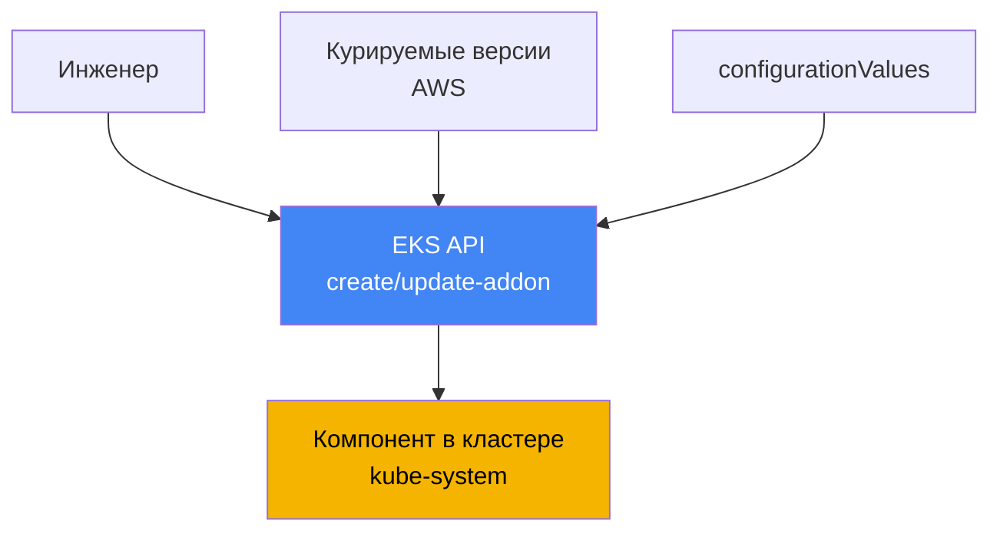
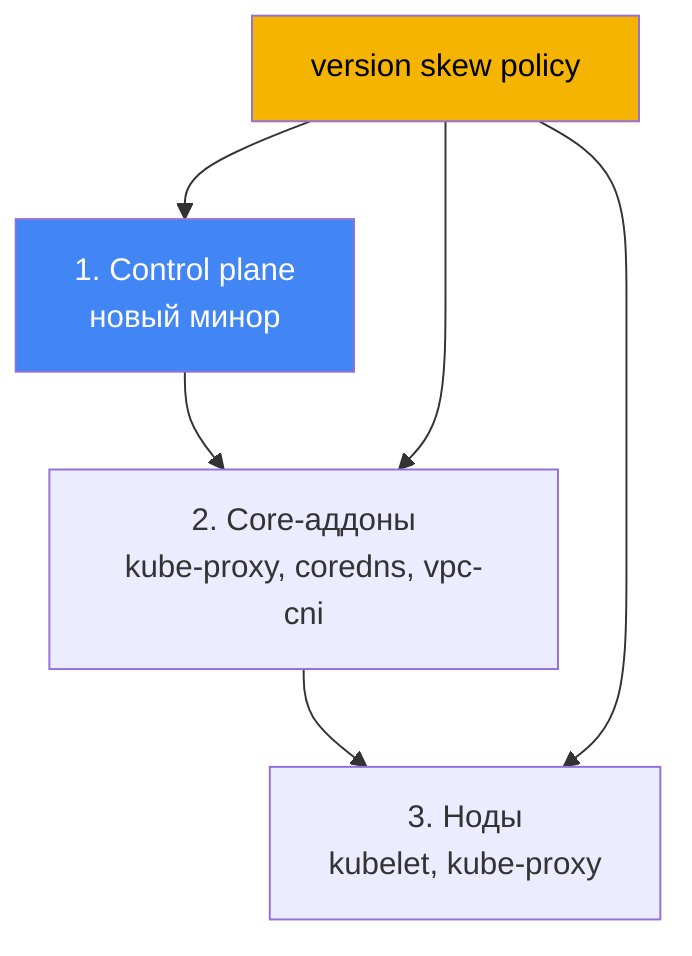

# Глава 37. Аддоны EKS: managed addons против Helm, версии и порядок обновления

> **Что дальше.** Этой главой открывается Часть 7 - эксплуатация кластера, который уже
> создан и работает. Первый вопрос эксплуатации: кто владеет жизненным циклом системных
> компонентов и как держать их версии в согласии с версией кластера. Здесь - управление
> аддонами и их версиями. Смежное отдано другим главам: полное обновление кластера по
> версиям - глава 38, откат версии - глава 39, конкретные аддоны разобраны в своих главах
> (VPC CNI - глава 8, EBS CSI - глава 23, Load Balancer Controller - глава 26,
> наблюдаемость - главы 33-36), роли для аддонов через IRSA и Pod Identity - главы 16 и 17.

## 37.1. «Обновили control plane, а CoreDNS остался старым»

Инженер обновил версию кластера: control plane переехал на новый минор, команда прошла без
ошибок, консоль показывает новую версию. Через день начинают сыпаться жалобы: часть подов не
резолвит имена, где-то рвётся сеть между сервисами. Дежурный смотрит, что стоит в
`kube-system`, и видит картину рассинхрона:

```bash
kubectl get pods -n kube-system -o wide | grep -E "coredns|kube-proxy|aws-node"
# coredns    образ старой версии
# kube-proxy образ, отставший от control plane на несколько миноров
# aws-node   (VPC CNI) тоже прежней версии
```

Control plane ушёл вперёд, а системные компоненты на нодах остались на версиях, с которыми
кластер жил до апгрейда. Это **version skew**: разрыв версий между control plane и
компонентами данных. kube-proxy и CoreDNS не обновляются сами вслед за control plane - их
версии надо поднимать отдельно, и до совместимых с новым минором. Пока это не сделано,
поведение непредсказуемое: DNS-резолвинг, балансировка через kube-proxy и сеть подов могут
ломаться частично и не сразу.

Второй вариант той же боли встречается даже без апгрейда - зоопарк способов установки. VPC
CNI поставлен как managed addon, CoreDNS кто-то переустановил Helm-чартом, kube-proxy правили
руками через `kubectl edit`, метрики-сервер приехал отдельным манифестом. Версии разъехались,
а на вопрос «кто отвечает за обновление вот этого компонента» никто в команде не отвечает
уверенно. При следующем апгрейде это превращается в квест: что обновлять командой AWS, что
через Helm, а что руками, и в каком порядке.

Обе ситуации - про одно: у системных компонентов кластера должен быть понятный владелец
жизненного цикла и предсказуемый порядок обновления. Ровно это и дают EKS managed addons.
Дальше по порядку: что такое managed addon, какие они бывают, чем отличаются от установки
Helm-ом, как разрешаются конфликты конфигурации, как аддону дают права в AWS и как version
skew диктует порядок обновления.

## 37.2. Что такое EKS managed addon

**EKS managed addon** (управляемый аддон) - это курируемый AWS системный компонент кластера,
установкой и обновлением которого управляют через EKS API, а не через Helm или голые
манифесты. AWS собирает аддон, включает в него свежие патчи безопасности и исправления,
тестирует на совместимость с версиями EKS и публикует набор версий. Инженер не тянет чарт и
не следит за апстримом - он выбирает версию аддона из проверенного списка.

Управление идёт через отдельные операции EKS API и их обёртки в CLI:

```bash
# поставить аддон нужной версии
aws eks create-addon --cluster-name my-cluster --addon-name coredns \
  --addon-version v1.11.1-eksbuild.4
# обновить до другой версии
aws eks update-addon --cluster-name my-cluster --addon-name coredns \
  --addon-version v1.11.3-eksbuild.1
# посмотреть, что стоит и в каком статусе
aws eks describe-addon --cluster-name my-cluster --addon-name coredns
```

Ключевых свойств три. Первое - **версии привязаны к версии кластера**: для каждой версии
аддона AWS указывает, с какими минорами Kubernetes она совместима, поэтому апгрейд аддона -
это не «взять latest», а «взять версию, совместимую с текущим минором». Второе - **аддон не
обновляется автоматически**: EKS не трогает версию аддона ни при выходе новых релизов, ни при
обновлении кластера на новый минор. Обновление всегда инициирует инженер. Третье - **настройку
можно задать декларативно** через поле `configurationValues`, не влезая в манифесты руками:

```bash
# передать настройки аддона как JSON (структура зависит от аддона)
aws eks update-addon --cluster-name my-cluster --addon-name coredns \
  --configuration-values '{"replicaCount":3}'
# какие ключи вообще принимает данная версия аддона
aws eks describe-addon-configuration --addon-name coredns \
  --addon-version v1.11.3-eksbuild.1
```



Смысл прост: между инженером и компонентом в кластере встаёт EKS API, который знает про
совместимость версий, хранит выбранную конфигурацию и умеет её применять предсказуемо.

## 37.3. Какие бывают аддоны и что ставится по умолчанию

Компоненты, которые AWS предлагает как managed addons, делятся по назначению. Ниже - основные,
с именами, как их принимает `--addon-name`:

| Категория | Аддоны | Что делает |
|---|---|---|
| Сеть (core) | `vpc-cni`, `kube-proxy` | IP подам через ENI; правила Service на нодах |
| DNS (core) | `coredns` | внутрикластерный DNS-резолвинг |
| Хранение | `aws-ebs-csi-driver`, `aws-efs-csi-driver`, `aws-mountpoint-s3-csi-driver` | тома EBS, EFS, S3 |
| Наблюдаемость | `amazon-cloudwatch-observability`, `adot` | метрики, логи, трейсы (главы 33-36) |
| Идентичность | `eks-pod-identity-agent` | агент Pod Identity (глава 17) |
| Прочее | `metrics-server`, `snapshot-controller` | метрики для HPA; снапшоты CSI |

Три компонента - `vpc-cni`, `kube-proxy`, `coredns` - называют **core-аддонами**: без них
кластер не работает как кластер (нет сети подов, нет балансировки Service, нет DNS). EKS
ставит их для каждого кластера всегда; вопрос лишь в том, будут они managed или self-managed.

Что именно приезжает при создании кластера, зависит от инструмента. Через консоль AWS ядро
(`kube-proxy`, `vpc-cni`, `coredns`) ставится сразу как managed addons. Через `eksctl` без
конфиг-файла (начиная с версии 0.184.0) ставятся те же три плюс `metrics-server`, тоже как
managed. Другими инструментами или более старым `eksctl` те же три компонента ставятся в
self-managed виде - их можно оставить на себе или потом перевести в managed. На EKS Auto Mode
часть этих функций встроена в саму платформу и обычными аддонами не управляется.

## 37.4. Managed addon против self-managed (Helm или манифест)

Не всё ставится как managed addon. Многие важные компоненты доступны только как Helm-чарт или
манифест: **AWS Load Balancer Controller** (глава 26), **external-dns** и **cert-manager**
(глава 29), **Karpenter** (глава 12). Для них жизненный цикл целиком на вас. А вот core-аддоны
и ряд драйверов доступны в обоих видах, и тут выбор осознанный.

| Критерий | Managed addon | Self-managed (Helm/манифест) |
|---|---|---|
| Владелец обновления | вы инициируете, применяет AWS | полностью вы |
| Выбор версий | курируемый список от AWS | любая версия из апстрима |
| Совместимость с кластером | проверена и заявлена AWS | проверяете сами |
| Конфигурация | `configurationValues` + поля в кластере | values чарта, полный контроль |
| Разрешение конфликтов | `resolveConflicts` в API | средствами Helm |
| Гибкость тонкой настройки | ограничена управляемыми полями | максимальная |
| Кто доступен | ядро, CSI, наблюдаемость и др. | что угодно, включая только-Helm |

Правило выбора практичное: то, что есть как managed addon и не требует экзотической настройки,
берут как managed - меньше ручной работы, заявленная совместимость, предсказуемый апгрейд.
Там, где нужна версия или конфигурация, которых нет в курируемом наборе, или компонент вовсе
не выпускается как аддон, идут через Helm и берут жизненный цикл на себя. Смешивать оба
способа для одного компонента - как раз тот зоопарк из раздела 37.1, которого избегают.

## 37.5. Разрешение конфликтов: resolveConflicts и владение полями

Managed addon применяет конфигурацию в кластер через механизм server-side apply, и часть
полей объявляет своими (managed fields). Если те же поля кто-то правил руками или Helm-ом,
при create/update возникает конфликт. Как с ним поступить, задаёт поле **`resolveConflicts`**
(флаг `--resolve-conflicts`):

| Значение | Поведение | Когда уместно |
|---|---|---|
| `NONE` | при конфликте операция падает с ошибкой | безопасный дефолт, разобрать вручную |
| `OVERWRITE` | чужие изменения перезаписываются дефолтами EKS | вернуть аддон к эталону |
| `PRESERVE` | ваши правки полей сохраняются | есть намеренные кастомизации |

Логика такая. `NONE` ничего не ломает молча: увидев конфликт, EKS вернёт ошибку с описанием, и
вы решите сами. `OVERWRITE` говорит «источник истины - EKS»: все настройки приводятся к
дефолтам аддона, и ваши ручные правки теряются. `PRESERVE` говорит «мои изменения намеренные»:
EKS не трогает поля, которые вы настроили, и накатывает остальное.

Отдельный частый сценарий - **перевод в managed того, что раньше жило как self-managed**. Вы
поставили CoreDNS Helm-ом, потом решили отдать его под управление EKS через `create-addon`.
Если не указать `--resolve-conflicts OVERWRITE`, установка упадёт на конфликте с уже
существующими объектами. С `OVERWRITE` EKS заберёт владение и приведёт конфигурацию к своим
дефолтам - поэтому кастомные настройки, которые вам нужны, надо заранее переложить в
`configurationValues`, иначе они пропадут. Какие именно поля можно менять, не вступая в
конфликт с управляемыми, описано в документации по field management для аддонов.

## 37.6. Права аддону: IRSA или Pod Identity

Некоторым аддонам нужны права в AWS: VPC CNI настраивает сетевые ресурсы, EBS CSI создаёт и
цепляет тома, ADOT шлёт телеметрию. Права дают не ключами, а IAM-ролью, привязанной к
ServiceAccount аддона. Два механизма разобраны в главах 16 и 17: **IRSA** (роль через
OIDC-провайдер) и **EKS Pod Identity** (ассоциация через агента). AWS рекомендует для аддонов
Pod Identity, но IRSA поддерживается.

Удобство managed addon в том, что роль или ассоциацию можно задать прямо в операции с аддоном,
одним вызовом, без отдельных ручных шагов:

```bash
# IRSA: указать ARN роли для service account аддона
aws eks update-addon --cluster-name my-cluster --addon-name aws-ebs-csi-driver \
  --service-account-role-arn arn:aws:iam::111122223333:role/ebs-csi-role
# Pod Identity: создать ассоциацию вместе с аддоном
aws eks update-addon --cluster-name my-cluster --addon-name aws-ebs-csi-driver \
  --pod-identity-associations 'serviceAccount=ebs-csi-controller-sa,roleArn=arn:aws:iam::111122223333:role/ebs-csi-role'
```

Несколько важных деталей. Понять, нужны ли аддону права вообще, помогает флаг
`requiresIamPermissions` в выводе `describe-addon-versions`, а предлагаемую политику
показывает `describe-addon-configuration`. Ассоциации Pod Identity, созданные через API
аддона, принадлежат аддону: удалите аддон - удалится и ассоциация (это можно предотвратить
опцией preserve при удалении). Если для аддона заданы и `serviceAccountRoleArn` (IRSA), и Pod
Identity, и агент Pod Identity установлен, EKS использует Pod Identity, а IRSA игнорирует.
Обновление ассоциаций у существующего аддона вызывает перезапуск его подов.

## 37.7. Version skew и порядок обновления

Почему в разделе 37.1 всё сломалось, объясняет **version skew policy** самого Kubernetes. Она
задаёт, насколько версии компонентов могут расходиться с версией kube-apiserver (то есть
control plane). Главное правило: компоненты на нодах не должны быть новее API-сервера и могут
отставать лишь на ограниченное число миноров.

| Компонент | Правило относительно kube-apiserver |
|---|---|
| kubelet | не новее API-сервера; отставание до 3 миноров (для 1.25+) |
| kube-proxy | не новее API-сервера; отставание в тех же пределах |
| CoreDNS | не часть version skew policy, но версия должна быть совместима с минором |

Отсюда прямое следствие для эксплуатации: обновление кластера - это не одна команда, а
последовательность в правильном порядке. Сначала поднимают **control plane** на новый минор.
Затем обновляют **core-аддоны** (`kube-proxy`, `coredns`, `vpc-cni`) до версий, совместимых с
этим минором, - именно этот шаг забыли в разделе 37.1. И только потом обновляют **ноды**
(kubelet). Такой порядок держит все версии в границах policy на каждом шаге. Подробно весь
процесс апгрейда - в главе 38.



Совместимую версию аддона не угадывают, а спрашивают у API. `describe-addon-versions` для
заданного минора Kubernetes возвращает список версий аддона, поле `compatibilities` с
`clusterVersion` и отметку `defaultVersion` - рекомендованную по умолчанию:

```bash
# какие версии coredns совместимы с кластером 1.33
aws eks describe-addon-versions --addon-name coredns --kubernetes-version 1.33 \
  --query 'addons[].addonVersions[].{Version:addonVersion,Default:compatibilities[0].defaultVersion}'
```

Практика при апгрейде: для нового минора взять из этого вывода совместимую (обычно
`defaultVersion`) версию каждого core-аддона и обновить их сразу после control plane, до
перекатки нод. Тогда version skew не выходит за границы, и симптомов из раздела 37.1 не
возникает.

## 37.8. Как это применяют в продакшене

- **Ядро держат как managed addons, а не руками.** `vpc-cni`, `kube-proxy`, `coredns` под
  управлением EKS дают заявленную совместимость и предсказуемый апгрейд; ручные правки и
  параллельный Helm для них не разводят.
- **Версии аддонов фиксируют явно, не берут latest вслепую.** Перед апгрейдом сверяются с
  `describe-addon-versions` для нужного минора и выбирают совместимую версию, чаще
  `defaultVersion`.
- **Настройку держат в `configurationValues`, а не в ручных правках.** Тогда `resolveConflicts`
  предсказуем, а перевод компонента в managed не теряет кастомизации.
- **`resolveConflicts` выбирают осознанно.** `PRESERVE` там, где есть намеренные правки;
  `OVERWRITE` при возврате к эталону и при захвате self-managed компонента; `NONE` как
  безопасный дефолт, чтобы конфликт всплыл ошибкой, а не молча.
- **Права аддонам дают ролью через Pod Identity или IRSA (главы 16 и 17)**, задавая ассоциацию
  прямо в операции с аддоном, а не отдельными ручными шагами.
- **Апгрейд идут по порядку version skew:** control plane, затем core-аддоны до совместимых
  версий, затем ноды (глава 38). Аддоны не забывают - иначе рассинхрон ломает сеть и DNS.

## 37.9. Мини-глоссарий

- **EKS managed addon** - курируемый AWS компонент кластера, управляемый через EKS API
  (`create-addon`, `update-addon`) с заявленной совместимостью и патчами от AWS.
- **self-managed addon** - компонент, установленный Helm-ом или манифестом; жизненный цикл и
  совместимость целиком на инженере.
- **core-аддоны** - `vpc-cni`, `kube-proxy`, `coredns`: обязательное ядро, ставится для каждого
  кластера.
- **configurationValues** - поле аддона для декларативной настройки без ручной правки
  манифестов.
- **resolveConflicts** - как аддон поступает при конфликте полей: `NONE`, `OVERWRITE`,
  `PRESERVE`.
- **managed fields / server-side apply** - механизм, которым аддон объявляет и применяет свои
  поля; на нём основано разрешение конфликтов.
- **version skew** - разрыв версий между control plane и компонентами на нодах; ограничен
  version skew policy Kubernetes.
- **describe-addon-versions** - операция EKS API: версии аддона, их совместимость с минором
  Kubernetes и `defaultVersion`.
- **Pod Identity association** - привязка ServiceAccount аддона к IAM-роли; для аддонов
  рекомендованный способ выдачи прав (глава 17).

## 37.10. Итоги главы

- После обновления control plane core-аддоны (`kube-proxy`, `coredns`, `vpc-cni`) не
  обновляются сами; забытый шаг даёт version skew и ломает DNS и сеть подов.
- EKS managed addon - курируемый AWS компонент, управляемый через EKS API; AWS даёт патчи,
  тестирует совместимость и публикует список версий.
- Аддон не обновляется автоматически (ни при новых релизах, ни при апгрейде кластера) -
  обновление всегда инициирует инженер; настройка задаётся через `configurationValues`.
- Ядро (`vpc-cni`, `kube-proxy`, `coredns`) ставится для каждого кластера; консоль и свежий
  `eksctl` ставят его как managed, прочие инструменты - как self-managed.
- Часть компонентов доступна только как Helm (Load Balancer Controller, external-dns,
  cert-manager, Karpenter); для них жизненный цикл полностью на вас.
- `resolveConflicts` управляет конфликтами полей: `NONE` (падать), `OVERWRITE` (дефолты EKS),
  `PRESERVE` (сохранить ваши правки); при переводе self-managed в managed нужен `OVERWRITE`.
- Права аддону дают ролью через Pod Identity или IRSA (главы 16 и 17), задавая ассоциацию прямо
  в операции с аддоном; при обоих способах и установленном агенте побеждает Pod Identity.
- Version skew policy диктует порядок апгрейда: control plane, затем core-аддоны до совместимых
  версий (по `describe-addon-versions`), затем ноды (глава 38).

## 37.11. Как это пригодится в реальной работе

На дежурстве симптом «после апгрейда отвалился DNS или сеть» первым делом проверяют не в
приложениях, а в `kube-system`: сверяют версии `coredns`, `kube-proxy`, `aws-node` с версией
кластера. Если аддоны отстали от control plane, их поднимают до совместимых версий - и в
большинстве случаев это и есть починка. Понимание, что аддоны не едут за control plane
автоматически, экономит часы гадания «почему после успешного апгрейда всё сломалось».

При планировании эксплуатации решают две вещи. Первое - реестр владения: для каждого
системного компонента зафиксировать, managed он или Helm, и кто отвечает за его версию, чтобы
не разводить зоопарк. Второе - процедура апгрейда: перед обновлением минора собрать по
`describe-addon-versions` совместимые версии core-аддонов и встроить их обновление в
последовательность control plane - аддоны - ноды (глава 38). Тогда version skew никогда не
выходит за границы, а обновления перестают быть источником сюрпризов.

## 37.12. Вопросы для самопроверки

1. Почему после обновления control plane CoreDNS и kube-proxy могут остаться старых версий и
   к чему это приводит?
2. Что такое EKS managed addon и чем управление им отличается от установки Helm-ом?
3. Обновляется ли managed addon автоматически при апгрейде кластера? Кто инициирует
   обновление?
4. Какие три компонента называют core-аддонами и что ставится по умолчанию при создании
   кластера через консоль и через `eksctl`?
5. Какие компоненты доступны только как Helm и почему их не взять как managed addon?
6. Что делают значения `resolveConflicts` - `NONE`, `OVERWRITE`, `PRESERVE`?
7. Что произойдёт при переводе self-managed CoreDNS в managed без `--resolve-conflicts
   OVERWRITE` и как не потерять кастомную конфигурацию?
8. Как аддону выдают права в AWS и что побеждает, если заданы и IRSA, и Pod Identity?
9. Кому принадлежит Pod Identity association, созданная через API аддона, и что с ней при
   удалении аддона?
10. Что говорит version skew policy про компоненты на нодах относительно kube-apiserver?
11. В каком порядке обновляют control plane, core-аддоны и ноды и почему именно так?
12. Как узнать версию аддона, совместимую с конкретным минором Kubernetes?

## Практика

Своей лабы у главы пока нет, но состояние аддонов и их версий легко снять на живом кластере.
Сначала посмотрите, что установлено как managed addon и в каком статусе:

```bash
# список managed addons кластера
aws eks list-addons --cluster-name my-cluster
# статус, версия и роль конкретного аддона
aws eks describe-addon --cluster-name my-cluster --addon-name coredns \
  --query 'addon.{Version:addonVersion,Status:status,Role:serviceAccountRoleArn}'
```

Затем сверьте версии core-компонентов в кластере с версией самого кластера и с тем, какие
версии аддонов совместимы с вашим минором:

```bash
# версия кластера
aws eks describe-cluster --cluster-name my-cluster --query 'cluster.version'
# образы core-компонентов, реально бегущих в kube-system
kubectl get pods -n kube-system -o wide | grep -E "coredns|kube-proxy|aws-node"
# совместимые версии аддона для минора кластера (подставьте свой)
aws eks describe-addon-versions --addon-name kube-proxy --kubernetes-version 1.33 \
  --query 'addons[].addonVersions[].{Version:addonVersion,Default:compatibilities[0].defaultVersion}'
```

Сопоставьте три вещи: версию кластера, реальные версии `coredns`, `kube-proxy` и `aws-node`
в подах, и совместимый набор из `describe-addon-versions`. Если core-аддоны отстали от
control plane - это тот самый version skew из раздела 37.1, и обновление кластера в главе 38
начнётся именно с приведения аддонов к совместимым версиям.

---
[Оглавление](../README_RU.md) · [Глава 36](../36/ru.md) · [Глава 38](../38/ru.md)
