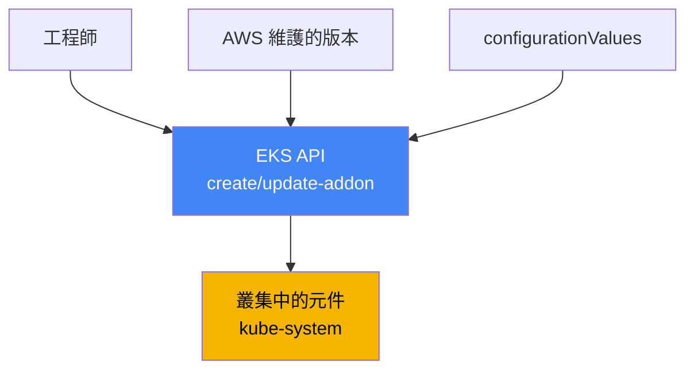
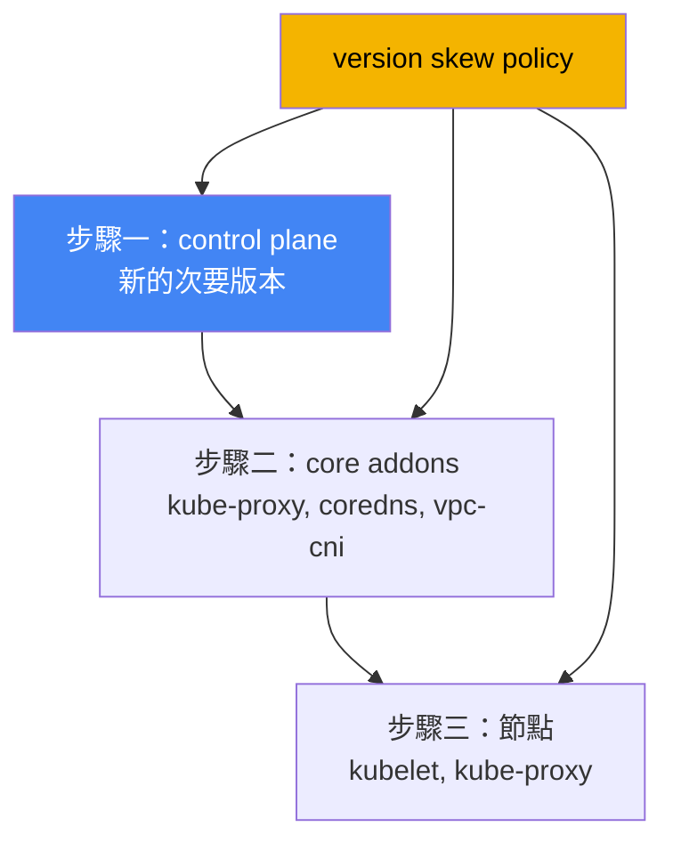

[Русская версия](ru.md) · [Eng version](en.md) · [Versión en español](es.md) · [Version française](fr.md) · [Deutsche Version](de.md) · [ქართული ვერსია](ge.md) · [日本語版](jp.md)
# 第 37 章。EKS 附加元件：受管附加元件與 Helm、版本及更新順序

> **接下來。** 本章開啟第 7 部分，即已建立並運作中叢集的營運。營運的第一個問題是：誰擁有系統元件的生命週期，以及如何讓其版本與叢集版本保持一致。本章說明附加元件及其版本的管理。相關內容交由其他章節介紹：依版本完整升級叢集見第 38 章，回復版本見第 39 章，特定附加元件分別見各自章節（VPC CNI 見第 8 章、EBS CSI 見第 23 章、Load Balancer Controller 見第 26 章、可觀測性見第 33 至 36 章），透過 IRSA 與 Pod Identity 為附加元件授權見第 16 與 17 章。

## 37.1.「control plane 已更新，但 CoreDNS 仍是舊版」

工程師更新了叢集版本：control plane 升級到新的次要版本，指令執行成功，主控台顯示新版本。一天後，抱怨開始湧入：部分 Pod 無法解析名稱，某些地方的 Service 間網路中斷。值班人員查看 `kube-system` 中運作的內容，發現版本不同步：

```bash
kubectl get pods -n kube-system -o wide | grep -E "coredns|kube-proxy|aws-node"
# coredns    舊版映像檔
# kube-proxy 映像檔比 control plane 落後數個次要版本
# aws-node   (VPC CNI) 也是舊版
```

control plane 已向前升級，但節點上的系統元件仍使用叢集升級前的版本。這是 **version skew**：control plane 與資料元件之間的版本落差。kube-proxy 和 CoreDNS 不會隨 control plane 自行更新，必須另外升級到與新次要版本相容的版本。在完成前，行為並不可靠：DNS 解析、經由 kube-proxy 的負載平衡及 Pod 網路可能部分失效，而且不一定立即發生。

即使沒有升級，也可能遭遇同樣的痛點，也就是安裝方式的雜亂集合。VPC CNI 安裝為受管附加元件，某人以 Helm chart 重新安裝 CoreDNS，以 `kubectl edit` 手動修改 kube-proxy，metrics-server 則透過獨立 manifest 部署。版本逐漸分歧，且團隊中沒有人能有把握地回答「誰負責更新這個元件」。下一次升級時，這會變成一項難題：哪些要用 AWS 指令更新，哪些要經由 Helm 更新，哪些要手動處理，以及採用何種順序。

兩種情況的核心相同：叢集系統元件必須有明確的生命週期擁有者與可預測的更新順序。這正是 EKS managed addons 所提供的能力。接下來依序說明：managed addon 是什麼、有哪幾種、與 Helm 安裝有何不同、如何解決設定衝突、如何授予附加元件 AWS 權限，以及 version skew 如何決定更新順序。

## 37.2. 什麼是 EKS managed addon

**EKS managed addon**（受管附加元件）是由 AWS 維護的叢集系統元件，其安裝與更新透過 EKS API 管理，而非 Helm 或純 manifest。AWS 建置附加元件，將最新安全修補與修正納入其中，測試其與 EKS 版本的相容性，並發布一組版本。工程師不必下載 chart 或追蹤上游版本，而是從已驗證清單中選擇附加元件版本。

管理透過獨立的 EKS API 操作及其 CLI 包裝器進行：

```bash
# 安裝指定版本的附加元件
aws eks create-addon --cluster-name my-cluster --addon-name coredns \
  --addon-version v1.11.1-eksbuild.4
# 更新至另一個版本
aws eks update-addon --cluster-name my-cluster --addon-name coredns \
  --addon-version v1.11.3-eksbuild.1
# 查看已安裝內容及其狀態
aws eks describe-addon --cluster-name my-cluster --addon-name coredns
```

有三項關鍵特性。第一，**版本與叢集版本綁定**：AWS 會針對每個附加元件版本指出其相容的 Kubernetes 次要版本，因此附加元件升級不是「取得 latest」，而是「取得與目前次要版本相容的版本」。第二，**附加元件不會自動更新**：無論發布新版本或將叢集升級至新的次要版本，EKS 都不會變更附加元件版本。更新始終由工程師發起。第三，**可宣告式指定設定**，透過 `configurationValues` 欄位，而不用手動修改 manifest：

```bash
# 將附加元件設定作為 JSON 傳入（結構視附加元件而定）
aws eks update-addon --cluster-name my-cluster --addon-name coredns \
  --configuration-values '{"replicaCount":3}'
# 此附加元件版本接受哪些鍵
aws eks describe-addon-configuration --addon-name coredns \
  --addon-version v1.11.3-eksbuild.1
```



概念很簡單：EKS API 位於工程師與叢集元件之間，知道版本相容性、儲存所選設定，並能以可預測方式套用設定。

## 37.3. 有哪些附加元件，以及預設安裝哪些

AWS 作為 managed addons 提供的元件可依用途分類。以下列出主要項目，以及 `--addon-name` 接受的名稱：

| 類別 | 附加元件 | 功能 |
|---|---|---|
| 網路（核心） | `vpc-cni`, `kube-proxy` | 透過 ENI 為 Pod 提供 IP；節點上的 Service 規則 |
| DNS（核心） | `coredns` | 叢集內 DNS 解析 |
| 儲存 | `aws-ebs-csi-driver`, `aws-efs-csi-driver`, `aws-mountpoint-s3-csi-driver` | EBS、EFS、S3 磁碟區 |
| 可觀測性 | `amazon-cloudwatch-observability`, `adot` | 指標、日誌、trace（第 33 至 36 章） |
| 身分 | `eks-pod-identity-agent` | Pod Identity agent（第 17 章） |
| 其他 | `metrics-server`, `snapshot-controller` | HPA 指標；CSI 快照 |

三個元件，即 `vpc-cni`、`kube-proxy`、`coredns`，稱為 **core addons**：沒有它們，叢集無法作為叢集運作（沒有 Pod 網路、沒有 Service 負載平衡、沒有 DNS）。EKS 一律會為每個叢集安裝它們，差別僅在於它們是 managed 還是 self-managed。

建立叢集時具體安裝哪些內容取決於工具。透過 AWS 主控台，核心元件（`kube-proxy`、`vpc-cni`、`coredns`）會立即作為 managed addons 安裝。使用沒有設定檔的 `eksctl`（從 0.184.0 版開始），同樣會安裝這三個元件及 `metrics-server`，也都作為 managed addons。其他工具或較舊的 `eksctl` 會以 self-managed 形式安裝相同三個元件，您可以自行維護，或日後轉為 managed。在 EKS Auto Mode 中，部分此類功能內建於平台本身，並非透過一般附加元件管理。

## 37.4. Managed addon 與 self-managed（Helm 或 manifest）

並非所有項目都能以 managed addon 安裝。許多重要元件僅提供 Helm chart 或 manifest，例如 **AWS Load Balancer Controller**（第 26 章）、**external-dns** 與 **cert-manager**（第 29 章）、**Karpenter**（第 12 章）。這些元件的生命週期完全由您負責。然而，core addons 與部分驅動程式皆可採用兩種形式，因此此處需有意識地選擇。

| 準則 | Managed addon | Self-managed（Helm/manifest） |
|---|---|---|
| 更新擁有者 | 您發起，由 AWS 套用 | 完全由您負責 |
| 版本選擇 | AWS 維護的清單 | 上游的任何版本 |
| 與叢集的相容性 | 由 AWS 測試並聲明 | 自行驗證 |
| 設定 | `configurationValues` + 叢集欄位 | chart values，完整控制 |
| 衝突解決 | API 中的 `resolveConflicts` | Helm 機制 |
| 細部設定彈性 | 受管理欄位限制 | 最高 |
| 可用內容 | 核心、CSI、可觀測性等 | 任何項目，包括僅限 Helm 的項目 |

選擇原則很實際：以 managed addon 提供且不需要特殊設定的元件，就採用 managed，因為手動工作更少、相容性已聲明、升級可預測。若需要維護集合中未提供的版本或設定，或者該元件根本未作為 addon 發布，就使用 Helm 並自行承擔生命週期。同一元件混用兩種方式，正是 37.1 節應避免的雜亂集合。

## 37.5. 解決衝突：resolveConflicts 與欄位擁有權

Managed addon 透過 server-side apply 機制在叢集中套用設定，並將部分欄位宣告為自己的欄位（managed fields）。若有人以手動方式或 Helm 修改相同欄位，create/update 時便會發生衝突。處理方式由 **`resolveConflicts`** 欄位（`--resolve-conflicts` 旗標）指定：

| 值 | 行為 | 適用時機 |
|---|---|---|
| `NONE` | 發生衝突時操作失敗並回報錯誤 | 安全預設值，手動處理 |
| `OVERWRITE` | 其他變更被 EKS 預設值覆寫 | 將附加元件還原為標準狀態 |
| `PRESERVE` | 保留您對欄位的修改 | 存在有意的客製化 |

邏輯如下。`NONE` 不會默默破壞任何內容：發現衝突時，EKS 會回傳附帶說明的錯誤，讓您自行決定。`OVERWRITE` 表示「EKS 是真實來源」：所有設定都恢復為附加元件預設值，而手動修改會遺失。`PRESERVE` 表示「我的變更是刻意的」：EKS 不會變更您設定的欄位，並套用其餘內容。

另一種常見情境是 **將原本 self-managed 的元件轉為 managed**。您使用 Helm 安裝 CoreDNS，之後決定以 `create-addon` 將其交由 EKS 管理。若未指定 `--resolve-conflicts OVERWRITE`，安裝會因既有物件的衝突而失敗。使用 `OVERWRITE` 時，EKS 會取得擁有權並將設定還原為其預設值，因此必須預先將需要的自訂設定放入 `configurationValues`，否則它們會遺失。可在不與 managed 欄位衝突的情況下修改哪些欄位，請參閱附加元件 field management 文件。

## 37.6. 附加元件的權限：IRSA 或 Pod Identity

有些附加元件需要 AWS 權限：VPC CNI 設定網路資源，EBS CSI 建立並掛載磁碟區，ADOT 傳送遙測資料。權限不是以金鑰授予，而是以與附加元件 ServiceAccount 關聯的 IAM role 授予。有兩種機制，已在第 16 與 17 章說明：**IRSA**（透過 OIDC provider 的 role）與 **EKS Pod Identity**（透過 agent 的 association）。AWS 建議對附加元件使用 Pod Identity，但仍支援 IRSA。

Managed addon 的便利之處在於，可在附加元件操作中直接指定 role 或 association，一次呼叫完成，無須額外手動步驟：

```bash
# IRSA：為附加元件的 service account 指定 role ARN
aws eks update-addon --cluster-name my-cluster --addon-name aws-ebs-csi-driver \
  --service-account-role-arn arn:aws:iam::111122223333:role/ebs-csi-role
# Pod Identity：隨附加元件建立 association
aws eks update-addon --cluster-name my-cluster --addon-name aws-ebs-csi-driver \
  --pod-identity-associations 'serviceAccount=ebs-csi-controller-sa,roleArn=arn:aws:iam::111122223333:role/ebs-csi-role'
```

有幾項重要細節。`describe-addon-versions` 輸出中的 `requiresIamPermissions` 旗標可協助判斷附加元件是否需要權限，而 `describe-addon-configuration` 顯示建議的政策。透過 addon API 建立的 Pod Identity associations 屬於附加元件：刪除 addon 時 association 也會被刪除（刪除時可用 preserve 選項避免）。若附加元件同時設定 `serviceAccountRoleArn`（IRSA）與 Pod Identity，且已安裝 Pod Identity agent，EKS 會使用 Pod Identity 並忽略 IRSA。更新既有 addon 的 associations 會造成其 Pod 重新啟動。

## 37.7. Version skew 與更新順序

37.1 節中為何會出現故障，可由 Kubernetes 本身的 **version skew policy** 解釋。它定義元件版本與 kube-apiserver（亦即 control plane）版本可相差多少。主要規則是：節點上的元件不得比 API server 新，且只能落後有限個次要版本。

| 元件 | 相對於 kube-apiserver 的規則 |
|---|---|
| kubelet | 不得比 API server 新；最多落後 3 個次要版本（適用於 1.25+） |
| kube-proxy | 不得比 API server 新；落後範圍相同 |
| CoreDNS | 不屬於 version skew policy，但版本必須與次要版本相容 |

這對營運有直接影響：叢集更新不是單一指令，而是必須依正確順序執行。先將 **control plane** 升級至新的次要版本。接著，將 **core addons**（`kube-proxy`、`coredns`、`vpc-cni`）更新至與該次要版本相容的版本，這正是 37.1 節被遺漏的步驟。最後才更新**節點**（kubelet）。這個順序可使每一步的所有版本都保持在 policy 界限內。完整升級流程請見第 38 章。



不應猜測相容的附加元件版本，而應向 API 查詢。針對指定 Kubernetes 次要版本，`describe-addon-versions` 會回傳附加元件版本清單、含有 `clusterVersion` 的 `compatibilities` 欄位，以及標記為 `defaultVersion` 的預設建議版本：

```bash
# 哪些 coredns 版本與叢集 1.33 相容
aws eks describe-addon-versions --addon-name coredns --kubernetes-version 1.33 \
  --query 'addons[].addonVersions[].{Version:addonVersion,Default:compatibilities[0].defaultVersion}'
```

升級時的作法是：針對新的次要版本，從此輸出選擇每個 core addon 相容的版本（通常是 `defaultVersion`），並在 control plane 升級後、輪替節點前立即更新。如此 version skew 不會超出界限，也不會出現 37.1 節的症狀。

## 37.8. 如何在生產環境中套用

- **將核心作為 managed addons 管理，而非手動管理。** 在 EKS 管理下的 `vpc-cni`、`kube-proxy`、`coredns` 提供已聲明的相容性及可預測的升級；避免對其進行手動修改或平行使用 Helm。
- **明確固定附加元件版本，不要盲目使用 latest。** 升級前，針對目標次要版本檢查 `describe-addon-versions`，選擇相容版本，通常為 `defaultVersion`。
- **將設定保留於 `configurationValues`，而不是手動修改。** 如此 `resolveConflicts` 可預測，且元件轉為 managed 時不會遺失客製化。
- **有意識地選擇 `resolveConflicts`。** 有刻意修改時使用 `PRESERVE`；回復標準狀態及接管 self-managed 元件時使用 `OVERWRITE`；以 `NONE` 作為安全預設值，使衝突透過錯誤浮現而非默默發生。
- **透過 Pod Identity 或 IRSA（第 16 與 17 章）為附加元件授予 role**，直接在附加元件操作中指定 association，而非執行獨立的手動步驟。
- **遵循 version skew 的升級順序：** control plane，接著升級 core addons 至相容版本，最後是節點（第 38 章）。不要遺漏 addons，否則版本不同步會破壞網路與 DNS。

## 37.9. 小型詞彙表

- **EKS managed addon**：由 AWS 維護、透過 EKS API（`create-addon`、`update-addon`）管理的叢集元件，具有 AWS 聲明的相容性與修補程式。
- **self-managed addon**：以 Helm 或 manifest 安裝的元件；生命週期與相容性完全由工程師負責。
- **core addons**：`vpc-cni`、`kube-proxy`、`coredns`：每個叢集都會安裝的必要核心。
- **configurationValues**：附加元件用於宣告式設定的欄位，不必手動修改 manifest。
- **resolveConflicts**：附加元件如何處理欄位衝突：`NONE`、`OVERWRITE`、`PRESERVE`。
- **managed fields / server-side apply**：附加元件宣告與套用其欄位的機制，是衝突解決的基礎。
- **version skew**：control plane 與節點元件之間的版本落差；受 Kubernetes version skew policy 限制。
- **describe-addon-versions**：EKS API 操作：提供附加元件版本、其與 Kubernetes 次要版本的相容性及 `defaultVersion`。
- **Pod Identity association**：將附加元件的 ServiceAccount 關聯至 IAM role；附加元件建議採用的授權方式（第 17 章）。

## 37.10. 本章總結

- control plane 更新後，core addons（`kube-proxy`、`coredns`、`vpc-cni`）不會自行更新；遺漏此步驟會產生 version skew 並破壞 DNS 與 Pod 網路。
- EKS managed addon 是透過 EKS API 管理、由 AWS 維護的元件；AWS 提供修補程式、測試相容性並發布版本清單。
- 附加元件不會自動更新（無論是發布新版本或叢集升級時），更新始終由工程師發起；設定透過 `configurationValues` 指定。
- 核心元件（`vpc-cni`、`kube-proxy`、`coredns`）會為每個叢集安裝；主控台和較新的 `eksctl` 將其作為 managed 安裝，其他工具則作為 self-managed 安裝。
- 部分元件僅提供 Helm 形式（Load Balancer Controller、external-dns、cert-manager、Karpenter）；其生命週期完全由您負責。
- `resolveConflicts` 管理欄位衝突：`NONE`（失敗）、`OVERWRITE`（EKS 預設值）、`PRESERVE`（保留您的修改）；將 self-managed 轉為 managed 時需要 `OVERWRITE`。
- 透過 Pod Identity 或 IRSA（第 16 與 17 章）以 role 為附加元件授權，並直接在 addon 操作中指定 association；若同時使用兩種方式且已安裝 agent，Pod Identity 優先。
- Version skew policy 決定升級順序：control plane，接著將 core addons 更新至相容版本（依 `describe-addon-versions`），最後更新節點（第 38 章）。

## 37.11. 這如何應用於實際工作

值班時出現「升級後 DNS 或網路失效」的症狀，首要檢查的不是應用程式，而是 `kube-system`：比對 `coredns`、`kube-proxy`、`aws-node` 的版本與叢集版本。若 addons 落後於 control plane，就將其升級至相容版本，多數情況下這就是修復方式。理解 addons 不會自動隨 control plane 升級，可節省數小時猜測「為何成功升級後一切都壞了」。

規劃營運時要決定兩件事。第一是擁有權登錄：針對每個系統元件，明確記錄其為 managed 或 Helm，以及誰負責其版本，避免形成雜亂集合。第二是升級程序：更新次要版本前，透過 `describe-addon-versions` 收集 core addons 的相容版本，並將其更新納入 control plane、addons、節點的順序中（第 38 章）。如此 version skew 永遠不會超出界限，而更新不再成為意外的來源。

## 37.12. 自我檢查問題

1. control plane 更新後，為何 CoreDNS 與 kube-proxy 可能仍是舊版，且會導致什麼結果？
2. 什麼是 EKS managed addon，其管理方式與 Helm 安裝有何不同？
3. 叢集升級時，managed addon 會自動更新嗎？誰會發起更新？
4. 哪三個元件稱為 core addons？透過主控台及 `eksctl` 建立叢集時，預設安裝什麼？
5. 哪些元件僅能透過 Helm 取得，為何無法將其作為 managed addon 使用？
6. `resolveConflicts` 的 `NONE`、`OVERWRITE`、`PRESERVE` 分別執行什麼操作？
7. 將 self-managed CoreDNS 轉為 managed 而未指定 `--resolve-conflicts OVERWRITE` 時會發生什麼？如何避免遺失自訂設定？
8. 如何為 addon 授予 AWS 權限？若同時設定 IRSA 與 Pod Identity，何者優先？
9. 透過 addon API 建立的 Pod Identity association 屬於誰？刪除 addon 時會如何？
10. version skew policy 對節點元件相對於 kube-apiserver 有何規定？
11. control plane、core addons 與節點應以何種順序更新，原因為何？
12. 如何取得與特定 Kubernetes 次要版本相容的 addon 版本？

## 實作練習

本課程相關實驗：[實驗 113 - 叢集升級與回復：control plane、addons、已淘汰的 API](../../labs/113/README_TW.MD)。除此之外，也很容易在運作中的叢集上擷取 addons 及其版本的狀態。先查看哪些項目作為 managed addons 安裝，以及其狀態：

```bash
# 叢集的 managed addons 清單
aws eks list-addons --cluster-name my-cluster
# 特定 addon 的狀態、版本與 role
aws eks describe-addon --cluster-name my-cluster --addon-name coredns \
  --query 'addon.{Version:addonVersion,Status:status,Role:serviceAccountRoleArn}'
```

接著，將叢集中 core 元件的版本與叢集本身的版本，以及與您的次要版本相容的 addon 版本進行比對：

```bash
# 叢集版本
aws eks describe-cluster --cluster-name my-cluster --query 'cluster.version'
# 實際在 kube-system 中運作的 core 元件映像檔
kubectl get pods -n kube-system -o wide | grep -E "coredns|kube-proxy|aws-node"
# 與叢集次要版本相容的 addon 版本（請替換為您的版本）
aws eks describe-addon-versions --addon-name kube-proxy --kubernetes-version 1.33 \
  --query 'addons[].addonVersions[].{Version:addonVersion,Default:compatibilities[0].defaultVersion}'
```

比對三項內容：叢集版本、Pod 中 `coredns`、`kube-proxy` 與 `aws-node` 的實際版本，以及 `describe-addon-versions` 提供的相容集合。若 core addons 落後於 control plane，這正是 37.1 節所述的 version skew，而第 38 章的叢集升級正是從使 addons 達到相容版本開始。

---
[目錄](../README_TW.md) · [第 36 章](../36/tw.md) · [第 38 章](../38/tw.md)
