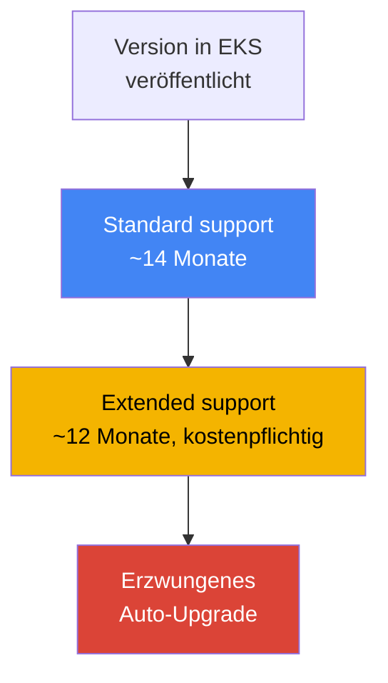
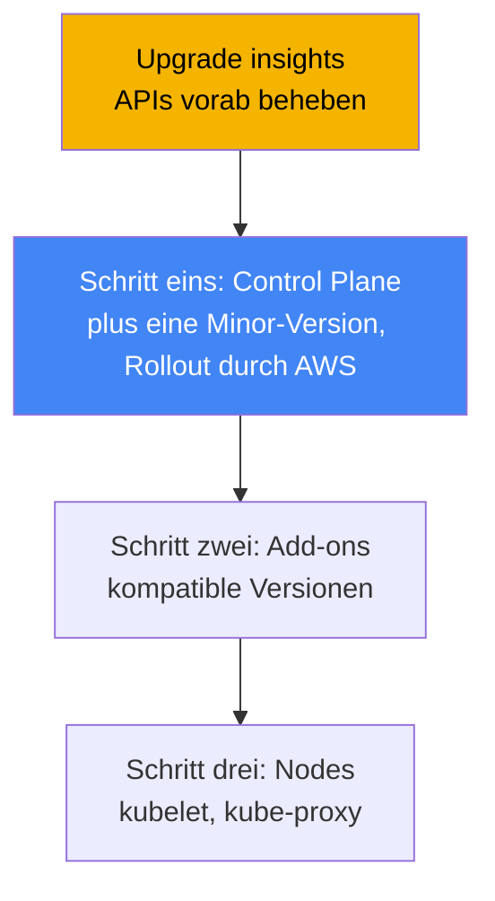
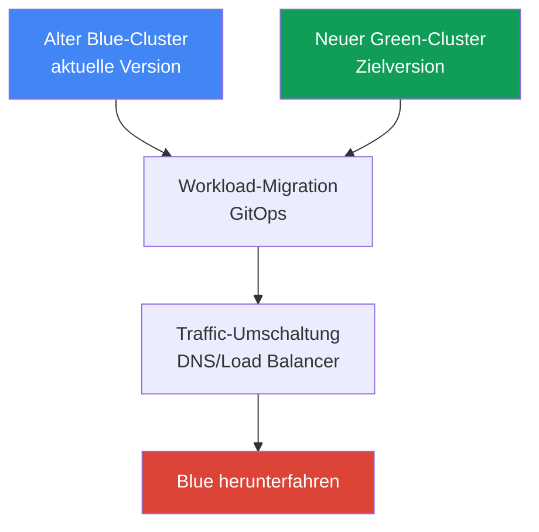

[Eng version](en.md) · [Versión en español](es.md) · [Version française](fr.md) · [Русская версия](ru.md) · [ქართული ვერსია](ge.md) · [繁體中文版](tw.md) · [日本語版](jp.md)
# Kapitel 38. Cluster-Upgrades: In-Place-Versionsupgrades, Blue/Green-Cluster, veraltete APIs

> **Wie es weitergeht.** Kapitel 37 behandelte Add-ons: Wer ihren Lebenszyklus verantwortet und
> wie ihre Versionen mit der Cluster-Version abgestimmt bleiben. Dieses Kapitel behandelt das
> Upgrade des gesamten Clusters nach Kubernetes-Version: den Versionslebenszyklus, die Reihenfolge
> des In-Place-Upgrades, veraltete APIs und die Blue/Green-Migration. Verwandte Themen behandeln
> andere Kapitel: die Add-ons selbst und ihre Aktualisierungsreihenfolge in Kapitel 37, das
> Zurücksetzen einer Version (Rollback Readiness) in Kapitel 39, Zuverlässigkeit, PDBs und das
> ordnungsgemäße Herunterfahren von Nodes in Kapitel 40, GitOps für die Blue/Green-Migration in
> Kapitel 44 sowie Managed Nodes und Karpenter Drift in den Kapiteln 11 und 12.

## 38.1. „Die Version verlässt bald den Support“ und „apply wird nicht mehr angewendet“

Das erste Szenario kommt per E-Mail und als Banner in der Konsole: Ihre Cluster-Version wird den
standard support bald verlassen. Dies ist keine abstrakte Warnung, sondern der Beginn eines
kostenpflichtigen Countdowns. Nach dem Ende des standard support geht der Cluster nicht kaputt,
wechselt jedoch zu extended support, für den höhere Kosten pro Cluster-Stunde anfallen. Auch
extended support ist nicht dauerhaft: Nach seinem Ablauf hebt EKS die Cluster-Version selbst an,
ohne den Zeitplan Ihres Teams abzufragen. Das Symptom ist einfach: eine Benachrichtigung, und die
CLI-Ausgabe zeigt, wie lange die Version noch standard support hat:

```bash
# bis zu welchem Datum die Version unter standard support steht
aws eks describe-cluster-versions \
  --query 'clusterVersions[?clusterVersion==`1.33`].[clusterVersion,endOfStandardSupport]'
```

Das zweite Szenario tritt nach einem Upgrade auf und sieht wie ein plötzlicher Fehler beim
Deployment aus. Der Cluster wurde auf eine neue Minor-Version angehoben, alles ist grün, doch die
CI scheitert beim Rollout und `kubectl apply` antwortet:

```bash
kubectl apply -f ingress.yaml
# error: resource mapping not found for name: "web" namespace: "prod"
# from "ingress.yaml": no matches for kind "Ingress" in version "extensions/v1beta1"
```

Nichts ist „von selbst“ kaputtgegangen: In der neuen Minor-Version hat Kubernetes die
`apiVersion` entfernt, mit der das Manifest geschrieben wurde. Solange der Cluster auf der alten
Version lief, wurde die alte `apiVersion` noch bereitgestellt; nach dem Upgrade kennt der
API-Server sie nicht mehr, und jedes Manifest mit dieser `apiVersion` lässt sich nicht mehr
anwenden. Bereits laufende Objekte können die Konvertierung überstanden haben, doch neue Rollouts
und jedes `apply` für diese Ressource schlagen jetzt fehl.

Beide Probleme betreffen dasselbe: Ein Cluster-Upgrade ist kein einzelner Knopf, sondern ein
Prozess mit Zeitplan (Versionslebenszyklus) und Vorbereitung (veraltete APIs). Der Reihe nach:
wie der Versionslebenszyklus funktioniert, in welcher Reihenfolge ein In-Place-Upgrade abläuft,
wie sich entfernte APIs frühzeitig finden lassen, was EKS cluster insights anzeigen, wie Nodes
aktualisiert werden und wann statt eines In-Place-Upgrades ein Blue/Green-Cluster verwendet wird.

## 38.2. EKS-Versionslebenszyklus

Kubernetes veröffentlicht im Durchschnitt alle vier Monate eine neue Minor-Version, und EKS
folgt diesem Zyklus. Jede Minor-Version in EKS hat drei Supportphasen, nach denen Upgrades geplant
werden sollten.

| Phase | Dauer | Bedeutung |
|---|---|---|
| Standard support | ~14 Monate ab Veröffentlichung der Version in EKS | regulärer Support, keine zusätzlichen Kosten für die Version |
| Extended support | ~12 Monate nach Ende des standard support | die Version läuft weiter, aber zu höheren Kosten pro Cluster-Stunde |
| Erzwungenes Upgrade | nach Ablauf des extended support | EKS hebt die Version selbst auf die nächstgelegene unterstützte an |

Daraus ergeben sich drei betriebliche Konsequenzen. Erstens beträgt das **Fenster für ein geplantes
Upgrade etwa 14 Monate**: Solange standard support aktiv ist, können Sie das Upgrade ruhig und
ohne zusätzliche Kosten für die Version durchführen. Zweitens ist **extended support keine
kostenlose Verschiebung**: Er ist standardmäßig aktiviert und kostet mehr pro Cluster-Stunde,
daher ist „einfach nicht aktualisieren“ eine bewusste Zahlung, nicht das Fehlen einer
Entscheidung. Drittens gibt es am Ende des extended support ein **erzwungenes Upgrade**: Wenn Sie
nicht rechtzeitig aktualisieren, hebt EKS die Version selbst an, und Cluster, die am Ende des
extended support automatisch aktualisiert wurden, können nicht mehr zurückgesetzt werden (zum
Rollback siehe Kapitel 39).



Es gibt eine weitere strikte Einschränkung: **Sie können nur jeweils um eine Minor-Version
aktualisieren**. Sie können nicht direkt von `1.30` auf `1.33` springen, sondern müssen `1.30` →
`1.31` → `1.32` → `1.33` durchlaufen, jede Minor-Version als separates Upgrade. Der Grund ist,
dass EKS eine hochverfügbare Control Plane betreibt und kube-apiserver innerhalb der version skew
policy strikt nur um eine Minor-Version aktualisiert. Patch-Versionen (beispielsweise Updates
innerhalb einer Minor-Version) bringt EKS selbst ein, Minor-Upgrades liegen jedoch in der
Verantwortung des Engineers und erfolgen immer schrittweise.

## 38.3. In-Place-Upgrade: Reihenfolge und Version Skew

Ein In-Place-Upgrade aktualisiert denselben Cluster auf eine neue Minor-Version, ohne einen
zweiten zu erstellen. Es besteht nicht aus einem einzelnen Befehl, sondern aus einer Reihenfolge,
die wichtig ist: Sie wird durch die Kubernetes version skew policy (Kapitel 37) vorgegeben, die
begrenzt, wie weit Komponenten auf Nodes hinter kube-apiserver zurückliegen dürfen.



Die Schritte sind wie folgt. Schritt null ist die **Vorbereitung**: upgrade insights ausführen und
veraltete APIs beheben (Abschnitte 38.4 und 38.5), außerdem sicherstellen, dass kubelet auf den
Nodes nicht weiter hinter der Control Plane zurückliegt als der zulässige Skew. Als Erstes folgt
die **Control Plane**: AWS aktualisiert die Managed Control Plane um eine Minor-Version; dabei
startet es neue API-Server-Instanzen und führt ein Rolling Update durch, wofür mehrere freie IPs
in den Cluster-Subnetzen nötig sind. Wenn die Health Checks für die neue Control Plane fehlschlagen,
setzt EKS den Infrastrukturschritt zurück und der Cluster bleibt auf der vorherigen Version,
während laufende Workloads unbeeinträchtigt bleiben.

Der zweite Schritt sind die **Add-ons**: Core-Add-ons (`kube-proxy`, `coredns`, `vpc-cni`) folgen
der Control Plane nicht automatisch; aktualisieren Sie sie mit `describe-addon-versions` auf
Versionen, die mit der neuen Minor-Version kompatibel sind (Kapitel 37). Der dritte Schritt sind
die **Nodes**: Bringen Sie kubelet und kube-proxy auf den Nodes auf die Version der Control Plane.
Gemäß der version skew policy (seit Kubernetes 1.28) darf kubelet bis zu drei Minor-Versionen
hinter kube-apiserver liegen. Es gibt daher keine harte Vorgabe, Nodes direkt nach jeder
Minor-Version zu aktualisieren. AWS empfiehlt jedoch, Nodes auf derselben Version wie die Control
Plane zu halten und den Rückstand nicht anwachsen zu lassen. Bringen Sie auch Clients (`kubectl`)
und weitere Cluster-Anwendungen (zum Beispiel cluster-autoscaler) auf die neue Minor-Version.

## 38.4. Veraltete und entfernte APIs

Kubernetes entwickelt APIs schrittweise weiter: Zunächst erklärt es eine `apiVersion` als
**deprecated** (veraltet, aber weiterhin funktionsfähig), und nach mehreren Minor-Versionen wird
sie **removed** (entfernt, der API-Server stellt sie nicht mehr bereit). Genau entfernte Versionen
brechen das `apply` aus Abschnitt 38.1. Die Meilensteine der Entfernung sollte man kennen, weil
ein Upgrade über sie hinweg am riskantesten ist:

| Version | Was entfernt wurde (Beispiele) |
|---|---|
| 1.16 | alte `apiVersion` für Deployment, DaemonSet, ReplicaSet (Wechsel zu `apps/v1`) |
| 1.22 | `Ingress` und `CustomResourceDefinition` aus Beta-Gruppen, alte Admission Webhooks |
| 1.25 | `PodSecurityPolicy`, `CronJob batch/v1beta1`, `PodDisruptionBudget policy/v1beta1` |
| 1.29 | `flowcontrol.apiserver.k8s.io/v1beta2` (FlowSchema, PriorityLevelConfiguration) |
| 1.32 | `flowcontrol.apiserver.k8s.io/v1beta3` |

Die Gefahr besteht darin, dass das Problem leise bleibt: Solange der Cluster auf der alten Version
läuft, funktioniert die veraltete `apiVersion` und warnt nicht deutlich, doch sie bricht genau
beim Upgrade über den Meilenstein der Entfernung hinweg. Suchen und beheben Sie veraltete APIs
daher **vor** dem Upgrade: Schreiben Sie Manifeste auf die aktuelle `apiVersion` um und rollen Sie
sie frühzeitig aus, während der Cluster noch auf der alten Version läuft (die neue `apiVersion`
wird dort gewöhnlich bereits unterstützt). Werkzeuge zur Erkennung:

| Werkzeug | Wo es sucht | Besonderheit |
|---|---|---|
| EKS upgrade insights | gesamter Cluster, durch AWS | integriert, markiert die Verwendung zur Entfernung vorgesehener APIs |
| pluto | Manifeste in Git und Helm-Releases | statischer Scan noch vor der Anwendung |
| kube-no-trouble (`kubent`) | Objekte in einem laufenden Cluster | schneller Scan gegen den tatsächlichen Zustand |
| `kubectl` deprecations / warnings | API-Server | Warnungen bei `apply`, Plugin `kubectl deprecations` |

In der Praxis zeigen `kubent` und upgrade insights, was sich bereits im Cluster befindet, während
`pluto` veraltete `apiVersion` in Repository und Helm-Charts noch vor dem Rollout findet. Beide
Perspektiven sind hilfreich: Der Cluster kann sauber sein, während in Git noch ein altes Manifest
liegt, das den nächsten Rollout nach dem Upgrade bricht.

## 38.5. EKS cluster insights und upgrade insights

**Cluster insights** sind integrierte EKS-Prüfungen eines Clusters gegen eine von AWS gepflegte
Problemliste. Es gibt drei Typen: **upgrade insights** (Upgrade-Bereitschaft), **rollback readiness
insights** (Rollback-Bereitschaft, Kapitel 39) und **configuration insights** (für Hybrid Nodes).
Die Prüfungen laufen automatisch und werden alle 24 Stunden aktualisiert; nach Behebung eines
Problems können Sie die Liste manuell aktualisieren, statt einen Tag zu warten.

Für Upgrades sind upgrade insights wichtig: EKS scannt den Cluster selbst danach, was den Wechsel
auf die neue Minor-Version verhindern könnte, vor allem die Verwendung von Kubernetes-APIs, die
entfernt werden sollen, und liefert Empfehlungen mit Links zur Dokumentation. AWS ergänzt die
Prüfliste regelmäßig, wenn sich Kubernetes verändert. Prüfen Sie insights daher **vor jedem
Upgrade**, nicht nur ein einziges Mal. EKS erhält über einen automatisch erstellten access entry
für insights Zugriff auf die Daten; separate Berechtigungen müssen nicht konfiguriert werden.

```bash
# Liste der Cluster insights (einschließlich upgrade insights)
aws eks list-insights --cluster-name my-cluster
# Details für einen bestimmten insight: Status, Empfehlung, betroffene Ressourcen
aws eks describe-insight --cluster-name my-cluster --id <insight-id>
```

Der Ablauf ist einfach: Öffnen Sie vor einem Upgrade den Tab für upgrade insights (oder gehen Sie
`list-insights` durch), untersuchen Sie alles, was als Problem markiert ist, beheben Sie die
Manifeste, aktualisieren Sie insights und stellen Sie sicher, dass die Liste sauber ist. Starten
Sie erst dann das Upgrade der Control Plane.

## 38.6. Node-Upgrades

AWS aktualisiert die Control Plane, während Nodes in der Verantwortung des Engineers liegen, und
die Methode davon abhängt, wie die Nodes verwaltet werden. Es gibt drei Optionen:

| Methode | Wie sie aktualisiert wird | PDB wird beachtet |
|---|---|---|
| Managed node group | AWS führt ein Rolling Update durch: cordon, drain, Ersatz mit neuem Launch Template | ja, drain beachtet PDB |
| Karpenter (drift) | erstellt Nodes für ein neues AMI/eine neue Version als Drift neu (Kapitel 12) | ja, durch graceful disruption |
| Self-managed | Launch Template aktualisieren und Nodes manuell oder mit eigener Automatisierung ausrollen | Ihre Verantwortung |

Bei einer **managed node group** läuft das Update in Phasen ab: EKS erstellt eine neue
Launch-Template-Version mit dem Ziel-AMI, startet neue Nodes, markiert alte Nodes als nicht
planbar (cordon) und leert deren Pods (drain). Drain beachtet PodDisruptionBudget: Pods werden
gemäß dem PDB evicted, nicht auf einmal. Genau hier tritt ein häufiger Blocker auf: ein zu strenges
PDB. Wenn Pods nicht innerhalb von 15 Minuten evicted werden können, schlägt die Upgrade-Phase mit
`PodEvictionFailure` fehl; lockern Sie dann entweder das PDB oder starten Sie das Update mit dem
force-Flag, das Pods unter Ignorieren des PDB zwangsweise evicted. Die Anzahl parallel
aktualisierter Nodes wird über `maxUnavailable` in `updateConfig` der Gruppe festgelegt.

**Karpenter** aktualisiert Nodes über den Drift-Mechanismus (Kapitel 12): Wenn sich das gewünschte
AMI oder die Version ändert, betrachtet Karpenter vorhandene Nodes als veraltet und erstellt sie
neu, ebenfalls mit ordnungsgemäßer Eviction. **Self-managed** Nodes aktualisieren Sie vollständig
selbst: Ändern Sie das Launch Template und rollen Sie Ersatz-Nodes aus. Zu PDBs, Topology Spread
und dem ordnungsgemäßen Herunterfahren von Nodes beim Rollout siehe Kapitel 40.

## 38.7. Blue/Green-Cluster

In-Place ist nicht der einzige Weg. Die Alternative ist **blue/green**: Starten Sie parallel zum
alten einen neuen Cluster (green) direkt auf der Zielversion, migrieren Sie Workloads dorthin,
schalten Sie den Traffic um und fahren Sie den alten Cluster (blue) herunter. So lässt sich die
Zielversion schrittweise mit Live-Traffic prüfen, während ein Rollback darauf reduziert wird, den
Traffic zum weiterhin laufenden alten Cluster zurückzuschalten.



Workloads werden deklarativ über GitOps migriert (Kapitel 44): Wenden Sie denselben Satz von
Manifesten auf den neuen Cluster an und schalten Sie den Traffic dann auf DNS-Ebene (Route 53)
oder auf Ebene des Load Balancers um. Die Wahl zwischen den Ansätzen ist ein Gleichgewicht aus
Risiko, Kosten und Komplexität:

| Kriterium | In-Place | Blue/Green |
|---|---|---|
| Komplexität | einfacher: ein Cluster, Schritte der Reihe nach | komplexer: zwei Cluster, Migration, Traffic |
| Kosten | keine doppelte Infrastruktur | vorübergehend zwei Cluster, teurer |
| Versionssprung | jeweils nur eine Minor-Version | direkt auf die gewünschte Version des neuen Clusters |
| Risiko und Rollback | Rollback innerhalb eines 7-Tage-Fensters (Kapitel 39) | Rollback = Traffic zurück auf blue, schnell |
| Wann gewählt | routinemäßige reguläre Upgrades | großer Versionsabstand, hohes Risiko, Inkompatibilitäten |

Die praktische Regel lautet: **Regelmäßige Upgrades werden In-Place durchgeführt**. Das ist
einfacher, günstiger und verdoppelt die Infrastruktur nicht. **Blue/Green wird verwendet, wenn
In-Place riskant oder unmöglich ist**: Die Version ist so weit zurück, dass das Durchlaufen aller
Minor-Versionen einzeln lang und gefährlich ist; die schnellstmögliche Rollback-Möglichkeit wird
benötigt; oder der neue Cluster ändert etwas, das In-Place nicht übersteht (die Menge entfernter
APIs, eine Netzwerkänderung, ein anderer Satz von Add-ons). Der Preis von Blue/Green sind
vorübergehend doppelte Cluster sowie Arbeit für Migration und Traffic-Umschaltung.

## 38.8. So wird dies in der Produktion eingesetzt

- **Planen Sie Upgrades nach dem Supportkalender, nicht erst beim Eintreffen der E-Mail.** Halten
  Sie die Version innerhalb des standard support (~14 Monate) und aktualisieren Sie frühzeitig,
  ohne extended support mit seinen höheren Kosten und erst recht kein erzwungenes Upgrade zu
  erreichen.
- **Beheben Sie veraltete APIs vor dem Upgrade, nicht danach.** Führen Sie upgrade insights,
  `kubent` gegen den Cluster und `pluto` gegen Git und Helm aus, schreiben Sie Manifeste auf die
  aktuelle `apiVersion` um und rollen Sie sie noch auf der alten Version frühzeitig aus.
- **Halten Sie die Reihenfolge strikt ein:** zuerst Control Plane, dann Core-Add-ons auf
  kompatible Versionen (Kapitel 37), dann Nodes. Das Überspringen des Add-on-Schritts erzeugt
  version skew und bricht Netzwerk und DNS.
- **Aktualisieren Sie jeweils um eine Minor-Version** und versuchen Sie nicht, Versionen zu
  überspringen; bei Clustern, die viele Minor-Versionen zurückliegen, wägen Sie Blue/Green gegen
  eine lange In-Place-Kette ab.
- **Bereiten Sie PDBs auf den Node-Rollout vor.** Prüfen Sie, dass Budgets nicht zu streng sind,
  sonst läuft der Drain der managed node group in `PodEvictionFailure`. Zu PDBs und graceful
  shutdown siehe Kapitel 40.
- **Führen Sie das Upgrade zuerst auf einem Nicht-Produktivcluster aus.** Aktualisieren Sie einen
  Test- oder Staging-Cluster vor der Produktion und nutzen Sie ihn, um Überraschungen der neuen
  Version zu finden.

## 38.9. Mini-Glossar

- **standard support**: die Supportphase einer EKS-Minor-Version (~14 Monate), regulärer Betrieb
  ohne zusätzliche Kosten für die Version.
- **extended support**: die Phase nach standard support (~12 Monate): Die Version wird weiterhin
  unterstützt, aber zu höheren Kosten pro Cluster-Stunde; standardmäßig aktiviert.
- **erzwungenes Upgrade**: automatische Anhebung der Version nach Ablauf des extended support;
  ein solcher Cluster kann nicht zurückgesetzt werden.
- **in-place upgrade**: Aktualisierung desselben Clusters auf die nächste Minor-Version: zuerst
  Control Plane, dann Add-ons, dann Nodes.
- **version skew policy**: eine Kubernetes-Regel, die begrenzt, wie weit Komponenten auf Nodes
  hinter kube-apiserver zurückliegen dürfen (Kapitel 37).
- **deprecated / removed API**: Eine `apiVersion` wird als veraltet erklärt und dann entfernt;
  nach der Entfernung lassen sich Manifeste, die sie verwenden, nicht anwenden.
- **cluster insights**: integrierte EKS-Prüfungen: Upgrade, Rollback Readiness und Konfiguration.
- **upgrade insights**: der Insight-Typ, der Upgrade-Bereitschaft und zur Entfernung vorgesehene
  APIs markiert.
- **pluto / kube-no-trouble (kubent)**: Werkzeuge zum Finden veralteter APIs: pluto in Git und
  Helm, kubent in einem laufenden Cluster.
- **blue/green cluster**: ein neuer Cluster auf der Zielversion parallel zum alten, mit
  Workload-Migration und Traffic-Umschaltung.

## 38.10. Zusammenfassung des Kapitels

- Eine EKS-Version hat drei Phasen: standard support (~14 Monate), extended support (~12 Monate,
  teurer) und dann ein erzwungenes Upgrade; planen Sie Upgrades innerhalb des Fensters für
  standard support.
- Sie können jeweils nur um eine Minor-Version aktualisieren und keine Versionen überspringen.
  EKS spielt Patches selbst ein, Minor-Upgrades liegen in der Verantwortung des Engineers.
- Ein In-Place-Upgrade folgt dieser Reihenfolge: Vorbereitung, Control Plane (Rollout durch AWS),
  Core-Add-ons auf kompatible Versionen (Kapitel 37), dann Nodes; die version skew policy gibt
  die Reihenfolge vor.
- Kubernetes entfernt APIs zwischen Minor-Versionen (Meilensteine 1.16, 1.22, 1.25, 1.29, 1.32);
  nach dem Upgrade lassen sich Manifeste mit alter `apiVersion` nicht mehr anwenden.
- Finden Sie veraltete APIs vorab: upgrade insights und `kubent` im Cluster, `pluto` in Git und
  Helm; beheben Sie Manifeste vor dem Upgrade.
- EKS cluster insights prüfen die Upgrade-Bereitschaft des Clusters automatisch und markieren
  zur Entfernung vorgesehene APIs; prüfen Sie sie vor jedem Update.
- Nodes werden unterschiedlich aktualisiert: managed node group (Rolling Update mit Drain,
  beachtet PDB, force-Flag bei `PodEvictionFailure`), Karpenter (Drift, Kapitel 12), self-managed
  (durch Sie).
- Blue/Green startet einen neuen Cluster auf der Zielversion und schaltet den Traffic um;
  verwenden Sie es bei großem Versionsabstand, hohem Risiko oder Inkompatibilitäten, um den Preis
  vorübergehender Verdopplung.

## 38.11. Wie dies in der Praxis hilft

Im Bereitschaftsdienst bedeutet ein Upgrade nicht „Update drücken“, sondern eine Checkliste
abzuarbeiten. Prüfen Sie vor dem Update upgrade insights und führen Sie `kubent` und `pluto` aus,
damit entfernte APIs vor dem Upgrade sichtbar werden und nicht am nächsten Tag als fehlgeschlagenes
`kubectl apply` in der Produktion. Das Verständnis, dass Control Plane, Add-ons und Nodes getrennt
und in strenger Reihenfolge aktualisiert werden, spart Stunden bei der Untersuchung von „Warum ist
das Netzwerk nach einem erfolgreichen Upgrade ausgefallen?“. Meistens war der Add-on-Schritt
vergessen worden (Kapitel 37).

Bei der Betriebsplanung entscheiden Sie drei Dinge. Erstens den Kalender: Halten Sie die Version
innerhalb des standard support und aktualisieren Sie frühzeitig, um nicht für extended support zu
zahlen und kein erzwungenes Upgrade ohne Rollback-Fenster zu erhalten. Zweitens die Strategie:
Führen Sie reguläre Upgrades In-Place jeweils um eine Minor-Version durch und planen Sie für stark
veraltete Cluster oder riskante Übergänge Blue/Green mit GitOps-Migration frühzeitig ein (Kapitel
44). Drittens die Node-Bereitschaft: Prüfen Sie, dass PDBs Drain nicht blockieren, und vereinbaren
Sie, ob Nodes über eine managed node group, Karpenter Drift oder manuell aktualisiert werden.
Dann ist ein Upgrade kein Notfall mehr, sondern ein Routineverfahren.

## 38.12. Fragen zur Selbstkontrolle

1. Aus welchen drei Phasen besteht der Lebenszyklus einer EKS-Minor-Version und wie lange dauert
   jede ungefähr?
2. Was geschieht, wenn der Cluster nicht vor dem Ende des extended support aktualisiert wird, und
   kann ein solcher Cluster zurückgesetzt werden?
3. Warum können Sie nicht direkt von `1.30` auf `1.33` aktualisieren und wie wird es korrekt
   durchgeführt?
4. In welcher Reihenfolge läuft ein In-Place-Upgrade ab und warum gerade so (welche Regel gibt
   dies vor)?
5. Was bedeuten die API-Zustände deprecated und removed, und ab welchem Punkt bricht
   `kubectl apply`?
6. Nennen Sie mehrere Meilensteine der API-Entfernung nach Kubernetes-Version.
7. Wie unterscheidet sich das Finden veralteter APIs mit `kubent` vom Finden mit `pluto`, und
   warum werden beide benötigt?
8. Was sind EKS upgrade insights und wann sollten Sie sie prüfen?
9. Wie aktualisiert eine managed node group Nodes und was passiert, wenn das PDB zu streng ist?
10. Wie aktualisiert Karpenter Nodes und worin unterscheidet sich das von einer managed node group?
11. Was ist ein Blue/Green-Cluster-Upgrade und wie sieht darin ein Rollback aus?
12. In welchen Situationen wird Blue/Green statt In-Place gewählt und was kostet dies?

## Praxis

Das Kurs-Lab zu diesem Thema: [Lab 113 - Cluster-Upgrade und Rollback: Control Plane, Add-ons,
veraltete APIs](../../labs/113/README_DE.MD). Darüber hinaus können Sie die Upgrade-Bereitschaft
und den aktuellen Versionsstatus leicht auf einem laufenden Cluster erfassen. Prüfen Sie zunächst
die Cluster-Version und wie lange sie noch standard support hat:

```bash
# aktuelle Cluster-Version
aws eks describe-cluster --name my-cluster --query 'cluster.version'
# Supportphasen der Versionen: Datum bis standard support
aws eks describe-cluster-versions \
  --query 'clusterVersions[].[clusterVersion,endOfStandardSupport]' --output table
```

Führen Sie dann die integrierten Prüfungen zur Upgrade-Bereitschaft aus und untersuchen Sie, was
als Problem markiert ist:

```bash
# Liste der Cluster insights (einschließlich upgrade insights)
aws eks list-insights --cluster-name my-cluster
# Details für einen bestimmten insight: Status und Empfehlung
aws eks describe-insight --cluster-name my-cluster --id <insight-id>
```

Prüfen Sie, ob etwas direkt auf veraltete APIs zugreift, und gleichen Sie die Versionen der
Core-Add-ons mit der Cluster-Minor-Version ab, bevor Sie über ein Upgrade nachdenken:

```bash
# verfügbare API-Versionen im Cluster (nach Beta-Gruppen suchen, die bald entfernt werden)
kubectl get --raw /apis | grep -o '"groupVersion":"[^"]*"'
# Add-on auf eine kompatible Version aktualisieren (Beispiel; Version aus describe-addon-versions)
aws eks update-addon --cluster-name my-cluster --addon-name kube-proxy \
  --addon-version <kompatible-version>
```

Vergleichen Sie drei Dinge: die Cluster-Version und das Enddatum des standard support, die Liste
der upgrade insights sowie die tatsächlichen `apiVersion`, mit denen Ihre Manifeste in Git
geschrieben sind. Wenn insights sauber sind, keine veralteten APIs vorhanden sind und Add-ons mit
der Ziel-Minor-Version kompatibel sind, ist der Cluster für ein In-Place-Upgrade in der Reihenfolge
aus Abschnitt 38.3 bereit. Kapitel 39 behandelt das Rollback, falls etwas schiefgeht.

---
[Inhaltsverzeichnis](../README_DE.md) · [Kapitel 37](../37/de.md) · [Kapitel 39](../39/de.md)
