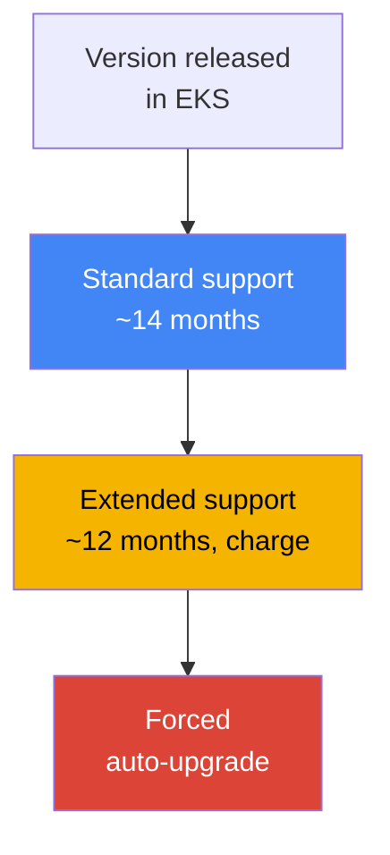
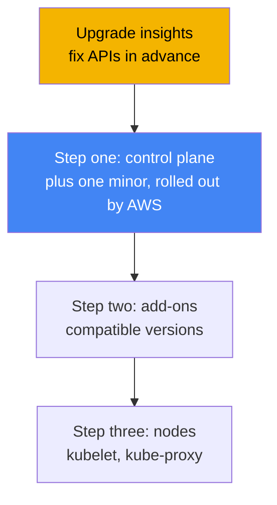
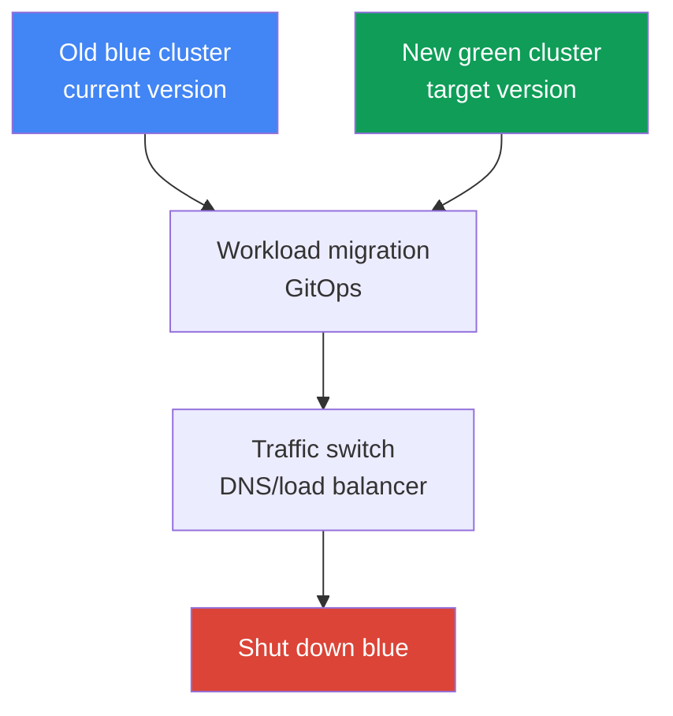

[Русская версия](ru.md) · [Versión en español](es.md) · [Version française](fr.md) · [Deutsche Version](de.md) · [ქართული ვერსია](ge.md) · [繁體中文版](tw.md) · [日本語版](jp.md)
# Chapter 38. Cluster upgrades: in-place version upgrades, blue/green clusters, deprecated APIs

> **What comes next.** Chapter 37 covered add-ons: who owns their lifecycle and how to keep their
> versions aligned with the cluster version. This chapter covers upgrading the entire cluster by
> Kubernetes version: the version lifecycle, the in-place upgrade order, deprecated APIs, and
> blue/green migration. Related topics are covered in other chapters: add-ons themselves and
> their upgrade order are in Chapter 37, version rollback (rollback readiness) is in Chapter 39,
> reliability, PDBs, and graceful node shutdown are in Chapter 40, GitOps for blue/green
> migration is in Chapter 44, and managed nodes and Karpenter drift are in Chapters 11 and 12.

## 38.1. "The version will soon leave support" and "apply no longer applies"

The first scenario arrives as an email and a banner in the console: your cluster version will
soon leave standard support. This is not an abstract warning, but the start of a paid countdown.
After standard support ends, the cluster does not break, but moves to extended support, which has
a higher per-cluster-hour charge. Extended support is not permanent either: when it expires, EKS
will raise the cluster version itself, without asking about your team's schedule. The symptom is
simple: a notification, and the CLI output shows how long the version has until standard support
ends:

```bash
# date until which the version is under standard support
aws eks describe-cluster-versions \
  --query 'clusterVersions[?clusterVersion==`1.33`].[clusterVersion,endOfStandardSupport]'
```

The second scenario arrives after an upgrade and looks like a sudden deployment failure. The
cluster was raised to a new minor version, everything is green, but CI fails during rollout and
`kubectl apply` responds:

```bash
kubectl apply -f ingress.yaml
# error: resource mapping not found for name: "web" namespace: "prod"
# from "ingress.yaml": no matches for kind "Ingress" in version "extensions/v1beta1"
```

Nothing broke "by itself": in the new minor release, Kubernetes removed the `apiVersion` used by
the manifest. While the cluster ran the old version, the old `apiVersion` was still served; after
the upgrade, the API server no longer knows it, and every manifest with that `apiVersion` stops
applying. Already running objects may have survived conversion, but new rollouts and any `apply`
for that resource now fail.

Both pains are about the same thing: a cluster upgrade is not one button, but a process with a
schedule (the version lifecycle) and preparation (deprecated APIs). Next, in order: how the
version lifecycle works, the in-place upgrade order, how to find removed APIs in advance, what
EKS cluster insights show, how nodes are upgraded, and when a blue/green cluster is used instead
of an in-place upgrade.

## 38.2. EKS version lifecycle

Kubernetes releases a new minor version approximately every four months, and EKS follows that
cycle. Every EKS minor version has three support phases, and upgrades should be planned around
them.

| Phase | Duration | What it means |
|---|---|---|
| Standard support | ~14 months from the version release in EKS | normal support, no additional version charge |
| Extended support | ~12 months after standard support ends | the version still runs, but with a higher per-cluster-hour charge |
| Forced upgrade | after extended support expires | EKS raises the version itself to the nearest supported one |

There are three operational implications. First, the **planned upgrade window is about 14
months**: while standard support is active, you can upgrade calmly and without an additional
version charge. Second, **extended support is not a free deferral**: it is enabled by default and
costs more per cluster hour, so "simply not upgrading" is a deliberate payment, not the absence
of a decision. Third, there is a **forced upgrade at the end of extended support**: if you do not
upgrade in time, EKS raises the version itself, and clusters automatically upgraded at the end of
extended support can no longer be rolled back (see Chapter 39 for rollback).



There is one more strict constraint: **you can upgrade only one minor version at a time**. You
cannot jump directly from `1.30` to `1.33`; you must go through `1.30` → `1.31` → `1.32` →
`1.33`, each minor version as a separate upgrade. The reason is that EKS maintains a highly
available control plane and upgrades kube-apiserver strictly one minor at a time, within the
version skew policy. EKS applies patch versions itself (for example, updates within a minor
version), but minor upgrades are the engineer's responsibility and are always stepwise.

## 38.3. In-place upgrade: order and version skew

An in-place upgrade updates the same cluster to a new minor version without creating a second
one. It is not one command but a sequence, and the order matters: it is dictated by the
Kubernetes version skew policy (Chapter 37), which limits how far node components can lag behind
kube-apiserver.



The steps are as follows. Step zero is **preparation**: run upgrade insights and fix deprecated
APIs (Sections 38.4 and 38.5), and ensure that kubelet on nodes does not lag behind the control
plane by more than the permitted skew. First is the **control plane**: AWS upgrades the managed
control plane by one minor version; during the process, it brings up new API server instances and
performs a rolling update, which requires several free IPs in the cluster subnets. If health
checks for the new control plane fail, EKS rolls back the infrastructure step and the cluster
remains on the previous version, while running workloads are unaffected.

The second step is **add-ons**: core add-ons (`kube-proxy`, `coredns`, `vpc-cni`) do not follow
the control plane automatically; upgrade them to versions compatible with the new minor release,
using `describe-addon-versions` (Chapter 37). The third step is **nodes**: bring kubelet and
kube-proxy on nodes to the control-plane version. Under the version skew policy (starting with
Kubernetes 1.28), kubelet may lag behind kube-apiserver by up to three minor versions, so there
is no strict requirement to upgrade nodes immediately after every minor version. However, AWS
recommends keeping nodes on the same version as the control plane and not accumulating lag. Bring
clients (`kubectl`) and other cluster applications (for example, cluster-autoscaler) to the new
minor version as well.

## 38.4. Deprecated and removed APIs

Kubernetes evolves APIs in stages: first it declares an `apiVersion` **deprecated** (outdated but
still working), and after several minor versions it is **removed** (the API server no longer
serves it). Removed versions are precisely what break `apply` in Section 38.1. It is worth
knowing the removal milestones because upgrading through them is the riskiest part:

| Version | What was removed (examples) |
|---|---|
| 1.16 | old `apiVersion` values for Deployment, DaemonSet, ReplicaSet (move to `apps/v1`) |
| 1.22 | `Ingress` and `CustomResourceDefinition` from beta groups, old admission webhooks |
| 1.25 | `PodSecurityPolicy`, `CronJob batch/v1beta1`, `PodDisruptionBudget policy/v1beta1` |
| 1.29 | `flowcontrol.apiserver.k8s.io/v1beta2` (FlowSchema, PriorityLevelConfiguration) |
| 1.32 | `flowcontrol.apiserver.k8s.io/v1beta3` |

The danger is that the problem is quiet: while the cluster is on the old version, the deprecated
`apiVersion` works and does not complain loudly, then it breaks exactly when the upgrade crosses
the removal milestone. Therefore, find and fix deprecated APIs **before** upgrading: rewrite
manifests to the current `apiVersion` and roll them out in advance, while the cluster is still on
the old version (the new `apiVersion` is usually already supported there). Detection tools:

| Tool | Where it looks | Characteristic |
|---|---|---|
| EKS upgrade insights | the whole cluster, by AWS | built in, flags use of APIs scheduled for removal |
| pluto | manifests in Git and Helm releases | static scan before application |
| kube-no-trouble (`kubent`) | objects in a live cluster | quick scan against the actual state |
| `kubectl` deprecations / warnings | API server | warnings during `apply`, the `kubectl deprecations` plugin |

In practice, `kubent` and upgrade insights show what is already in the cluster, while `pluto`
catches deprecated `apiVersion` values in the repository and Helm charts before rollout. Both
perspectives are useful: the cluster may be clean, while Git still contains an old manifest that
will break the next rollout after the upgrade.

## 38.5. EKS cluster insights and upgrade insights

**Cluster insights** are EKS built-in checks of a cluster against an AWS-curated issue list. They
come in three types: **upgrade insights** (upgrade readiness), **rollback readiness insights**
(rollback readiness, Chapter 39), and **configuration insights** (for hybrid nodes). Checks run
automatically and are refreshed every 24 hours; after fixing an issue, you can refresh the list
manually instead of waiting a day.

For upgrades, upgrade insights are important: EKS scans the cluster itself for what may prevent a
move to the new minor version, primarily the use of Kubernetes APIs scheduled for removal, and
provides recommendations with documentation links. AWS regularly adds to the check list as
Kubernetes changes, so review insights **before every upgrade**, rather than just once. EKS gains
access to the data through an automatically created access entry for insights; no separate
permissions need to be configured.

```bash
# cluster insights list (including upgrade insights)
aws eks list-insights --cluster-name my-cluster
# details for a particular insight: status, recommendation, affected resources
aws eks describe-insight --cluster-name my-cluster --id <insight-id>
```

The workflow is simple: before an upgrade, open the upgrade insights tab (or go through
`list-insights`), investigate everything marked as a problem, fix the manifests, refresh
insights, and ensure the list is clean. Only then start the control-plane upgrade.

## 38.6. Node upgrades

AWS upgrades the control plane, while nodes are the engineer's responsibility, and the method
depends on how nodes are managed. There are three options:

| Method | How it is upgraded | PDB respected |
|---|---|---|
| Managed node group | AWS performs a rolling update: cordon, drain, replacement using the new launch template | yes, drain respects PDB |
| Karpenter (drift) | recreates nodes for a new AMI/version as drift (Chapter 12) | yes, through graceful disruption |
| Self-managed | update the launch template and roll nodes manually or with your own automation | your responsibility |

For a **managed node group**, the update proceeds in phases: EKS creates a new launch-template
version with the target AMI, brings up new nodes, marks old nodes as unschedulable (cordon), and
drains their pods. Drain respects PodDisruptionBudget: pods are evicted according to the PDB, not
all at once. This is exactly where a frequent blocker appears: a PDB that is too strict. If pods
cannot be evicted within 15 minutes, the upgrade phase fails with `PodEvictionFailure`; then
either relax the PDB or start the update with the force flag, which forcibly evicts pods while
ignoring the PDB. The number of nodes upgraded in parallel is set by `maxUnavailable` in the
group's `updateConfig`.

**Karpenter** upgrades nodes through the drift mechanism (Chapter 12): when the desired AMI or
version changes, Karpenter considers existing nodes outdated and recreates them, also with
graceful eviction. **Self-managed** nodes are upgraded entirely by you: change the launch
template and roll out replacement nodes. See Chapter 40 for PDBs, topology spread, and graceful
node shutdown during rollout.

## 38.7. Blue/green clusters

In-place is not the only path. The alternative is **blue/green**: bring up a new cluster (green)
alongside the old one directly on the target version, migrate workloads to it, switch traffic, and
shut down the old cluster (blue). The point is to validate the target version gradually on live
traffic, while rollback is reduced to switching traffic back to the still-running old cluster.



Workloads are migrated declaratively through GitOps (Chapter 44): apply the same set of manifests
to the new cluster, then switch traffic at the DNS (Route 53) or load-balancer level. The choice
between the approaches is a balance of risk, cost, and complexity:

| Criterion | In-place | Blue/green |
|---|---|---|
| Complexity | simpler: one cluster, steps in order | more complex: two clusters, migration, traffic |
| Cost | no duplicate infrastructure | temporarily two clusters, more expensive |
| Version jump | only one minor version at a time | directly to the desired version in the new cluster |
| Risk and rollback | rollback within a 7-day window (Chapter 39) | rollback = return traffic to blue, fast |
| When selected | routine regular upgrades | large version gap, high risk, incompatibilities |

The practical rule is: **perform regular upgrades in-place**. This is simpler, cheaper, and does
not duplicate infrastructure. **Use blue/green when in-place is risky or impossible**: the
version is so far behind that traversing every minor version one at a time is long and dangerous;
the fastest possible rollback capability is required; or the new cluster changes something that
will not survive in-place (the set of removed APIs, a networking change, a different set of
add-ons). The cost of blue/green is temporarily duplicated clusters and migration and traffic
switching work.

## 38.8. How this is used in production

- **Plan upgrades by the support calendar, not when the email arrives.** Keep the version within
  standard support (~14 months) and upgrade in advance, without reaching extended support with
  its higher charge, much less a forced upgrade.
- **Fix deprecated APIs before upgrading, not after.** Run upgrade insights, `kubent` against the
  cluster, and `pluto` against Git and Helm; rewrite manifests to the current `apiVersion` and
  roll them out in advance while still on the old version.
- **Follow the order strictly:** control plane first, then core add-ons to compatible versions
  (Chapter 37), then nodes. Skipping the add-on step creates version skew and breaks networking
  and DNS.
- **Upgrade one minor version at a time** and do not try to jump versions; for clusters many
  minor versions behind, weigh blue/green against a long in-place chain.
- **Prepare PDBs for node rollout.** Check that budgets are not too strict; otherwise, the
  managed node group drain will hit `PodEvictionFailure`. See Chapter 40 for PDBs and graceful
  shutdown.
- **Run the upgrade first on a non-production cluster.** Upgrade a test or staging cluster before
  production and use it to catch surprises from the new version.

## 38.9. Mini-glossary

- **standard support**: the support phase for an EKS minor version (~14 months), normal operation
  with no additional version charge.
- **extended support**: the phase after standard support (~12 months): the version is still
  supported, but at a higher per-cluster-hour charge; enabled by default.
- **forced upgrade**: automatic version increase after extended support expires; such a cluster
  cannot be rolled back.
- **in-place upgrade**: update the same cluster to the next minor version: control plane, then
  add-ons, then nodes.
- **version skew policy**: a Kubernetes rule that limits how far node components can lag behind
  kube-apiserver (Chapter 37).
- **deprecated / removed API**: an `apiVersion` is declared obsolete, then removed; after
  removal, manifests that use it do not apply.
- **cluster insights**: EKS built-in checks: upgrade, rollback readiness, and configuration.
- **upgrade insights**: the insight type that flags upgrade readiness and APIs scheduled for
  removal.
- **pluto / kube-no-trouble (kubent)**: tools for finding deprecated APIs: pluto in Git and Helm,
  kubent in a live cluster.
- **blue/green cluster**: a new cluster on the target version alongside the old one, with workload
  migration and traffic switching.

## 38.10. Chapter summary

- An EKS version has three phases: standard support (~14 months), extended support (~12 months,
  more expensive), then a forced upgrade; plan upgrades within the standard-support window.
- You can upgrade only one minor version at a time; you cannot jump versions. EKS applies patches
  itself, while minor upgrades are the engineer's responsibility.
- An in-place upgrade follows this order: preparation, control plane (rolled out by AWS), core
  add-ons to compatible versions (Chapter 37), then nodes; the version skew policy dictates the
  order.
- Kubernetes removes APIs between minor releases (milestones 1.16, 1.22, 1.25, 1.29, 1.32); after
  an upgrade, manifests with an old `apiVersion` no longer apply.
- Find deprecated APIs in advance: upgrade insights and `kubent` in the cluster, `pluto` in Git
  and Helm; fix manifests before the upgrade.
- EKS cluster insights automatically check cluster upgrade readiness and flag APIs scheduled for
  removal; review them before every update.
- Nodes are upgraded differently: managed node group (rolling update with drain, respects PDB,
  force flag for `PodEvictionFailure`), Karpenter (drift, Chapter 12), self-managed (by you).
- Blue/green brings up a new cluster at the target version and switches traffic; use it for a
  large version gap, high risk, or incompatibilities, at the cost of temporary duplication.

## 38.11. How this helps in real work

On call, an upgrade is not "press update", but running a checklist. Before the update, review
upgrade insights and run `kubent` and `pluto` so removed APIs surface before the upgrade rather
than as a failed `kubectl apply` in production the next day. Understanding that the control plane,
add-ons, and nodes are upgraded separately and in a strict order saves hours of investigation
into "why networking broke after a successful upgrade". Usually, it is the forgotten add-on step
(Chapter 37).

When planning operations, decide three things. First, the calendar: keep the version within
standard support and upgrade in advance to avoid paying for extended support and avoid a forced
upgrade with no rollback window. Second, the strategy: perform regular upgrades in-place one
minor version at a time, and for severely outdated clusters or risky transitions, plan
blue/green with GitOps migration in advance (Chapter 44). Third, node readiness: check that PDBs
will not block drain, and agree whether nodes are upgraded through a managed node group,
Karpenter drift, or manually. Then an upgrade stops being an emergency and becomes a routine
procedure.

## 38.12. Self-check questions

1. What three phases make up the lifecycle of an EKS minor version, and approximately how long
   does each last?
2. What happens if the cluster is not upgraded before extended support ends, and can such a
   cluster be rolled back?
3. Why can you not upgrade directly from `1.30` to `1.33`, and how is it done correctly?
4. In what order does an in-place upgrade proceed, and why that order (what rule dictates it)?
5. What do the deprecated and removed API states mean, and at what point does `kubectl apply`
   break?
6. Name several API removal milestones by Kubernetes version.
7. How does finding deprecated APIs with `kubent` differ from finding them with `pluto`, and why
   are both needed?
8. What are EKS upgrade insights, and when should you review them?
9. How does a managed node group upgrade nodes, and what happens if the PDB is too strict?
10. How does Karpenter upgrade nodes, and how does that differ from a managed node group?
11. What is a blue/green cluster upgrade, and what does rollback look like in it?
12. In what situations is blue/green selected instead of in-place, and what is its cost?

## Practice

The course lab for this topic is [Lab 113: Cluster upgrade and rollback: control plane, add-ons,
deprecated APIs](../../labs/113/README.MD). In addition, you can easily capture upgrade readiness
and the current version state on a live cluster. First, look at the cluster version and how long
it has remaining in standard support:

```bash
# current cluster version
aws eks describe-cluster --name my-cluster --query 'cluster.version'
# version support phases: date until standard support
aws eks describe-cluster-versions \
  --query 'clusterVersions[].[clusterVersion,endOfStandardSupport]' --output table
```

Then run the built-in upgrade readiness checks and investigate what is marked as a problem:

```bash
# cluster insights list (including upgrade insights)
aws eks list-insights --cluster-name my-cluster
# details for a particular insight: status and recommendation
aws eks describe-insight --cluster-name my-cluster --id <insight-id>
```

Check whether anything accesses deprecated APIs directly, and compare core add-on versions with
the cluster minor version before considering an upgrade:

```bash
# available API versions in the cluster (look for beta groups that will soon be removed)
kubectl get --raw /apis | grep -o '"groupVersion":"[^"]*"'
# update an add-on to a compatible version (example; take the version from describe-addon-versions)
aws eks update-addon --cluster-name my-cluster --addon-name kube-proxy \
  --addon-version <compatible-version>
```

Compare three things: the cluster version and standard-support end date, the list of upgrade
insights, and the actual `apiVersion` values used in your Git manifests. If insights are clean,
there are no deprecated APIs, and add-ons are compatible with the target minor version, the
cluster is ready for an in-place upgrade in the order from Section 38.3. Chapter 39 covers
rollback if something goes wrong.

---
[Table of contents](../README.md) · [Chapter 37](../37/en.md) · [Chapter 39](../39/en.md)
