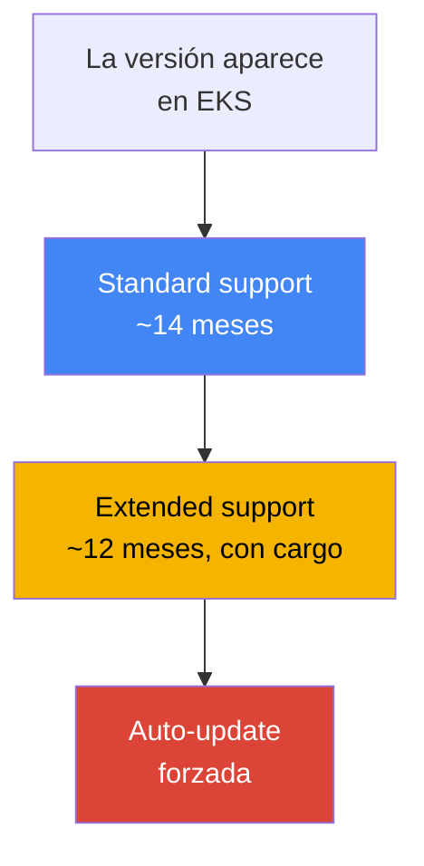
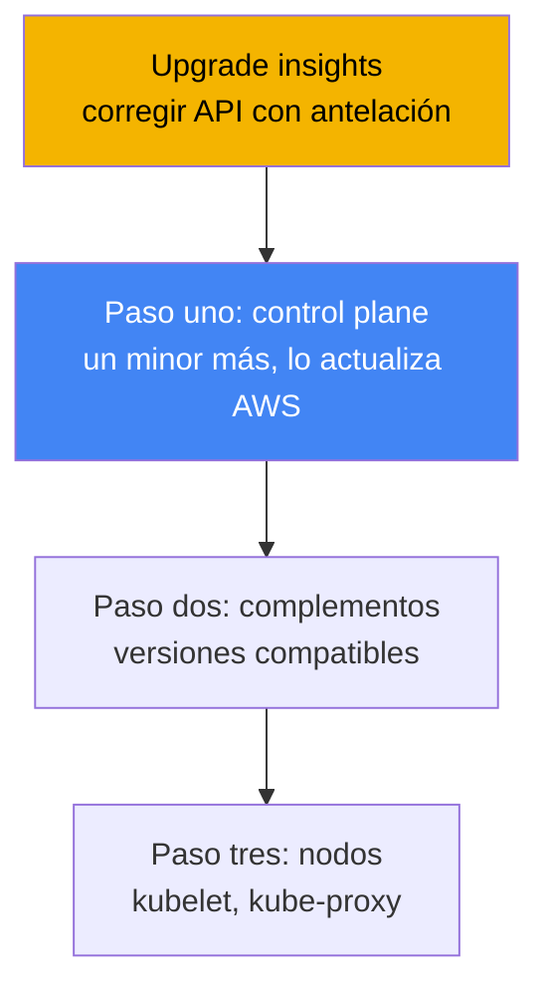
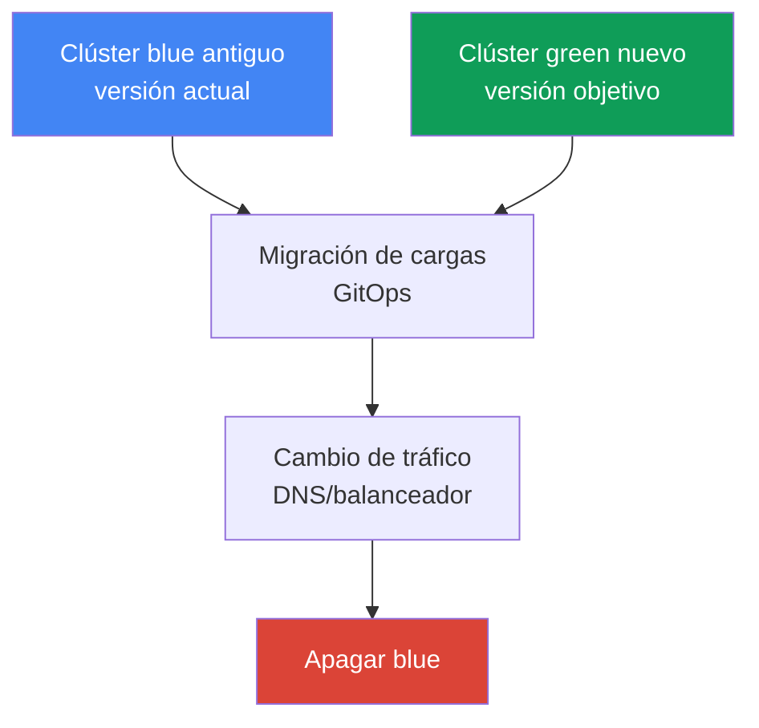

[Eng version](en.md) · [Русская версия](ru.md) · [Version française](fr.md) · [Deutsche Version](de.md) · [ქართული ვერსია](ge.md) · [繁體中文版](tw.md) · [日本語版](jp.md)
# Capítulo 38. Actualización del clúster: in-place por versiones, clústeres blue/green y API obsoletas

> **Qué sigue.** El capítulo 37 abordó los complementos: quién es propietario de su ciclo de vida y cómo mantener sus versiones alineadas con la versión del clúster. Aquí se trata la actualización de todo el clúster por versiones de Kubernetes: el ciclo de vida de las versiones, el orden de una actualización in-place, las API obsoletas y la migración blue/green. Los temas relacionados se delegan a otros capítulos: los propios complementos y su orden de actualización, capítulo 37; la reversión de versión (rollback readiness), capítulo 39; fiabilidad, PDB y apagado correcto de nodos, capítulo 40; GitOps para la migración blue/green, capítulo 44; nodos administrados y drift de Karpenter, capítulos 11 y 12.

## 38.1. «La versión pronto quedará sin soporte» y «apply dejó de aplicarse»

El primer escenario llega por correo y con un banner en la consola: la versión de su clúster pronto saldrá de standard support. No es una advertencia abstracta, sino el inicio de una cuenta atrás de pago. Tras el fin de standard support, el clúster no se rompe, pero pasa a extended support, por el que se cobra una tarifa mayor por hora de funcionamiento del clúster. Extended support tampoco es eterno: cuando también expire, EKS elevará la versión del clúster por sí mismo, sin preguntar por el calendario de su equipo. El síntoma es sencillo: una notificación y, en la salida de CLI, se ve cuánto le queda a la versión hasta el final de standard support:

```bash
# hasta qué fecha la versión está bajo standard support
aws eks describe-cluster-versions \
  --query 'clusterVersions[?clusterVersion==`1.33`].[clusterVersion,endOfStandardSupport]'
```

El segundo escenario llega después de la actualización y parece una rotura repentina del despliegue. Se elevó el clúster a un nuevo minor, todo está en verde, pero CI falla al desplegar y `kubectl apply` responde:

```bash
kubectl apply -f ingress.yaml
# error: resource mapping not found for name: "web" namespace: "prod"
# from "ingress.yaml": no matches for kind "Ingress" in version "extensions/v1beta1"
```

Nada se rompió «por sí solo»: en el nuevo minor Kubernetes eliminó el `apiVersion` con el que se escribió el manifiesto. Mientras el clúster vivía en la versión antigua, el antiguo `apiVersion` seguía atendiéndose; tras la actualización, el servidor API ya no lo conoce y cualquier manifiesto con este `apiVersion` deja de aplicarse. Los objetos que ya estaban en ejecución pudieron sobrevivir a la conversión, pero los nuevos despliegues y cualquier `apply` de ese recurso fallan ahora.

Ambos problemas tratan de lo mismo: actualizar el clúster no es un solo botón, sino un proceso con un calendario (ciclo de vida de las versiones) y preparación (API obsoletas). A continuación, en orden: cómo funciona el ciclo de vida de una versión, en qué orden se realiza una actualización in-place, cómo encontrar con antelación las API eliminadas, qué muestran los EKS cluster insights, cómo se actualizan los nodos y cuándo se levanta un clúster blue/green en lugar de actualizar in-place.

## 38.2. Ciclo de vida de una versión de EKS

Kubernetes publica un nuevo minor aproximadamente cada cuatro meses, y EKS sigue este ciclo. Cada versión minor en EKS tiene tres fases de soporte, y las actualizaciones se deben planificar de acuerdo con ellas.

| Fase | Duración | Qué significa |
|---|---|---|
| Standard support | ~14 meses desde el lanzamiento de la versión en EKS | soporte normal, sin cargo adicional por la versión |
| Extended support | ~12 meses tras el final de standard | la versión sigue activa, pero con una tarifa mayor por hora de clúster |
| Actualización forzada | al expirar extended support | EKS eleva por sí mismo la versión a la compatible más cercana |

Tres consecuencias para la operación. La primera es una **ventana de unos 14 meses para una actualización planificada**: mientras dura standard support, puede actualizarse con calma y sin un cargo extra por versión. La segunda es que **extended support no es una prórroga gratuita**: está activado de forma predeterminada y cuesta más por hora de funcionamiento del clúster, así que «simplemente no actualizar» es un pago consciente, no la ausencia de una decisión. La tercera es la **actualización forzada al final de extended support**: si no se actualiza a tiempo, EKS elevará la versión por sí mismo y los clústeres actualizados automáticamente al final de extended support ya no se pueden revertir (sobre la reversión, capítulo 39).



Hay otra restricción estricta: **solo se puede actualizar una versión minor cada vez**. No se puede saltar directamente de `1.30` a `1.33`: hay que pasar por `1.30` → `1.31` → `1.32` → `1.33`, cada minor como una actualización separada. La razón es que EKS mantiene un control plane de alta disponibilidad y actualiza kube-apiserver estrictamente un minor a la vez, dentro de los límites de version skew policy. Las versiones patch (por ejemplo, actualizaciones dentro del mismo minor) las aplica EKS por sí mismo, pero las actualizaciones minor corresponden al ingeniero y siempre son paso a paso.

## 38.3. Actualización in-place: orden y version skew

Una actualización in-place actualiza el mismo clúster a un nuevo minor, sin crear otro. No se realiza con un solo comando, sino mediante una secuencia, y el orden importa: lo dicta la version skew policy de Kubernetes (capítulo 37), que limita cuánto pueden retrasarse respecto a kube-apiserver los componentes de los nodos.



Los pasos son estos. Cero, la **preparación**: ejecutar upgrade insights y corregir las API obsoletas (secciones 38.4 y 38.5), comprobar que kubelet en los nodos no se retrase respecto al control plane más allá del skew permitido. Primero, el **control plane**: AWS actualiza por sí mismo el control plane administrado un minor; durante el proceso levanta nuevas instancias del servidor API y realiza una actualización rolling, para lo que necesita varias IP libres en las subredes del clúster. Si las comprobaciones de salud del nuevo control plane no pasan, EKS revierte el paso de infraestructura y el clúster se mantiene en la versión anterior; las cargas en ejecución no se ven afectadas.

El segundo paso son los **complementos**: los complementos core (`kube-proxy`, `coredns`, `vpc-cni`) no siguen automáticamente al control plane, sino que se elevan a versiones compatibles con el nuevo minor según `describe-addon-versions` (capítulo 37). El tercer paso son los **nodos**: kubelet y kube-proxy de los nodos se llevan a la versión del control plane. Según version skew policy (desde Kubernetes 1.28), kubelet puede retrasarse respecto a kube-apiserver hasta tres minors, por lo que no existe una exigencia estricta de actualizar los nodos justo después de cada minor, pero AWS recomienda mantener los nodos en la misma versión que el control plane y no acumular retraso. Los clientes (`kubectl`) y las demás aplicaciones del clúster (por ejemplo, cluster-autoscaler) también se llevan al nuevo minor.

## 38.4. API obsoletas y eliminadas

Kubernetes evoluciona las API por etapas: primero declara un `apiVersion` **deprecated** (obsoleto, pero aún funcional) y, tras varios minors, **removed** (eliminado: el servidor API ya no lo atiende). Son precisamente las versiones removed las que rompen `apply` en la sección 38.1. Conviene conocer los hitos de eliminación porque actualizar a través de ellos es lo más arriesgado:

| Versión | Qué se eliminó (ejemplos) |
|---|---|
| 1.16 | antiguos `apiVersion` para Deployment, DaemonSet, ReplicaSet (migración a `apps/v1`) |
| 1.22 | `Ingress` y `CustomResourceDefinition` de grupos beta, antiguos admission webhooks |
| 1.25 | `PodSecurityPolicy`, `CronJob batch/v1beta1`, `PodDisruptionBudget policy/v1beta1` |
| 1.29 | `flowcontrol.apiserver.k8s.io/v1beta2` (FlowSchema, PriorityLevelConfiguration) |
| 1.32 | `flowcontrol.apiserver.k8s.io/v1beta3` |

El peligro es que el problema es silencioso: mientras el clúster está en la versión antigua, el `apiVersion` obsoleto funciona y no protesta en voz alta, y se rompe exactamente al actualizar a través del hito de eliminación. Por eso las API obsoletas se buscan y corrigen **antes** de la actualización: se reescriben los manifiestos con el `apiVersion` actual y se despliegan de antemano, aún en la versión antigua del clúster (el nuevo `apiVersion` normalmente ya se admite allí). Herramientas de detección:

| Herramienta | Dónde busca | Particularidad |
|---|---|---|
| EKS upgrade insights | todo el clúster, por parte de AWS | integrado, señala el uso de API que se eliminarán |
| pluto | manifiestos en Git y releases de Helm | análisis estático incluso antes de aplicar |
| kube-no-trouble (`kubent`) | objetos en el clúster activo | ejecución rápida contra el estado real |
| `kubectl` deprecations / warnings | servidor API | advertencias en `apply`, plugin `kubectl deprecations` |

La práctica es la siguiente: `kubent` y upgrade insights muestran lo que ya está en el clúster, mientras que `pluto` detecta `apiVersion` obsoletos en el repositorio y charts de Helm incluso antes del despliegue. Ambas perspectivas son útiles: el clúster puede estar limpio, pero en Git puede quedar un manifiesto antiguo que romperá el siguiente despliegue tras la actualización.

## 38.5. EKS cluster insights y upgrade insights

**Cluster insights** es una comprobación integrada en EKS del clúster frente a una lista de problemas mantenida por AWS. Tiene tres tipos: **upgrade insights** (preparación para actualizar), **rollback readiness insights** (preparación para revertir, capítulo 39) y **configuration insights** (para hybrid nodes). Las comprobaciones se ejecutan automáticamente y se actualizan cada 24 horas; después de corregir un problema, la lista se puede actualizar manualmente sin esperar un día.

Para la actualización importa el tipo upgrade insights: EKS analiza por sí mismo el clúster en busca de aquello que puede impedir pasar a un nuevo minor, ante todo el uso de API de Kubernetes que se eliminarán, y ofrece recomendaciones con enlaces a la documentación. AWS amplía regularmente la lista de comprobaciones a medida que cambia Kubernetes, por lo que los insights deben revisarse **antes de cada actualización**, no solo una vez. EKS obtiene acceso a los datos mediante una access entry para insights creada automáticamente; no es necesario configurar permisos separados.

```bash
# lista de insights del clúster (incluidos los de upgrade)
aws eks list-insights --cluster-name my-cluster
# detalles de un insight concreto: estado, recomendación, recursos afectados
aws eks describe-insight --cluster-name my-cluster --id <insight-id>
```

El procedimiento es sencillo: antes de actualizar, abrir la pestaña upgrade insights (o revisar `list-insights`), analizar todo lo marcado como problema, corregir los manifiestos, actualizar los insights y comprobar que la lista esté limpia. Solo entonces se inicia la actualización del control plane.

## 38.6. Actualización de nodos

AWS actualiza el control plane, pero los nodos son responsabilidad del ingeniero, y el método depende de quién los gestione. Hay tres opciones:

| Método | Cómo se actualiza | Respeto de PDB |
|---|---|---|
| Managed node group | AWS realiza una actualización rolling: cordon, drain, sustitución mediante el nuevo launch template | sí, drain respeta PDB |
| Karpenter (drift) | recrea nodos con el nuevo AMI/versión como drift (capítulo 12) | sí, mediante graceful disruption |
| Self-managed | actualización del launch template y rotación de nodos manualmente o con automatización propia | depende de usted |

En un **managed node group**, la actualización se realiza por fases: EKS crea una nueva versión de launch template con el AMI objetivo, levanta nodos nuevos, marca los antiguos como unschedulable (cordon) y evacúa sus pods (drain). Drain respeta PodDisruptionBudget: los pods se desalojan teniendo en cuenta PDB, no todos a la vez. Aquí surge exactamente un bloqueo frecuente: un PDB demasiado estricto. Si no se pueden desalojar los pods en 15 minutos, la fase de actualización falla con el error `PodEvictionFailure`; entonces se relaja el PDB o se inicia la actualización con la marca force, que desaloja los pods de forma forzada ignorando PDB. El número de nodos actualizados en paralelo lo define `maxUnavailable` en el `updateConfig` del grupo.

**Karpenter** actualiza los nodos mediante el mecanismo drift (capítulo 12): cuando cambian el AMI o la versión deseados, Karpenter considera obsoletos los nodos existentes y los recrea, también con desalojos correctos. Los nodos **self-managed** se actualizan completamente por cuenta propia: se cambia el launch template y se rota el reemplazo. Sobre PDB, topology spread y apagado correcto de los nodos durante la rotación, consulte el capítulo 40.

## 38.7. Clústeres blue/green

In-place no es el único camino. La alternativa es **blue/green**: levantar junto al existente un clúster nuevo (green) directamente en la versión objetivo, migrar las cargas a él, cambiar el tráfico y apagar el antiguo (blue). La idea es probar gradualmente la versión objetivo con tráfico real, y reducir la reversión a cambiar el tráfico de vuelta al clúster antiguo, que aún sigue activo.



Las cargas se trasladan de forma declarativa mediante GitOps (capítulo 44): el mismo conjunto de manifiestos se aplica al clúster nuevo y el tráfico se cambia a nivel de DNS (Route 53) o de balanceador. La elección entre enfoques es un equilibrio entre riesgo, coste y complejidad:

| Criterio | In-place | Blue/green |
|---|---|---|
| Complejidad | más sencillo: un clúster, pasos ordenados | más complejo: dos clústeres, migración, tráfico |
| Coste | sin duplicar la infraestructura | temporalmente dos clústeres, más caro |
| Salto de versiones | solo un minor cada vez | directamente a la versión requerida del clúster nuevo |
| Riesgo y reversión | reversión dentro de una ventana de 7 días (capítulo 39) | reversión = devolver el tráfico a blue, rápida |
| Cuándo se elige | actualizaciones regulares normales | gran distancia entre versiones, riesgo elevado, incompatibilidades |

La regla práctica es esta: las **actualizaciones regulares se hacen in-place**, ya que es más sencillo, más barato y no duplica la infraestructura. Se usa **blue/green cuando in-place es arriesgado o imposible**: la versión está tan atrasada que recorrer todos los minors uno a uno es largo y peligroso; se necesita la posibilidad de revertir lo más rápidamente posible; o en el clúster nuevo cambia algo que in-place no soportará (conjunto de API eliminadas, cambio de red, otro conjunto de complementos). El precio de blue/green es la duplicación temporal de clústeres y el trabajo de migración y cambio de tráfico.

## 38.8. Cómo se aplica en producción

- **La actualización se planifica según el calendario de soporte, no al recibir el correo.** Se mantiene la versión dentro de standard support (~14 meses) y se actualiza con antelación, sin llegar a extended support con su tarifa mayor ni, mucho menos, a la actualización forzada.
- **Las API obsoletas se corrigen antes de actualizar, no después.** Se ejecutan upgrade insights, `kubent` en el clúster y `pluto` en Git y Helm, se reescriben los manifiestos con el `apiVersion` actual y se despliegan de antemano, aún en la versión antigua.
- **El orden se respeta estrictamente:** primero el control plane, luego los complementos core a versiones compatibles (capítulo 37), y después los nodos. Saltarse el paso de complementos provoca version skew y rompe la red y DNS.
- **Se actualiza un minor cada vez** y no se intenta saltar versiones; para clústeres atrasados muchos minors se valora blue/green en lugar de una larga cadena in-place.
- **Se preparan los PDB para la rotación de nodos.** Se comprueba que los presupuestos no sean demasiado estrictos; de lo contrario, drain de un managed node group se bloqueará en `PodEvictionFailure`; sobre PDB y graceful shutdown, consulte el capítulo 40.
- **La actualización se ensaya primero en un clúster no estable.** Un clúster de pruebas o staging se actualiza antes de producción, y allí se detectan las sorpresas de la nueva versión.

## 38.9. Mini glosario

- **standard support**: fase de soporte de una versión minor en EKS (~14 meses), funcionamiento normal sin cargo adicional por versión.
- **extended support**: fase posterior a standard (~12 meses): la versión sigue siendo compatible, pero con una tarifa mayor por hora de clúster; está activada de forma predeterminada.
- **actualización forzada**: elevación automática de la versión al expirar extended support; ese clúster no se puede revertir.
- **in-place upgrade**: actualización del mismo clúster al siguiente minor: control plane, después complementos, después nodos.
- **version skew policy**: regla de Kubernetes que limita el retraso de los componentes de los nodos respecto a kube-apiserver (capítulo 37).
- **deprecated / removed API**: `apiVersion` se declara obsoleto y luego se elimina; tras eliminarlo, los manifiestos que lo usan no se aplican.
- **cluster insights**: comprobaciones integradas de EKS: upgrade, rollback readiness y config.
- **upgrade insights**: tipo de insights que señala la preparación para actualizar y las API que se eliminarán.
- **pluto / kube-no-trouble (kubent)**: herramientas para buscar API obsoletas: pluto en Git y Helm, kubent en el clúster activo.
- **clúster blue/green**: clúster nuevo en la versión objetivo junto al antiguo, con migración de cargas y cambio de tráfico.

## 38.10. Conclusiones del capítulo

- Una versión de EKS tiene tres fases: standard support (~14 meses), extended support (~12 meses, más caro) y luego actualización forzada; la actualización debe planificarse dentro de la ventana de standard support.
- Solo se puede actualizar un minor cada vez; no se pueden saltar versiones. EKS aplica por sí mismo los patches; las actualizaciones minor corresponden al ingeniero.
- Una actualización in-place sigue este orden: preparación, control plane (lo actualiza AWS), complementos core a versiones compatibles (capítulo 37), y después nodos; el orden lo dicta version skew policy.
- Entre minors, Kubernetes elimina API (hitos 1.16, 1.22, 1.25, 1.29 y 1.32); tras actualizar, los manifiestos con el antiguo `apiVersion` dejan de aplicarse.
- Las API obsoletas se buscan de antemano: upgrade insights y `kubent` en el clúster, `pluto` en Git y Helm; los manifiestos se corrigen antes de actualizar.
- EKS cluster insights comprueba automáticamente la preparación del clúster para actualizar y señala las API que se eliminarán; se debe revisar antes de cada actualización.
- Los nodos se actualizan de forma diferente: managed node group (actualización rolling con drain, respeta PDB, marca force ante `PodEvictionFailure`), Karpenter (drift, capítulo 12), self-managed (por cuenta propia).
- Blue/green levanta un clúster nuevo en la versión objetivo y cambia el tráfico; se usa ante una gran distancia entre versiones, alto riesgo o incompatibilidades, a cambio de una duplicación temporal de clústeres.

## 38.11. Cómo sirve en el trabajo real

Durante una guardia, una actualización no es «pulsar actualizar», sino ejecutar una lista de comprobación. Antes de actualizar se revisan upgrade insights y se ejecutan `kubent` con `pluto` para que las API eliminadas aparezcan antes de la actualización, y no como un `kubectl apply` fallido en producción al día siguiente. Comprender que control plane, complementos y nodos se actualizan por separado y en orden estricto ahorra horas investigando «por qué se cayó la red después de una actualización exitosa»: normalmente es el paso olvidado de los complementos (capítulo 37).

Al planificar la operación se resuelven tres cosas. La primera es el calendario: mantener la versión dentro de standard support y actualizar con antelación, para no pagar extended support ni quedar sujeto a una actualización forzada sin ventana de reversión. La segunda es la estrategia: realizar las actualizaciones regulares in-place, un minor cada vez, y para clústeres muy atrasados o transiciones arriesgadas planificar con antelación blue/green con migración mediante GitOps (capítulo 44). La tercera es la preparación de los nodos: comprobar que los PDB no bloqueen drain y acordar si los nodos se actualizan mediante managed node group, Karpenter drift o manualmente. Entonces la actualización deja de ser una emergencia y se convierte en un procedimiento rutinario.

## 38.12. Preguntas de autoevaluación

1. ¿De qué tres fases consta el ciclo de vida de una versión minor de EKS y cuánto dura aproximadamente cada una?
2. ¿Qué ocurre si no se actualiza el clúster antes de terminar extended support y se puede revertir ese clúster?
3. ¿Por qué no se puede actualizar directamente de `1.30` a `1.33` y cómo se hace correctamente?
4. ¿En qué orden se realiza una actualización in-place y por qué exactamente así (qué regla lo dicta)?
5. ¿Qué significan los estados de API deprecated y removed, y en qué momento se rompe `kubectl apply`?
6. Nombre varios hitos de eliminación de API por versiones de Kubernetes.
7. ¿En qué se diferencia buscar API obsoletas con `kubent` de buscarlas con `pluto` y por qué se necesitan ambos?
8. ¿Qué son los EKS upgrade insights y cuándo deben revisarse?
9. ¿Cómo actualiza los nodos un managed node group y qué sucede si el PDB es demasiado estricto?
10. ¿Cómo actualiza los nodos Karpenter y en qué se diferencia de un managed node group?
11. ¿Qué es una actualización blue/green de un clúster y cómo es la reversión en ella?
12. ¿En qué casos se elige blue/green en lugar de in-place y cuál es su coste?

## Práctica

El laboratorio del curso para este tema: [laboratorio 113: actualización y reversión del clúster: control plane, complementos, API obsoletas](../../labs/113/README_ES.MD). Además, la preparación para actualizar y el estado actual de las versiones se pueden consultar fácilmente en un clúster activo. Primero vea la versión del clúster y cuánto le queda en standard support:

```bash
# versión actual del clúster
aws eks describe-cluster --name my-cluster --query 'cluster.version'
# fases de soporte de las versiones: hasta qué fecha standard support
aws eks describe-cluster-versions \
  --query 'clusterVersions[].[clusterVersion,endOfStandardSupport]' --output table
```

A continuación, ejecute las comprobaciones integradas de preparación para actualizar y analice lo marcado como problema:

```bash
# lista de insights del clúster (incluidos los de upgrade)
aws eks list-insights --cluster-name my-cluster
# detalles de un insight concreto: estado y recomendación
aws eks describe-insight --cluster-name my-cluster --id <insight-id>
```

Compruebe que nadie acceda directamente a API obsoletas y compare las versiones de los complementos core con el minor del clúster antes de pensar en actualizar:

```bash
# versiones de API disponibles en el clúster (busque grupos beta que pronto se eliminarán)
kubectl get --raw /apis | grep -o '"groupVersion":"[^"]*"'
# actualizar un complemento a una versión compatible (ejemplo; la versión se toma de describe-addon-versions)
aws eks update-addon --cluster-name my-cluster --addon-name kube-proxy \
  --addon-version <versión-compatible>
```

Relacione tres aspectos: la versión del clúster y la fecha de fin de standard support, la lista de upgrade insights y los `apiVersion` reales con los que se escribieron sus manifiestos en Git. Si los insights están limpios, no hay API obsoletas y los complementos son compatibles con el minor objetivo, el clúster está listo para una actualización in-place según el orden de la sección 38.3. La reversión, si algo sale mal, se aborda en el capítulo 39.

---
[Índice](../README_ES.md) · [Capítulo 37](../37/es.md) · [Capítulo 39](../39/es.md)
