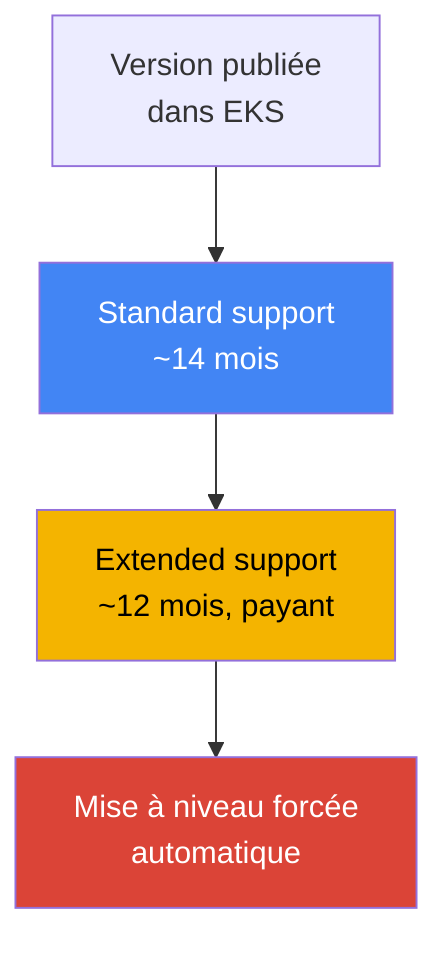
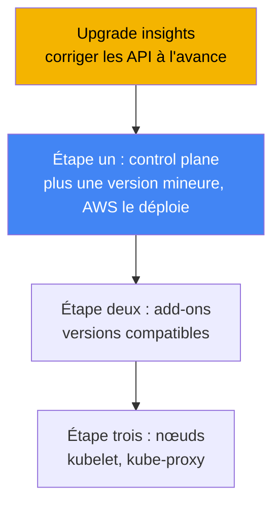
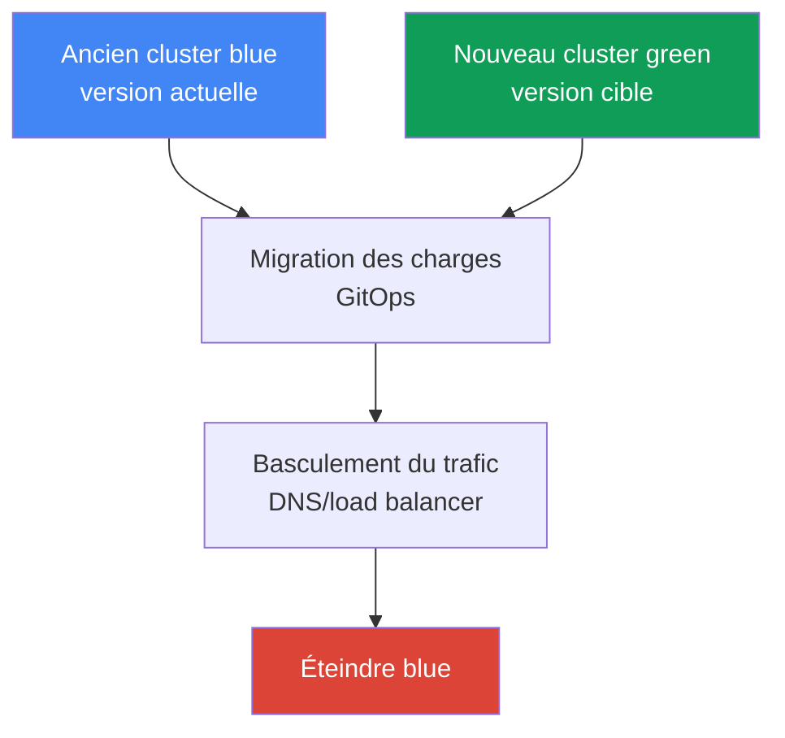

[Русская версия](ru.md) · [Eng version](en.md) · [Versión en español](es.md) · [Deutsche Version](de.md) · [ქართული ვერსია](ge.md) · [繁體中文版](tw.md) · [日本語版](jp.md)
# Chapitre 38. Mise à niveau du cluster : versions in-place, clusters blue/green et API obsolètes

> **La suite.** Le chapitre 37 a traité des add-ons : qui est responsable de leur cycle de vie et
> comment maintenir leurs versions alignées sur celle du cluster. Ce chapitre porte sur la mise à
> niveau de l'ensemble du cluster selon les versions de Kubernetes : cycle de vie des versions,
> ordre d'une mise à niveau in-place, API obsolètes et migration blue/green. Les sujets connexes
> sont traités dans d'autres chapitres : les add-ons eux-mêmes et leur ordre de mise à jour au
> chapitre 37, le retour à une version antérieure (rollback readiness) au chapitre 39, la
> fiabilité, les PDB et l'arrêt correct des nœuds au chapitre 40, GitOps pour la migration
> blue/green au chapitre 44, ainsi que les nœuds gérés et le drift de Karpenter aux chapitres 11
> et 12.

## 38.1. « La version va bientôt quitter le support » et « apply ne s'applique plus »

Le premier scénario arrive par e-mail et sous la forme d'une bannière dans la console : la version
votre cluster va bientôt sortir du standard support. Ce n'est pas un avertissement abstrait, mais
le début d'un compte à rebours payant. Après la fin du standard support, le cluster ne tombe pas
en panne, mais passe en extended support, qui entraîne un tarif horaire de cluster plus élevé.
L'extended support n'est pas éternel non plus : lorsqu'il expire à son tour, EKS augmente lui-même
la version du cluster, sans demander le calendrier de votre équipe. Le symptôme est simple : une
notification, et la sortie CLI indique combien de temps il reste à la version avant la fin du
standard support :

```bash
# date jusqu'à laquelle la version est sous standard support
aws eks describe-cluster-versions \
  --query 'clusterVersions[?clusterVersion==`1.33`].[clusterVersion,endOfStandardSupport]'
```

Le second scénario survient après la mise à niveau et ressemble à une défaillance soudaine du
déploiement. Le cluster est passé à une nouvelle version mineure, tout est au vert, mais le CI
échoue lors du rollout et `kubectl apply` répond :

```bash
kubectl apply -f ingress.yaml
# error: resource mapping not found for name: "web" namespace: "prod"
# from "ingress.yaml": no matches for kind "Ingress" in version "extensions/v1beta1"
```

Rien ne s'est cassé « tout seul » : dans la nouvelle version mineure, Kubernetes a supprimé
l'`apiVersion` utilisé pour écrire le manifeste. Tant que le cluster fonctionnait sur l'ancienne
version, l'ancien `apiVersion` était encore servi ; après la mise à niveau, le serveur API ne le
connaît plus et tout manifeste contenant cet `apiVersion` cesse de s'appliquer. Les objets déjà
exécutés ont pu survivre à la conversion, mais les nouveaux déploiements et tout `apply` de cette
ressource échouent désormais.

Les deux problèmes relèvent de la même chose : mettre à niveau le cluster n'est pas un seul bouton,
mais un processus avec un calendrier (cycle de vie des versions) et une préparation (API obsolètes).
Voici, dans l'ordre : le fonctionnement du cycle de vie d'une version, l'ordre d'une mise à niveau
in-place, la manière de trouver à l'avance les API supprimées, ce que montrent les EKS cluster
insights, la façon de mettre à jour les nœuds et les cas où l'on crée un cluster blue/green plutôt
que de faire une mise à niveau in-place.

## 38.2. Cycle de vie d'une version EKS

Kubernetes publie une nouvelle version mineure environ tous les quatre mois, et EKS suit ce cycle.
Chaque version mineure dans EKS comporte trois phases de support, selon lesquelles il convient de
planifier les mises à niveau.

| Phase | Durée | Signification |
|---|---|---|
| Standard support | ~14 mois après la sortie de la version dans EKS | support normal, sans surcoût lié à la version |
| Extended support | ~12 mois après la fin du standard | la version reste active, mais le tarif par heure de cluster est plus élevé |
| Mise à niveau forcée | après l'expiration de l'extended support | EKS élève lui-même la version vers la version supportée la plus proche |

Trois conséquences pour l'exploitation. Premièrement, la **fenêtre pour une mise à niveau planifiée
est d'environ 14 mois** : pendant le standard support, on peut se mettre à niveau sereinement et
sans surcoût lié à la version. Deuxièmement, **l'extended support n'est pas un délai gratuit** : il
est activé par défaut et coûte plus cher par heure de fonctionnement du cluster ; « simplement ne
pas mettre à jour » correspond donc à un coût choisi consciemment, et non à l'absence de décision.
Troisièmement, une **mise à niveau forcée à la fin de l'extended support** : si la mise à niveau
n'est pas effectuée à temps, EKS élève la version lui-même, et les clusters mis à niveau
automatiquement à la fin de l'extended support ne peuvent ensuite plus revenir en arrière (voir le
chapitre 39 pour le rollback).



Une autre contrainte stricte : **on ne peut mettre à niveau que d'une version mineure à la fois**.
Il est impossible de passer directement de `1.30` à `1.33` : il faut passer par `1.30` → `1.31`
→ `1.32` → `1.33`, chaque version mineure faisant l'objet d'une mise à niveau distincte. Cela
s'explique par le fait qu'EKS maintient un control plane hautement disponible et met à jour le
kube-apiserver strictement d'une version mineure à la fois, dans les limites de la version skew
policy. EKS applique lui-même les versions de correctif (par exemple les mises à jour au sein d'une
même version mineure), mais les mises à niveau mineures relèvent de l'ingénieur, toujours étape par
étape.

## 38.3. Mise à niveau in-place : ordre et version skew

Une mise à niveau in-place consiste à mettre à jour le même cluster vers une nouvelle version
mineure, sans en créer un second. Elle ne se résume pas à une seule commande, mais à une séquence
dont l'ordre est important : il est imposé par la version skew policy de Kubernetes (chapitre 37),
qui limite le retard que peuvent prendre les composants des nœuds par rapport au kube-apiserver.



Les étapes sont les suivantes. Zéro, la **préparation** : exécuter les upgrade insights et corriger
les API obsolètes (sections 38.4 et 38.5), puis vérifier que le kubelet des nœuds ne retarde pas le
control plane au-delà du skew autorisé. Première, le **control plane** : AWS met lui-même à niveau
le control plane géré, d'une version mineure ; durant l'opération, il crée de nouvelles instances
de serveur API et effectue une rolling update, ce qui nécessite plusieurs IP libres dans les
sous-réseaux du cluster. Si les contrôles de santé du nouveau control plane échouent, EKS annule
l'étape d'infrastructure et le cluster reste sur sa version précédente, sans affecter les charges de
travail en cours d'exécution.

La deuxième étape concerne les **add-ons** : les add-ons principaux (`kube-proxy`, `coredns`,
`vpc-cni`) ne suivent pas automatiquement le control plane ; il faut les élever aux versions
compatibles avec la nouvelle version mineure à l'aide de `describe-addon-versions` (chapitre 37).
La troisième étape porte sur les **nœuds** : le kubelet et le kube-proxy des nœuds sont amenés à la
version du control plane. D'après la version skew policy (à partir de Kubernetes 1.28), le kubelet
peut avoir jusqu'à trois versions mineures de retard sur le kube-apiserver ; il n'est donc pas
impératif de mettre à jour les nœuds juste après chaque version mineure, mais AWS recommande de les
maintenir sur la même version que le control plane et de ne pas accumuler de retard. Les clients
(`kubectl`) et les autres applications du cluster (par exemple cluster-autoscaler) sont également
amenés à la nouvelle version mineure.

## 38.4. API obsolètes et supprimées

Kubernetes fait évoluer les API par étapes : il déclare d'abord un `apiVersion` **deprecated**
(obsolète, mais encore fonctionnel), puis, quelques versions mineures plus tard, **removed**
(supprimé : le serveur API ne le sert plus). Ce sont précisément les versions removed qui font
échouer `apply` dans la section 38.1. Il faut connaître les jalons de suppression, car leur
franchissement pendant une mise à niveau est le plus risqué :

| Version | Éléments supprimés (exemples) |
|---|---|
| 1.16 | anciens `apiVersion` pour Deployment, DaemonSet, ReplicaSet (migration vers `apps/v1`) |
| 1.22 | `Ingress` et `CustomResourceDefinition` des groupes bêta, anciens admission webhooks |
| 1.25 | `PodSecurityPolicy`, `CronJob batch/v1beta1`, `PodDisruptionBudget policy/v1beta1` |
| 1.29 | `flowcontrol.apiserver.k8s.io/v1beta2` (FlowSchema, PriorityLevelConfiguration) |
| 1.32 | `flowcontrol.apiserver.k8s.io/v1beta3` |

Le danger vient du caractère silencieux du problème : tant que le cluster est sur l'ancienne
version, l'`apiVersion` obsolète fonctionne sans se plaindre bruyamment, puis casse exactement au
moment de la mise à niveau qui franchit le jalon de suppression. Il faut donc trouver et corriger
les API obsolètes **avant** la mise à niveau : réécrire les manifestes avec l'`apiVersion` actuel et
les déployer à l'avance, pendant que le cluster est encore sur son ancienne version (le nouvel
`apiVersion` y est généralement déjà supporté). Outils de détection :

| Outil | Où il regarde | Particularité |
|---|---|---|
| EKS upgrade insights | l'ensemble du cluster, par AWS | intégré, signale l'utilisation d'API qui vont être supprimées |
| pluto | manifestes dans Git et releases Helm | analyse statique avant même l'application |
| kube-no-trouble (`kubent`) | objets dans le cluster actif | exécution rapide sur l'état réel |
| `kubectl` deprecations / warnings | serveur API | avertissements lors de `apply`, plugin `kubectl deprecations` |

En pratique, `kubent` et les upgrade insights montrent ce qui se trouve déjà dans le cluster,
tandis que `pluto` détecte les `apiVersion` obsolètes dans le dépôt et les charts Helm avant le
déploiement. Les deux points de vue sont utiles : le cluster peut être propre, mais Git peut encore
contenir un ancien manifeste qui cassera le prochain déploiement après la mise à niveau.

## 38.5. EKS cluster insights et upgrade insights

Les **cluster insights** sont la vérification intégrée à EKS du cluster par rapport à une liste de
problèmes maintenue par AWS. Ils existent en trois types : les **upgrade insights** (préparation à
la mise à niveau), les **rollback readiness insights** (préparation au rollback, chapitre 39) et
les **configuration insights** (pour les hybrid nodes). Les contrôles s'exécutent automatiquement
et sont actualisés toutes les 24 heures ; après correction d'un problème, la liste peut être
actualisée manuellement sans attendre le lendemain.

Pour la mise à niveau, les upgrade insights sont importants : EKS analyse lui-même le cluster pour
repérer ce qui peut empêcher le passage à une nouvelle version mineure, en premier lieu
l'utilisation d'API Kubernetes qui vont être supprimées, et fournit des recommandations avec des
liens vers la documentation. AWS complète régulièrement la liste des contrôles au rythme des
évolutions de Kubernetes ; il faut donc consulter les insights **avant chaque mise à niveau**, et
non une seule fois. EKS accède aux données via une access entry créée automatiquement pour les
insights : aucune autorisation distincte n'est nécessaire.

```bash
# liste des insights du cluster (y compris upgrade)
aws eks list-insights --cluster-name my-cluster
# détails d'un insight particulier : statut, recommandation, ressources concernées
aws eks describe-insight --cluster-name my-cluster --id <insight-id>
```

La procédure est simple : avant la mise à niveau, ouvrir l'onglet upgrade insights (ou parcourir
`list-insights`), examiner tout ce qui est marqué comme un problème, corriger les manifestes,
actualiser les insights et vérifier que la liste est propre. Ce n'est qu'ensuite qu'il faut lancer
la mise à jour du control plane.

## 38.6. Mise à jour des nœuds

AWS met à jour le control plane, mais les nœuds relèvent de la responsabilité de l'ingénieur, et la
méthode dépend de leur mode de gestion. Trois possibilités :

| Méthode | Comment la mise à jour est effectuée | Respect des PDB |
|---|---|---|
| Managed node group | AWS réalise une rolling update : cordon, drain, remplacement avec le nouveau launch template | oui, le drain respecte les PDB |
| Karpenter (drift) | recrée les nœuds sur le nouvel AMI/version en tant que drift (chapitre 12) | oui, via une graceful disruption |
| Self-managed | mise à jour du launch template et renouvellement des nœuds manuellement ou via votre automatisation | à votre charge |

Pour un **managed node group**, la mise à niveau se déroule par phases : EKS crée une nouvelle
version du launch template avec l'AMI cible, démarre de nouveaux nœuds, marque les anciens comme
unschedulable (cordon), puis évacue leurs pods (drain). Le drain respecte le PodDisruptionBudget :
les pods sont évincés conformément au PDB, et non tous à la fois. C'est précisément là qu'apparaît
un blocage fréquent : un PDB trop strict. Si les pods ne peuvent pas être évincés en 15 minutes, la
phase de mise à niveau échoue avec l'erreur `PodEvictionFailure` ; il faut alors soit assouplir le
PDB, soit lancer la mise à jour avec le flag force, qui évince les pods de force en ignorant les
PDB. Le nombre de nœuds mis à jour en parallèle est défini par `maxUnavailable` dans
`updateConfig` du groupe.

**Karpenter** met à jour les nœuds par le mécanisme de drift (chapitre 12) : lorsque l'AMI ou la
version désirée change, Karpenter considère les nœuds existants comme obsolètes et les recrée, là
aussi avec une éviction correcte. Les nœuds **self-managed** sont mis à jour entièrement par vos
soins : vous modifiez le launch template et effectuez le remplacement. Les PDB, le topology spread
et l'arrêt correct des nœuds pendant leur renouvellement sont traités au chapitre 40.

## 38.7. Clusters blue/green

In-place n'est pas le seul chemin. L'alternative est le **blue/green** : créer à côté un nouveau
cluster (green) directement sur la version cible, y migrer les charges de travail, basculer le
trafic et éteindre l'ancien (blue). L'objectif est de vérifier progressivement la version cible avec
du trafic réel, tandis que le rollback se réduit à basculer à nouveau le trafic vers l'ancien
cluster, qui fonctionne toujours.



Les charges de travail sont déplacées de manière déclarative par GitOps (chapitre 44) : le même
ensemble de manifestes est appliqué au nouveau cluster, et le trafic est basculé au niveau du DNS
(Route 53) ou du load balancer. Le choix entre les approches est un compromis entre risque, coût et
complexité :

| Critère | In-place | Blue/green |
|---|---|---|
| Complexité | plus simple : un cluster, des étapes ordonnées | plus complexe : deux clusters, migration, trafic |
| Coût | sans duplication de l'infrastructure | deux clusters temporairement, plus coûteux |
| Saut de versions | une seule version mineure à la fois | directement vers la version voulue du nouveau cluster |
| Risque et rollback | rollback dans une fenêtre de 7 jours (chapitre 39) | rollback = renvoyer le trafic vers blue, rapide |
| Cas d'utilisation | mises à niveau régulières standard | fort retard de versions, risque élevé, incompatibilités |

La règle pratique est la suivante : les **mises à niveau régulières se font in-place**, car c'est
plus simple, moins cher et sans duplication d'infrastructure. On choisit le **blue/green lorsque
l'in-place est risqué ou impossible** : la version a tellement de retard que traverser toutes les
versions mineures une à une est long et dangereux ; il faut pouvoir effectuer un rollback très
rapidement ; ou le nouveau cluster change quelque chose que l'in-place ne supporterait pas
(ensemble d'API supprimées, changement réseau, autre ensemble d'add-ons). Le prix du blue/green
est la duplication temporaire des clusters et le travail de migration et de basculement du trafic.

## 38.8. Application en production

- **Planifier les mises à niveau selon le calendrier de support, pas à la réception de l'e-mail.**
  Maintenir la version dans le standard support (~14 mois) et mettre à jour à l'avance, sans
  atteindre l'extended support plus coûteux ni, a fortiori, la mise à niveau forcée.
- **Corriger les API obsolètes avant la mise à niveau, pas après.** Exécuter les upgrade insights,
  `kubent` sur le cluster et `pluto` sur Git et Helm, réécrire les manifestes avec l'`apiVersion`
  actuel et les déployer à l'avance, encore sur l'ancienne version.
- **Respecter strictement l'ordre :** d'abord le control plane, puis les core add-ons vers des
  versions compatibles (chapitre 37), puis les nœuds. Sauter l'étape des add-ons crée du version
  skew et casse le réseau et le DNS.
- **Mettre à niveau une seule version mineure à la fois** sans tenter de sauter des versions ; pour
  les clusters en retard de nombreuses versions mineures, évaluer le blue/green plutôt qu'une longue
  chaîne d'opérations in-place.
- **Préparer les PDB au renouvellement des nœuds.** Vérifier que les budgets ne sont pas trop
  stricts ; autrement, le drain du managed node group échouera avec `PodEvictionFailure`. Les PDB
  et le graceful shutdown sont traités au chapitre 40.
- **Tester d'abord la mise à niveau sur un cluster non critique.** Mettre à jour un cluster de test
  ou de staging avant la production et y détecter les surprises de la nouvelle version.

## 38.9. Mini-glossaire

- **standard support** : phase de support d'une version mineure dans EKS (~14 mois), exploitation
  normale sans surcoût lié à la version.
- **extended support** : phase après le standard (~12 mois) : la version reste supportée, mais au
  prix horaire de cluster majoré ; elle est activée par défaut.
- **mise à niveau forcée** : augmentation automatique de version à l'expiration de l'extended
  support ; un tel cluster ne peut pas faire l'objet d'un rollback.
- **in-place upgrade** : mise à jour du même cluster vers la version mineure suivante : control
  plane, puis add-ons, puis nœuds.
- **version skew policy** : règle Kubernetes limitant le retard des composants des nœuds par
  rapport au kube-apiserver (chapitre 37).
- **API deprecated / removed** : un `apiVersion` est déclaré obsolète, puis supprimé ; après sa
  suppression, les manifestes qui l'emploient ne s'appliquent plus.
- **cluster insights** : contrôles EKS intégrés : upgrade, rollback readiness, config.
- **upgrade insights** : type d'insights signalant la préparation à une mise à niveau et les API
  qui vont être supprimées.
- **pluto / kube-no-trouble (kubent)** : outils de recherche d'API obsolètes : pluto dans Git et
  Helm, kubent dans le cluster actif.
- **cluster blue/green** : nouveau cluster sur la version cible, à côté de l'ancien, avec migration
  des charges de travail et basculement du trafic.

## 38.10. Résumé du chapitre

- Une version EKS a trois phases : standard support (~14 mois), extended support (~12 mois, plus
  coûteux), puis mise à niveau forcée ; il faut planifier la mise à niveau durant le standard
  support.
- Il n'est possible de se mettre à niveau que d'une version mineure à la fois ; on ne peut pas
  sauter de versions. EKS applique lui-même les correctifs, les mises à niveau mineures relèvent de
  l'ingénieur.
- Une mise à niveau in-place suit cet ordre : préparation, control plane (déployé par AWS),
  core add-ons vers les versions compatibles (chapitre 37), puis nœuds ; cet ordre est imposé par la
  version skew policy.
- Entre les versions mineures, Kubernetes supprime des API (jalons 1.16, 1.22, 1.25, 1.29, 1.32) ;
  après la mise à niveau, les manifestes avec l'ancien `apiVersion` cessent de s'appliquer.
- Les API obsolètes sont recherchées à l'avance : upgrade insights et `kubent` dans le cluster,
  `pluto` dans Git et Helm ; les manifestes sont corrigés avant la mise à niveau.
- Les EKS cluster insights vérifient automatiquement la préparation du cluster à la mise à niveau
  et signalent les API qui vont être supprimées ; il faut les consulter avant chaque mise à jour.
- Les nœuds sont mis à jour différemment : managed node group (rolling update avec drain, respecte
  les PDB, flag force lors de `PodEvictionFailure`), Karpenter (drift, chapitre 12), self-managed
  (par vous-même).
- Le blue/green crée un nouveau cluster sur la version cible et bascule le trafic ; il est choisi en
  cas de fort retard de versions, de risque élevé ou d'incompatibilités, au prix d'une duplication
  temporaire des clusters.

## 38.11. Utilité dans le travail réel

En astreinte, une mise à niveau ne consiste pas à « cliquer sur mettre à jour », mais à parcourir
une checklist. Avant l'opération, on consulte les upgrade insights et on exécute `kubent` avec
`pluto`, afin que les API supprimées remontent avant la mise à niveau, et non sous la forme d'un
`kubectl apply` qui échoue en production le lendemain. Comprendre que le control plane, les add-ons
et les nœuds sont mis à jour séparément et dans un ordre strict évite des heures d'investigation sur
la question « pourquoi le réseau est-il tombé après une mise à niveau réussie ? » : il s'agit
souvent de l'étape des add-ons oubliée (chapitre 37).

Lors de la planification de l'exploitation, trois décisions sont prises. Premièrement, le calendrier
: maintenir la version dans le standard support et mettre à jour en avance, afin de ne pas payer
l'extended support et de ne pas être soumis à une mise à niveau forcée sans fenêtre de rollback.
Deuxièmement, la stratégie : effectuer les mises à niveau régulières in-place, une version mineure
à la fois, et prévoir à l'avance le blue/green avec migration via GitOps (chapitre 44) pour les
clusters très en retard ou les transitions risquées. Troisièmement, la préparation des nœuds :
vérifier que les PDB ne bloqueront pas le drain et convenir si les nœuds sont mis à jour via managed
node group, Karpenter drift ou manuellement. La mise à niveau cesse alors d'être une urgence et
devient une procédure routinière.

## 38.12. Questions d'auto-évaluation

1. De quelles trois phases se compose le cycle de vie d'une version mineure EKS et quelle est la
   durée approximative de chacune ?
2. Que se passe-t-il si le cluster n'est pas mis à niveau avant la fin de l'extended support, et
   peut-on effectuer un rollback sur un tel cluster ?
3. Pourquoi ne peut-on pas passer directement de `1.30` à `1.33` et quelle est la bonne méthode ?
4. Dans quel ordre se déroule une mise à niveau in-place et pourquoi cet ordre précis (quelle règle
   l'impose) ?
5. Que signifient les états API deprecated et removed, et à quel moment `kubectl apply` échoue-t-il ?
6. Citez plusieurs jalons de suppression d'API selon les versions Kubernetes.
7. Quelle différence y a-t-il entre la recherche d'API obsolètes avec `kubent` et celle avec
   `pluto`, et pourquoi les deux sont-ils nécessaires ?
8. Que sont les EKS upgrade insights et quand faut-il les consulter ?
9. Comment un managed node group met-il à jour les nœuds et que se passe-t-il si le PDB est trop
   strict ?
10. Comment Karpenter met-il à jour les nœuds et en quoi cela diffère-t-il d'un managed node group ?
11. Qu'est-ce qu'une mise à niveau de cluster blue/green et comment y effectue-t-on le rollback ?
12. Dans quels cas choisit-on le blue/green plutôt que l'in-place, et quel prix cela implique-t-il ?

## Pratique

La lab du cours consacrée à ce sujet : [lab 113 - Mise à niveau et rollback du cluster : control
plane, add-ons, API obsolètes](../../labs/113/README_FR.MD). En complément, il est facile de
relever la préparation à une mise à niveau et l'état actuel des versions sur un cluster actif.
Commencez par consulter la version du cluster et le temps qui lui reste en standard support :

```bash
# version actuelle du cluster
aws eks describe-cluster --name my-cluster --query 'cluster.version'
# phases de support des versions : date de fin du standard support
aws eks describe-cluster-versions \
  --query 'clusterVersions[].[clusterVersion,endOfStandardSupport]' --output table
```

Exécutez ensuite les contrôles intégrés de préparation à la mise à niveau et examinez ce qui est
marqué comme problème :

```bash
# liste des insights du cluster (y compris upgrade)
aws eks list-insights --cluster-name my-cluster
# détails d'un insight particulier : statut et recommandation
aws eks describe-insight --cluster-name my-cluster --id <insight-id>
```

Vérifiez que personne n'appelle directement des API obsolètes et comparez les versions des
core add-ons avec la version mineure du cluster avant d'envisager la mise à niveau :

```bash
# versions d'API disponibles dans le cluster (recherchez les groupes bêta bientôt supprimés)
kubectl get --raw /apis | grep -o '"groupVersion":"[^"]*"'
# mettre à jour un add-on vers une version compatible (exemple ; la version est tirée de describe-addon-versions)
aws eks update-addon --cluster-name my-cluster --addon-name kube-proxy \
  --addon-version <version-compatible>
```

Comparez trois éléments : la version du cluster et la date de fin du standard support, la liste des
upgrade insights et les `apiVersion` réels utilisés dans vos manifestes Git. Si les insights sont
propres, qu'il n'y a pas d'API obsolète et que les add-ons sont compatibles avec la version mineure
cible, le cluster est prêt pour une mise à niveau in-place dans l'ordre de la section 38.3. Le
rollback, si quelque chose tourne mal, est traité au chapitre 39.

---
[Table des matières](../README_FR.md) · [Chapitre 37](../37/fr.md) · [Chapitre 39](../39/fr.md)
