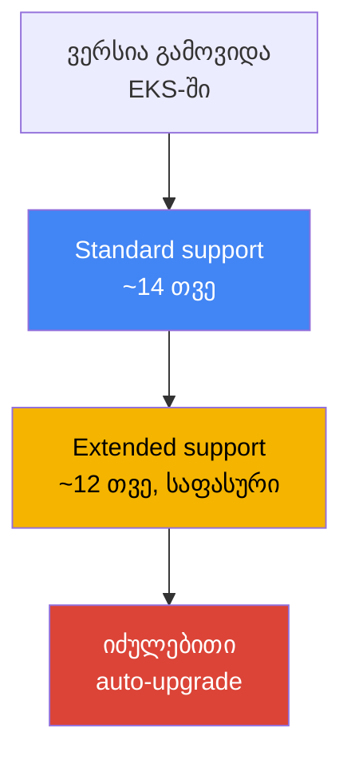
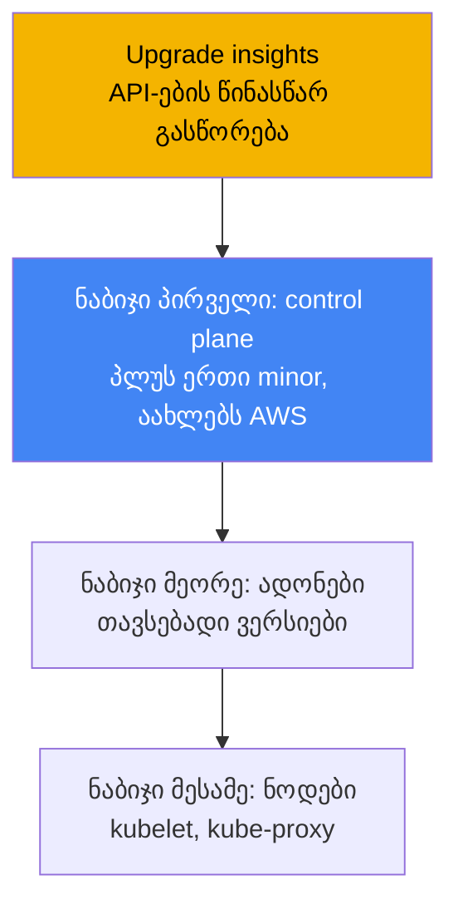
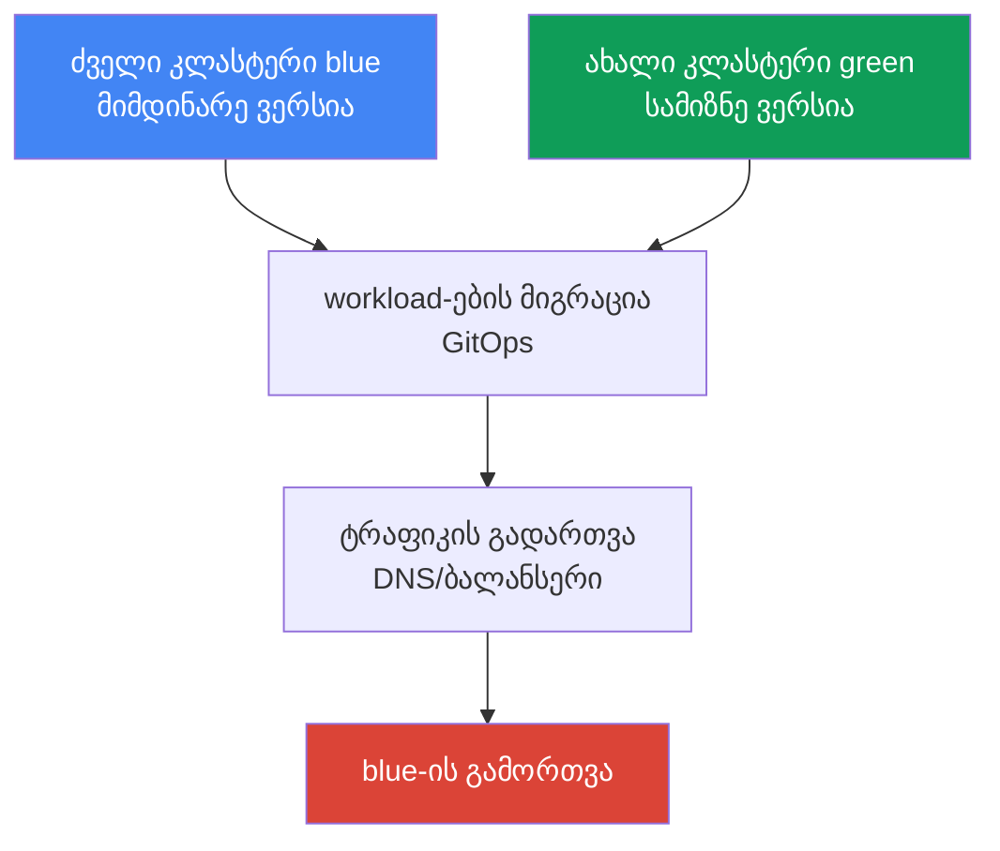

[Русская версия](ru.md) · [Eng version](en.md) · [Versión en español](es.md) · [Version française](fr.md) · [Deutsche Version](de.md) · [繁體中文版](tw.md) · [日本語版](jp.md)
# თავი 38. კლასტერის განახლება: ვერსიების in-place განახლება, blue/green კლასტერები, მოძველებული API-ები

> **რა არის შემდეგ.** 37-ე თავში განვიხილეთ ადონები: ვინ მართავს მათ სასიცოცხლო ციკლს და როგორ
> შევინარჩუნოთ მათი ვერსიები კლასტერის ვერსიასთან თანხვედრაში. აქ განვიხილავთ მთელი კლასტერის
> განახლებას Kubernetes-ის ვერსიების მიხედვით: ვერსიის სასიცოცხლო ციკლს, in-place upgrade-ის
> თანმიმდევრობას, მოძველებულ API-ებსა და blue/green მიგრაციას. მომიჯნავე თემები სხვა თავებშია:
> თავად ადონები და მათი განახლების თანმიმდევრობა - თავი 37, ვერსიის უკან დაბრუნება (rollback
> readiness) - თავი 39, საიმედოობა, PDB და ნოდების კორექტული გამორთვა - თავი 40, GitOps
> blue/green მიგრაციისთვის - თავი 44, managed ნოდები და Karpenter drift - თავები 11 და 12.

## 38.1. „ვერსიის მხარდაჭერა მალე დასრულდება“ და „apply აღარ მუშაობს“

პირველი სცენარის შესახებ ელფოსტით და კონსოლში ბანერით შეიტყობთ: თქვენი კლასტერის ვერსია მალე
standard support-იდან გავა. ეს აბსტრაქტული გაფრთხილება კი არა, ფასიანი დროის ათვლის დასაწყისია.
standard support-ის დასრულების შემდეგ კლასტერი არ ფუჭდება, თუმცა extended support-ზე გადადის,
რისთვისაც კლასტერის მუშაობის საათში გაზრდილი საფასურია დაწესებული. extended support-იც არ არის
უსასრულო: მისი ამოწურვის შემდეგ EKS კლასტერის ვერსიას თქვენი გუნდის განრიგის უკითხავად თვითონ
აამაღლებს. სიმპტომი მარტივია - შეტყობინება, ხოლო CLI-ის გამოტანილ მონაცემებში ჩანს, რამდენი დრო
დარჩა ვერსიას standard support-ის დასრულებამდე:

```bash
# რომელ თარიღამდეა ვერსია standard support-ის ქვეშ
aws eks describe-cluster-versions \
  --query 'clusterVersions[?clusterVersion==`1.33`].[clusterVersion,endOfStandardSupport]'
```

მეორე სცენარი უკვე upgrade-ის შემდეგ ჩნდება და deployment-ის მოულოდნელ გაფუჭებას ჰგავს.
კლასტერი ახალ minor ვერსიაზე განახლდა, ყველაფერი მწვანეა, მაგრამ CI გაშვებისას შეცდომით სრულდება,
ხოლო `kubectl apply` პასუხობს:

```bash
kubectl apply -f ingress.yaml
# error: resource mapping not found for name: "web" namespace: "prod"
# from "ingress.yaml": no matches for kind "Ingress" in version "extensions/v1beta1"
```

არაფერი გაფუჭებულა „თავისით“: Kubernetes-ის ახალ minor ვერსიაში წაიშალა `apiVersion`, რომლითაც
მანიფესტი იყო დაწერილი. სანამ კლასტერი ძველ ვერსიაზე მუშაობდა, ძველი `apiVersion` ჯერ კიდევ
მუშავდებოდა; upgrade-ის შემდეგ API-სერვერი მას აღარ ცნობს და ამ `apiVersion`-ის შემცველი ნებისმიერი
მანიფესტის გამოყენება წყდება. უკვე გაშვებულ ობიექტებს შესაძლოა კონვერტაციის შემდეგ მუშაობა
გაეგრძელებინათ, მაგრამ ახალი გაშვებები და ამ რესურსის ნებისმიერი `apply` ახლა შეცდომით სრულდება.

ორივე პრობლემა ერთ რამეს ეხება: კლასტერის განახლება ერთი ღილაკი კი არა, პროცესია, რომელსაც აქვს
განრიგი (ვერსიების სასიცოცხლო ციკლი) და მომზადება სჭირდება (მოძველებული API-ები). შემდეგ
თანმიმდევრულად განვიხილავთ: როგორ არის მოწყობილი ვერსიის სასიცოცხლო ციკლი, რა თანმიმდევრობით
სრულდება in-place upgrade, როგორ ვიპოვოთ წინასწარ წასაშლელი API-ები, რას აჩვენებს EKS cluster
insights, როგორ ახლდება ნოდები და როდის ქმნიან in-place განახლების ნაცვლად blue/green კლასტერს.

## 38.2. EKS-ის ვერსიის სასიცოცხლო ციკლი

Kubernetes ახალ minor ვერსიას საშუალოდ ოთხ თვეში ერთხელ უშვებს და EKS ამ ციკლს მიჰყვება. EKS-ში
თითოეულ minor ვერსიას მხარდაჭერის სამი ფაზა აქვს და განახლებები მათი მიხედვით უნდა დაიგეგმოს.

| ფაზა | ხანგრძლივობა | რას ნიშნავს |
|---|---|---|
| Standard support | EKS-ში ვერსიის გამოშვებიდან ~14 თვე | ჩვეულებრივი მხარდაჭერა, ვერსიისთვის დამატებითი საფასურის გარეშე |
| Extended support | standard-ის დასრულებიდან ~12 თვე | ვერსია ჯერ კიდევ მუშაობს, მაგრამ კლასტერის საათში გაზრდილი საფასურით |
| იძულებითი upgrade | extended support-ის ამოწურვის შემდეგ | EKS ვერსიას თავად აამაღლებს უახლოეს მხარდაჭერილ ვერსიამდე |

ექსპლუატაციისთვის ამას სამი შედეგი აქვს. პირველი - **გეგმური upgrade-ის ფანჯარა დაახლოებით 14
თვეა**: სანამ standard support მოქმედებს, განახლება მშვიდად და ვერსიისთვის დამატებითი საფასურის
გარეშე შეიძლება. მეორე - **extended support უფასო გადავადება არ არის**: ის ნაგულისხმევად
ჩართულია და კლასტერის მუშაობის საათში უფრო ძვირი ღირს, ამიტომ „უბრალოდ არ განახლება“ შეგნებული
გადახდაა და არა გადაწყვეტილების არქონა. მესამე - **იძულებითი upgrade extended support-ის
ბოლოს**: თუ დროულად არ განახლდებით, EKS ვერსიას თავად აამაღლებს, ხოლო extended support-ის ბოლოს
ავტომატურად განახლებული კლასტერების უკან დაბრუნება შეუძლებელია (უკან დაბრუნებაზე იხილეთ თავი 39).



კიდევ ერთი მკაცრი შეზღუდვა: **ერთ ჯერზე მხოლოდ ერთ minor ვერსიაზე განახლებაა შესაძლებელი**.
`1.30`-დან პირდაპირ `1.33`-ზე გადასვლა შეუძლებელია - საჭიროა `1.30` → `1.31` → `1.32` → `1.33`
გავლა, თითოეული minor ვერსიისთვის ცალკე upgrade-ით. ამის მიზეზი ის არის, რომ EKS
მაღალხელმისაწვდომ control plane-ს ინარჩუნებს და kube-apiserver-ს version skew policy-ის ფარგლებში
ზუსტად თითო minor ვერსიით აახლებს. პატჩ-ვერსიებს (მაგალითად, ერთი minor ვერსიის ფარგლებში
განახლებებს) EKS თავად აყენებს, minor upgrade-ები კი ინჟინრის პასუხისმგებლობაა და ყოველთვის
ეტაპობრივად სრულდება.

## 38.3. In-place განახლება: თანმიმდევრობა და version skew

In-place upgrade არის იმავე კლასტერის ახალ minor ვერსიაზე განახლება მეორე კლასტერის შექმნის
გარეშე. ის ერთი ბრძანებით კი არა, ნაბიჯების მიმდევრობით სრულდება და თანმიმდევრობა მნიშვნელოვანია:
მას Kubernetes-ის version skew policy (თავი 37) განსაზღვრავს, რომელიც ზღუდავს, რამდენად შეიძლება
ნოდებზე არსებული კომპონენტები kube-apiserver-ს ჩამორჩებოდეს.



ნაბიჯები ასეთია. ნულოვანი ნაბიჯი - **მომზადება**: გაუშვით upgrade insights და გაასწორეთ
მოძველებული API-ები (განყოფილებები 38.4 და 38.5), დარწმუნდით, რომ ნოდებზე kubelet control plane-ს
დასაშვებ skew-ზე მეტად არ ჩამორჩება. პირველი ნაბიჯი - **control plane**: AWS managed control
plane-ს თავად აახლებს ერთი minor ვერსიით; ამ პროცესში ის API-სერვერის ახალ ეგზემპლარებს ქმნის და
rolling update-ს ასრულებს, რისთვისაც კლასტერის subnet-ებში რამდენიმე თავისუფალი IP სჭირდება. თუ
ახალი control plane-ის health check-ები ვერ გაივლის, EKS ინფრასტრუქტურულ ნაბიჯს უკან აბრუნებს და
კლასტერი წინა ვერსიაზე რჩება, ხოლო გაშვებული workload-ები ამ დროს არ ზიანდება.

მეორე ნაბიჯი - **ადონები**: core-ადონები (`kube-proxy`, `coredns`, `vpc-cni`) control plane-თან
ერთად თავისით არ ახლდება; ისინი `describe-addon-versions`-ის მიხედვით ახალ minor ვერსიასთან
თავსებად ვერსიებამდე უნდა განახლდეს (თავი 37). მესამე ნაბიჯი - **ნოდები**: ნოდებზე kubelet და
kube-proxy control plane-ის ვერსიამდე განახლდება. version skew policy-ის მიხედვით (Kubernetes
1.28-დან) kubelet შეიძლება kube-apiserver-ს სამ minor ვერსიამდე ჩამორჩებოდეს, ანუ ყოველი minor
ვერსიის შემდეგ ნოდების დაუყოვნებლივ განახლების მკაცრი მოთხოვნა არ არსებობს, თუმცა AWS ნოდების
control plane-ის ვერსიაზე შენარჩუნებას და ჩამორჩენის არ დაგროვებას გვირჩევს. კლიენტებიც
(`kubectl`) და კლასტერის სხვა აპლიკაციებიც (მაგალითად cluster-autoscaler) ახალ minor ვერსიასთან
შესაბამისობაში მოჰყავთ.

## 38.4. მოძველებული და წაშლილი API-ები

Kubernetes API-ს ეტაპობრივად ავითარებს: თავდაპირველად `apiVersion` **deprecated**-ად (მოძველებულად,
მაგრამ ჯერ კიდევ მოქმედად) ცხადდება, რამდენიმე minor ვერსიის შემდეგ კი **removed**-ად (წაშლილად,
რომელსაც API-სერვერი აღარ ემსახურება). სწორედ removed ვერსიები აფუჭებს 38.1 განყოფილებაში
აღწერილ `apply`-ს. წაშლის საკვანძო ვერსიების ცოდნა საჭიროა, რადგან მათი გადაკვეთა upgrade-ის
ყველაზე სარისკო ნაწილია:

| ვერსია | რა წაიშალა (მაგალითები) |
|---|---|
| 1.16 | ძველი `apiVersion`-ები Deployment-ისთვის, DaemonSet-ისთვის, ReplicaSet-ისთვის (`apps/v1`-ზე გადასვლა) |
| 1.22 | `Ingress` და `CustomResourceDefinition` ბეტა-ჯგუფებიდან, ძველი admission webhook-ები |
| 1.25 | `PodSecurityPolicy`, `CronJob batch/v1beta1`, `PodDisruptionBudget policy/v1beta1` |
| 1.29 | `flowcontrol.apiserver.k8s.io/v1beta2` (FlowSchema, PriorityLevelConfiguration) |
| 1.32 | `flowcontrol.apiserver.k8s.io/v1beta3` |

საფრთხე ის არის, რომ პრობლემა შეუმჩნეველია: სანამ კლასტერი ძველ ვერსიაზეა, მოძველებული
`apiVersion` მუშაობს და ხმამაღლა არ ჩივის, მაგრამ წაშლის საკვანძო ვერსიის გადაკვეთისას ზუსტად
upgrade-ის მომენტში ფუჭდება. ამიტომ მოძველებულ API-ებს upgrade-მდე ეძებენ და ასწორებენ:
მანიფესტებს აქტუალურ `apiVersion`-ზე გადაწერენ და წინასწარ, ჯერ კიდევ კლასტერის ძველ ვერსიაზე
უშვებენ (ახალი `apiVersion` იქ, როგორც წესი, უკვე მხარდაჭერილია). აღმოჩენის ინსტრუმენტებია:

| ინსტრუმენტი | სად ეძებს | თავისებურება |
|---|---|---|
| EKS upgrade insights | მთელ კლასტერში, AWS-ის საშუალებით | ჩაშენებულია, მონიშნავს წასაშლელი API-ების გამოყენებას |
| pluto | Git-ში არსებულ მანიფესტებსა და Helm release-ებში | სტატიკური სკანირება გამოყენებამდეც კი |
| kube-no-trouble (`kubent`) | ცოცხალ კლასტერში არსებულ ობიექტებში | სწრაფი შემოწმება რეალური მდგომარეობის მიხედვით |
| `kubectl` deprecations / warnings | API-სერვერზე | გაფრთხილებები `apply`-ისას, `kubectl deprecations` პლაგინი |

პრაქტიკაში `kubent` და upgrade insights აჩვენებს, რა არის უკვე კლასტერში, ხოლო `pluto`
მოძველებულ `apiVersion`-ებს რეპოზიტორიასა და Helm chart-ებში გაშვებამდე პოულობს. ორივე ხედვა
სასარგებლოა: კლასტერი შეიძლება სუფთა იყოს, Git-ში კი ძველი მანიფესტი დარჩეს, რომელიც upgrade-ის
შემდეგ მომდევნო გაშვებას გააფუჭებს.

## 38.5. EKS cluster insights და upgrade insights

**Cluster insights** არის EKS-ში ჩაშენებული შემოწმება AWS-ის მიერ კურირებული პრობლემების სიის
მიხედვით. ის სამი ტიპისაა: **upgrade insights** (upgrade-ისთვის მზადყოფნა), **rollback readiness
insights** (უკან დაბრუნებისთვის მზადყოფნა, თავი 39) და **configuration insights** (hybrid
nodes-ისთვის). შემოწმებები ავტომატურად სრულდება და 24 საათში ერთხელ ახლდება; პრობლემის
გამოსწორების შემდეგ სიის ხელით განახლება შეიძლება, ერთი დღის ლოდინის გარეშე.

upgrade-ისთვის მნიშვნელოვანია upgrade insights ტიპი: EKS თავად ასკანირებს კლასტერს იმ
პრობლემების მოსაძებნად, რომლებმაც შეიძლება ახალ minor ვერსიაზე გადასვლას ხელი შეუშალოს, პირველ
რიგში წასაშლელი Kubernetes API-ების გამოყენებას, და დოკუმენტაციის ბმულებიან რეკომენდაციებს
იძლევა. Kubernetes-ის ცვლილებების შესაბამისად AWS შემოწმებების სიას რეგულარულად ავსებს, ამიტომ
insights **ყოველი upgrade-ის წინ** უნდა შეამოწმოთ და არა მხოლოდ ერთხელ. EKS მონაცემებზე წვდომას
insights-ისთვის ავტომატურად შექმნილი access entry-ის საშუალებით იღებს, ცალკე უფლებების
კონფიგურაცია საჭირო არ არის.

```bash
# კლასტერის insights-ის სია (upgrade-ის ჩათვლით)
aws eks list-insights --cluster-name my-cluster
# კონკრეტული insight-ის დეტალები: სტატუსი, რეკომენდაცია, დაზარალებული რესურსები
aws eks describe-insight --cluster-name my-cluster --id <insight-id>
```

მუშაობის თანმიმდევრობა მარტივია: upgrade-მდე გახსენით upgrade insights ჩანართი (ან
`list-insights`-ის სია გაიარეთ), გაარჩიეთ ყველაფერი, რაც პრობლემად არის მონიშნული, გაასწორეთ
მანიფესტები, განაახლეთ insights და დარწმუნდით, რომ სია სუფთაა. მხოლოდ ამის შემდეგ დაიწყეთ control
plane-ის განახლება.

## 38.6. ნოდების განახლება

Control plane-ს AWS აახლებს, ნოდები კი ინჟინრის პასუხისმგებლობის ზონაა და განახლების მეთოდი
იმაზეა დამოკიდებული, თუ რით იმართება ნოდები. არსებობს სამი ვარიანტი:

| მეთოდი | როგორ ახლდება | PDB-ის გათვალისწინება |
|---|---|---|
| Managed node group | AWS ასრულებს rolling update-ს: cordon, drain, ჩანაცვლება ახალი launch template-ის მიხედვით | დიახ, drain ითვალისწინებს PDB-ს |
| Karpenter (drift) | ნოდებს ახალ AMI-ზე/ვერსიაზე drift-ის სახით თავიდან ქმნის (თავი 12) | დიახ, graceful disruption-ის საშუალებით |
| Self-managed | launch template-ის განახლება და ნოდების ხელით ან საკუთარი ავტომატიზაციით გადაგორება | თქვენზეა დამოკიდებული |

**Managed node group** ფაზებად ახლდება: EKS launch template-ის ახალ ვერსიას სამიზნე AMI-ით
ქმნის, ახალ ნოდებს უშვებს, ძველებს unschedulable-ად მონიშნავს (cordon) და მათგან პოდებს აძევებს
(drain). Drain ითვალისწინებს PodDisruptionBudget-ს: პოდები ერთდროულად კი არა, PDB-ის შესაბამისად
იძევება. სწორედ აქ ჩნდება ხშირი შეფერხება - ზედმეტად მკაცრი PDB. თუ პოდების 15 წუთში გამოდევნა
ვერ ხერხდება, upgrade-ის ფაზა `PodEvictionFailure` შეცდომით სრულდება; ამ შემთხვევაში ან PDB-ს
არბილებენ, ან განახლებას force ალმით უშვებენ, რომელიც PDB-ის უგულებელყოფით პოდებს იძულებით
აძევებს. პარალელურად განახლებადი ნოდების რაოდენობას ჯგუფის `updateConfig`-ში `maxUnavailable`
gანსაზღვრავს.

**Karpenter** ნოდებს drift მექანიზმით აახლებს (თავი 12): როდესაც სასურველი AMI ან ვერსია იცვლება,
Karpenter არსებულ ნოდებს მოძველებულად მიიჩნევს და მათ თავიდან ქმნის, ასევე კორექტული გამოდევნით.
**Self-managed** ნოდები მთლიანად დამოუკიდებლად ახლდება: ცვლით launch template-ს და ჩანაცვლებას
ასრულებთ. PDB, topology spread და გადაგორებისას ნოდების კორექტული გამორთვა განხილულია მე-40 თავში.

## 38.7. Blue/green კლასტერები

In-place ერთადერთი გზა არ არის. ალტერნატივაა **blue/green**: გვერდით შექმნათ ახალი კლასტერი
(green) პირდაპირ სამიზნე ვერსიაზე, გადაიტანოთ მასში workload-ები, გადართოთ ტრაფიკი და გამორთოთ
ძველი (blue). არსი ის არის, რომ სამიზნე ვერსია ცოცხალ ტრაფიკზე თანდათან მოწმდება, ხოლო უკან
დაბრუნება ჯერ კიდევ მოქმედ ძველ კლასტერზე ტრაფიკის გადართვამდე დაიყვანება.



workload-ები GitOps-ის საშუალებით დეკლარაციულად გადააქვთ (თავი 44): მანიფესტების იგივე ნაკრები
ახალ კლასტერზე გამოიყენება, ხოლო ტრაფიკი DNS-ის (Route 53) ან ბალანსერის დონეზე ირთვება. მიდგომებს
შორის არჩევანი რისკის, ღირებულებისა და სირთულის ბალანსია:

| კრიტერიუმი | In-place | Blue/green |
|---|---|---|
| სირთულე | უფრო მარტივი: ერთი კლასტერი, ნაბიჯები თანმიმდევრობით | უფრო რთული: ორი კლასტერი, მიგრაცია, ტრაფიკი |
| ღირებულება | ინფრასტრუქტურის დუბლირების გარეშე | დროებით ორი კლასტერი, უფრო ძვირი |
| ვერსიების ნახტომი | ერთ ჯერზე მხოლოდ ერთი minor ვერსიით | პირდაპირ ახალი კლასტერის საჭირო ვერსიაზე |
| რისკი და უკან დაბრუნება | უკან დაბრუნება 7-დღიან ფანჯარაში (თავი 39) | უკან დაბრუნება = ტრაფიკის blue-ზე დაბრუნება, სწრაფად |
| როდის ირჩევენ | რეგულარული გეგმური upgrade-ები | ვერსიებს შორის დიდი სხვაობა, მაღალი რისკი, შეუთავსებლობები |

პრაქტიკული წესი: **რეგულარული upgrade-ები in-place სრულდება**, რადგან ეს უფრო მარტივი, იაფი და
ინფრასტრუქტურის დუბლირებისგან თავისუფალია. **Blue/green-ს მაშინ ირჩევენ, როდესაც in-place
სარისკო ან შეუძლებელია**: ვერსია იმდენად ჩამორჩა, რომ ყველა minor ვერსიის სათითაოდ გავლა
ხანგრძლივი და სახიფათოა; საჭიროა მაქსიმალურად სწრაფი უკან დაბრუნება; ან ახალ კლასტერში იცვლება
რაღაც, რასაც in-place ვერ გაუმკლავდება (წაშლილი API-ების ნაკრები, ქსელის შეცვლა, ადონების სხვა
ნაკრები). blue/green-ის საფასურია კლასტერების დროებითი დუბლირება და მიგრაციასა და ტრაფიკის
გადართვაზე დახარჯული სამუშაო.

## 38.8. როგორ იყენებენ ამას production-ში

- **Upgrade-ს მხარდაჭერის კალენდრის მიხედვით გეგმავენ და არა წერილის მიღების შემდეგ.** ვერსიას
  standard support-ის ფარგლებში (~14 თვე) ინარჩუნებენ და წინასწარ აახლებენ, რათა გაზრდილი
  საფასურის მქონე extended support-მდე და მით უმეტეს იძულებით upgrade-მდე არ მივიდნენ.
- **მოძველებულ API-ებს upgrade-მდე ასწორებენ და არა შემდეგ.** კლასტერზე upgrade insights-სა და
  `kubent`-ს, ხოლო Git-სა და Helm-ზე `pluto`-ს უშვებენ, მანიფესტებს აქტუალურ `apiVersion`-ზე
  გადაწერენ და ჯერ კიდევ ძველ ვერსიაზე წინასწარ უშვებენ.
- **თანმიმდევრობას მკაცრად იცავენ:** ჯერ control plane, შემდეგ core-ადონები თავსებად ვერსიებამდე
  (თავი 37), შემდეგ ნოდები. ადონების ნაბიჯის გამოტოვება version skew-ს იწვევს და ქსელსა და DNS-ს
  აფუჭებს.
- **ერთ ჯერზე ერთი minor ვერსიით ახლდებიან** და ვერსიების გამოტოვებას არ ცდილობენ; მრავალი minor
  ვერსიით ჩამორჩენილი კლასტერებისთვის in-place განახლებების გრძელი ჯაჭვის ნაცვლად blue/green-ს
  განიხილავენ.
- **PDB-ს ნოდების გადაგორებისთვის ამზადებენ.** ამოწმებენ, რომ ბიუჯეტები ზედმეტად მკაცრი არ იყოს,
  წინააღმდეგ შემთხვევაში managed node group-ის drain `PodEvictionFailure`-ზე შეჩერდება; PDB და
  graceful shutdown განხილულია მე-40 თავში.
- **Upgrade-ს პირველად არასტაბილურ კლასტერზე ატარებენ.** სატესტო ან staging კლასტერს production-ზე
  ადრე აახლებენ და ახალი ვერსიის მოულოდნელობებს იქ აღმოაჩენენ.

## 38.9. მინი-ლექსიკონი

- **standard support** - EKS-ში minor ვერსიის მხარდაჭერის ფაზა (~14 თვე), ჩვეულებრივი მუშაობა
  ვერსიისთვის დამატებითი საფასურის გარეშე.
- **extended support** - standard-ის შემდგომი ფაზა (~12 თვე): ვერსია ჯერ კიდევ მხარდაჭერილია,
  მაგრამ კლასტერის საათში გაზრდილი საფასურით; ნაგულისხმევად ჩართულია.
- **იძულებითი upgrade** - extended support-ის ამოწურვის შემდეგ ვერსიის ავტომატური ამაღლება;
  ასეთი კლასტერის უკან დაბრუნება შეუძლებელია.
- **in-place upgrade** - იმავე კლასტერის შემდეგ minor ვერსიაზე განახლება: ჯერ control plane,
  შემდეგ ადონები, შემდეგ ნოდები.
- **version skew policy** - Kubernetes-ის წესი, რომელიც ნოდებზე არსებული კომპონენტების
  kube-apiserver-თან ჩამორჩენას ზღუდავს (თავი 37).
- **deprecated / removed API** - `apiVersion` მოძველებულად ცხადდება და შემდეგ იშლება; წაშლის
  შემდეგ მისი შემცველი მანიფესტები აღარ გამოიყენება.
- **cluster insights** - EKS-ის ჩაშენებული შემოწმებები: upgrade, rollback readiness, config.
- **upgrade insights** - insights-ის ტიპი, რომელიც upgrade-ისთვის მზადყოფნასა და წასაშლელ
  API-ებს მონიშნავს.
- **pluto / kube-no-trouble (kubent)** - მოძველებული API-ების საძიებო ინსტრუმენტები: pluto
  Git-სა და Helm-ში, kubent ცოცხალ კლასტერში.
- **blue/green კლასტერი** - სამიზნე ვერსიის ახალი კლასტერი ძველის გვერდით, workload-ების
  მიგრაციითა და ტრაფიკის გადართვით.

## 38.10. თავის შეჯამება

- EKS-ის ვერსიას სამი ფაზა აქვს: standard support (~14 თვე), extended support (~12 თვე, უფრო
  ძვირი) და შემდეგ იძულებითი upgrade; upgrade standard support-ის ფანჯარაში უნდა დაიგეგმოს.
- ერთ ჯერზე მხოლოდ ერთი minor ვერსიით განახლებაა შესაძლებელი; ვერსიების გამოტოვება არ შეიძლება,
  პატჩებს EKS თავად აყენებს, minor upgrade-ები კი ინჟინრის პასუხისმგებლობაა.
- In-place upgrade თანმიმდევრულად სრულდება: მომზადება, control plane (აახლებს AWS), core-ადონები
  თავსებად ვერსიებამდე (თავი 37), შემდეგ ნოდები; თანმიმდევრობას version skew policy განსაზღვრავს.
- minor ვერსიებს შორის Kubernetes API-ებს შლის (საკვანძო ვერსიები 1.16, 1.22, 1.25, 1.29,
  1.32); upgrade-ის შემდეგ ძველი `apiVersion`-ების შემცველი მანიფესტები აღარ გამოიყენება.
- მოძველებულ API-ებს წინასწარ ეძებენ: upgrade insights და `kubent` კლასტერში, `pluto` Git-სა და
  Helm-ში; მანიფესტებს upgrade-მდე ასწორებენ.
- EKS cluster insights ავტომატურად ამოწმებს კლასტერის upgrade-ისთვის მზადყოფნას და წასაშლელ
  API-ებს მონიშნავს; შეამოწმეთ ყოველი განახლების წინ.
- ნოდები სხვადასხვა გზით ახლდება: managed node group (rolling update drain-ით, ითვალისწინებს
  PDB-ს, `PodEvictionFailure`-ისას force ალამი), Karpenter (drift, თავი 12), self-managed
  (დამოუკიდებლად).
- Blue/green სამიზნე ვერსიაზე ახალ კლასტერს ქმნის და ტრაფიკს რთავს; მას ვერსიებს შორის დიდი
  სხვაობის, მაღალი რისკის ან შეუთავსებლობების დროს ირჩევენ, კლასტერების დროებითი დუბლირების
  ფასად.

## 38.11. როგორ გამოგადგებათ ეს რეალურ სამუშაოში

მორიგეობისას upgrade ნიშნავს არა „განახლების დაჭერას“, არამედ checklist-ის გავლას. განახლებამდე
ამოწმებენ upgrade insights-ს და `kubent`-სა და `pluto`-ს უშვებენ, რათა წაშლილი API-ები
upgrade-მდე გამოვლინდეს და არა მეორე დღეს production-ში ჩავარდნილი `kubectl apply`-ის სახით.
იმის გაგება, რომ control plane, ადონები და ნოდები ცალ-ცალკე და მკაცრი თანმიმდევრობით ახლდება,
„წარმატებული upgrade-ის შემდეგ ქსელი რატომ გაითიშა“ გამოძიებაზე დახარჯულ საათებს ზოგავს, რადგან
მიზეზი, ჩვეულებრივ, ადონების დავიწყებული ნაბიჯია (თავი 37).

ექსპლუატაციის დაგეგმვისას სამ საკითხს წყვეტენ. პირველი - კალენდარი: ვერსია standard support-ის
ფარგლებში შეინარჩუნონ და წინასწარ განაახლონ, რათა extended support-ისთვის გადახდა და უკან
დაბრუნების ფანჯრის გარეშე იძულებითი upgrade აიცილონ. მეორე - სტრატეგია: რეგულარული upgrade-ები
in-place თითო minor ვერსიით შეასრულონ, ხოლო ძლიერ ჩამორჩენილი კლასტერების ან სარისკო გადასვლების
დროს წინასწარ დაგეგმონ blue/green GitOps-ით მიგრაციასთან ერთად (თავი 44). მესამე - ნოდების
მზადყოფნა: შეამოწმონ, რომ PDB drain-ს არ დაბლოკავს, და შეთანხმდნენ, ნოდები managed node group-ის,
Karpenter drift-ის თუ ხელით განახლდება. ამ შემთხვევაში upgrade ავარიული სამუშაო აღარ არის და
რუტინულ პროცედურად იქცევა.

## 38.12. თვითშემოწმების კითხვები

1. რომელი სამი ფაზისგან შედგება EKS-ის minor ვერსიის სასიცოცხლო ციკლი და დაახლოებით რამდენ ხანს
   გრძელდება თითოეული?
2. რა ხდება, თუ კლასტერს extended support-ის დასრულებამდე არ განაახლებთ, და შესაძლებელია თუ არა
   ასეთი კლასტერის უკან დაბრუნება?
3. რატომ არ შეიძლება `1.30`-დან პირდაპირ `1.33`-ზე განახლება და როგორ სრულდება ეს სწორად?
4. რა თანმიმდევრობით სრულდება in-place upgrade და რატომ (რომელი წესი განსაზღვრავს მას)?
5. რას ნიშნავს API-ის deprecated და removed მდგომარეობები და როდის ფუჭდება `kubectl apply`?
6. დაასახელეთ Kubernetes-ის ვერსიების მიხედვით API-ების წაშლის რამდენიმე საკვანძო ეტაპი.
7. რით განსხვავდება მოძველებული API-ების ძებნა `kubent`-ით `pluto`-ს საშუალებით ძებნისგან და
   რატომ არის ორივე საჭირო?
8. რა არის EKS upgrade insights და როდის უნდა შეამოწმოთ ის?
9. როგორ აახლებს managed node group ნოდებს და რა ხდება, თუ PDB ზედმეტად მკაცრია?
10. როგორ აახლებს Karpenter ნოდებს და რით განსხვავდება ეს managed node group-ისგან?
11. რა არის კლასტერის blue/green upgrade და როგორ გამოიყურება მასში უკან დაბრუნება?
12. რა შემთხვევებში ირჩევენ blue/green-ს in-place-ის ნაცვლად და რა არის ამის ფასი?

## პრაქტიკა

ამ თემის კურსის ლაბა: [ლაბა 113 - კლასტერის განახლება და უკან დაბრუნება: control plane, ადონები,
მოძველებული API-ები](../../labs/113/README_GE.MD). ამის გარდა, upgrade-ისთვის მზადყოფნისა და
ვერსიების მიმდინარე მდგომარეობის მიღება ცოცხალ კლასტერზე მარტივია. ჯერ ნახეთ კლასტერის ვერსია და
standard support-ში დარჩენილი დრო:

```bash
# კლასტერის მიმდინარე ვერსია
aws eks describe-cluster --name my-cluster --query 'cluster.version'
# ვერსიების მხარდაჭერის ფაზები: რომელ თარიღამდე მოქმედებს standard support
aws eks describe-cluster-versions \
  --query 'clusterVersions[].[clusterVersion,endOfStandardSupport]' --output table
```

შემდეგ გაუშვით upgrade-ისთვის მზადყოფნის ჩაშენებული შემოწმებები და გაარჩიეთ, რა არის პრობლემად
მონიშნული:

```bash
# კლასტერის insights-ის სია (upgrade-ის ჩათვლით)
aws eks list-insights --cluster-name my-cluster
# კონკრეტული insight-ის დეტალები: სტატუსი და რეკომენდაცია
aws eks describe-insight --cluster-name my-cluster --id <insight-id>
```

შეამოწმეთ, ვინმე მოძველებულ API-ებს პირდაპირ ხომ არ მიმართავს, და upgrade-ზე ფიქრამდე
core-ადონების ვერსიები კლასტერის minor ვერსიას შეადარეთ:

```bash
# კლასტერში ხელმისაწვდომი API ვერსიები (ეძებეთ მალე წასაშლელი ბეტა-ჯგუფები)
kubectl get --raw /apis | grep -o '"groupVersion":"[^"]*"'
# ადონის თავსებად ვერსიაზე განახლება (მაგალითი; ვერსია აიღეთ describe-addon-versions-იდან)
aws eks update-addon --cluster-name my-cluster --addon-name kube-proxy \
  --addon-version <თავსებადი-ვერსია>
```

ერთმანეთს შეადარეთ სამი რამ: კლასტერის ვერსია და standard support-ის დასრულების თარიღი, upgrade
insights-ის სია და რეალური `apiVersion`-ები, რომლებითაც თქვენი Git მანიფესტებია დაწერილი. თუ
insights სუფთაა, მოძველებული API-ები არ არის, ხოლო ადონები სამიზნე minor ვერსიასთან თავსებადია,
კლასტერი მზადაა in-place upgrade-ისთვის 38.3 განყოფილებაში მოცემული თანმიმდევრობით. უკან დაბრუნება,
თუ რამე არასწორად წავა, განხილულია 39-ე თავში.

---
[სარჩევი](../README_GE.md) · [თავი 37](../37/ge.md) · [თავი 39](../39/ge.md)
