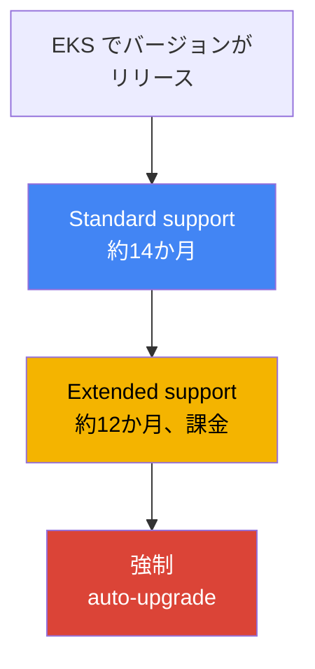
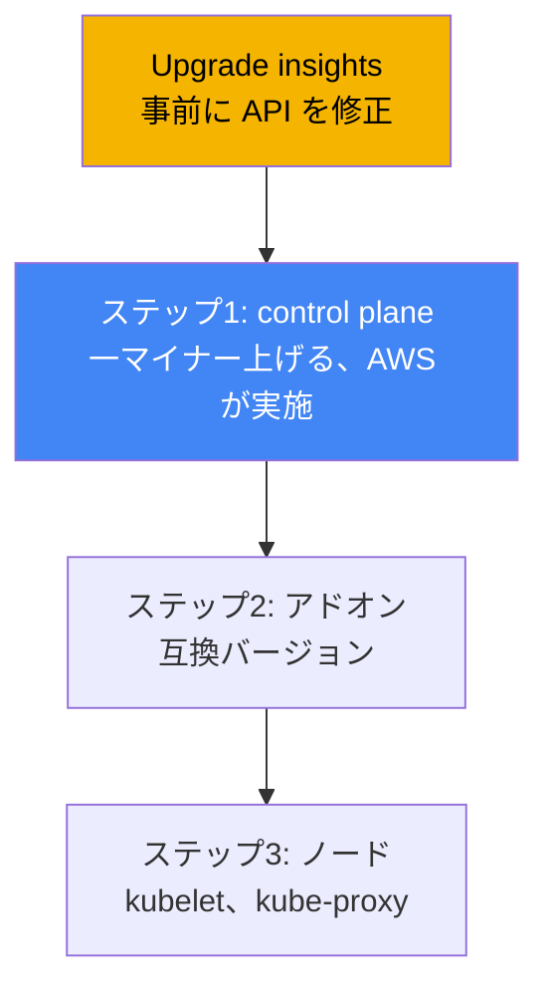
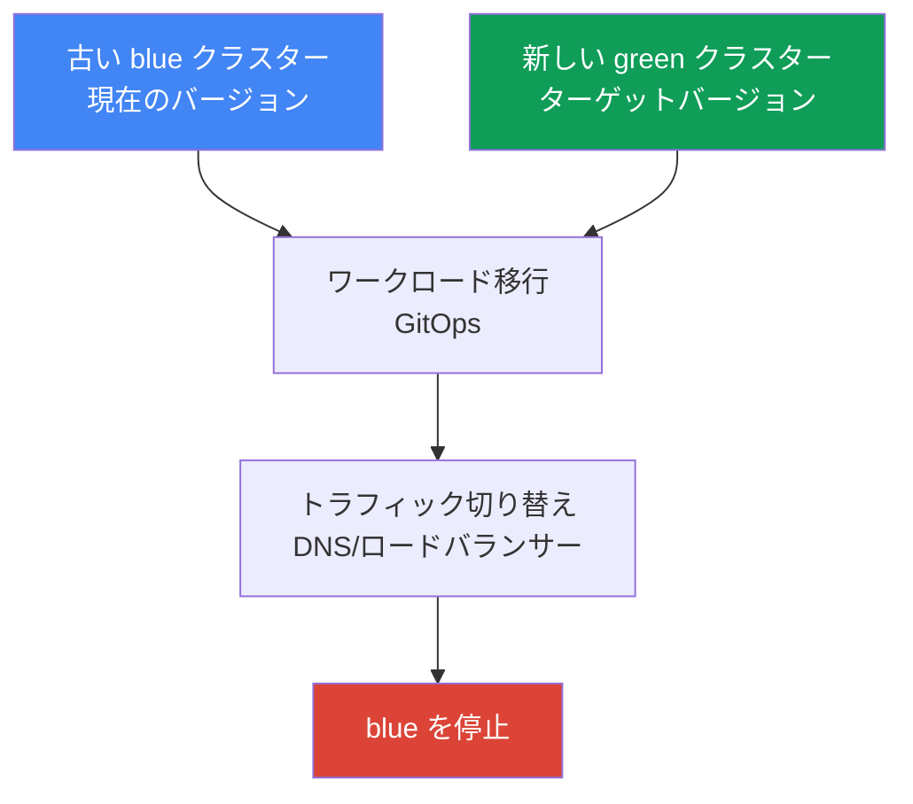

[Русская версия](ru.md) · [Eng version](en.md) · [Versión en español](es.md) · [Version française](fr.md) · [Deutsche Version](de.md) · [ქართული ვერსია](ge.md) · [繁體中文版](tw.md)
# 第38章. クラスターのアップグレード: バージョン別の in-place、blue/green クラスター、廃止された API

> **次は何か。** 第37章ではアドオンを扱いました。誰がそのライフサイクルを所有するのか、そしてクラスターのバージョンと整合させる方法です。ここでは Kubernetes バージョン別のクラスター全体のアップグレードを扱います。バージョンのライフサイクル、in-place アップグレードの順序、廃止された API、blue/green 移行です。関連する内容は他の章で扱います。アドオン自体とその更新順序は第37章、バージョンのロールバック（rollback readiness）は第39章、信頼性、PDB、適切なノード停止は第40章、blue/green 移行の GitOps は第44章、managed ノードと Karpenter drift は第11章と第12章です。

## 38.1. 「バージョンのサポート終了が近い」と「apply が適用されなくなった」

最初のシナリオは、メールとコンソールのバナーで届きます。クラスターのバージョンがまもなく standard support を終了するという通知です。これは抽象的な警告ではなく、有料カウントダウンの始まりです。standard support 終了後、クラスターは壊れませんが extended support に移行し、クラスターの稼働時間あたりの料金が高くなります。extended support も永久ではありません。それも終了すると、EKS はチームのスケジュールを待たずにクラスターのバージョンを自動的に引き上げます。症状は明快です。通知が届き、CLI の出力でバージョンの standard support 終了までの期間を確認できます。

```bash
# バージョンが standard support の対象である終了日
aws eks describe-cluster-versions \
  --query 'clusterVersions[?clusterVersion==`1.33`].[clusterVersion,endOfStandardSupport]'
```

二つ目のシナリオはアップグレード後に起こり、突然デプロイが壊れたように見えます。クラスターを新しいマイナーバージョンに上げ、すべてが正常でも、CI はデプロイ時に失敗し、`kubectl apply` は次を返します。

```bash
kubectl apply -f ingress.yaml
# error: resource mapping not found for name: "web" namespace: "prod"
# from "ingress.yaml": no matches for kind "Ingress" in version "extensions/v1beta1"
```

何かが「勝手に」壊れたわけではありません。新しいマイナーバージョンで Kubernetes が、マニフェストに書かれていた `apiVersion` を削除したのです。クラスターが古いバージョンで稼働している間は、古い `apiVersion` もまだ提供されていました。アップグレード後は API サーバーがそれを認識しないため、その `apiVersion` を持つすべてのマニフェストが適用できなくなります。すでに稼働しているオブジェクトは変換を経て存続している場合もありますが、新しいデプロイとそのリソースへのすべての `apply` は失敗します。

どちらの問題も同じことに関係しています。クラスターのアップグレードは一つのボタンではなく、スケジュール（バージョンのライフサイクル）と準備（廃止された API）を要するプロセスです。以降では順に、バージョンのライフサイクル、in-place アップグレードの実行順序、削除される API の事前検出、EKS cluster insights が示すもの、ノードの更新方法、in-place ではなく blue/green クラスターを構築する場面を扱います。

## 38.2. EKS バージョンのライフサイクル

Kubernetes は平均して4か月ごとに新しいマイナーバージョンをリリースし、EKS もこのサイクルに従います。EKS の各マイナーバージョンには三つのサポートフェーズがあり、これに基づいてアップグレードを計画します。

| フェーズ | 期間 | 意味 |
|---|---|---|
| Standard support | EKS でのバージョンリリースから約14か月 | 通常のサポート。バージョン追加料金なし |
| Extended support | standard 終了後約12か月 | バージョンは引き続き利用可能だが、クラスター時間あたりの料金が高い |
| 強制アップグレード | extended support 終了時 | EKS が最も近いサポート対象バージョンへ自動的に引き上げる |

運用上の帰結は三つあります。一つ目は、**計画的なアップグレードの期間は約14か月**であることです。standard support 中は、落ち着いてバージョン追加料金なしに更新できます。二つ目は、**extended support は無料の猶予ではない**ことです。デフォルトで有効になっており、クラスターの時間あたり料金が高くなります。そのため「単に更新しない」は、判断を先送りしたのではなく、意識的に料金を払う選択です。三つ目は、**extended support 終了時の強制アップグレード**です。間に合うように更新しなければ EKS が自動的にバージョンを引き上げます。また、extended support の終了時に自動アップグレードされたクラスターは、ロールバックできません（ロールバックは第39章）。



もう一つの厳格な制約があります。**一度にアップグレードできるのは一つのマイナーバージョンだけです**。`1.30` からいきなり `1.33` へ飛ぶことはできません。`1.30` → `1.31` → `1.32` → `1.33` と進み、各マイナーを個別にアップグレードします。これは、EKS が高可用性 control plane を維持し、version skew policy の範囲内で kube-apiserver を厳密に一マイナーずつ更新するためです。パッチバージョン（たとえば同じマイナー内での更新）は EKS が自動適用しますが、マイナーアップグレードはエンジニアの担当であり、常に段階的に行います。

## 38.3. In-place アップグレード: 順序と version skew

In-place アップグレードは、二つ目のクラスターを作成せずに、同じクラスターを新しいマイナーバージョンへ更新する方法です。一つのコマンドで終わるのではなく一連の手順で進み、順序が重要です。この順序は Kubernetes の version skew policy（第37章）で決まり、ノード上のコンポーネントが kube-apiserver からどれだけ遅れてよいかを制限します。



手順は次のとおりです。ゼロ番目は**準備**です。upgrade insights を実行して廃止された API を修正し（38.4節と38.5節）、ノードの kubelet が許容される skew を超えて control plane から遅れていないことを確認します。一番目は **control plane** です。AWS が managed control plane を一マイナー更新します。処理中に新しい API サーバーインスタンスを起動し、rolling update を実施します。そのためにはクラスターのサブネットにいくつかの空き IP が必要です。新しい control plane のヘルスチェックに失敗した場合、EKS はインフラストラクチャのステップをロールバックし、クラスターは以前のバージョンのままです。この間、実行中のワークロードには影響しません。

二番目のステップは**アドオン**です。core アドオン（`kube-proxy`、`coredns`、`vpc-cni`）は control plane に自動追従しません。`describe-addon-versions` に基づき、新しいマイナーと互換性のあるバージョンへ引き上げます（第37章）。三番目のステップは**ノード**です。ノード上の kubelet と kube-proxy を control plane のバージョンまで引き上げます。version skew policy により（Kubernetes 1.28 以降）、kubelet は kube-apiserver より最大三マイナー遅れても構いません。つまり、各マイナーの直後に必ずノードを更新する厳格な要件はありません。しかし AWS はノードを control plane と同じバージョンに維持し、遅れを蓄積しないことを推奨しています。クライアント（`kubectl`）と他のクラスターアプリケーション（たとえば cluster-autoscaler）も新しいマイナーに合わせます。

## 38.4. 廃止済みおよび削除済み API

Kubernetes は API を段階的に進化させます。最初に `apiVersion` を **deprecated**（廃止予定だがまだ動作する）と宣言し、その数マイナー後に **removed**（削除済み。API サーバーはもはや提供しない）にします。38.1節の `apply` を壊すのはまさに removed バージョンです。削除の節目を知っておくべきです。そこをまたぐアップグレードが最も危険だからです。

| バージョン | 削除されたもの（例） |
|---|---|
| 1.16 | Deployment、DaemonSet、ReplicaSet の古い `apiVersion`（`apps/v1` へ移行） |
| 1.22 | ベータグループの `Ingress` と `CustomResourceDefinition`、古い admission webhooks |
| 1.25 | `PodSecurityPolicy`、`CronJob batch/v1beta1`、`PodDisruptionBudget policy/v1beta1` |
| 1.29 | `flowcontrol.apiserver.k8s.io/v1beta2`（FlowSchema、PriorityLevelConfiguration） |
| 1.32 | `flowcontrol.apiserver.k8s.io/v1beta3` |

危険なのは、問題が静かに潜むことです。クラスターが古いバージョンにある間、廃止予定の `apiVersion` は動作し、大きな警告も出しません。しかし削除の節目をまたぐアップグレードの瞬間に壊れます。そのため廃止された API はアップグレード**前に**検出して修正します。マニフェストを現在の `apiVersion` に書き換え、古いクラスターのバージョンで事前にデプロイします（通常、新しい `apiVersion` はすでにそこでサポートされています）。検出ツールは次のとおりです。

| ツール | 確認場所 | 特徴 |
|---|---|---|
| EKS upgrade insights | AWS によるクラスター全体 | 組み込みで、削除予定 API の使用をフラグ付けする |
| pluto | Git 内のマニフェストと Helm リリース | 適用前に静的スキャンする |
| kube-no-trouble (`kubent`) | 稼働中クラスターのオブジェクト | 実際の状態に対して高速に実行できる |
| `kubectl` deprecations / warnings | API サーバー | `apply` 時の警告、`kubectl deprecations` プラグイン |

実践では、`kubent` と upgrade insights がクラスター内にすでにあるものを示し、`pluto` はリポジトリーと Helm チャートにある廃止済み `apiVersion` をデプロイ前に検出します。両方の観点が有用です。クラスターはクリーンでも、Git に古いマニフェストが残っていて、アップグレード後の次回デプロイを壊すことがあります。

## 38.5. EKS cluster insights と upgrade insights

**Cluster insights** は、AWS が管理する問題リストに対してクラスターを検査する EKS 組み込み機能です。三つの種類があります。**upgrade insights**（アップグレード準備状況）、**rollback readiness insights**（ロールバック準備状況、第39章）、**configuration insights**（hybrid nodes 向け）です。検査は自動で実行され、24時間ごとに更新されます。問題を修正後、1日を待たずにリストを手動で更新できます。

アップグレードで重要なのは upgrade insights です。EKS は新しいマイナーへの移行を阻害しうる事項をクラスター内で自動スキャンします。主に、削除予定の Kubernetes API の使用です。そしてドキュメントへのリンクを含む推奨事項を提供します。AWS は Kubernetes の変更に合わせて検査リストを定期的に追加するため、insights は一度だけでなく**すべてのアップグレード前**に確認すべきです。EKS は insights 用に自動作成される access entry を介してデータにアクセスするため、個別の権限設定は不要です。

```bash
# クラスターの insights 一覧（upgrade を含む）
aws eks list-insights --cluster-name my-cluster
# 特定の insight の詳細: ステータス、推奨事項、影響を受けるリソース
aws eks describe-insight --cluster-name my-cluster --id <insight-id>
```

作業順序は簡単です。アップグレード前に upgrade insights のタブを開く（または `list-insights` を確認する）、問題としてマークされたものをすべて調査する、マニフェストを修正する、insights を更新してリストがクリーンであることを確認する、という流れです。その後にのみ control plane の更新を開始します。

## 38.6. ノードの更新

Control plane は AWS が更新しますが、ノードはエンジニアの責任範囲であり、更新方法はノードの管理方式によって異なります。選択肢は三つです。

| 方法 | 更新方法 | PDB の尊重 |
|---|---|---|
| Managed node group | AWS が rolling update を実行: cordon、drain、新しい launch template で置換 | はい、drain は PDB を尊重する |
| Karpenter (drift) | 新しい AMI/バージョンのノードを drift として再作成（第12章） | はい、graceful disruption により実行する |
| Self-managed | launch template を更新し、手動または自動化でノードをロールアウト | 自分たちの責任 |

**managed node group** の更新はフェーズごとに進みます。EKS は対象 AMI を含む新しい launch template バージョンを作成し、新しいノードを起動し、古いノードを unschedulable（cordon）としてマークし、そこから Pod を退避（drain）します。Drain は PodDisruptionBudget を尊重します。Pod を一度に追い出すのではなく、PDB を考慮して退避します。ここでよくある障害が、過度に厳しい PDB です。15分以内に Pod を退避できなければ、アップグレードフェーズは `PodEvictionFailure` で失敗します。その場合は PDB を緩めるか、PDB を無視して強制的に Pod を退避する force フラグ付きで更新を開始します。並列に更新するノード数は、グループの `updateConfig` にある `maxUnavailable` で決まります。

**Karpenter** は drift メカニズム（第12章）でノードを更新します。希望する AMI またはバージョンが変わると、Karpenter は既存ノードを古いものと見なし、適切な退避を伴って再作成します。**Self-managed** ノードはすべて自分たちで更新します。launch template を変更して置換をロールアウトします。ノードのロールアウトにおける PDB、topology spread、適切なノード停止は第40章を参照してください。

## 38.7. Blue/green クラスター

In-place だけが選択肢ではありません。代替策は **blue/green** です。ターゲットバージョンの新しいクラスター（green）を並行して構築し、そこへワークロードを移行し、トラフィックを切り替えて、古いクラスター（blue）を停止します。ターゲットバージョンを実トラフィックで段階的に検証でき、ロールバックはまだ生きている古いクラスターへトラフィックを戻すだけです。



ワークロードは GitOps（第44章）を通して宣言的に移行します。同じマニフェスト群を新しいクラスターに適用し、DNS（Route 53）またはロードバランサーのレベルでトラフィックを切り替えます。アプローチの選択は、リスク、コスト、複雑性のバランスです。

| 基準 | In-place | Blue/green |
|---|---|---|
| 複雑性 | より簡単: 一つのクラスター、順番どおりの手順 | より複雑: 二つのクラスター、移行、トラフィック |
| コスト | インフラストラクチャの重複なし | 一時的に二つのクラスターとなり、高コスト |
| バージョンの飛躍 | 一度に一マイナーのみ | 新しいクラスターの必要なバージョンへ直接移行 |
| リスクとロールバック | 7日間のウィンドウでロールバック（第39章） | ロールバック = blue へトラフィックを戻す、高速 |
| 選ぶ場面 | 通常の定期的なアップグレード | バージョン差が大きい、高リスク、非互換性 |

実用的な原則はこうです。**定期的なアップグレードは in-place で実施します**。より簡単で、安価であり、インフラストラクチャを重複させません。**in-place が危険または不可能なときは blue/green を選びます**。バージョンの遅れが大きく、一つずつすべてのマイナーを通過するのが長く危険である場合、可能な限り迅速なロールバックが必要な場合、または新しいクラスターで in-place では乗り越えられない変更がある場合（削除済み API の組み合わせ、ネットワーク変更、異なるアドオン群）です。blue/green の代価は、クラスターの一時的な重複と、移行およびトラフィック切り替え作業です。

## 38.8. 本番環境での適用方法

- **アップグレードは通知メールが届いてからではなく、サポートカレンダーに基づいて計画します。** バージョンを standard support（約14か月）の範囲に保ち、追加料金のある extended support や、ましてや強制アップグレードに至る前に更新します。
- **廃止された API はアップグレード後ではなく前に修正します。** upgrade insights、クラスターに対する `kubent`、Git と Helm に対する `pluto` を実行し、マニフェストを現在の `apiVersion` に書き換え、古いバージョンのまま事前にデプロイします。
- **順序を厳守します。** まず control plane、次に互換バージョンへの core アドオン（第37章）、その後にノードです。アドオンのステップを飛ばすと version skew が生じ、ネットワークと DNS が壊れます。
- **一度に一つのマイナーだけ更新します**。バージョンを飛ばそうとしません。多数のマイナーに遅れているクラスターでは、長い in-place の連鎖ではなく blue/green を検討します。
- **PDB をノードロールアウトに備えます。** 予算が厳しすぎないことを確認します。そうでなければ managed node group の drain が `PodEvictionFailure` に突き当たります。PDB と graceful shutdown は第40章を参照してください。
- **最初に非本番クラスターでアップグレードを実行します。** テストまたは staging クラスターを本番より先に更新し、そこで新しいバージョンの意外な問題を捕捉します。

## 38.9. ミニ用語集

- **standard support**: EKS におけるマイナーバージョンのサポートフェーズ（約14か月）。バージョン追加料金なしの通常運用。
- **extended support**: standard 終了後のフェーズ（約12か月）。バージョンは引き続きサポートされるが、クラスター時間あたりの料金が高くなる。デフォルトで有効。
- **強制アップグレード**: extended support 終了時の自動バージョン引き上げ。このようなクラスターはロールバックできない。
- **in-place upgrade**: 同じクラスターを次のマイナーへ更新すること。control plane、次にアドオン、そしてノードの順。
- **version skew policy**: ノード上のコンポーネントが kube-apiserver からどれだけ遅れてよいかを制限する Kubernetes の規則（第37章）。
- **deprecated / removed API**: `apiVersion` が廃止予定と宣言され、その後削除されること。削除後は、それを含むマニフェストを適用できない。
- **cluster insights**: EKS の組み込み検査。upgrade、rollback readiness、config。
- **upgrade insights**: アップグレード準備状況と削除予定 API をフラグ付けする insights の種類。
- **pluto / kube-no-trouble (kubent)**: 廃止された API を検出するツール。pluto は Git と Helm、kubent は稼働中クラスターを対象とする。
- **blue/green クラスター**: 古いクラスターに並行してターゲットバージョンで構築する新しいクラスター。ワークロードを移行してトラフィックを切り替える。

## 38.10. この章のまとめ

- EKS バージョンには三つのフェーズがあります。standard support（約14か月）、extended support（約12か月、より高価）、その後の強制アップグレードです。アップグレードは standard support の期間に計画すべきです。
- 更新できるのは一度に一つのマイナーだけです。バージョンを飛ばすことはできません。パッチは EKS が自動適用し、マイナーアップグレードはエンジニアが実施します。
- In-place アップグレードは、準備、control plane（AWS が実施）、互換バージョンへの core アドオン（第37章）、ノードの順で進みます。この順序は version skew policy で決まります。
- Kubernetes はマイナーの間で API を削除します（節目は 1.16、1.22、1.25、1.29、1.32）。アップグレード後、古い `apiVersion` を持つマニフェストは適用できなくなります。
- 廃止された API は事前に検出します。クラスターでは upgrade insights と `kubent`、Git と Helm では `pluto` を使い、アップグレード前にマニフェストを修正します。
- EKS cluster insights はクラスターのアップグレード準備状況を自動検査し、削除予定 API をフラグ付けします。すべての更新前に確認します。
- ノードの更新方法は異なります。managed node group（drain を伴う rolling update、PDB を尊重、`PodEvictionFailure` 時は force フラグ）、Karpenter（drift、第12章）、self-managed（自分たちで実施）です。
- Blue/green はターゲットバージョンの新しいクラスターを構築してトラフィックを切り替えます。バージョン差が大きい場合、高リスクの場合、または非互換性がある場合に、クラスターの一時的な重複を代価として選びます。

## 38.11. 実務での役立ち方

当番中、アップグレードは「更新をクリックする」ことではなく、チェックリストを実行することです。更新前に upgrade insights を確認し、`kubent` と `pluto` を実行します。これにより、削除済み API をアップグレード前に検出でき、翌日に本番で `kubectl apply` が失敗する形では現れません。control plane、アドオン、ノードが別々に厳格な順序で更新されることを理解していれば、「アップグレードは成功したのになぜネットワークが落ちたのか」という調査時間を節約できます。通常はアドオンのステップを忘れていることが原因です（第37章）。

運用計画では三つを決めます。一つ目はカレンダーです。extended support の料金を払うことや、ロールバックの時間枠なしに強制アップグレードを受けることを避けるため、バージョンを standard support の範囲に保ち、早めに更新します。二つ目は戦略です。定期アップグレードは一マイナーずつ in-place で実施し、大きく遅れたクラスターやリスクの高い移行では、GitOps（第44章）による移行を含む blue/green を事前に計画します。三つ目はノードの準備状況です。PDB が drain をブロックしないことを確認し、managed node group、Karpenter drift、手動のどれでノードを更新するかを合意します。そうすればアップグレードは緊急作業ではなく、定常的な手順になります。

## 38.12. 理解度チェックの質問

1. EKS マイナーバージョンのライフサイクルはどの三つのフェーズで構成され、それぞれはおよそどれくらい続きますか。
2. extended support の終了までにクラスターを更新しない場合、何が起きますか。そのクラスターをロールバックできますか。
3. なぜ `1.30` から直接 `1.33` へ更新できないのですか。正しい更新方法は何ですか。
4. In-place アップグレードはどの順序で進み、なぜその順序なのですか（どの規則が決めますか）。
5. API の deprecated と removed は何を意味し、`kubectl apply` はどの時点で壊れますか。
6. Kubernetes バージョンごとの API 削除の節目をいくつか挙げてください。
7. `kubent` による廃止 API の検出と `pluto` による検出はどう異なり、なぜ両方が必要ですか。
8. EKS upgrade insights とは何で、いつ確認すべきですか。
9. managed node group はノードをどのように更新し、PDB が厳しすぎると何が起きますか。
10. Karpenter はノードをどのように更新し、managed node group とは何が異なりますか。
11. blue/green クラスターアップグレードとは何で、そのロールバックはどのようなものですか。
12. どのような場合に in-place ではなく blue/green を選び、その対価は何ですか。

## 実践

このテーマに対応するコースラボ: [ラボ113: クラスターのアップグレードとロールバック: control plane、アドオン、廃止された API](../../labs/113/README_JP.MD)。これに加えて、アップグレード準備状況と現在のバージョン状態は、稼働中のクラスターで簡単に確認できます。まずクラスターのバージョンと standard support の残り期間を確認します。

```bash
# 現在のクラスターのバージョン
aws eks describe-cluster --name my-cluster --query 'cluster.version'
# バージョンのサポートフェーズ: standard support の終了日
aws eks describe-cluster-versions \
  --query 'clusterVersions[].[clusterVersion,endOfStandardSupport]' --output table
```

次に、組み込みのアップグレード準備状況検査を実行し、問題としてマークされたものを調査します。

```bash
# クラスターの insights 一覧（upgrade を含む）
aws eks list-insights --cluster-name my-cluster
# 特定の insight の詳細: ステータスと推奨事項
aws eks describe-insight --cluster-name my-cluster --id <insight-id>
```

誰かが廃止された API を直接参照していないことを確認し、アップグレードを考える前に core アドオンのバージョンをクラスターのマイナーと照合します。

```bash
# クラスターで利用可能な API バージョン（まもなく削除されるベータグループを探す）
kubectl get --raw /apis | grep -o '"groupVersion":"[^"]*"'
# アドオンを互換バージョンへ更新（例。バージョンは describe-addon-versions から取得する）
aws eks update-addon --cluster-name my-cluster --addon-name kube-proxy \
  --addon-version <互換バージョン>
```

クラスターのバージョンと standard support 終了日、upgrade insights のリスト、Git 内のマニフェストに書かれた実際の `apiVersion` の三つを対応付けます。insights がクリーンで、廃止された API がなく、アドオンがターゲットマイナーと互換性を持つなら、クラスターは38.3節の順序に従った in-place アップグレードの準備ができています。問題が起きた場合のロールバックは第39章で扱います。

---
[目次](../README_JP.md) · [第37章](../37/jp.md) · [第39章](../39/jp.md)
