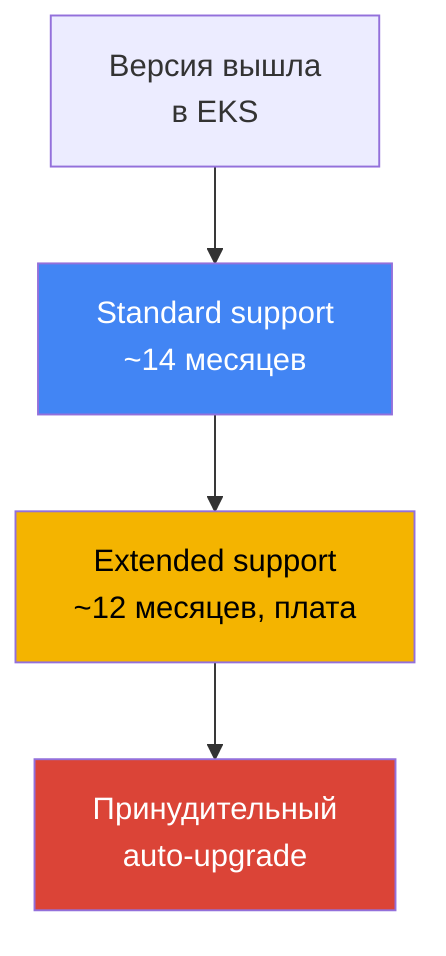
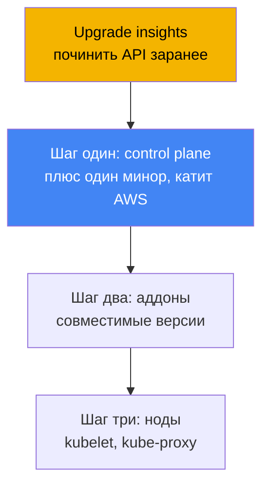
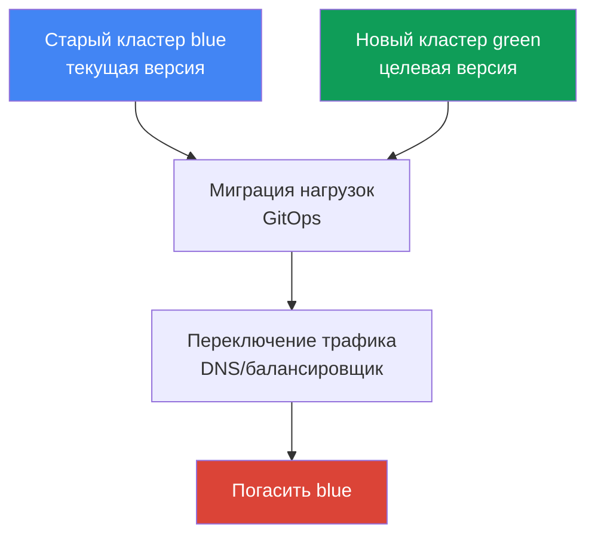

# Глава 38. Обновление кластера: in-place по версиям, blue/green кластеры, устаревшие API

> **Что дальше.** Глава 37 разобрала аддоны: кто владеет их жизненным циклом и как держать
> версии в согласии с версией кластера. Здесь - обновление всего кластера по версиям
> Kubernetes: жизненный цикл версии, порядок in-place апгрейда, устаревшие API и blue/green
> миграция. Смежное отдано другим главам: сами аддоны и порядок их обновления - глава 37,
> откат версии (rollback readiness) - глава 39, надёжность, PDB и корректное выключение нод -
> глава 40, GitOps для blue/green миграции - глава 44, управляемые ноды и Karpenter drift -
> главы 11 и 12.

## 38.1. «Версия скоро уйдёт из поддержки» и «apply перестал применяться»

Первый сценарий приходит письмом и баннером в консоли: версия вашего кластера скоро выйдет из
standard support. Это не абстрактное предупреждение, а начало платного отсчёта. После конца
standard support кластер не ломается, но переходит в extended support - за него берут
повышенную плату за час работы кластера. Extended support тоже не вечен: когда истечёт и он,
EKS сам поднимет версию кластера, не спрашивая расписания вашей команды. Симптом простой -
уведомление, а в выводе CLI видно, сколько версии осталось до конца standard support:

```bash
# до какой даты версия под standard support
aws eks describe-cluster-versions \
  --query 'clusterVersions[?clusterVersion==`1.33`].[clusterVersion,endOfStandardSupport]'
```

Второй сценарий приходит уже после апгрейда и выглядит как внезапная поломка деплоя. Кластер
подняли на новый минор, всё зелёное, но CI падает на выкатке, а `kubectl apply` отвечает:

```bash
kubectl apply -f ingress.yaml
# error: resource mapping not found for name: "web" namespace: "prod"
# from "ingress.yaml": no matches for kind "Ingress" in version "extensions/v1beta1"
```

Ничего не сломалось «само»: в новом миноре Kubernetes удалил `apiVersion`, которым был написан
манифест. Пока кластер жил на старой версии, старый `apiVersion` ещё обслуживался; после
апгрейда API-сервер его больше не знает, и любой манифест с этим `apiVersion` перестаёт
применяться. Уже запущенные объекты могли пережить конвертацию, но новые выкатки и любые
`apply` этого ресурса теперь падают.

Обе боли - про одно: обновление кластера это не одна кнопка, а процесс с расписанием
(жизненный цикл версий) и с подготовкой (устаревшие API). Дальше по порядку: как устроен
жизненный цикл версии, в каком порядке катится in-place апгрейд, как заранее находить
удалённые API, что показывает EKS cluster insights, как обновляют ноды и когда вместо
in-place поднимают blue/green кластер.

## 38.2. Жизненный цикл версии EKS

Kubernetes выпускает новый минор в среднем раз в четыре месяца, и EKS следует этому циклу. У
каждой минорной версии в EKS три фазы поддержки, и по ним стоит планировать обновления.

| Фаза | Длительность | Что это значит |
|---|---|---|
| Standard support | ~14 месяцев с релиза версии в EKS | обычная поддержка, без доплаты за версию |
| Extended support | ~12 месяцев после конца standard | версия ещё живёт, но повышенная плата за час кластера |
| Принудительный upgrade | по истечении extended support | EKS сам поднимает версию до ближайшей поддерживаемой |

Три следствия для эксплуатации. Первое - **окно на плановый апгрейд около 14 месяцев**: пока
идёт standard support, обновляться можно спокойно и без доплаты за версию. Второе - **extended
support это не бесплатная отсрочка**: он включён по умолчанию и стоит дороже за час работы
кластера, поэтому «просто не обновляться» - это осознанная плата, а не отсутствие решения.
Третье - **принудительный upgrade в конце extended support**: если не обновиться вовремя, EKS
поднимет версию сам, и кластеры, апгрейднутые автоматически в конце extended support,
откатить назад уже нельзя (про откат - глава 39).



Ещё одно жёсткое ограничение: **обновляться можно только на одну минорную версию за раз**.
Перепрыгнуть с `1.30` сразу на `1.33` нельзя - надо пройти `1.30` → `1.31` → `1.32` → `1.33`,
каждый минор отдельным апгрейдом. Причина в том, что EKS держит высокодоступный control plane
и обновляет kube-apiserver строго по одному минору, в границах version skew policy. Патч-версии
(например обновления в пределах одного минора) EKS накатывает сам, а вот минорные апгрейды - на
инженере, и всегда пошагово.

## 38.3. In-place обновление: порядок и version skew

In-place апгрейд - это обновление того же кластера на новый минор, без создания второго. Оно
идёт не одной командой, а последовательностью, и порядок важен: его диктует version skew
policy Kubernetes (глава 37), которая ограничивает, насколько компоненты на нодах могут
отставать от kube-apiserver.



Шаги такие. Ноль - **подготовка**: прогнать upgrade insights и починить устаревшие API
(разделы 38.4 и 38.5), убедиться, что kubelet на нодах не отстаёт от control plane больше чем
на допустимый скью. Первый - **control plane**: AWS сам обновляет managed control plane на один
минор; в процессе он поднимает новые экземпляры API-сервера и делает rolling update, для чего
ему нужно несколько свободных IP в подсетях кластера. Если health-проверки нового control
plane не проходят, EKS откатывает инфраструктурный шаг, и кластер остаётся на прежней версии -
запущенные нагрузки при этом не страдают.

Второй шаг - **аддоны**: core-аддоны (`kube-proxy`, `coredns`, `vpc-cni`) не едут за control
plane сами, их поднимают до версий, совместимых с новым минором, по `describe-addon-versions`
(глава 37). Третий шаг - **ноды**: kubelet и kube-proxy на нодах доводят до версии control
plane. По version skew policy (начиная с Kubernetes 1.28) kubelet может отставать от
kube-apiserver до трёх миноров, то есть жёсткого требования обновлять ноды сразу после каждого
минора нет - но AWS рекомендует держать ноды на одной версии с control plane и не копить
отставание. Клиентов (`kubectl`) и прочие приложения кластера (например cluster-autoscaler)
тоже приводят к новому минору.

## 38.4. Устаревшие и удалённые API

Kubernetes развивает API поэтапно: сначала объявляет `apiVersion` **deprecated** (устаревшим,
но ещё работающим), а через несколько миноров **removed** (удалённым - API-сервер его больше не
обслуживает). Именно removed-версии ломают `apply` из раздела 38.1. Вехи удаления стоит знать,
потому что апгрейд через них - самый рискованный:

| Версия | Что удалено (примеры) |
|---|---|
| 1.16 | старые `apiVersion` для Deployment, DaemonSet, ReplicaSet (переезд на `apps/v1`) |
| 1.22 | `Ingress` и `CustomResourceDefinition` из бета-групп, старые admission webhooks |
| 1.25 | `PodSecurityPolicy`, `CronJob batch/v1beta1`, `PodDisruptionBudget policy/v1beta1` |
| 1.29 | `flowcontrol.apiserver.k8s.io/v1beta2` (FlowSchema, PriorityLevelConfiguration) |
| 1.32 | `flowcontrol.apiserver.k8s.io/v1beta3` |

Опасность в том, что проблема тихая: пока кластер на старой версии, устаревший `apiVersion`
работает и не жалуется громко, а ломается ровно в момент апгрейда через веху удаления.
Поэтому устаревшие API ищут и чинят **до** апгрейда - переписывают манифесты на актуальный
`apiVersion` и выкатывают заранее, ещё на старой версии кластера (новый `apiVersion` обычно
уже поддерживается там). Инструменты обнаружения:

| Инструмент | Где смотрит | Особенность |
|---|---|---|
| EKS upgrade insights | кластер целиком, силами AWS | встроено, флагует использование удаляемых API |
| pluto | манифесты в Git и Helm-релизы | статический скан ещё до применения |
| kube-no-trouble (`kubent`) | объекты в живом кластере | быстрый прогон против реального состояния |
| `kubectl` deprecations / warnings | API-сервер | предупреждения при `apply`, плагин `kubectl deprecations` |

Практика такая: `kubent` и upgrade insights показывают, что уже лежит в кластере, а `pluto`
ловит устаревшие `apiVersion` в репозитории и Helm-чартах ещё до выката. Полезны оба взгляда:
кластер может быть чист, а в Git остаться старый манифест, который сломает следующую выкатку
после апгрейда.

## 38.5. EKS cluster insights и upgrade insights

**Cluster insights** - встроенная в EKS проверка кластера против курируемого AWS списка
проблем. Она бывает трёх типов: **upgrade insights** (готовность к апгрейду), **rollback
readiness insights** (готовность к откату, глава 39) и **configuration insights** (для hybrid
nodes). Проверки идут автоматически и обновляются раз в 24 часа; после починки проблемы список
можно обновить вручную, не дожидаясь суток.

Для апгрейда важен тип upgrade insights: EKS сам сканирует кластер на то, что может помешать
перейти на новый минор - в первую очередь на использование удаляемых Kubernetes API, - и даёт
рекомендации с ссылками на документацию. AWS регулярно пополняет список проверок по мере
изменений в Kubernetes, так что смотреть insights стоит **перед каждым апгрейдом**, а не один
раз. Доступ к данным EKS получает через автоматически создаваемую access entry для insights -
отдельных прав настраивать не нужно.

```bash
# список insights кластера (в том числе upgrade)
aws eks list-insights --cluster-name my-cluster
# детали конкретного insight: статус, рекомендация, затронутые ресурсы
aws eks describe-insight --cluster-name my-cluster --id <insight-id>
```

Порядок работы простой: перед апгрейдом открыть вкладку upgrade insights (или пройтись по
`list-insights`), разобрать всё, что помечено как проблема, починить манифесты, обновить
insights и убедиться, что список чист. Только после этого запускать обновление control plane.

## 38.6. Обновление нод

Control plane обновляет AWS, а ноды - зона ответственности инженера, и способ зависит от того,
чем ноды управляются. Три варианта:

| Способ | Как обновляется | Уважение PDB |
|---|---|---|
| Managed node group | AWS катит rolling update: cordon, drain, замена по новому launch template | да, drain уважает PDB |
| Karpenter (drift) | пересоздаёт ноды на новый AMI/версию как дрейф (глава 12) | да, через graceful disruption |
| Self-managed | обновление launch template и перекатка нодами вручную или своей автоматикой | на вас |

У **managed node group** обновление идёт фазами: EKS создаёт новую версию launch template с
целевым AMI, поднимает новые ноды, помечает старые как unschedulable (cordon) и сливает с них
поды (drain). Drain уважает PodDisruptionBudget: поды вытесняются с учётом PDB, а не разом.
Ровно тут возникает частый затык - слишком жёсткий PDB. Если поды не удаётся вытеснить за 15
минут, фаза апгрейда падает с ошибкой `PodEvictionFailure`; тогда либо ослабляют PDB, либо
запускают обновление с флагом force, который вытесняет поды принудительно, игнорируя PDB.
Число нод, обновляемых параллельно, задаёт `maxUnavailable` в `updateConfig` группы.

**Karpenter** обновляет ноды через механизм drift (глава 12): когда желаемый AMI или версия
меняются, Karpenter считает существующие ноды устаревшими и пересоздаёт их, тоже с корректным
вытеснением. **Self-managed** ноды обновляют полностью сами - меняют launch template и катят
замену. Про PDB, topology spread и корректное выключение нод при перекатке - глава 40.

## 38.7. Blue/green кластеры

In-place - не единственный путь. Альтернатива - **blue/green**: поднять рядом новый кластер
(green) сразу на целевой версии, мигрировать в него нагрузки, переключить трафик и погасить
старый (blue). Смысл в том, что целевую версию проверяют на живом трафике постепенно, а откат
сводится к переключению трафика обратно на ещё живой старый кластер.



Нагрузки переносят декларативно через GitOps (глава 44): тот же набор манифестов применяют к
новому кластеру, а трафик переключают на уровне DNS (Route 53) или балансировщика. Выбор между
подходами - это баланс риска, стоимости и сложности:

| Критерий | In-place | Blue/green |
|---|---|---|
| Сложность | проще: один кластер, шаги по порядку | сложнее: два кластера, миграция, трафик |
| Стоимость | без дубля инфраструктуры | временно два кластера, дороже |
| Скачок версий | только по одному минору за раз | сразу на нужную версию нового кластера |
| Риск и откат | откат в окно 7 дней (глава 39) | откат = вернуть трафик на blue, быстро |
| Когда выбирают | штатные регулярные апгрейды | большой отрыв версий, высокий риск, несовместимости |

Правило практичное: **регулярные апгрейды делают in-place** - это проще, дешевле и без дубля
инфраструктуры. **Blue/green берут, когда in-place рискован или невозможен**: версия отстала
настолько, что проходить все миноры по одному долго и опасно; нужна максимально быстрая
возможность отката; или в новом кластере меняется что-то, что in-place не переживёт (набор
удалённых API, смена сети, другой набор аддонов). Плата за blue/green - временный дубль
кластеров и работа по миграции и переключению трафика.

## 38.8. Как это применяют в продакшене

- **Апгрейд планируют по календарю поддержки, а не по факту письма.** Держат версию в пределах
  standard support (~14 месяцев) и обновляются заранее, не доводя до extended support с
  повышенной платой и тем более до принудительного upgrade.
- **Устаревшие API чинят до апгрейда, а не после.** Прогоняют upgrade insights, `kubent` по
  кластеру и `pluto` по Git и Helm, переписывают манифесты на актуальный `apiVersion` и
  выкатывают заранее, ещё на старой версии.
- **Порядок соблюдают строго:** сначала control plane, затем core-аддоны до совместимых версий
  (глава 37), затем ноды. Пропуск шага с аддонами даёт version skew и ломает сеть и DNS.
- **Обновляются по одному минору за раз** и не пытаются перепрыгнуть; для отставших на много
  миноров кластеров взвешивают blue/green вместо длинной цепочки in-place.
- **PDB готовят к перекатке нод.** Проверяют, что бюджеты не слишком жёсткие, иначе drain
  managed node group упрётся в `PodEvictionFailure`; про PDB и graceful shutdown - глава 40.
- **Апгрейд сначала прогоняют на нестабильном кластере.** Тестовый или staging кластер
  обновляют раньше продакшена и на нём ловят сюрпризы новой версии.

## 38.9. Мини-глоссарий

- **standard support** - фаза поддержки минорной версии в EKS (~14 месяцев), обычная работа
  без доплаты за версию.
- **extended support** - фаза после standard (~12 месяцев): версия ещё поддерживается, но за
  повышенную плату за час кластера; включена по умолчанию.
- **принудительный upgrade** - автоматический подъём версии по истечении extended support;
  такой кластер откатить нельзя.
- **in-place upgrade** - обновление того же кластера на следующий минор: control plane, потом
  аддоны, потом ноды.
- **version skew policy** - правило Kubernetes, ограничивающее отставание компонентов на нодах
  от kube-apiserver (глава 37).
- **deprecated / removed API** - `apiVersion` объявлен устаревшим, затем удалён; после удаления
  манифесты с ним не применяются.
- **cluster insights** - встроенные проверки EKS: upgrade, rollback readiness, config.
- **upgrade insights** - тип insights, флагующий готовность к апгрейду и удаляемые API.
- **pluto / kube-no-trouble (kubent)** - инструменты поиска устаревших API: pluto в Git и Helm,
  kubent в живом кластере.
- **blue/green кластер** - новый кластер на целевой версии рядом со старым, с миграцией
  нагрузок и переключением трафика.

## 38.10. Итоги главы

- У версии EKS три фазы: standard support (~14 месяцев), extended support (~12 месяцев, дороже)
  и затем принудительный upgrade; планировать апгрейд надо в окне standard support.
- Обновляться можно только на один минор за раз; перепрыгивать версии нельзя, патчи EKS катит
  сам, минорные апгрейды - на инженере.
- In-place апгрейд идёт по порядку: подготовка, control plane (катит AWS), core-аддоны до
  совместимых версий (глава 37), затем ноды; порядок диктует version skew policy.
- Между минорами Kubernetes удаляет API (вехи 1.16, 1.22, 1.25, 1.29, 1.32); после апгрейда
  манифесты со старым `apiVersion` перестают применяться.
- Устаревшие API ищут заранее: upgrade insights и `kubent` в кластере, `pluto` в Git и Helm;
  чинят манифесты до апгрейда.
- EKS cluster insights автоматически проверяют готовность кластера к апгрейду и флагуют
  удаляемые API; смотреть перед каждым обновлением.
- Ноды обновляют по-разному: managed node group (rolling update с drain, уважает PDB, флаг
  force при `PodEvictionFailure`), Karpenter (drift, глава 12), self-managed (сами).
- Blue/green поднимает новый кластер на целевой версии и переключает трафик; берут при большом
  отрыве версий, высоком риске или несовместимостях, ценой временного дубля кластеров.

## 38.11. Как это пригодится в реальной работе

На дежурстве апгрейд - это не «нажать обновить», а прогон чеклиста. Перед обновлением смотрят
upgrade insights и гоняют `kubent` с `pluto`, чтобы удалённые API всплыли до апгрейда, а не в
виде упавшего `kubectl apply` в проде на следующий день. Понимание, что control plane, аддоны
и ноды обновляются раздельно и в строгом порядке, экономит часы разбирательств «почему после
успешного апгрейда отвалилась сеть» - обычно это забытый шаг с аддонами (глава 37).

При планировании эксплуатации решают три вещи. Первое - календарь: держать версию в пределах
standard support и обновляться заранее, чтобы не платить за extended support и не попасть под
принудительный upgrade без окна отката. Второе - стратегию: регулярные апгрейды делать
in-place по одному минору, а для сильно отставших кластеров или рискованных переходов заранее
закладывать blue/green с миграцией через GitOps (глава 44). Третье - готовность нод: проверить,
что PDB не заблокируют drain, и договориться, обновляются ноды через managed node group,
Karpenter drift или вручную. Тогда апгрейд перестаёт быть авралом и становится рутинной
процедурой.

## 38.12. Вопросы для самопроверки

1. Из каких трёх фаз состоит жизненный цикл минорной версии EKS и сколько примерно длится
   каждая?
2. Что происходит, если не обновить кластер до конца extended support, и можно ли откатить
   такой кластер?
3. Почему нельзя обновиться с `1.30` сразу на `1.33` и как это делают правильно?
4. В каком порядке идёт in-place апгрейд и почему именно так (какое правило его диктует)?
5. Что означают состояния API deprecated и removed и в какой момент ломается `kubectl apply`?
6. Назовите несколько вех удаления API по версиям Kubernetes.
7. Чем отличается поиск устаревших API через `kubent` от поиска через `pluto` и зачем нужны
   оба?
8. Что такое EKS upgrade insights и когда их стоит смотреть?
9. Как managed node group обновляет ноды и что происходит, если PDB слишком жёсткий?
10. Как обновляет ноды Karpenter и чем это отличается от managed node group?
11. Что такое blue/green апгрейд кластера и как в нём выглядит откат?
12. В каких случаях выбирают blue/green вместо in-place и чем за это платят?

## Практика

Своей лабы у главы пока нет, но готовность к апгрейду и текущее состояние версий легко снять на
живом кластере. Сначала посмотрите версию кластера и сколько ей осталось в standard support:

```bash
# текущая версия кластера
aws eks describe-cluster --name my-cluster --query 'cluster.version'
# фазы поддержки версий: до какой даты standard support
aws eks describe-cluster-versions \
  --query 'clusterVersions[].[clusterVersion,endOfStandardSupport]' --output table
```

Затем прогоните встроенные проверки готовности к апгрейду и разберите, что помечено проблемой:

```bash
# список insights кластера (в том числе upgrade)
aws eks list-insights --cluster-name my-cluster
# детали конкретного insight: статус и рекомендация
aws eks describe-insight --cluster-name my-cluster --id <insight-id>
```

Проверьте, не обращается ли кто-то к устаревшим API напрямую, и сверьте версии core-аддонов с
минором кластера перед тем, как думать об апгрейде:

```bash
# доступные версии API в кластере (ищите бета-группы, которые скоро удалят)
kubectl get --raw /apis | grep -o '"groupVersion":"[^"]*"'
# обновить аддон до совместимой версии (пример; версию берут из describe-addon-versions)
aws eks update-addon --cluster-name my-cluster --addon-name kube-proxy \
  --addon-version <совместимая-версия>
```

Сопоставьте три вещи: версию кластера и дату конца standard support, список upgrade insights и
реальные `apiVersion`, которыми написаны ваши манифесты в Git. Если insights чисты, устаревших
API нет, а аддоны совместимы с целевым минором - кластер готов к in-place апгрейду по порядку
из раздела 38.3. Откат, если что-то пойдёт не так, разбирается в главе 39.

---
[Оглавление](../README_RU.md) · [Глава 37](../37/ru.md) · [Глава 39](../39/ru.md)
