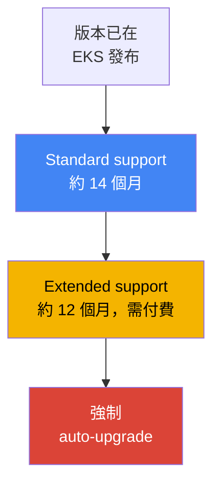
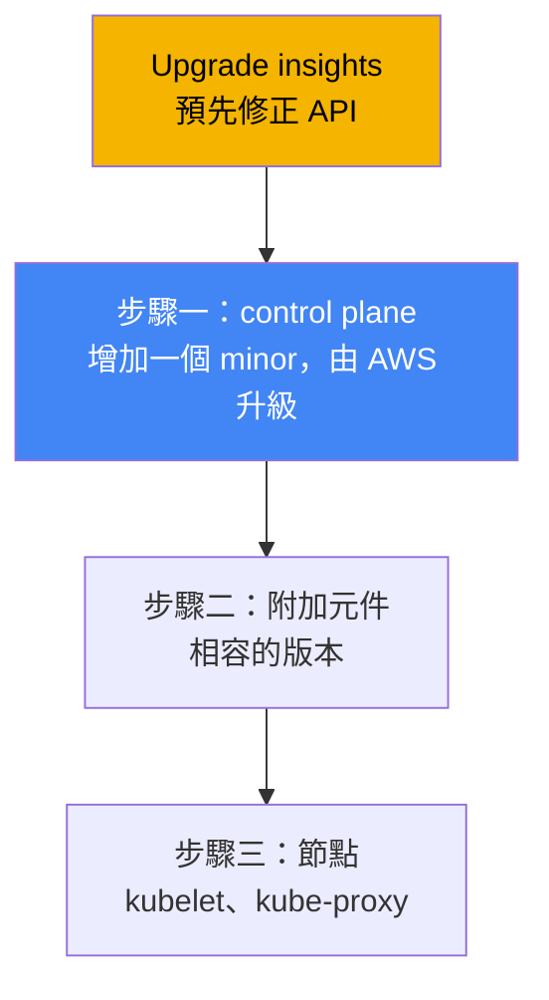
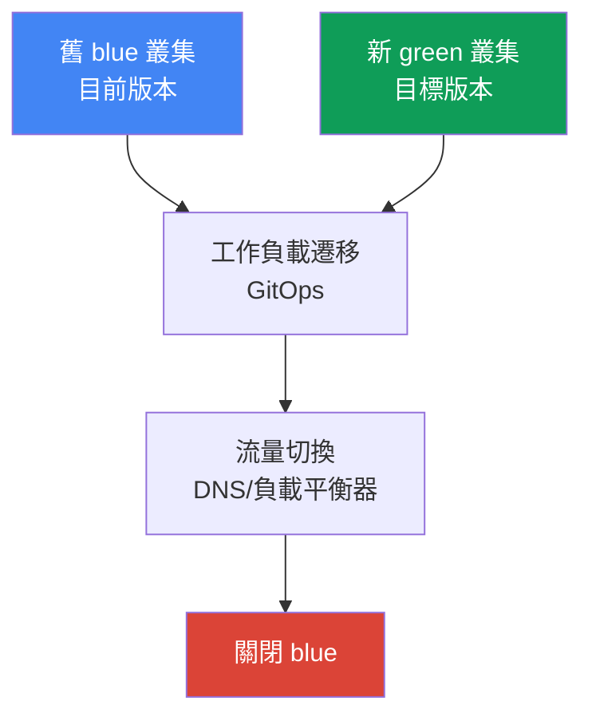

[Eng version](en.md) · [Versión en español](es.md) · [Version française](fr.md) · [Deutsche Version](de.md) · [ქართული ვერსია](ge.md) · [Русская версия](ru.md) · [日本語版](jp.md)

# 第 38 章。叢集升級：依版本原地升級、blue/green 叢集、已棄用的 API

> **接下來。** 第 37 章說明了附加元件：誰負責其生命週期，以及如何讓版本與叢集版本保持一致。本章討論整個叢集依 Kubernetes 版本升級：版本生命週期、in-place 升級順序、已棄用 API 與 blue/green 遷移。相關內容交由其他章節說明：附加元件本身及其升級順序見第 37 章；版本回滾（rollback readiness）見第 39 章；可靠性、PDB 與正確關閉節點見第 40 章；blue/green 遷移的 GitOps 見第 44 章；受管節點與 Karpenter drift 見第 11 與 12 章。

## 38.1.「版本即將不再受支援」與「apply 無法再套用」

第一種情境由電子郵件與主控台橫幅出現：您的叢集版本即將結束 standard support。這不是抽象的警告，而是付費倒數的開始。standard support 結束後，叢集不會故障，但會進入 extended support，叢集每小時費用會提高。extended support 也不是永久的：它結束後，EKS 會自行提升叢集版本，不會配合團隊的排程。徵兆很簡單：收到通知，而 CLI 輸出會顯示版本距離 standard support 結束還剩多久：

```bash
# 該版本的 standard support 截止日期
aws eks describe-cluster-versions \
  --query 'clusterVersions[?clusterVersion==`1.33`].[clusterVersion,endOfStandardSupport]'
```

第二種情境在升級後出現，看起來像部署突然壞掉。叢集升到新的 minor 版本，一切都是綠燈，但 CI 在發佈時失敗，`kubectl apply` 回應：

```bash
kubectl apply -f ingress.yaml
# error: resource mapping not found for name: "web" namespace: "prod"
# from "ingress.yaml": no matches for kind "Ingress" in version "extensions/v1beta1"
```

沒有任何東西是「自己」壞掉的：Kubernetes 在新的 minor 版本中移除了編寫該 manifest 所用的 `apiVersion`。只要叢集仍在舊版，舊的 `apiVersion` 還會提供服務；升級後，API server 不再認得它，任何使用這個 `apiVersion` 的 manifest 都無法套用。已在執行的物件可能經過轉換而存活，但此資源的新發佈與任何 `apply` 現在都會失敗。

兩種痛點其實是同一件事：叢集升級不是一個按鈕，而是兼具時程（版本生命週期）與準備工作（已棄用 API）的程序。以下依序說明：版本生命週期如何運作、in-place 升級依什麼順序進行、如何預先找出移除的 API、EKS cluster insights 顯示什麼、如何升級節點，以及何時應以 blue/green 叢集取代 in-place。

## 38.2. EKS 版本生命週期

Kubernetes 平均每四個月發布一個新的 minor 版本，EKS 遵循這個週期。EKS 中每個 minor 版本有三個支援階段，應依此規劃升級。

| 階段 | 持續時間 | 代表意義 |
|---|---|---|
| Standard support | 版本在 EKS 發布後約 14 個月 | 一般支援，不需為版本額外付費 |
| Extended support | standard 結束後約 12 個月 | 版本仍可使用，但叢集每小時費用提高 |
| 強制 upgrade | extended support 結束後 | EKS 自行升級至最近的受支援版本 |

這對營運有三項影響。第一，**計劃性升級的窗口約為 14 個月**：standard support 期間，可從容升級，無須為版本額外付費。第二，**extended support 不是免費延期**：它預設啟用，叢集每小時費用較高，因此「暫時不升級」是有意識的付費決定，而不是沒有決定。第三，**extended support 結束時的強制 upgrade**：若未及時升級，EKS 會自行提升版本，而在 extended support 結束時被自動升級的叢集無法再回滾（回滾見第 39 章）。



還有一項嚴格限制：**一次只能升級一個 minor 版本**。無法從 `1.30` 直接跳至 `1.33`，必須經過 `1.30` → `1.31` → `1.32` → `1.33`，每個 minor 都是獨立升級。原因是 EKS 維護高可用 control plane，並嚴格依照 version skew policy，每次只升級一個 minor 的 kube-apiserver。Patch 版本（例如同一 minor 內的更新）由 EKS 自行套用；minor 升級則由工程師負責，而且永遠逐步進行。

## 38.3. In-place 升級：順序與 version skew

In-place 升級是在不建立第二個叢集的情況下，將同一叢集升至新的 minor 版本。它不是單一命令，而是一連串有順序的步驟；此順序很重要，因為它由 Kubernetes 的 version skew policy（第 37 章）決定，該規則限制節點元件落後 kube-apiserver 的程度。



步驟如下。第零步是**準備**：執行 upgrade insights 並修正已棄用 API（第 38.4 與 38.5 節），確認節點上的 kubelet 沒有比 control plane 落後超過允許的 skew。第一步是 **control plane**：AWS 自行將受管 control plane 升級一個 minor；過程中會啟動新的 API server 執行個體並進行 rolling update，因此叢集子網路需要數個可用 IP。若新的 control plane 未通過 health check，EKS 會回滾基礎設施步驟，叢集維持原本版本，執行中的工作負載不受影響。

第二步是**附加元件**：core 附加元件（`kube-proxy`、`coredns`、`vpc-cni`）不會隨 control plane 自行升級，必須透過 `describe-addon-versions` 升至與新 minor 相容的版本（第 37 章）。第三步是**節點**：將節點上的 kubelet 與 kube-proxy 升至 control plane 的版本。根據 version skew policy（自 Kubernetes 1.28 起），kubelet 可比 kube-apiserver 落後最多三個 minor，因此不強制在每個 minor 升級後立即升級節點，但 AWS 建議節點與 control plane 維持相同版本，不要累積落後。也要將用戶端（`kubectl`）與其他叢集應用程式（例如 cluster-autoscaler）更新至新的 minor。

## 38.4. 已棄用與已移除的 API

Kubernetes 分階段演進 API：首先將 `apiVersion` 宣告為 **deprecated**（已棄用，但仍可運作），若干 minor 版本後再宣告為 **removed**（已移除，API server 不再提供服務）。正是 removed 版本會造成第 38.1 節中的 `apply` 失敗。應了解移除里程碑，因為跨越它們升級的風險最高：

| 版本 | 移除的內容（範例） |
|---|---|
| 1.16 | Deployment、DaemonSet、ReplicaSet 的舊 `apiVersion`（遷移至 `apps/v1`） |
| 1.22 | beta 群組中的 `Ingress` 與 `CustomResourceDefinition`、舊 admission webhooks |
| 1.25 | `PodSecurityPolicy`、`CronJob batch/v1beta1`、`PodDisruptionBudget policy/v1beta1` |
| 1.29 | `flowcontrol.apiserver.k8s.io/v1beta2`（FlowSchema、PriorityLevelConfiguration） |
| 1.32 | `flowcontrol.apiserver.k8s.io/v1beta3` |

危險之處在於問題很安靜：叢集仍在舊版時，已棄用的 `apiVersion` 可以運作且不會大聲警告；恰好在跨越移除里程碑升級時才會失敗。因此必須在升級**之前**尋找並修正已棄用 API：將 manifest 重寫為目前的 `apiVersion`，並在仍使用舊叢集版本時預先發佈（新的 `apiVersion` 通常已在該版本中受支援）。偵測工具如下：

| 工具 | 檢查位置 | 特性 |
|---|---|---|
| EKS upgrade insights | 由 AWS 檢查整個叢集 | 內建功能，標示即將移除 API 的使用情況 |
| pluto | Git 中的 manifests 與 Helm releases | 在套用前進行靜態掃描 |
| kube-no-trouble (`kubent`) | 執行中叢集的物件 | 可快速依實際狀態執行掃描 |
| `kubectl` deprecations / warnings | API server | 在 `apply` 時發出警告，以及 `kubectl deprecations` 外掛程式 |

實務上，`kubent` 與 upgrade insights 顯示目前已存在於叢集的內容，而 `pluto` 在發佈前就能在儲存庫與 Helm charts 中找出已棄用的 `apiVersion`。兩種觀點都很有用：叢集可能是乾淨的，但 Git 仍留著會在升級後的下一次發佈中失敗的舊 manifest。

## 38.5. EKS cluster insights 與 upgrade insights

**Cluster insights** 是 EKS 內建、對照 AWS 維護問題清單的叢集檢查。分為三種類型：**upgrade insights**（升級就緒性）、**rollback readiness insights**（回滾就緒性，第 39 章）和 **configuration insights**（供 hybrid nodes 使用）。檢查自動執行，每 24 小時更新一次；修正問題後，可手動更新清單，不必等待一天。

升級時重要的是 upgrade insights 類型：EKS 自行掃描可能妨礙升至新 minor 的項目，首先是即將移除的 Kubernetes API 使用情況，並提供含文件連結的建議。AWS 會隨 Kubernetes 變更持續擴充檢查清單，因此應在**每次升級前**檢視 insights，而非只檢視一次。EKS 透過為 insights 自動建立的 access entry 取得資料，無須設定個別權限。

```bash
# 叢集的 insights 清單（包含 upgrade）
aws eks list-insights --cluster-name my-cluster
# 特定 insight 的詳細資料：狀態、建議、受影響資源
aws eks describe-insight --cluster-name my-cluster --id <insight-id>
```

工作順序很簡單：升級前，開啟 upgrade insights 分頁（或逐一查看 `list-insights`），處理所有標示為問題的項目，修正 manifests，更新 insights，並確認清單乾淨。只有在這之後才開始更新 control plane。

## 38.6. 更新節點

AWS 更新 control plane，但節點是工程師的責任範圍，方法取決於節點的管理方式。有三種選項：

| 方式 | 如何更新 | 是否遵守 PDB |
|---|---|---|
| Managed node group | AWS 執行 rolling update：cordon、drain、依新 launch template 替換 | 是，drain 遵守 PDB |
| Karpenter (drift) | 將新 AMI/版本的節點視為 drift 而重新建立（第 12 章） | 是，透過 graceful disruption |
| Self-managed | 更新 launch template，手動或透過自有自動化輪替節點 | 由您負責 |

**Managed node group** 的更新分階段進行：EKS 使用目標 AMI 建立新版本的 launch template，啟動新節點，將舊節點標示為 unschedulable（cordon），並排空其上的 Pods（drain）。Drain 遵守 PodDisruptionBudget：會依 PDB 驅逐 Pods，而不是一次全部驅逐。這正是常見的卡點：過於嚴格的 PDB。若無法在 15 分鐘內驅逐 Pods，升級階段會以 `PodEvictionFailure` 失敗；此時可放寬 PDB，或以 force 旗標啟動更新，強制驅逐 Pods 並忽略 PDB。平行更新的節點數量由群組 `updateConfig` 中的 `maxUnavailable` 指定。

**Karpenter** 透過 drift 機制更新節點（第 12 章）：當所需 AMI 或版本改變時，Karpenter 視現有節點為過時並重新建立，同樣會正確地驅逐工作負載。**Self-managed** 節點完全由您自行升級：變更 launch template 並輪替替換節點。關於輪替時的 PDB、topology spread 與正確關閉節點，請見第 40 章。

## 38.7. Blue/green 叢集

In-place 不是唯一途徑。替代方案是 **blue/green**：在旁邊立即建立目標版本的新叢集（green），將工作負載遷移至其中，切換流量，然後關閉舊叢集（blue）。其意義在於可逐步以實際流量驗證目標版本，而回滾只需將流量切回仍在運作的舊叢集。



透過 GitOps 以宣告式方式遷移工作負載（第 44 章）：將相同的一組 manifests 套用至新叢集，並在 DNS（Route 53）或負載平衡器層級切換流量。兩種方法的選擇，是風險、成本與複雜度的平衡：

| 準則 | In-place | Blue/green |
|---|---|---|
| 複雜度 | 較簡單：一個叢集，依序執行步驟 | 較複雜：兩個叢集、遷移、流量 |
| 成本 | 沒有重複的基礎設施 | 暫時有兩個叢集，成本較高 |
| 版本跳躍 | 一次僅一個 minor | 直接升至新叢集所需版本 |
| 風險與回滾 | 在 7 天窗口內回滾（第 39 章） | 回滾 = 將流量切回 blue，速度快 |
| 適用時機 | 正常的定期升級 | 版本落後很大、風險高、不相容 |

實用的規則是：**定期升級使用 in-place**，因為它更簡單、較便宜，也沒有重複基礎設施。**當 in-place 風險高或不可行時採用 blue/green**：版本落後太多，逐一跨越所有 minor 太久且危險；需要最快的回滾能力；或新叢集改變了 in-place 無法承受的項目（移除 API 的集合、網路變更、不同的附加元件集合）。blue/green 的代價是暫時重複的叢集，以及遷移和切換流量的工作。

## 38.8. 如何在生產環境中使用

- **依支援日曆規劃升級，而非等收到電子郵件才開始。** 將版本保持在 standard support（約 14 個月）範圍內並及早升級，避免進入費用提高的 extended support，更不要走到強制 upgrade。
- **在升級前修正已棄用 API，而不是升級後。** 對叢集執行 upgrade insights 與 `kubent`，對 Git 和 Helm 執行 `pluto`，將 manifests 重寫為目前的 `apiVersion`，並在舊版本上預先發佈。
- **嚴格遵守順序：**先升級 control plane，再將 core 附加元件升至相容版本（第 37 章），最後升級節點。略過附加元件步驟會造成 version skew，並破壞網路與 DNS。
- **一次只升級一個 minor**，不要嘗試跳過版本；對落後許多 minor 的叢集，應評估 blue/green，而不是進行長串 in-place 升級。
- **讓 PDB 準備好進行節點輪替。** 確認 budget 不會過於嚴格，否則 managed node group 的 drain 會在 `PodEvictionFailure` 失敗；PDB 與 graceful shutdown 見第 40 章。
- **先在非穩定叢集上執行升級。** 在生產環境之前先升級測試或 staging 叢集，並在那裡找出新版本的意外情況。

## 38.9. 迷你詞彙表

- **standard support**：EKS 中 minor 版本的支援階段（約 14 個月），可正常運作，無須為版本額外付費。
- **extended support**：standard 之後的階段（約 12 個月）：版本仍受支援，但叢集每小時費用較高；預設啟用。
- **強制 upgrade**：extended support 結束後自動提升版本；這類叢集無法回滾。
- **in-place upgrade**：將同一叢集升級至下一個 minor：先 control plane，接著附加元件，最後節點。
- **version skew policy**：限制節點元件相對 kube-apiserver 落後程度的 Kubernetes 規則（第 37 章）。
- **deprecated / removed API**：`apiVersion` 先被宣告為已棄用，之後移除；移除後，使用它的 manifests 無法套用。
- **cluster insights**：EKS 內建的檢查：upgrade、rollback readiness、config。
- **upgrade insights**：標示升級就緒性與即將移除 API 的 insights 類型。
- **pluto / kube-no-trouble (kubent)**：尋找已棄用 API 的工具：pluto 用於 Git 與 Helm，kubent 用於執行中的叢集。
- **blue/green 叢集**：與舊叢集並列、使用目標版本的新叢集，伴隨工作負載遷移與流量切換。

## 38.10. 本章總結

- EKS 版本有三個階段：standard support（約 14 個月）、extended support（約 12 個月，較昂貴），接著是強制 upgrade；應在 standard support 窗口中規劃升級。
- 一次只能升級一個 minor；不可跳過版本。EKS 自行套用 patch，minor 升級則由工程師負責。
- In-place 升級依此順序：準備、control plane（由 AWS 升級）、升至相容版本的 core 附加元件（第 37 章）、然後節點；順序由 version skew policy 決定。
- Kubernetes 會在 minor 版本之間移除 API（里程碑為 1.16、1.22、1.25、1.29、1.32）；升級後，使用舊 `apiVersion` 的 manifests 將無法套用。
- 預先尋找已棄用 API：在叢集使用 upgrade insights 和 `kubent`，在 Git 與 Helm 使用 `pluto`；在升級前修正 manifests。
- EKS cluster insights 自動檢查叢集升級就緒性，並標示即將移除的 API；每次升級前都應檢視。
- 節點依不同方式升級：managed node group（含 drain 的 rolling update，遵守 PDB，發生 `PodEvictionFailure` 時可用 force 旗標）、Karpenter（drift，第 12 章）、self-managed（自行處理）。
- Blue/green 建立目標版本的新叢集並切換流量；在版本差距大、風險高或不相容時採用，代價是暫時重複的叢集。

## 38.11. 這在實際工作中如何派上用場

值班時，升級不是「按下更新」，而是執行一份檢查清單。升級前先查看 upgrade insights，並執行 `kubent` 與 `pluto`，讓移除的 API 在升級之前浮現，而不是隔天在生產環境看到 `kubectl apply` 失敗。理解 control plane、附加元件與節點會分別且嚴格依序升級，可省下數小時釐清「為何成功升級後網路失效」的時間，通常是遺漏了附加元件步驟（第 37 章）。

規劃營運時要決定三件事。第一是日曆：將版本維持在 standard support 範圍內並提早升級，以免支付 extended support 費用，也避免在沒有回滾窗口時遭遇強制 upgrade。第二是策略：定期升級逐一以 in-place 完成；對嚴重落後的叢集或高風險轉換，預先規劃透過 GitOps 遷移的 blue/green（第 44 章）。第三是節點就緒性：確認 PDB 不會阻擋 drain，並就節點是透過 managed node group、Karpenter drift 或手動升級達成共識。如此一來，升級不再是緊急事故，而會成為例行程序。

## 38.12. 自我檢查問題

1. EKS minor 版本的生命週期由哪三個階段組成，各階段約持續多久？
2. 若未在 extended support 結束前升級叢集，會發生什麼事？這種叢集可否回滾？
3. 為什麼不能從 `1.30` 直接升級到 `1.33`？正確做法是什麼？
4. In-place 升級以什麼順序進行，為什麼要如此安排（哪一項規則決定它）？
5. API 的 deprecated 與 removed 狀態代表什麼，`kubectl apply` 在何時會失敗？
6. 請列出 Kubernetes 各版本中幾個 API 移除里程碑。
7. 透過 `kubent` 尋找已棄用 API 與透過 `pluto` 尋找有何差異？為什麼兩者都需要？
8. 什麼是 EKS upgrade insights，何時應檢視它們？
9. Managed node group 如何更新節點？若 PDB 過於嚴格會發生什麼事？
10. Karpenter 如何更新節點，與 managed node group 有何不同？
11. 什麼是 blue/green 叢集升級，其中的回滾如何進行？
12. 什麼情況下選擇 blue/green 而非 in-place，為此要付出什麼代價？

## 實作

本課程對應的實驗：[實驗 113：叢集升級與回滾：control plane、附加元件、已棄用的 API](../../labs/113/README_TW.MD)。除此之外，也能在執行中的叢集上快速檢視升級就緒性與目前版本狀態。先查看叢集版本，以及它的 standard support 還剩多久：

```bash
# 目前的叢集版本
aws eks describe-cluster --name my-cluster --query 'cluster.version'
# 版本支援階段：standard support 的截止日期
aws eks describe-cluster-versions \
  --query 'clusterVersions[].[clusterVersion,endOfStandardSupport]' --output table
```

接著執行內建的升級就緒性檢查，並處理所有標示為問題的項目：

```bash
# 叢集的 insights 清單（包含 upgrade）
aws eks list-insights --cluster-name my-cluster
# 特定 insight 的詳細資料：狀態與建議
aws eks describe-insight --cluster-name my-cluster --id <insight-id>
```

確認是否有任何項目直接使用已棄用 API，並在考慮升級前，將 core 附加元件版本與叢集 minor 版本比對：

```bash
# 叢集內可用的 API 版本（尋找即將移除的 beta 群組）
kubectl get --raw /apis | grep -o '"groupVersion":"[^"]*"'
# 將附加元件更新至相容版本（範例；版本取自 describe-addon-versions）
aws eks update-addon --cluster-name my-cluster --addon-name kube-proxy \
  --addon-version <相容版本>
```

對照三項內容：叢集版本與 standard support 結束日期、upgrade insights 清單，以及 Git 中編寫 manifests 時實際使用的 `apiVersion`。若 insights 乾淨、沒有已棄用 API，且附加元件與目標 minor 相容，叢集就已準備好依第 38.3 節的順序進行 in-place 升級。若出現問題，回滾見第 39 章。

---
[目錄](../README_TW.md) · [第 37 章](../37/tw.md) · [第 39 章](../39/tw.md)
