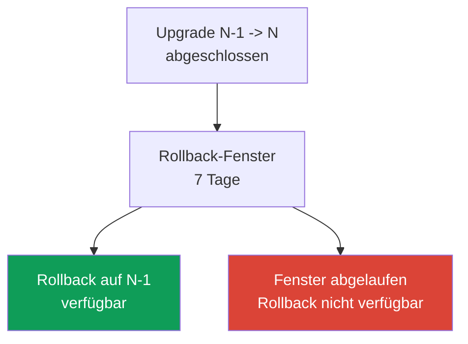
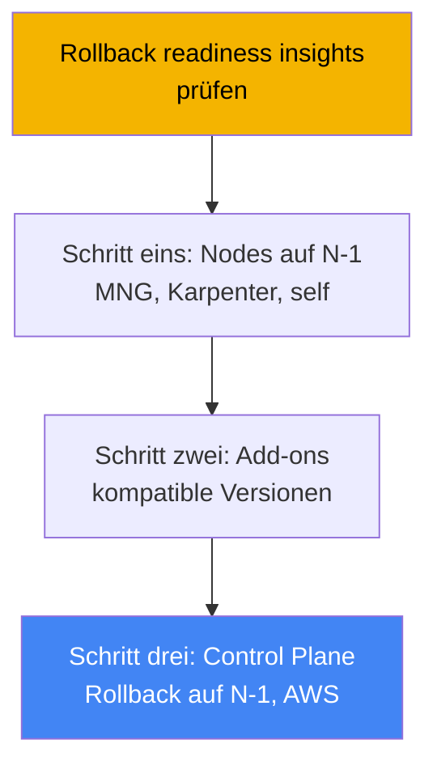
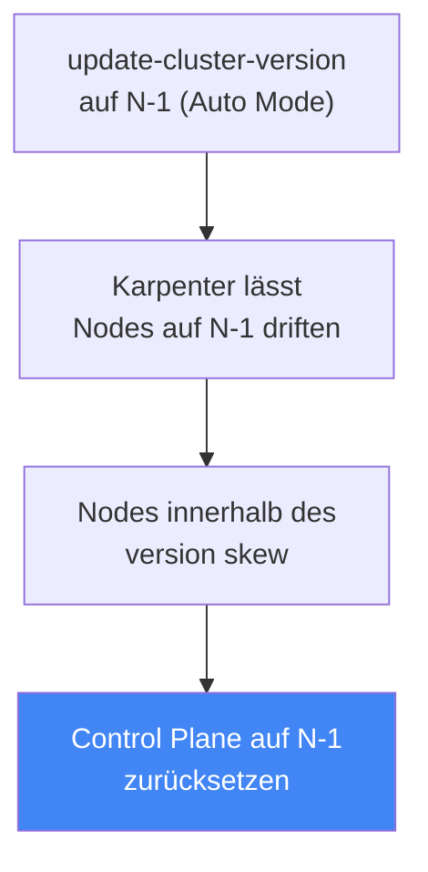

[Русская версия](ru.md) · [Eng version](en.md) · [Versión en español](es.md) · [Version française](fr.md) · [ქართული ვერსია](ge.md) · [繁體中文版](tw.md) · [日本語版](jp.md)
# Kapitel 39. Zurücksetzen der Cluster-Version: Rollback-Readiness-Insights, 7-Tage-Fenster, Reihenfolge des Rollbacks

> **Wie es weitergeht.** Kapitel 38 behandelte das Cluster-Upgrade: Versionslebenszyklus,
> In-Place-Upgrade um jeweils eine Minor-Version, veraltete APIs und die Blue/Green-Migration.
> Hier geht es um die umgekehrte Operation: das Zurücksetzen der Control Plane auf die vorherige
> Minor-Version, wenn das Upgrade erfolgreich war, aber etwas auf der neuen Version nicht mehr
> funktioniert. Verwandte Themen behandeln andere Kapitel: das Upgrade selbst und Blue/Green in
> Kapitel 38, cluster insights allgemein in Kapitel 38, Zuverlässigkeit, PDBs und das
> ordnungsgemäße Herunterfahren von Nodes in Kapitel 40, Backup und Wiederherstellung des
> Cluster-Zustands in den Kapiteln 41 und 42 sowie EKS Auto Mode in Kapitel 9.

## 39.1. „Aktualisiert, es wurde schlechter, und zurück gibt es keinen Weg“

Das Szenario ist aus dem Bereitschaftsdienst bekannt. Der Cluster wurde gemäß dem Prozess aus
Kapitel 38 auf eine neue Minor-Version angehoben: insights sind sauber, Add-ons kompatibel,
Control Plane und Nodes grün. Eine Stunde später stellt sich heraus, dass auf der neuen Version
etwas nicht funktioniert, das insights nicht erfassen konnten: Ein Drittanbieter-Controller
stürzt wegen eines geänderten API-Verhaltens ab, ein Custom Operator startet nicht, die Last
verhält sich nach geänderten kube-apiserver-Standardeinstellungen ungewöhnlich. Das Upgrade war
formal erfolgreich, doch die Produktion ist beeinträchtigt.

Historisch war das eine Falle ohne Ausweg. Ein Kubernetes-Upgrade ist nur in eine Richtung
vorgesehen: Upstream unterstützt kein Herabsetzen der Minor-Version der Control Plane. Dem
Engineering blieben daher zwei schwierige Wege. Der erste war die Fehlerbehebung vor Ort:
Controller und Workloads unter Produktionslast eilig für die neue Version patchen. Der zweite war
Blue/Green: den Traffic auf einen vorab bereitgestellten alten Cluster umschalten. Doch
Blue/Green muss vor dem Upgrade vorbereitet werden, und bei einem gewöhnlichen In-Place-Upgrade
ist es nicht vorhanden, es gibt nichts, wohin zurückgekehrt werden kann.

EKS schließt diese Lücke: Es gibt ein standardmäßiges Zurücksetzen der Cluster-Version. Es bringt
die Control Plane ohne Neuerstellung des Clusters auf die vorherige Minor-Version zurück. Es hat
jedoch strenge Bedingungen: ein Fenster von nur 7 Tagen, eine Version zurück und eine Reihe von
Blockern. Es funktioniert nicht wie eine „Abbrechen“-Schaltfläche, sondern als Verfahren mit
einer eigenen Reihenfolge. Sehen wir uns an, was genau zurückgesetzt wird, was das Zurücksetzen
nicht tut und wie es nicht gerade dann verloren geht, wenn es benötigt wird.

## 39.2. Warum ein Zurücksetzen überhaupt schwierig ist

In Upstream-Kubernetes ist das Upgrade als Bewegung in nur eine Richtung konzipiert. Beim
Aktualisieren werden kube-apiserver und etcd auf neue Schemas umgestellt, während die
Komponenten auf den Nodes (kubelet) folgen. Die Version-skew policy erlaubt, dass kubelet älter
als kube-apiserver ist, aber nicht neuer. Upstream unterstützt und testet das Herabsetzen der
Control Plane nicht: Es gibt keine Garantie, dass Objekte in etcd korrekt „zurückkonvertiert“
werden.

Daher hat EKS kein allgemeines Downgrade implementiert, sondern ein begrenztes Zurücksetzen: Es
bringt **nur die Control Plane** um **eine vorherige** Minor-Version zurück, in einem **engen
Fenster** nach dem Upgrade, während etcd-Daten und Workloads an Ort und Stelle erhalten bleiben.
Alles, was das Zurücksetzen sicherer macht als ein allgemeines Downgrade, sind gerade diese
Beschränkungen: ein frisches Upgrade (etcd ist noch nicht mit Objekten bewachsen, die nur die
neue Version kennt), eine Minor-Version (kleiner Schemaunterschied) und Bereitschaftsprüfungen,
die Inkompatibilitäten früh erkennen.



Der Zweck des Features ist unmittelbar: Das Zurücksetzen ist ein schneller Ausweg aus einem
fehlgeschlagenen Upgrade, solange der Versionsunterschied klein und frisch ist. Es ist keine
Zeitmaschine für den Cluster und kein Ersatz für ein Backup (die Grenze beschreibt Abschnitt
39.7).

## 39.3. EKS cluster version rollback: 7-Tage-Fenster und eine Version

Das Zurücksetzen bringt die Control Plane nach einem In-Place-Upgrade auf die vorherige
Minor-Version zurück. EKS setzt kube-apiserver und Komponenten der Control Plane sowie die
platform version zurück (auf die letzte platform version der vorherigen Minor-Version), während
etcd-Daten, Workloads und persistente Volumes erhalten bleiben. Die wesentlichen Bedingungen
werden als Voraussetzungen geprüft und sollten im Voraus bekannt sein.

| Bedingung | Anforderung |
|---|---|
| 7-Tage-Fenster | Das Zurücksetzen muss innerhalb von 7 Tagen nach Abschluss des Upgrades gestartet werden, danach ist es nicht verfügbar. |
| Nur In-Place-Upgrade | Ein Cluster, der direkt auf der aktuellen Version erstellt wurde, kann nicht zurückgesetzt werden. |
| Eine Minor-Version zurück | Nur N -> N-1; bei `1.31`->`1.32`->`1.33` ist ein Zurücksetzen nur auf `1.32` möglich. |
| Unterstützte Version | Die Zielversion muss zu den unterstützten EKS-Versionen gehören. |
| Extended support | Für das Zurücksetzen auf eine Version im extended support muss die upgrade policy zuvor auf `EXTENDED` geändert werden. |
| Kein auto-upgrade aus extended | Ein Cluster, der am Ende des extended support automatisch aktualisiert wurde, kann nicht zurückgesetzt werden. |
| Status ACTIVE | Der Cluster hat den Status `ACTIVE` und kein weiteres laufendes Update. |
| Kompatibilität von EKS-Features | Ist ein aktiviertes EKS-Feature auf der vorherigen Version nicht unterstützt, wird das Zurücksetzen abgelehnt. |

Zwei Feinheiten zu auto-upgrade aus Kapitel 38. Wenn EKS die Version selbst am Ende des
**extended support** angehoben hat, ist kein Zurücksetzen verfügbar. Hat EKS sie selbst am Ende
des **standard support** angehoben, kann zurückgesetzt werden, doch zuvor muss die upgrade policy
des Clusters auf `EXTENDED` geändert werden. Außerdem fallen beim Zurücksetzen von einer Version
im standard support auf eine Version im extended support erneut die erhöhten Gebühren für
extended support an (die Kostenstruktur behandelte Kapitel 38).

Das Zurücksetzen selbst wird mit demselben Befehl wie das Upgrade gestartet, nur mit der
vorherigen Version:

```bash
# Control Plane auf die vorherige Minor-Version (N-1) zurücksetzen
aws eks update-cluster-version --name my-cluster --kubernetes-version 1.30
```

In der Antwort ist der Update-Typ `VersionRollback` und nicht ein gewöhnliches Upgrade. Den
Fortschritt zeigt `describe-update` anhand der `id` aus der Antwort (Abschnitt „Praxis“).

## 39.4. Rollback readiness insights

Ob ein Zurücksetzen möglich ist, muss nicht manuell geprüft werden. Dafür gibt es einen eigenen
Typ cluster insights (Kapitel 38): **rollback readiness insights** in der Kategorie
`ROLLBACK_READINESS`. Das sind punktuelle Prüfungen (point-in-time), die EKS **nach dem Upgrade**
erstellt und genau während des 7-Tage-Rollback-Fensters verfügbar hält. Nach Ablauf des Fensters
werden insights dieses Typs für den Cluster nicht mehr generiert. Sie sollten unmittelbar nach
dem Upgrade geprüft werden, nicht erst, wenn bereits etwas ausgefallen ist.

Was rollback readiness insights prüfen:

- Kompatibilität der API-Nutzung zwischen den Versionen, bis hin zu Änderungen auf Feldebene;
- allgemeinen Zustand des Clusters;
- version skew für kubelet und kube-proxy (ob die Nodes neuer sind als die Ziel-Control-Plane);
- Kompatibilität der Add-on-Versionen mit der Zielversion;
- für EKS Auto Mode zusätzlich: NodePool disruption budgets, Annotationen `do-not-disrupt` und
  die Konfiguration von PodDisruptionBudget.

Jeder insight hat einen Status, von dem abhängt, ob das Zurücksetzen zugelassen wird.

| Status | Bedeutung | Auswirkung auf das Zurücksetzen |
|---|---|---|
| PASSING | Keine Probleme gefunden | Zurücksetzen erlaubt |
| WARNING | Mögliches, nicht blockierendes Problem | Zurücksetzen erlaubt, dies ist eine Warnung |
| ERROR | Blockierendes Problem | Zurücksetzen blockiert, bis es behoben ist (oder `--force`) |
| UNKNOWN | Status konnte nicht bestimmt werden | Zurücksetzen blockiert (oder `--force`) |

Die Status ERROR und UNKNOWN blockieren das Zurücksetzen. Sie werden entweder behoben und die
insights aktualisiert oder mit `--force` umgangen. Wichtig: `--force` **umgeht nur die
insight-Prüfungen** (ERROR, WARNING, UNKNOWN), nicht jedoch die Voraussetzungen: 7-Tage-Fenster,
„auf der aktuellen Version erstellt“, eine Minor-Version und Kompatibilität von EKS-Features
können nicht mit `--force` umgangen werden. Bei Folgen von `--force` übernimmt EKS keine
Verantwortung: Es gibt keine Sicherheitsgarantien für ein Zurücksetzen mit umgangenen Prüfungen.

```bash
# nur rollback readiness insights
aws eks list-insights --cluster-name my-cluster \
  --filter '{"categories": ["ROLLBACK_READINESS"]}'
# insights nach der Behebung sofort aktualisieren, ohne 24 Stunden zu warten
aws eks start-insights-refresh --cluster-name my-cluster
```

EKS aktualisiert insights alle 24 Stunden und führt vor dem eigentlichen Zurücksetzen
automatisch ein refresh aus, damit die Prüfungen den aktuellen Cluster-Zustand verwenden.

## 39.5. Reihenfolge des Zurücksetzens: umgekehrt zum Upgrade

Die Reihenfolge des Zurücksetzens spiegelt das Upgrade aus Kapitel 38. Dort war die Reihenfolge:
Control Plane, dann Add-ons, dann Nodes. Beim Zurücksetzen ist sie umgekehrt, aus demselben Grund
der version skew policy: **Nodes dürfen nicht neuer als die Control Plane sein**. Wenn das
Upgrade die Nodes bereits auf N angehoben hat, während die Control Plane auf N-1 zurückgesetzt
wird, wären die Nodes neuer, also wäre der skew verletzt. Daher müssen die Nodes auf N vor dem
Zurücksetzen der Control Plane auf N-1 zurückgebracht werden. Daraus folgt die allgemeine
Reihenfolge.



Wer die Nodes zurückbringt, hängt vom Compute-Typ ab (Kapitel 9):

| Node-Typ | Wer setzt zurück | Wie |
|---|---|---|
| EKS Auto Mode | EKS automatisch | Nodes driften auf N-1 **vor** der Control Plane, ohne manuelle Aktionen. |
| Managed node group | Sie | `update-nodegroup-version` vor dem Zurücksetzen der Control Plane auf die vorherige Version. |
| Karpenter | Sie | Drift: gewünschtes AMI/Version auf N-1, Karpenter erstellt die Nodes neu (Kapitel 12). |
| Self-managed / hybrid | Sie | AMI/Node-Konfiguration vor dem Zurücksetzen der Control Plane selbst auf N-1 ändern. |
| Fargate | Nicht unterstützt | Fargate kann nicht zurückgesetzt werden; Pods vor dem Zurücksetzen löschen oder `--force` verwenden. |

Eine Feinheit aus Kapitel 9: Bei **EKS Auto Mode** werden Nodes **vor** der Control Plane
zurückgesetzt, und das übernimmt EKS. Beim Aufruf von `update-cluster-version` mit N-1 bei einem
Auto-Mode-Cluster lässt EKS zuerst die Nodes per Karpenter auf das AMI der vorherigen Version
driften (unter Beachtung von disruption budgets und PDBs), wartet, bis alle Nodes innerhalb des
zulässigen version skew liegen, und setzt erst dann die Control Plane zurück. Während die Nodes
driften, bleibt der Cluster `ACTIVE`; der Status wechselt erst beim Zurücksetzen der Control
Plane auf `UPDATING`. Die Phase des Node-Rollbacks kann abhängig von disruption controls Minuten
bis 7 Tage dauern.



Ein separater Praxistipp aus den AWS best practices: Bei gewöhnlichen Nodes (MNG, self-managed)
ist es sinnvoll, Control Plane und Nodes zeitlich getrennt zu aktualisieren und eine Pause (bake
period) einzuhalten. Solange die Nodes auf N-1 bleiben, während die Control Plane bereits N
verwendet, bleibt der insight zu kubelet version skew PASSING, und der Weg zum Zurücksetzen ist
ohne vorheriges Zurückbringen der Nodes offen. Das ist die günstigste Methode, das Zurücksetzen
verfügbar zu halten: Nodes nicht direkt nach der Control Plane aktualisieren.

## 39.6. Was das Zurücksetzen blockiert und wie man sich vorbereitet

Die Blocker lassen sich in zwei Klassen teilen. Die erste sind **harte Voraussetzungen**, die
nicht umgangen werden können: Das 7-Tage-Fenster ist abgelaufen; der Cluster wurde direkt auf der
aktuellen Version erstellt (es gab kein Upgrade); der Cluster wurde bereits um eine weitere
Minor-Version angehoben (Rollback nur um eine Minor-Version); an der Versionsgrenze wurde ein
inkompatibles EKS-Feature aktiviert; auto-upgrade erfolgte am Ende des extended support. Die
zweite Klasse sind **Blocker aus insights** (Status ERROR/UNKNOWN), die entweder behoben oder mit
`--force` umgangen werden können: inkompatible Add-on-Versionen, Objekte auf APIs, die in der
alten Version nicht vorhanden sind, Verstöße gegen version skew, bei Auto Mode `do-not-disrupt`
an einem Node oder das Budget `nodes: 0`.

Der tückischste der „weichen“ Blocker sind **Objekte auf neuen APIs**. Wenn während der Zeit auf
der neuen Version Ressourcen über eine API erstellt wurden, die in der alten Version noch nicht
vorhanden war, hinterlässt das Zurücksetzen der Control Plane diese Objekte ohne die API, die sie
verwaltet. Daraus folgt die Vorbereitungspraxis: Während des 7-Tage-Fensters **nicht vorschnell
APIs und Features nutzen, die nur in der neuen Version verfügbar sind**, sonst wird der Weg
zurück selbst versperrt. Wurden solche Objekte bereits erstellt, werden sie vor dem
Zurücksetzen gelöscht.

So bleibt das Zurücksetzen in der Praxis verfügbar:

- rollback readiness insights unmittelbar nach dem Upgrade ansehen und ERROR beheben, solange
das Fenster offen ist;
- Add-ons auf Versionen aktualisieren, die sowohl mit der alten als auch mit der neuen
  Minor-Version kompatibel sind (cross-compatible);
- Nodes nicht sofort auf die neue Version bringen, sondern eine bake period einhalten, damit der
  skew-insight PASSING ist;
- während des Fensters keine Objekte auf neuen-only APIs verwenden;
- bedenken, dass insights punktuell sind: Änderungen im Cluster nach der Prüfung, aber vor
  Abschluss des Zurücksetzens, sind nicht von der Prüfung abgedeckt.

## 39.7. Zurücksetzen ist kein Ersatz für ein Backup

Das Zurücksetzen wird mit der Wiederherstellung aus einem Backup verwechselt, doch das sind
verschiedene Werkzeuge mit unterschiedlichen Grenzen. Das Zurücksetzen bringt die **Version der
Control Plane** und ihre Konfiguration zurück, während etcd-Daten, Workloads und persistente
Volumes **unverändert erhalten bleiben**. Das Zurücksetzen macht also keine Änderungen rückgängig,
die nach dem Upgrade an Cluster-Objekten oder Anwendungsdaten vorgenommen wurden; es senkt nur
die Version von kube-apiserver wieder ab.

Daraus folgen zwei Konsequenzen. Erstens: Das Zurücksetzen hilft nicht, wenn das Problem nicht
bei der Version liegt, sondern jemand einen Namespace gelöscht, Daten beschädigt oder Ressourcen
entfernt hat. Dann werden Backup und Wiederherstellung des Zustands benötigt (Kapitel 41 und 42).
Zweitens: Objekte, die auf der neuen Version erstellt und mit `--force` umgangen wurden, bleiben
nach dem Zurücksetzen in etcd und werden nicht vom Garbage Collector bereinigt, sie „hängen“
einfach. Die Grenze ist einfach: **Rollback betrifft die Version der Control Plane in einem
engen Fenster, Backup betrifft Daten und Zustand**.

## 39.8. Wie dies in der Produktion eingesetzt wird

- **Rollback readiness insights sofort nach dem Upgrade ansehen, nicht erst beim Auftreten eines
  Vorfalls.** Solange das 7-Tage-Fenster offen ist, ERROR-insights im Voraus beheben, damit der
  Weg zum Zurücksetzen frei bleibt.
- **Eine bake period zwischen Control Plane und Nodes einhalten.** Gewöhnliche Nodes nicht sofort
  auf die neue Version bringen: Solange sie auf N-1 bleiben, ist der kubelet skew-insight PASSING
  und ein Zurücksetzen ohne Rückkehr der Nodes möglich.
- **Im Fenster keine neuen-only APIs nutzen.** Objekte auf APIs, die es in der alten Version
  nicht gibt, blockieren das Zurücksetzen; ihre Anpassung verschieben, bis die Stabilität des
  Upgrades sicher ist.
- **Add-ons auf cross-compatible Versionen halten.** Add-on-Versionen, die sowohl mit der alten
  als auch der neuen Minor-Version kompatibel sind, halten den Add-on compatibility insight für
  das Zurücksetzen sauber (Kapitel 37).
- **Kompatibilität selbst prüfen.** Insights decken self-managed Add-ons, Custom Controller und
  die Anwendungsebene nicht ab; ihre Kompatibilität mit der vorherigen Version selbst validieren.
- **Reihenfolge und Auto Mode beachten.** Bei MNG/self-managed die Nodes vor der Control Plane
  zurückbringen; bei Auto Mode erledigt EKS das automatisch vor dem Rollback der Control Plane.

## 39.9. Mini-Glossar

- **cluster version rollback**: Zurücksetzen der EKS-Control-Plane auf die vorherige
  Minor-Version nach einem In-Place-Upgrade, innerhalb eines 7-Tage-Fensters und unter Erhalt
  von etcd, Workloads und Volumes.
- **Rollback-Fenster (7 Tage)**: Zeitraum nach dem Upgrade, in dem ein Zurücksetzen verfügbar
  ist; nach Ablauf sind das Zurücksetzen und seine insights nicht verfügbar.
- **rollback readiness insights**: Typ cluster insights in der Kategorie `ROLLBACK_READINESS`,
  der die Bereitschaft zum Zurücksetzen prüft; Status PASSING/WARNING/ERROR/UNKNOWN.
- **VersionRollback**: Update-Typ in der Antwort von `update-cluster-version` beim
  Zurücksetzen.
- **--force**: Flag, das insight-Prüfungen (ERROR/WARNING/UNKNOWN) umgeht, aber nicht die
  Voraussetzungen (Fenster, eine Minor-Version, auf der Version erstellt, Feature-Kompatibilität).
- **version skew policy**: Kubernetes-Regel: Nodes dürfen nicht neuer als die Control Plane sein;
  sie bestimmt die Reihenfolge des Zurücksetzens (erst Nodes, dann Control Plane).
- **bake period**: Pause zwischen dem Upgrade von Control Plane und Nodes: Nodes bleiben auf N-1,
  und das Zurücksetzen ist ohne ihre Rückkehr verfügbar.

## 39.10. Zusammenfassung des Kapitels

- Kubernetes-Upgrades sind in Upstream nur in eine Richtung möglich; EKS hat ein begrenztes
  Zurücksetzen der Control Plane um eine vorherige Minor-Version hinzugefügt, das etcd-Daten,
  Workloads und persistente Volumes erhält.
- Die Bedingungen sind streng: 7-Tage-Fenster nach dem Upgrade, nur ein per In-Place-Upgrade
  aktualisierter Cluster, eine Minor-Version zurück, Status ACTIVE; ein auto-upgrade am Ende des
  extended support kann nicht zurückgesetzt werden.
- Rollback readiness insights (`ROLLBACK_READINESS`) prüfen API-Kompatibilität bis auf Feldebene,
  Zustand, version skew und Add-on-Kompatibilität; sie sind nur innerhalb des 7-Tage-Fensters
  verfügbar.
- Die Status ERROR und UNKNOWN blockieren das Zurücksetzen; `--force` umgeht insights, nicht
  jedoch Voraussetzungen, und entbindet EKS von Sicherheitsgarantien.
- Die Reihenfolge des Zurücksetzens ist die umgekehrte des Upgrades: zuerst Nodes auf N-1, dann
  Add-ons, dann Control Plane; der Grund ist die version skew policy (Nodes nicht neuer als die
  Control Plane).
- Nodes werden je nach Typ zurückgebracht: MNG über `update-nodegroup-version`, Karpenter über
  Drift, self-managed eigenständig, Fargate wird nicht unterstützt; EKS Auto Mode setzt Nodes
  vor der Control Plane zurück.
- Das Zurücksetzen blockieren: abgelaufenes Fenster, Objekte auf neuen-only APIs, inkompatible
  Add-ons, skew-Verstöße, auto-upgrade aus extended; vorbereitet wird mit frühen insights, einer
  bake period und Vorsicht bei neuen APIs.
- Zurücksetzen ist kein Ersatz für ein Backup: Es bringt die Version der Control Plane zurück,
  nicht jedoch Daten und Zustand; für Zustand und Daten sind Backup und Wiederherstellung nötig
  (Kapitel 41 und 42).

## 39.11. Wie dies in der täglichen Arbeit hilft

Im Bereitschaftsdienst verändert das Zurücksetzen die Kosten eines Upgrade-Fehlers. Früher
bedeutete „aktualisiert, es wurde schlechter“ einen Notfall: Fehlerbehebung unter Last oder einen
Blue/Green-Cluster hochziehen, den es möglicherweise gar nicht gibt. Jetzt gibt es für das
Engineering einen standardmäßigen Ausweg, die Control Plane auf die vorherige Minor-Version
zurückzubringen, aber nur, wenn dafür im Voraus gesorgt wurde. Die Schlussfolgerung ist einfach:
Der Hebel zum Zurücksetzen darf nicht „im Moment eines Vorfalls gesucht“, sondern muss die ganze
Woche nach dem Upgrade bereitgehalten werden. Das heißt, rollback readiness insights sofort nach
dem Update ansehen, ERROR beheben, solange das Fenster offen ist, Nodes nicht auf die neue
Version treiben und nicht nach neuen-only APIs greifen, solange die Stabilität nicht sicher ist.

Bei der Upgrade-Planung liefert das Zurücksetzen ein weiteres Argument aus Kapitel 38 dafür,
„früher zu aktualisieren statt kurz vor der extended-support-Frist“: Mit einem standardmäßigen
Rollback kann eine neue Minor-Version kurz nach ihrer Veröffentlichung mit Vertrauen ausgerollt
werden, weil bei einem Problem 7 Tage für die Rückkehr verfügbar sind. Die Grenzen müssen jedoch
klar sein: Rollback betrifft die Version der Control Plane in einem engen Fenster, schützt nicht
vor beschädigten Daten und macht Änderungen in etcd nicht rückgängig. Dafür gibt es eine separate
Verteidigungslinie: Backup und Wiederherstellung (Kapitel 41 und 42) sowie Zuverlässigkeit der
Workloads durch PDB und multi-AZ (Kapitel 40).

## 39.12. Fragen zur Selbstkontrolle

1. Warum wird das Herabsetzen der Minor-Version der Control Plane in Upstream-Kubernetes nicht
   unterstützt, und was setzt EKS anstelle eines allgemeinen Downgrades genau zurück?
2. Wie lange dauert das Rollback-Fenster, und ab welchem Ereignis wird es gezählt?
3. Um wie viele Minor-Versionen kann zurückgesetzt werden, und was geschieht, wenn nach dem
   Upgrade bereits auf eine weitere Minor-Version aktualisiert wurde?
4. Welche Bedingungen für das Zurücksetzen sind harte Voraussetzungen, die nicht mit `--force`
   umgangen werden können?
5. Kann ein Cluster zurückgesetzt werden, den EKS am Ende des extended support selbst angehoben
   hat? Und am Ende des standard support?
6. Was prüfen rollback readiness insights, und in welcher Kategorie erscheinen sie?
7. Welche insight-Status blockieren das Zurücksetzen, welche nicht, und was genau umgeht das Flag
   `--force`?
8. In welcher Reihenfolge erfolgt das Zurücksetzen, und warum werden Nodes vor der Control Plane
   zurückgebracht?
9. Worin unterscheidet sich das Node-Zurücksetzen bei EKS Auto Mode von einer managed node group?
10. Was geschieht beim Zurücksetzen mit Fargate-Pods, und wie wird dies umgangen?
11. Warum behindern Objekte, die auf neuen-only APIs erstellt wurden, das Zurücksetzen, und wie
    lässt sich dies vermeiden?
12. Worin unterscheidet sich das Zurücksetzen einer Version von der Wiederherstellung aus einem
    Backup, und wo verläuft die Grenze zwischen ihnen?
13. Was ist eine bake period, und wie hilft sie, das Zurücksetzen verfügbar zu halten?

## Praxis

Das Kurs-Lab zu diesem Thema: [Lab 113: Cluster-Upgrade und -Rollback: Control Plane, Add-ons,
veraltete APIs](../../labs/113/README_DE.MD). Zusätzlich lassen sich die Bereitschaft zum
Zurücksetzen und die Update-Historie leicht auf einem Live-Cluster erfassen. Sehen Sie sich zuerst
die aktuelle Version und die Update-Historie an: Gab es ein kürzliches In-Place-Upgrade, ab dem
das 7-Tage-Fenster gezählt wird?

```bash
# aktuelle Version der Control Plane
aws eks describe-cluster --name my-cluster --query 'cluster.version'
# Update-Historie: nach Typ VersionUpdate und Abschlussdatum suchen
aws eks list-updates --name my-cluster
```

War das Upgrade kürzlich, sehen Sie sich anschließend die rollback readiness insights an und
untersuchen Sie alles, was als ERROR oder WARNING markiert ist:

```bash
# nur rollback readiness insights
aws eks list-insights --cluster-name my-cluster \
  --filter '{"categories": ["ROLLBACK_READINESS"]}'
# Details eines bestimmten insight: Status, Empfehlung, betroffene Ressourcen
aws eks describe-insight --cluster-name my-cluster --id <insight-id>
```

Wenn Sie Blocker kürzlich behoben haben, aktualisieren Sie die insights manuell und stellen Sie
sicher, dass ERROR verschwunden sind, ohne den täglichen refresh abzuwarten:

```bash
# Prüfungen sofort aktualisieren
aws eks start-insights-refresh --cluster-name my-cluster
# Status eines bestimmten Updates/Rollbacks anhand der id aus list-updates
aws eks describe-update --name my-cluster --update-id <update-id>
```

Stellen Sie drei Dinge gegenüber: das Abschlussdatum des letzten Upgrades (ist das 7-Tage-Fenster
noch offen?), den Status der rollback readiness insights und die Version Ihrer Nodes relativ zur
Control Plane. Ist das Upgrade frisch, sind die insights sauber und die Nodes nicht neuer als die
Ziel-Minor-Version, ist der Weg zum Zurücksetzen offen. Sind die insights leer und gibt es kein
Upgrade in der Historie, gibt es nichts zurückzusetzen, und das ist erwartbar. Zur Zuverlässigkeit
von Workloads beim Rolling der Nodes während des Zurücksetzens siehe Kapitel 40, zum Backup des
Zustands Kapitel 41 und 42.

---
[Inhaltsverzeichnis](../README_DE.md) · [Kapitel 38](../38/de.md) · [Kapitel 40](../40/de.md)