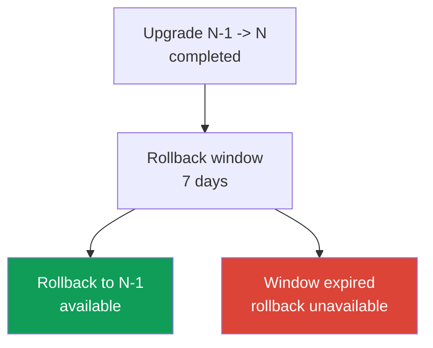
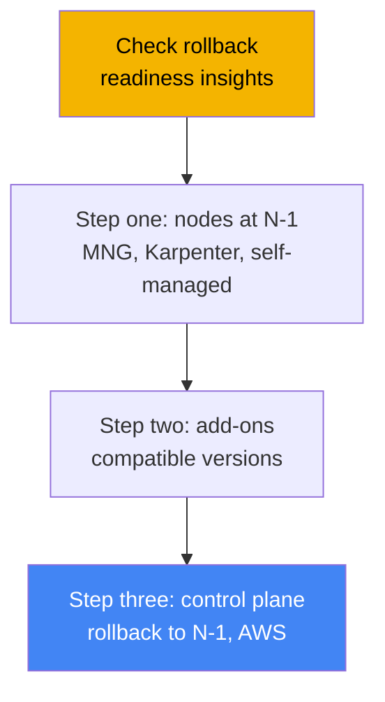
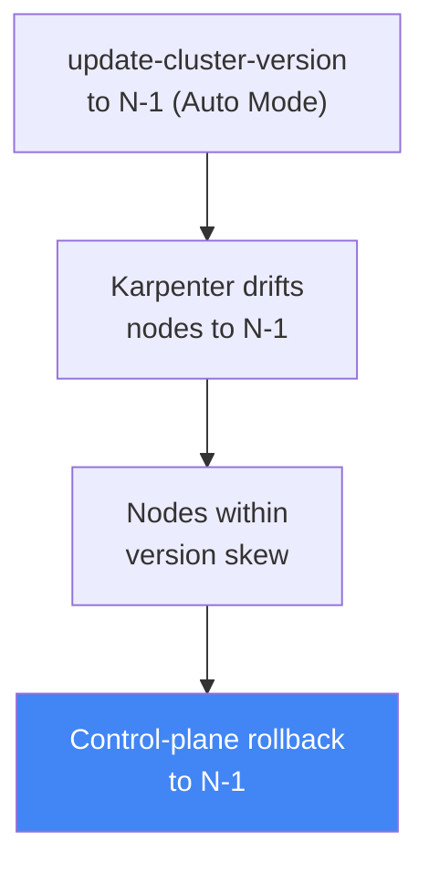

[Русская версия](ru.md) · [Versión en español](es.md) · [Version française](fr.md) · [Deutsche Version](de.md) · [ქართული ვერსია](ge.md) · [繁體中文版](tw.md) · [日本語版](jp.md)
# Chapter 39. Cluster version rollback: rollback readiness insights, the 7-day window, and rollback order

> **What comes next.** Chapter 38 covered cluster upgrades: the version lifecycle, one-minor in-place
> upgrades, deprecated APIs, and blue/green migration. Here is the reverse operation: rolling the
> control plane back to the previous minor version when the upgrade succeeded but something broke
> on the new version. Related subjects belong to other chapters: the upgrade itself and blue/green
> are in Chapter 38, cluster insights in general are in Chapter 38, reliability, PDBs, and graceful
> node shutdown are in Chapter 40, cluster-state backup and recovery are in Chapters 41 and 42,
> and EKS Auto Mode is in Chapter 9.

## 39.1. "We upgraded, things got worse, and there is no way back"

This is a familiar on-call scenario. The cluster was moved to a new minor version strictly following
Chapter 38: insights are clear, add-ons are compatible, and the control plane and nodes are green.
Then, an hour later, it becomes clear that something which insights could not catch does not work on
the new version: a third-party controller crashes because of changed API behavior, a custom operator
does not start, or workloads behave oddly after kube-apiserver defaults change. The upgrade formally
succeeded, but production has degraded.

Historically, this was a trap with no exit. A Kubernetes upgrade is one-way: upstream does not
support downgrading the control-plane minor version. That left the engineer with two difficult paths.
The first was to fix in place: urgently patch controllers and workloads for the new version under
production load. The second was blue/green: switch traffic to a pre-provisioned old cluster. But
blue/green must be prepared before the upgrade, and a normal in-place upgrade has no such cluster -
there is nowhere to roll back to.

EKS closed this gap by adding native cluster version rollback. It returns the control plane to the
previous minor version without recreating the cluster. But it has strict conditions - a window of
only 7 days, one version back, and a set of blockers - and it does not work like an "undo button,"
but rather as a procedure with its own order. Let us examine precisely what is rolled back, what a
rollback does not do, and how to avoid losing it when it is needed.

## 39.2. Why rollback is difficult at all

In upstream Kubernetes, an upgrade is designed as movement in one direction. During an upgrade,
kube-apiserver and etcd move objects to new schemas, and node components (kubelet) follow. The
version skew policy allows kubelet to be older than kube-apiserver, but not newer. Upstream does not
support or test downgrading the control plane: there is no guarantee that objects in etcd can be
correctly "converted back."

Therefore, EKS implemented not a general downgrade but a limited rollback: return **only the control
plane** to **one previous** minor version, within a **narrow window** after the upgrade, while
keeping etcd data and workloads in place. Everything that makes rollback safer than a general
downgrade is precisely the restrictions: a recent upgrade (etcd has not yet accumulated objects from
only the new version), one minor release (a small schema gap), and readiness checks that detect
incompatibilities in advance.



The feature has a straightforward purpose: rollback is a fast exit from a failed upgrade while the
version gap is small and recent. It is not a time machine for the cluster and not a replacement for
backup (the boundary is in Section 39.7).

## 39.3. EKS cluster version rollback: the 7-day window and one version

A rollback returns the control plane to the previous minor version after an in-place upgrade. EKS
rolls back kube-apiserver and control-plane components, as well as the platform version (to the
latest platform version of the previous minor), while preserving etcd data, workloads, and persistent
volumes. The key conditions are checked as prerequisites, and it is important to know them in advance.

| Condition | Requirement |
|---|---|
| 7-day window | The rollback must start within 7 days after the upgrade completes; it is unavailable afterward. |
| In-place upgrade only | A cluster created directly at the current version cannot be rolled back. |
| One minor back | Only N -> N-1; after `1.31`->`1.32`->`1.33`, rollback is possible only to `1.32`. |
| Supported version | The target version must be among EKS-supported versions. |
| Extended support | To roll back to a version in extended support, first change the upgrade policy to `EXTENDED`. |
| Not auto-upgraded from extended support | A cluster automatically upgraded at the end of extended support cannot be rolled back. |
| ACTIVE status | The cluster must be in `ACTIVE` status, with no other update in progress. |
| EKS feature compatibility | If an enabled EKS feature is not supported on the previous version, rollback is rejected. |

There are two subtleties around the auto-upgrade described in Chapter 38. If EKS upgraded the version
itself at the end of **extended support**, rollback is unavailable. If it upgraded itself at the end
of **standard support**, rollback is possible, but you must first change the cluster upgrade policy
to `EXTENDED`. Also, when rolling back from a version in standard support to a version in extended
support, the higher extended-support charges apply again (the cost structure was covered in Chapter 38).

The rollback itself starts with the same command as an upgrade, only using the previous version:

```bash
# roll the control plane back to the previous minor (N-1)
aws eks update-cluster-version --name my-cluster --kubernetes-version 1.30
```

In the response, the update type is `VersionRollback`, rather than a normal upgrade. Track progress
with `describe-update` using the `id` from the response (the "Practice" section).

## 39.4. Rollback readiness insights

You do not need to check rollback eligibility manually: a separate type of cluster insights exists
for this (Chapter 38), **rollback readiness insights**, in the `ROLLBACK_READINESS` category. These
are point-in-time checks that EKS generates **after the upgrade** and keeps available exactly for the
7-day rollback window. Once the window expires, this type of insight is no longer generated for the
cluster. Inspect them immediately after the upgrade, not after something has already broken.

Rollback readiness insights check:

- API usage compatibility across versions, including field-level changes;
- overall cluster health;
- version skew for kubelet and kube-proxy (whether nodes are newer than the target control plane);
- add-on version compatibility with the target version;
- additionally for EKS Auto Mode: NodePool disruption budgets, `do-not-disrupt` annotations, and
  PodDisruptionBudget configuration.

Each insight has a status, and that status determines whether rollback is allowed.

| Status | Meaning | Effect on rollback |
|---|---|---|
| PASSING | No issue found | Rollback is allowed. |
| WARNING | A possible issue; not blocking | Rollback is allowed; this is a warning. |
| ERROR | A blocking issue | Rollback is blocked until fixed (or until `--force` is used). |
| UNKNOWN | The status could not be determined | Rollback is blocked (or `--force` can be used). |

ERROR and UNKNOWN statuses block rollback. Either fix them and refresh the insights, or bypass them
with `--force`. It is important to understand that `--force` **bypasses only insight checks**
(ERROR, WARNING, UNKNOWN), not prerequisites: the 7-day window, "created at the current version,"
one minor version, and EKS feature compatibility cannot be bypassed with `--force`. EKS fully
disclaims responsibility for the consequences of using `--force`: there are no safety guarantees for
a rollback with bypassed checks.

```bash
# rollback readiness insights only
aws eks list-insights --cluster-name my-cluster \
  --filter '{"categories": ["ROLLBACK_READINESS"]}'
# force an insight refresh after a fix; do not wait 24 hours
aws eks start-insights-refresh --cluster-name my-cluster
```

EKS refreshes insights every 24 hours, and automatically runs a refresh before the rollback itself,
so checks run against the current cluster state.

## 39.5. Rollback order: the reverse of an upgrade

The rollback order mirrors the upgrade from Chapter 38. There it was control plane, then add-ons,
then nodes. During rollback, it is the reverse, for the same version skew policy reason: **nodes must
not be newer than the control plane**. If the upgrade already raised nodes to N and we return the
control plane to N-1, the nodes at N will be newer, violating skew. Therefore, nodes at N must be
returned to N-1 **before** the control-plane rollback. That gives us the overall order.



Who returns the nodes depends on the compute type (Chapter 9):

| Node type | Who rolls back | How |
|---|---|---|
| EKS Auto Mode | EKS automatically | Nodes drift to N-1 **before** the control plane, without manual actions. |
| Managed node group | You | Run `update-nodegroup-version` to the previous version before the control-plane rollback. |
| Karpenter | You | Drift: set the desired AMI/version to N-1; Karpenter recreates nodes (Chapter 12). |
| Self-managed / hybrid | You | Change the node AMI/configuration to N-1 yourself before the control-plane rollback. |
| Fargate | Not supported | Fargate cannot be rolled back; delete pods before rollback or use `--force`. |

A nuance from Chapter 9: with **EKS Auto Mode**, nodes roll back **before** the control plane, and
EKS does it. When `update-cluster-version` with version N-1 is called for an Auto Mode cluster, EKS
first drifts nodes to the previous-version AMI through Karpenter (respecting disruption budgets and
PDBs), waits until all nodes are within the allowed version skew, and only then rolls back the
control plane. While nodes are drifting, the cluster remains `ACTIVE`; its status changes to
`UPDATING` only during the control-plane rollback step. The node rollback phase may take from minutes
to 7 days depending on disruption controls.



A separate practical recommendation from AWS best practices: for regular nodes (MNG, self-managed),
it is useful to separate control-plane and node upgrades in time and keep a pause (a bake period).
While nodes remain at N-1 and the control plane is already at N, the kubelet version-skew insight
remains PASSING, and the rollback path remains open without first returning nodes. This is the
cheapest way to keep rollback available: do not rush to upgrade nodes immediately after the control
plane.

## 39.6. What blocks rollback and how to prepare

Blockers fall into two classes. The first is **hard prerequisites**, which nothing can bypass: the
7-day window has expired; the cluster was created directly on the current version (there was no
upgrade); the cluster was already raised another minor version (rollback is only one minor); an
incompatible EKS feature was enabled again at the version boundary; or it was auto-upgraded at the
end of extended support. The second class is **insight blockers** (ERROR/UNKNOWN status), which you
can either fix or bypass with `--force`: incompatible add-on versions, objects using APIs not present
in the old version, version-skew violations, and for Auto Mode, `do-not-disrupt` on a node or a
`nodes: 0` budget.

The most insidious of the "soft" blockers is **objects on new APIs**. If, during the time on the new
version, you create resources through an API that does not yet exist on the old version, rolling back
the control plane will leave those objects without the API that serves them. This leads to the
preparation practice: while the 7-day window is open, **do not rush to adopt APIs and features
available only in the new version**, or you will close the path back yourself. If such objects have
already been created, delete them before rollback.

How to keep rollback available in practice:

- review rollback readiness insights immediately after the upgrade and fix ERRORs while the window is open;
- update add-ons to versions compatible with both the old and new minor releases (cross-compatible);
- do not move nodes to the new version immediately: keep a bake period so the skew insight is PASSING;
- refrain from using objects on new-only APIs during the window;
- remember that insights are point-in-time: changes to the cluster after the check but before the
  rollback completes are not covered by that check.

## 39.7. Rollback is not a backup replacement

Rollback is often confused with restoring from backup, but these are different tools with different
boundaries. Rollback returns the **control-plane version** and its configuration, while etcd data,
workloads, and persistent volumes are **preserved as they are** - they are not rolled back. In other
words, rollback does not undo changes you made to cluster objects or application data after the
upgrade; it merely downgrades kube-apiserver back.

This has two implications. First, rollback will not help if the problem is not the version but that
someone deleted a namespace, corrupted data, or removed resources - backup and state recovery are
needed (Chapters 41 and 42). Second, objects created on the new version and bypassed with `--force`
remain in etcd after rollback and are not collected by garbage collection - they simply "hang" there.
The boundary is simple: **rollback is about the control-plane version within a narrow window; backup
is about data and state**.

## 39.8. How this is used in production

- **Review rollback readiness insights immediately after the upgrade, not after an incident.** While
  the 7-day window is open, fix ERROR insights in advance so the rollback path remains clear.
- **Keep a bake period between the control plane and nodes.** Do not move regular nodes to the new
  version immediately: while they are at N-1, the kubelet skew insight is PASSING and rollback is
  possible without returning nodes.
- **Do not adopt new-only APIs during the window.** Objects on APIs absent from the old version block
  rollback; postpone adapting them until you are confident the upgrade is stable.
- **Keep add-ons on cross-compatible versions.** Add-on versions compatible with both the old and new
  minors keep the add-on compatibility insight clear for rollback (Chapter 37).
- **Check compatibility yourself.** Insights do not cover self-managed add-ons, custom controllers,
  or the application layer - validate their compatibility with the previous version yourself.
- **Remember the order and Auto Mode.** For MNG/self-managed nodes, return nodes before the control
  plane; for Auto Mode, EKS does this automatically before the control-plane rollback.

## 39.9. Mini-glossary

- **cluster version rollback** - rolling the EKS control plane back to the previous minor after an
  in-place upgrade, within a 7-day window, while retaining etcd, workloads, and volumes.
- **rollback window (7 days)** - the period after an upgrade during which rollback is available; once
  it expires, both rollback and its insights are unavailable.
- **rollback readiness insights** - a cluster-insight type in the `ROLLBACK_READINESS` category that
  checks rollback readiness; its statuses are PASSING/WARNING/ERROR/UNKNOWN.
- **VersionRollback** - the update type in the `update-cluster-version` response during rollback.
- **--force** - a flag that bypasses insight checks (ERROR/WARNING/UNKNOWN), but not prerequisites
  (window, one minor, created-at-version, feature compatibility).
- **version skew policy** - the Kubernetes rule that nodes must not be newer than the control plane;
  it dictates rollback order (nodes first, then the control plane).
- **bake period** - a pause between upgrading the control plane and nodes: nodes stay at N-1 and
  rollback remains available without returning them.

## 39.10. Chapter summary

- Kubernetes upgrades are one-way upstream; EKS added a limited control-plane rollback to one
  previous minor version while retaining etcd data, workloads, and persistent volumes.
- Conditions are strict: a 7-day window after upgrade, an in-place-upgraded cluster only, one minor
  back, `ACTIVE` status; a cluster auto-upgraded at the end of extended support cannot be rolled back.
- Rollback readiness insights (`ROLLBACK_READINESS`) check API compatibility down to fields, health,
  version skew, and add-on compatibility; they are available only within the 7-day window.
- ERROR and UNKNOWN statuses block rollback; `--force` bypasses insights but not prerequisites and
  removes EKS safety guarantees.
- Rollback order is the reverse of upgrade: nodes to N-1 first, then add-ons, then the control plane;
  the reason is the version skew policy (nodes must not be newer than the control plane).
- Nodes are returned by type: MNG through `update-nodegroup-version`, Karpenter through drift,
  self-managed by you, and Fargate is unsupported; EKS Auto Mode returns nodes before the control plane.
- Rollback is blocked by an expired window, objects on new-only APIs, incompatible add-ons, skew
  violations, or auto-upgrade from extended support; prepare through early insights, a bake period,
  and caution with new APIs.
- Rollback is not a backup replacement: it returns the control-plane version, not data and state;
  use backup and recovery for state and data (Chapters 41 and 42).

## 39.11. How this helps in real work

On call, rollback changes the cost of an upgrade mistake. Previously, "we upgraded, things got worse"
meant an emergency: fix in place under load or bring up blue/green, which might not exist. Now, the
engineer has a native exit: return the control plane to the previous minor. But that is possible only
if it was prepared in advance. The conclusion is simple: do not "look for" the rollback lever during
an incident; keep it ready throughout the week after an upgrade. This means reviewing rollback
readiness insights immediately after the update, fixing ERRORs while the window is open, not rushing
nodes to the new version, and not adopting new-only APIs until stability is certain.

When planning an upgrade, rollback adds another argument for the "upgrade earlier, not under an
extended-support deadline" approach from Chapter 38: with a native rollback, you can confidently
apply a new minor soon after release, knowing there are 7 days to return if an issue occurs. But the
boundaries must be understood clearly: rollback concerns the control-plane version in a narrow window;
it will not save corrupted data or undo changes in etcd. For that, use a separate line of defense:
backup and recovery (Chapters 41 and 42) and workload reliability through PDBs and multi-AZ
(Chapter 40).

## 39.12. Self-check questions

1. Why does upstream Kubernetes not support downgrading a control-plane minor version, and what does
   EKS roll back instead of performing a general downgrade?
2. How long is the rollback window, and from which event is it measured?
3. How many minor versions back can you roll back, and what happens if you already upgraded another
   minor version after the first upgrade?
4. Which rollback conditions are hard prerequisites that cannot be bypassed with `--force`?
5. Can you roll back a cluster that EKS itself upgraded at the end of extended support? What about at
   the end of standard support?
6. What do rollback readiness insights check, and in which category do they appear?
7. Which insight statuses block rollback, which do not, and precisely what does `--force` bypass?
8. In what order does rollback proceed, and why are nodes returned before the control plane?
9. How does node rollback in EKS Auto Mode differ from a managed node group?
10. What happens to Fargate pods during rollback, and how can this be handled?
11. Why do objects created through new-only APIs interfere with rollback, and how can this be avoided?
12. How does a version rollback differ from restoring a backup, and where is the boundary between them?
13. What is a bake period, and how does it help keep rollback available?

## Practice

The course lab for this topic is [Lab 113 - Cluster upgrade and rollback: control plane, add-ons,
deprecated APIs](../../labs/113/README.MD). In addition, rollback readiness and update history are
easy to inspect on a live cluster. First, check the current version and update history: whether there
was a recent in-place upgrade from which the 7-day window is measured:

```bash
# current control-plane version
aws eks describe-cluster --name my-cluster --query 'cluster.version'
# update history: look for the VersionUpdate type and completion date
aws eks list-updates --name my-cluster
```

Then, if the upgrade was recent, inspect rollback readiness insights and investigate everything marked
ERROR or WARNING:

```bash
# rollback readiness insights only
aws eks list-insights --cluster-name my-cluster \
  --filter '{"categories": ["ROLLBACK_READINESS"]}'
# a specific insight's details: status, recommendation, affected resources
aws eks describe-insight --cluster-name my-cluster --id <insight-id>
```

If you recently fixed blockers, refresh insights manually and make sure ERRORs are gone instead of
waiting for the daily refresh:

```bash
# force a check refresh
aws eks start-insights-refresh --cluster-name my-cluster
# status of a specific update/rollback by its id from list-updates
aws eks describe-update --name my-cluster --update-id <update-id>
```

Compare three things: the completion date of the last upgrade (whether the 7-day window remains), the
rollback readiness insight status, and the version of your nodes relative to the control plane. If
the upgrade is recent, insights are clear, and nodes are no newer than the target minor, the rollback
path is open. If insights are empty and there is no upgrade in history, there is nothing to roll back,
and that is expected. See Chapter 40 for workload reliability during node rotations in a rollback and
Chapters 41 and 42 for state backup.

---
[Table of Contents](../README.md) · [Chapter 38](../38/en.md) · [Chapter 40](../40/en.md)
