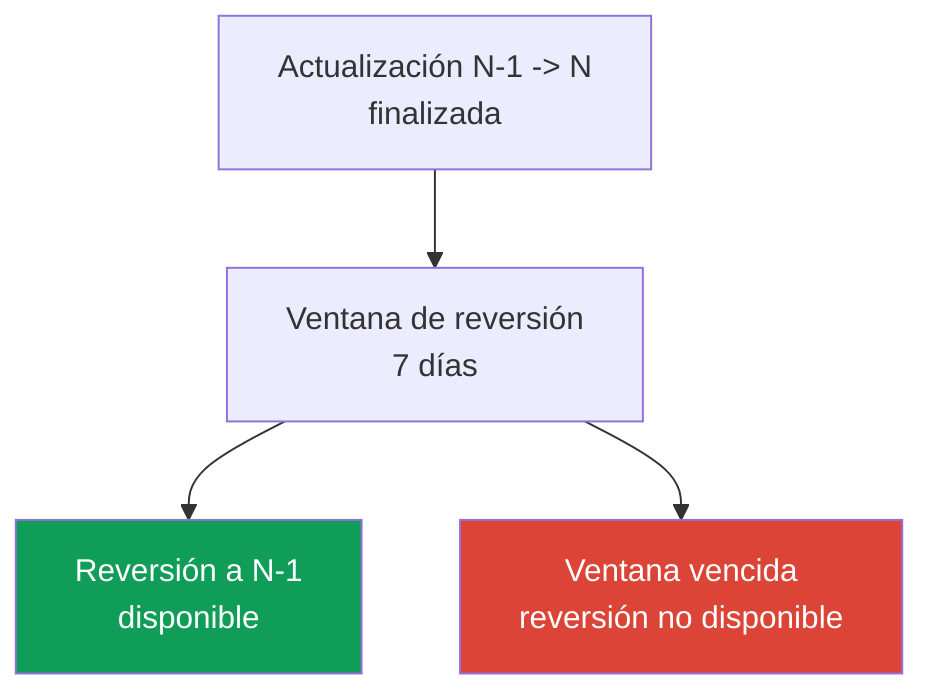
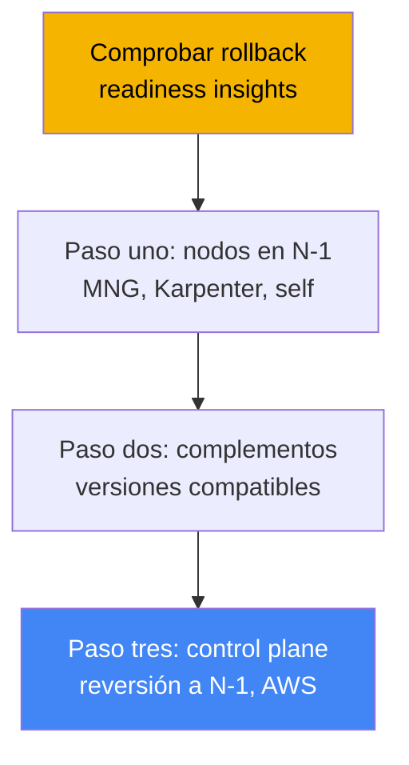
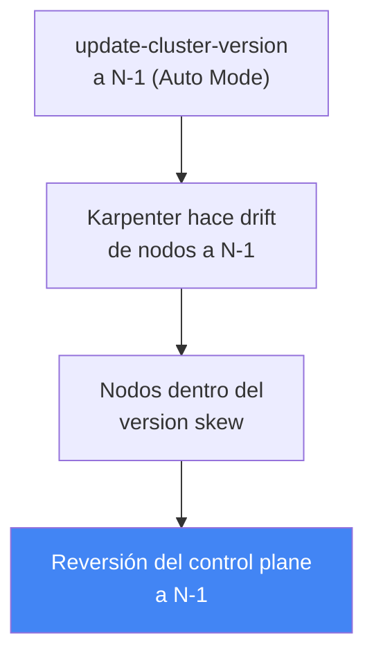

[Русская версия](ru.md) · [Eng version](en.md) · [Version française](fr.md) · [Deutsche Version](de.md) · [ქართული ვერსია](ge.md) · [繁體中文版](tw.md) · [日本語版](jp.md)
# Capítulo 39. Reversión de versión del clúster: rollback readiness insights, ventana de 7 días y orden de reversión

> **Qué sigue.** El capítulo 38 analizó la actualización del clúster: el ciclo de vida de las versiones, la actualización in-place por un minor, las API obsoletas y la migración blue/green. Aquí se trata de la operación inversa: revertir el control plane al minor anterior cuando la actualización finalizó, pero algo se rompió en la nueva versión. Los temas relacionados se delegan a otros capítulos: la propia actualización y blue/green, capítulo 38; cluster insights en general, capítulo 38; fiabilidad, PDB y apagado correcto de nodos, capítulo 40; copia de seguridad y restauración del estado del clúster, capítulos 41 y 42; EKS Auto Mode, capítulo 9.

## 39.1. «Actualizamos, empeoró y no hay vuelta atrás»

El escenario es conocido durante una guardia. El clúster se elevó a un nuevo minor siguiendo estrictamente el proceso del capítulo 38: insights limpios, complementos compatibles, control plane y nodos en verde. Pero una hora después resulta que en la nueva versión no funciona algo que los insights no podían detectar: un controlador de terceros falla por un cambio en el comportamiento de la API, un operador personalizado no inicia, la carga se comporta de forma extraña tras cambiar los valores predeterminados de kube-apiserver. La actualización tuvo éxito formalmente, pero producción se degradó.

Históricamente, esto era una trampa sin salida. La actualización de Kubernetes es unidireccional: upstream no admite reducir la versión minor del control plane. Por tanto, al ingeniero le quedaban dos caminos, y ambos eran difíciles. El primero era corregir en el sitio: parchear urgentemente controladores y cargas para la nueva versión bajo carga de producción. El segundo era blue/green: desviar el tráfico a un clúster antiguo preparado de antemano. Pero blue/green se debe preparar antes de la actualización, y en un in-place habitual no existe, no hay adónde revertir.

EKS cerró esta brecha: apareció una reversión de versión del clúster integrada. Devuelve el control plane al minor anterior sin recrear el clúster. Pero tiene condiciones estrictas: una ventana de solo 7 días, una versión hacia atrás y un conjunto de bloqueadores, y no funciona como un «botón de deshacer», sino como un procedimiento con su propio orden. Veamos exactamente qué se revierte, qué no hace la reversión y cómo no quedarse sin ella en el momento necesario.

## 39.2. Por qué la reversión es compleja

En Kubernetes upstream, la actualización se diseñó como un movimiento en una sola dirección. Al actualizar, kube-apiserver y etcd convierten los objetos a esquemas nuevos, y los componentes de los nodos (kubelet) les siguen. La version skew policy permite que kubelet sea más antiguo que kube-apiserver, pero no más nuevo. Upstream no admite ni prueba la reducción del control plane: no hay garantías de que los objetos de etcd se «conviertan de vuelta» correctamente.

Por eso EKS no implementó un downgrade general, sino una reversión limitada: devolver **solo el control plane** a **un minor anterior**, dentro de una **ventana estrecha** posterior a la actualización, conservando los datos de etcd y las cargas en su lugar. Todo lo que hace la reversión más segura que un downgrade general son precisamente las restricciones: una actualización reciente (etcd todavía no se ha «llenado» de objetos exclusivos de la versión nueva), un minor (una pequeña diferencia de esquemas) y comprobaciones de preparación que detectan incompatibilidades de antemano.



El propósito de la función es directo: la reversión es una salida rápida de una actualización fallida mientras la diferencia de versiones es pequeña y reciente. No es una máquina del tiempo para el clúster ni un sustituto de la copia de seguridad (el límite se explica en la sección 39.7).

## 39.3. EKS cluster version rollback: ventana de 7 días y una versión

La reversión devuelve el control plane al minor anterior después de una actualización in-place. EKS revierte kube-apiserver y los componentes del control plane, así como la platform version (a la última platform version del minor anterior), conservando los datos de etcd, las cargas y los volúmenes persistentes. Las condiciones clave se comprueban como requisitos previos, y es importante conocerlas con antelación.

| Condición | Requisito |
|---|---|
| Ventana de 7 días | la reversión debe iniciarse dentro de los 7 días posteriores a la finalización de la actualización; después deja de estar disponible |
| Solo actualización in-place | no se puede revertir un clúster creado directamente en la versión actual |
| Un minor hacia atrás | solo N -> N-1; tras `1.31`->`1.32`->`1.33`, solo se puede revertir a `1.32` |
| Versión compatible | la versión objetivo debe estar entre las versiones de EKS compatibles |
| Extended support | para revertir a una versión en extended support, primero cambie la upgrade policy a `EXTENDED` |
| Sin auto-upgrade desde extended | no se puede revertir un clúster actualizado automáticamente al final de extended support |
| Estado ACTIVE | el clúster debe estar en estado `ACTIVE`, sin otra actualización en curso |
| Compatibilidad de funciones de EKS | la reversión se rechaza si una función de EKS habilitada no es compatible con la versión anterior |

Hay dos detalles sutiles sobre el auto-upgrade del capítulo 38. Si EKS elevó la versión por sí mismo al final de **extended support**, la reversión no está disponible. Si la elevó por sí mismo al final de **standard support**, se puede revertir, pero antes hay que cambiar la upgrade policy del clúster a `EXTENDED`. Además, al revertir desde una versión en standard support a una versión en extended support, vuelven a aplicarse las tarifas superiores de extended support (la estructura de costes se analizó en el capítulo 38).

La propia reversión se inicia con el mismo comando que la actualización, solo que con la versión anterior:

```bash
# revertir el control plane al minor anterior (N-1)
aws eks update-cluster-version --name my-cluster --kubernetes-version 1.30
```

En la respuesta, el tipo de actualización es `VersionRollback`, no una actualización normal. El progreso se consulta mediante `describe-update` con el `id` de la respuesta (sección «Práctica»).

## 39.4. Rollback readiness insights

No es necesario comprobar manualmente si una reversión es posible: existe un tipo separado de cluster insights (capítulo 38), los **rollback readiness insights**, en la categoría `ROLLBACK_READINESS`. Son comprobaciones puntuales (point-in-time) que EKS genera **después de la actualización** y mantiene disponibles exactamente durante la ventana de reversión de 7 días. Cuando vence la ventana, ya no se generan insights de este tipo para el clúster. Deben consultarse inmediatamente después de la actualización, no cuando algo ya se haya roto.

Qué comprueban los rollback readiness insights:

- compatibilidad del uso de API entre versiones, incluidos cambios a nivel de campos;
- salud general del clúster;
- version skew para kubelet y kube-proxy (que los nodos no sean más nuevos que el control plane objetivo);
- compatibilidad de las versiones de los complementos con la versión objetivo;
- para EKS Auto Mode, además: NodePool disruption budgets, anotaciones `do-not-disrupt` y configuración de PodDisruptionBudget.

Cada insight tiene un estado, y de él depende que se permita la reversión.

| Estado | Significado | Efecto en la reversión |
|---|---|---|
| PASSING | no se encontraron problemas | reversión permitida |
| WARNING | posible problema, no bloquea | reversión permitida; es una advertencia |
| ERROR | problema bloqueante | reversión bloqueada hasta corregirlo (o usar `--force`) |
| UNKNOWN | no se pudo determinar el estado | reversión bloqueada (o usar `--force`) |

Los estados ERROR y UNKNOWN bloquean la reversión. Se corrigen y se actualizan los insights, o se omiten con `--force`. Es importante comprender que `--force` **solo omite las comprobaciones de insights** (ERROR, WARNING, UNKNOWN), no los requisitos previos: la ventana de 7 días, «creado en la versión actual», un minor y la compatibilidad de funciones de EKS no se pueden omitir con `--force`. EKS no asume ninguna responsabilidad por las consecuencias de usar `--force`: no hay garantías de seguridad para una reversión con comprobaciones omitidas.

```bash
# solo rollback readiness insights
aws eks list-insights --cluster-name my-cluster \
  --filter '{"categories": ["ROLLBACK_READINESS"]}'
# actualizar forzosamente los insights tras corregir, sin esperar 24 horas
aws eks start-insights-refresh --cluster-name my-cluster
```

EKS actualiza los insights cada 24 horas y, antes de la reversión propiamente dicha, ejecuta automáticamente un refresh para que las comprobaciones se realicen contra el estado reciente del clúster.

## 39.5. Orden de reversión: inverso a la actualización

El orden de reversión refleja la actualización del capítulo 38. Allí fue: control plane, luego complementos, luego nodos. En la reversión es al revés, y el motivo es la misma version skew policy: **los nodos no deben ser más nuevos que el control plane**. Si la actualización ya elevó los nodos a N y devolvemos el control plane a N-1, los nodos en N serán más nuevos, una infracción de skew. Por tanto, hay que devolver los nodos de N a N-1 **antes** de revertir el control plane. De ahí el orden general.



Quién devuelve los nodos depende del tipo de cómputo (capítulo 9):

| Tipo de nodos | Quién revierte | Cómo |
|---|---|---|
| EKS Auto Mode | EKS automáticamente | los nodos hacen drift a N-1 **antes** del control plane, sin acciones manuales |
| Managed node group | usted | `update-nodegroup-version` a la versión anterior antes de revertir el control plane |
| Karpenter | usted | drift: AMI/versión deseada en N-1; Karpenter recrea los nodos (capítulo 12) |
| Self-managed / hybrid | usted | cambie usted mismo la AMI/configuración de los nodos a N-1 antes de revertir el control plane |
| Fargate | no compatible | no se puede revertir Fargate; elimine los pods antes de la reversión o use `--force` |

El matiz del capítulo 9: en **EKS Auto Mode**, los nodos se revierten **antes** del control plane y EKS lo hace. Al invocar `update-cluster-version` con la versión N-1 en un clúster Auto Mode, EKS primero hace que los nodos hagan drift a la AMI de la versión anterior mediante Karpenter (respetando disruption budgets y PDB), espera a que todos los nodos entren en el version skew permitido y solo después revierte el control plane. Mientras los nodos hacen drift, el clúster permanece `ACTIVE`, y el estado cambia a `UPDATING` solo en el paso de reversión del control plane. La fase de reversión de nodos puede tardar desde minutos hasta 7 días según los disruption controls.



Un consejo práctico adicional de las best practices de AWS: para nodos habituales (MNG, self-managed), es útil separar en el tiempo la actualización del control plane y los nodos, y mantener una pausa (bake period). Mientras los nodos estén en N-1 y el control plane ya en N, el insight de kubelet version skew sigue siendo PASSING, y la ruta de reversión permanece abierta sin devolver previamente los nodos. Esta es la forma más económica de mantener disponible la reversión: no apresurarse a actualizar los nodos después del control plane.

## 39.6. Qué bloquea la reversión y cómo prepararse

Los bloqueadores se dividen en dos clases. La primera son los **requisitos previos estrictos**, que no se pueden omitir de ninguna manera: venció la ventana de 7 días; el clúster se creó directamente en la versión actual (no hubo actualización); el clúster ya se elevó otro minor más (la reversión es solo un minor); se habilitó de nuevo una función de EKS incompatible en el límite de versión; auto-upgrade al final de extended support. La segunda clase son los **bloqueadores de insights** (estado ERROR/UNKNOWN), que se pueden corregir u omitir con `--force`: versiones incompatibles de complementos, objetos en API que no existen en la versión anterior, infracciones de version skew y, para Auto Mode, `do-not-disrupt` en un nodo o el presupuesto `nodes: 0`.

El más insidioso de los bloqueadores «suaves» son los **objetos en API nuevas**. Si durante la vida en la nueva versión creó recursos mediante una API que todavía no existe en la versión antigua, la reversión del control plane dejará esos objetos sin la API que los atiende. De aquí surge la práctica de preparación: mientras dure la ventana de 7 días, **no se apresure a adoptar API y funciones disponibles solo en la nueva versión**, pues de otro modo usted mismo cerrará el camino de vuelta. Si esos objetos ya se crearon, se eliminan antes de la reversión.

Cómo mantener disponible la reversión en la práctica:

- consultar los rollback readiness insights inmediatamente después de la actualización y corregir ERROR mientras la ventana esté abierta;
- actualizar los complementos a versiones compatibles tanto con el minor antiguo como con el nuevo (cross-compatible);
- no llevar los nodos a la nueva versión inmediatamente: mantener un bake period para que el skew-insight sea PASSING;
- abstenerse de objetos en API exclusivas de la nueva versión durante la ventana;
- recordar que los insights son puntuales: los cambios en el clúster tras la comprobación, pero antes de finalizar la reversión, no quedan cubiertos por ella.

## 39.7. La reversión no sustituye la copia de seguridad

La reversión se confunde con la restauración desde una copia de seguridad, pero son herramientas distintas con límites diferentes. La reversión devuelve la **versión del control plane** y su configuración, pero los datos de etcd, las cargas y los volúmenes persistentes se **conservan tal como están**, no se revierten. Es decir, la reversión no deshace cambios que haya realizado en objetos del clúster ni datos de aplicaciones después de la actualización; solo reduce otra vez la versión de kube-apiserver.

De ello se derivan dos consecuencias. Primera: la reversión no ayudará si el problema no está en la versión, sino en que alguien eliminó un namespace, corrompió datos o borró recursos; se necesita una copia de seguridad y restauración del estado (capítulos 41 y 42). Segunda: los objetos creados en la nueva versión y omitidos con `--force` permanecen en etcd después de la reversión y el recolector de basura no los recoge; simplemente quedan «colgados». El límite es simple: **la reversión trata de la versión del control plane en una ventana estrecha; la copia de seguridad, de los datos y el estado**.

## 39.8. Cómo se aplica en producción

- **Se consultan los rollback readiness insights inmediatamente después de la actualización, no tras un incidente.** Mientras esté abierta la ventana de 7 días, se corrigen los insights ERROR de antemano para que la ruta de reversión permanezca limpia.
- **Se mantiene un bake period entre el control plane y los nodos.** Los nodos habituales no se llevan a la nueva versión de inmediato: mientras estén en N-1, el kubelet skew-insight es PASSING y la reversión es posible sin devolver los nodos.
- **No se adoptan API exclusivas de la nueva versión dentro de la ventana.** Los objetos en API que no existen en la versión antigua bloquean la reversión; su adaptación se pospone hasta estar seguros de la estabilidad de la actualización.
- **Los complementos se mantienen en versiones cross-compatible.** Las versiones de complementos compatibles tanto con el minor antiguo como con el nuevo mantienen limpio el add-on compatibility insight para la reversión (capítulo 37).
- **La compatibilidad se comprueba por cuenta propia.** Los insights no cubren complementos self-managed, controladores personalizados ni la capa de aplicación; su compatibilidad con la versión anterior debe validarse por cuenta propia.
- **Se recuerda el orden y Auto Mode.** Para MNG/self-managed, los nodos se devuelven antes que el control plane; para Auto Mode, EKS lo hace automáticamente antes de revertir el control plane.

## 39.9. Mini glosario

- **cluster version rollback**: reversión del control plane de EKS al minor anterior después de una actualización in-place, dentro de una ventana de 7 días y conservando etcd, cargas y volúmenes.
- **ventana de reversión (7 días)**: período posterior a la actualización durante el cual la reversión está disponible; al expirar, la reversión y sus insights dejan de estar disponibles.
- **rollback readiness insights**: tipo de cluster insights de la categoría `ROLLBACK_READINESS` que comprueba la preparación para la reversión; estados PASSING/WARNING/ERROR/UNKNOWN.
- **VersionRollback**: tipo de actualización en la respuesta de `update-cluster-version` al revertir.
- **--force**: indicador que omite las comprobaciones de insights (ERROR/WARNING/UNKNOWN), pero no los requisitos previos (ventana, un minor, creado-en-la-versión, compatibilidad de funciones).
- **version skew policy**: regla de Kubernetes: los nodos no deben ser más nuevos que el control plane; determina el orden de reversión (primero nodos, después control plane).
- **bake period**: pausa entre la actualización del control plane y los nodos: los nodos permanecen en N-1 y la reversión está disponible sin devolverlos.

## 39.10. Resumen del capítulo

- La actualización de Kubernetes es unidireccional en upstream; EKS añadió una reversión limitada del control plane a un minor anterior, conservando datos de etcd, cargas y volúmenes persistentes.
- Las condiciones son estrictas: ventana de 7 días tras la actualización, solo un clúster actualizado in-place, un minor hacia atrás, estado ACTIVE; no se puede revertir un auto-upgraded al final de extended support.
- Los rollback readiness insights (`ROLLBACK_READINESS`) comprueban la compatibilidad de API hasta los campos, salud, version skew y compatibilidad de complementos; solo están disponibles dentro de la ventana de 7 días.
- Los estados ERROR y UNKNOWN bloquean la reversión; `--force` omite insights, pero no requisitos previos, y elimina las garantías de seguridad de EKS.
- El orden de reversión es inverso a la actualización: primero nodos en N-1, luego complementos, luego control plane; el motivo es la version skew policy (los nodos no son más nuevos que el control plane).
- Los nodos se devuelven según el tipo: MNG mediante `update-nodegroup-version`, Karpenter mediante drift, self-managed manualmente; Fargate no es compatible; EKS Auto Mode revierte los nodos antes que el control plane.
- Bloquean la reversión: una ventana vencida, objetos en API exclusivas de la nueva versión, complementos incompatibles, infracciones de skew, auto-upgrade desde extended; la preparación incluye insights tempranos, bake period y precaución con API nuevas.
- La reversión no sustituye una copia de seguridad: devuelve la versión del control plane, pero no los datos ni el estado; para estado y datos se requiere copia de seguridad y restauración (capítulos 41 y 42).

## 39.11. Cómo ayuda en el trabajo real

Durante una guardia, la reversión cambia el coste de un error de actualización. Antes, «actualizamos y empeoró» significaba una emergencia: corregir en el sitio bajo carga o levantar blue/green, que quizá ni existía. Ahora el ingeniero tiene una salida integrada, devolver el control plane al minor anterior, pero solo si se ocupó de ello con antelación. La conclusión es simple: no hay que «buscar la palanca de reversión en el momento del incidente», sino mantenerla preparada toda la semana posterior a la actualización. Esto significa consultar los rollback readiness insights inmediatamente después de actualizar, corregir ERROR mientras la ventana esté abierta, no llevar los nodos a la nueva versión y no adoptar API exclusivas de la nueva versión hasta estar seguros de la estabilidad.

Al planificar una actualización, la reversión añade otro argumento a favor de «actualizar antes y no bajo el plazo de extended support» del capítulo 38: con una reversión integrada se puede aplicar con confianza un nuevo minor poco después del lanzamiento, sabiendo que, si hay un problema, hay 7 días para volver. Pero los límites deben entenderse con claridad: la reversión trata de la versión del control plane en una ventana estrecha, no salva de la corrupción de datos ni deshace cambios en etcd. Para ello existe otra línea de defensa: copia de seguridad y restauración (capítulos 41 y 42), y fiabilidad de las cargas mediante PDB y multi-AZ (capítulo 40).

## 39.12. Preguntas de autoevaluación

1. ¿Por qué upstream Kubernetes no admite reducir la versión minor del control plane y qué revierte exactamente EKS en lugar de un downgrade general?
2. ¿Cuánto dura la ventana de reversión y desde qué evento se cuenta?
3. ¿Cuántas versiones minor se puede retroceder y qué ocurre si, después de actualizar, se logró subir otro minor más?
4. ¿Qué condiciones de reversión son requisitos previos estrictos que no se pueden omitir con `--force`?
5. ¿Se puede revertir un clúster que EKS elevó por sí mismo al final de extended support? ¿Y al final de standard support?
6. ¿Qué comprueban los rollback readiness insights y en qué categoría aparecen?
7. ¿Qué estados de insight bloquean la reversión, cuáles no, y qué omite exactamente el indicador `--force`?
8. ¿En qué orden se realiza la reversión y por qué se devuelven los nodos antes que el control plane?
9. ¿En qué se diferencia la reversión de nodos de EKS Auto Mode de managed node group?
10. ¿Qué ocurre con los pods de Fargate durante la reversión y cómo se evita?
11. ¿Por qué los objetos creados en API exclusivas de la nueva versión dificultan la reversión y cómo se evita?
12. ¿En qué se diferencia una reversión de versión de una restauración desde copia de seguridad y dónde está el límite entre ambas?
13. ¿Qué es un bake period y cómo ayuda a mantener disponible la reversión?

## Práctica

El laboratorio del curso para este tema: [laboratorio 113: Actualización y reversión del clúster: control plane, complementos, API obsoletas](../../labs/113/README_ES.MD). Además, es fácil consultar la preparación para la reversión y el historial de actualizaciones en un clúster activo. Primero consulte la versión actual y el historial de actualizaciones: si hubo una actualización in-place reciente desde la que se cuenta la ventana de 7 días:

```bash
# versión actual del control plane
aws eks describe-cluster --name my-cluster --query 'cluster.version'
# historial de actualizaciones: busque el tipo VersionUpdate y la fecha de finalización
aws eks list-updates --name my-cluster
```

Luego, si la actualización fue reciente, consulte los rollback readiness insights y examine todo lo marcado como ERROR o WARNING:

```bash
# solo rollback readiness insights
aws eks list-insights --cluster-name my-cluster \
  --filter '{"categories": ["ROLLBACK_READINESS"]}'
# detalles de un insight concreto: estado, recomendación, recursos afectados
aws eks describe-insight --cluster-name my-cluster --id <insight-id>
```

Si corrigió bloqueadores recientemente, actualice manualmente los insights y asegúrese de que los ERROR hayan desaparecido, sin esperar al refresh diario:

```bash
# refresh forzado de las comprobaciones
aws eks start-insights-refresh --cluster-name my-cluster
# estado de una actualización/reversión concreta por id de list-updates
aws eks describe-update --name my-cluster --update-id <update-id>
```

Compare tres cosas: la fecha de finalización de la última actualización (si queda la ventana de 7 días), el estado de los rollback readiness insights y la versión en que están sus nodos con respecto al control plane. Si la actualización es reciente, los insights están limpios y los nodos no son más nuevos que el minor objetivo, la ruta de reversión está abierta. Si los insights están vacíos y no hay actualización en el historial, no hay nada que revertir, y es lo esperado. Consulte el capítulo 40 sobre la fiabilidad de las cargas al volver a desplegar nodos durante una reversión, y los capítulos 41 y 42 sobre la copia de seguridad del estado.

---
[Índice](../README_ES.md) · [Capítulo 38](../38/es.md) · [Capítulo 40](../40/es.md)
