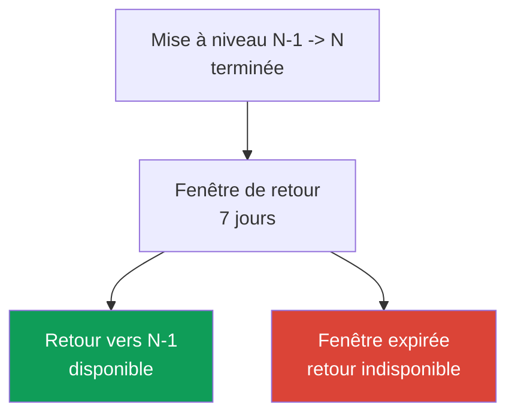
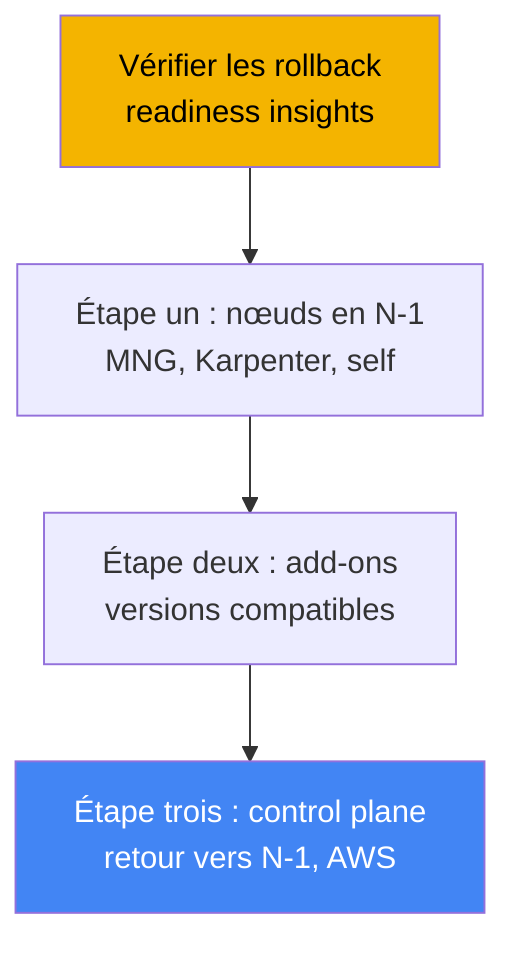
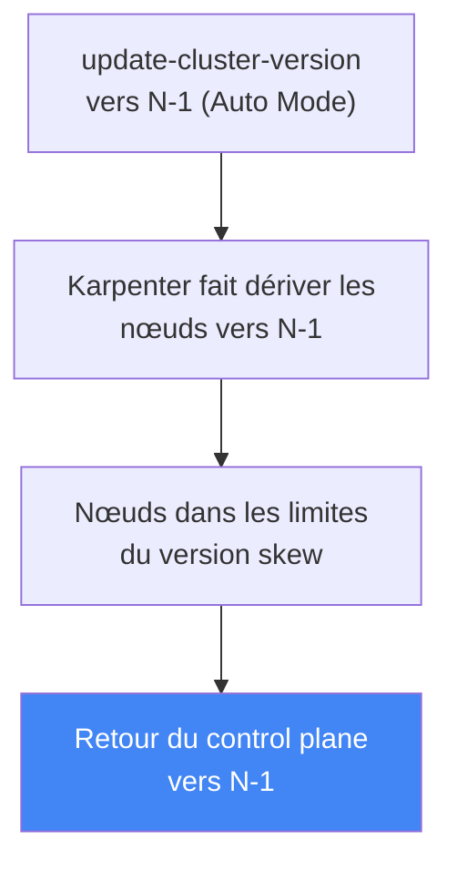

[Русская версия](ru.md) · [Eng version](en.md) · [Versión en español](es.md) · [Deutsche Version](de.md) · [ქართული ვერსია](ge.md) · [繁體中文版](tw.md) · [日本語版](jp.md)
# Chapitre 39. Retour de version du cluster : rollback readiness insights, fenêtre de 7 jours, ordre du retour

> **La suite.** Le chapitre 38 a traité de la mise à niveau du cluster : cycle de vie des versions,
> mise à niveau in-place d'une version mineure à la fois, API obsolètes et migration blue/green.
> Voici l'opération inverse : le retour du control plane à la version mineure précédente lorsqu'une
> mise à niveau a réussi, mais que quelque chose a cessé de fonctionner sur la nouvelle version.
> Les sujets connexes sont traités dans d'autres chapitres : la mise à niveau elle-même et le
> blue/green au chapitre 38, les cluster insights en général au chapitre 38, la fiabilité, les PDB
> et l'arrêt correct des nœuds au chapitre 40, la sauvegarde et la restauration de l'état du
> cluster aux chapitres 41 et 42, et EKS Auto Mode au chapitre 9.

## 39.1. « Nous avons mis à niveau, c'est pire, et il n'y a pas de retour en arrière »

Le scénario est familier à toute personne d'astreinte. Le cluster a été monté vers une nouvelle
version mineure en suivant rigoureusement le processus du chapitre 38 : insights sans problème,
add-ons compatibles, control plane et nœuds au vert. Puis, une heure plus tard, on découvre que
la nouvelle version ne fait pas fonctionner ce que les insights ne pouvaient pas détecter : un
contrôleur tiers échoue à cause d'un changement de comportement de l'API, un opérateur
personnalisé ne démarre pas, la charge se comporte étrangement après la modification des valeurs
par défaut de kube-apiserver. La mise à niveau est formellement réussie, mais la production se
dégrade.

Historiquement, c'était un piège sans issue. La mise à niveau de Kubernetes est à sens unique :
l'amont ne prend pas en charge la rétrogradation de la version mineure du control plane.
L'ingénieur n'avait donc que deux options, toutes deux difficiles. La première consistait à
corriger sur place : patcher d'urgence les contrôleurs et les charges pour la nouvelle version,
sous la charge de production. La seconde était le blue/green : basculer le trafic vers un ancien
cluster préparé à l'avance. Mais il faut préparer le blue/green avant la mise à niveau, et une
mise à niveau in-place ordinaire n'en offre pas, donc il n'y a nulle part où revenir.

EKS a comblé cette lacune : un retour de version natif du cluster est désormais disponible. Il
ramène le control plane à la version mineure précédente sans recréer le cluster. Il impose
cependant des conditions strictes : une fenêtre de seulement 7 jours, un unique retour de version
et un ensemble de bloqueurs. Il ne fonctionne pas comme un « bouton Annuler », mais comme une
procédure ayant son propre ordre. Voyons exactement ce qui est ramené à la version précédente, ce
que le retour ne fait pas, et comment ne pas s'en priver au moment nécessaire.

## 39.2. Pourquoi un retour de version est difficile

Dans Kubernetes en amont, une mise à niveau est conçue comme un mouvement à sens unique. Lors de
la mise à niveau, kube-apiserver et etcd convertissent les objets vers de nouveaux schémas, puis
les composants des nœuds (kubelet) suivent. La version skew policy permet à kubelet d'être plus
ancien que kube-apiserver, mais pas plus récent. L'amont ne prend ni en charge ni ne teste le
retour du control plane à une version antérieure : rien ne garantit que les objets dans etcd
puissent être correctement « reconvertis ».

C'est pourquoi EKS n'a pas implémenté une rétrogradation générale, mais un retour limité : ramener
**uniquement le control plane** d'**une seule version mineure** précédente, dans une **fenêtre
étroite** après la mise à niveau, en conservant les données etcd et les charges en place. Tout ce
qui rend le retour plus sûr qu'une rétrogradation générale est précisément dû aux restrictions :
une mise à niveau récente (etcd n'a pas encore « accumulé » d'objets propres à la nouvelle
version), une seule version mineure (un faible écart de schéma) et des contrôles de préparation
qui détectent les incompatibilités à l'avance.



L'objectif de cette fonctionnalité est simple : le retour est une sortie rapide après une mise à
niveau ratée, tant que l'écart entre versions reste faible et récent. Ce n'est ni une machine à
remonter le temps pour le cluster, ni un remplacement de la sauvegarde (la limite est expliquée à
la section 39.7).

## 39.3. EKS cluster version rollback : fenêtre de 7 jours et une version

Le retour ramène le control plane à la version mineure précédente après une mise à niveau
in-place. EKS ramène kube-apiserver, les composants du control plane et la platform version (à la
dernière platform version de la version mineure précédente), tout en conservant les données etcd,
les charges et les volumes persistants. Les principales conditions sont vérifiées comme des
prérequis, et il importe de les connaître à l'avance.

| Condition | Exigence |
|---|---|
| Fenêtre de 7 jours | le retour doit être lancé dans les 7 jours suivant la fin de la mise à niveau, puis il n'est plus disponible |
| Mise à niveau in-place uniquement | un cluster créé directement sur la version actuelle ne peut pas être ramené à une version antérieure |
| Une version mineure en arrière | uniquement N -> N-1 ; après `1.31`->`1.32`->`1.33`, un retour n'est possible que vers `1.32` |
| Version prise en charge | la version cible doit faire partie des versions EKS prises en charge |
| Extended support | pour revenir à une version en extended support, il faut d'abord changer l'upgrade policy en `EXTENDED` |
| Pas d'auto-upgrade depuis extended | un cluster automatiquement mis à niveau à la fin de l'extended support ne peut pas revenir en arrière |
| Statut ACTIVE | le cluster doit avoir le statut `ACTIVE`, sans autre mise à jour en cours |
| Compatibilité des fonctionnalités EKS | si une fonctionnalité EKS activée n'est pas prise en charge par la version précédente, le retour est refusé |

Deux subtilités concernant l'auto-upgrade du chapitre 38. Si EKS a lui-même monté la version à la
fin de l'**extended support**, le retour est indisponible. S'il l'a fait à la fin du **standard
support**, le retour est possible, mais il faut d'abord passer l'upgrade policy du cluster à
`EXTENDED`. De plus, lors d'un retour d'une version en standard support vers une version en
extended support, les tarifs majorés de l'extended support s'appliquent de nouveau (la structure
des coûts a été traitée au chapitre 38).

Le retour lui-même est lancé avec la même commande que la mise à niveau, mais en indiquant la
version précédente :

```bash
# retour du control plane vers la version mineure précédente (N-1)
aws eks update-cluster-version --name my-cluster --kubernetes-version 1.30
```

Dans la réponse, le type de mise à jour est `VersionRollback`, et non une mise à niveau ordinaire.
La progression se consulte via `describe-update` avec l'`id` de la réponse (section « Practice »).

## 39.4. Rollback readiness insights

Il n'est pas nécessaire de vérifier manuellement si un retour est possible : il existe pour cela
un type distinct de cluster insights (chapitre 38), les **rollback readiness insights**, dans la
catégorie `ROLLBACK_READINESS`. Il s'agit de contrôles ponctuels (point-in-time) qu'EKS produit
**après la mise à niveau** et conserve exactement pendant la fenêtre de retour de 7 jours. Une
fois la fenêtre expirée, aucun insight de ce type n'est plus généré pour le cluster. Il faut les
consulter immédiatement après la mise à niveau, et non lorsqu'un incident s'est déjà produit.

Ce que contrôlent les rollback readiness insights :

- la compatibilité de l'utilisation des API entre les versions, jusqu'aux changements au niveau
  des champs ;
- l'état de santé général du cluster ;
- le version skew de kubelet et de kube-proxy (les nœuds ne sont-ils pas plus récents que le
  control plane cible ?) ;
- la compatibilité des versions d'add-ons avec la version cible ;
- pour EKS Auto Mode en plus : les NodePool disruption budgets, les annotations `do-not-disrupt`
  et la configuration de PodDisruptionBudget.

Chaque insight possède un statut, dont dépend l'autorisation du retour.

| Statut | Signification | Effet sur le retour |
|---|---|---|
| PASSING | aucun problème détecté | retour autorisé |
| WARNING | problème possible, non bloquant | retour autorisé, c'est un avertissement |
| ERROR | problème bloquant | retour bloqué jusqu'à correction (ou `--force`) |
| UNKNOWN | statut impossible à déterminer | retour bloqué (ou `--force`) |

Les statuts ERROR et UNKNOWN bloquent le retour. Il faut soit les corriger et actualiser les
insights, soit les contourner avec `--force`. Il importe de comprendre que `--force` **ne
contourne que les contrôles des insights** (ERROR, WARNING, UNKNOWN), et non les prérequis :
fenêtre de 7 jours, « créé sur la version actuelle », une version mineure et compatibilité des
fonctionnalités EKS ne peuvent pas être contournés avec `--force`. EKS décline entièrement toute
responsabilité des conséquences de `--force` : aucune garantie de sécurité du retour n'existe
lorsque les contrôles ont été contournés.

```bash
# uniquement les rollback readiness insights
aws eks list-insights --cluster-name my-cluster \
  --filter '{"categories": ["ROLLBACK_READINESS"]}'
# actualiser les insights de force après correction, sans attendre 24 heures
aws eks start-insights-refresh --cluster-name my-cluster
```

EKS actualise les insights toutes les 24 heures et lance automatiquement une actualisation avant
le retour lui-même, afin que les contrôles portent sur l'état le plus récent du cluster.

## 39.5. Ordre du retour : l'inverse de la mise à niveau

L'ordre du retour reflète celui de la mise à niveau du chapitre 38. Là, l'ordre était : control
plane, puis add-ons, puis nœuds. Pour le retour, c'est l'inverse, pour la même raison, la version
skew policy : **les nœuds ne doivent pas être plus récents que le control plane**. Si la mise à
niveau a déjà fait passer les nœuds à N, puis que le control plane revient à N-1, les nœuds en N
seront plus récents, ce qui enfreint le skew. Les nœuds en N doivent donc revenir à N-1 **avant**
le retour du control plane. D'où l'ordre général.



La personne ou le mécanisme qui ramène les nœuds dépend du type de calcul (chapitre 9) :

| Type de nœud | Responsable du retour | Comment |
|---|---|---|
| EKS Auto Mode | EKS automatiquement | les nœuds dérivent vers N-1 **avant** le control plane, sans action manuelle |
| Managed node group | vous | `update-nodegroup-version` vers la version précédente avant le retour du control plane |
| Karpenter | vous | drift : AMI/version souhaitée en N-1, Karpenter recrée les nœuds (chapitre 12) |
| Self-managed / hybrid | vous | vous modifiez vous-même l'AMI/la configuration des nœuds vers N-1 avant le retour du control plane |
| Fargate | non pris en charge | le retour de Fargate est impossible ; supprimer les pods avant le retour ou utiliser `--force` |

Nuance du chapitre 9 : avec **EKS Auto Mode**, les nœuds reviennent en arrière **avant** le
control plane, et c'est EKS qui s'en charge. Lors de l'appel à `update-cluster-version` avec la
version N-1 pour un cluster Auto Mode, EKS fait d'abord dériver les nœuds vers l'AMI de la version
précédente via Karpenter (en respectant les disruption budgets et les PDB), attend que tous les
nœuds respectent le version skew autorisé, puis ramène le control plane à une version antérieure.
Pendant que les nœuds dérivent, le cluster reste `ACTIVE`, et son statut ne passe à `UPDATING`
qu'à l'étape du retour du control plane. La phase de retour des nœuds peut prendre de quelques
minutes à 7 jours selon les contrôles de disruption.



Un conseil pratique distinct des bonnes pratiques AWS : pour les nœuds ordinaires (MNG,
self-managed), il est utile de séparer dans le temps la mise à niveau du control plane de celle
des nœuds et de conserver une pause (bake period). Tant que les nœuds restent en N-1 alors que le
control plane est déjà en N, l'insight de kubelet version skew reste PASSING, et le chemin du
retour reste ouvert sans retour préalable des nœuds. C'est le moyen le moins coûteux de conserver
le retour disponible : ne pas se précipiter pour mettre à niveau les nœuds après le control plane.

## 39.6. Ce qui bloque le retour et comment se préparer

Les bloqueurs se répartissent en deux classes. La première est constituée des **prérequis stricts**
qui ne peuvent être contournés par rien : la fenêtre de 7 jours a expiré ; le cluster a été créé
directement sur la version actuelle (il n'y a pas eu de mise à niveau) ; le cluster a déjà été
monté d'une autre version mineure (le retour ne porte que sur une seule version mineure) ; une
fonctionnalité EKS incompatible a été activée à la frontière entre versions ; un auto-upgrade a eu
lieu à la fin de l'extended support. La seconde classe regroupe les **bloqueurs issus des
insights** (statut ERROR/UNKNOWN), qui peuvent être corrigés ou contournés avec `--force` :
versions d'add-ons incompatibles, objets sur des API absentes de l'ancienne version, violations du
version skew, ou, pour Auto Mode, `do-not-disrupt` sur un nœud ou un budget `nodes: 0`.

Le plus insidieux des bloqueurs « souples » est celui des **objets sur de nouvelles API**. Si,
pendant l'utilisation de la nouvelle version, vous créez des ressources via une API qui n'existe
pas encore dans l'ancienne version, le retour du control plane laissera ces objets sans API pour
les servir. D'où cette pratique de préparation : pendant la fenêtre de 7 jours, **ne vous hâtez
pas d'adopter les API et fonctionnalités disponibles uniquement dans la nouvelle version**, faute
de quoi vous vous fermerez vous-même le chemin du retour. Si de tels objets ont déjà été créés, il
faut les supprimer avant le retour.

Comment maintenir concrètement le retour disponible :

- consulter les rollback readiness insights immédiatement après la mise à niveau et corriger les
  ERROR tant que la fenêtre est ouverte ;
- mettre à niveau les add-ons vers des versions compatibles avec l'ancienne comme avec la nouvelle
  version mineure (cross-compatible) ;
- ne pas faire immédiatement passer les nœuds à la nouvelle version : conserver une bake period
  pour que le skew-insight soit PASSING ;
- s'abstenir d'objets sur des API réservées à la nouvelle version pendant la fenêtre ;
- se souvenir que les insights sont ponctuels : les changements du cluster après le contrôle, mais
  avant la fin du retour, ne sont pas couverts par le contrôle.

## 39.7. Le retour n'est pas un remplacement de la sauvegarde

Le retour est souvent confondu avec la restauration depuis une sauvegarde, mais ce sont des outils
différents ayant des limites différentes. Le retour ramène la **version du control plane** et sa
configuration, mais les données etcd, les charges et les volumes persistants sont **conservés tels
quels**, ils ne reviennent pas à une version antérieure. Autrement dit, le retour n'annule pas les
modifications apportées aux objets du cluster ou aux données applicatives après la mise à niveau ;
il ne fait que rétrograder kube-apiserver.

Deux conséquences en découlent. Premièrement, le retour ne résout pas un problème qui n'est pas
lié à la version, comme la suppression d'un namespace, la corruption de données ou la destruction
de ressources : une sauvegarde et une restauration de l'état sont nécessaires (chapitres 41 et
42). Deuxièmement, les objets créés sur la nouvelle version et contournés avec `--force` restent
dans etcd après le retour et ne sont pas ramassés par le garbage collector, ils restent simplement
« suspendus ». La limite est simple : **le retour concerne la version du control plane dans une
fenêtre étroite, la sauvegarde concerne les données et l'état**.

## 39.8. Utilisation en production

- **Consultez les rollback readiness insights immédiatement après la mise à niveau, et non après
  l'incident.** Tant que la fenêtre de 7 jours est ouverte, corrigez à l'avance les insights ERROR
  pour que le chemin de retour reste dégagé.
- **Conservez une bake period entre le control plane et les nœuds.** Ne faites pas immédiatement
  passer les nœuds ordinaires à la nouvelle version : tant qu'ils sont en N-1, le kubelet
  skew-insight est PASSING et le retour est possible sans ramener les nœuds.
- **N'adoptez pas les API réservées à la nouvelle version pendant la fenêtre.** Les objets sur des
  API absentes de l'ancienne version bloquent le retour ; reportez leur adaptation jusqu'à ce que
  la stabilité de la mise à niveau soit établie.
- **Maintenez les add-ons sur des versions cross-compatible.** Des versions d'add-ons compatibles
  avec l'ancienne et la nouvelle version mineure préservent la propreté de l'add-on compatibility
  insight pour le retour (chapitre 37).
- **Vérifiez vous-même la compatibilité.** Les insights ne couvrent pas les add-ons self-managed,
  les contrôleurs personnalisés et le niveau applicatif : vous devez valider vous-même leur
  compatibilité avec la version précédente.
- **Souvenez-vous de l'ordre et d'Auto Mode.** Pour les nœuds MNG/self-managed, ramenez les nœuds
  avant le control plane ; pour Auto Mode, EKS le fait automatiquement avant le retour du control
  plane.

## 39.9. Mini-glossaire

- **cluster version rollback** : retour du control plane EKS à la version mineure précédente après
  une mise à niveau in-place, dans une fenêtre de 7 jours, en conservant etcd, les charges et les
  volumes.
- **fenêtre de retour (7 jours)** : période après la mise à niveau pendant laquelle le retour est
  disponible ; après son expiration, le retour et ses insights sont indisponibles.
- **rollback readiness insights** : type de cluster insights dans la catégorie
  `ROLLBACK_READINESS`, qui vérifie la préparation au retour ; statuts PASSING/WARNING/ERROR/UNKNOWN.
- **VersionRollback** : type de mise à jour dans la réponse de `update-cluster-version` lors d'un
  retour.
- **--force** : indicateur qui contourne les contrôles des insights (ERROR/WARNING/UNKNOWN), mais
  pas les prérequis (fenêtre, une version mineure, créé-sur-la-version, compatibilité des
  fonctionnalités).
- **version skew policy** : règle Kubernetes selon laquelle les nœuds ne sont pas plus récents que
  le control plane ; elle dicte l'ordre du retour (d'abord les nœuds, puis le control plane).
- **bake period** : pause entre la mise à niveau du control plane et celle des nœuds : les nœuds
  restent en N-1 et le retour reste disponible sans avoir à les ramener.

## 39.10. Résumé du chapitre

- La mise à niveau de Kubernetes est à sens unique en amont ; EKS ajoute un retour limité du
  control plane vers une seule version mineure précédente, en conservant les données etcd, les
  charges et les volumes persistants.
- Les conditions sont strictes : fenêtre de 7 jours après la mise à niveau, uniquement un cluster
  ayant reçu une mise à niveau in-place, une version mineure en arrière, statut ACTIVE ; un
  auto-upgrade à la fin de l'extended support ne peut pas être annulé.
- Les rollback readiness insights (`ROLLBACK_READINESS`) vérifient la compatibilité des API jusque
  dans les champs, la santé, le version skew et la compatibilité des add-ons ; ils ne sont
  disponibles que dans la fenêtre de 7 jours.
- Les statuts ERROR et UNKNOWN bloquent le retour ; `--force` contourne les insights, mais non les
  prérequis, et retire les garanties de sécurité d'EKS.
- L'ordre du retour est l'inverse de la mise à niveau : d'abord les nœuds en N-1, puis les
  add-ons, puis le control plane ; la raison est la version skew policy (les nœuds ne sont pas
  plus récents que le control plane).
- Les nœuds reviennent selon leur type : MNG avec `update-nodegroup-version`, Karpenter par drift,
  self-managed par vos propres moyens, Fargate n'est pas pris en charge ; EKS Auto Mode ramène les
  nœuds avant le control plane.
- Les éléments qui bloquent le retour sont : fenêtre expirée, objets sur de nouvelles API,
  add-ons incompatibles, violations de skew, auto-upgrade depuis extended ; la préparation passe
  par des insights précoces, une bake period et la prudence avec les nouvelles API.
- Le retour ne remplace pas la sauvegarde : il ramène la version du control plane, mais pas les
  données ni l'état ; pour l'état et les données, utilisez sauvegarde et restauration (chapitres
  41 et 42).

## 39.11. Utilité dans le travail réel

En astreinte, le retour modifie le coût d'une erreur de mise à niveau. Auparavant, « nous avons mis
à niveau, c'est pire » signifiait une urgence : corriger sur place sous charge ou construire un
blue/green qui pouvait ne pas exister. Désormais, l'ingénieur dispose d'une sortie native : ramener
le control plane à la version mineure précédente, mais uniquement s'il s'en est occupé à
l'avance. La conclusion est simple : il ne faut pas « chercher » le levier de retour au moment de
l'incident, mais le garder prêt toute la semaine après la mise à niveau. Cela implique de consulter
les rollback readiness insights juste après la mise à jour, de corriger les ERROR tant que la
fenêtre est ouverte, de ne pas précipiter les nœuds vers la nouvelle version et de ne pas adopter
des API réservées à la nouvelle version avant d'être certain de la stabilité.

Lors de la planification d'une mise à niveau, le retour ajoute un argument supplémentaire en
faveur de « mettre à niveau tôt plutôt qu'à l'échéance de l'extended support », comme au chapitre
38 : avec un retour natif, on peut appliquer la nouvelle version mineure avec confiance peu après
sa publication, sachant qu'il reste 7 jours pour revenir en cas de problème. Mais les limites
doivent être bien comprises : le retour porte sur la version du control plane dans une fenêtre
étroite, ne sauve pas les données corrompues et n'annule pas les changements dans etcd. Il existe
pour cela une autre ligne de défense : sauvegarde et restauration (chapitres 41 et 42), ainsi que
la fiabilité des charges grâce aux PDB et au multi-AZ (chapitre 40).

## 39.12. Questions d'auto-évaluation

1. Pourquoi la rétrogradation de la version mineure du control plane n'est-elle pas prise en charge
   dans Kubernetes en amont, et que ramène précisément EKS au lieu d'une rétrogradation générale ?
2. Combien de temps dure la fenêtre de retour et à partir de quel événement est-elle décomptée ?
3. Sur combien de versions mineures peut-on revenir en arrière, et qu'arrive-t-il si le cluster a
   déjà été monté d'une autre version mineure après la mise à niveau ?
4. Quelles conditions du retour sont des prérequis stricts qui ne peuvent pas être contournés avec
   `--force` ?
5. Peut-on ramener une version antérieure d'un cluster qu'EKS a lui-même monté à la fin de
   l'extended support ? Et à la fin du standard support ?
6. Que vérifient les rollback readiness insights, et dans quelle catégorie apparaissent-ils ?
7. Quels statuts d'insight bloquent le retour, lesquels ne le bloquent pas, et que contourne
   exactement l'indicateur `--force` ?
8. Dans quel ordre se déroule le retour, et pourquoi les nœuds reviennent-ils avant le control
   plane ?
9. En quoi le retour des nœuds dans EKS Auto Mode diffère-t-il de celui d'un managed node group ?
10. Que se passe-t-il pour les pods Fargate lors d'un retour, et comment contourner ce cas ?
11. Pourquoi les objets créés sur des API réservées à la nouvelle version empêchent-ils le retour,
    et comment l'éviter ?
12. En quoi le retour de version diffère-t-il d'une restauration depuis une sauvegarde, et où se
    situe la limite entre eux ?
13. Qu'est-ce qu'une bake period, et comment aide-t-elle à maintenir le retour disponible ?

## Pratique

Le laboratoire du cours pour ce thème : [laboratoire 113 - Mise à niveau et retour du cluster :
control plane, add-ons, API obsolètes](../../labs/113/README_FR.MD). En complément, il est facile
de consulter la préparation au retour et l'historique des mises à jour sur un cluster actif.
Commencez par consulter la version actuelle et l'historique des mises à jour : y a-t-il eu une
récente mise à niveau in-place à partir de laquelle se décompte la fenêtre de 7 jours ?

```bash
# version actuelle du control plane
aws eks describe-cluster --name my-cluster --query 'cluster.version'
# historique des mises à jour : recherchez le type VersionUpdate et la date de fin
aws eks list-updates --name my-cluster
```

Ensuite, si la mise à niveau est récente, consultez les rollback readiness insights et examinez
tout ce qui est marqué ERROR ou WARNING :

```bash
# uniquement les rollback readiness insights
aws eks list-insights --cluster-name my-cluster \
  --filter '{"categories": ["ROLLBACK_READINESS"]}'
# détails d'un insight donné : statut, recommandation, ressources affectées
aws eks describe-insight --cluster-name my-cluster --id <insight-id>
```

Si vous avez récemment corrigé des bloqueurs, actualisez manuellement les insights et vérifiez que
les ERROR ont disparu, sans attendre l'actualisation quotidienne :

```bash
# actualisation forcée des contrôles
aws eks start-insights-refresh --cluster-name my-cluster
# statut d'une mise à jour ou d'un retour spécifique, par id issu de list-updates
aws eks describe-update --name my-cluster --update-id <update-id>
```

Comparez trois éléments : la date de fin de la dernière mise à niveau (la fenêtre de 7 jours est-elle
encore ouverte ?), le statut des rollback readiness insights et la version de vos nœuds par rapport
au control plane. Si la mise à niveau est récente, les insights sont propres et les nœuds ne sont
pas plus récents que la version mineure cible, le chemin du retour est ouvert. Si les insights sont
vides et qu'aucune mise à niveau n'apparaît dans l'historique, il n'y a rien à ramener à une version
antérieure, ce qui est attendu. Consultez le chapitre 40 pour la fiabilité des charges lors du
roulement des nœuds pendant un retour, et les chapitres 41 et 42 pour la sauvegarde de l'état.

---
[Table des matières](../README_FR.md) · [Chapitre 38](../38/fr.md) · [Chapitre 40](../40/fr.md)
