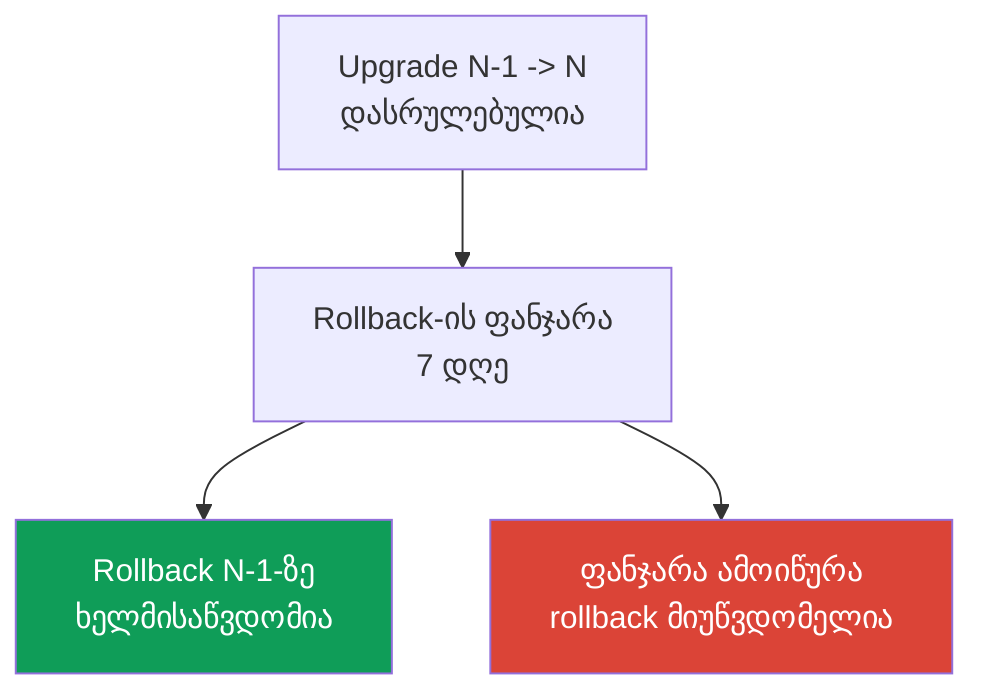
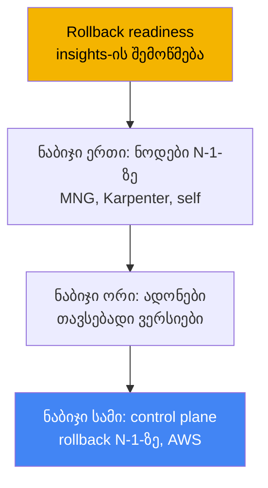
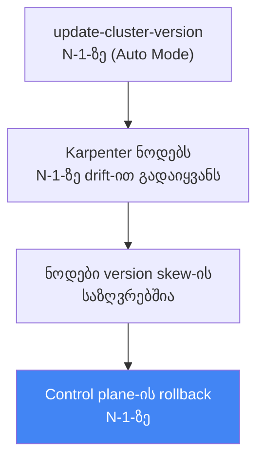

[Русская версия](ru.md) · [Eng version](en.md) · [Versión en español](es.md) · [Version française](fr.md) · [Deutsche Version](de.md) · [繁體中文版](tw.md) · [日本語版](jp.md)
# თავი 39. კლასტერის ვერსიის უკან დაბრუნება: rollback readiness insights, 7-დღიანი ფანჯარა, უკან დაბრუნების თანმიმდევრობა

> **რა არის შემდეგ.** 38-ე თავში განვიხილეთ კლასტერის განახლება: ვერსიის სასიცოცხლო ციკლი,
> in-place upgrade თითო minor ვერსიით, მოძველებული API-ები და blue/green მიგრაცია. აქ განვიხილავთ
> საპირისპირო ოპერაციას: control plane-ის წინა minor ვერსიაზე დაბრუნებას, როდესაც upgrade
> დასრულდა, მაგრამ ახალ ვერსიაზე რაღაც გაფუჭდა. მომიჯნავე თემები სხვა თავებშია: თავად upgrade და
> blue/green - თავი 38, ზოგადად cluster insights - თავი 38, საიმედოობა, PDB და ნოდების კორექტული
> გამორთვა - თავი 40, კლასტერის მდგომარეობის სარეზერვო ასლის შექმნა და აღდგენა - თავები 41 და 42,
> EKS Auto Mode - თავი 9.

## 39.1. „განვაახლეთ, მდგომარეობა გაუარესდა, უკან დასაბრუნებელი გზა კი არ არის“

მორიგეობისას ეს სცენარი ნაცნობია. კლასტერი ახალ minor ვერსიაზე 38-ე თავში მოცემული პროცესის
ზუსტად დაცვით გადავიყვანეთ: insights სუფთაა, ადონები თავსებადია, control plane და ნოდები მწვანეა.
ერთი საათის შემდეგ კი აღმოჩნდა, რომ ახალ ვერსიაზე არ მუშაობს ის, რასაც insights ვერ აღმოაჩენდა:
მესამე მხარის კონტროლერი API-ის შეცვლილი ქცევის გამო ვარდება, ინდივიდუალური ოპერატორი არ ეშვება,
ხოლო kube-apiserver-ის ნაგულისხმევი პარამეტრების ცვლილების შემდეგ დატვირთვა უცნაურად იქცევა.
Upgrade ფორმალურად წარმატებულია, production კი დეგრადირებულია.

ისტორიულად ეს გამოუვალი ხაფანგი იყო. Kubernetes-ის განახლება ცალმხრივია: upstream minor ვერსიის
control plane-ის დაქვეითებას მხარს არ უჭერს. შესაბამისად, ინჟინერს ორი გზა რჩებოდა და ორივე მძიმე
იყო. პირველი - ადგილზე შეკეთება: production-ის დატვირთვის ქვეშ კონტროლერებისა და workload-ების
ახალი ვერსიისთვის სასწრაფოდ დაპატჩვა. მეორე - blue/green: ტრაფიკის წინასწარ გამართულ ძველ
კლასტერზე გადართვა. მაგრამ blue/green upgrade-მდე უნდა მომზადდეს, ჩვეულებრივი in-place-ის დროს კი
ის არ არსებობს და დასაბრუნებელი ადგილი არ არის.

EKS-მა ეს ხარვეზი შეავსო: კლასტერის ვერსიის სტანდარტული უკან დაბრუნება გამოჩნდა. ის control
plane-ს კლასტერის თავიდან შექმნის გარეშე აბრუნებს წინა minor ვერსიაზე. თუმცა მას მკაცრი პირობები
აქვს: ფანჯარა მხოლოდ 7 დღეა, უკან მხოლოდ ერთი ვერსიით დაბრუნება შეიძლება და არსებობს
ბლოკერების ნაკრები. ამასთან, ის მუშაობს არა როგორც „გაუქმების ღილაკი“, არამედ როგორც საკუთარი
თანმიმდევრობის მქონე პროცედურა. განვიხილოთ, კონკრეტულად რა ბრუნდება უკან, რას არ აკეთებს rollback
და როგორ არ დავკარგოთ ის საჭირო მომენტში.

## 39.2. რატომ არის უკან დაბრუნება საერთოდ რთული

Upstream Kubernetes-ში upgrade ერთი მიმართულებით მოძრაობად არის დაპროექტებული. განახლებისას
kube-apiserver და etcd ობიექტებს ახალ სქემებზე გადაიყვანს, ხოლო ნოდებზე არსებული კომპონენტები
(kubelet) მათ მიჰყვება. Version skew policy kubelet-ს kube-apiserver-ზე ძველი ვერსიის ქონის უფლებას
აძლევს, მაგრამ უფრო ახლისას არა. Control plane-ის დაქვეითებას upstream მხარს არ უჭერს და არ
ამოწმებს: არ არსებობს გარანტია, რომ etcd-ში არსებული ობიექტები კორექტულად „დაკონვერტირდება უკან“.

ამიტომ EKS-მა ზოგადი downgrade კი არა, შეზღუდული rollback განახორციელა: **მხოლოდ control plane**
დააბრუნოს **ერთ წინა** minor ვერსიაზე, upgrade-ის შემდეგ არსებულ **ვიწრო ფანჯარაში**, ამასთან etcd-ის
მონაცემები და workload-ები ადგილზე შეინარჩუნოს. ზოგად downgrade-თან შედარებით rollback-ს სწორედ
შეზღუდვები ხდის უფრო უსაფრთხოს: ახალი upgrade (etcd ჯერ არ „შევსებულა“ მხოლოდ ახალი ვერსიის
ობიექტებით), ერთი minor ვერსია (სქემებს შორის მცირე სხვაობა) და მზადყოფნის შემოწმებები, რომლებიც
შეუთავსებლობებს წინასწარ პოულობს.



ფუნქციის დანიშნულება პირდაპირია: rollback წარუმატებელი upgrade-იდან სწრაფი გამოსავალია, სანამ
ვერსიებს შორის სხვაობა მცირე და ახალია. ის არ არის კლასტერის დროის მანქანა და არც სარეზერვო
ასლის შემცვლელია (საზღვარი აღწერილია 39.7 განყოფილებაში).

## 39.3. EKS cluster version rollback: 7-დღიანი ფანჯარა და ერთი ვერსია

Rollback in-place upgrade-ის შემდეგ control plane-ს წინა minor ვერსიაზე აბრუნებს. EKS უკან
აბრუნებს kube-apiserver-სა და control plane-ის კომპონენტებს, ასევე platform version-ს (წინა minor
ვერსიის უახლეს platform version-ზე), ხოლო etcd-ის მონაცემებს, workload-ებსა და მუდმივ ტომებს
ინარჩუნებს. ძირითადი პირობები წინაპირობების სახით მოწმდება და მათი წინასწარ ცოდნა მნიშვნელოვანია.

| პირობა | რა არის საჭირო |
|---|---|
| 7-დღიანი ფანჯარა | rollback upgrade-ის დასრულებიდან 7 დღის განმავლობაში უნდა დაიწყოს, შემდეგ ის მიუწვდომელია |
| მხოლოდ in-place upgrade | პირდაპირ მიმდინარე ვერსიაზე შექმნილი კლასტერის უკან დაბრუნება შეუძლებელია |
| ერთი minor ვერსიით უკან | მხოლოდ N -> N-1; `1.31`->`1.32`->`1.33` შემთხვევაში rollback მხოლოდ `1.32`-მდეა შესაძლებელი |
| მხარდაჭერილი ვერსია | სამიზნე ვერსია EKS-ის მხარდაჭერილ ვერსიებს შორის უნდა იყოს |
| Extended support | extended support-ში არსებული ვერსიის დასაბრუნებლად ჯერ upgrade policy `EXTENDED`-ზე შეცვალეთ |
| არა auto-upgrade extended-იდან | extended support-ის ბოლოს ავტომატურად განახლებული კლასტერის უკან დაბრუნება შეუძლებელია |
| სტატუსი ACTIVE | კლასტერის სტატუსია `ACTIVE` და სხვა განახლება არ მიმდინარეობს |
| EKS ფუნქციების თავსებადობა | თუ ჩართული EKS ფუნქცია წინა ვერსიაზე მხარდაჭერილი არ არის, rollback უარყოფილი იქნება |

38-ე თავში განხილულ auto-upgrade-ს ორი ნიუანსი აქვს. თუ EKS-მა ვერსია **extended support**-ის ბოლოს
თავად აამაღლა, rollback მიუწვდომელია. თუ მან ვერსია **standard support**-ის ბოლოს თავად აამაღლა,
უკან დაბრუნება შესაძლებელია, მაგრამ ჯერ კლასტერის upgrade policy `EXTENDED`-ზე უნდა შეიცვალოს.
კიდევ ერთი საკითხი: standard support-ში არსებული ვერსიიდან extended support-ში არსებულ ვერსიაზე
დაბრუნებისას extended support-ის გაზრდილი ტარიფები კვლავ ამოქმედდება (ღირებულების სტრუქტურა
განხილულია 38-ე თავში).

Rollback იმავე ბრძანებით იწყება, რომლითაც upgrade, მხოლოდ წინა ვერსიის მითითებით:

```bash
# control plane-ის წინა minor ვერსიაზე (N-1) დაბრუნება
aws eks update-cluster-version --name my-cluster --kubernetes-version 1.30
```

პასუხში განახლების ტიპია `VersionRollback` და არა ჩვეულებრივი upgrade. პროგრესს პასუხიდან მიღებული
`id`-ით `describe-update`-ის საშუალებით აკვირდებიან (განყოფილება „პრაქტიკა“).

## 39.4. Rollback readiness insights

Rollback-ის შესაძლებლობის ხელით შემოწმება საჭირო არ არის: ამისთვის არსებობს cluster insights-ის
ცალკე ტიპი (თავი 38), **rollback readiness insights**, კატეგორიაში `ROLLBACK_READINESS`. ეს არის
წერტილოვანი (point-in-time) შემოწმებები, რომლებსაც EKS **upgrade-ის შემდეგ** ქმნის და rollback-ის
7-დღიანი ფანჯრის განმავლობაში ინახავს. ფანჯრის ამოწურვის შემდეგ ამ ტიპის insights კლასტერისთვის
აღარ იქმნება. ისინი upgrade-ის შემდეგ დაუყოვნებლივ უნდა ნახოთ და არა მაშინ, როცა რაღაც უკვე
გაფუჭდა.

რას ამოწმებს rollback readiness insights:

- ვერსიებს შორის API-ის გამოყენების თავსებადობას, ველების დონეზე ცვლილებების ჩათვლით;
- კლასტერის ზოგად ჯანმრთელობას;
- version skew-ს kubelet-ისა და kube-proxy-ისთვის (ხომ არ არის ნოდები სამიზნე control plane-ზე ახალი);
- ადონების ვერსიების სამიზნე ვერსიასთან თავსებადობას;
- EKS Auto Mode-ისთვის დამატებით: NodePool disruption budgets-ს, `do-not-disrupt` ანოტაციებსა და
  PodDisruptionBudget-ის კონფიგურაციას.

თითოეულ insight-ს სტატუსი აქვს და მასზეა დამოკიდებული, დაიშვება თუ არა rollback.

| სტატუსი | მნიშვნელობა | გავლენა rollback-ზე |
|---|---|---|
| PASSING | პრობლემები ვერ მოიძებნა | rollback ნებადართულია |
| WARNING | შესაძლო პრობლემა, რომელიც არ ბლოკავს | rollback ნებადართულია, ეს გაფრთხილებაა |
| ERROR | დამბლოკავი პრობლემა | rollback დაბლოკილია პრობლემის გამოსწორებამდე (ან `--force`) |
| UNKNOWN | სტატუსის დადგენა ვერ მოხერხდა | rollback დაბლოკილია (ან `--force`) |

Rollback-ს ERROR და UNKNOWN სტატუსები ბლოკავს. პრობლემებს ან ასწორებენ და insights-ს აახლებენ,
ან `--force`-ით გვერდს უვლიან. მნიშვნელოვანია გვესმოდეს, რომ `--force` **მხოლოდ insights-ის
შემოწმებებს უვლის გვერდს** (ERROR, WARNING, UNKNOWN), მაგრამ არა წინაპირობებს: 7-დღიან ფანჯარას,
„მიმდინარე ვერსიაზე შექმნილ“ კლასტერის მდგომარეობას, ერთ minor ვერსიასა და EKS ფუნქციების
თავსებადობას `--force` ვერ აუვლის გვერდს. `--force`-ის გამოყენების შედეგებზე EKS პასუხისმგებლობას
სრულად იხსნის: გვერდავლილი შემოწმებებით rollback-ის უსაფრთხოების გარანტია არ არსებობს.

```bash
# მხოლოდ rollback readiness insights
aws eks list-insights --cluster-name my-cluster \
  --filter '{"categories": ["ROLLBACK_READINESS"]}'
# გამოსწორების შემდეგ insights-ის იძულებით განახლება, 24 საათის ლოდინის გარეშე
aws eks start-insights-refresh --cluster-name my-cluster
```

EKS insights-ს ყოველ 24 საათში აახლებს, ხოლო უშუალოდ rollback-მდე refresh-ს ავტომატურად უშვებს,
რათა შემოწმებები კლასტერის ახალ მდგომარეობაზე შესრულდეს.

## 39.5. უკან დაბრუნების თანმიმდევრობა: upgrade-ის საპირისპიროდ

Rollback-ის თანმიმდევრობა 38-ე თავში აღწერილი upgrade-ის სარკისებურია. იქ თანმიმდევრობა ასეთი იყო:
control plane, შემდეგ ადონები, შემდეგ ნოდები. Rollback-ისას პირიქითაა და მიზეზი იგივე version skew
policy-ა: **ნოდები control plane-ზე ახალი არ უნდა იყოს**. თუ upgrade-მა ნოდები უკვე N ვერსიაზე
აიყვანა, control plane-ს კი N-1-ზე ვაბრუნებთ, N ვერსიის ნოდები უფრო ახალი აღმოჩნდება, რაც skew-ს
არღვევს. შესაბამისად, N ვერსიის ნოდები N-1-ზე **control plane-ის rollback-მდე** უნდა დაბრუნდეს.
აქედან გამომდინარეობს საერთო თანმიმდევრობა.



ვინ და როგორ აბრუნებს ნოდებს, გამოთვლითი რესურსის ტიპზეა დამოკიდებული (თავი 9):

| ნოდების ტიპი | ვინ აბრუნებს | როგორ |
|---|---|---|
| EKS Auto Mode | EKS ავტომატურად | ნოდები control plane-ზე **ადრე** გადადის N-1-ზე drift-ით, ხელით მოქმედების გარეშე |
| Managed node group | თქვენ | `update-nodegroup-version` წინა ვერსიაზე control plane-ის rollback-მდე |
| Karpenter | თქვენ | drift: სასურველი AMI/ვერსია N-1-ზე, Karpenter ნოდებს თავიდან ქმნის (თავი 12) |
| Self-managed / hybrid | თქვენ | ნოდების AMI-ს/კონფიგურაციას control plane-ის rollback-მდე თავად ცვლით N-1-ზე |
| Fargate | მხარდაჭერილი არ არის | Fargate-ის rollback შეუძლებელია; rollback-მდე პოდები წაშალეთ ან გამოიყენეთ `--force` |

მე-9 თავის ნიუანსი: **EKS Auto Mode**-ში ნოდები control plane-ზე **ადრე** ბრუნდება უკან და ამას EKS
აკეთებს. Auto Mode კლასტერისთვის `update-cluster-version`-ის N-1 ვერსიით გამოძახებისას EKS ჯერ
Karpenter-ის საშუალებით ნოდებს წინა ვერსიის AMI-ზე drift-ით გადაიყვანს (disruption budgets-ისა და
PDB-ის დაცვით), დაელოდება ყველა ნოდის დასაშვებ version skew-ში მოქცევას და მხოლოდ შემდეგ
დააბრუნებს control plane-ს. სანამ ნოდები drift-ს გადის, კლასტერი `ACTIVE` მდგომარეობაში რჩება,
სტატუსი კი `UPDATING`-ზე მხოლოდ control plane-ის rollback-ის ეტაპზე იცვლება. ნოდების rollback-ის
ფაზას disruption controls-ის მიხედვით რამდენიმე წუთიდან 7 დღემდე შეიძლება დასჭირდეს.



AWS best practices-იდან ცალკე პრაქტიკული რჩევაა: ჩვეულებრივი ნოდებისთვის (MNG, self-managed)
სასარგებლოა control plane-ისა და ნოდების upgrade-ის დროში გაყოფა და მათ შორის პაუზის (bake period)
დატოვება. სანამ ნოდები N-1-ზეა, control plane კი უკვე N-ზე, kubelet version skew-ის insight
PASSING მდგომარეობაში რჩება და rollback-ის გზა ნოდების წინასწარ დაბრუნების გარეშე ღიაა. ეს
rollback-ის ხელმისაწვდომობის შენარჩუნების ყველაზე იაფი გზაა: control plane-ის შემდეგ ნოდების
განახლებას ნუ იჩქარებთ.

## 39.6. რა ბლოკავს rollback-ს და როგორ მოვემზადოთ

ბლოკერები ორ კლასად იყოფა. პირველი არის **მკაცრი წინაპირობები**, რომლებსაც ვერაფრით აუვლით
გვერდს: 7-დღიანი ფანჯარა ამოიწურა; კლასტერი პირდაპირ მიმდინარე ვერსიაზე შეიქმნა (upgrade არ
ყოფილა); კლასტერის კიდევ ერთი minor ვერსიით აწევა უკვე მოასწარით (rollback მხოლოდ ერთი minor
ვერსიით შეიძლება); ვერსიის საზღვარზე EKS-ის შეუთავსებელი ფუნქცია კვლავ ჩართეთ; auto-upgrade
extended support-ის ბოლოს შესრულდა. მეორე კლასია **insights-ის ბლოკერები** (სტატუსი
ERROR/UNKNOWN), რომელთა გამოსწორება ან `--force`-ით გვერდის ავლა შეიძლება: ადონების შეუთავსებელი
ვერსიები, ძველ ვერსიაში არარსებულ API-ზე შექმნილი ობიექტები, version skew-ის დარღვევა, ხოლო Auto
Mode-ისთვის ნოდზე `do-not-disrupt` ან ბიუჯეტი `nodes: 0`.

„რბილ“ ბლოკერებს შორის ყველაზე ვერაგია **ობიექტები ახალ API-ებზე**. თუ ახალ ვერსიაზე მუშაობისას
შექმენით რესურსები API-ის საშუალებით, რომელიც ძველ ვერსიაში ჯერ არ არსებობს, control plane-ის
rollback ამ ობიექტებს მათი მომსახურე API-ის გარეშე დატოვებს. აქედან გამომდინარეობს მომზადების
პრაქტიკა: სანამ 7-დღიანი ფანჯარა მოქმედებს, **ნუ იჩქარებთ მხოლოდ ახალ ვერსიაზე ხელმისაწვდომი
API-ებისა და ფუნქციების გამოყენებას**, წინააღმდეგ შემთხვევაში უკან დასაბრუნებელ გზას თავად
ჩაკეტავთ. თუ ასეთი ობიექტები უკვე შექმნილია, ისინი rollback-მდე უნდა წაიშალოს.

როგორ შევინარჩუნოთ rollback პრაქტიკულად ხელმისაწვდომი:

- rollback readiness insights upgrade-ის შემდეგ დაუყოვნებლივ ნახეთ და ERROR ფანჯრის დახურვამდე
  გამოასწორეთ;
- ადონები ძველ და ახალ minor ვერსიებთან ერთდროულად თავსებად (cross-compatible) ვერსიებზე
  განაახლეთ;
- ნოდები ახალ ვერსიაზე დაუყოვნებლივ არ გადაიყვანოთ: შეინარჩუნეთ bake period, რათა skew-insight
  PASSING იყოს;
- ფანჯრის განმავლობაში თავი შეიკავეთ მხოლოდ ახალ ვერსიაში არსებული API-ების ობიექტებისგან;
- გახსოვდეთ, რომ insights წერტილოვანია: შემოწმების შემდეგ, მაგრამ rollback-ის დასრულებამდე
  კლასტერის ცვლილებები შემოწმებით დაფარული არ არის.

## 39.7. Rollback სარეზერვო ასლს არ ცვლის

Rollback ხშირად სარეზერვო ასლიდან აღდგენაში ერევათ, მაგრამ ეს სხვადასხვა საზღვრის მქონე სხვადასხვა
ინსტრუმენტია. Rollback უკან აბრუნებს **control plane-ის ვერსიას** და მის კონფიგურაციას, ხოლო
etcd-ის მონაცემები, workload-ები და მუდმივი ტომები **უცვლელად ინახება** და უკან არ ბრუნდება. ანუ
rollback არ აუქმებს ცვლილებებს, რომლებიც upgrade-ის შემდეგ კლასტერის ობიექტებსა თუ აპლიკაციების
მონაცემებში შეიტანეთ; ის მხოლოდ kube-apiserver-ის ვერსიას აქვეითებს.

აქედან ორი შედეგი გამომდინარეობს. პირველი: rollback არ დაგეხმარებათ, თუ პრობლემა ვერსია კი არა,
ვიღაცის მიერ namespace-ის წაშლა, მონაცემების დაზიანება ან რესურსების განადგურებაა; საჭიროა
სარეზერვო ასლი და მდგომარეობის აღდგენა (თავები 41 და 42). მეორე: ახალ ვერსიაზე შექმნილი და
`--force`-ით გვერდავლილი ობიექტები rollback-ის შემდეგ etcd-ში რჩება და garbage collector მათ არ
აგროვებს, ისინი უბრალოდ „ჰაერში რჩება“. საზღვარი მარტივია: **rollback ეხება control plane-ის
ვერსიას ვიწრო ფანჯარაში, სარეზერვო ასლი კი მონაცემებსა და მდგომარეობას**.

## 39.8. როგორ იყენებენ ამას production-ში

- **Rollback readiness insights-ს upgrade-ის შემდეგ დაუყოვნებლივ ნახულობენ და არა ავარიის
  დროს.** სანამ 7-დღიანი ფანჯარა ღიაა, ERROR-insights-ს წინასწარ ასწორებენ, რათა rollback-ის გზა
  სუფთა დარჩეს.
- **Control plane-სა და ნოდებს შორის bake period-ს ტოვებენ.** ჩვეულებრივ ნოდებს ახალ ვერსიაზე
  დაუყოვნებლივ არ გადაიყვანენ: სანამ ისინი N-1-ზეა, kubelet skew-insight PASSING მდგომარეობაშია და
  rollback ნოდების დაბრუნების გარეშეა შესაძლებელი.
- **ფანჯრის განმავლობაში მხოლოდ ახალ ვერსიაში არსებულ API-ებს არ იყენებენ.** ძველ ვერსიაში
  არარსებულ API-ზე შექმნილი ობიექტები rollback-ს კეტავს; მათ ადაპტაციას upgrade-ის სტაბილურობის
  დადასტურებამდე გადადებენ.
- **ადონებს cross-compatible ვერსიებზე ინარჩუნებენ.** ძველ და ახალ minor ვერსიებთან თავსებადი
  ადონების ვერსიები add-on compatibility insight-ს rollback-ისთვის სუფთად ინარჩუნებს (თავი 37).
- **თავსებადობას თავადაც ამოწმებენ.** Insights არ მოიცავს self-managed ადონებს, ინდივიდუალურ
  კონტროლერებსა და აპლიკაციის დონეს, ამიტომ წინა ვერსიასთან მათ თავსებადობას თავად ამოწმებენ.
- **თანმიმდევრობა და Auto Mode ახსოვთ.** MNG/self-managed ნოდები control plane-მდე ბრუნდება;
  Auto Mode-ისთვის ამას EKS ავტომატურად, control plane-ის rollback-მდე აკეთებს.

## 39.9. მინი-ლექსიკონი

- **cluster version rollback** - in-place upgrade-ის შემდეგ EKS control plane-ის წინა minor
  ვერსიაზე დაბრუნება 7-დღიან ფანჯარაში, etcd-ის, workload-ებისა და ტომების შენარჩუნებით.
- **rollback-ის ფანჯარა (7 დღე)** - upgrade-ის შემდგომი პერიოდი, როდესაც rollback
  ხელმისაწვდომია; ამოწურვის შემდეგ rollback და მისი insights მიუწვდომელია.
- **rollback readiness insights** - cluster insights-ის ტიპი კატეგორიაში `ROLLBACK_READINESS`,
  რომელიც rollback-ისთვის მზადყოფნას ამოწმებს; სტატუსებია PASSING/WARNING/ERROR/UNKNOWN.
- **VersionRollback** - rollback-ისას `update-cluster-version`-ის პასუხში განახლების ტიპი.
- **--force** - ალამი, რომელიც insights-ის შემოწმებებს (ERROR/WARNING/UNKNOWN) უვლის გვერდს,
  მაგრამ არა წინაპირობებს (ფანჯარა, ერთი minor ვერსია, ვერსიაზე შექმნა, ფუნქციების თავსებადობა).
- **version skew policy** - Kubernetes-ის წესი: ნოდები control plane-ზე ახალი არ უნდა იყოს;
  ის rollback-ის თანმიმდევრობას განსაზღვრავს (ჯერ ნოდები, შემდეგ control plane).
- **bake period** - პაუზა control plane-ისა და ნოდების upgrade-ს შორის: ნოდები N-1-ზე რჩება და
  rollback მათი დაბრუნების გარეშეა ხელმისაწვდომი.

## 39.10. თავის შეჯამება

- Upstream Kubernetes-ში upgrade ცალმხრივია; EKS-მა დაამატა control plane-ის შეზღუდული rollback
  ერთ წინა minor ვერსიაზე, etcd-ის მონაცემების, workload-ებისა და მუდმივი ტომების შენარჩუნებით.
- პირობები მკაცრია: upgrade-ის შემდეგ 7-დღიანი ფანჯარა, მხოლოდ in-place upgrade-ის მქონე
  კლასტერი, ერთი minor ვერსიით უკან, სტატუსი ACTIVE; extended support-ის ბოლოს auto-upgrade-ის
  მქონე კლასტერის უკან დაბრუნება შეუძლებელია.
- Rollback readiness insights (`ROLLBACK_READINESS`) ამოწმებს API-ის თავსებადობას ველების
  დონემდე, ჯანმრთელობას, version skew-სა და ადონების თავსებადობას; ის მხოლოდ 7-დღიანი ფანჯრის
  განმავლობაშია ხელმისაწვდომი.
- ERROR და UNKNOWN სტატუსები rollback-ს ბლოკავს; `--force` insights-ს უვლის გვერდს, მაგრამ არა
  წინაპირობებს და EKS-ს უსაფრთხოების გარანტიებისგან ათავისუფლებს.
- Rollback-ის თანმიმდევრობა upgrade-ის საპირისპიროა: ჯერ ნოდები N-1-ზე, შემდეგ ადონები, შემდეგ
  control plane; მიზეზია version skew policy (ნოდები control plane-ზე ახალი არ უნდა იყოს).
- ნოდები ტიპის მიხედვით ბრუნდება: MNG `update-nodegroup-version`-ით, Karpenter drift-ით,
  self-managed დამოუკიდებლად; Fargate მხარდაჭერილი არ არის; EKS Auto Mode ნოდებს control plane-ზე
  ადრე აბრუნებს.
- Rollback-ს ბლოკავს ამოწურული ფანჯარა, ობიექტები მხოლოდ ახალ API-ებზე, შეუთავსებელი ადონები,
  skew-ის დარღვევა და extended-იდან auto-upgrade; ამისთვის ემზადებიან ადრეული insights-ით, bake
  period-ითა და ახალ API-ებთან სიფრთხილით.
- Rollback სარეზერვო ასლს არ ცვლის: ის control plane-ის ვერსიას აბრუნებს, მაგრამ არა მონაცემებსა
  და მდგომარეობას; მდგომარეობისა და მონაცემებისთვის საჭიროა სარეზერვო ასლი და აღდგენა (თავები 41
  და 42).

## 39.11. როგორ გამოგადგებათ ეს რეალურ სამუშაოში

მორიგეობისას rollback upgrade-ის შეცდომის ფასს ცვლის. ადრე „განვაახლეთ და გაუარესდა“ ავარიულ
სამუშაოს ნიშნავდა: production-ის დატვირთვის ქვეშ ადგილზე შეკეთებას ან blue/green კლასტერის
გამართვას, რომელიც შესაძლოა არც არსებობდეს. ახლა ინჟინერს აქვს სტანდარტული გამოსავალი, control
plane წინა minor ვერსიაზე დააბრუნოს, მაგრამ მხოლოდ იმ შემთხვევაში, თუ მასზე წინასწარ იზრუნა.
დასკვნა მარტივია: rollback-ის ბერკეტი „ავარიის დროს საძებნელი“ კი არა, upgrade-ის შემდეგ მთელი
კვირის განმავლობაში მზადყოფნაში შესანარჩუნებელია. ეს ნიშნავს, რომ განახლებისთანავე უნდა ნახოთ
rollback readiness insights, ERROR ღია ფანჯრის განმავლობაში გამოასწოროთ, ნოდები ახალ ვერსიაზე
დაუყოვნებლივ არ გადაიყვანოთ და მხოლოდ ახალ ვერსიაში არსებულ API-ებს სტაბილურობის
დადასტურებამდე არ დაეყრდნოთ.

Upgrade-ის დაგეგმვისას rollback კიდევ ერთი არგუმენტია 38-ე თავში მოცემული მიდგომისთვის,
„განახლდით ადრე და არა extended support-ის ბოლო ვადაზე“: სტანდარტული rollback-ით ახალი minor
ვერსიის რელიზიდან მალევე დაყენება უფრო თავდაჯერებულად შეიძლება, რადგან პრობლემისას დასაბრუნებლად
7 დღე გაქვთ. თუმცა საზღვრები მკაფიოდ უნდა გესმოდეთ: rollback ეხება control plane-ის ვერსიას ვიწრო
ფანჯარაში, მონაცემების დაზიანებისგან არ გიცავთ და etcd-ში ცვლილებებს არ აუქმებს. ამისთვის საჭიროა
დაცვის ცალკე ხაზი: სარეზერვო ასლი და აღდგენა (თავები 41 და 42), ასევე workload-ების საიმედოობა PDB
და multi-AZ-ის საშუალებით (თავი 40).

## 39.12. თვითშემოწმების კითხვები

1. რატომ არ უჭერს upstream Kubernetes მხარს control plane-ის minor ვერსიის დაქვეითებას და ზოგადი
   downgrade-ის ნაცვლად კონკრეტულად რას აბრუნებს EKS?
2. რამდენ ხანს გრძელდება rollback-ის ფანჯარა და რომელი მოვლენიდან აითვლება?
3. რამდენი minor ვერსიით უკან შეიძლება დაბრუნება და რა მოხდება, თუ upgrade-ის შემდეგ კლასტერი
   კიდევ ერთი minor ვერსიით აამაღლეთ?
4. Rollback-ის რომელი პირობებია მკაცრი წინაპირობები, რომლებსაც `--force` ვერ აუვლის გვერდს?
5. შესაძლებელია თუ არა კლასტერის უკან დაბრუნება, თუ EKS-მა ის extended support-ის ბოლოს თავად
   აამაღლა? და standard support-ის ბოლოს?
6. რას ამოწმებს rollback readiness insights და რომელ კატეგორიაში ჩნდება ის?
7. Insight-ის რომელი სტატუსები ბლოკავს rollback-ს, რომელი არა და კონკრეტულად რას უვლის გვერდს
   `--force` ალამი?
8. რა თანმიმდევრობით სრულდება rollback და რატომ ბრუნდება ნოდები control plane-მდე?
9. რით განსხვავდება EKS Auto Mode-ის ნოდების rollback managed node group-ისგან?
10. რა ხდება Fargate პოდებთან rollback-ისას და როგორ უვლიან ამას გვერდს?
11. რატომ უშლის rollback-ს ხელს მხოლოდ ახალ API-ებზე შექმნილი ობიექტები და როგორ ავიცილოთ ეს?
12. რით განსხვავდება ვერსიის rollback სარეზერვო ასლიდან აღდგენისგან და სად გადის მათ შორის
    საზღვარი?
13. რა არის bake period და როგორ ეხმარება ის rollback-ის ხელმისაწვდომობის შენარჩუნებას?

## პრაქტიკა

ამ თემის კურსის ლაბა: [ლაბა 113 - კლასტერის განახლება და უკან დაბრუნება: control plane, ადონები,
მოძველებული API-ები](../../labs/113/README_GE.MD). ამის გარდა, ცოცხალ კლასტერზე rollback-ისთვის
მზადყოფნისა და განახლებების ისტორიის მიღება მარტივია. ჯერ ნახეთ მიმდინარე ვერსია და განახლებების
ისტორია: იყო თუ არა ახლახან in-place upgrade, საიდანაც 7-დღიანი ფანჯარა აითვლება:

```bash
# control plane-ის მიმდინარე ვერსია
aws eks describe-cluster --name my-cluster --query 'cluster.version'
# განახლებების ისტორია: მოძებნეთ ტიპი VersionUpdate და დასრულების თარიღი
aws eks list-updates --name my-cluster
```

შემდეგ, თუ upgrade ახლახან შესრულდა, ნახეთ rollback readiness insights და გაარჩიეთ ყველაფერი,
რაც ERROR ან WARNING სტატუსითაა მონიშნული:

```bash
# მხოლოდ rollback readiness insights
aws eks list-insights --cluster-name my-cluster \
  --filter '{"categories": ["ROLLBACK_READINESS"]}'
# კონკრეტული insight-ის დეტალები: სტატუსი, რეკომენდაცია, დაზარალებული რესურსები
aws eks describe-insight --cluster-name my-cluster --id <insight-id>
```

თუ ბლოკერები ახლახან გამოასწორეთ, insights ხელით განაახლეთ და ყოველდღიური refresh-ის ლოდინის
გარეშე დარწმუნდით, რომ ERROR გაქრა:

```bash
# შემოწმებების იძულებითი refresh
aws eks start-insights-refresh --cluster-name my-cluster
# კონკრეტული განახლების/rollback-ის სტატუსი list-updates-იდან მიღებული id-ით
aws eks describe-update --name my-cluster --update-id <update-id>
```

ერთმანეთს შეადარეთ სამი რამ: ბოლო upgrade-ის დასრულების თარიღი (დარჩა თუ არა 7-დღიანი ფანჯარა),
rollback readiness insights-ის სტატუსი და თქვენი ნოდების ვერსია control plane-თან მიმართებით. თუ
upgrade ახალია, insights სუფთაა, ხოლო ნოდები სამიზნე minor ვერსიაზე ახალი არ არის, rollback-ის გზა
ღიაა. თუ insights ცარიელია და ისტორიაში upgrade არ არის, უკან დასაბრუნებელი არაფერია და ეს
მოსალოდნელია. Rollback-ისას ნოდების გადაგორების დროს workload-ების საიმედოობა განხილულია მე-40
თავში, ხოლო მდგომარეობის სარეზერვო ასლი - 41-ე და 42-ე თავებში.

---
[სარჩევი](../README_GE.md) · [თავი 38](../38/ge.md) · [თავი 40](../40/ge.md)
