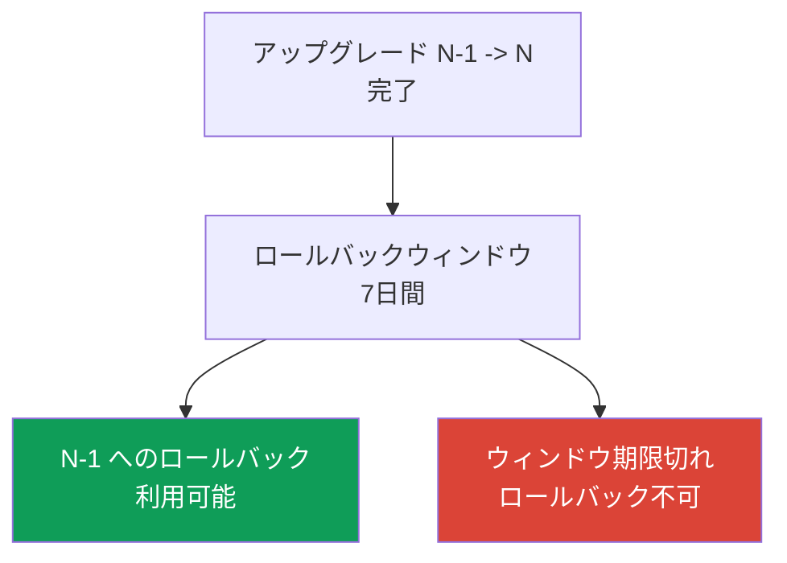
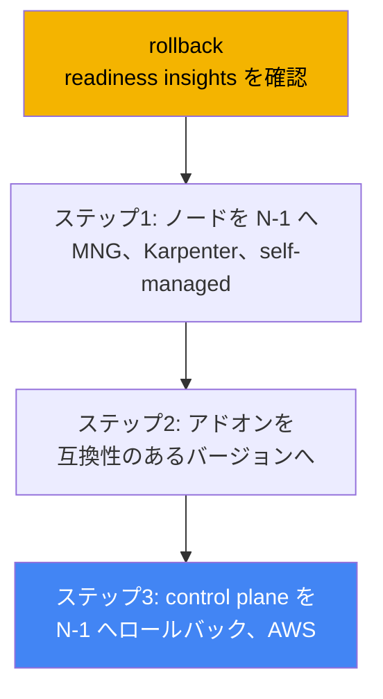
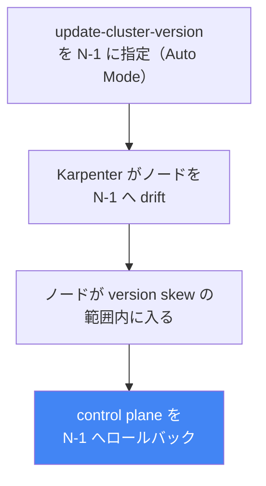

[Eng version](en.md) · [Versión en español](es.md) · [Version française](fr.md) · [Deutsche Version](de.md) · [Русская версия](ru.md) · [ქართული ვერსია](ge.md) · [繁體中文版](tw.md)
# 第39章. クラスターバージョンのロールバック: rollback readiness insights、7日間のウィンドウ、ロールバックの順序

> **次は何か。** 第38章ではクラスターのアップグレードを扱いました。バージョンのライフサイクル、1マイナーずつの in-place アップグレード、廃止された API、blue/green 移行です。ここでは逆の操作を扱います。アップグレード自体は成功したものの、新しいバージョンで何かが壊れた場合に、control plane を前のマイナーバージョンへロールバックします。関連する内容は他の章で扱います。アップグレード自体と blue/green は第38章、cluster insights 全般は第38章、信頼性、PDB、ノードの適切な停止は第40章、クラスター状態のバックアップと復旧は第41章と第42章、EKS Auto Mode は第9章です。

## 39.1. 「アップグレードしたら悪化し、戻る道がない」

これはオンコールでよくあるシナリオです。第38章のプロセスどおりにクラスターを新しいマイナーバージョンへ上げました。insights は問題なく、アドオンには互換性があり、control plane とノードも正常です。しかし1時間後、insights では検出できなかったものが新しいバージョンで動かないと分かります。サードパーティーのコントローラーが API の動作変更でクラッシュする、カスタム operator が起動しない、kube-apiserver のデフォルト変更後にワークロードが不自然な挙動をする、といったことです。アップグレードは形式上成功していますが、本番環境は劣化しています。

歴史的には、これは出口のない罠でした。Kubernetes のアップグレードは一方向です。upstream は control plane のマイナーバージョンのダウングレードをサポートしていません。そのためエンジニアには、どちらも重い二つの選択肢しか残りませんでした。一つ目はその場で修正することです。本番負荷の下で、新しいバージョンに対応するようコントローラーとワークロードを緊急パッチします。二つ目は blue/green です。あらかじめ用意した旧クラスターへトラフィックを切り替えます。しかし blue/green はアップグレード前に準備しなければならず、通常の in-place アップグレードにはそのようなクラスターがありません。ロールバック先がないのです。

EKS はネイティブのクラスターバージョンロールバックを追加して、この隔たりを埋めました。クラスターを作り直さず、control plane を前のマイナーバージョンへ戻します。ただし、7日間だけのウィンドウ、一つ前のバージョンだけ、いくつものブロッカーという厳しい条件があり、「元に戻す」ボタンのようには動きません。独自の順序を持つ手順です。何が正確にロールバックされるのか、ロールバックで何が行われないのか、必要なときに使えなくならないためにはどうするのかを見ていきます。

## 39.2. なぜロールバックはそもそも難しいのか

upstream Kubernetes では、アップグレードは一方向への移動として設計されています。アップグレード中、kube-apiserver と etcd はオブジェクトを新しいスキーマへ移行し、ノード上のコンポーネント（kubelet）が後に続きます。version skew policy では kubelet が kube-apiserver より古いことは許されますが、新しいことは許されません。upstream は control plane のダウングレードをサポートもテストもしていません。etcd 内のオブジェクトを正しく「戻し変換」できる保証がないためです。

そのため EKS は、一般的なダウングレードではなく、制限付きのロールバックを実装しました。アップグレード後の**狭いウィンドウ**内で、etcd データとワークロードをそのまま残しつつ、**control plane のみ**を**一つ前の**マイナーバージョンへ戻します。一般的なダウングレードよりロールバックを安全にする要素は、まさにこの制限です。最近のアップグレードであること（etcd に新バージョンだけのオブジェクトがまだ蓄積していない）、1マイナーだけであること（スキーマの差が小さい）、互換性の問題を事前に検出する準備状況チェックです。



この機能の目的は明快です。バージョン間の差が小さく、アップグレードから間もない間に、失敗したアップグレードからすばやく離脱することです。これはクラスターのタイムマシンではなく、バックアップの代替でもありません（境界は39.7節です）。

## 39.3. EKS cluster version rollback: 7日間のウィンドウと一つ前のバージョン

ロールバックは、in-place アップグレード後に control plane を前のマイナーバージョンへ戻します。EKS は kube-apiserver と control plane コンポーネント、および platform version（前のマイナーの最新 platform version へ）をロールバックし、etcd データ、ワークロード、永続ボリュームを保持します。主な条件は前提条件として確認されるため、事前に把握しておくことが重要です。

| 条件 | 要件 |
|---|---|
| 7日間のウィンドウ | アップグレード完了から7日以内にロールバックを開始する必要があり、それ以降は利用できない |
| in-place アップグレードのみ | 現在のバージョンで直接作成したクラスターはロールバックできない |
| 一つ前のマイナーのみ | N -> N-1 のみ。`1.31`->`1.32`->`1.33` の場合、ロールバックできるのは `1.32` のみ |
| サポート対象バージョン | 対象バージョンが EKS のサポート対象に含まれている必要がある |
| Extended support | extended support 中のバージョンへロールバックするには、先に upgrade policy を `EXTENDED` に変更する |
| extended からの自動アップグレードではない | extended support の終了時に自動アップグレードされたクラスターはロールバックできない |
| ACTIVE ステータス | 他の更新が進行中ではなく、クラスターが `ACTIVE` ステータスである必要がある |
| EKS 機能の互換性 | 有効な EKS 機能が前のバージョンでサポートされない場合、ロールバックは拒否される |

第38章で扱った自動アップグレードには二つの注意点があります。EKS 自身が **extended support** の終了時にバージョンを上げた場合、ロールバックは利用できません。**standard support** の終了時に自動で上げた場合はロールバックできますが、先にクラスターの upgrade policy を `EXTENDED` に変更する必要があります。また、standard support 中のバージョンから extended support 中のバージョンへロールバックすると、extended support の高い料金が再び適用されます（料金体系は第38章で扱いました）。

ロールバック自体はアップグレードと同じコマンドで開始しますが、前のバージョンを指定します。

```bash
# control plane を前のマイナー（N-1）へロールバックする
aws eks update-cluster-version --name my-cluster --kubernetes-version 1.30
```

レスポンスの更新タイプは通常のアップグレードではなく `VersionRollback` です。レスポンスの `id` を使い、`describe-update` で進行状況を確認します（「Practice」節）。

## 39.4. Rollback readiness insights

ロールバック可能かを手動で確認する必要はありません。このために cluster insights の別の種類（第38章）、`ROLLBACK_READINESS` カテゴリーの **rollback readiness insights** があります。これは EKS が**アップグレード後**に生成し、7日間のロールバックウィンドウとまったく同じ期間だけ利用可能にする、ある時点のチェックです。ウィンドウが期限切れになると、この種類の insight はクラスターに対して生成されなくなります。何かがすでに壊れてからではなく、アップグレード直後に確認する必要があります。

rollback readiness insights は次を確認します。

- フィールドレベルの変更まで含む、バージョン間の API 使用の互換性
- クラスター全体の健全性
- kubelet と kube-proxy の version skew（ノードが対象の control plane より新しくないか）
- 対象バージョンとのアドオンバージョンの互換性
- EKS Auto Mode では追加で、NodePool disruption budgets、`do-not-disrupt` アノテーション、PodDisruptionBudget の設定

各 insight にはステータスがあり、そのステータスがロールバックを許可するかどうかを決定します。

| ステータス | 意味 | ロールバックへの影響 |
|---|---|---|
| PASSING | 問題は見つからなかった | ロールバックが許可される |
| WARNING | 起こり得る問題だがブロックしない | ロールバックは許可される。これは警告である |
| ERROR | ブロッキングする問題 | 修正するまで（または `--force` を使うまで）ロールバックはブロックされる |
| UNKNOWN | ステータスを判定できなかった | ロールバックはブロックされる（または `--force` を使える） |

ERROR と UNKNOWN のステータスはロールバックをブロックします。修正して insights を更新するか、`--force` で回避します。重要なのは、`--force` が回避するのは**insight のチェックのみ**（ERROR、WARNING、UNKNOWN）であり、前提条件ではないことです。7日間のウィンドウ、「現在のバージョンで作成された」こと、一つ前のマイナーだけという制限、EKS 機能の互換性は、`--force` では回避できません。`--force` でチェックを回避したロールバックについて、EKS は結果に対する責任を完全に負いません。安全性の保証はありません。

```bash
# rollback readiness insights のみ
aws eks list-insights --cluster-name my-cluster \
  --filter '{"categories": ["ROLLBACK_READINESS"]}'
# 修正後に insights を強制更新する。24時間待たない
aws eks start-insights-refresh --cluster-name my-cluster
```

EKS は insights を24時間ごとに更新し、ロールバック自体の前にも自動的に更新を実行するため、チェックは最新のクラスター状態に対して実行されます。

## 39.5. ロールバックの順序: アップグレードの逆

ロールバックの順序は、第38章のアップグレードを鏡写しにしたものです。アップグレードでは control plane、次にアドオン、最後にノードでした。ロールバックでは逆になります。理由は同じ version skew policy です。**ノードは control plane より新しくてはなりません**。アップグレードでノードを N へ上げた後、control plane を N-1 に戻すと、N のノードはより新しくなり、skew に違反します。したがって、control plane をロールバックする**前に**、N のノードを N-1 に戻す必要があります。これが全体の順序です。



誰がどのようにノードを戻すかは、コンピュートタイプに依存します（第9章）。

| ノードタイプ | ロールバックする主体 | 方法 |
|---|---|---|
| EKS Auto Mode | EKS が自動的に実行 | 手動操作なしで、control plane **より前に**ノードを N-1 へ drift させる |
| Managed node group | あなた | control plane のロールバック前に、`update-nodegroup-version` を前のバージョンに対して実行する |
| Karpenter | あなた | drift: 希望する AMI/バージョンを N-1 に設定し、Karpenter がノードを再作成する（第12章） |
| Self-managed / hybrid | あなた | control plane のロールバック前に、自分でノードの AMI/設定を N-1 に変更する |
| Fargate | サポートされない | Fargate はロールバックできない。ロールバック前に Pod を削除するか、`--force` を使う |

第9章の補足です。**EKS Auto Mode** では、ノードは control plane **より前に**ロールバックされ、これは EKS が実行します。Auto Mode クラスターに対し、N-1 を指定して `update-cluster-version` を呼び出すと、EKS はまず Karpenter を通じてノードを前のバージョンの AMI へ drift させます（disruption budgets と PDB を尊重します）。すべてのノードが許容される version skew の範囲に入るまで待ってから、control plane をロールバックします。ノードの drift 中、クラスターは `ACTIVE` のままです。ステータスが `UPDATING` に変わるのは control plane のロールバック段階だけです。ノードのロールバック段階は、disruption controls に応じて数分から7日間かかる場合があります。



AWS のベストプラクティスには、通常のノード（MNG、self-managed）では control plane とノードのアップグレードを時間的に分け、間隔（bake period）を設けるとよい、という実践的な推奨もあります。ノードが N-1 のままで control plane がすでに N である間、kubelet version-skew insight は PASSING のままであり、先にノードを戻さずともロールバックの経路は開いたままです。これはロールバックを利用可能に保つ最も安価な方法です。control plane の直後にノードを急いでアップグレードしないことです。

## 39.6. ロールバックをブロックするものと準備方法

ブロッカーは二つのクラスに分かれます。一つ目は、何をしても回避できない**厳格な前提条件**です。7日間のウィンドウが期限切れになった、クラスターが現在のバージョンで直接作成された（アップグレードがなかった）、クラスターがすでにもう一つ上のマイナーへ上がった（ロールバックは一つ前のマイナーのみ）、バージョン境界で互換性のない EKS 機能を再度有効にした、extended support の終了時に自動アップグレードされた、といったものです。二つ目は、修正するか `--force` で回避できる**insights のブロッカー**（ERROR/UNKNOWN ステータス）です。互換性のないアドオンバージョン、古いバージョンにはない API を使うオブジェクト、version skew 違反、Auto Mode の場合はノードの `do-not-disrupt` または `nodes: 0` の予算が該当します。

「ソフト」ブロッカーで最も厄介なのは、**新しい API 上のオブジェクト**です。新しいバージョンで稼働している間に、古いバージョンにはまだ存在しない API を通じてリソースを作成すると、control plane をロールバックしたとき、それらのオブジェクトには提供元となる API がなくなります。ここから準備の実践が導かれます。7日間のウィンドウが開いている間は、**新しいバージョンでのみ利用可能な API と機能を急いで採用しない**ことです。さもなければ、自分で戻る道を閉ざします。そのようなオブジェクトをすでに作成しているなら、ロールバック前に削除します。

実際にロールバックを利用可能に保つ方法は次のとおりです。

- アップグレード直後に rollback readiness insights を確認し、ウィンドウが開いている間に ERROR を修正する
- アドオンを古いマイナーと新しいマイナーの両方に互換性があるバージョン（cross-compatible）へ更新する
- ノードを新しいバージョンへすぐに移行しない。skew insight を PASSING に保つため bake period を維持する
- ウィンドウ中は新しいバージョン専用の API 上のオブジェクトを使用しない
- insights はある時点のチェックであることを覚えておく。チェック後からロールバック完了前までのクラスター変更は、そのチェックの対象外である

## 39.7. ロールバックはバックアップの代替ではない

ロールバックはバックアップからの復元と混同されがちですが、これは境界の異なる別のツールです。ロールバックは**control plane のバージョン**とその設定を戻しますが、etcd データ、ワークロード、永続ボリュームは**そのまま保持され**、ロールバックされません。言い換えると、ロールバックはアップグレード後に行ったクラスターオブジェクトやアプリケーションデータの変更を取り消しません。kube-apiserver を以前のバージョンへダウングレードするだけです。

ここから二つの結果が生じます。一つ目は、問題がバージョンではなく、誰かが namespace を削除した、データを破損した、リソースを削除したことにある場合、ロールバックは役に立たないことです。バックアップと状態の復旧が必要です（第41章と第42章）。二つ目は、新しいバージョンで作成され、`--force` で回避されたオブジェクトが、ロールバック後も etcd に残り、garbage collection では収集されないことです。単に「ぶら下がった」状態になります。境界は単純です。**ロールバックは狭いウィンドウ内の control plane バージョンに関するものであり、バックアップはデータと状態に関するものです**。

## 39.8. 本番環境での使い方

- **障害が起きてからではなく、アップグレード直後に rollback readiness insights を確認する。** 7日間のウィンドウが開いている間に ERROR insight を事前に修正し、ロールバックの経路を確保します。
- **control plane とノードの間に bake period を設ける。** 通常のノードをすぐに新しいバージョンへ移行しません。N-1 のままであれば、kubelet skew insight は PASSING であり、ノードを戻さずにロールバックできます。
- **ウィンドウ中に新しいバージョン専用の API を採用しない。** 古いバージョンに存在しない API 上のオブジェクトはロールバックをブロックします。アップグレードの安定性を確信するまで、その対応は延期します。
- **アドオンを cross-compatible なバージョンに保つ。** 古いマイナーと新しいマイナーの両方に互換性があるアドオンバージョンにより、ロールバック用の add-on compatibility insight を問題なしに保てます（第37章）。
- **自分で互換性を確認する。** Insights は self-managed アドオン、カスタムコントローラー、アプリケーション層を対象にしません。前のバージョンとの互換性は自ら検証します。
- **順序と Auto Mode を覚えておく。** MNG/self-managed では control plane より前にノードを戻します。Auto Mode では、EKS が control plane のロールバック前にこれを自動的に行います。

## 39.9. ミニ用語集

- **cluster version rollback**: in-place アップグレード後、7日間のウィンドウ内に、etcd、ワークロード、ボリュームを保持したまま EKS control plane を前のマイナーへ戻すこと。
- **ロールバックウィンドウ（7日間）**: アップグレード後にロールバックを利用できる期間。期限が切れると、ロールバックとその insights はどちらも利用できない。
- **rollback readiness insights**: `ROLLBACK_READINESS` カテゴリーの cluster insights の種類で、ロールバックの準備状況を確認する。ステータスは PASSING/WARNING/ERROR/UNKNOWN。
- **VersionRollback**: ロールバック時の `update-cluster-version` レスポンスにおける更新タイプ。
- **--force**: insight のチェック（ERROR/WARNING/UNKNOWN）を回避するフラグ。ただし前提条件（ウィンドウ、一つ前のマイナー、バージョンで作成されたこと、機能の互換性）は回避しない。
- **version skew policy**: ノードは control plane より新しくてはならないという Kubernetes のルール。ロールバック順序（先にノード、次に control plane）を決定する。
- **bake period**: control plane とノードのアップグレードの間の待機期間。ノードは N-1 にとどまり、戻すことなくロールバックを利用できる。

## 39.10. 章のまとめ

- Kubernetes のアップグレードは upstream では一方向です。EKS は etcd データ、ワークロード、永続ボリュームを保持しつつ、一つ前のマイナーバージョンへの制限付き control plane ロールバックを追加しました。
- 条件は厳格です。アップグレード後7日間のウィンドウ、in-place でアップグレードされたクラスターのみ、一つ前のマイナー、`ACTIVE` ステータスです。extended support の終了時に自動アップグレードされたクラスターはロールバックできません。
- Rollback readiness insights（`ROLLBACK_READINESS`）はフィールドレベルまでの API 互換性、健全性、version skew、アドオン互換性を確認します。利用できるのは7日間のウィンドウ内だけです。
- ERROR と UNKNOWN のステータスはロールバックをブロックします。`--force` は insights を回避しますが、前提条件は回避せず、EKS の安全性保証もなくなります。
- ロールバックの順序はアップグレードの逆です。まずノードを N-1 に戻し、次にアドオン、最後に control plane を戻します。理由は version skew policy（ノードは control plane より新しくてはならない）です。
- ノードはタイプにより戻します。MNG は `update-nodegroup-version`、Karpenter は drift、self-managed は自分で実施し、Fargate はサポートされません。EKS Auto Mode は control plane より前にノードを戻します。
- 期限切れのウィンドウ、新しいバージョン専用 API 上のオブジェクト、互換性のないアドオン、skew 違反、extended からの自動アップグレードはロールバックをブロックします。早期の insights、bake period、新しい API に対する慎重さで準備します。
- ロールバックはバックアップの代替ではありません。戻るのは control plane のバージョンであり、データと状態ではありません。状態とデータにはバックアップと復旧を使用します（第41章と第42章）。

## 39.11. 実務でどう役立つか

オンコールでは、ロールバックによりアップグレードの失敗コストが変わります。以前の「アップグレードしたら悪化した」は緊急事態を意味しました。負荷の下でその場で修正するか、存在しないかもしれない blue/green を立ち上げる必要がありました。今では、エンジニアにはネイティブの出口があります。control plane を前のマイナーへ戻すことです。ただし、それは事前に準備されている場合に限ります。結論は単純です。障害の瞬間にロールバックの手段を「探す」のではなく、アップグレード後の1週間を通して使える状態に保ちます。つまり、更新直後に rollback readiness insights を確認し、ウィンドウが開いている間に ERROR を修正し、ノードを新しいバージョンへ急いで移行せず、安定性を確信するまで新しいバージョン専用 API を採用しないことです。

アップグレードを計画するとき、ロールバックは第38章の「extended support の期限直前ではなく早めにアップグレードする」考え方をさらに支持します。ネイティブのロールバックがあれば、問題が起きたときに戻るための7日間があることを理解した上で、リリース後まもなく新しいマイナーを安心して適用できます。ただし境界を明確に理解する必要があります。ロールバックは狭いウィンドウ内の control plane バージョンに関するもので、データ破損を救えず、etcd の変更を取り消すこともできません。そのためには別の防御線、すなわちバックアップと復旧（第41章と第42章）、PDB と multi-AZ によるワークロードの信頼性（第40章）が必要です。

## 39.12. 自己確認の質問

1. upstream Kubernetes で control plane のマイナーバージョンのダウングレードがサポートされないのはなぜですか。また、一般的なダウングレードの代わりに EKS は何をロールバックしますか。
2. ロールバックウィンドウはどのくらい続き、どのイベントから数えますか。
3. 何マイナーバージョン前までロールバックできますか。また、最初のアップグレード後にさらに一つマイナーを上げていた場合はどうなりますか。
4. `--force` では回避できない、厳格な前提条件に当たるロールバック条件はどれですか。
5. extended support の終了時に EKS 自身がアップグレードしたクラスターをロールバックできますか。standard support の終了時はどうですか。
6. rollback readiness insights は何を確認し、どのカテゴリーに現れますか。
7. どの insight ステータスがロールバックをブロックし、どれがブロックしませんか。また、`--force` は正確には何を回避しますか。
8. ロールバックはどの順序で進み、なぜ control plane より前にノードを戻すのですか。
9. EKS Auto Mode におけるノードのロールバックは、managed node group とどう異なりますか。
10. ロールバック時、Fargate Pod はどうなり、どのように対処できますか。
11. 新しいバージョン専用 API を通じて作成したオブジェクトがロールバックを妨げるのはなぜですか。また、どうすれば避けられますか。
12. バージョンのロールバックはバックアップの復元とどう違い、その境界はどこにありますか。
13. bake period とは何ですか。また、どのようにロールバックを利用可能に保つ助けになりますか。

## Practice

このトピックのコースラボは、[ラボ113: クラスターのアップグレードとロールバック: control plane、アドオン、廃止された API](../../labs/113/README_JP.MD) です。これに加えて、実行中のクラスターではロールバックの準備状況と更新履歴を簡単に確認できます。まず、現在のバージョンと更新履歴を確認します。7日間のウィンドウを数え始める基準となる最近の in-place アップグレードがあったかを調べます。

```bash
# 現在の control plane バージョン
aws eks describe-cluster --name my-cluster --query 'cluster.version'
# 更新履歴: VersionUpdate タイプと完了日を確認する
aws eks list-updates --name my-cluster
```

次に、アップグレードが最近行われたものであれば、rollback readiness insights を確認し、ERROR または WARNING とマークされたものをすべて調査します。

```bash
# rollback readiness insights のみ
aws eks list-insights --cluster-name my-cluster \
  --filter '{"categories": ["ROLLBACK_READINESS"]}'
# 特定の insight の詳細: ステータス、推奨事項、影響を受けるリソース
aws eks describe-insight --cluster-name my-cluster --id <insight-id>
```

ブロッカーを最近修正した場合は、insights を手動で更新し、日次更新を待たずに ERROR が解消されたことを確認します。

```bash
# チェックを強制更新する
aws eks start-insights-refresh --cluster-name my-cluster
# list-updates の id で特定の更新/ロールバックのステータスを確認する
aws eks describe-update --name my-cluster --update-id <update-id>
```

三つの点を照合します。最後のアップグレードの完了日（7日間のウィンドウが残っているか）、rollback readiness insight のステータス、control plane に対するノードのバージョンです。アップグレードが最近で、insights が問題なく、ノードが対象マイナーより新しくなければ、ロールバックの経路は開いています。insights が空で履歴にアップグレードがなければ、ロールバックするものはなく、これは想定どおりです。ロールバック中のノード入れ替えにおけるワークロードの信頼性は第40章、状態のバックアップは第41章と第42章を参照してください。

---
[目次](../README_JP.md) · [第38章](../38/jp.md) · [第40章](../40/jp.md)
