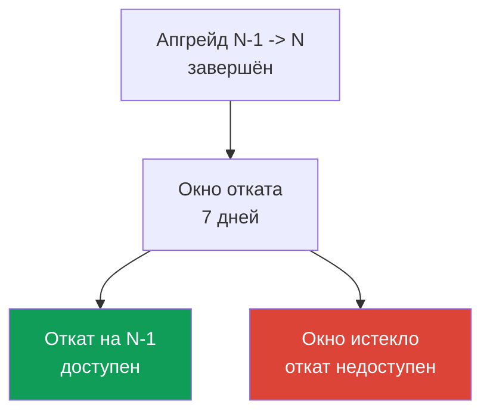
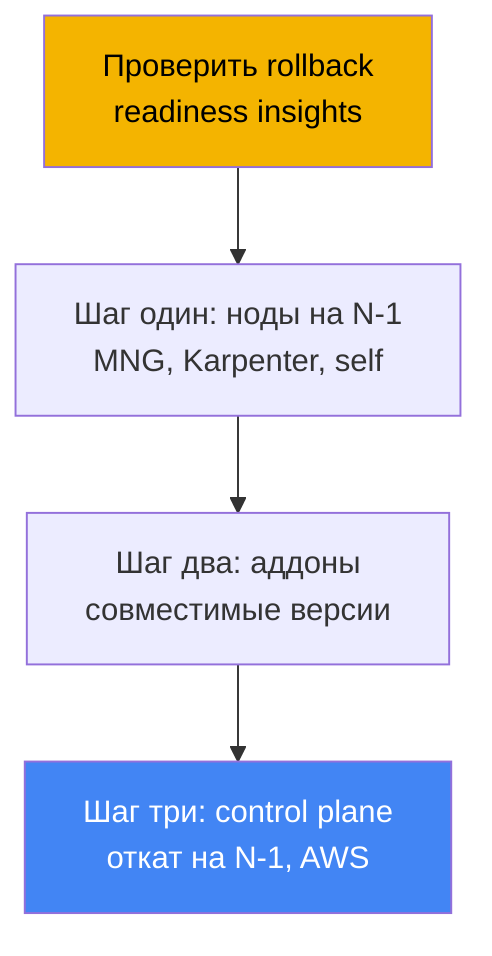
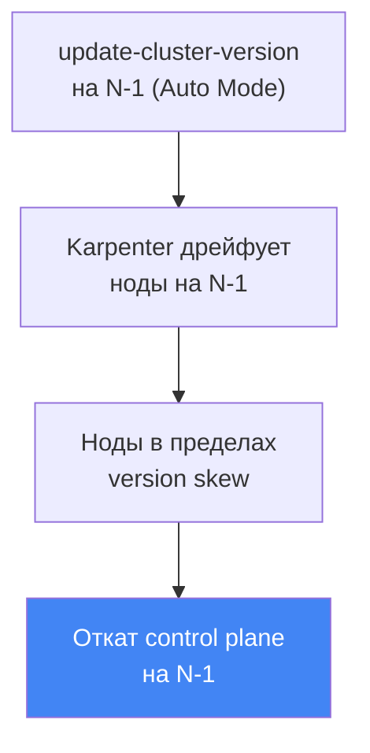

# Глава 39. Откат версии кластера: rollback readiness insights, окно 7 дней, порядок отката

> **Что дальше.** Глава 38 разобрала обновление кластера: жизненный цикл версии, in-place
> апгрейд по одному минору, устаревшие API и blue/green миграцию. Здесь - обратная операция:
> откат control plane на предыдущую минорную версию, когда апгрейд прошёл, а на новой версии
> что-то сломалось. Смежное отдано другим главам: сам апгрейд и blue/green - глава 38, cluster
> insights в целом - глава 38, надёжность, PDB и корректное выключение нод - глава 40, бэкап и
> восстановление состояния кластера - главы 41 и 42, EKS Auto Mode - глава 9.

## 39.1. «Обновились, стало хуже, а назад дороги нет»

Сценарий знакомый по дежурству. Кластер подняли на новый минор строго по процессу из главы 38:
insights чисты, аддоны совместимы, control plane и ноды зелёные. А через час выясняется, что
на новой версии не работает то, что insights поймать не могли: сторонний контроллер падает на
изменившемся поведении API, кастомный оператор не стартует, нагрузка ведёт себя странно после
смены дефолтов kube-apiserver. Апгрейд формально успешен, а прод деградировал.

Исторически это была ловушка без выхода. Обновление Kubernetes однонаправленно: апстрим не
поддерживает понижение минорной версии control plane. Значит, у инженера оставалось два пути,
и оба тяжёлые. Первый - чинить на месте: срочно патчить контроллеры и нагрузки под новую
версию под нагрузкой прода. Второй - blue/green: переключить трафик на заранее поднятый старый
кластер. Но blue/green надо готовить до апгрейда, а при обычном in-place его нет - откатываться
некуда.

EKS закрыл этот разрыв: появился штатный откат версии кластера. Он возвращает control plane на
предыдущий минор без пересоздания кластера. Но у него жёсткие условия - окно всего 7 дней, одна
версия назад и набор блокеров, - и работает он не как «кнопка отмены», а как процедура со своим
порядком. Разберём, что именно откатывается, чего откат не делает, и как не остаться без него в
нужный момент.

## 39.2. Почему откат вообще сложен

В апстриме Kubernetes апгрейд спроектирован как движение в одну сторону. При обновлении
kube-apiserver и etcd переводят объекты в новые схемы, а компоненты на нодах (kubelet)
идут следом. Version skew policy разрешает kubelet быть старее kube-apiserver, но не новее.
Понижение control plane назад апстрим не поддерживает и не тестирует: гарантий, что объекты в
etcd корректно «сконвертируются обратно», нет.

Поэтому EKS реализовал не общий даунгрейд, а ограниченный откат: вернуть **только control
plane** на **одну предыдущую** минорную версию, в **узком окне** после апгрейда, сохранив при
этом данные etcd и нагрузки на месте. Всё, что делает откат безопаснее общего даунгрейда, - это
как раз ограничения: свежий апгрейд (etcd ещё не «оброс» объектами только новой версии), один
минор (небольшой разрыв схем) и проверки готовности, которые ловят несовместимости заранее.



Смысл фичи прямой: откат - это быстрый выход из неудачного апгрейда, пока разрыв версий
маленький и свежий. Это не машина времени для кластера и не замена бэкапу (граница - раздел
39.7).

## 39.3. EKS cluster version rollback: окно 7 дней и одна версия

Откат возвращает control plane на предыдущий минор после in-place апгрейда. EKS откатывает
kube-apiserver и компоненты control plane, а также platform version (на последнюю platform
version предыдущего минора), сохраняя данные etcd, нагрузки и постоянные тома. Ключевые условия
проверяются как предусловия, и их важно знать заранее.

| Условие | Что требуется |
|---|---|
| Окно 7 дней | откат надо запустить в течение 7 дней после завершения апгрейда, потом недоступен |
| Только in-place апгрейд | кластер, созданный сразу на текущей версии, откатить нельзя |
| Один минор назад | только N -> N-1; при `1.31`->`1.32`->`1.33` откат возможен лишь до `1.32` |
| Поддерживаемая версия | целевая версия должна быть в числе поддерживаемых EKS |
| Extended support | для отката на версию в extended support сначала сменить upgrade policy на `EXTENDED` |
| Не auto-upgrade из extended | кластер, автоматически поднятый в конце extended support, откатить нельзя |
| Статус ACTIVE | кластер в статусе `ACTIVE`, без другого идущего обновления |
| Совместимость фич EKS | если включённая фича EKS не поддержана на предыдущей версии, откат отклоняется |

Два тонких момента про auto-upgrade из главы 38. Если EKS сам поднял версию в конце **extended
support** - откат недоступен. Если сам поднял в конце **standard support** - откатить можно, но
предварительно надо сменить upgrade policy кластера на `EXTENDED`. И ещё: при откате с версии в
standard support на версию в extended support снова начинают действовать повышенные тарифы
extended support (структуру стоимости разбирали в главе 38).

Сам откат запускается той же командой, что и апгрейд, только с предыдущей версией:

```bash
# откат control plane на предыдущий минор (N-1)
aws eks update-cluster-version --name my-cluster --kubernetes-version 1.30
```

В ответе тип обновления - `VersionRollback`, а не обычный апгрейд. Прогресс смотрят через
`describe-update` по `id` из ответа (раздел «Практика»).

## 39.4. Rollback readiness insights

Проверять, возможен ли откат, вручную не нужно - для этого есть отдельный тип cluster insights
(глава 38): **rollback readiness insights** в категории `ROLLBACK_READINESS`. Это точечные
(point-in-time) проверки, которые EKS формирует **после апгрейда** и держит доступными ровно в
течение 7-дневного окна отката. Как истечёт окно - insights этого типа для кластера больше не
генерируются. Смотреть их надо сразу после апгрейда, а не когда уже что-то сломалось.

Что проверяют rollback readiness insights:

- совместимость использования API между версиями, вплоть до изменений на уровне полей;
- общее здоровье кластера;
- version skew для kubelet и для kube-proxy (не новее ли ноды, чем целевой control plane);
- совместимость версий аддонов с целевой версией;
- для EKS Auto Mode дополнительно: NodePool disruption budgets, аннотации `do-not-disrupt` и
  конфигурацию PodDisruptionBudget.

У каждого insight есть статус, и от него зависит, пустят ли к откату.

| Статус | Значение | Влияние на откат |
|---|---|---|
| PASSING | проблем не найдено | откат разрешён |
| WARNING | возможная проблема, не блокирует | откат разрешён, это предупреждение |
| ERROR | блокирующая проблема | откат заблокирован, пока не починить (или `--force`) |
| UNKNOWN | статус определить не удалось | откат заблокирован (или `--force`) |

Блокируют откат статусы ERROR и UNKNOWN. Их либо чинят и обновляют insights, либо обходят
`--force`. Важно понимать, что `--force` **обходит только проверки insights** (ERROR, WARNING,
UNKNOWN), но не предусловия: окно 7 дней, «создан на текущей версии», один минор
и совместимость фич EKS через `--force` не обойти. Ответственность за последствия с `--force`
EKS снимает с себя полностью - гарантий безопасности отката с обойдёнными проверками нет.

```bash
# только rollback readiness insights
aws eks list-insights --cluster-name my-cluster \
  --filter '{"categories": ["ROLLBACK_READINESS"]}'
# принудительно обновить insights после починки, не дожидаясь 24 часов
aws eks start-insights-refresh --cluster-name my-cluster
```

EKS обновляет insights раз в 24 часа, а перед самим откатом прогоняет refresh автоматически,
чтобы проверки шли против свежего состояния кластера.

## 39.5. Порядок отката: обратный апгрейду

Порядок отката зеркалит апгрейд из главы 38. Там было: control plane, потом аддоны, потом ноды.
При откате - наоборот, и причина та же version skew policy: **ноды не должны быть новее control
plane**. Если ноды апгрейд уже поднял на N, а control plane мы возвращаем на N-1, то ноды на N
окажутся новее - нарушение скью. Значит, ноды на N надо вернуть на N-1 **до** отката control
plane. Отсюда общий порядок.



Кто чем возвращает ноды - зависит от типа вычислений (глава 9):

| Тип нод | Кто откатывает | Как |
|---|---|---|
| EKS Auto Mode | EKS автоматически | ноды дрейфуют на N-1 **раньше** control plane, без ручных действий |
| Managed node group | вы | `update-nodegroup-version` на предыдущую версию до отката control plane |
| Karpenter | вы | drift: желаемый AMI/версия на N-1, Karpenter пересоздаёт ноды (глава 12) |
| Self-managed / hybrid | вы | меняете AMI/конфиг нод на N-1 сами до отката control plane |
| Fargate | не поддержано | откат Fargate нельзя; удалить поды до отката или `--force` |

Нюанс из главы 9: у **EKS Auto Mode** ноды откатываются **раньше** control plane и делает
это EKS. При вызове `update-cluster-version` с версией N-1 на Auto Mode кластере EKS сначала
дрейфует ноды на AMI предыдущей версии через Karpenter (уважая disruption budgets и PDB),
дожидается, пока все ноды войдут в допустимый version skew, и только потом откатывает control
plane. Пока ноды дрейфуют, кластер остаётся `ACTIVE`, а статус меняется на `UPDATING` уже на
шаге отката control plane. Фаза отката нод может занять от минут до 7 дней в зависимости от
disruption controls.



Отдельный практический совет из best practices AWS: для обычных нод (MNG, self-managed) полезно
разносить апгрейд control plane и нод во времени и держать паузу (bake period). Пока ноды сидят
на N-1, а control plane уже на N, insight про kubelet version skew остаётся PASSING - и путь к
откату открыт без предварительного возврата нод. Это самый дешёвый способ сохранить откат
доступным: не спешить обновлять ноды следом за control plane.

## 39.6. Что блокирует откат и как подготовиться

Блокеры делятся на два класса. Первый - **жёсткие предусловия**, которые не обойти ничем: окно
7 дней истекло; кластер создан сразу на текущей версии (апгрейда не было); кластер уже успели
поднять ещё на минор выше (откат только на один минор); на границе версии включили обратно
несовместимую фичу EKS; auto-upgraded в конце extended support. Второй класс - **блокеры
из insights** (статус ERROR/UNKNOWN), которые можно либо починить, либо обойти `--force`:
несовместимые версии аддонов, объекты на API, которых нет в старой версии, нарушения version
skew, для Auto Mode - `do-not-disrupt` на ноде или бюджет `nodes: 0`.

Самый коварный из «мягких» блокеров - **объекты на новых API**. Если за время жизни на новой
версии вы создали ресурсы через API, которого в старой версии ещё нет, откат control plane
оставит эти объекты без обслуживающего их API. Отсюда практика подготовки: пока идёт 7-дневное
окно, **не спешить принимать API и фичи, доступные только на новой версии**, - иначе сами себе
закроете путь назад. Если такие объекты уже созданы, их удаляют до отката.

Как держать откат доступным на практике:

- смотреть rollback readiness insights сразу после апгрейда и чинить ERROR, пока окно открыто;
- обновлять аддоны на версии, совместимые и со старым, и с новым минором (cross-compatible);
- не гнать ноды на новую версию сразу - держать bake period, чтобы skew-insight был PASSING;
- воздержаться от объектов на новых-только API в течение окна;
- помнить, что insights точечные: изменения в кластере после проверки, но до завершения отката,
  проверкой не покрываются.

## 39.7. Откат - не замена бэкапу

Откат путают с восстановлением из бэкапа, но это разные инструменты с разной границей.
Откат возвращает **версию control plane** и его конфигурацию, а данные etcd, нагрузки и
постоянные тома при этом **сохраняются как есть** - они не откатываются. То есть откат не
отменяет изменения, которые вы внесли в объекты кластера или данные приложений после апгрейда;
он лишь понижает версию kube-apiserver обратно.

Отсюда два следствия. Первое: откат не поможет, если проблема не в версии, а в том, что кто-то
удалил namespace, испортил данные или снёс ресурсы, - нужен бэкап и восстановление состояния
(главы 41 и 42). Второе: объекты, созданные на новой версии и обойдённые `--force`, остаются в
etcd после отката и не собираются сборщиком мусора - они просто «повисают». Граница простая:
**откат - про версию control plane в узком окне, бэкап - про данные и состояние**.

## 39.8. Как это применяют в продакшене

- **Смотрят rollback readiness insights сразу после апгрейда, а не по факту аварии.** Пока
  7-дневное окно открыто, чинят ERROR-инсайты заранее, чтобы путь к откату оставался чистым.
- **Держат bake period между control plane и нодами.** Обычные ноды не гонят на новую версию
  сразу: пока они на N-1, kubelet skew-insight PASSING и откат возможен без возврата нод.
- **Не принимают новые-только API в окне.** Объекты на API, которых нет в старой версии,
  закрывают откат; их адаптацию откладывают, пока не уверены в стабильности апгрейда.
- **Аддоны держат на cross-compatible версиях.** Совместимые и со старым, и с новым минором
  версии аддонов сохраняют add-on compatibility insight чистым для отката (глава 37).
- **Проверяют совместимость сами.** Insights не покрывают self-managed аддоны, кастомные
  контроллеры и уровень приложения - их совместимость с предыдущей версией валидируют сами.
- **Помнят про порядок и Auto Mode.** Для MNG/self-managed ноды возвращают до control plane;
  для Auto Mode это делает EKS раньше отката control plane автоматически.

## 39.9. Мини-глоссарий

- **cluster version rollback** - откат control plane EKS на предыдущий минор после in-place
  апгрейда, в окне 7 дней, с сохранением etcd, нагрузок и томов.
- **окно отката (7 дней)** - период после апгрейда, в течение которого откат доступен;
  по истечении откат и его insights недоступны.
- **rollback readiness insights** - тип cluster insights в категории `ROLLBACK_READINESS`,
  проверяющий готовность к откату; статусы PASSING/WARNING/ERROR/UNKNOWN.
- **VersionRollback** - тип обновления в ответе `update-cluster-version` при откате.
- **--force** - флаг, обходящий проверки insights (ERROR/WARNING/UNKNOWN), но не предусловия
  (окно, один минор, создан-на-версии, совместимость фич).
- **version skew policy** - правило Kubernetes: ноды не новее control plane; диктует
  порядок отката (сначала ноды, потом control plane).
- **bake period** - пауза между апгрейдом control plane и нод: ноды остаются на N-1 и
  откат доступен без их возврата.

## 39.10. Итоги главы

- Апгрейд Kubernetes однонаправлен в апстриме; EKS добавил ограниченный откат control plane на
  одну предыдущую минорную версию, сохраняя данные etcd, нагрузки и постоянные тома.
- Условия жёсткие: окно 7 дней после апгрейда, только in-place-апгрейднутый кластер, один минор
  назад, статус ACTIVE; auto-upgraded в конце extended support откатить нельзя.
- Rollback readiness insights (`ROLLBACK_READINESS`) проверяют совместимость API до полей,
  здоровье, version skew и совместимость аддонов; доступны только внутри 7-дневного окна.
- Статусы ERROR и UNKNOWN блокируют откат; `--force` обходит insights, но не предусловия,
  и снимает с EKS гарантии безопасности.
- Порядок отката обратный апгрейду: сначала ноды на N-1, затем аддоны, затем control plane;
  причина - version skew policy (ноды не новее control plane).
- Ноды возвращают по типу: MNG через `update-nodegroup-version`, Karpenter через drift,
  self-managed сами, Fargate не поддержан; EKS Auto Mode откатывает ноды раньше control plane.
- Блокируют откат: истёкшее окно, объекты на новых-только API, несовместимые аддоны, нарушения
  skew, auto-upgrade из extended; готовятся через ранние insights, bake period и осторожность с
  новыми API.
- Откат - не замена бэкапу: возвращает версию control plane, но не данные и состояние;
  для состояния и данных - бэкап и восстановление (главы 41 и 42).

## 39.11. Как это пригодится в реальной работе

На дежурстве откат меняет цену ошибки апгрейда. Раньше «обновились, стало хуже» означало аврал:
чинить на месте под нагрузкой или поднимать blue/green, которого может и не быть. Теперь у
инженера есть штатный выход - вернуть control plane на предыдущий минор, - но только если о нём
позаботились заранее. Вывод простой: рычаг отката надо не «искать в момент аварии»,
а держать заряженным всю неделю после апгрейда. Это значит смотреть rollback readiness insights
сразу после обновления, чинить ERROR, пока окно открыто, не гнать ноды на новую версию и не
хвататься за новые-только API, пока не уверены в стабильности.

При планировании апгрейда откат добавляет ещё один аргумент в пользу «обновляться раньше, а не
под дедлайн extended support» из главы 38: со штатным откатом можно уверенно накатывать новый
минор вскоре после релиза, зная, что при проблеме есть 7 дней на возврат. Но границы надо
понимать чётко: откат - про версию control plane в узком окне, не спасёт от порчи данных и не
отменит изменения в etcd. Для этого - отдельная линия обороны: бэкап и восстановление (главы 41
и 42) и надёжность нагрузок через PDB и multi-AZ (глава 40).

## 39.12. Вопросы для самопроверки

1. Почему понижение минорной версии control plane в апстриме Kubernetes не поддерживается и что
   именно EKS откатывает вместо общего даунгрейда?
2. Сколько длится окно отката и от какого события отсчитывается?
3. На сколько минорных версий назад можно откатиться и что будет, если после апгрейда успели
   подняться ещё на минор выше?
4. Какие условия отката относятся к жёстким предусловиям, которые нельзя обойти `--force`?
5. Можно ли откатить кластер, который EKS сам поднял в конце extended support? А в конце
   standard support?
6. Что проверяют rollback readiness insights и в какой категории они появляются?
7. Какие статусы insight блокируют откат, а какие нет, и что именно обходит флаг `--force`?
8. В каком порядке идёт откат и почему ноды возвращают до control plane?
9. Чем отличается откат нод у EKS Auto Mode от managed node group?
10. Что происходит с Fargate-подами при откате и как это обходят?
11. Почему объекты, созданные на новых-только API, мешают откату и как этого избежать?
12. Чем откат версии отличается от восстановления из бэкапа и где граница между ними?
13. Что такое bake period и как он помогает держать откат доступным?

## Практика

Лаба курса к этой теме: [лаба 113 - Апгрейд и откат кластера: control plane, аддоны,
устаревшие API](../../labs/113/README_RU.MD). Кроме неё, готовность к откату и историю
обновлений легко снять на живом кластере. Сначала посмотрите текущую версию и историю
обновлений - был ли недавний in-place
апгрейд, от которого отсчитывается окно 7 дней:

```bash
# текущая версия control plane
aws eks describe-cluster --name my-cluster --query 'cluster.version'
# история обновлений: ищите тип VersionUpdate и дату завершения
aws eks list-updates --name my-cluster
```

Затем, если апгрейд был недавно, посмотрите rollback readiness insights и разберите всё, что
помечено ERROR или WARNING:

```bash
# только rollback readiness insights
aws eks list-insights --cluster-name my-cluster \
  --filter '{"categories": ["ROLLBACK_READINESS"]}'
# детали конкретного insight: статус, рекомендация, затронутые ресурсы
aws eks describe-insight --cluster-name my-cluster --id <insight-id>
```

Если вы недавно чинили блокеры, обновите insights вручную и убедитесь, что ERROR ушли, не
дожидаясь суточного refresh:

```bash
# принудительный refresh проверок
aws eks start-insights-refresh --cluster-name my-cluster
# статус конкретного обновления/отката по id из list-updates
aws eks describe-update --name my-cluster --update-id <update-id>
```

Сопоставьте три вещи: дату завершения последнего апгрейда (осталось ли окно 7 дней), статус
rollback readiness insights и то, на какой версии сидят ваши ноды относительно control plane.
Если апгрейд свежий, insights чисты, а ноды не новее целевого минора - путь отката открыт. Если
insights пусты, а апгрейда в истории нет - откатывать нечего, и это ожидаемо. Про надёжность
нагрузок при перекатке нод во время отката - глава 40, про бэкап состояния - главы 41 и 42.

---
[Оглавление](../README_RU.md) · [Глава 38](../38/ru.md) · [Глава 40](../40/ru.md)
