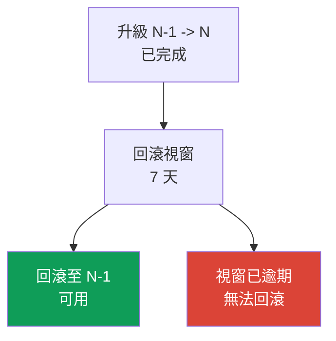
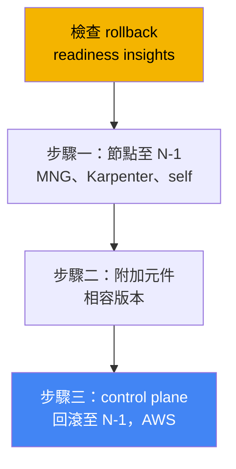
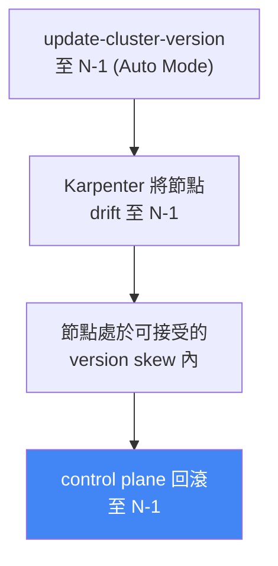

[Русская версия](ru.md) · [Eng version](en.md) · [Versión en español](es.md) · [Version française](fr.md) · [Deutsche Version](de.md) · [ქართული ვერსია](ge.md) · [日本語版](jp.md)

# 第 39 章。叢集版本回滾：rollback readiness insights、7 天視窗與回滾順序

> **接下來。** 第 38 章說明了叢集升級：版本生命週期、一次升級一個 minor 的 in-place 升級、已棄用的 API，以及 blue/green 遷移。這裡討論相反的操作：當升級已完成，但新版本出現問題時，將 control plane 回滾至前一個 minor 版本。相關內容交由其他章節說明：升級本身及 blue/green 見第 38 章、整體 cluster insights 見第 38 章、可靠性、PDB 與正確關閉節點見第 40 章、叢集狀態備份與還原見第 41 與 42 章、EKS Auto Mode 見第 9 章。

## 39.1.「升級後變得更糟，但無路可退」

這是值班時熟悉的情境。叢集嚴格依第 38 章的程序升上新的 minor：insights 都是乾淨的，附加元件相容，control plane 與節點一片綠燈。但一小時後發現，新版本中有些 insight 無法捉到的東西失效了：第三方 controller 因 API 行為改變而崩潰，自訂 operator 無法啟動，負載在 kube-apiserver 預設值變更後出現異常行為。升級形式上成功了，但 production 已劣化。

過去這是無出口的陷阱。Kubernetes 升級是單向的：upstream 不支援降低 control plane 的 minor 版本。因此工程師只剩兩條路，而且都很困難。第一條是在原地修復：在 production 負載下緊急修補 controller 與工作負載，以適應新版本。第二條是 blue/green：把流量切換到預先建立的舊叢集。但 blue/green 必須在升級前準備，而一般的 in-place 升級沒有它，也就無處可回滾。

EKS 填補了這個缺口：它新增了標準的叢集版本回滾。它無須重建叢集即可將 control plane 回到前一個 minor。但它有嚴格的條件：只有 7 天視窗、僅能回退一個版本，還有一組阻擋條件。它不是「取消」按鈕，而是有自身順序的程序。接下來說明究竟會回滾什麼、回滾不會做什麼，以及如何避免在需要時失去它。

## 39.2. 為什麼回滾本來就很困難

在 upstream Kubernetes 中，升級設計為單向前進。更新時，kube-apiserver 與 etcd 會將物件轉換為新 schema，而節點上的元件（kubelet）隨後更新。Version skew policy 允許 kubelet 比 kube-apiserver 舊，但不可更高。upstream 不支援也不測試將 control plane 降回舊版：無法保證 etcd 中的物件能正確地「轉換回去」。

因此，EKS 實作的不是一般性降級，而是受限的回滾：在升級後的**狹窄視窗**中，將**僅有 control plane**回復至**僅前一個** minor 版本，同時保留 etcd 資料與原有工作負載。使回滾比一般降級更安全的，正是這些限制：剛完成的升級（etcd 尚未「長出」僅適用新版本的物件）、僅一個 minor（schema 差距小），以及預先捕捉不相容性的就緒檢查。



這項功能的用意很直接：在版本差距小且升級仍很新時，回滾是失敗升級的快速出口。它不是叢集的時光機，也不能取代備份（界線見 39.7 節）。

## 39.3. EKS cluster version rollback：7 天視窗與一個版本

回滾會在 in-place 升級後，將 control plane 回到前一個 minor。EKS 會回滾 kube-apiserver、control plane 元件及 platform version（前一 minor 的最新 platform version），但保留 etcd 資料、工作負載與持久性磁碟區。關鍵條件會作為先決條件進行檢查，因此務必預先了解。

| 條件 | 要求 |
|---|---|
| 7 天視窗 | 必須在升級完成後 7 天內啟動回滾，之後即不可用 |
| 僅限 in-place 升級 | 直接建立在目前版本的叢集不可回滾 |
| 回退一個 minor | 僅限 N -> N-1；若經歷 `1.31`->`1.32`->`1.33`，只能回滾至 `1.32` |
| 支援的版本 | 目標版本必須仍屬於 EKS 支援的版本 |
| Extended support | 若要回滾至 extended support 中的版本，必須先將 upgrade policy 改為 `EXTENDED` |
| 非從 extended 自動升級 | 在 extended support 結束時被自動升級的叢集無法回滾 |
| ACTIVE 狀態 | 叢集必須處於 `ACTIVE`，且沒有其他正在進行的更新 |
| EKS 功能相容性 | 若啟用的 EKS 功能不支援前一版本，回滾會被拒絕 |

第 38 章的 auto-upgrade 有兩個細微之處。若 EKS 在 **extended support** 結束時自行提升版本，回滾不可用。若它在 **standard support** 結束時自行提升，則可以回滾，但必須先將叢集的 upgrade policy 改為 `EXTENDED`。另外，從 standard support 中的版本回滾到 extended support 中的版本時，extended support 的較高費率會再次生效（費用結構已在第 38 章說明）。

回滾使用的命令與升級相同，只是指定前一個版本：

```bash
# 將 control plane 回滾至前一個 minor（N-1）
aws eks update-cluster-version --name my-cluster --kubernetes-version 1.30
```

回應中的更新類型是 `VersionRollback`，而不是一般的升級。請使用回應中的 `id`，透過 `describe-update` 檢視進度（見「實作」一節）。

## 39.4. Rollback readiness insights

無須手動確認是否可回滾，因為有一種專用的 cluster insights 類型（第 38 章）：`ROLLBACK_READINESS` 類別中的 **rollback readiness insights**。這些是時間點式（point-in-time）檢查，EKS 會在**升級後**產生，並且只在 7 天回滾視窗內保留。視窗到期後，叢集不再產生此類 insight。應在升級後立即查看，而不是等到故障發生時。

rollback readiness insights 會檢查：

- 版本之間 API 使用方式的相容性，包含欄位層級的變更；
- 整體叢集健康狀態；
- kubelet 與 kube-proxy 的 version skew（節點是否比目標 control plane 新）；
- 附加元件版本與目標版本的相容性；
- 對於 EKS Auto Mode，額外檢查 NodePool disruption budgets、`do-not-disrupt` 註解，以及 PodDisruptionBudget 設定。

每個 insight 都有狀態，而該狀態決定是否允許回滾。

| 狀態 | 意義 | 對回滾的影響 |
|---|---|---|
| PASSING | 未發現問題 | 允許回滾 |
| WARNING | 可能有問題，但不會阻擋 | 允許回滾，這是警告 |
| ERROR | 阻擋性問題 | 回滾遭阻擋，直到修復（或使用 `--force`） |
| UNKNOWN | 無法判定狀態 | 回滾遭阻擋（或使用 `--force`） |

ERROR 與 UNKNOWN 狀態會阻擋回滾。可修復它們並重新整理 insights，或以 `--force` 略過。務必了解：`--force` **只會略過 insights 檢查**（ERROR、WARNING、UNKNOWN），不會略過先決條件：7 天視窗、「在目前版本建立」、僅一個 minor，以及 EKS 功能相容性都無法透過 `--force` 略過。使用 `--force` 時，EKS 完全不承擔後果責任，對略過檢查後的回滾不提供安全性保證。

```bash
# 僅列出 rollback readiness insights
aws eks list-insights --cluster-name my-cluster \
  --filter '{"categories": ["ROLLBACK_READINESS"]}'
# 修復後強制重新整理 insights，不必等待 24 小時
aws eks start-insights-refresh --cluster-name my-cluster
```

EKS 每 24 小時更新一次 insights，並會在回滾前自動執行 refresh，使檢查針對叢集的最新狀態進行。

## 39.5. 回滾順序：與升級相反

回滾順序映照第 38 章的升級順序。升級是 control plane、附加元件、節點；回滾則相反，原因同樣是 version skew policy：**節點不可比 control plane 新**。若升級已將節點提升至 N，而我們把 control plane 回到 N-1，N 版節點就會比它新，違反 skew。因此，必須在回滾 control plane **之前**先將 N 版節點回到 N-1。以下是整體順序。



由誰將節點回退，取決於運算類型（第 9 章）：

| 節點類型 | 誰負責回滾 | 作法 |
|---|---|---|
| EKS Auto Mode | EKS 自動處理 | control plane **之前**，節點會自動 drift 至 N-1，無需手動操作 |
| Managed node group | 您 | 在回滾 control plane 前，對前一版本執行 `update-nodegroup-version` |
| Karpenter | 您 | drift：將所需 AMI/版本設為 N-1，Karpenter 會重建節點（第 12 章） |
| Self-managed / hybrid | 您 | 在回滾 control plane 前自行變更節點的 AMI/設定至 N-1 |
| Fargate | 不支援 | 無法回滾 Fargate；回滾前刪除 Pod 或使用 `--force` |

第 9 章的細節是：對 **EKS Auto Mode**，節點會在 control plane **之前**回滾，而且由 EKS 處理。對 Auto Mode 叢集以 N-1 呼叫 `update-cluster-version` 時，EKS 會先透過 Karpenter 將節點 drift 至前一版本的 AMI（遵守 disruption budgets 與 PDB），等待所有節點進入可接受的 version skew 後，才回滾 control plane。在節點 drift 期間，叢集保持 `ACTIVE`，只有在 control plane 回滾步驟時狀態才會變為 `UPDATING`。視 disruption controls 而定，節點回滾階段可持續數分鐘至 7 天。



AWS best practices 還有一項實用建議：對一般節點（MNG、self-managed），應在 control plane 與節點的升級之間拉開時間，並保留暫停期（bake period）。只要節點停留在 N-1、control plane 已是 N，kubelet version skew insight 就仍為 PASSING，且無須先回退節點即可回滾。這是保持回滾可用的最低成本方法：不要在 control plane 後立即升級節點。

## 39.6. 哪些因素阻擋回滾，以及如何準備

阻擋因素分為兩類。第一類是**硬性先決條件**，無法以任何方式略過：7 天視窗已到期；叢集直接建立於目前版本（未曾升級）；叢集已再升高一個 minor（只能回退一個 minor）；在版本邊界重新啟用了不相容的 EKS 功能；在 extended support 結束時被 auto-upgrade。第二類是**來自 insights 的阻擋因素**（ERROR/UNKNOWN 狀態），可修復或以 `--force` 略過：不相容的附加元件版本、舊版本不存在的 API 物件、version skew 違規；對 Auto Mode，還包含節點上的 `do-not-disrupt` 或 `nodes: 0` 預算。

「軟性」阻擋因素中最棘手的是**新 API 上的物件**。若在使用新版本期間，透過舊版本尚未存在的 API 建立資源，回滾 control plane 後，這些物件會失去服務它們的 API。因此準備原則是：在 7 天視窗期間，**不要急著採用僅在新版本可用的 API 與功能**，否則會自行封死退路。若已建立這類物件，應在回滾前刪除。

實務上如何保持回滾可用：

- 升級後立即查看 rollback readiness insights，並在視窗開啟時修復 ERROR；
- 將附加元件更新為同時相容於舊與新 minor 的版本（cross-compatible）；
- 不要立即將節點推上新版本，保留 bake period，使 skew-insight 維持 PASSING；
- 在視窗內避免建立僅支援新 API 的物件；
- 記得 insights 是時間點式檢查：檢查後、回滾完成前的叢集變更不在檢查範圍內。

## 39.7. 回滾不能取代備份

回滾常被誤認為從備份還原，但兩者是邊界不同的工具。回滾會回復 **control plane 版本**及其設定，但 etcd 資料、工作負載與持久性磁碟區都會**保持原樣**，並不回滾。也就是說，回滾不會撤銷升級後對叢集物件或應用程式資料所做的變更；它只會將 kube-apiserver 降回舊版。

由此有兩個結果。第一，若問題不是版本，而是有人刪除 namespace、損毀資料或移除了資源，回滾無法幫忙，需要備份與狀態還原（第 41 與 42 章）。第二，建立於新版本、並以 `--force` 略過的物件會在回滾後留在 etcd 中，且不會被 garbage collector 清理，它們只是「懸掛」在那裡。界線很清楚：**回滾是在狹窄視窗中處理 control plane 版本，備份則處理資料與狀態**。

## 39.8. 在 production 中如何使用

- **升級後立即查看 rollback readiness insights，而非事故發生後才查看。** 在 7 天視窗仍開啟時預先修復 ERROR insights，使回滾路徑保持暢通。
- **在 control plane 與節點之間保留 bake period。** 不要立刻將一般節點升至新版本：當它們仍在 N-1 時，kubelet skew-insight 為 PASSING，且無須回退節點即可回滾。
- **在視窗期間不採用僅限新版本的 API。** 舊版本不存在的 API 物件會阻擋回滾；應延後調整它們，直到確認升級穩定。
- **附加元件維持 cross-compatible 版本。** 同時相容舊與新 minor 的附加元件版本，可使 add-on compatibility insight 在回滾時保持乾淨（第 37 章）。
- **自行檢查相容性。** Insights 不涵蓋 self-managed 附加元件、自訂 controller 與應用程式層級，應自行驗證它們與前一版本的相容性。
- **記住順序與 Auto Mode。** 對 MNG/self-managed，先回退節點再回退 control plane；對 Auto Mode，EKS 會在回滾 control plane 前自動完成這件事。

## 39.9. 迷你詞彙表

- **cluster version rollback**：在 in-place 升級後、7 天視窗內，將 EKS control plane 回滾至前一 minor，並保留 etcd、工作負載與磁碟區。
- **回滾視窗（7 天）**：升級後可進行回滾的期間；到期後，回滾及其 insights 都不可用。
- **rollback readiness insights**：`ROLLBACK_READINESS` 類別中的 cluster insights 類型，用於檢查回滾就緒度；狀態為 PASSING/WARNING/ERROR/UNKNOWN。
- **VersionRollback**：回滾時 `update-cluster-version` 回應中的更新類型。
- **--force**：略過 insights 檢查（ERROR/WARNING/UNKNOWN）的旗標，但不略過先決條件（視窗、僅一個 minor、建立於該版本、功能相容性）。
- **version skew policy**：Kubernetes 規則：節點不可比 control plane 新；它決定回滾順序（先節點，後 control plane）。
- **bake period**：control plane 與節點升級之間的暫停期；節點留在 N-1，無須回退即可保持回滾可用。

## 39.10. 本章重點

- 在 upstream 中，Kubernetes 升級是單向的；EKS 新增受限的 control plane 回滾，可回到前一個 minor，並保留 etcd 資料、工作負載與持久性磁碟區。
- 條件嚴格：升級後 7 天視窗、僅 in-place 升級過的叢集、只能回退一個 minor、狀態必須為 ACTIVE；在 extended support 結束時 auto-upgrade 的叢集不可回滾。
- Rollback readiness insights（`ROLLBACK_READINESS`）會檢查 API 相容性至欄位層級、健康狀態、version skew 及附加元件相容性；僅在 7 天視窗內可用。
- ERROR 與 UNKNOWN 會阻擋回滾；`--force` 可略過 insights，但不可略過先決條件，且 EKS 不再保證安全性。
- 回滾順序與升級相反：先將節點回到 N-1，接著附加元件，最後 control plane；原因是 version skew policy（節點不可比 control plane 新）。
- 節點依類型回退：MNG 使用 `update-nodegroup-version`、Karpenter 使用 drift、self-managed 自行處理、Fargate 不支援；EKS Auto Mode 會在 control plane 前回退節點。
- 回滾阻擋因素包括視窗到期、僅限新 API 的物件、不相容的附加元件、skew 違規，以及從 extended auto-upgrade；可透過及早查看 insights、bake period 與謹慎使用新 API 來準備。
- 回滾不是備份的替代品：它回復 control plane 版本，而不回復資料與狀態；狀態與資料必須使用備份與還原處理（第 41 與 42 章）。

## 39.11. 如何在實際工作中運用

值班時，回滾改變了升級失誤的代價。過去「升級後變得更糟」代表緊急狀況：在負載下原地修復，或建立可能根本不存在的 blue/green。現在工程師有標準的出口，可以將 control plane 回到前一個 minor，但前提是事先維護該出口。結論很簡單：不該「在事故發生時才尋找」回滾槓桿，而要在升級後的一整週都讓它保持就緒。這表示在更新後立即查看 rollback readiness insights，在視窗開啟時修復 ERROR，不急著升級節點，也不要在確認穩定前匆忙採用僅限新版本的 API。

在規劃升級時，回滾提供另一個理由來支持第 38 章的觀點：「較早升級，而不是拖到 extended support 截止期限」。有了標準回滾，就能在發布後不久放心套用新的 minor，知道發生問題時仍有 7 天可以退回。但必須清楚理解邊界：回滾是在狹窄視窗中處理 control plane 版本，無法挽救資料毀損，也不會撤銷 etcd 變更。對此需要另一層防線：備份與還原（第 41 與 42 章），以及透過 PDB 與 multi-AZ 確保工作負載可靠性（第 40 章）。

## 39.12. 自我檢查問題

1. 為什麼 upstream Kubernetes 不支援降低 control plane 的 minor 版本？EKS 改為回滾什麼，而不是執行一般降級？
2. 回滾視窗持續多久，從什麼事件開始計算？
3. 最多可回退幾個 minor 版本？若升級後又提升了一個 minor，會怎樣？
4. 哪些回滾條件是無法用 `--force` 略過的硬性先決條件？
5. 可以回滾在 extended support 結束時由 EKS 自動提升的叢集嗎？在 standard support 結束時呢？
6. rollback readiness insights 檢查什麼，它們出現在哪個類別？
7. 哪些 insight 狀態會阻擋回滾，哪些不會？`--force` 究竟略過什麼？
8. 回滾以什麼順序進行，為什麼節點要在 control plane 前回退？
9. EKS Auto Mode 的節點回滾與 managed node group 有何不同？
10. 回滾時 Fargate Pod 會怎樣，如何處理？
11. 為什麼建立於僅限新版本 API 的物件會妨礙回滾，如何避免？
12. 版本回滾與從備份還原有何差異，兩者的界線在哪裡？
13. 什麼是 bake period，它如何協助維持回滾可用？

## 實作

本課程對應的實驗：[實驗 113：叢集升級與回滾：control plane、附加元件、已棄用的 API](../../labs/113/README_TW.MD)。此外，您可輕易在運行中的叢集取得回滾就緒度與更新歷程。先查看目前版本與更新歷程，確認是否存在近期的 in-place 升級，7 天視窗即由此開始計算：

```bash
# 目前的 control plane 版本
aws eks describe-cluster --name my-cluster --query 'cluster.version'
# 更新歷程：尋找 VersionUpdate 類型與完成日期
aws eks list-updates --name my-cluster
```

接著，若升級剛完成不久，查看 rollback readiness insights，並處理所有標記為 ERROR 或 WARNING 的項目：

```bash
# 僅列出 rollback readiness insights
aws eks list-insights --cluster-name my-cluster \
  --filter '{"categories": ["ROLLBACK_READINESS"]}'
# 特定 insight 的詳細資料：狀態、建議與受影響資源
aws eks describe-insight --cluster-name my-cluster --id <insight-id>
```

若最近修復了阻擋因素，請手動重新整理 insights，並確認 ERROR 已消失，不必等待每日 refresh：

```bash
# 強制重新整理檢查
aws eks start-insights-refresh --cluster-name my-cluster
# 依 list-updates 中的 id 查詢特定更新/回滾的狀態
aws eks describe-update --name my-cluster --update-id <update-id>
```

對照三件事：最近一次升級的完成日期（7 天視窗是否仍在）、rollback readiness insights 的狀態，以及節點相對於 control plane 所處的版本。若升級仍新、insights 乾淨，且節點未比目標 minor 新，回滾路徑就是開放的。若 insights 為空且歷程中沒有升級，就沒有東西可回滾，這是預期結果。關於回滾中滾動節點時的工作負載可靠性，見第 40 章；關於狀態備份，見第 41 與 42 章。

---
[目錄](../README_TW.md) · [第 38 章](../38/tw.md) · [第 40 章](../40/tw.md)
