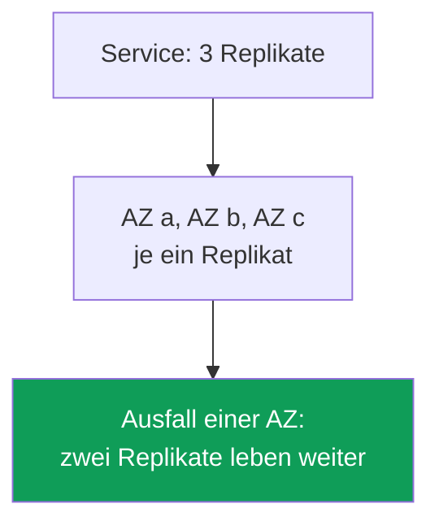
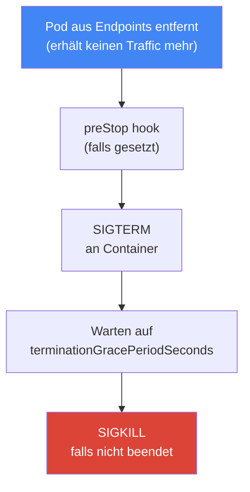
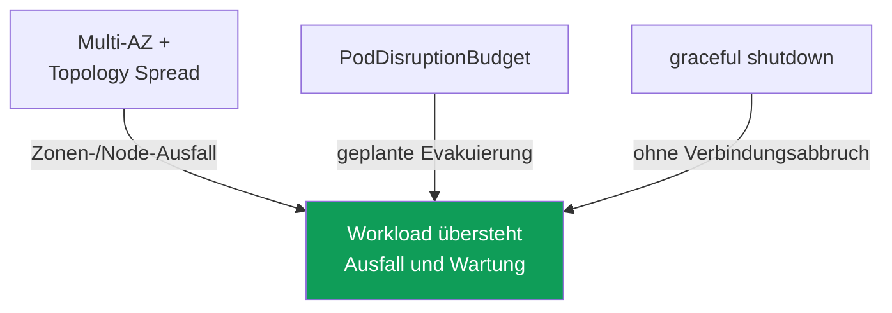

[Русская версия](ru.md) · [Eng version](en.md) · [Versión en español](es.md) · [Version française](fr.md) · [ქართული ვერსია](ge.md) · [繁體中文版](tw.md) · [日本語版](jp.md)
# Kapitel 40. Zuverlässigkeit: Multi-AZ, PDB, Topology Spread, ordnungsgemäßes Herunterfahren von Nodes

> **Wie es weitergeht.** Die Kapitel 38 und 39 behandelten Cluster-Versionen: Upgrade der Control Plane und Nodes sowie das Zurücksetzen im 7-Tage-Fenster. Das ist die Zuverlässigkeit der Control Plane. Hier geht es um die Zuverlässigkeit von Workloads: wie Pods sowohl einen plötzlichen Ausfall (Ausfall einer Node oder Zone) als auch geplante Wartung (`drain`, Upgrade, Konsolidierung) überstehen. Verwandte Themen behandeln andere Kapitel: Disruption und Konsolidierung von Karpenter sowie `do-not-disrupt` in Kapitel 12, Node-Aktualisierung beim Upgrade in Kapitel 38, Spot-Unterbrechungen in Kapitel 13, Cross-AZ-Kosten und `trafficDistribution` in Kapitel 31 sowie Workload-Skalierung (HPA) in Kapitel 35.

## 40.1. „Alle Replikate landeten in einer Zone“

Ein Szenario aus dem Bereitschaftsdienst. Ein Deployment mit drei Replikaten, alles ist grün, die Last wird bewältigt. Eine Availability Zone fällt aus, und der Service ist vollständig ausgefallen, obwohl es drei Replikate gab. Sehen wir uns an, wo sie liefen:

```bash
kubectl get pods -l app=web -o wide
# NAME          READY   STATUS    NODE                          ...
# web-7d..-a2   1/1     Running   ip-10-0-1-15.ec2.internal     # zone eu-west-1a
# web-7d..-b8   1/1     Running   ip-10-0-1-31.ec2.internal     # zone eu-west-1a
# web-7d..-c1   1/1     Running   ip-10-0-1-44.ec2.internal     # zone eu-west-1a
```

Alle drei Replikate befinden sich in einer Zone, manchmal sogar auf einer Node. Der Kubernetes-Scheduler muss Pods standardmäßig nicht über Zonen verteilen: Er sucht eine Node, auf die der Pod hinsichtlich der Ressourcen passt, und kann alle Replikate problemlos nebeneinander platzieren. Solange alles funktioniert, fällt das nicht auf. Der Ausfall einer Zone oder Node verwandelt „drei Replikate“ in null.

Dasselbe Problem gibt es auch geplant. Die Konsolidierung von Karpenter (Kapitel 12), ein Node-Upgrade (Kapitel 38) oder eine Spot-Unterbrechung (Kapitel 13) nehmen eine Node aus dem Cluster. Saßen alle Replikate darauf, werden sie gleichzeitig evakuiert, was einen kurzen, aber vollständigen Ausfall verursacht. Wird die Node dabei abrupt ohne Zeit zum Beenden ausgeschaltet, werden auch offene Verbindungen unterbrochen: Clients erhalten Fehler statt einer geordneten Wiederholung ihrer Anfrage.

Drei verschiedene Probleme: Platzierung, Schutz bei geplanter Evakuierung und geordnetes Beenden. Sie werden jedoch durch einen zusammenhängenden Satz von Mechanismen gelöst: Multi-AZ, Topology Spread, PodDisruptionBudget und ordnungsgemäßes Herunterfahren von Nodes. Sehen wir sie uns nacheinander an und führen sie zusammen.

## 40.2. AZ als Ausfalldomäne

Eine Availability Zone ist ein separater Satz von Rechenzentren in einer Region mit unabhängiger Stromversorgung, Kühlung und Netzwerk. Die Zonen einer Region sind physisch getrennt, daher sollte der Ausfall einer Zone (Stromversorgung, Netzwerk, Naturereignis) die anderen nicht betreffen. Für EKS-Engineers ist eine Zone die grundlegende **Ausfallgrenze**: das, was vollständig ausfällt, wenn „eine Zone ausfällt“.

Ein EKS-Cluster lebt von Anfang an in mehreren Zonen. Die Subnetze sind über AZs verteilt (Kapitel 00-3), Nodes werden in diesen Subnetzen gestartet, und die AWS Control Plane betreibt ihre Komponenten selbst in mehreren Zonen. Jede Node ist an ihre Zone gebunden, und Kubernetes versieht sie mit dem Standard-Label `topology.kubernetes.io/zone`. Genau über dieses Label werden Pods anschließend verteilt.



Daraus folgt das zentrale Zuverlässigkeitsprinzip in AWS: Ein Workload, dessen Verfügbarkeit wichtig ist, sollte mindestens über zwei, besser über drei Zonen verteilt sein. Dann nimmt der Ausfall einer AZ nur einen Teil der Replikate mit. Das betrifft sowohl die Rechenleistung (Nodes in verschiedenen Zonen) als auch Daten: Ein EBS-Volume ist zonal gebunden (Kapitel 23), während EFS und FSx zonenübergreifenden gemeinsamen Speicher bereitstellen (Kapitel 24).

Multi-AZ hat Kosten. Datenverkehr zwischen Zonen wird in beide Richtungen abgerechnet, und Pods über Zonen zu „verteilen“ bedeutet zusätzlichen Cross-AZ-Traffic zwischen Services (Kapitel 31). Es entsteht die Versuchung, alles aus Spargründen in einer Zone zusammenzufassen. Für Workloads, deren Verfügbarkeit wichtig ist, ist das ein Fehler: Die Kosten des zonenübergreifenden Traffics sind nicht mit den Kosten eines Ausfalls beim Ausfall einer Zone vergleichbar. Traffic-Einsparungen (`trafficDistribution: PreferClose` und weitere aus Kapitel 31) werden dort eingesetzt, wo sie sinnvoll sind, nicht um den Preis eines Single Point of Failure. Zuverlässigkeit ist wichtiger als Traffic-Einsparungen.

## 40.3. Freiwillige und unfreiwillige Disruptions

Kubernetes teilt Unterbrechungen des Pod-Betriebs (Disruptions) in zwei Klassen ein, die unterschiedlich geschützt werden. Die Verwechslung dieser Klassen führt häufig zu falschen Erwartungen („Ich habe doch ein PDB, warum ist der Service beim Ausfall einer Node ausgefallen?“).

**Freiwillige Unterbrechungen (voluntary disruptions)** werden bewusst durch einen Operator oder Controller ausgelöst: `kubectl drain` bei Node-Wartung, Node-Upgrades bei einer Cluster-Aktualisierung (Kapitel 38), Konsolidierung und Drift von Karpenter (Kapitel 12), manuelles Löschen eines Pods. Sie lassen sich planen, verlangsamen und ordnen, und genau dafür ist ein PodDisruptionBudget gedacht.

**Unfreiwillige Unterbrechungen (involuntary disruptions)** passieren ungefragt: Hardwareausfall einer Node oder Ausfall einer gesamten AZ, OOM-kill bei Speichermangel, Eviction wegen node-pressure, Spot-Unterbrechung mit zweiminütiger Benachrichtigung (Kapitel 13). Sie lassen sich nicht bitten zu warten: Die Node ist bereits verschwunden. PDB hilft hier nicht, denn dafür ist es nicht da.

| Klasse | Beispiele | Schutzmechanismus |
|---|---|---|
| Voluntary | drain, Node-Upgrade, Karpenter-Konsolidierung, manuelles Löschen | PDB, graceful shutdown |
| Involuntary | Node-/AZ-Ausfall, OOM, node-pressure eviction, Spot-Unterbrechung | Multi-AZ + Topology Spread, Replikate |

Die wichtige Schlussfolgerung: Vor **unfreiwilligen** Unterbrechungen schützt die Verteilung (mehrere Replikate in unterschiedlichen Zonen und auf unterschiedlichen Nodes), vor **freiwilligen** ein Unterbrechungsbudget (PDB) und geordnetes Beenden. Das eine ersetzt das andere nicht.

## 40.4. topologySpreadConstraints: Pods verteilen

`topologySpreadConstraints` ist ein Feld in der Pod-Spezifikation, mit dem wir dem Scheduler sagen: „Halte die Replikate dieses Workloads gleichmäßig über diese Domäne verteilt.“ Die Domäne wird durch ein Node-Label über `topologyKey` festgelegt; in der Praxis sind dies zwei Labels:

- `topology.kubernetes.io/zone`: Verteilung über Zonen (Schutz vor AZ-Ausfall);
- `kubernetes.io/hostname`: Verteilung über Nodes (Schutz vor Ausfall einer einzelnen Node).

Die Schlüsselfelder der Einschränkung:

| Feld | Bedeutung |
|---|---|
| `maxSkew` | zulässiger Unterschied der Pod-Anzahl zwischen der vollsten und leersten Domäne |
| `topologyKey` | Node-Label, das die Domäne bestimmt (Zone, Node) |
| `whenUnsatisfiable` | Verhalten, wenn die Bedingung nicht erfüllt werden kann: `DoNotSchedule` oder `ScheduleAnyway` |
| `labelSelector` | Pods, anhand derer die Verteilung gezählt wird (gewöhnlich Labels der Anwendung selbst) |
| `minDomains` | Mindestanzahl der Domänen, über die verteilt werden muss (nur mit `DoNotSchedule`) |

`maxSkew` misst die Schieflage. Bei `maxSkew: 1` und drei Zonen landet jeweils eines von drei Replikaten pro Zone: Die Differenz zwischen der vollsten und leersten Zone überschreitet nicht 1. `whenUnsatisfiable` bestimmt die Strenge: `DoNotSchedule` ist eine harte Regel, der Pod bleibt `Pending`, wenn eine Platzierung ohne Verletzung von `maxSkew` nicht möglich ist; `ScheduleAnyway` ist weich, der Scheduler versucht die Regel einzuhalten, platziert den Pod bei Unmöglichkeit jedoch trotzdem. `minDomains` ist nützlich, wenn es in einer neuen Zone noch keine Nodes gibt: Es erzwingt, dass mindestens die angegebene Zahl Domänen berücksichtigt wird, und verhindert, dass alles in einer Zone landet, nur weil die anderen noch leer sind.

Eine typische Kombination verwendet zwei Einschränkungen gleichzeitig: hart nach Nodes und weich (oder ebenfalls hart) nach Zonen.

```yaml
topologySpreadConstraints:
  - maxSkew: 1
    topologyKey: topology.kubernetes.io/zone
    whenUnsatisfiable: DoNotSchedule      # strikt über Zonen verteilen
    labelSelector:
      matchLabels: { app: web }
  - maxSkew: 1
    topologyKey: kubernetes.io/hostname
    whenUnsatisfiable: ScheduleAnyway     # über Nodes nach Möglichkeit
    labelSelector:
      matchLabels: { app: web }
```

Wie verhält sich das zu `podAntiAffinity`, das Pods ebenfalls trennt? `podAntiAffinity` ist ein binäres Werkzeug: Bei `requiredDuringScheduling` gilt „nicht mehr als ein Pod pro Domäne“, ohne Abstufungen. `topologySpreadConstraints` ist feiner: Es erlaubt, eine zulässige Schieflage (`maxSkew`) festzulegen, und verbietet nicht das zweite Replikat in einer Zone, sondern gleicht nur die Verteilung aus. Für „so gleichmäßig wie möglich über Zonen und Nodes verteilen“ nimmt man Topology Spread; hartes `podAntiAffinity` bleibt für Fälle „unbedingt nur eins pro Node“ (beispielsweise Workloads, die um eine Node-Ressource konkurrieren).

Eine wichtige Feinheit: Mit `DoNotSchedule` lässt eine zu strenge Verteilung bei fehlenden Nodes in der benötigten Zone einen Pod `Pending`. Zusammen mit Karpenter ist das normal: Ein nicht platzierbarer Pod signalisiert, eine Node in der fehlenden Zone zu starten (Kapitel 12). Bei einem statischen Node-Satz kann ein strenger Spread den Pod lange festhalten. Dann wird entweder auf `ScheduleAnyway` gelockert oder die Node-Balance über die AZs korrigiert.

Ein Sonderfall ist ein Workload mit eigenem Volume. Ein EBS-Volume ist zonal, und seine `nodeAffinity` bindet den Pod dauerhaft an die AZ, in der das Volume erstellt wurde (Kapitel 23). Daher funktioniert die Verteilung eines StatefulSet über Zonen bei der Erstellung von Replikaten, nicht bei deren Umzug: Einen Pod zur Korrektur der Schieflage in einer anderen Zone neu zu erstellen, ist nicht möglich. Er bleibt mit dem Ereignis `volume node affinity conflict` in `Pending`. Daraus folgen zwei Dinge: `volumeBindingMode: WaitForFirstConsumer` ist in der StorageClass verpflichtend, sonst entsteht das Volume vor dem Pod in einer beliebigen Zone, und bei Workloads mit Volumes bestimmt faktisch das Volume die Zone des Replikats, nicht Topology Spread.

### RollingUpdate: Alte Replikate verfälschen die Berechnung der Schieflage

Eine weitere Falle wird erst beim Rollout sichtbar. Bei `RollingUpdate` leben Pods des alten und des neuen ReplicaSet gleichzeitig im Cluster, und der `labelSelector` der Einschränkung verweist gewöhnlich auf das gemeinsame Anwendungslabel (`app: web`). Der Scheduler zählt also alte und neue Pods in derselben Domäne. Bei `maxSkew: 1` und `DoNotSchedule` passt ein neuer Pod nicht in die Zone, in der ein altes Replikat noch lebt, und bleibt `Pending`: Der Rollout tritt auf der Stelle, bis sich die Balance von selbst ergibt.

Das wird mit dem Feld `matchLabelKeys` gelöst. Die darin aufgeführten Label-Schlüssel werden aus dem gerade erzeugten Pod genommen und dem `labelSelector` hinzugefügt. Die Schieflage wird daher nur innerhalb derselben Revision berechnet. Für ein Deployment eignet sich `pod-template-hash`, ein Label, das der Controller jedem ReplicaSet selbst zuweist.

```yaml
topologySpreadConstraints:
  - maxSkew: 1
    topologyKey: topology.kubernetes.io/zone
    whenUnsatisfiable: DoNotSchedule
    labelSelector:
      matchLabels: { app: web }
    matchLabelKeys:
      - pod-template-hash          # Schieflage nach Pods der eigenen Revision zählen
```

Bedingungen, ohne die das Feld nicht funktioniert oder anders funktioniert als erwartet: `matchLabelKeys` wird nur zusammen mit `labelSelector` gesetzt; derselbe Schlüssel darf nicht in beiden Feldern stehen; ein Schlüssel, der beim Pod nicht vorhanden ist, wird stillschweigend ignoriert, sodass ein Tippfehler die Einschränkung in eine gewöhnliche verwandelt. Das Feld befindet sich im Beta-Status und ist seit Kubernetes 1.27 standardmäßig aktiviert, also in aktuellen EKS-Versionen verfügbar. Labels, die direkt auf laufenden Pods geändert werden, gehören nicht in `matchLabelKeys`: Eine solche Änderung übernimmt kube-apiserver nicht in den kombinierten Selector.

## 40.5. PodDisruptionBudget: Schutz bei geplanter Evakuierung

Ein `PodDisruptionBudget` (PDB) ist ein Objekt, das begrenzt, wie viele Pods eines Workloads gleichzeitig durch eine **freiwillige** Unterbrechung evakuiert werden dürfen. Es setzt eine untere oder obere Grenze:

- `minAvailable`: wie viele Pods verfügbar bleiben müssen (Anzahl oder Prozent);
- `maxUnavailable`: wie viele Pods gleichzeitig außer Betrieb genommen werden dürfen.

Die Mechanik ist einfach: Wenn etwas die Eviction API aufruft (und `kubectl drain`, Node-Upgrades sowie Karpenter-Konsolidierung tun genau das), prüft Kubernetes das PDB. Würde die Evakuierung das Budget verletzen, wird sie blockiert, bis genügend gesunde Pods bereitstehen. So entfernt ein Node-Drain nicht alle Replikate zugleich, sondern schreitet einzeln voran und wartet, bis das neue Replikat läuft.

```yaml
apiVersion: policy/v1
kind: PodDisruptionBudget
metadata: { name: web-pdb }
spec:
  minAvailable: 2            # mindestens 2 Pods jederzeit verfügbar halten
  selector:
    matchLabels: { app: web }
```

Die zentrale Einschränkung muss eindeutig verstanden werden: **PDB schützt nur vor freiwilligen Unterbrechungen**. Node-Ausfall, Zonenausfall, OOM und Spot-Unterbrechung kann ein PDB nicht aufhalten: Die Node ist bereits verschwunden, niemand kann nach dem Budget fragen. Vor unfreiwilligen Unterbrechungen schützt die Verteilung (Abschnitte 40.2 und 40.4), nicht das PDB. PDB und Topology Spread lösen verschiedene Hälften der Aufgabe und arbeiten zusammen.

Ein PDB hat auch eine umgekehrte, tückische Seite: **Ein zu strenges Budget blockiert, was es nur verlangsamen sollte**. Klassische Fallstricke:

- `minAvailable` entspricht der Zahl der Replikate (oder `maxUnavailable: 0`): Kein einziger Pod kann evakuiert werden und ein Node-`drain` hängt dauerhaft. Wartung und Node-Upgrades (Kapitel 38) kommen zum Stillstand.
- Dasselbe harte PDB blockiert Konsolidierung und Drift von Karpenter (Kapitel 12): Karpenter respektiert PDBs und evakuiert keine Pods über das Budget hinaus, daher wird die Node weder konsolidiert noch aktualisiert.
- Ein PDB für einen Workload mit nur einem Replikat und `minAvailable: 1`: Jeder Drain dieser Node ist ohne Ausfall unmöglich, und das Budget macht ihn vollständig unmöglich.

Ein gesundes PDB lässt Reserve: Bei drei Replikaten schützt `minAvailable: 2` (oder `maxUnavailable: 1`) vor „alles auf einmal entfernt“, erlaubt aber eine Wartung Pod für Pod. Für Workloads, die geplante Wartung überstehen müssen, sind mindestens zwei Replikate eine Voraussetzung: Mit einem Replikat ist ein PDB entweder nutzlos oder blockiert den Drain vollständig.

### Ein ausgefallener Pod hält den Drain auf: unhealthyPodEvictionPolicy

Es gibt eine feinere Falle als ein hartes Budget, und sie tritt genau dann auf, wenn mit der Anwendung bereits etwas nicht stimmt. Ein Pod, der nicht `Ready` meldet (`CrashLoopBackOff` wegen eines Bugs oder eine fehlgeschlagene Readiness Probe), gilt im PDB-Status nicht als gesund und wird nicht in `status.currentHealthy` aufgenommen. Standardmäßig gilt die Policy `IfHealthyBudget`: Ein ungesunder Pod darf nur evakuiert werden, wenn die Anwendung selbst nicht beeinträchtigt ist, also `currentHealthy` mindestens `desiredHealthy` beträgt. Die Idee ist gut: Dem ohnehin angeschlagenen Workload sollen nicht die letzten Replikate genommen werden.

Dadurch entsteht ein Teufelskreis. Sind von drei Replikaten zwei in `CrashLoopBackOff`, ist `currentHealthy` 1, bei `minAvailable: 2` beträgt `desiredHealthy` 2, die Anwendung ist beeinträchtigt und die Eviction API verweigert selbst die defekten Pods. `kubectl drain` kommt nicht voran, Node-Upgrades (Kapitel 38) und Karpenter-Konsolidierung (Kapitel 12) stehen still, und die Pods werden nicht von selbst gesund: Die Anwendung, nicht der Cluster, ist defekt. Man räumt manuell auf, repariert den Workload, löscht Pods direkt oder entfernt das PDB.

Der reguläre Ausweg ist die Policy `AlwaysAllow`: Ungesunde Pods gelten als beeinträchtigt und werden unabhängig vom Budget evakuiert, während gesunde weiter geschützt bleiben.

```yaml
spec:
  minAvailable: 2
  unhealthyPodEvictionPolicy: AlwaysAllow   # Drain nicht wegen ausgefallener Pods aufhalten
  selector:
    matchLabels: { app: web }
```

Das Feld ist seit Kubernetes 1.31 stabil und funktioniert ohne Feature Gate; wird es nicht gesetzt, gilt `IfHealthyBudget`. Eine Anmerkung zu den Phasen: Pods in `Pending`, `Succeeded` und `Failed` werden immer evakuiert, während die Policy über Pods in der Phase `Running` ohne Bedingung `Ready` entscheidet, also genau `CrashLoopBackOff` und Pods, deren Readiness fehlschlägt. `IfHealthyBudget` behält man dort, wo ein Pod eine Ressource oder Daten bewacht und seine vorzeitige Entfernung gefährlicher ist als festhängende Wartung (Quorum-Systeme, Speicher). Für gewöhnliche Anwendungsworkloads ist `AlwaysAllow` bequemer: Es verhindert, dass ein defektes Deployment den Betrieb des gesamten Clusters blockiert.

## 40.6. Ordnungsgemäßes Herunterfahren von Nodes

Verteilung und PDB lösen, wo Pods laufen und wie viele gleichzeitig evakuiert werden. Es bleibt die dritte Hälfte: Ein evakuierter Pod soll **geordnet** gehen, ohne bediente Anfragen abzubrechen. Das ist der Lebenszyklus des ordnungsgemäßen Beendens.

Die geplante Entfernung einer Node erfolgt in Schritten: Zuerst `cordon` (die Node wird als `SchedulingDisabled` markiert, neue Pods kommen nicht auf sie), dann `drain`, die Evakuierung der Pods über die Eviction API unter Beachtung des PDB. Für jeden Pod führt Kubernetes dieselbe Beendigungssequenz aus:



Sehen wir uns die Felder an. `terminationGracePeriodSeconds` (Standardwert 30) ist die Zeit, die der Pod zwischen SIGTERM und dem harten SIGKILL erhält. In dieser Zeit muss die Anwendung Verbindungen schließen und Anfragen abschließen. `preStop` ist ein Hook, der **vor** SIGTERM ausgeführt wird: Dort wird oft eine kurze Pause gesetzt, damit Load Balancer und kube-proxy Zeit haben, den Pod aus dem Routing zu entfernen, bevor die Anwendung sich beendet.

Warum ist überhaupt eine Pause nötig? Wegen der Asynchronität. Wenn ein Pod verschwindet, wird er gleichzeitig (a) aus den Endpoints/EndpointSlice des Service entfernt und (b) erhält SIGTERM. Das Aktualisieren der Endpoints und das Entfernen des Pods aus dem Load Balancer sind jedoch **asynchron** und nicht sofort abgeschlossen: Eine Weile kann Traffic noch beim bereits beendenden Pod ankommen. Der Pod muss daher zuerst nicht mehr bereit sein und die Endpoints verlassen, bevor er stirbt. Die Readiness Probe ist dabei das Werkzeug: Bei fehlgeschlagener Readiness (oder über die `preStop`-Pause) wird der Pod aus den Endpoints entfernt, bevor er nicht mehr antwortet.

Auf AWS-Seite gibt es eine eigene Ebene, den Load Balancer. Wenn ein Pod hinter NLB oder ALB (Kapitel 26) evakuiert wird, deregistriert AWS Load Balancer Controller sein Target aus der Target Group. Der Load Balancer unterbricht Verbindungen aber nicht sofort: Es gilt **connection draining**, gesteuert durch das Target-Group-Attribut `deregistration_delay.timeout_seconds` (Standardwert 300 Sekunden). Während dieses Fensters sendet der Load Balancer keine neuen Anfragen mehr an das Target, lässt jedoch bereits offene Anfragen abschließen. Der Pod darf nicht sterben, bevor der Load Balancer sein Target deregistriert und aktive Verbindungen abgebaut hat. Ist `terminationGracePeriodSeconds` kürzer als die für die Deregistrierung nötige Zeit, wird ein Teil der Verbindungen abgebrochen. Die Grace Period wird deshalb mit der Deregistrierung abgestimmt, und zur selben Aufgabe gehört die zweite Hälfte: das Eintreffen eines neuen Pods.

### Pod Readiness Gates: Pod bereit, bevor das Target bereit ist

`deregistration_delay` behandelt das Ausscheiden eines Pods aus dem Load Balancer. Beim Eintreffen bleibt eine symmetrische Lücke. Kubernetes betrachtet den Pod anhand seiner Readiness Probe als bereit und setzt auf dieser Grundlage den Rollout fort, indem es den nächsten alten Pod beendet. In AWS befindet sich das neue Target in der Target Group jedoch noch im Status `initial`: Der Load Balancer führt seine Health Checks aus und leitet noch keinen Traffic darauf. Bei einem schnellen Rollout mit wenigen Replikaten entsteht ein Fenster, in dem die Target Group kein Target im Status `healthy` enthält: Die alten sind bereits `draining`, die neuen noch `initial`. Von außen sieht das wie ein Service-Ausfall während eines regulären Deployments aus, obwohl im Cluster alle Pods `Ready` sind.

Diese Lücke schließt ein Pod Readiness Gate von AWS Load Balancer Controller. Der Controller fügt dem Pod eine zusätzliche Readiness-Bedingung mit dem Präfix `target-health.elbv2.k8s.aws` hinzu und hält sie auf false, bis das Target dieses Pods in der Target Group `healthy` ist. Ist der Pod nicht `Ready`, fährt der Deployment-Controller nicht fort und beendet keine alten Pods. Es wird nicht in der Pod-Spezifikation aktiviert, sondern durch ein Label am Namespace: Der Controller trägt die Gate-Konfiguration selbst über einen mutierenden Webhook ein.

```bash
# Injection der Gates für den Namespace aktivieren
kubectl label namespace prod elbv2.k8s.aws/pod-readiness-gate-inject=enabled
# Spalte READINESS GATES: 0/1: Target noch nicht healthy, 1/1: bereit für Traffic
kubectl get pods -n prod -o wide
```

Bedingungen, ohne die das Gate nicht wirkt oder am falschen Ort wirkt: Es funktioniert nur bei `target-type: ip`, denn im Modus `instance` kennt die Target Group die Node, nicht den Pod (Kapitel 26); im Namespace müssen ein Service und ein darauf verweisendes TargetGroupBinding existieren; das Gate wird NUR bei der Erstellung eines Pods eingetragen. Deshalb werden Namespace-Label sowie Service- oder Ingress-Objekte VOR den Pods erstellt, andernfalls bleiben bereits laufende Pods ohne Gate. Separat wird entschieden, was bei nicht verfügbarem Controller geschieht: Dies legt `failurePolicy` des Webhooks fest. `Ignore` lässt Pods ohne Gate durch (Verfügbarkeit ist wichtiger), `Fail` verhindert die Erstellung von Pods in markierten Namespaces (Garantie ist wichtiger).

Ein eigenes Thema ist das **abrupte** Herunterfahren einer Node ohne vorherigen `drain`. Hier helfen abhängig vom Compute-Typ mehrere Mechanismen (Kapitel 9):

| Mechanismus | Wirkung | Wo |
|---|---|---|
| graceful node shutdown (kubelet) | fängt das Herunterfahren des Systems ab, beendet Pods mit Grace vor dem OS-Stopp | wenn im kubelet aktiviert |
| AWS Node Termination Handler (NTH) | verarbeitet Spot ITN, Rebalance und ASG Lifecycle aus einer Queue, führt cordon und drain aus | self-managed / MNG |
| Karpenter interruption | reagiert über seine SQS-Queue auf Unterbrechungen, führt cordon und drain der Node aus | Nodes unter Karpenter (Kapitel 13) |
| EKS Auto Mode | geordnetes Beenden von Nodes sofort verfügbar, ohne manuelle Konfiguration | Auto Mode (Kapitel 9) |

Graceful node shutdown ist eine kubelet-Funktion: Sie abonniert Betriebssystemereignisse zum Herunterfahren und kann beim Stopp der Node Pods unter Beachtung der Grace Period evakuieren, statt sie zusammen mit dem System sterben zu lassen. Upstream ist das Feature Gate aktiviert, die Parameter `shutdownGracePeriod` und `shutdownGracePeriodCriticalPods` haben jedoch standardmäßig den Wert null. Die Funktion muss daher explizit durch nicht null gesetzte Werte in der kubelet-Konfiguration aktiviert werden (Kapitel 10). NTH und Karpenter lösen dieselbe Aufgabe für EC2-Unterbrechungen: Sie erfahren vorab von einem bevorstehenden Stopp der Node (beispielsweise zwei Minuten vor einer Spot-Unterbrechung) und entfernen Pods geordnet. Karpenter verarbeitet Unterbrechungen selbst über eine Interruption Queue; NTH wird für Nodes eingesetzt, die Karpenter nicht verwaltet; bei EKS Auto Mode ist dieses Verhalten eingebaut.

## 40.7. Zusammensetzen

Vier Mechanismen decken unterschiedliche Hälften der Zuverlässigkeit ab und funktionieren nur gemeinsam. Keiner rettet allein.



Die Logik der Kombination:

- **Multi-AZ + Topology Spread** verteilen Replikate über Zonen und Nodes. Der Ausfall einer AZ oder Node nimmt nur einen Teil mit, nicht alles (Schutz vor involuntary Disruptions).
- **PodDisruptionBudget** verhindert, dass geplante Evakuierung alle Replikate gleichzeitig entfernt. Drain, Upgrade und Konsolidierung erfolgen Pod für Pod (Schutz vor voluntary Disruptions).
- **Graceful shutdown** (Grace Period, preStop, connection draining im Load Balancer) beendet einen gehenden Pod ohne Verbindungsabbrüche.

Wird ein Element entfernt, entsteht eine Lücke. Ohne Verteilung schützt PDB vor `drain`, aber ein Zonenausfall legt alles lahm. Ohne PDB übersteht die Verteilung einen Ausfall, aber ein Node-Upgrade entfernt alle Replikate gleichzeitig. Ohne graceful shutdown bricht selbst eine geordnete Evakuierung laufende Anfragen ab. Drei Replikate in drei Zonen, PDB `minAvailable: 2`, eine sinnvolle Grace Period mit preStop und abgestimmtem `deregistration_delay`: Dann übersteht der Workload sowohl Zonenausfall als auch geplante Wartung.

## 40.8. Anwendung in der Produktion

- **Kritische Workloads mindestens über zwei Zonen verteilen.** `topologySpreadConstraints` nach `topology.kubernetes.io/zone` wird in das Deployment-Template gesetzt, nicht „irgendwann später“.
- **Für alles, das ein PDB schützt, mindestens zwei Replikate betreiben.** Mit einem Replikat ist PDB entweder nutzlos oder blockiert Drain und Node-Upgrade vollständig (Kapitel 38).
- **PDB auf „nicht zu streng“ prüfen.** `minAvailable` gleich der Replikatanzahl ist eine typische Ursache für hängenden Drain und blockierte Karpenter-Konsolidierung (Kapitel 12).
- **Grace Period auf die Deregistrierung des Load Balancers abstimmen.** `terminationGracePeriodSeconds` und die `preStop`-Pause berücksichtigen `deregistration_delay` der Target Group, damit keine Verbindungen getrennt werden.
- **Evakuierung ungesunder Pods zulassen.** `unhealthyPodEvictionPolicy: AlwaysAllow` verhindert, dass Pods in `CrashLoopBackOff` Node-Drain und Cluster-Upgrade blockieren (Kapitel 38).
- **Schieflage je eigener Revision berechnen.** `matchLabelKeys` mit `pod-template-hash` in Topology Spread verwenden, sonst lassen Pods des vorherigen ReplicaSet den Rollout in `Pending` hängen.
- **Pod Readiness Gates für Workloads hinter ALB und NLB aktivieren.** Namespace-Label und `target-type: ip`: Der Rollout wartet auf `healthy` in der Target Group, nicht nur auf die Readiness Probe.
- **Die zonale Bindung von Volumes beachten.** Bei StatefulSet mit EBS bestimmt das Volume die Zone des Replikats, nicht Topology Spread (Kapitel 23).
- **Traffic nicht auf Kosten einer einzigen Zone sparen.** Cross-AZ-Traffic (Kapitel 31) ist günstiger als Ausfallzeit; `trafficDistribution` wird eingesetzt, wenn die Verteilung bereits sichergestellt ist.
- **Sich auf die eingebaute Behandlung von Unterbrechungen verlassen.** Karpenter und EKS Auto Mode entfernen Pods von unterbrochenen Nodes selbst; für andere Nodes wird NTH eingesetzt (Kapitel 13).

## 40.9. Mini-Glossar

- **Availability Zone (AZ)**: isolierter Satz von Rechenzentren einer Region; grundlegende Ausfalldomäne, über die Replikate verteilt werden.
- **voluntary disruption**: bewusste Pod-Evakuierung: Drain, Node-Upgrade, Konsolidierung; wird durch PDB geschützt.
- **involuntary disruption**: unkontrolliert: Node-/AZ-Ausfall, OOM, Spot-Unterbrechung; wird durch Verteilung, nicht PDB, geschützt.
- **topologySpreadConstraints**: Pod-Feld zur gleichmäßigen Verteilung von Replikaten über Domänen (`maxSkew`, `topologyKey`, `whenUnsatisfiable`, `minDomains`).
- **maxSkew**: zulässige Schieflage der Pod-Anzahl zwischen der vollsten und der leersten Domäne.
- **PodDisruptionBudget (PDB)**: Objekt, das die Anzahl gleichzeitig evakuierter Pods bei freiwilligen Unterbrechungen begrenzt (`minAvailable`/`maxUnavailable`).
- **`unhealthyPodEvictionPolicy`**: PDB-Feld: `IfHealthyBudget` (Standard) verhindert die Evakuierung ungesunder Pods bei bereits beeinträchtigter Anwendung, `AlwaysAllow` erlaubt sie immer.
- **`matchLabelKeys`**: Pod-Label-Schlüssel, die dem `labelSelector` einer Verteilungseinschränkung hinzugefügt werden; mit `pod-template-hash` wird die Schieflage innerhalb einer Deployment-Revision berechnet.
- **Pod Readiness Gate**: zusätzliche Readiness-Bedingung eines Pods; AWS Load Balancer Controller hält `target-health.elbv2.k8s.aws` auf false, bis das Target `healthy` wird.
- **terminationGracePeriodSeconds**: Zeit zwischen SIGTERM und SIGKILL zum Beenden eines Pods (Standardwert 30).
- **preStop**: Hook, der vor SIGTERM ausgeführt wird; dient für eine Pause vor dem Stopp.
- **connection draining**: Abbau aktiver Verbindungen bei Deregistrierung eines Targets; `deregistration_delay.timeout_seconds` (Standardwert 300).
- **graceful node shutdown**: kubelet-Funktion, die Pods beim Herunterfahren des Betriebssystems mit Grace Period beendet.

## 40.10. Zusammenfassung des Kapitels

- Der Scheduler verteilt Replikate standardmäßig nicht über Zonen und Nodes. Ohne explizite Verteilung können sie in einer AZ landen, deren Ausfall den gesamten Service lahmlegt.
- AZ ist die grundlegende Ausfalldomäne in AWS; kritische Workloads werden mindestens über zwei Zonen mit dem Label `topology.kubernetes.io/zone` verteilt. Zuverlässigkeit ist wichtiger als Einsparungen bei Cross-AZ-Traffic.
- Disruptions werden in freiwillige (Drain, Upgrade, Konsolidierung) und unfreiwillige (Node-/AZ-Ausfall, OOM, Spot) geteilt und durch unterschiedliche Werkzeuge geschützt.
- `topologySpreadConstraints` (`maxSkew`, `topologyKey`, `whenUnsatisfiable`, `minDomains`) verteilen Replikate über Zonen und Nodes und sind feiner als binäres `podAntiAffinity`.
- PDB (`minAvailable`/`maxUnavailable`) schützt nur vor freiwilligen Disruptions. Vor Node- oder Zonenausfall schützt es nicht, dafür ist die Verteilung nötig.
- Ein zu strenges PDB (gleich der Replikatanzahl, `maxUnavailable: 0`) blockiert Drain, Node-Upgrade (Kapitel 38) und Karpenter-Konsolidierung (Kapitel 12). Reserve und mindestens zwei Replikate vorsehen.
- Standardmäßig kann ein ungesunder Pod bei einer bereits beeinträchtigten Anwendung nicht evakuiert werden, sodass `CrashLoopBackOff` Drain bis zum manuellen Eingreifen aufhält. Das löst `AlwaysAllow`.
- Beim Rollout gibt es zwei getrennte Fallen: Alte Replikate verfälschen die Berechnung der Schieflage (gelöst durch `matchLabelKeys`), und ein Pod wird `Ready`, bevor sein Target `healthy` ist (gelöst durch Gates).
- Geordnetes Beenden: cordon, drain, Entfernen aus Endpoints, preStop, SIGTERM, Grace Period, SIGKILL; auf AWS-Seite connection draining über `deregistration_delay`.
- Abruptes Herunterfahren von Nodes wird durch graceful node shutdown im kubelet, NTH, eingebaute Karpenter-Unterbrechungsverarbeitung und EKS Auto Mode abgefedert (Kapitel 9 und 13).
- Zuverlässigkeit = Multi-AZ + Topology Spread (verteilen) + PDB (geplantes schützen) + graceful (keine Verbindungen trennen). Die Mechanismen funktionieren nur zusammen.

## 40.11. Nutzen für die praktische Arbeit

Im Bereitschaftsdienst handelt dieses Kapitel vom Unterschied zwischen „ein Replikat ist ausgefallen“ und „der Service liegt brach“. Wenn eine Zone ausfällt oder Karpenter eine Node konsolidiert, verliert ein korrekt verteilter und geschützter Workload einen Teil seiner Replikate und arbeitet weiter, während ein nicht verteilter vollständig verschwindet. Als Erstes sollte bei jedem kritischen Service `kubectl get pods -o wide` geprüft werden: Wo laufen die Replikate, in wie vielen Zonen und auf wie vielen Nodes? Sind alle in einer, ist das ein auf seinen Zeitpunkt wartender Incident. Gelöst wird er durch Verteilung, nicht durch Analyse um drei Uhr nachts.

Bei der Planung kommen damit mehrere Pflichtpunkte in das Template jedes Deployment, dessen Verfügbarkeit wichtig ist: zwei bis drei Replikate, `topologySpreadConstraints` über Zonen und Nodes, ein angemessenes PDB mit Reserve und durchdachtes Beenden (Grace Period, preStop, Abstimmung mit der Deregistrierung des Load Balancers). Separat wird geprüft, dass das PDB nicht zu streng ist: Gerade ein blockierter Drain verhindert am häufigsten das Cluster-Upgrade (Kapitel 38) und hindert Karpenter an der Node-Konsolidierung (Kapitel 12). Zusammen machen diese Mechanismen sowohl geplante Wartung als auch plötzliche Ausfälle zu Routine statt zu einem Notfall.

## 40.12. Fragen zur Selbstkontrolle

1. Warum können standardmäßig alle Replikate eines Deployment in einer AZ landen, und weshalb ist das gefährlich?
2. Warum gilt eine AZ als grundlegende Ausfalldomäne in AWS, und über welches Node-Label werden Pods verteilt?
3. Wie verhalten sich Multi-AZ-Zuverlässigkeit und die Kosten für Cross-AZ-Traffic zueinander, was ist wichtiger und warum?
4. Wodurch unterscheiden sich freiwillige von unfreiwilligen Disruptions, und mit welchen Werkzeugen werden sie geschützt?
5. Was legen die Felder `maxSkew`, `topologyKey`, `whenUnsatisfiable` und `minDomains` fest?
6. Worin liegt der Unterschied zwischen `DoNotSchedule` und `ScheduleAnyway`, und wann bleibt ein Pod `Pending`?
7. Wieso ist `topologySpreadConstraints` feiner als `podAntiAffinity`, und wann wird welches gewählt?
8. Vor welchen Disruptions schützt PDB, vor welchen nicht und warum?
9. Warum ist ein zu strenges PDB gefährlich, und wie beeinträchtigt es Drain, Upgrade und Konsolidierung?
10. Beschreiben Sie die Beendigungssequenz eines Pods von cordon bis SIGKILL.
11. Warum muss ein Pod die Endpoints vor seinem Tod verlassen, und wie helfen `preStop` und Readiness dabei?
12. Was ist connection draining und wie beeinflusst `deregistration_delay` die Wahl der Grace Period?
13. Wie lösen graceful node shutdown, NTH und die Unterbrechungsverarbeitung von Karpenter das Problem eines abrupten Node-Shutdowns?
14. Warum kann ein Pod in `CrashLoopBackOff` einen `drain` vollständig blockieren, was ändert `unhealthyPodEvictionPolicy: AlwaysAllow`, und wann wird `IfHealthyBudget` bewusst beibehalten?
15. Warum kann ein neuer Pod während `RollingUpdate` wegen Topology Spread in `Pending` bleiben, und wie löst `matchLabelKeys` mit `pod-template-hash` das?
16. Was leistet das Pod Readiness Gate des Controllers, und warum ist es bei `target-type: instance` nutzlos?
17. Warum lässt sich die Verteilung eines StatefulSet mit EBS-Volumes nicht durch Neuerstellung eines Pods in einer anderen Zone ausgleichen, und was folgt daraus für `DoNotSchedule`?

## Praxis

Das Kurs-Lab zu diesem Thema: [Lab 131: Zuverlässigkeit: PDB blockiert Drain, Topology Spread, matchLabelKeys](../../labs/131/README_DE.MD). Dort werden die Verteilung über Zonen mit `topologySpreadConstraints`, das Symptom eines zu strengen `PodDisruptionBudget`, das `kubectl drain` per Timeout scheitern lässt, dessen Behebung, `unhealthyPodEvictionPolicy: AlwaysAllow` und ein Rolling Update mit Prüfung der Schieflage der neuen Revision behandelt. Das Ergebnis wird mit dem Befehl `check_result` geprüft.

Im Folgenden dasselbe auf einem beliebigen eigenen Cluster mit gewöhnlichen Befehlen. Beginnen wir mit der Verteilung: Wo laufen die Replikate eines kritischen Service und in wie vielen Zonen?

```bash
# auf welchen Nodes laufen die Replikate
kubectl get pods -l app=web -o wide
# Zonen der Nodes: NODE oben dem Zonen-Label zuordnen
kubectl get nodes -L topology.kubernetes.io/zone
```

Sehen Sie danach nach, welche PDBs gesetzt sind und ob sie Reserve haben (ALLOWED DISRUPTIONS größer null bedeutet: Drain funktioniert, null bedeutet: blockiert):

```bash
# Disruption Budgets und erlaubte Zahl der Evakuierungen
kubectl get pdb -A
# Details eines bestimmten PDB: minAvailable, aktuelle/erwartete Pods
kubectl describe pdb web-pdb
# Policy für ungesunde Pods: leer bedeutet IfHealthyBudget
kubectl get pdb -A -o custom-columns=NS:.metadata.namespace,PDB:.metadata.name,POLICY:.spec.unhealthyPodEvictionPolicy
```

Sehen Sie sich an, wie eine geplante Evakuierung aussehen würde, ohne sie auszuführen: über einen Dry-Run-Drain. Prüfen Sie außerdem die Node-Beschreibung auf Status und Taint:

```bash
# was bei Drain evakuiert würde, ohne echte Evakuierung
kubectl drain <node> --ignore-daemonsets --dry-run=client
# Node-Status, Zonen-Labels, Taint und Ereignisse
kubectl describe node <node>
```

Vergleichen Sie drei Dinge: Sind die Replikate über Zonen und Nodes verteilt, lässt das PDB Reserve für Evakuierungen und sind bei den Pods `terminationGracePeriodSeconds` und `preStop` gesetzt? Prüfen Sie außerdem bei Workloads hinter ALB und NLB die Spalte `READINESS GATES` in der Ausgabe von `kubectl get pods -o wide`: Eine leere Spalte bedeutet, dass das Namespace-Label fehlt und der Rollout nicht auf `healthy` in der Target Group wartet. Befinden sich die Replikate in einer Zone oder blockiert das PDB jeden Drain, ist das ein künftiger Incident, dessen Behebung jetzt günstiger ist. Zu Karpenter-Disruption siehe Kapitel 12, zu Spot-Unterbrechungen und NTH Kapitel 13 und zu Cross-AZ-Kosten Kapitel 31.

---
[Inhaltsverzeichnis](../README_DE.md) · [Kapitel 39](../39/de.md) · [Kapitel 41](../41/de.md)
