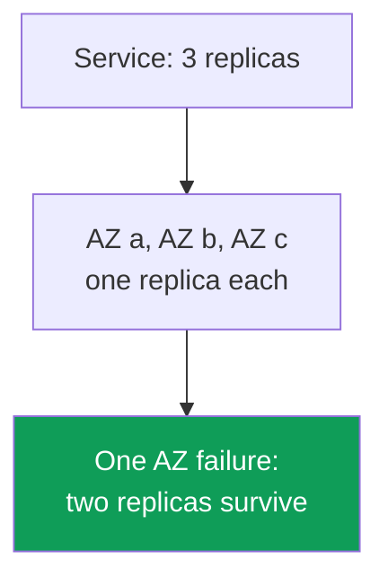
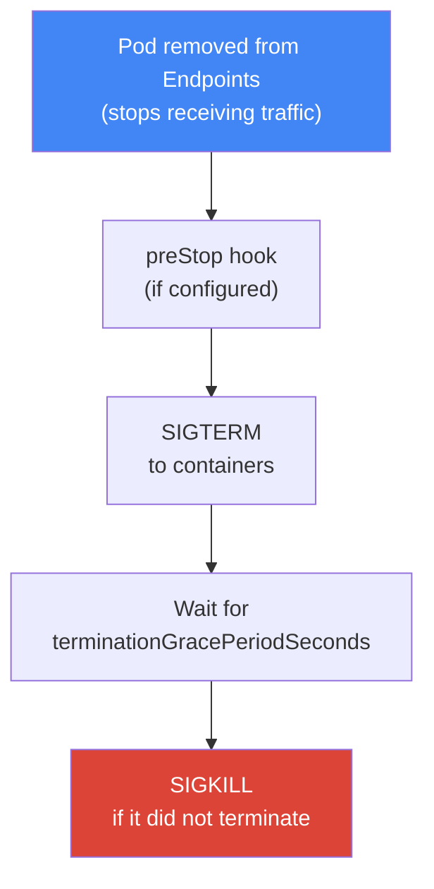
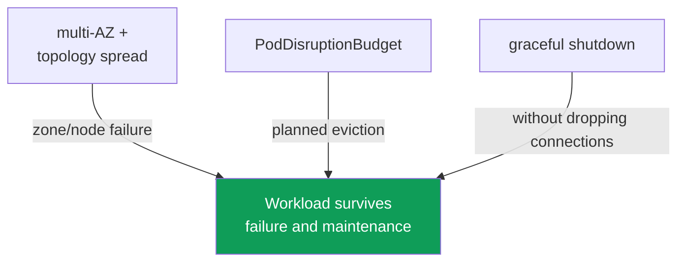

[Русская версия](ru.md) · [Versión en español](es.md) · [Version française](fr.md) · [Deutsche Version](de.md) · [ქართული ვერსია](ge.md) · [繁體中文版](tw.md) · [日本語版](jp.md)
# Chapter 40. Reliability: multi-AZ, PDB, topology spread, graceful node shutdown

> **What comes next.** Chapters 38 and 39 covered cluster versions: control-plane and node upgrades,
> and rollback within the 7-day window. That is control-plane reliability. Here, it is workload
> reliability: how pods survive both a sudden failure (a node or zone outage) and planned maintenance
> (drain, upgrade, consolidation). Related material belongs to other chapters: Karpenter disruption
> and consolidation, and `do-not-disrupt`, Chapter 12; node updates during an upgrade, Chapter 38;
> spot interruptions, Chapter 13; cross-AZ cost and `trafficDistribution`, Chapter 31; workload
> scaling (HPA), Chapter 35.

## 40.1. "All replicas ended up in one zone"

An on-call scenario. A Deployment has three replicas, everything is green, and it handles the load.
One Availability Zone fails, and the service goes down completely, even though it had three replicas.
Look where they were running:

```bash
kubectl get pods -l app=web -o wide
# NAME          READY   STATUS    NODE                          ...
# web-7d..-a2   1/1     Running   ip-10-0-1-15.ec2.internal     # zone eu-west-1a
# web-7d..-b8   1/1     Running   ip-10-0-1-31.ec2.internal     # zone eu-west-1a
# web-7d..-c1   1/1     Running   ip-10-0-1-44.ec2.internal     # zone eu-west-1a
```

All three replicas are in one zone, and sometimes even on one node. By default, the Kubernetes
scheduler is not required to spread pods across zones: it looks for a node where the pod fits by
resources and can quite happily place all replicas together. While everything works, this is
invisible. A zone or node failure turns "three replicas" into zero.

The same problem has a planned version. Karpenter consolidation (Chapter 12), node upgrades
(Chapter 38), or a spot interruption (Chapter 13) removes a node from the cluster. If all replicas
were on that node, they are evicted at once - a short but complete outage. If the node also shuts
down abruptly, with no time to terminate, open connections are broken too: clients get errors rather
than a clean request retry.

These are three distinct problems - placement, protection during planned eviction, and graceful
termination - but they are solved by one connected set of mechanisms: multi-AZ, topology spread,
PodDisruptionBudget, and graceful node shutdown. Let us go through them and put them together.

## 40.2. AZ as a failure domain

An Availability Zone is a separate group of data centers in a Region with independent power,
cooling, and networking. Zones in a Region are physically separated, so failure of one (power,
network, a natural disaster) should not affect the others. For an EKS engineer, a zone is the basic
**failure boundary**: what fails completely when "a zone goes down."

An EKS cluster lives in multiple zones from the start. Subnets are spread across AZs (Chapter 00-3),
nodes are launched in those subnets, and the AWS control plane keeps its own components in multiple
zones. Every node is tied to its zone, and Kubernetes assigns it the standard label
`topology.kubernetes.io/zone`. That is the label used to spread pods later.



This gives the main AWS reliability principle: a workload whose availability matters must be spread
across at least two, and preferably three, zones. Then an AZ failure takes out only some replicas.
This applies to both compute (nodes in different zones) and data: an EBS volume is zonally bound
(Chapter 23), while EFS and FSx provide shared cross-zone storage (Chapter 24).

Multi-AZ has a cost. Traffic between zones is charged in both directions, and spreading pods across
zones adds cross-AZ traffic between services (Chapter 31). It is tempting to put everything in one
zone to save money. For workloads whose availability matters, that is a mistake: the cost of
inter-zone traffic is incomparable with the cost of downtime during a zone failure. Apply traffic
savings (`trafficDistribution: PreferClose` and the other measures in Chapter 31) where they fit,
not at the price of a single point of failure. Reliability matters more than traffic savings.

## 40.3. Voluntary and involuntary disruptions

Kubernetes divides pod disruptions into two classes, and they are protected differently. Confusing
them is a common source of false expectations ("I have a PDB, so why did the service fail when a
node went down?").

**Voluntary disruptions** are deliberately initiated by an operator or controller: `kubectl drain`
during node maintenance, node upgrades during a cluster update (Chapter 38), Karpenter consolidation
and drift (Chapter 12), or manually deleting a pod. They can be planned, slowed down, and ordered -
and PodDisruptionBudget is designed specifically for them.

**Involuntary disruptions** happen without asking: a hardware node failure or an entire AZ outage,
an OOM kill due to insufficient memory, eviction for node pressure, or a spot interruption with a
two-minute notice (Chapter 13). You cannot ask them to wait: the node has already disappeared. A PDB
does not help here - that is not what it is for.

| Class | Examples | Protection |
|---|---|---|
| Voluntary | drain, node upgrade, Karpenter consolidation, manual deletion | PDB, graceful shutdown |
| Involuntary | node/AZ failure, OOM, node-pressure eviction, spot interruption | multi-AZ + topology spread, replicas |

The conclusion to keep in mind: **involuntary** disruptions are handled by placement (multiple
replicas in different zones and on different nodes), while **voluntary** disruptions are handled by
a disruption budget (PDB) and graceful termination. Neither replaces the other.

## 40.4. topologySpreadConstraints: spreading pods

`topologySpreadConstraints` is a field in a pod specification that tells the scheduler: "keep the
replicas of this workload evenly spread across this domain." The domain is defined by a node label
through `topologyKey`; in practice, these are two labels:

- `topology.kubernetes.io/zone` - spread across zones (protection from an AZ failure);
- `kubernetes.io/hostname` - spread across nodes (protection from a single node failure).

The key constraint fields are:

| Field | What it defines |
|---|---|
| `maxSkew` | allowed difference in pod count between the fullest and emptiest domain |
| `topologyKey` | node label that defines the domain (zone, node) |
| `whenUnsatisfiable` | what to do if the condition cannot be satisfied: `DoNotSchedule` or `ScheduleAnyway` |
| `labelSelector` | which pods to count for the spread (usually the application's own labels) |
| `minDomains` | minimum number of domains across which to spread (only with `DoNotSchedule`) |

`maxSkew` measures imbalance. With `maxSkew: 1` and three zones, three replicas are placed one per
zone: the difference between the fullest and emptiest zone does not exceed 1. `whenUnsatisfiable`
defines strictness: `DoNotSchedule` is a strict rule, and the pod remains `Pending` if it cannot be
placed without violating `maxSkew`; `ScheduleAnyway` is soft, so the scheduler tries to comply but
still places the pod when it cannot. `minDomains` is useful when a new zone has no nodes yet: it
makes the scheduler treat the required number of domains as no fewer than the specified value, and
prevents placing everything in one zone merely because the others are still empty.

A typical combination uses two constraints at once: strict across nodes, and soft (or also strict)
across zones.

```yaml
topologySpreadConstraints:
  - maxSkew: 1
    topologyKey: topology.kubernetes.io/zone
    whenUnsatisfiable: DoNotSchedule      # strictly spread across zones
    labelSelector:
      matchLabels: { app: web }
  - maxSkew: 1
    topologyKey: kubernetes.io/hostname
    whenUnsatisfiable: ScheduleAnyway     # across nodes when possible
    labelSelector:
      matchLabels: { app: web }
```

How does this compare with `podAntiAffinity`, which also separates pods? `podAntiAffinity` is a
boolean tool: with `requiredDuringScheduling`, it says "no more than one pod per domain," with no
gradation. `topologySpreadConstraints` is more nuanced: it lets you specify acceptable imbalance
(`maxSkew`) and does not forbid a second replica in a zone, but rather balances the distribution. Use
topology spread to spread across zones and nodes as evenly as possible; reserve strict
`podAntiAffinity` for cases where it must categorically be one pod per node (for example,
workloads competing for a node resource).

An important nuance: with `DoNotSchedule`, an overly strict spread when there are not enough nodes in
the needed zone leaves a pod `Pending`. Together with Karpenter, this is expected: an unplaceable
pod is a signal to launch a node in the missing zone (Chapter 12). With a static set of nodes, strict
spread can leave a pod pending for a long time - then either relax it to `ScheduleAnyway` or fix the
AZ balance of nodes.

A workload with its own volume is a separate case. An EBS volume is zonal, and its `nodeAffinity`
permanently ties the pod to the AZ where the volume was created (Chapter 23). Therefore, spreading a
StatefulSet across zones works when replicas are created, not when they are moved: recreating a pod
in another zone to balance skew is impossible - it remains `Pending` with a `volume node affinity
conflict` event. This has two consequences: `volumeBindingMode: WaitForFirstConsumer` in the
StorageClass is mandatory, otherwise a volume appears in an arbitrary zone before its pod; and for
workloads with volumes, the replica's zone is effectively determined by its volume, not topology
spread.

### RollingUpdate: old replicas distort skew calculation

Another trap appears only during a rollout. With `RollingUpdate`, pods of the old and new ReplicaSets
exist at the same time, while the constraint's `labelSelector` usually points to a shared application
label (`app: web`). That means the scheduler counts both old and new pods in one domain. With
`maxSkew: 1` and `DoNotSchedule`, a new pod cannot fit in a zone where an old replica is still
running and stays `Pending`: the rollout stalls until the balance eventually converges on its own.

The fix is `matchLabelKeys`. Keys listed there are taken from the pod being created and added to the
`labelSelector`, so skew is calculated only within its own revision. For a Deployment,
`pod-template-hash` works - it is a label the controller assigns to every ReplicaSet itself.

```yaml
topologySpreadConstraints:
  - maxSkew: 1
    topologyKey: topology.kubernetes.io/zone
    whenUnsatisfiable: DoNotSchedule
    labelSelector:
      matchLabels: { app: web }
    matchLabelKeys:
      - pod-template-hash          # calculate skew among pods of this revision
```

Conditions without which the field does not work, or does not work as expected: `matchLabelKeys` is
specified only together with `labelSelector`; the same key cannot appear in both fields; a key absent
from a pod is silently ignored, so a typo in the name turns the constraint into an ordinary one. The
field has beta status and is enabled by default since Kubernetes 1.27, so it is available on current
EKS versions. Do not use labels that are edited directly on live pods in `matchLabelKeys`: the
kube-apiserver does not transfer such an edit into the combined selector.

## 40.5. PodDisruptionBudget: protection during planned eviction

A `PodDisruptionBudget` (PDB) is an object that limits how many pods of a workload can be evicted at
once by a **voluntary** disruption. It defines either a lower or upper bound:

- `minAvailable` - how many pods must remain available (a number or percentage);
- `maxUnavailable` - how many pods can be made unavailable at once.

The mechanism is simple: when something calls the eviction API (and `kubectl drain`, node upgrades,
and Karpenter consolidation do exactly that), Kubernetes checks the PDB. If eviction would violate
the budget, it is blocked until enough healthy pods are running. Thus, draining a node does not take
down all replicas at once, but goes one by one, waiting for a new replica to start.

```yaml
apiVersion: policy/v1
kind: PodDisruptionBudget
metadata: { name: web-pdb }
spec:
  minAvailable: 2            # always keep at least 2 pods available
  selector:
    matchLabels: { app: web }
```

The key limitation that must be understood firmly: **a PDB protects only from voluntary
disruptions**. A node failure, zone outage, OOM, or spot interruption is not stopped by a PDB - the
node has already disappeared, and there is nobody to ask for a budget. Placement (Sections 40.2 and
40.4), not a PDB, protects from involuntary disruptions. PDB and topology spread solve different
halves of the problem and work together.

A PDB has a treacherous reverse side: an **overly strict budget blocks what it was only supposed to
slow down**. Classic pitfalls:

- `minAvailable` equals the number of replicas (or `maxUnavailable: 0`): not even one pod can be
  evicted, and node `drain` hangs forever - maintenance and node upgrades (Chapter 38) stop.
- the same strict PDB blocks Karpenter consolidation and drift (Chapter 12): Karpenter respects PDBs
  and does not evict pods beyond the budget, so the node is neither consolidated nor updated.
- a PDB on a single-replica workload with `minAvailable: 1`: draining that node is impossible without
  downtime, and the budget makes it impossible altogether.

A healthy PDB leaves headroom: for three replicas, `minAvailable: 2` (or `maxUnavailable: 1`)
protects from "everything was removed at once" while letting maintenance proceed one pod at a time.
For workloads that must survive planned maintenance, at least two replicas are a prerequisite: with
one replica, a PDB is either useless or permanently blocks drain.

### A failed pod holds up drain: unhealthyPodEvictionPolicy

There is a subtler trap than a strict budget, and it occurs precisely when the application is already
unhealthy. A pod that does not report `Ready` (`CrashLoopBackOff` due to a bug or a failed readiness
probe) is not considered healthy in PDB status and is not included in `status.currentHealthy`. By
default, the `IfHealthyBudget` policy applies: an unhealthy pod may be evicted only if the application
itself is not disrupted, meaning `currentHealthy` is at least `desiredHealthy`. The intent is sound -
do not take the last replicas from an application that is already struggling.

This creates a vicious circle. Suppose two of three replicas are in `CrashLoopBackOff`:
`currentHealthy` is 1, with `minAvailable: 2`, `desiredHealthy` is 2, the application is disrupted -
and the eviction API refuses even the broken pods. `kubectl drain` cannot proceed, node upgrades
(Chapter 38) and Karpenter consolidation (Chapter 12) stop, and the pods do not become healthy on
their own: the application is broken, not the cluster. It must be cleared manually - fix the
workload, delete the pods directly, or remove the PDB.

The normal solution is the `AlwaysAllow` policy: unhealthy pods are considered disrupted and are
evicted regardless of the budget, while healthy ones remain protected.

```yaml
spec:
  minAvailable: 2
  unhealthyPodEvictionPolicy: AlwaysAllow   # do not let failed pods hold up drain
  selector:
    matchLabels: { app: web }
```

The field is stable since Kubernetes 1.31 and works without a feature gate; if it is omitted,
`IfHealthyBudget` applies. A caveat about phases: pods in `Pending`, `Succeeded`, and `Failed` are
always evicted, while the policy decides the fate of `Running` pods without the `Ready` condition -
that is, precisely `CrashLoopBackOff` pods and those failing readiness. Keep `IfHealthyBudget` where
a pod guards a resource or data and deleting it too early is more dangerous than stalled maintenance
(quorum systems, storage). For ordinary application workloads, `AlwaysAllow` is more convenient: it
prevents a broken deployment from blocking operation of the entire cluster.

## 40.6. Graceful node shutdown

Placement and PDB solve where pods run and how many are evicted at once. The third part remains: an
evicted pod must leave **gracefully**, without dropping requests it is serving. This is the graceful
termination lifecycle.

Planned node removal proceeds in steps: first `cordon` (the node is marked
`SchedulingDisabled`, and no new pods arrive), then `drain` - pod eviction through the eviction API
while respecting PDBs. Kubernetes performs the same termination sequence for every pod:



Let us examine the fields. `terminationGracePeriodSeconds` (30 by default) is how long a pod waits
between SIGTERM and a forced SIGKILL. During that time, the application must close connections and
finish requests. `preStop` is a hook that runs **before** SIGTERM: it often contains a short pause to
give load balancers and kube-proxy time to remove the pod from routing before the application begins
to stop.

Why is a pause needed at all? Because of desynchronization. When a pod leaves, it is simultaneously
(a) removed from the Service's Endpoints/EndpointSlice and (b) sent SIGTERM. But updating Endpoints
and removing the pod from the load balancer happen **asynchronously** and are not instantaneous: for
a while, traffic can still arrive at a pod that is already terminating. Therefore, the pod must first
stop being ready and leave endpoints, then die. A readiness probe is the tool here: by failing
readiness (or with a `preStop` pause), the pod is removed from endpoints before it stops responding.

AWS has its own layer - the load balancer. When a pod behind an NLB or ALB (Chapter 26) is evicted,
the AWS Load Balancer Controller deregisters its target from the target group. But the load balancer
does not drop connections immediately: **connection draining** applies, controlled by the target
group attribute `deregistration_delay.timeout_seconds` (300 seconds by default). During this window,
the load balancer stops sending new requests to the target but lets already-open connections finish.
The point is that the pod must not die before the load balancer deregisters its target and drains
active connections. If `terminationGracePeriodSeconds` is shorter than the time needed for
deregistration, some connections will be dropped. Therefore, align the grace period with
deregistration, while the same task has a second half - the arrival of a new pod.

### Pod readiness gates: a pod is ready before its target is

`deregistration_delay` handles a pod leaving the load balancer. On arrival, a symmetric gap remains.
Kubernetes considers a pod ready based on its readiness probe and continues the rollout on that basis,
terminating the next old pod. But in AWS, the new target in the target group is still `initial`: the
load balancer runs its health checks and does not yet send it traffic. In a fast rollout with few
replicas, there is a window where the target group has no target in `healthy` state - old targets are
already `draining`, while new ones are still `initial`. From outside, this looks like a service
outage during a normal deployment, although all pods in the cluster are `Ready`.

A pod readiness gate from the AWS Load Balancer Controller closes the window. The controller adds an
additional readiness condition prefixed `target-health.elbv2.k8s.aws` to the pod and keeps it false
until the target for that pod becomes `healthy` in the target group. The pod is not `Ready` - the
Deployment controller does not continue and terminate old pods. It is enabled not in the pod
specification but by a namespace label: the controller writes the gate configuration itself through a
mutating webhook.

```bash
# enable gate injection for a namespace
kubectl label namespace prod elbv2.k8s.aws/pod-readiness-gate-inject=enabled
# READINESS GATES column: 0/1 means the target is not healthy yet, 1/1 means ready for traffic
kubectl get pods -n prod -o wide
```

Conditions without which the gate does not work, or works somewhere else: it works only with
`target-type: ip`, because in `instance` mode the target group knows the node rather than the pod
(Chapter 26); the namespace must contain a Service and a TargetGroupBinding that refers to it; the
gate is written ONLY during pod creation, so the namespace label and Service or Ingress objects must
be created BEFORE pods, otherwise already-running pods remain without a gate. Decide separately what
to do if the controller is unavailable: this is set by the webhook `failurePolicy` - `Ignore` lets
pods through without a gate (availability matters more), while `Fail` prevents pod creation in
labelled namespaces (the guarantee matters more).

A separate topic is an **abrupt** node shutdown, when there was no `drain` step. Several mechanisms
help here, depending on the compute type (Chapter 9):

| Mechanism | What it does | Where |
|---|---|---|
| graceful node shutdown (kubelet) | catches a system shutdown, terminates pods with grace before the OS stops | if enabled in kubelet |
| AWS Node Termination Handler (NTH) | catches spot ITN, rebalance, ASG lifecycle events from a queue, cordons and drains | self-managed / MNG |
| Karpenter interruption | responds to interruptions through its SQS queue, cordons and drains the node | Karpenter nodes (Chapter 13) |
| EKS Auto Mode | graceful node termination out of the box, with no manual setup | Auto Mode (Chapter 9) |

Graceful node shutdown is a kubelet feature: it subscribes to OS shutdown events and, when a node is
stopping, has time to evict pods while observing their grace period instead of letting them die with
the system. The upstream feature gate is enabled, but `shutdownGracePeriod` and
`shutdownGracePeriodCriticalPods` default to zero - the feature must be explicitly enabled by setting
non-zero values in kubelet configuration (Chapter 10). NTH and Karpenter solve the same problem for
EC2 interruptions: they learn about an upcoming node shutdown ahead of time (for example, two minutes
before a spot interruption) and gracefully move pods away. Karpenter handles interruptions itself
through its interruption queue; install NTH for nodes that Karpenter does not manage; in EKS Auto Mode
this behavior is built in.

## 40.7. Putting it together

The four mechanisms cover different parts of reliability and work only together. None saves you alone.



The logic of the combination:

- **multi-AZ + topology spread** distribute replicas across zones and nodes - an AZ or node failure
  takes away only part, not everything (involuntary protection).
- **PodDisruptionBudget** prevents planned eviction from removing replicas at once - drain, upgrade,
  and consolidation proceed one pod at a time (voluntary protection).
- **graceful shutdown** (grace period, preStop, connection draining at the load balancer) terminates
  the departing pod without dropping connections.

Remove any element and a gap appears. Without placement, PDB protects from drain, but a zone failure
takes down everything. Without PDB, placement survives a failure, but a node upgrade removes replicas
at once. Without graceful shutdown, even careful eviction drops live requests. Three replicas in three
zones, PDB `minAvailable: 2`, a sensible grace period with preStop and matching
`deregistration_delay` - and the workload withstands both a zone outage and planned maintenance.

## 40.8. How this is used in production

- **Spread critical workloads across at least two zones.** Put `topologySpreadConstraints` by
  `topology.kubernetes.io/zone` in the Deployment template, not "sometime later."
- **Keep at least two replicas for everything protected by a PDB.** With one replica, a PDB is either
  useless or permanently blocks drain and node upgrades (Chapter 38).
- **Check that a PDB is not too strict.** `minAvailable` equal to the replica count is a typical
  cause of stuck drain and blocked Karpenter consolidation (Chapter 12).
- **Align the grace period with load balancer deregistration.** `terminationGracePeriodSeconds` and
  the `preStop` pause account for target group `deregistration_delay` so connections are not dropped.
- **Allow unhealthy pods to be evicted.** `unhealthyPodEvictionPolicy: AlwaysAllow` prevents pods in
  `CrashLoopBackOff` from blocking node drain and cluster upgrades (Chapter 38).
- **Calculate skew by revision.** Use `matchLabelKeys` with `pod-template-hash` in topology spread,
  otherwise pods from the previous ReplicaSet leave the rollout `Pending`.
- **Enable pod readiness gates for workloads behind ALB and NLB.** A namespace label and
  `target-type: ip` make rollout wait for `healthy` in the target group, not only the readiness probe.
- **Remember zonal volume affinity.** For a StatefulSet with EBS, the replica's zone is determined by
  its volume, not topology spread (Chapter 23).
- **Do not save on traffic at the cost of a single zone.** Cross-AZ traffic (Chapter 31) costs less
  than downtime; apply `trafficDistribution` only after placement is ensured.
- **Rely on built-in interruption handling.** Karpenter and EKS Auto Mode move pods from interrupted
  nodes themselves; install NTH for other nodes (Chapter 13).

## 40.9. Mini-glossary

- **Availability Zone (AZ)** - an isolated group of data centers in a Region; the basic failure
  domain across which replicas are spread.
- **voluntary disruption** - deliberate pod eviction: drain, node upgrade, consolidation; protected
  by a PDB.
- **involuntary disruption** - uncontrolled: node/AZ failure, OOM, spot interruption; protected by
  placement, not a PDB.
- **topologySpreadConstraints** - a pod field for even replica distribution across domains
  (`maxSkew`, `topologyKey`, `whenUnsatisfiable`, `minDomains`).
- **maxSkew** - allowed imbalance in pod count between the fullest and emptiest domain.
- **PodDisruptionBudget (PDB)** - an object limiting the number of pods evicted at once during
  voluntary disruptions (`minAvailable`/`maxUnavailable`).
- **`unhealthyPodEvictionPolicy`** - a PDB field: `IfHealthyBudget` (the default) does not allow
  unhealthy pods to be evicted when the application is already disrupted; `AlwaysAllow` always does.
- **`matchLabelKeys`** - pod label keys added to a spread constraint's `labelSelector`; with
  `pod-template-hash`, skew is calculated within one Deployment revision.
- **pod readiness gate** - an additional pod readiness condition; the AWS Load Balancer Controller
  keeps `target-health.elbv2.k8s.aws` false until the target becomes `healthy`.
- **terminationGracePeriodSeconds** - time between SIGTERM and SIGKILL for pod termination
  (30 by default).
- **preStop** - a hook that runs before SIGTERM; used for a pause before stopping.
- **connection draining** - draining active connections while deregistering a target;
  `deregistration_delay.timeout_seconds` (300 by default).
- **graceful node shutdown** - a kubelet feature that terminates pods with a grace period when the OS
  stops.

## 40.10. Chapter summary

- The scheduler does not spread replicas across zones and nodes by default; without explicit
  placement, they may end up in one AZ, and its failure takes down the whole service.
- An AZ is the basic AWS failure domain; spread critical workloads across at least two zones using
  the `topology.kubernetes.io/zone` node label. Reliability matters more than cross-AZ traffic savings.
- Disruptions are voluntary (drain, upgrade, consolidation) or involuntary (node/AZ failure, OOM,
  spot); different tools protect against them.
- `topologySpreadConstraints` (`maxSkew`, `topologyKey`, `whenUnsatisfiable`, `minDomains`) spread
  replicas across zones and nodes; they are more nuanced than boolean `podAntiAffinity`.
- A PDB (`minAvailable`/`maxUnavailable`) protects only from voluntary disruptions; it does not save
  a node or zone failure - placement is needed for that.
- An overly strict PDB (equal to the replica count, `maxUnavailable: 0`) blocks drain, node upgrades
  (Chapter 38), and Karpenter consolidation (Chapter 12); leave headroom and keep at least two replicas.
- By default, an unhealthy pod cannot be evicted when the application is already disrupted, so
  `CrashLoopBackOff` holds drain until manual intervention; `AlwaysAllow` resolves this.
- A rollout has two separate traps: old replicas distort skew calculation (`matchLabelKeys` fixes it),
  and a pod becomes `Ready` before its target is `healthy` (readiness gates fix it).
- Graceful termination is cordon, drain, removal from endpoints, preStop, SIGTERM, grace period,
  SIGKILL; on AWS, use connection draining through `deregistration_delay`.
- Graceful node shutdown in kubelet, NTH, built-in Karpenter interruption handling, and EKS Auto Mode
  smooth abrupt node shutdown (Chapters 9 and 13).
- Reliability = multi-AZ + topology spread (spread) + PDB (protect planned work) + graceful (do not
  drop connections); the mechanisms work only together.

## 40.11. How this helps in real work

On call, this chapter is about the difference between "one replica failed" and "the service went
down." When a zone fails or Karpenter consolidates a node, a correctly spread and protected workload
loses part of its replicas and keeps working, while an unspread workload disappears completely. The
first thing to check for every critical service is `kubectl get pods -o wide`: where replicas run, in
how many zones, and on how many nodes. If all are in one, it is an incident waiting to happen, and it
is fixed by placement, not by troubleshooting at three in the morning.

When planning, this adds several mandatory items to the template of any Deployment whose availability
matters: two or three replicas, `topologySpreadConstraints` across zones and nodes, a sensible PDB
with headroom, and thoughtful termination (grace period, preStop, alignment with load balancer
deregistration). Also check that the PDB is not too strict: blocked drain is most often what derails a
cluster upgrade (Chapter 38) and prevents Karpenter from consolidating nodes (Chapter 12). Together,
these mechanisms make both planned maintenance and unexpected failure routine rather than an emergency.

## 40.12. Self-check questions

1. Why can all replicas of a Deployment end up in one AZ by default, and why is that dangerous?
2. Why is an AZ considered the basic AWS failure domain, and which node label is used to spread pods?
3. How do multi-AZ reliability and cross-AZ traffic cost relate, which is more important, and why?
4. How do voluntary disruptions differ from involuntary ones, and which tools protect against each?
5. What do the `maxSkew`, `topologyKey`, `whenUnsatisfiable`, and `minDomains` fields define?
6. What is the difference between `DoNotSchedule` and `ScheduleAnyway`, and when does a pod remain
   `Pending`?
7. How are `topologySpreadConstraints` more nuanced than `podAntiAffinity`, and when should each be used?
8. Which disruptions does a PDB protect against, which does it not, and why?
9. Why is an overly strict PDB dangerous, and how does it break drain, upgrades, and consolidation?
10. Describe the pod termination sequence from cordon to SIGKILL.
11. Why must a pod leave endpoints before it dies, and how do `preStop` and readiness help?
12. What is connection draining, and how does `deregistration_delay` affect the choice of grace period?
13. How do graceful node shutdown, NTH, and Karpenter interruption handling address an abrupt node shutdown?
14. Why can a pod in `CrashLoopBackOff` permanently block `drain`, what does
    `unhealthyPodEvictionPolicy: AlwaysAllow` change, and when is `IfHealthyBudget` intentionally kept?
15. Why can a new pod remain `Pending` during `RollingUpdate` because of topology spread, and how do
    `matchLabelKeys` with `pod-template-hash` fix it?
16. What does a controller pod readiness gate provide, and why is it useless with `target-type: instance`?
17. Why cannot StatefulSet placement with EBS volumes be balanced by recreating a pod in another zone,
    and what follows from this for `DoNotSchedule`?

## Practice

The course lab for this subject: [Lab 131 - Reliability: PDB blocks drain, topology spread,
matchLabelKeys](../../labs/131/README.MD). It covers spreading across zones with
`topologySpreadConstraints`, the symptom of an overly strict `PodDisruptionBudget` that makes
`kubectl drain` time out, its fix, `unhealthyPodEvictionPolicy: AlwaysAllow`, and a rolling update
that verifies skew for the new revision. The result is checked with the `check_result` command.

Below is the same work on any cluster of your own using ordinary commands. Start with placement:
where the replicas of a critical service run and in how many zones.

```bash
# which nodes host the replicas
kubectl get pods -l app=web -o wide
# node zones: match NODE above with the zone label
kubectl get nodes -L topology.kubernetes.io/zone
```

Then inspect configured PDBs and whether they have headroom (`ALLOWED DISRUPTIONS` greater than zero
means drain can proceed; zero blocks it):

```bash
# disruption budgets and permitted eviction count
kubectl get pdb -A
# details for a specific PDB: minAvailable, current/expected pods
kubectl describe pdb web-pdb
# unhealthy pod policy: empty means IfHealthyBudget
kubectl get pdb -A -o custom-columns=NS:.metadata.namespace,PDB:.metadata.name,POLICY:.spec.unhealthyPodEvictionPolicy
```

See what planned eviction would look like without actually doing it, using dry-run drain, and inspect
the node description for its status and taints:

```bash
# what would be evicted by drain, without actual eviction
kubectl drain <node> --ignore-daemonsets --dry-run=client
# node status, zone labels, taints, and events
kubectl describe node <node>
```

Compare three things: whether replicas are spread across zones and nodes, whether the PDB leaves
headroom for eviction, and whether pods define `terminationGracePeriodSeconds` and `preStop`. Also
check the `READINESS GATES` column in `kubectl get pods -o wide` for workloads behind ALB and NLB: an
empty column means the namespace has no label and rollout does not wait for `healthy` in the target
group. If replicas are in one zone or a PDB blocks every drain, that is a future incident which is
cheaper to fix now. For Karpenter disruption, see Chapter 12; for spot interruptions and NTH,
Chapter 13; for cross-AZ cost, Chapter 31.

---
[Table of Contents](../README.md) · [Chapter 39](../39/en.md) · [Chapter 41](../41/en.md)
