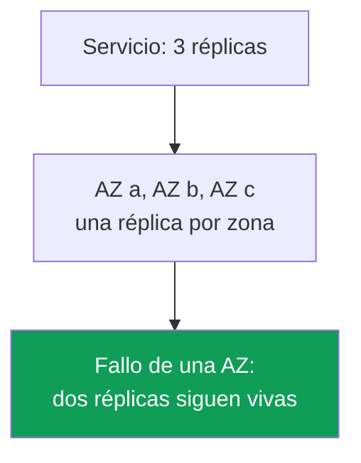
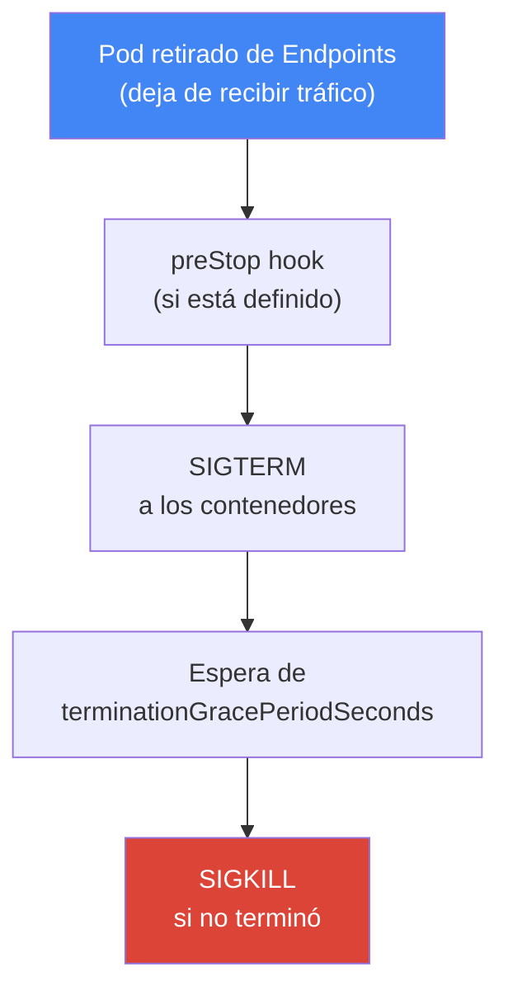
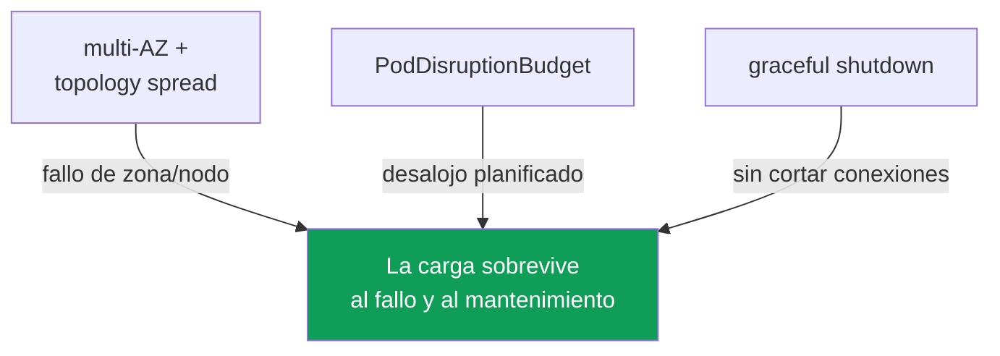

[Eng version](en.md) · [Русская версия](ru.md) · [Version française](fr.md) · [Deutsche Version](de.md) · [ქართული ვერსია](ge.md) · [繁體中文版](tw.md) · [日本語版](jp.md)
# Capítulo 40. Fiabilidad: multi-AZ, PDB, topology spread, apagado correcto de nodos

> **Qué sigue.** Los capítulos 38 y 39 trataron las versiones del clúster: la actualización del control plane y de los nodos, y la reversión dentro de una ventana de 7 días. Eso es la fiabilidad del control plane. Aquí tratamos la fiabilidad de las cargas: cómo los pods sobreviven tanto a un fallo repentino (la caída de un nodo o una zona) como al mantenimiento planificado (drain, actualización, consolidación). El material relacionado se delega a otros capítulos: disruption y consolidación de Karpenter, `do-not-disrupt`, capítulo 12; actualización de nodos durante una actualización, capítulo 38; interrupciones spot, capítulo 13; coste cross-AZ y `trafficDistribution`, capítulo 31; escalado de cargas (HPA), capítulo 35.

## 40.1. «Todas las réplicas acabaron en una zona»

Un escenario de guardia. Un Deployment tiene tres réplicas, todo está en verde, la carga se sostiene. Cae una Availability Zone y el servicio se viene abajo por completo, aunque había tres réplicas. Veamos dónde estaban:

```bash
kubectl get pods -l app=web -o wide
# NAME          READY   STATUS    NODE                          ...
# web-7d..-a2   1/1     Running   ip-10-0-1-15.ec2.internal     # zone eu-west-1a
# web-7d..-b8   1/1     Running   ip-10-0-1-31.ec2.internal     # zone eu-west-1a
# web-7d..-c1   1/1     Running   ip-10-0-1-44.ec2.internal     # zone eu-west-1a
```

Las tres réplicas están en una zona, y a veces incluso en un mismo nodo. De forma predeterminada, el scheduler de Kubernetes no tiene que repartir los pods entre zonas: busca un nodo donde el pod encaje por recursos y perfectamente puede colocar todas las réplicas juntas. Mientras todo funciona, es imperceptible. El fallo de una zona o de un nodo convierte «tres réplicas» en cero.

El mismo problema tiene una versión planificada. La consolidación de Karpenter (capítulo 12), la actualización de nodos (capítulo 38) o una interrupción spot (capítulo 13) sacan un nodo del clúster. Si todas las réplicas estaban en él, se desalojan a la vez: una interrupción breve pero total. Si además el nodo se apagó bruscamente, sin tiempo para terminar, las conexiones abiertas también quedan cortadas: los clientes reciben errores, no un reintento ordenado de la solicitud.

Son tres problemas distintos: colocación, protección ante el desalojo planificado y terminación ordenada. Pero se resuelven con un único conjunto de mecanismos relacionados: multi-AZ, topology spread, PodDisruptionBudget y apagado correcto de nodos. Veámoslos uno por uno y unámoslos.

## 40.2. AZ como dominio de fallo

Una Availability Zone es un conjunto independiente de centros de datos dentro de una región, con alimentación, refrigeración y red independientes. Las zonas de una región están separadas físicamente, por lo que el fallo de una de ellas (alimentación, red, desastre natural) no debe afectar a las demás. Para un ingeniero de EKS, una zona es el **límite de fallo** básico: aquello que desaparece por completo cuando «cae una zona».

Un clúster EKS vive inicialmente en varias zonas. Las subredes se distribuyen entre AZ (capítulo 00-3), los nodos se levantan en esas subredes y AWS mantiene por sí mismo los componentes del control plane en varias zonas. Cada nodo está vinculado a su zona, y Kubernetes le asigna la etiqueta estándar `topology.kubernetes.io/zone`. Esa es precisamente la etiqueta con la que luego se distribuyen los pods.



De aquí surge el principio principal de fiabilidad en AWS: una carga cuya disponibilidad es importante debe distribuirse como mínimo entre dos zonas, y mejor entre tres. Así, el fallo de una AZ solo se lleva una parte de las réplicas. Esto se aplica tanto al cómputo (nodos en distintas zonas) como a los datos: un volumen EBS tiene vinculación zonal (capítulo 23), y EFS y FSx proporcionan almacenamiento compartido interzonal (capítulo 24).

Multi-AZ tiene un coste. El tráfico entre zonas se cobra en ambos sentidos, y «repartir» los pods entre zonas implica añadir tráfico cross-AZ entre servicios (capítulo 31). Surge la tentación de reunirlo todo en una zona para ahorrar. Para las cargas cuya disponibilidad importa, es un error: el coste del tráfico interzonal no es comparable al coste de una caída por el fallo de una zona. El ahorro de tráfico (`trafficDistribution: PreferClose` y lo demás del capítulo 31) se aplica donde corresponde, no a costa de un único punto de fallo. La fiabilidad es más importante que el ahorro de tráfico.

## 40.3. Disruptions voluntarias e involuntarias

Kubernetes divide las interrupciones de los pods (disruptions) en dos clases, y se protegen de forma diferente. Confundirlas es una fuente habitual de expectativas falsas («pero tengo un PDB, ¿por qué cayó el servicio al fallar el nodo?»).

Las **disruptions voluntarias (voluntary disruptions)** las inicia conscientemente un operador o controlador: `kubectl drain` durante el mantenimiento de un nodo, actualización de nodos al actualizar el clúster (capítulo 38), consolidación y drift de Karpenter (capítulo 12), eliminación manual de un pod. Se pueden planificar, ralentizar y ordenar, y para ellas está diseñado PodDisruptionBudget.

Las **disruptions involuntarias (involuntary disruptions)** ocurren sin avisar: fallo de hardware del nodo o caída de toda la AZ, OOM-kill por falta de memoria, desalojo por node-pressure, interrupción spot con aviso de dos minutos (capítulo 13). No se les puede «pedir que esperen»: el nodo ya desapareció. PDB no ayuda aquí: no trata de eso.

| Clase | Ejemplos | Con qué nos protegemos |
|---|---|---|
| Voluntary | drain, actualización de nodos, consolidación de Karpenter, eliminación manual | PDB, graceful shutdown |
| Involuntary | fallo de nodo/AZ, OOM, node-pressure eviction, interrupción spot | multi-AZ + topology spread, réplicas |

La conclusión que hay que tener presente: de las interrupciones **involuntarias** salva la distribución (varias réplicas en distintas zonas y nodos); de las **voluntarias**, el presupuesto de interrupciones (PDB) y la terminación ordenada. Una no sustituye a la otra.

## 40.4. topologySpreadConstraints: distribuimos los pods

`topologySpreadConstraints` es un campo de la especificación del pod con el que indicamos al scheduler: «mantén las réplicas de esta carga repartidas uniformemente por este dominio». El dominio se define mediante una etiqueta de nodo a través de `topologyKey`; en la práctica son dos etiquetas:

- `topology.kubernetes.io/zone`: distribución por zonas (protección ante el fallo de una AZ);
- `kubernetes.io/hostname`: distribución por nodos (protección ante el fallo de un nodo).

Los campos clave de la restricción:

| Campo | Qué establece |
|---|---|
| `maxSkew` | diferencia permitida en el número de pods entre el dominio más lleno y el más vacío |
| `topologyKey` | etiqueta del nodo que define el dominio (zona, nodo) |
| `whenUnsatisfiable` | qué hacer si no se puede cumplir la condición: `DoNotSchedule` o `ScheduleAnyway` |
| `labelSelector` | qué pods contar para la distribución (normalmente, las etiquetas de la propia aplicación) |
| `minDomains` | número mínimo de dominios por los que hay que repartir (solo con `DoNotSchedule`) |

`maxSkew` mide el desequilibrio. Con `maxSkew: 1` y tres zonas, tres réplicas quedarán una en cada zona: la diferencia entre la zona más llena y la más vacía no superará 1. `whenUnsatisfiable` determina la severidad: `DoNotSchedule` es una regla estricta, el pod seguirá en `Pending` si no se puede distribuir sin violar `maxSkew`; `ScheduleAnyway` es flexible, el scheduler intenta cumplirla, pero si no es posible colocará el pod de todas formas. `minDomains` es útil cuando todavía no hay nodos en una zona nueva: obliga a considerar que debe haber como mínimo el número indicado de dominios y evita agruparlo todo en una zona solo porque las demás aún están vacías.

La combinación típica consiste en dos restricciones a la vez: estricta por nodos y flexible (o también estricta) por zonas.

```yaml
topologySpreadConstraints:
  - maxSkew: 1
    topologyKey: topology.kubernetes.io/zone
    whenUnsatisfiable: DoNotSchedule      # distribuir estrictamente entre zonas
    labelSelector:
      matchLabels: { app: web }
  - maxSkew: 1
    topologyKey: kubernetes.io/hostname
    whenUnsatisfiable: ScheduleAnyway     # entre nodos, en la medida de lo posible
    labelSelector:
      matchLabels: { app: web }
```

¿Cómo se relaciona esto con `podAntiAffinity`, que también separa pods? `podAntiAffinity` es una herramienta booleana: «no más de un pod por dominio» con `requiredDuringScheduling`, sin graduaciones. `topologySpreadConstraints` es más preciso: permite establecer el desequilibrio admisible (`maxSkew`) y no prohíbe una segunda réplica en una zona, sino que equilibra la distribución. Para «repartir lo más uniformemente posible entre zonas y nodos» se usa topology spread; el `podAntiAffinity` estricto se reserva para casos de «categóricamente uno por nodo» (por ejemplo, para cargas que compiten por un recurso del nodo).

Un matiz importante: con `DoNotSchedule`, una distribución demasiado estricta cuando faltan nodos en la zona necesaria dejará el pod en `Pending`. Junto con Karpenter, esto es normal: un pod que no cabe se convierte en señal para levantar un nodo en la zona que falta (capítulo 12). Con un conjunto estático de nodos, un spread estricto puede dejar el pod bloqueado durante mucho tiempo: entonces se suaviza a `ScheduleAnyway` o se corrige el equilibrio de nodos entre AZ.

Un caso aparte es una carga con su propio volumen. Un volumen EBS es zonal y su `nodeAffinity` vincula permanentemente el pod a la AZ donde se creó el volumen (capítulo 23). Por ello, la distribución de un StatefulSet entre zonas funciona al crear las réplicas, no al moverlas: no se puede recrear un pod en otra zona para equilibrar el desequilibrio, quedará en `Pending` con el evento `volume node affinity conflict`. De ello se siguen dos cosas: `volumeBindingMode: WaitForFirstConsumer` es obligatorio en StorageClass, o el volumen aparecerá en una zona arbitraria antes que el pod; y para las cargas con volúmenes, la zona de una réplica la determina de hecho su volumen, no topology spread.

### RollingUpdate: las réplicas antiguas estropean el cálculo del desequilibrio

Otra trampa solo se aprecia durante el despliegue. Con `RollingUpdate`, en el clúster viven a la vez pods del ReplicaSet antiguo y del nuevo, y el `labelSelector` de la restricción suele apuntar a la etiqueta común de la aplicación (`app: web`). Por tanto, el scheduler cuenta tanto los pods antiguos como los nuevos en un mismo dominio. Con `maxSkew: 1` y `DoNotSchedule`, el pod nuevo no cabe en la zona donde todavía vive una réplica antigua y queda en `Pending`: el despliegue se queda atascado hasta que el balance se ajuste por sí mismo.

Se soluciona con el campo `matchLabelKeys`. Las claves de etiquetas enumeradas en él se toman del propio pod que se crea y se añaden al `labelSelector`; por eso el desequilibrio se calcula solo dentro de su propia revisión. Para un Deployment sirve `pod-template-hash`, la etiqueta que el controlador asigna por sí mismo a cada ReplicaSet.

```yaml
topologySpreadConstraints:
  - maxSkew: 1
    topologyKey: topology.kubernetes.io/zone
    whenUnsatisfiable: DoNotSchedule
    labelSelector:
      matchLabels: { app: web }
    matchLabelKeys:
      - pod-template-hash          # calcular el desequilibrio entre los pods de esta revisión
```

Condiciones sin las cuales el campo no funciona o no funciona como se espera: `matchLabelKeys` solo se indica junto con `labelSelector`; la misma clave no puede estar en ambos campos; una clave que el pod no tenga se ignora silenciosamente, así que una errata en el nombre convierte la restricción en una normal. El campo está en beta y habilitado de forma predeterminada desde Kubernetes 1.27, de modo que está disponible en las versiones actuales de EKS. No se usan en `matchLabelKeys` etiquetas que se modifican directamente en pods vivos: kube-apiserver no trasladará esa modificación al selector combinado.

## 40.5. PodDisruptionBudget: protección durante el desalojo planificado

`PodDisruptionBudget` (PDB) es un objeto que limita cuántos pods de una carga pueden desalojarse simultáneamente mediante una interrupción **voluntaria**. Establece un límite inferior o superior:

- `minAvailable`: cuántos pods deben seguir disponibles (número o porcentaje);
- `maxUnavailable`: cuántos pods se pueden dejar fuera de servicio simultáneamente.

El mecanismo es simple: cuando algo invoca la API de eviction (y `kubectl drain`, las actualizaciones de nodos y la consolidación de Karpenter hacen precisamente eso), Kubernetes comprueba el PDB. Si el desalojo viola el presupuesto, la eviction se bloquea hasta que haya suficientes pods sanos. Así, el drain de un nodo no elimina todas las réplicas a la vez, sino que avanza una por una, esperando a que se levante una réplica nueva.

```yaml
apiVersion: policy/v1
kind: PodDisruptionBudget
metadata: { name: web-pdb }
spec:
  minAvailable: 2            # mantener siempre disponibles al menos 2 pods
  selector:
    matchLabels: { app: web }
```

La restricción clave que hay que asimilar firmemente: **PDB protege solo frente a interrupciones voluntarias**. No detendrá un fallo de nodo, la caída de una zona, un OOM o una interrupción spot: el nodo ya desapareció y no queda nadie a quien preguntar por el presupuesto. La distribución protege frente a interrupciones involuntarias (secciones 40.2 y 40.4), no PDB. PDB y topology spread resuelven mitades distintas del problema y trabajan juntos.

PDB tiene un lado inverso y peligroso: un **presupuesto demasiado estricto bloquea aquello que solo debería ralentizar**. Errores clásicos:

- `minAvailable` equivale al número de réplicas (o `maxUnavailable: 0`): no se puede desalojar ni un pod, y el `drain` del nodo queda bloqueado para siempre; el mantenimiento y la actualización de nodos (capítulo 38) se detienen.
- el mismo PDB estricto bloquea la consolidación y el drift de Karpenter (capítulo 12): Karpenter respeta PDB y no desalojará pods por encima del presupuesto, por lo que el nodo no se consolida ni se actualiza.
- PDB en una carga con una réplica y `minAvailable: 1`: hacer drain de ese nodo es imposible sin una caída, y el presupuesto lo vuelve imposible por completo.

Un PDB sano deja margen: para tres réplicas, `minAvailable: 2` (o `maxUnavailable: 1`) protege contra «eliminarlas todas a la vez», pero permite que el mantenimiento avance de un pod en un pod. Para las cargas que deben sobrevivir al mantenimiento planificado, un mínimo de dos réplicas es un requisito previo: con una réplica, PDB es inútil o bloquea por completo el drain.

### Un pod caído retiene drain: unhealthyPodEvictionPolicy

Hay una trampa más sutil que un presupuesto estricto y aparece precisamente cuando la aplicación ya está mal. Un pod que no informa `Ready` (`CrashLoopBackOff` por un bug o una readiness probe fallida) no se considera sano en el estado PDB y no entra en `status.currentHealthy`. De forma predeterminada se aplica la política `IfHealthyBudget`: se permite desalojar un pod no sano solo si la propia aplicación no está afectada, es decir, si `currentHealthy` no es menor que `desiredHealthy`. La intención es buena: no quitar las últimas réplicas a una aplicación que ya lo está pasando mal.

Se forma un círculo vicioso. Supongamos que de tres réplicas dos están en `CrashLoopBackOff`: `currentHealthy` vale 1, con `minAvailable: 2` el valor de `desiredHealthy` es 2, la aplicación está afectada y la API de eviction rechaza incluso los pods rotos. `kubectl drain` no avanza, la actualización de nodos (capítulo 38) y la consolidación de Karpenter (capítulo 12) se detienen, y los pods no se sanarán solos: está rota la aplicación, no el clúster. Se resuelve manualmente: se corrige la carga, se eliminan los pods directamente o se quita el PDB.

La salida normal es la política `AlwaysAllow`: los pods no sanos se consideran afectados y se desalojan independientemente del presupuesto, mientras los sanos siguen protegidos.

```yaml
spec:
  minAvailable: 2
  unhealthyPodEvictionPolicy: AlwaysAllow   # no retener drain por pods caídos
  selector:
    matchLabels: { app: web }
```

El campo es estable desde Kubernetes 1.31 y funciona sin feature gate; si no se indica, se aplica `IfHealthyBudget`. Un matiz sobre las fases: los pods en `Pending`, `Succeeded` y `Failed` siempre se desalojan, y la política decide el destino de los pods en fase `Running` sin la condición `Ready`, es decir, precisamente los que están en `CrashLoopBackOff` o no superan readiness. Se conserva `IfHealthyBudget` donde un pod guarda un recurso o datos y eliminarlo prematuramente es más peligroso que el mantenimiento bloqueado (sistemas de quórum, almacenamiento). Para cargas de aplicación normales, `AlwaysAllow` es más práctico: evita que un despliegue roto bloquee la operación de todo el clúster.

## 40.6. Apagado correcto de nodos

La distribución y PDB resuelven dónde están los pods y cuántos desalojar de una vez. Queda la tercera parte: que el pod desalojado se vaya **ordenadamente**, sin cortar las solicitudes que atiende. Es el ciclo de vida de una terminación correcta.

La retirada planificada de un nodo sigue estos pasos: primero `cordon` (el nodo se marca como `SchedulingDisabled`, no llegan pods nuevos), después `drain`, el desalojo de pods mediante la API de eviction respetando PDB. Para cada pod, Kubernetes ejecuta la misma secuencia de terminación:



Veamos los campos. `terminationGracePeriodSeconds` (30 de forma predeterminada) indica cuánto espera el pod entre SIGTERM y el SIGKILL forzado. Durante ese tiempo, la aplicación debe cerrar conexiones y terminar solicitudes. `preStop` es un hook que se ejecuta **antes** de SIGTERM: suele contener una pausa breve para dar a los balanceadores y a kube-proxy tiempo de retirar el pod del enrutamiento antes de que la aplicación empiece a detenerse.

¿Por qué hace falta una pausa? Por la falta de sincronización. Cuando un pod se va, simultáneamente (a) se elimina de Endpoints/EndpointSlice del servicio y (b) recibe SIGTERM. Pero la actualización de Endpoints y la retirada del pod del balanceador son **asíncronas** y no instantáneas: durante algún tiempo, el tráfico aún puede llegar al pod que ya está terminando. Por ello, el pod debe dejar de estar listo y salir de endpoints antes de morir. La readiness probe sirve aquí de herramienta: al fallar readiness (o mediante la pausa de `preStop`), el pod se retira de endpoints antes de dejar de responder.

AWS tiene su propia capa: el balanceador. Cuando se desaloja un pod detrás de NLB o ALB (capítulo 26), AWS Load Balancer Controller anula el registro de su target de la target group. Sin embargo, el balanceador no corta las conexiones al instante: se aplica **connection draining**, controlado por el atributo de target group `deregistration_delay.timeout_seconds` (300 segundos de forma predeterminada). Durante esta ventana, el balanceador deja de enviar solicitudes nuevas al target, pero permite que terminen las ya abiertas. El sentido es que el pod no debe morir antes de que el balanceador anule el registro de su target y vacíe las conexiones activas. Si `terminationGracePeriodSeconds` es menor que lo necesario para la anulación del registro, parte de las conexiones se cortará. Por eso se coordina el grace period con la anulación del registro, y esta tarea tiene una segunda mitad: la llegada del pod nuevo.

### Pod readiness gates: el pod está listo antes que el target

`deregistration_delay` cubre la salida del pod del balanceador. A la llegada queda un vacío simétrico. Kubernetes considera listo un pod por su readiness probe y sobre esa base sigue con el despliegue: apaga el siguiente pod antiguo. Pero en AWS el target nuevo de la target group aún está en estado `initial`: el balanceador ejecuta sus health checks y todavía no le entrega tráfico. En un despliegue rápido con pocas réplicas aparece una ventana en la que no hay ningún target en estado `healthy` en la target group: los antiguos ya están `draining`, los nuevos aún están `initial`. Desde fuera parece una caída del servicio durante un despliegue normal, aunque en el clúster todos los pods estén `Ready`.

El pod readiness gate de AWS Load Balancer Controller cierra esa ventana. El controlador añade al pod una condición adicional de preparación con el prefijo `target-health.elbv2.k8s.aws` y la mantiene falsa hasta que el target de ese pod sea `healthy` en la target group. Si el pod no está `Ready`, el controlador Deployment no continúa ni apaga los pods antiguos. No se activa en la especificación del pod, sino con una etiqueta en el namespace: el propio controlador escribe la configuración del gate mediante un webhook mutante.

```bash
# habilitar la inyección de gates para el namespace
kubectl label namespace prod elbv2.k8s.aws/pod-readiness-gate-inject=enabled
# columna READINESS GATES: 0/1 - target aún no healthy, 1/1 - listo para recibir tráfico
kubectl get pods -n prod -o wide
```

Condiciones sin las cuales el gate no funcionará o no lo hará donde corresponde: funciona solo con `target-type: ip`, porque en modo `instance` la target group conoce el nodo, no el pod (capítulo 26); en el namespace deben existir un Service y un TargetGroupBinding que lo referencia; el gate se escribe SOLO al crear el pod, de modo que la etiqueta del namespace y los objetos Service o Ingress deben crearse ANTES que los pods, de lo contrario los pods ya en ejecución quedan sin gate. También se decide por separado qué hacer si el controlador no está disponible: lo define `failurePolicy` del webhook. `Ignore` deja pasar pods sin gate (la disponibilidad importa más), `Fail` no permite crear pods en los namespace marcados (la garantía importa más).

Un tema aparte es el apagado **brusco** de un nodo, cuando no hubo paso de `drain`. Aquí ayudan varios mecanismos, según el tipo de cómputo (capítulo 9):

| Mecanismo | Qué hace | Dónde |
|---|---|---|
| graceful node shutdown (kubelet) | captura el shutdown del sistema, termina pods con grace antes de detener el SO | si está habilitado en kubelet |
| AWS Node Termination Handler (NTH) | captura spot ITN, rebalance y ASG lifecycle de la cola, cordon y drain | self-managed / MNG |
| Karpenter interruption | reacciona a interrupciones desde su cola SQS, cordon y drain del nodo | nodos bajo Karpenter (capítulo 13) |
| EKS Auto Mode | terminación correcta de nodos lista para usar, sin configuración manual | Auto Mode (capítulo 9) |

Graceful node shutdown es una función de kubelet: se suscribe a eventos de apagado del SO y, al detenerse el nodo, alcanza a desalojar los pods respetando el grace period, en lugar de dejarlos morir con el sistema. En upstream el feature gate está habilitado, pero los parámetros `shutdownGracePeriod` y `shutdownGracePeriodCriticalPods` son cero de forma predeterminada; hay que habilitar explícitamente la función con valores no nulos en la configuración de kubelet (capítulo 10). NTH y Karpenter resuelven la misma tarea para interrupciones EC2: conocen por adelantado la futura detención del nodo (por ejemplo, dos minutos antes de una interrupción spot) y retiran ordenadamente sus pods. Karpenter trata las interrupciones por sí mismo mediante la cola de interruption; NTH se instala para nodos no gestionados por Karpenter; en EKS Auto Mode este comportamiento viene integrado.

## 40.7. Lo reunimos todo

Cuatro mecanismos cubren distintas mitades de la fiabilidad y solo funcionan juntos. Ninguno salva por sí solo.



La lógica de la combinación:

- **multi-AZ + topology spread** distribuyen las réplicas por zonas y nodos: el fallo de una AZ o un nodo solo se lleva una parte, no todo (protección frente a involuntary).
- **PodDisruptionBudget** evita que un desalojo planificado elimine todas las réplicas a la vez: drain, actualización y consolidación avanzan de un pod en un pod (protección frente a voluntary).
- **graceful shutdown** (grace period, preStop, connection draining en el balanceador) termina el pod saliente sin cortar conexiones.

Elimine cualquier elemento y aparecerá un vacío. Sin distribución, PDB protegerá frente a drain, pero el fallo de una zona derribará todo. Sin PDB, la distribución sobrevivirá al fallo, pero la actualización de nodos eliminará todas las réplicas a la vez. Sin graceful, incluso un desalojo ordenado cortará solicitudes vivas. Tres réplicas en tres zonas, PDB `minAvailable: 2`, un grace period razonable con preStop y un `deregistration_delay` coordinado, y la carga soportará tanto la caída de una zona como el mantenimiento planificado.

## 40.8. Cómo se aplica en producción

- **Distribuya las cargas críticas como mínimo entre dos zonas.** Incluya `topologySpreadConstraints` por `topology.kubernetes.io/zone` en la plantilla Deployment, no «algún día más tarde».
- **Mantenga como mínimo dos réplicas de todo lo que proteja con PDB.** Con una réplica, PDB es inútil o bloquea por completo el drain y la actualización de nodos (capítulo 38).
- **Compruebe que PDB no sea «demasiado estricto».** Un `minAvailable` igual al número de réplicas es una causa típica de drain bloqueado y de consolidación de Karpenter bloqueada (capítulo 12).
- **Coordine el grace period con la anulación de registro del balanceador.** `terminationGracePeriodSeconds` y la pausa `preStop` tienen en cuenta el `deregistration_delay` de la target group para no cortar conexiones.
- **Permita desalojar pods no sanos.** `unhealthyPodEvictionPolicy: AlwaysAllow` evita que pods en `CrashLoopBackOff` bloqueen el drain de nodos y la actualización del clúster (capítulo 38).
- **Calcule el desequilibrio en la propia revisión.** Use `matchLabelKeys` con `pod-template-hash` en topology spread; de lo contrario, los pods del ReplicaSet anterior bloquean el despliegue en `Pending`.
- **Habilite pod readiness gates para cargas detrás de ALB y NLB.** Etiqueta en el namespace y `target-type: ip`: el despliegue espera a `healthy` en la target group, no solo a la readiness probe.
- **Recuerde la vinculación zonal de los volúmenes.** Para StatefulSet con EBS, la zona de una réplica la determina su volumen, no topology spread (capítulo 23).
- **No ahorre tráfico a costa de una sola zona.** El tráfico cross-AZ (capítulo 31) es más barato que una caída; aplique `trafficDistribution` donde la distribución ya esté garantizada.
- **Confíe en el manejo integrado de interrupciones.** Karpenter y EKS Auto Mode retiran por sí mismos los pods de nodos interrumpidos; para los demás nodos instale NTH (capítulo 13).

## 40.9. Mini glosario

- **Availability Zone (AZ)**: conjunto aislado de centros de datos de una región; dominio de fallo básico por el que se distribuyen las réplicas.
- **voluntary disruption**: desalojo consciente de pods: drain, actualización de nodos, consolidación; se protege con PDB.
- **involuntary disruption**: no controlada: fallo de nodo/AZ, OOM, interrupción spot; se protege mediante distribución, no PDB.
- **topologySpreadConstraints**: campo del pod para distribuir uniformemente réplicas entre dominios (`maxSkew`, `topologyKey`, `whenUnsatisfiable`, `minDomains`).
- **maxSkew**: desequilibrio permitido en el número de pods entre el dominio más lleno y el más vacío.
- **PodDisruptionBudget (PDB)**: objeto que limita el número de pods desalojados simultáneamente en interrupciones voluntarias (`minAvailable`/`maxUnavailable`).
- **`unhealthyPodEvictionPolicy`**: campo PDB: `IfHealthyBudget` (predeterminado) impide desalojar pods no sanos cuando la aplicación ya está afectada; `AlwaysAllow` lo permite siempre.
- **`matchLabelKeys`**: claves de etiquetas del pod añadidas al `labelSelector` de la restricción de distribución; con `pod-template-hash`, el desequilibrio se calcula dentro de una revisión de Deployment.
- **pod readiness gate**: condición adicional de preparación del pod; AWS Load Balancer Controller mantiene `target-health.elbv2.k8s.aws` falso hasta que el target sea `healthy`.
- **terminationGracePeriodSeconds**: tiempo entre SIGTERM y SIGKILL para terminar el pod (30 de forma predeterminada).
- **preStop**: hook ejecutado antes de SIGTERM; se usa para una pausa previa a la detención.
- **connection draining**: vaciado de conexiones activas al anular el registro de un target; `deregistration_delay.timeout_seconds` (300 de forma predeterminada).
- **graceful node shutdown**: función de kubelet que termina pods con grace period al apagar el SO.

## 40.10. Resumen del capítulo

- El scheduler no distribuye de forma predeterminada las réplicas por zonas y nodos; sin distribución explícita pueden terminar en una misma AZ, y su fallo derriba todo el servicio.
- AZ es el dominio de fallo básico en AWS; las cargas críticas se distribuyen al menos entre dos zonas mediante la etiqueta `topology.kubernetes.io/zone`. La fiabilidad es más importante que el ahorro de tráfico cross-AZ.
- Las disruptions se dividen en voluntarias (drain, actualización, consolidación) e involuntarias (fallo de nodo/AZ, OOM, spot); se protegen con herramientas distintas.
- `topologySpreadConstraints` (`maxSkew`, `topologyKey`, `whenUnsatisfiable`, `minDomains`) distribuye las réplicas entre zonas y nodos; es más preciso que el `podAntiAffinity` booleano.
- PDB (`minAvailable`/`maxUnavailable`) protege solo frente a interrupciones voluntarias; no salva ante el fallo de un nodo o zona, para ello hace falta distribución.
- Un PDB demasiado estricto (igual al número de réplicas, `maxUnavailable: 0`) bloquea drain, la actualización de nodos (capítulo 38) y la consolidación de Karpenter (capítulo 12); mantenga margen y un mínimo de dos réplicas.
- De forma predeterminada, un pod no sano no se puede desalojar cuando la aplicación ya está afectada, de modo que `CrashLoopBackOff` retiene drain hasta intervención manual; `AlwaysAllow` lo resuelve.
- En un despliegue hay dos trampas separadas: las réplicas antiguas distorsionan el cálculo del desequilibrio (lo soluciona `matchLabelKeys`) y el pod pasa a `Ready` antes de que el target esté `healthy` (lo solucionan los gates).
- Terminación correcta: cordon, drain, salida de endpoints, preStop, SIGTERM, grace period, SIGKILL; en AWS, connection draining mediante `deregistration_delay`.
- El apagado brusco de nodos se suaviza con graceful node shutdown en kubelet, NTH, el manejo integrado de interrupciones de Karpenter y EKS Auto Mode (capítulos 9 y 13).
- Fiabilidad = multi-AZ + topology spread (distribuir) + PDB (proteger lo planificado) + graceful (no cortar conexiones); los mecanismos solo funcionan juntos.

## 40.11. Cómo servirá esto en el trabajo real

En una guardia, este capítulo trata de la diferencia entre «cayó una réplica» y «cayó el servicio». Cuando falla una zona o Karpenter consolida un nodo, una carga correctamente distribuida y protegida pierde parte de las réplicas y sigue funcionando, mientras una no distribuida desaparece por completo. Lo primero que conviene comprobar en cualquier servicio crítico es `kubectl get pods -o wide`: dónde están las réplicas, en cuántas zonas y en cuántos nodos. Si están todas en una, es un incidente esperando su momento, y se corrige con distribución, no investigándolo a las tres de la madrugada.

Al planificar, esto añade varios puntos obligatorios a la plantilla de cualquier Deployment cuya disponibilidad importe: dos o tres réplicas, `topologySpreadConstraints` por zonas y nodos, un PDB adecuado con margen y una terminación pensada (grace period, preStop, coordinación con la anulación de registro del balanceador). Por separado se comprueba que PDB no sea demasiado estricto: precisamente un drain bloqueado es lo que más a menudo frustra la actualización del clúster (capítulo 38) e impide que Karpenter consolide nodos (capítulo 12). Juntos, estos mecanismos convierten tanto el mantenimiento planificado como un fallo repentino en rutina, no en una emergencia.

## 40.12. Preguntas de autoevaluación

1. ¿Por qué de forma predeterminada todas las réplicas de un Deployment pueden acabar en una AZ y por qué es peligroso?
2. ¿Por qué se considera AZ el dominio de fallo básico en AWS y con qué etiqueta de nodo se distribuyen los pods?
3. ¿Cómo se relacionan la fiabilidad multi-AZ y el coste del tráfico cross-AZ, qué es más importante y por qué?
4. ¿En qué se diferencian las disruptions voluntarias de las involuntarias y con qué herramientas se protegen?
5. ¿Qué establecen los campos `maxSkew`, `topologyKey`, `whenUnsatisfiable` y `minDomains`?
6. ¿Cuál es la diferencia entre `DoNotSchedule` y `ScheduleAnyway` y cuándo quedará un pod en `Pending`?
7. ¿En qué es `topologySpreadConstraints` más preciso que `podAntiAffinity`, y cuándo elegir cada uno?
8. ¿Contra qué disruptions protege PDB y contra cuáles no, y por qué?
9. ¿Por qué es peligroso un PDB demasiado estricto y cómo rompe drain, actualización y consolidación?
10. Describa la secuencia de terminación de un pod desde cordon hasta SIGKILL.
11. ¿Por qué un pod debe salir de endpoints antes de morir y cómo ayudan `preStop` y readiness?
12. ¿Qué es connection draining y cómo afecta `deregistration_delay` a la elección del grace period?
13. ¿Cómo resuelven graceful node shutdown, NTH y el manejo de interrupciones de Karpenter el problema del apagado brusco de un nodo?
14. ¿Por qué un pod en `CrashLoopBackOff` puede bloquear completamente `drain`, qué cambia `unhealthyPodEvictionPolicy: AlwaysAllow` y cuándo se mantiene conscientemente `IfHealthyBudget`?
15. ¿Por qué durante `RollingUpdate` un pod nuevo puede quedar en `Pending` por topology spread y cómo lo soluciona `matchLabelKeys` con `pod-template-hash`?
16. ¿Qué aporta el pod readiness gate del controlador y por qué es inútil con `target-type: instance`?
17. ¿Por qué no se puede equilibrar la distribución de un StatefulSet con volúmenes EBS recreando un pod en otra zona y qué implica para `DoNotSchedule`?

## Práctica

El laboratorio del curso para este tema: [laboratorio 131: fiabilidad: PDB bloquea drain, topology spread, matchLabelKeys](../../labs/131/README_ES.MD). Allí se practica la distribución por zonas mediante `topologySpreadConstraints`, el síntoma de un `PodDisruptionBudget` demasiado estricto que hace fallar `kubectl drain` por timeout, su solución, `unhealthyPodEvictionPolicy: AlwaysAllow` y un rolling update con comprobación del desequilibrio de la nueva revisión. El resultado se verifica con el comando `check_result`.

A continuación, lo mismo en cualquier clúster propio con comandos habituales. Empecemos por la distribución: dónde están las réplicas de un servicio crítico y en cuántas zonas.

```bash
# en qué nodos están las réplicas
kubectl get pods -l app=web -o wide
# zonas de los nodos: asocie NODE arriba con la etiqueta de zona
kubectl get nodes -L topology.kubernetes.io/zone
```

Después, vea qué PDB están definidos y si tienen margen (`ALLOWED DISRUPTIONS` mayor que cero: drain pasará; cero: lo bloqueará):

```bash
# presupuestos de disruption y número de desalojos permitidos
kubectl get pdb -A
# detalles de un PDB específico: minAvailable, pods actuales/esperados
kubectl describe pdb web-pdb
# política para pods no sanos: vacío significa IfHealthyBudget
kubectl get pdb -A -o custom-columns=NS:.metadata.namespace,PDB:.metadata.name,POLICY:.spec.unhealthyPodEvictionPolicy
```

Observe cómo es un desalojo planificado sin realizarlo mediante dry-run drain, y consulte la descripción del nodo para ver estado y taint:

```bash
# qué se desalojaría con drain, sin desalojo real
kubectl drain <node> --ignore-daemonsets --dry-run=client
# estado del nodo, etiquetas de zona, taint y eventos
kubectl describe node <node>
```

Relacione tres cosas: si las réplicas están distribuidas por zonas y nodos, si PDB deja margen para desalojos y si los pods tienen definidos `terminationGracePeriodSeconds` y `preStop`. Además, observe la columna `READINESS GATES` de `kubectl get pods -o wide` en cargas detrás de ALB y NLB: una columna vacía significa que no hay etiqueta en el namespace y el despliegue no espera a `healthy` en la target group. Si las réplicas están en una sola zona o PDB bloquea cualquier drain, es un incidente futuro que cuesta menos arreglar ahora. Sobre disruption de Karpenter, capítulo 12; sobre interrupciones spot y NTH, capítulo 13; sobre coste cross-AZ, capítulo 31.

---
[Índice](../README_ES.md) · [Capítulo 39](../39/es.md) · [Capítulo 41](../41/es.md)
