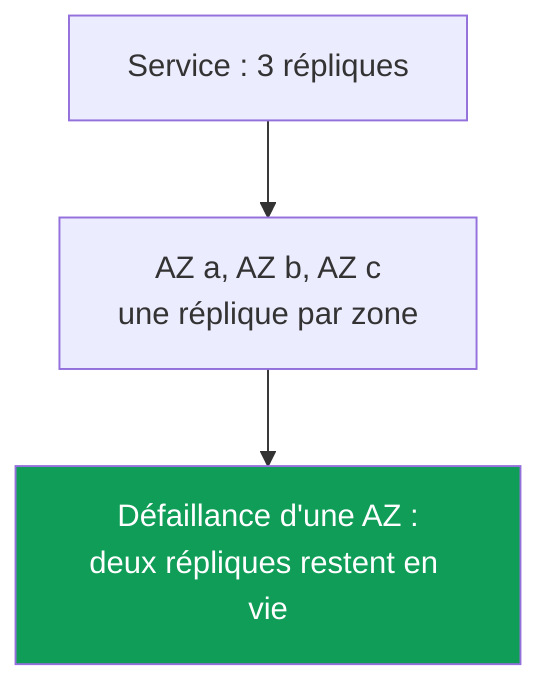
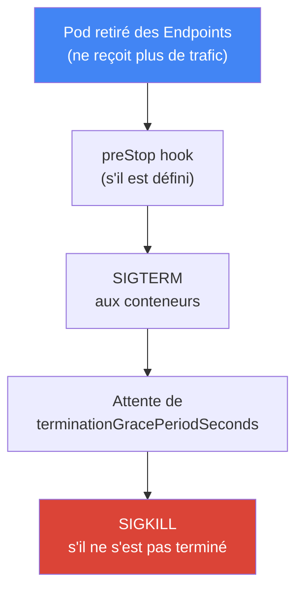
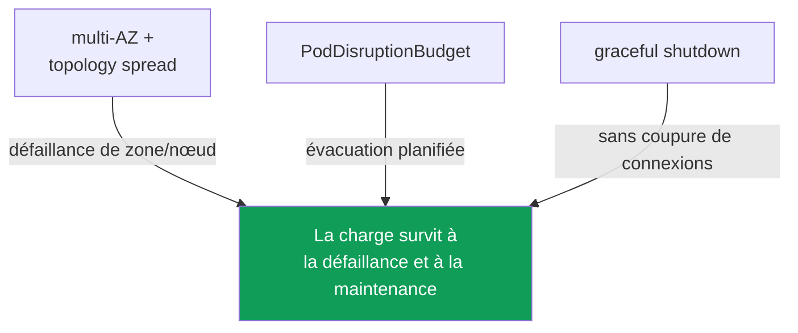

[Eng version](en.md) · [Versión en español](es.md) · [Русская версия](ru.md) · [Deutsche Version](de.md) · [ქართული ვერსია](ge.md) · [繁體中文版](tw.md) · [日本語版](jp.md)
# Chapitre 40. Fiabilité : multi-AZ, PDB, topology spread, arrêt correct des nœuds

> **La suite.** Les chapitres 38 et 39 ont traité des versions du cluster : la mise à niveau du control plane et des nœuds, ainsi que le rollback dans une fenêtre de 7 jours. Cela concerne la fiabilité du control plane. Ici, il s'agit de la fiabilité des charges : comment les pods survivent aussi bien à une panne soudaine (défaillance d'un nœud ou d'une zone) qu'à une maintenance planifiée (`drain`, mise à niveau, consolidation). Les sujets connexes sont couverts dans d'autres chapitres : disruption et consolidation de Karpenter, `do-not-disrupt`, chapitre 12 ; mise à jour des nœuds lors d'une mise à niveau, chapitre 38 ; interruptions spot, chapitre 13 ; coût cross-AZ et `trafficDistribution`, chapitre 31 ; mise à l'échelle des charges (HPA), chapitre 35.

## 40.1. « Toutes les répliques se sont retrouvées dans une seule zone »

Scénario d'astreinte. Un Deployment avec trois répliques, tout est au vert, la charge tient. Une seule Availability Zone tombe et le service s'arrête entièrement, alors qu'il y avait trois répliques. Regardons où elles se trouvaient :

```bash
kubectl get pods -l app=web -o wide
# NAME          READY   STATUS    NODE                          ...
# web-7d..-a2   1/1     Running   ip-10-0-1-15.ec2.internal     # zone eu-west-1a
# web-7d..-b8   1/1     Running   ip-10-0-1-31.ec2.internal     # zone eu-west-1a
# web-7d..-c1   1/1     Running   ip-10-0-1-44.ec2.internal     # zone eu-west-1a
```

Les trois répliques sont dans une même zone, et parfois même sur un seul nœud. Par défaut, le planificateur Kubernetes n'est pas obligé de répartir les pods entre les zones : il cherche un nœud disposant des ressources nécessaires et peut tout à fait placer toutes les répliques côte à côte. Tant que tout fonctionne, cela reste invisible. La défaillance d'une zone ou d'un nœud transforme « trois répliques » en zéro.

Le même problème existe dans sa version planifiée. La consolidation de Karpenter (chapitre 12), la mise à niveau des nœuds (chapitre 38) ou une interruption spot (chapitre 13) retirent un nœud du cluster. Si toutes les répliques s'y trouvaient, elles sont évacuées d'un coup : une indisponibilité brève, mais totale. Et si le nœud s'est arrêté brutalement, sans temps pour terminer, les connexions ouvertes sont aussi coupées : les clients reçoivent des erreurs au lieu d'une nouvelle tentative propre.

Trois problèmes distincts, le placement, la protection lors d'une évacuation planifiée et la terminaison propre, sont résolus par un ensemble cohérent de mécanismes : multi-AZ, topology spread, PodDisruptionBudget et arrêt correct des nœuds. Examinons-les un par un, puis combinons-les.

## 40.2. Une AZ comme domaine de défaillance

Une Availability Zone est un ensemble distinct de datacenters dans une région, avec alimentation, refroidissement et réseau indépendants. Les zones d'une région sont physiquement séparées, de sorte que la défaillance de l'une d'elles (alimentation, réseau, catastrophe naturelle) ne devrait pas toucher les autres. Pour un ingénieur EKS, une zone est la **frontière de défaillance** fondamentale : ce qui tombe entièrement lorsqu'une zone tombe.

Un cluster EKS vit dès le départ dans plusieurs zones. Les sous-réseaux sont répartis entre les AZ (chapitre 00-3), les nœuds sont lancés dans ces sous-réseaux et AWS maintient lui-même les composants du control plane dans plusieurs zones. Chaque nœud est lié à sa zone et Kubernetes lui attribue le label standard `topology.kubernetes.io/zone`. C'est ce label qui sert ensuite à répartir les pods.



D'où le principe principal de fiabilité sur AWS : une charge dont la disponibilité est importante doit être répartie sur au moins deux zones, et de préférence trois, afin qu'une défaillance d'AZ n'emporte qu'une partie des répliques. Cela s'applique au calcul (des nœuds dans différentes zones) comme aux données : un volume EBS est lié à une zone (chapitre 23), tandis que EFS et FSx fournissent du stockage partagé interzonal (chapitre 24).

Le multi-AZ a un coût. Le trafic entre zones est facturé dans les deux sens, et répartir les pods entre les zones ajoute du trafic cross-AZ entre les services (chapitre 31). Il est tentant de tout rassembler dans une seule zone pour économiser. Pour les charges dont la disponibilité est importante, c'est une erreur : le coût du trafic interzonal est sans commune mesure avec le coût d'une indisponibilité lors d'une défaillance de zone. Les économies de trafic (`trafficDistribution: PreferClose` et les autres mécanismes du chapitre 31) s'appliquent là où elles ont leur place, et non au prix d'un point de défaillance unique. La fiabilité prime sur les économies de trafic.

## 40.3. Disruptions volontaires et involontaires

Kubernetes divise les disruptions de pods en deux classes, qui se protègent différemment. La confusion entre elles est une source fréquente de fausses attentes (« j'ai pourtant un PDB, pourquoi le service est-il tombé lors de la défaillance du nœud ? »).

Les **disruptions volontaires (voluntary disruptions)** sont déclenchées sciemment par un opérateur ou un contrôleur : `kubectl drain` lors de la maintenance d'un nœud, mise à niveau des nœuds lors d'une mise à jour du cluster (chapitre 38), consolidation et drift de Karpenter (chapitre 12), suppression manuelle d'un pod. Elles peuvent être planifiées, ralenties et ordonnées : c'est précisément pour elles que PodDisruptionBudget existe.

Les **disruptions involontaires (involuntary disruptions)** surviennent sans prévenir : défaillance matérielle d'un nœud ou chute d'une AZ entière, OOM-kill par manque de mémoire, éviction due à node-pressure, interruption spot avec préavis de deux minutes (chapitre 13). On ne peut pas leur « demander d'attendre » : le nœud a déjà disparu. Le PDB n'aide pas ici, car ce n'est pas son rôle.

| Classe | Exemples | Protection |
|---|---|---|
| Voluntary | drain, mise à niveau des nœuds, consolidation Karpenter, suppression manuelle | PDB, graceful shutdown |
| Involuntary | défaillance de nœud/AZ, OOM, node-pressure eviction, interruption spot | multi-AZ + topology spread, répliques |

La conclusion à garder en tête : les disruptions **involontaires** sont gérées par la répartition (plusieurs répliques dans différentes zones et sur différents nœuds), les disruptions **volontaires** par le budget de disruption (PDB) et une terminaison propre. L'un ne remplace pas l'autre.

## 40.4. topologySpreadConstraints : répartir les pods

`topologySpreadConstraints` est un champ de la spécification d'un pod qui indique au planificateur : « maintiens les répliques de cette charge uniformément réparties sur ce domaine ». Le domaine est défini par un label de nœud via `topologyKey` ; en pratique, ce sont deux labels :

- `topology.kubernetes.io/zone` : répartition entre les zones (protection contre la défaillance d'une AZ) ;
- `kubernetes.io/hostname` : répartition entre les nœuds (protection contre la défaillance d'un seul nœud).

Les champs clés de la contrainte :

| Champ | Ce qu'il définit |
|---|---|
| `maxSkew` | différence admissible du nombre de pods entre le domaine le plus rempli et le moins rempli |
| `topologyKey` | label du nœud qui définit le domaine (zone, nœud) |
| `whenUnsatisfiable` | quoi faire si la condition est impossible à satisfaire : `DoNotSchedule` ou `ScheduleAnyway` |
| `labelSelector` | quels pods comptabiliser pour la répartition (en général les labels de l'application elle-même) |
| `minDomains` | nombre minimal de domaines sur lesquels répartir (uniquement avec `DoNotSchedule`) |

`maxSkew` mesure le déséquilibre. Avec `maxSkew: 1` et trois zones, trois répliques seront placées à raison d'une par zone : l'écart entre la zone la plus remplie et la moins remplie ne dépassera pas 1. `whenUnsatisfiable` définit la rigueur : `DoNotSchedule` est une règle stricte, le pod reste `Pending` s'il est impossible de le répartir sans violer `maxSkew` ; `ScheduleAnyway` est souple, le planificateur essaie de la respecter mais place tout de même le pod si c'est impossible. `minDomains` est utile lorsqu'il n'y a pas encore de nœuds dans une nouvelle zone : il impose de considérer qu'il doit y avoir au moins le nombre de domaines indiqué et empêche de tout rassembler dans une zone uniquement parce que les autres sont encore vides.

La combinaison typique comporte deux contraintes en même temps : stricte par nœud et souple, ou également stricte, par zone.

```yaml
topologySpreadConstraints:
  - maxSkew: 1
    topologyKey: topology.kubernetes.io/zone
    whenUnsatisfiable: DoNotSchedule      # répartir strictement entre les zones
    labelSelector:
      matchLabels: { app: web }
  - maxSkew: 1
    topologyKey: kubernetes.io/hostname
    whenUnsatisfiable: ScheduleAnyway     # entre les nœuds, dans la mesure du possible
    labelSelector:
      matchLabels: { app: web }
```

Quel est le rapport avec `podAntiAffinity`, qui répartit aussi les pods ? `podAntiAffinity` est un outil booléen : « pas plus d'un pod par domaine » avec `requiredDuringScheduling`, sans gradation. `topologySpreadConstraints` est plus fin : il permet de définir le déséquilibre admissible (`maxSkew`) et n'interdit pas une seconde réplique dans une zone, il équilibre simplement la répartition. Pour « répartir le plus uniformément possible entre les zones et les nœuds », on utilise topology spread ; on réserve le `podAntiAffinity` strict aux cas « absolument un seul par nœud » (par exemple, pour des charges qui se disputent une ressource du nœud).

Nuance importante : avec `DoNotSchedule`, une répartition trop stricte alors qu'il manque des nœuds dans la zone nécessaire laisse le pod en `Pending`. Avec Karpenter, cela est normal : un pod qui ne peut pas être placé devient le signal pour lancer un nœud dans la zone manquante (chapitre 12). Avec un ensemble statique de nœuds, un spread strict peut laisser un pod bloqué longtemps : il faut alors soit assouplir vers `ScheduleAnyway`, soit corriger l'équilibre des nœuds entre les AZ.

Cas particulier : une charge avec son propre volume. Un volume EBS est zonal et son `nodeAffinity` lie définitivement le pod à l'AZ dans laquelle le volume a été créé (chapitre 23). La répartition d'un StatefulSet entre les zones fonctionne donc à la création des répliques, pas lors de leur déplacement : il est impossible de recréer un pod dans une autre zone pour équilibrer le déséquilibre, il restera `Pending` avec l'événement `volume node affinity conflict`. Il en découle deux conséquences : `volumeBindingMode: WaitForFirstConsumer` est obligatoire dans la StorageClass, sinon le volume sera créé dans une zone arbitraire avant le pod, et pour les charges avec volumes, la zone de la réplique est en pratique déterminée par son volume, non par topology spread.

### RollingUpdate : les anciennes répliques faussent le calcul du déséquilibre

Un autre piège n'apparaît que lors d'un déploiement. Avec `RollingUpdate`, les pods de l'ancien et du nouveau ReplicaSet coexistent dans le cluster, et le `labelSelector` de la contrainte pointe généralement sur le label commun de l'application (`app: web`) : le planificateur compte donc les anciens et nouveaux pods dans un même domaine. Avec `maxSkew: 1` et `DoNotSchedule`, un nouveau pod ne peut pas entrer dans une zone où une ancienne réplique vit encore et reste `Pending` : le déploiement piétine jusqu'à ce que l'équilibre se rétablisse de lui-même.

La solution est le champ `matchLabelKeys`. Les clés de labels qui y sont listées sont prises sur le pod en cours de création et ajoutées à `labelSelector` : le déséquilibre n'est donc calculé qu'au sein de sa propre révision. Pour un Deployment, `pod-template-hash` convient : c'est le label que le contrôleur attribue lui-même à chaque ReplicaSet.

```yaml
topologySpreadConstraints:
  - maxSkew: 1
    topologyKey: topology.kubernetes.io/zone
    whenUnsatisfiable: DoNotSchedule
    labelSelector:
      matchLabels: { app: web }
    matchLabelKeys:
      - pod-template-hash          # calculer le déséquilibre des pods de sa propre révision
```

Conditions sans lesquelles le champ ne fonctionne pas, ou pas comme attendu : `matchLabelKeys` ne se définit qu'avec `labelSelector` ; une même clé ne peut pas figurer dans les deux champs ; une clé absente du pod est ignorée silencieusement, donc une faute de frappe transforme la contrainte en contrainte ordinaire. Le champ est en statut beta et activé par défaut depuis Kubernetes 1.27 : il est donc disponible sur les versions EKS actuelles. On n'utilise pas dans `matchLabelKeys` des labels modifiés directement sur des pods en vie : kube-apiserver ne transférera pas cette modification dans le sélecteur combiné.

## 40.5. PodDisruptionBudget : protection lors d'une évacuation planifiée

Un `PodDisruptionBudget` (PDB) est un objet qui limite le nombre de pods d'une charge pouvant être évacués en même temps par une disruption **volontaire**. Il définit une limite basse ou haute :

- `minAvailable` : combien de pods doivent rester disponibles (nombre ou pourcentage) ;
- `maxUnavailable` : combien de pods peuvent être mis hors service simultanément.

Le mécanisme est simple : lorsqu'un élément appelle l'API d'éviction (`kubectl drain`, la mise à niveau des nœuds et la consolidation de Karpenter le font), Kubernetes vérifie le PDB. Si l'éviction viole le budget, elle est bloquée jusqu'à ce qu'un nombre suffisant de pods sains soit disponible. Ainsi, le drain d'un nœud ne retire pas toutes les répliques d'un coup : il progresse une par une, en attendant que la nouvelle réplique soit prête.

```yaml
apiVersion: policy/v1
kind: PodDisruptionBudget
metadata: { name: web-pdb }
spec:
  minAvailable: 2            # toujours maintenir disponibles au moins 2 pods
  selector:
    matchLabels: { app: web }
```

La limitation essentielle à comprendre fermement : **un PDB ne protège que des disruptions volontaires**. Il n'arrête pas la défaillance d'un nœud, la chute d'une zone, un OOM ou une interruption spot : le nœud a déjà disparu, personne ne peut demander le budget. Les disruptions involontaires sont gérées par la répartition (sections 40.2 et 40.4), non par le PDB. PDB et topology spread résolvent des moitiés différentes du problème et travaillent ensemble.

Le PDB a un revers insidieux : **un budget trop strict bloque ce qu'il devait seulement ralentir**. Pièges classiques :

- `minAvailable` égal au nombre de répliques (ou `maxUnavailable: 0`) : aucun pod ne peut être évacué et le `drain` du nœud reste bloqué indéfiniment, la maintenance et la mise à niveau des nœuds (chapitre 38) s'arrêtent.
- ce même PDB strict bloque la consolidation et le drift de Karpenter (chapitre 12) : Karpenter respecte le PDB et n'évacue pas les pods au-delà du budget, le nœud n'est donc ni consolidé ni mis à jour.
- un PDB sur une charge à une seule réplique avec `minAvailable: 1` : tout drain de ce nœud est impossible sans indisponibilité, et le budget le rend totalement impossible.

Un PDB sain laisse une marge : pour trois répliques, `minAvailable: 2` (ou `maxUnavailable: 1`) protège contre « tout a été retiré d'un coup », mais permet la maintenance un pod à la fois. Pour les charges qui doivent survivre à la maintenance planifiée, au moins deux répliques sont un prérequis : avec une seule réplique, le PDB est soit inutile, soit bloque définitivement le drain.

### Un pod en échec bloque le drain : unhealthyPodEvictionPolicy

Il existe un piège plus subtil qu'un budget strict, qui se produit précisément lorsque l'application va déjà mal. Un pod qui ne signale pas `Ready` (`CrashLoopBackOff` à cause d'un bug ou d'une readiness probe en échec) n'est pas considéré comme sain par le PDB et ne compte pas dans `status.currentHealthy`. Par défaut, la politique est `IfHealthyBudget` : l'évacuation d'un pod malsain n'est permise que si l'application n'est pas elle-même perturbée, c'est-à-dire si `currentHealthy` est au moins égal à `desiredHealthy`. L'intention est bonne : ne pas retirer les dernières répliques d'une application déjà en difficulté.

Cela crée un cercle vicieux. Supposons que deux des trois répliques sont en `CrashLoopBackOff` : `currentHealthy` vaut 1, avec `minAvailable: 2`, `desiredHealthy` vaut 2, l'application est perturbée et l'API d'éviction refuse même les pods cassés. `kubectl drain` n'avance plus, la mise à niveau des nœuds (chapitre 38) et la consolidation de Karpenter (chapitre 12) s'arrêtent, et les pods ne redeviendront pas sains d'eux-mêmes : l'application est cassée, pas le cluster. Il faut intervenir manuellement : corriger la charge, supprimer directement les pods ou retirer le PDB.

La solution normale est la politique `AlwaysAllow` : les pods malsains sont considérés comme perturbés et évacués indépendamment du budget, tandis que les pods sains restent protégés.

```yaml
spec:
  minAvailable: 2
  unhealthyPodEvictionPolicy: AlwaysAllow   # ne pas bloquer le drain à cause des pods en échec
  selector:
    matchLabels: { app: web }
```

Le champ est stable depuis Kubernetes 1.31 et fonctionne sans feature gate ; s'il n'est pas défini, `IfHealthyBudget` s'applique. Nuance sur les phases : les pods en `Pending`, `Succeeded` et `Failed` sont toujours évacués, tandis que la politique décide du sort des pods en phase `Running` qui ne remplissent pas la condition `Ready`, c'est-à-dire précisément ceux en `CrashLoopBackOff` ou dont la readiness échoue. On conserve délibérément `IfHealthyBudget` lorsqu'un pod protège une ressource ou des données et que sa suppression prématurée est plus dangereuse qu'une maintenance bloquée (systèmes à quorum, stockage). Pour les charges applicatives ordinaires, `AlwaysAllow` est plus pratique : un déploiement cassé ne bloque pas l'exploitation de tout le cluster.

## 40.6. Arrêt correct des nœuds

La répartition et le PDB résolvent où les pods sont placés et combien sont évacués à la fois. Reste la troisième moitié : faire partir le pod évacué **proprement**, sans couper les requêtes qu'il traite. C'est le cycle de vie de la terminaison propre.

La mise hors service planifiée d'un nœud se déroule par étapes : d'abord `cordon` (le nœud est marqué `SchedulingDisabled`, aucun nouveau pod ne lui est assigné), puis `drain`, qui évacue les pods via l'API d'éviction tout en respectant le PDB. Pour chaque pod, Kubernetes exécute la même séquence de terminaison :



Examinons les champs. `terminationGracePeriodSeconds` (30 par défaut) est le temps durant lequel le pod attend entre SIGTERM et le SIGKILL forcé. Pendant ce délai, l'application doit fermer ses connexions et terminer ses requêtes. `preStop` est un hook exécuté **avant** SIGTERM : on y place souvent une courte pause pour laisser aux load balancers et à kube-proxy le temps de retirer le pod du routage avant que l'application commence à s'arrêter.

Pourquoi cette pause est-elle nécessaire ? À cause de la désynchronisation. Lorsqu'un pod part, il est simultanément (a) retiré des Endpoints/EndpointSlice du service et (b) reçoit SIGTERM. Mais la mise à jour des Endpoints et le retrait du pod du load balancer sont **asynchrones** et non instantanés : pendant un certain temps, le trafic peut encore atteindre un pod déjà en cours de terminaison. Le pod doit donc d'abord cesser d'être prêt et quitter les endpoints, puis seulement mourir. La readiness probe est ici l'outil : en faisant échouer la readiness (ou avec la pause `preStop`), le pod est retiré des endpoints avant de cesser de répondre.

Côté AWS, il existe un niveau supplémentaire : le load balancer. Lorsqu'un pod derrière NLB ou ALB (chapitre 26) est évacué, AWS Load Balancer Controller désenregistre sa target du target group. Mais le load balancer ne coupe pas les connexions instantanément : le **connection draining** est contrôlé par l'attribut du target group `deregistration_delay.timeout_seconds` (300 secondes par défaut). Pendant cette fenêtre, le load balancer cesse d'envoyer de nouvelles requêtes vers la target, mais laisse les connexions déjà ouvertes se terminer. L'idée est que le pod ne doit pas mourir avant que le load balancer ait désenregistré sa target et drainé les connexions actives. Si `terminationGracePeriodSeconds` est inférieur au temps nécessaire au désenregistrement, une partie des connexions sera coupée. Le grace period doit donc être aligné sur le désenregistrement, et l'autre moitié du problème concerne l'arrivée d'un nouveau pod.

### Pod readiness gates : le pod est prêt avant la target

`deregistration_delay` gère le départ d'un pod du load balancer. À son arrivée subsiste un trou symétrique. Kubernetes considère le pod prêt selon sa readiness probe et poursuit le déploiement sur cette base en arrêtant l'ancien pod suivant. Mais dans AWS, la nouvelle target du target group est encore à l'état `initial` : le load balancer exécute ses propres health checks et ne lui envoie pas encore de trafic. Pendant un déploiement rapide avec peu de répliques, une fenêtre peut apparaître où aucune target du target group n'est à l'état `healthy` : les anciennes sont déjà `draining`, les nouvelles sont encore `initial`. De l'extérieur, cela ressemble à une panne du service lors d'un déploiement normal, alors que tous les pods du cluster sont `Ready`.

Le pod readiness gate d'AWS Load Balancer Controller ferme cette fenêtre. Le contrôleur ajoute au pod une condition de disponibilité supplémentaire préfixée par `target-health.elbv2.k8s.aws` et la maintient fausse jusqu'à ce que la target de ce pod devienne `healthy` dans le target group. Le pod n'est pas `Ready`, le contrôleur Deployment ne progresse donc pas et ne retire pas les anciens pods. L'activation ne se fait pas dans la spécification du pod, mais par un label sur le namespace : le contrôleur ajoute lui-même la configuration du gate via un webhook de mutation.

```bash
# activer l'injection des gates pour le namespace
kubectl label namespace prod elbv2.k8s.aws/pod-readiness-gate-inject=enabled
# colonne READINESS GATES : 0/1, target pas encore healthy ; 1/1, prêt à recevoir le trafic
kubectl get pods -n prod -o wide
```

Conditions sans lesquelles le gate ne fonctionne pas, ou pas au bon endroit : il ne fonctionne qu'avec `target-type: ip`, car en mode `instance`, le target group connaît le nœud, non le pod (chapitre 26) ; le namespace doit contenir un Service et un TargetGroupBinding qui le référence ; le gate est ajouté UNIQUEMENT à la création du pod, il faut donc créer le label du namespace ainsi que les objets Service ou Ingress AVANT les pods, sinon les pods déjà lancés resteront sans gate. Il faut aussi décider du comportement lorsque le contrôleur est indisponible : cela est défini par la `failurePolicy` du webhook. `Ignore` laisse passer les pods sans gate (la disponibilité prime), tandis que `Fail` empêche de créer des pods dans les namespaces labellisés (la garantie prime).

Un sujet distinct est l'arrêt **brutal** d'un nœud, sans étape `drain`. Plusieurs mécanismes aident selon le type de calcul (chapitre 9) :

| Mécanisme | Rôle | Où |
|---|---|---|
| graceful node shutdown (kubelet) | détecte l'arrêt système, termine les pods avec grace avant l'arrêt de l'OS | s'il est activé dans kubelet |
| AWS Node Termination Handler (NTH) | détecte spot ITN, rebalance, ASG lifecycle depuis la file, cordon et drain | self-managed / MNG |
| Karpenter interruption | réagit aux interruptions via sa file SQS, cordon et drain le nœud | nœuds gérés par Karpenter (chapitre 13) |
| EKS Auto Mode | terminaison correcte des nœuds prête à l'emploi, sans configuration manuelle | Auto Mode (chapitre 9) |

Graceful node shutdown est une fonction de kubelet : il s'abonne aux événements d'arrêt de l'OS et, lorsque le nœud s'arrête, a le temps d'évacuer les pods en respectant le grace period au lieu de les laisser mourir avec le système. Dans l'upstream, le feature gate est activé, mais les paramètres `shutdownGracePeriod` et `shutdownGracePeriodCriticalPods` valent zéro par défaut : il faut activer explicitement la fonction en définissant des valeurs non nulles dans la configuration kubelet (chapitre 10). NTH et Karpenter résolvent le même problème pour les interruptions EC2 : ils apprennent à l'avance l'arrêt futur du nœud (par exemple deux minutes avant une interruption spot) et en retirent les pods proprement. Karpenter traite lui-même les interruptions via la interruption queue ; NTH est installé pour les nœuds non gérés par Karpenter ; avec EKS Auto Mode, ce comportement est intégré.

## 40.7. Tout assembler

Les quatre mécanismes couvrent différentes parties de la fiabilité et ne fonctionnent qu'ensemble. Aucun ne suffit seul.



Logique de l'ensemble :

- **multi-AZ + topology spread** répartissent les répliques entre les zones et les nœuds : une défaillance d'AZ ou de nœud n'en emporte qu'une partie, pas tout (protection contre l'involuntary).
- **PodDisruptionBudget** empêche une évacuation planifiée de retirer les répliques d'un coup : drain, mise à niveau et consolidation progressent un pod à la fois (protection contre le voluntary).
- **graceful shutdown** (grace period, preStop, connection draining sur le load balancer) termine le pod sortant sans couper les connexions.

Retirez n'importe quel élément et une faille apparaît. Sans répartition, le PDB protège du drain, mais la défaillance d'une zone fait tout tomber. Sans PDB, la répartition survit à une panne, mais une mise à niveau des nœuds retire les répliques d'un coup. Sans graceful shutdown, même une évacuation soigneuse coupe les requêtes en cours. Trois répliques dans trois zones, un PDB `minAvailable: 2`, un grace period raisonnable avec preStop et un `deregistration_delay` aligné : la charge résiste aussi bien à la chute d'une zone qu'à la maintenance planifiée.

## 40.8. Application en production

- **Répartir les charges critiques sur au moins deux zones.** Ajouter `topologySpreadConstraints` avec `topology.kubernetes.io/zone` au modèle de Deployment, non « un jour plus tard ».
- **Conserver au moins deux répliques pour tout ce qui est protégé par un PDB.** Avec une seule réplique, le PDB est soit inutile, soit bloque définitivement le drain et la mise à niveau des nœuds (chapitre 38).
- **Vérifier que le PDB n'est pas trop strict.** Un `minAvailable` égal au nombre de répliques est une cause typique de drain bloqué et de consolidation Karpenter empêchée (chapitre 12).
- **Aligner le grace period sur le désenregistrement du load balancer.** `terminationGracePeriodSeconds` et la pause `preStop` prennent en compte le `deregistration_delay` du target group pour ne pas couper les connexions.
- **Autoriser l'évacuation des pods malsains.** `unhealthyPodEvictionPolicy: AlwaysAllow` empêche les pods en `CrashLoopBackOff` de bloquer le drain des nœuds et la mise à niveau du cluster (chapitre 38).
- **Calculer le déséquilibre par révision.** Utiliser `matchLabelKeys` avec `pod-template-hash` dans topology spread, sinon les pods du ReplicaSet précédent laissent le déploiement en `Pending`.
- **Activer les pod readiness gates pour les charges derrière ALB et NLB.** Label sur le namespace et `target-type: ip` : le déploiement attend `healthy` dans le target group, pas seulement la readiness probe.
- **Ne pas oublier l'attachement zonal des volumes.** Pour un StatefulSet avec EBS, c'est le volume qui détermine la zone de la réplique, non topology spread (chapitre 23).
- **Ne pas économiser le trafic au prix d'une zone unique.** Le trafic cross-AZ (chapitre 31) coûte moins cher qu'une indisponibilité ; utiliser `trafficDistribution` là où la répartition est déjà assurée.
- **S'appuyer sur la gestion intégrée des interruptions.** Karpenter et EKS Auto Mode retirent eux-mêmes les pods des nœuds interrompus ; pour les autres nœuds, installer NTH (chapitre 13).

## 40.9. Mini-glossaire

- **Availability Zone (AZ)** : ensemble isolé de datacenters d'une région ; domaine de défaillance fondamental sur lequel les répliques sont réparties.
- **voluntary disruption** : évacuation consciente de pods : drain, mise à niveau des nœuds, consolidation ; protégée par le PDB.
- **involuntary disruption** : événement incontrôlé : défaillance de nœud/AZ, OOM, interruption spot ; protégé par la répartition, non par le PDB.
- **topologySpreadConstraints** : champ du pod pour une répartition uniforme des répliques entre les domaines (`maxSkew`, `topologyKey`, `whenUnsatisfiable`, `minDomains`).
- **maxSkew** : déséquilibre admissible du nombre de pods entre le domaine le plus rempli et le moins rempli.
- **PodDisruptionBudget (PDB)** : objet qui limite le nombre de pods simultanément évacués lors de disruptions volontaires (`minAvailable`/`maxUnavailable`).
- **`unhealthyPodEvictionPolicy`** : champ du PDB : `IfHealthyBudget` (par défaut) ne permet pas d'évacuer des pods malsains si l'application est déjà perturbée ; `AlwaysAllow` le permet toujours.
- **`matchLabelKeys`** : clés de labels de pod ajoutées au `labelSelector` de la contrainte de répartition ; avec `pod-template-hash`, le déséquilibre est calculé dans une seule révision de Deployment.
- **pod readiness gate** : condition supplémentaire de disponibilité du pod ; AWS Load Balancer Controller maintient `target-health.elbv2.k8s.aws` à faux jusqu'à ce que la target devienne `healthy`.
- **terminationGracePeriodSeconds** : temps entre SIGTERM et SIGKILL pour terminer un pod (30 par défaut).
- **preStop** : hook exécuté avant SIGTERM ; sert à créer une pause avant l'arrêt.
- **connection draining** : évacuation des connexions actives lors du désenregistrement d'une target ; `deregistration_delay.timeout_seconds` (300 par défaut).
- **graceful node shutdown** : fonction kubelet qui termine les pods avec un grace period lors de l'arrêt de l'OS.

## 40.10. Résumé du chapitre

- Le planificateur ne répartit pas les répliques entre les zones et les nœuds par défaut ; sans répartition explicite, elles peuvent se trouver dans une même AZ, et sa défaillance arrête entièrement le service.
- Une AZ est le domaine de défaillance fondamental dans AWS ; les charges critiques sont réparties sur au moins deux zones via le label `topology.kubernetes.io/zone`. La fiabilité prime sur les économies de trafic cross-AZ.
- Les disruptions sont volontaires (drain, mise à niveau, consolidation) ou involontaires (défaillance de nœud/AZ, OOM, spot) ; elles se protègent avec des outils différents.
- `topologySpreadConstraints` (`maxSkew`, `topologyKey`, `whenUnsatisfiable`, `minDomains`) répartit les répliques entre zones et nœuds ; il est plus fin que le `podAntiAffinity` booléen.
- Un PDB (`minAvailable`/`maxUnavailable`) ne protège que des disruptions volontaires ; il ne protège pas d'une défaillance de nœud ou de zone, qui nécessite une répartition.
- Un PDB trop strict (égal au nombre de répliques, `maxUnavailable: 0`) bloque le drain, la mise à niveau des nœuds (chapitre 38) et la consolidation Karpenter (chapitre 12) ; il faut conserver une marge et au moins deux répliques.
- Par défaut, un pod malsain ne peut pas être évacué quand l'application est déjà perturbée : `CrashLoopBackOff` bloque donc le drain jusqu'à une intervention manuelle ; `AlwaysAllow` résout ce problème.
- Deux pièges distincts existent lors d'un déploiement : les anciennes répliques faussent le calcul du déséquilibre (corrigé par `matchLabelKeys`) et un pod devient `Ready` avant que sa target soit `healthy` (corrigé par les gates).
- Terminaison correcte : cordon, drain, retrait des endpoints, preStop, SIGTERM, grace period, SIGKILL ; côté AWS : connection draining via `deregistration_delay`.
- L'arrêt brutal des nœuds est atténué par graceful node shutdown dans kubelet, NTH, la gestion intégrée des interruptions de Karpenter et EKS Auto Mode (chapitres 9 et 13).
- Fiabilité = multi-AZ + topology spread (répartir) + PDB (protéger le planifié) + graceful (ne pas couper les connexions) ; ces mécanismes ne fonctionnent qu'ensemble.

## 40.11. Utilité dans le travail réel

En astreinte, ce chapitre porte sur la différence entre « une réplique est tombée » et « le service est tombé ». Lorsqu'une zone tombe ou que Karpenter consolide un nœud, une charge correctement répartie et protégée perd une partie de ses répliques mais continue de fonctionner ; une charge non répartie disparaît entièrement. La première chose à vérifier pour tout service critique est `kubectl get pods -o wide` : où sont les répliques, dans combien de zones et sur combien de nœuds ? Si elles sont toutes dans une seule zone, c'est un incident en attente, à corriger par la répartition, non par une analyse à trois heures du matin.

Lors de la planification, cela ajoute plusieurs éléments obligatoires au modèle de tout Deployment dont la disponibilité est importante : deux ou trois répliques, `topologySpreadConstraints` par zones et nœuds, un PDB raisonnable avec marge et une terminaison réfléchie (grace period, preStop, alignement avec le désenregistrement du load balancer). Il faut aussi vérifier séparément que le PDB n'est pas trop strict : c'est précisément un drain bloqué qui fait le plus souvent échouer la mise à niveau d'un cluster (chapitre 38) et empêche Karpenter de consolider les nœuds (chapitre 12). Ensemble, ces mécanismes rendent la maintenance planifiée comme la défaillance soudaine routinières, plutôt qu'urgentes.

## 40.12. Questions d'auto-évaluation

1. Pourquoi toutes les répliques d'un Deployment peuvent-elles se retrouver dans une même AZ par défaut, et quel est le danger ?
2. Pourquoi une AZ est-elle considérée comme le domaine de défaillance fondamental dans AWS, et par quel label de nœud répartit-on les pods ?
3. Quel est le rapport entre la fiabilité multi-AZ et le coût du trafic cross-AZ, lequel est prioritaire et pourquoi ?
4. En quoi les disruptions volontaires diffèrent-elles des involontaires, et quels outils les protègent ?
5. Que définissent les champs `maxSkew`, `topologyKey`, `whenUnsatisfiable` et `minDomains` ?
6. Quelle est la différence entre `DoNotSchedule` et `ScheduleAnyway`, et quand un pod reste-t-il `Pending` ?
7. En quoi `topologySpreadConstraints` est-il plus fin que `podAntiAffinity`, et quand choisir chacun ?
8. De quelles disruptions le PDB protège-t-il, desquelles ne protège-t-il pas, et pourquoi ?
9. Pourquoi un PDB trop strict est-il dangereux, et comment casse-t-il le drain, la mise à niveau et la consolidation ?
10. Décrivez la séquence de terminaison d'un pod, de cordon à SIGKILL.
11. Pourquoi un pod doit-il quitter les endpoints avant de mourir, et comment `preStop` et la readiness y contribuent-ils ?
12. Qu'est-ce que le connection draining, et comment `deregistration_delay` influence-t-il le choix du grace period ?
13. Comment graceful node shutdown, NTH et la gestion des interruptions de Karpenter résolvent-ils le problème de l'arrêt brutal d'un nœud ?
14. Pourquoi un pod en `CrashLoopBackOff` peut-il bloquer définitivement un `drain`, que change `unhealthyPodEvictionPolicy: AlwaysAllow`, et quand conserve-t-on délibérément `IfHealthyBudget` ?
15. Pourquoi un nouveau pod peut-il rester `Pending` pendant un `RollingUpdate` à cause de topology spread, et comment `matchLabelKeys` avec `pod-template-hash` le corrige-t-il ?
16. Que fournit le pod readiness gate du contrôleur, et pourquoi est-il inutile avec `target-type: instance` ?
17. Pourquoi ne peut-on pas équilibrer la répartition d'un StatefulSet avec volumes EBS en recréant un pod dans une autre zone, et qu'est-ce que cela implique pour `DoNotSchedule` ?

## Pratique

Le laboratoire du cours pour ce thème : [laboratoire 131 : Fiabilité : PDB bloque le drain, topology spread, matchLabelKeys](../../labs/131/README_FR.MD). Il couvre la répartition entre zones avec `topologySpreadConstraints`, le symptôme d'un `PodDisruptionBudget` trop strict qui fait échouer `kubectl drain` par timeout, sa correction, `unhealthyPodEvictionPolicy: AlwaysAllow` et une rolling update avec vérification du déséquilibre de la nouvelle révision. Le résultat est vérifié avec la commande `check_result`.

Vous pouvez reproduire ci-dessous la même chose sur votre propre cluster avec des commandes ordinaires. Commençons par la répartition : où se trouvent les répliques d'un service critique et dans combien de zones.

```bash
# sur quels nœuds se trouvent les répliques
kubectl get pods -l app=web -o wide
# zones des nœuds : associez NODE ci-dessus au label de zone
kubectl get nodes -L topology.kubernetes.io/zone
```

Examinez ensuite les PDB définis et vérifiez s'ils ont une marge (`ALLOWED DISRUPTIONS` supérieur à zéro : le drain passera ; zéro : il sera bloqué) :

```bash
# budgets de disruption et nombre d'évictions autorisées
kubectl get pdb -A
# détails d'un PDB précis : minAvailable, pods actuels/attendus
kubectl describe pdb web-pdb
# politique pour les pods malsains : vide signifie IfHealthyBudget
kubectl get pdb -A -o custom-columns=NS:.metadata.namespace,PDB:.metadata.name,POLICY:.spec.unhealthyPodEvictionPolicy
```

Voyez à quoi ressemble une évacuation planifiée sans l'exécuter, via un dry-run drain, puis consultez la description du nœud pour son statut et ses taints :

```bash
# ce qui serait évacué lors d'un drain, sans éviction réelle
kubectl drain <node> --ignore-daemonsets --dry-run=client
# statut du nœud, labels de zone, taints et événements
kubectl describe node <node>
```

Comparez trois éléments : les répliques sont-elles réparties entre les zones et les nœuds, le PDB laisse-t-il une marge pour l'éviction, et les pods définissent-ils `terminationGracePeriodSeconds` et `preStop` ? Regardez aussi la colonne `READINESS GATES` de la sortie `kubectl get pods -o wide` pour les charges derrière ALB et NLB : une colonne vide signifie que le label du namespace est absent et que le déploiement n'attend pas l'état `healthy` du target group. Si les répliques sont dans une seule zone ou si le PDB bloque tout drain, c'est un futur incident qu'il est moins coûteux de corriger maintenant. Pour les disruptions de Karpenter, voir le chapitre 12 ; pour les interruptions spot et NTH, le chapitre 13 ; pour le coût cross-AZ, le chapitre 31.

---
[Table des matières](../README_FR.md) · [Chapitre 39](../39/fr.md) · [Chapitre 41](../41/fr.md)
