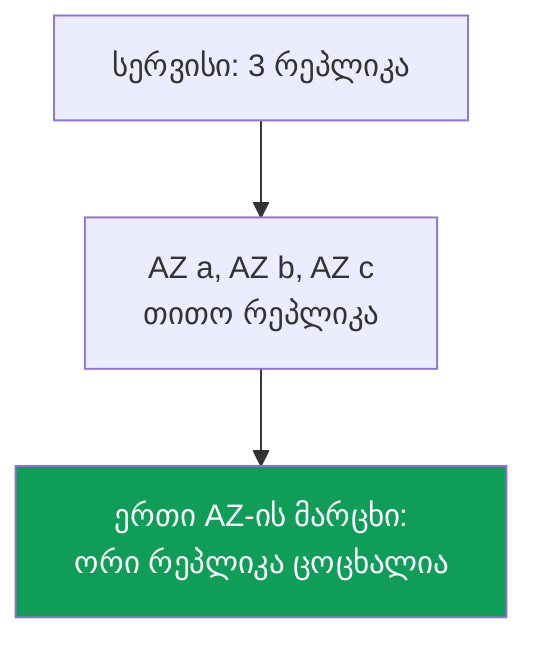
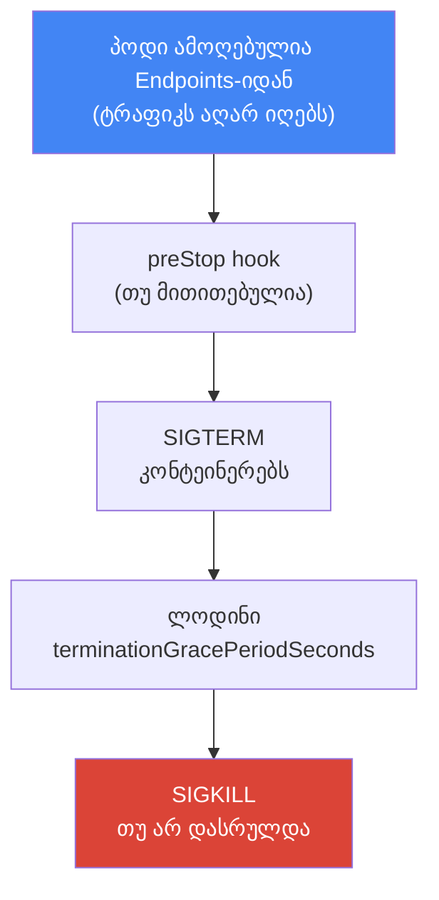
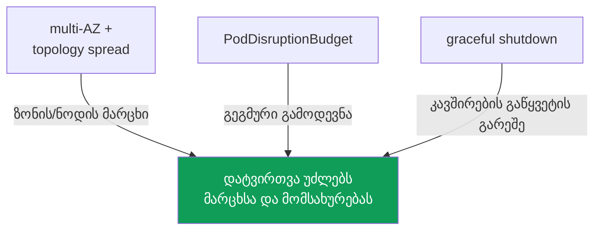

[რუსული ვერსია](ru.md) · [Eng version](en.md) · [Versión en español](es.md) · [Version française](fr.md) · [Deutsche Version](de.md) · [繁體中文版](tw.md) · [日本語版](jp.md)
# თავი 40. საიმედოობა: multi-AZ, PDB, topology spread, ნოდების კორექტული გამორთვა

> **რა არის შემდეგ.** 38-ე და 39-ე თავებში განვიხილეთ კლასტერის ვერსიები: control plane-ისა და ნოდების განახლება და
> უკან დაბრუნება 7-დღიან ფანჯარაში. ეს control plane-ის საიმედოობაა. აქ კი დატვირთვების საიმედოობას განვიხილავთ: როგორ
> უმკლავდებიან პოდები როგორც მოულოდნელ მარცხს (ნოდის ან ზონის გათიშვას), ისე გეგმურ მომსახურებას (drain,
> განახლებას, კონსოლიდაციას). მომიჯნავე თემები სხვა თავებშია: Karpenter-ის disruption და consolidation,
> `do-not-disrupt` - თავი 12; განახლებისას ნოდების განახლება - თავი 38; spot-შეფერხებები - თავი
> 13; cross-AZ ღირებულება და `trafficDistribution` - თავი 31; დატვირთვების მასშტაბირება (HPA) -
> თავი 35.

## 40.1. „ყველა რეპლიკა ერთ ზონაში აღმოჩნდა“

მორიგეობის სცენარი. Deployment-ს სამი რეპლიკა აქვს, ყველაფერი მწვანეა და დატვირთვას უმკლავდება. ერთი
Availability Zone ითიშება და სერვისი მთლიანად წყვეტს მუშაობას, მიუხედავად იმისა, რომ სამი რეპლიკა ჰქონდა. ვნახოთ, სად იყვნენ ისინი განთავსებული:

```bash
kubectl get pods -l app=web -o wide
# NAME          READY   STATUS    NODE                          ...
# web-7d..-a2   1/1     Running   ip-10-0-1-15.ec2.internal     # zone eu-west-1a
# web-7d..-b8   1/1     Running   ip-10-0-1-31.ec2.internal     # zone eu-west-1a
# web-7d..-c1   1/1     Running   ip-10-0-1-44.ec2.internal     # zone eu-west-1a
```

სამივე რეპლიკა ერთ ზონაშია, ზოგჯერ კი ერთ ნოდზეც. Kubernetes-ის scheduler-ს ნაგულისხმევად
პოდების ზონებს შორის განაწილება არ ევალება: ის ეძებს ნოდს, რომელზეც პოდი რესურსების მიხედვით ეტევა, და თავისუფლად შეუძლია
ყველა რეპლიკა ერთმანეთის გვერდით მოათავსოს. სანამ ყველაფერი მუშაობს, ეს შეუმჩნეველია. ზონის ან ნოდის მარცხი კი
„სამ რეპლიკას“ ნულად აქცევს.

იმავე პრობლემას გეგმური ვერსიაც აქვს. Karpenter-ის კონსოლიდაცია (თავი 12), ნოდების განახლება (თავი 38)
ან spot-შეფერხება (თავი 13) ნოდს კლასტერიდან აცილებს. თუ ყველა რეპლიკა მასზე იყო, ისინი
ერთდროულად გამოიდევნებიან, რაც ხანმოკლე, მაგრამ სრულ შეფერხებას იწვევს. ხოლო თუ ნოდი ამ დროს უეცრად გაითიშა,
დასრულებისთვის დროის გარეშე, ღია კავშირებიც წყდება: კლიენტები შეცდომებს იღებენ და არა მოთხოვნის მოწესრიგებულ განმეორებას.

ეს სამი სხვადასხვა პრობლემაა - განთავსება, გეგმური გამოდევნისგან დაცვა და მოწესრიგებული დასრულება - თუმცა
ისინი ერთმანეთთან დაკავშირებული მექანიზმების ერთი ნაკრებით გვარდება: multi-AZ, topology spread, PodDisruptionBudget
და ნოდების კორექტული გამორთვა. თითოეულს თანმიმდევრულად განვიხილავთ და შემდეგ გავაერთიანებთ.

## 40.2. AZ როგორც მარცხის დომენი

Availability Zone არის რეგიონში არსებული დატაცენტრების ცალკე ნაკრები დამოუკიდებელი კვებით,
გაგრილებითა და ქსელით. რეგიონში ზონები ფიზიკურად დაშორებულია, ამიტომ ერთის მარცხმა (კვება,
ქსელი, სტიქიური მოვლენა) სხვებზე არ უნდა იმოქმედოს. EKS ინჟინრისთვის ზონა არის ძირითადი **მარცხის
საზღვარი**: ის, რაც მთლიანად ითიშება, როდესაც „ზონა ეცემა“.

EKS კლასტერი თავიდანვე რამდენიმე ზონაში მუშაობს. ქვექსელები AZ-ებს შორისაა განაწილებული (თავი 00-3), ნოდები
ამ ქვექსელებში იქმნება, ხოლო AWS control plane-ის კომპონენტებს თავად ანაწილებს რამდენიმე ზონაში.
თითოეული ნოდი საკუთარ ზონასთანაა მიბმული და Kubernetes მას სტანდარტულ
`topology.kubernetes.io/zone` ჭდეს ანიჭებს. შემდგომ პოდები სწორედ ამ ჭდის მიხედვით ნაწილდება.



აქედან გამომდინარეობს AWS-ში საიმედოობის მთავარი პრინციპი: ხელმისაწვდომობაზე ორიენტირებული დატვირთვა
მინიმუმ ორ, უკეთეს შემთხვევაში კი სამ ზონაში უნდა განაწილდეს, რათა AZ-ის მარცხმა რეპლიკების მხოლოდ ნაწილი წაიღოს.
ეს ეხება როგორც გამოთვლებს (ნოდები სხვადასხვა ზონაში), ისე მონაცემებს: EBS ტომს ზონალური მიბმა აქვს (თავი
23), ხოლო ზონებს შორის საერთო საცავს EFS და FSx უზრუნველყოფს (თავი 24).

multi-AZ-ს თავისი ფასი აქვს. ზონებს შორის ტრაფიკი ორივე მიმართულებით ფასიანია, ხოლო პოდების ზონებში
„გაბნევა“ სერვისებს შორის cross-AZ ტრაფიკს ზრდის (თავი 31). ჩნდება ცდუნება, ეკონომიისთვის
ყველაფერი ერთ ზონაში მოვაქციოთ. ხელმისაწვდომობაზე ორიენტირებული დატვირთვებისთვის ეს შეცდომაა: ზონებს შორის
ტრაფიკის ღირებულება ზონის მარცხით გამოწვეული შეფერხების ღირებულებას ვერ შეედრება. ტრაფიკის ეკონომიას
(`trafficDistribution: PreferClose` და სხვა მექანიზმები 31-ე თავიდან) იქ იყენებენ, სადაც ეს მიზანშეწონილია,
და არა მარცხის ერთადერთი წერტილის ფასად. საიმედოობა ტრაფიკის ეკონომიაზე მნიშვნელოვანია.

## 40.3. ნებაყოფლობითი და არანებაყოფლობითი დარღვევები

Kubernetes პოდების მუშაობის დარღვევებს (disruptions) ორ კლასად ყოფს და მათგან დაცვაც
განსხვავებულია. მათი ერთმანეთში არევა ცრუ მოლოდინების ხშირი წყაროა („PDB ხომ მაქვს, ნოდის
მარცხისას სერვისი რატომ გაითიშა?“).

**ნებაყოფლობით დარღვევებს (voluntary disruptions)** ოპერატორი ან კონტროლერი შეგნებულად იწყებს:
`kubectl drain` ნოდის მომსახურებისას, კლასტერის განახლებისას ნოდების განახლება (თავი 38),
Karpenter-ის კონსოლიდაცია და drift (თავი 12), პოდის ხელით წაშლა. მათი დაგეგმვა,
შენელება და მოწესრიგება შესაძლებელია და PodDisruptionBudget სწორედ მათთვისაა განკუთვნილი.

**არანებაყოფლობითი დარღვევები (involuntary disruptions)** ნებართვის გარეშე ხდება: ნოდის აპარატურული მარცხი
ან მთელი AZ-ის გათიშვა, მეხსიერების ნაკლებობისას OOM-kill, node-pressure-ის გამო გამოდევნა,
spot-შეფერხება ორწუთიანი გაფრთხილებით (თავი 13). მათ „დაცდას ვერ სთხოვ“: კვანძი უკვე
ქრება. PDB აქ ვერ დაგეხმარებათ, რადგან ის ამისთვის არ არის შექმნილი.

| კლასი | მაგალითები | რით ვიცავთ თავს |
|---|---|---|
| Voluntary | drain, ნოდების განახლება, Karpenter-ის კონსოლიდაცია, ხელით წაშლა | PDB, graceful shutdown |
| Involuntary | ნოდის/AZ-ის მარცხი, OOM, node-pressure eviction, spot-შეფერხება | multi-AZ + topology spread, რეპლიკები |

დასამახსოვრებელი დასკვნა: **არანებაყოფლობითი** დარღვევებისგან განაწილება გვიცავს (რამდენიმე
რეპლიკა სხვადასხვა ზონასა და ნოდზე), ხოლო **ნებაყოფლობითისგან** - დარღვევების ბიუჯეტი (PDB) და
მოწესრიგებული დასრულება. ისინი ერთმანეთს ვერ ჩაანაცვლებს.

## 40.4. topologySpreadConstraints: პოდების განაწილება

`topologySpreadConstraints` პოდის სპეციფიკაციის ველია, რომლითაც scheduler-ს ვეუბნებით:
„ამ დატვირთვის რეპლიკები მითითებულ დომენში თანაბრად გაანაწილე“. დომენი ნოდის ჭდით
`topologyKey`-ის მეშვეობით განისაზღვრება; პრაქტიკაში ეს ორი ჭდეა:

- `topology.kubernetes.io/zone` - ზონების მიხედვით განაწილება (AZ-ის მარცხისგან დაცვა);
- `kubernetes.io/hostname` - ნოდების მიხედვით განაწილება (ერთი ნოდის მარცხისგან დაცვა).

შეზღუდვის ძირითადი ველები:

| ველი | რას განსაზღვრავს |
|---|---|
| `maxSkew` | პოდების რაოდენობის დასაშვები სხვაობა ყველაზე სავსე და ყველაზე ცარიელ დომენს შორის |
| `topologyKey` | ნოდის ჭდე, რომელიც დომენს განსაზღვრავს (ზონა, ნოდი) |
| `whenUnsatisfiable` | რა მოხდეს, თუ პირობა ვერ სრულდება: `DoNotSchedule` ან `ScheduleAnyway` |
| `labelSelector` | რომელი პოდების მიხედვით დაითვალოს განაწილება (ჩვეულებრივ, თავად აპლიკაციის ჭდეები) |
| `minDomains` | დომენების მინიმალური რაოდენობა, რომლებშიც უნდა განაწილდეს (მხოლოდ `DoNotSchedule`-თან) |

`maxSkew` გადახრის საზომია. `maxSkew: 1`-ის და სამი ზონის შემთხვევაში სამი რეპლიკა თითო ზონაში თითო-თითოდ
განთავსდება: ყველაზე სავსე და ყველაზე ცარიელ ზონას შორის სხვაობა 1-ს არ გადააჭარბებს. `whenUnsatisfiable`
სიმკაცრეს განსაზღვრავს: `DoNotSchedule` მკაცრი წესია და პოდი `Pending` დარჩება, თუ `maxSkew`-ის
დარღვევის გარეშე განაწილება შეუძლებელია; `ScheduleAnyway` რბილი წესია, scheduler ცდილობს მის დაცვას, თუმცა
თუ ვერ შეძლებს, პოდს მაინც განათავსებს. `minDomains` სასარგებლოა, როდესაც ახალ ზონაში ნოდები ჯერ არ არის:
ის მოითხოვს, რომ დომენების რაოდენობა მითითებულ მნიშვნელობაზე ნაკლები არ იყოს და ყველაფრის ერთ ზონაში მოქცევას
არ დაუშვებს მხოლოდ იმიტომ, რომ სხვა ზონები ჯერ ცარიელია.

ტიპური კომბინაცია ერთდროულად ორი შეზღუდვაა: მკაცრი ნოდების მიხედვით და რბილი (ან ასევე მკაცრი) ზონების მიხედვით.

```yaml
topologySpreadConstraints:
  - maxSkew: 1
    topologyKey: topology.kubernetes.io/zone
    whenUnsatisfiable: DoNotSchedule      # ზონების მიხედვით მკაცრად განაწილება
    labelSelector:
      matchLabels: { app: web }
  - maxSkew: 1
    topologyKey: kubernetes.io/hostname
    whenUnsatisfiable: ScheduleAnyway     # ნოდების მიხედვით - შესაძლებლობის ფარგლებში
    labelSelector:
      matchLabels: { app: web }
```

როგორ უკავშირდება ეს `podAntiAffinity`-ს, რომელიც ასევე ანაწილებს პოდებს? `podAntiAffinity`
ბინარული ინსტრუმენტია: `requiredDuringScheduling`-ისას „თითო დომენზე არაუმეტეს ერთი პოდი“, გრადაციების გარეშე.
`topologySpreadConstraints` უფრო მოქნილია: ის დასაშვები გადახრის (`maxSkew`) მითითების საშუალებას იძლევა და
ზონაში მეორე რეპლიკას არ კრძალავს, მხოლოდ განაწილებას ათანაბრებს. „ზონებსა და ნოდებზე რაც შეიძლება თანაბრად
განაწილებისთვის“ topology spread-ს იყენებენ; მკაცრ `podAntiAffinity`-ს ტოვებენ შემთხვევებისთვის, როდესაც საჭიროა
„კატეგორიულად თითო ნოდზე თითო“ (მაგალითად, ნოდის რესურსისთვის კონკურირებადი დატვირთვებისთვის).

მნიშვნელოვანი ნიუანსი: `DoNotSchedule`-თან ზედმეტად მკაცრი განაწილება საჭირო ზონაში ნოდების ნაკლებობისას
პოდს `Pending` მდგომარეობაში დატოვებს. Karpenter-თან კომბინაციაში ეს ნორმალურია: პოდი, რომელიც ვერ განთავსდა,
ნაკლულ ზონაში ნოდის შექმნის სიგნალი ხდება (თავი 12). ნოდების სტატიკური ნაკრების შემთხვევაში მკაცრმა spread-მა
პოდი შეიძლება დიდხანს შეაჩეროს. ასეთ დროს ან `ScheduleAnyway`-მდე არბილებენ, ან AZ-ებს შორის ნოდების ბალანსს ასწორებენ.

ცალკე შემთხვევაა დატვირთვა საკუთარი ტომით. EBS ტომი ზონალურია და მისი `nodeAffinity` პოდს სამუდამოდ
აბამს იმ AZ-ს, სადაც ტომი შეიქმნა (თავი 23). ამიტომ StatefulSet-ის ზონებში განაწილება რეპლიკების შექმნისას
მუშაობს და არა მათი გადატანისას: გადახრის გასათანაბრებლად პოდის სხვა ზონაში ხელახლა შექმნა შეუძლებელია, რადგან
ის `Pending` მდგომარეობაში დარჩება მოვლენით `volume node affinity conflict`. აქედან ორი დასკვნა გამომდინარეობს:
StorageClass-ში `volumeBindingMode: WaitForFirstConsumer` აუცილებელია, წინააღმდეგ შემთხვევაში ტომი პოდზე ადრე
შემთხვევით ზონაში შეიქმნება; ხოლო ტომიან დატვირთვებში რეპლიკის ზონას ფაქტობრივად მისი ტომი განსაზღვრავს და არა topology spread.

### RollingUpdate: ძველი რეპლიკები გადახრის გამოთვლას აფუჭებს

კიდევ ერთი ხაფანგი მხოლოდ გაშლისას ჩანს. `RollingUpdate`-ის დროს კლასტერში ძველი და ახალი ReplicaSet-ის
პოდები ერთდროულად მუშაობს, ხოლო შეზღუდვის `labelSelector` ჩვეულებრივ აპლიკაციის საერთო ჭდეზე
(`app: web`) მიუთითებს. შედეგად scheduler ერთ დომენში ძველ და ახალ პოდებს ერთად ითვლის. `maxSkew: 1`-ისა
და `DoNotSchedule`-ის შემთხვევაში ახალი პოდი ვერ განთავსდება ზონაში, სადაც ძველი რეპლიკა ჯერ ცოცხალია, და
`Pending` მდგომარეობაში რჩება: გაშლა ადგილზე დგას, სანამ ბალანსი თავისით არ გასწორდება.

ეს `matchLabelKeys` ველით გვარდება. მასში ჩამოთვლილი ჭდეების გასაღებები თავად შესაქმნელი პოდიდან აიღება
და `labelSelector`-ს ემატება, ამიტომ გადახრა მხოლოდ საკუთარი რევიზიის ფარგლებში ითვლება.
Deployment-ისთვის გამოდგება `pod-template-hash` - ჭდე, რომელსაც კონტროლერი თითოეულ ReplicaSet-ს თავად ანიჭებს.

```yaml
topologySpreadConstraints:
  - maxSkew: 1
    topologyKey: topology.kubernetes.io/zone
    whenUnsatisfiable: DoNotSchedule
    labelSelector:
      matchLabels: { app: web }
    matchLabelKeys:
      - pod-template-hash          # გადახრის დათვლა საკუთარი რევიზიის პოდების მიხედვით
```

პირობები, რომელთა გარეშეც ველი არ მუშაობს ან მოსალოდნელისგან განსხვავებულად მუშაობს: `matchLabelKeys` მხოლოდ
`labelSelector`-თან ერთად განისაზღვრება; ერთი და იგივე გასაღები ორივე ველში ვერ იქნება; გასაღები, რომელიც პოდს
არ აქვს, ჩუმად იგნორირდება, ამიტომ სახელში შეცდომა შეზღუდვას ჩვეულებრივად აქცევს. ველს beta სტატუსი აქვს და
Kubernetes 1.27-დან ნაგულისხმევად ჩართულია, ანუ EKS-ის აქტუალურ ვერსიებში ხელმისაწვდომია. ჭდეებს, რომლებსაც
უშუალოდ გაშვებულ პოდებზე ცვლიან, `matchLabelKeys`-ში არ იყენებენ: kube-apiserver ასეთ ცვლილებას გაერთიანებულ
სელექტორში არ გადაიტანს.

## 40.5. PodDisruptionBudget: გეგმური გამოდევნისგან დაცვა

`PodDisruptionBudget` (PDB) არის ობიექტი, რომელიც ზღუდავს, დატვირთვის რამდენი პოდი შეიძლება ერთდროულად
გამოიდევნოს **ნებაყოფლობითი** დარღვევით. ის ქვედა ან ზედა ზღვარს ადგენს:

- `minAvailable` - რამდენი პოდი უნდა დარჩეს ხელმისაწვდომი (რიცხვი ან პროცენტი);
- `maxUnavailable` - რამდენი პოდის ერთდროულად გათიშვა შეიძლება.

მექანიკა მარტივია: როდესაც რამე eviction API-ს იძახებს (ხოლო `kubectl drain`, ნოდების განახლება და
Karpenter-ის კონსოლიდაცია სწორედ ამას აკეთებს), Kubernetes PDB-ს ამოწმებს. თუ გამოდევნა ბიუჯეტს დაარღვევს,
eviction იბლოკება მანამ, სანამ საკმარისი ჯანმრთელი პოდი არ ამუშავდება. ასე ნოდის drain ყველა რეპლიკას
ერთდროულად არ შლის, არამედ თითო-თითოდ მიდის და ახალი რეპლიკის ამუშავებას ელოდება.

```yaml
apiVersion: policy/v1
kind: PodDisruptionBudget
metadata: { name: web-pdb }
spec:
  minAvailable: 2            # ყოველთვის ხელმისაწვდომი იყოს მინიმუმ 2 პოდი
  selector:
    matchLabels: { app: web }
```

ძირითადი შეზღუდვა, რომელიც მყარად უნდა დაიმახსოვროთ: **PDB მხოლოდ ნებაყოფლობითი დარღვევებისგან
იცავს**. ნოდის მარცხს, ზონის გათიშვას, OOM-სა და spot-შეფერხებას PDB ვერ შეაჩერებს, რადგან კვანძი უკვე
ქრება და ბიუჯეტის კითხვა ვეღარავისთან მოხდება. არანებაყოფლობითი დარღვევებისგან განაწილება (სექციები
40.2 და 40.4) გვიცავს და არა PDB. PDB და topology spread ამოცანის სხვადასხვა ნახევარს წყვეტს და ერთად მუშაობს.

PDB-ს საპირისპირო, მზაკვრული მხარეც აქვს: **ზედმეტად მკაცრი ბიუჯეტი ბლოკავს იმას, რაც მხოლოდ უნდა
შეენელებინა**. კლასიკური პრობლემებია:

- `minAvailable` რეპლიკების რაოდენობას უდრის (ან `maxUnavailable: 0`): ვერც ერთი პოდის გამოდევნა ვერ ხდება,
  ამიტომ ნოდის `drain` სამუდამოდ ჩერდება, მომსახურება და ნოდების განახლება (თავი 38) კი ფერხდება.
- იგივე მკაცრი PDB Karpenter-ის კონსოლიდაციასა და drift-ს ბლოკავს (თავი 12): Karpenter PDB-ს პატივს სცემს
  და ბიუჯეტზე მეტი პოდის გამოდევნას არ დაიწყებს, ამიტომ ნოდი არც კონსოლიდირდება და არც განახლდება.
- PDB ერთრეპლიკიანი დატვირთვისთვის `minAvailable: 1`-ით: ამ ნოდის ნებისმიერი drain შეფერხების გარეშე
  შეუძლებელია, ბიუჯეტი კი მას საერთოდ შეუძლებელს ხდის.

ჯანსაღი PDB მარაგს ტოვებს: სამი რეპლიკისთვის `minAvailable: 2` (ან `maxUnavailable: 1`)
„ყველაფრის ერთდროულად წაშლისგან“ იცავს, თუმცა მომსახურებას თითო პოდის დამუშავების საშუალებას აძლევს. დატვირთვებისთვის,
რომლებმაც გეგმურ მომსახურებას უნდა გაუძლოს, მინიმუმ ორი რეპლიკა წინაპირობაა: ერთი რეპლიკის შემთხვევაში PDB ან
უსარგებლოა, ან drain-ს სრულად ბლოკავს.

### გათიშული პოდი drain-ს აჩერებს: unhealthyPodEvictionPolicy

არსებობს მკაცრ ბიუჯეტზე უფრო ფარული ხაფანგი, რომელიც სწორედ მაშინ იჩენს თავს, როდესაც აპლიკაციას უკვე უჭირს.
პოდი, რომელიც `Ready` მდგომარეობას არ იუწყება (ბაგის გამო `CrashLoopBackOff` ან ჩავარდნილი readiness probe),
PDB-ს სტატუსში ჯანმრთელად არ ითვლება და `status.currentHealthy`-ში არ შედის. ნაგულისხმევად მოქმედებს
`IfHealthyBudget` პოლიტიკა: არაჯანმრთელი პოდის გამოდევნა მხოლოდ მაშინ არის ნებადართული, თუ თავად აპლიკაცია
დარღვეული არ არის, ანუ `currentHealthy` არ არის `desiredHealthy`-ზე ნაკლები. განზრახვა კეთილია: აპლიკაციას,
რომელსაც ისედაც უჭირს, ბოლო რეპლიკები არ წავართვათ.

იქმნება ჩაკეტილი წრე. ვთქვათ, სამი რეპლიკიდან ორი `CrashLoopBackOff` მდგომარეობაშია: `currentHealthy`
უდრის 1-ს, `minAvailable: 2`-ისას `desiredHealthy` უდრის 2-ს, აპლიკაცია დარღვეულია და eviction API
გაფუჭებული პოდების გამოდევნაზეც უარს ამბობს. `kubectl drain` არ იძვრის, ნოდების განახლება (თავი 38) და
Karpenter-ის კონსოლიდაცია (თავი 12) ჩერდება, პოდები კი თავისით ვერ გახდება ჯანმრთელი: გაფუჭებულია აპლიკაცია
და არა კლასტერი. პრობლემას ხელით აგვარებენ: დატვირთვას ასწორებენ, პოდებს პირდაპირ შლიან ან PDB-ს ხსნიან.

სტანდარტული გამოსავალია `AlwaysAllow` პოლიტიკა: არაჯანმრთელი პოდები დარღვეულად ითვლება და ბიუჯეტისგან
დამოუკიდებლად გამოიდევნება, ხოლო ჯანმრთელი პოდები დაცული რჩება.

```yaml
spec:
  minAvailable: 2
  unhealthyPodEvictionPolicy: AlwaysAllow   # გათიშულმა პოდებმა drain არ შეაჩეროს
  selector:
    matchLabels: { app: web }
```

ველი Kubernetes 1.31-დან სტაბილურია და feature gate-ის გარეშე მუშაობს; თუ არ მიუთითებთ, `IfHealthyBudget`
მოქმედებს. შენიშვნა ფაზებზე: `Pending`, `Succeeded` და `Failed` ფაზებში მყოფი პოდები ყოველთვის გამოიდევნება,
პოლიტიკა კი `Running` ფაზაში `Ready` პირობის გარეშე მყოფი პოდების ბედს წყვეტს, ანუ სწორედ
`CrashLoopBackOff` მდგომარეობაში მყოფებისა და readiness-ის ვერ გამვლელების. `IfHealthyBudget`-ს იქ ტოვებენ,
სადაც პოდი რესურსს ან მონაცემებს იცავს და მისი ნაადრევი წაშლა გაჭედილ მომსახურებაზე უფრო საშიშია
(კვორუმული სისტემები, საცავები). ჩვეულებრივი აპლიკაციური დატვირთვებისთვის `AlwaysAllow` უფრო მოსახერხებელია:
ის გაფუჭებულ დეპლოის მთელი კლასტერის ექსპლუატაციის დაბლოკვის საშუალებას არ აძლევს.

## 40.6. ნოდების კორექტული გამორთვა

განაწილება და PDB წყვეტს, სად დგას პოდები და რამდენის ერთდროულად გამოდევნა შეიძლება. რჩება მესამე ნაწილი:
გამოსადევნი პოდი **მოწესრიგებულად** უნდა წავიდეს და მიმდინარე მოთხოვნები არ გაწყვიტოს. ეს კორექტული
დასრულების სასიცოცხლო ციკლია.

ნოდის გეგმური გამოთიშვა ეტაპობრივად მიმდინარეობს: ჯერ `cordon` (ნოდი მოინიშნება როგორც
`SchedulingDisabled` და ახალი პოდები მასზე აღარ ხვდება), შემდეგ `drain`, ანუ პოდების eviction API-ით
გამოდევნა PDB-ს დაცვით. თითოეული პოდისთვის Kubernetes დასრულების ერთსა და იმავე მიმდევრობას ასრულებს:



განვიხილოთ ველები. `terminationGracePeriodSeconds` (ნაგულისხმევად 30) არის დრო, რომელსაც პოდი SIGTERM-სა
და მკაცრ SIGKILL-ს შორის ელოდება. ამ დროში აპლიკაციამ კავშირები უნდა დახუროს და მოთხოვნები დაასრულოს.
`preStop` არის hook, რომელიც **SIGTERM-მდე** სრულდება: მასში ხშირად მოკლე პაუზას ამატებენ, რათა აპლიკაციის
გაჩერების დაწყებამდე load balancer-ებსა და kube-proxy-ს პოდის მარშრუტიზაციიდან ამოღების დრო მისცენ.

პაუზა სინქრონიზაციის არარსებობის გამოა საჭირო. პოდის წასვლისას ის ერთდროულად (ა) სერვისის
Endpoints/EndpointSlice-იდან იშლება და (ბ) SIGTERM-ს იღებს. თუმცა Endpoints-ის განახლება და პოდის
load balancer-იდან ამოღება **ასინქრონულად** ხდება და მყისიერი არ არის: ტრაფიკი შეიძლება გარკვეული დროით
ჯერ კიდევ მივიდეს პოდთან, რომელიც უკვე სრულდება. ამიტომ პოდი ჯერ მზად აღარ უნდა იყოს და endpoints-იდან
უნდა გავიდეს, შემდეგ კი მოკვდეს. readiness probe აქ ინსტრუმენტია: readiness-ის ჩავარდნით (ან
`preStop`-პაუზით) პოდი endpoints-იდან მანამდე გამოდის, სანამ პასუხის გაცემას შეწყვეტს.

AWS-ის მხარეს საკუთარი დონეა, load balancer. როდესაც NLB-ს ან ALB-ს უკან მდგომი პოდი (თავი 26)
გამოიდევნება, AWS Load Balancer Controller მის target-ს target group-იდან აუქმებს. თუმცა load balancer
კავშირებს მყისიერად არ წყვეტს: მოქმედებს **connection draining**, რომელსაც target group-ის ატრიბუტი
`deregistration_delay.timeout_seconds` მართავს (ნაგულისხმევად 300 წამი). ამ ფანჯარაში load balancer target-ს
ახალ მოთხოვნებს აღარ უგზავნის, თუმცა უკვე გახსნილ კავშირებს დასრულების საშუალებას აძლევს. არსი ასეთია:
პოდი არ უნდა მოკვდეს მანამ, სანამ load balancer მის target-ს არ გააუქმებს და აქტიურ კავშირებს არ დაცლის.
თუ `terminationGracePeriodSeconds` დერეგისტრაციისთვის საჭირო დროზე ნაკლებია, კავშირების ნაწილი გაწყდება.
ამიტომ grace period-ს დერეგისტრაციას უთანხმებენ, ამავე ამოცანის მეორე ნახევარი კი ახალი პოდის მოსვლაა.

### Pod readiness gates: პოდი target-ზე ადრე მზადაა

`deregistration_delay` პოდის load balancer-იდან გასვლას ფარავს. მოსვლისას სიმეტრიული ხარვეზი რჩება.
Kubernetes პოდს საკუთარი readiness probe-ის მიხედვით მზად მიიჩნევს და ამის საფუძველზე გაშლას აგრძელებს,
ანუ მომდევნო ძველ პოდს აქრობს. AWS-ში კი target group-ის ახალი target ჯერ `initial` მდგომარეობაშია:
load balancer საკუთარ health check-ებს ასრულებს და მას ჯერ ტრაფიკს არ აწვდის. მცირე რაოდენობის რეპლიკებით
სწრაფი გაშლისას ჩნდება ფანჯარა, როდესაც target group-ში `healthy` მდგომარეობაში არც ერთი target არ არის:
ძველები უკვე `draining` მდგომარეობაშია, ახლები კი ჯერ `initial`-ში. გარედან ეს სტანდარტული დეპლოის დროს
სერვისის მარცხს ჰგავს, მიუხედავად იმისა, რომ კლასტერში ყველა პოდი `Ready` მდგომარეობაშია.

ამ ფანჯარას AWS Load Balancer Controller-ის pod readiness gate ხურავს. კონტროლერი პოდს მზაობის დამატებით
პირობას უმატებს პრეფიქსით `target-health.elbv2.k8s.aws` და მას false მნიშვნელობაზე ტოვებს, სანამ ამ პოდის target
target group-ში `healthy` არ გახდება. პოდი `Ready` არ არის, ამიტომ Deployment-ის კონტროლერი წინ არ მიდის და
ძველ პოდებს არ აქრობს. ეს პოდის სპეციფიკაციაში კი არა, namespace-ის ჭდით ირთვება: gate-ის კონფიგურაციას
კონტროლერი mutating webhook-ის მეშვეობით თავად ამატებს.

```bash
# gate-ების ინექციის ჩართვა namespace-ისთვის
kubectl label namespace prod elbv2.k8s.aws/pod-readiness-gate-inject=enabled
# READINESS GATES სვეტი: 0/1 - target ჯერ healthy არ არის, 1/1 - მზადაა ტრაფიკის მისაღებად
kubectl get pods -n prod -o wide
```

პირობები, რომელთა გარეშეც gate არ იმუშავებს ან საჭირო ადგილას არ იმუშავებს: ის მხოლოდ
`target-type: ip`-ისას მუშაობს, რადგან `instance` რეჟიმში target group ნოდს იცნობს და არა პოდს (თავი 26);
namespace-ში უნდა არსებობდეს Service და მასზე მიმთითებელი TargetGroupBinding; gate მხოლოდ პოდის შექმნისას
ემატება, ამიტომ namespace-ის ჭდე და Service ან Ingress ობიექტები პოდებამდე უნდა შეიქმნას, წინააღმდეგ შემთხვევაში
უკვე გაშვებული პოდები gate-ის გარეშე დარჩება. ცალკე წყვეტენ, რა მოხდეს კონტროლერის მიუწვდომლობისას: ამას webhook-ის
`failurePolicy` განსაზღვრავს. `Ignore` პოდებს gate-ის გარეშე უშვებს (ხელმისაწვდომობა უფრო მნიშვნელოვანია), ხოლო
`Fail` მონიშნულ namespace-ებში პოდების შექმნას კრძალავს (გარანტია უფრო მნიშვნელოვანია).

ცალკე თემაა ნოდის **უეცარი** გამორთვა, როდესაც `drain` ეტაპი არ ყოფილა. აქ გამოთვლების ტიპის მიხედვით
რამდენიმე მექანიზმი გვეხმარება (თავი 9):

| მექანიზმი | რას აკეთებს | სად |
|---|---|---|
| graceful node shutdown (kubelet) | სისტემურ shutdown-ს იჭერს და OS-ის გაჩერებამდე პოდებს grace-ის დაცვით აქრობს | თუ kubelet-ში ჩართულია |
| AWS Node Termination Handler (NTH) | რიგიდან იჭერს spot ITN-ს, rebalance-სა და ASG lifecycle-ს, ასრულებს cordon-სა და drain-ს | self-managed / MNG |
| Karpenter interruption | საკუთარი SQS რიგით რეაგირებს შეფერხებებზე, ასრულებს ნოდის cordon-სა და drain-ს | Karpenter-ის ნოდები (თავი 13) |
| EKS Auto Mode | ნოდებს მზა კორექტული დასრულებით უზრუნველყოფს, ხელით გამართვის გარეშე | Auto Mode (თავი 9) |

Graceful node shutdown kubelet-ის ფუნქციაა: ის OS-ის გამორთვის მოვლენებს უსმენს და ნოდის გაჩერებისას პოდების
grace period-ის დაცვით გამოდევნას ასწრებს, ნაცვლად იმისა, რომ ისინი სისტემასთან ერთად მოკვდეს. upstream-ში
feature gate ჩართულია, მაგრამ `shutdownGracePeriod` და `shutdownGracePeriodCriticalPods` პარამეტრები
ნაგულისხმევად ნულოვანია. ფუნქცია kubelet-ის კონფიგურაციაში არანულოვანი მნიშვნელობების მითითებით აშკარად უნდა
ჩაირთოს (თავი 10). NTH და Karpenter იმავე ამოცანას EC2 შეფერხებებისთვის წყვეტს: ნოდის მომავალ გაჩერებას წინასწარ
იგებს (მაგალითად, spot-შეფერხებამდე ორი წუთით ადრე) და პოდები კორექტულად გაჰყავს. Karpenter შეფერხებებს საკუთარი
interruption რიგით ამუშავებს; NTH-ს იმ ნოდებისთვის აყენებენ, რომლებსაც Karpenter არ მართავს; EKS Auto Mode-ში
ეს ქცევა ჩაშენებულია.

## 40.7. ყველაფრის გაერთიანება

ოთხი მექანიზმი საიმედოობის სხვადასხვა ნაწილს ფარავს და მხოლოდ ერთად მუშაობს. ცალკე ვერც ერთი ვერ გვიშველის.



კომბინაციის ლოგიკა:

- **multi-AZ + topology spread** რეპლიკებს ზონებსა და ნოდებზე ანაწილებს, ამიტომ AZ-ის ან ნოდის მარცხი
  ყველაფერს კი არა, მხოლოდ ნაწილს წაიღებს (involuntary-სგან დაცვა).
- **PodDisruptionBudget** გეგმურ გამოდევნას რეპლიკების ერთდროულად წაშლის საშუალებას არ აძლევს: drain,
  განახლება და კონსოლიდაცია თითო პოდზე მიმდინარეობს (voluntary-სგან დაცვა).
- **graceful shutdown** (grace period, preStop, load balancer-ის connection draining)
  გამსვლელ პოდს კავშირების გაწყვეტის გარეშე ასრულებს.

რომელიმე ელემენტის ამოღებით ხარვეზი ჩნდება. განაწილების გარეშე PDB drain-ისგან დაგვიცავს, მაგრამ ზონის მარცხი
ყველაფერს გათიშავს. PDB-ს გარეშე განაწილება მარცხს გაუძლებს, მაგრამ ნოდების განახლება რეპლიკებს ერთდროულად წაშლის.
graceful-ის გარეშე კი მოწესრიგებული გამოდევნაც ცოცხალ მოთხოვნებს გაწყვეტს. სამი რეპლიკა სამ ზონაში,
PDB `minAvailable: 2`, გონივრული grace period preStop-ითა და შეთანხმებული `deregistration_delay`-ით და
დატვირთვა გაუძლებს როგორც ზონის მარცხს, ისე გეგმურ მომსახურებას.

## 40.8. როგორ იყენებენ ამას production-ში

- **კრიტიკულ დატვირთვებს მინიმუმ ორ ზონაში ანაწილებენ.** `topologySpreadConstraints`-ს
  `topology.kubernetes.io/zone`-ის მიხედვით Deployment-ის შაბლონში თავიდანვე ამატებენ და არა „მოგვიანებით“.
- **ყველაფერს, რასაც PDB-ით იცავენ, მინიმუმ ორი რეპლიკა აქვს.** ერთი რეპლიკის შემთხვევაში PDB ან
  უსარგებლოა, ან drain-სა და ნოდების განახლებას (თავი 38) სრულად ბლოკავს.
- **ამოწმებენ, რომ PDB „ზედმეტად მკაცრი“ არ არის.** რეპლიკების რაოდენობის ტოლი `minAvailable`
  გაჭედილი drain-ისა და Karpenter-ის დაბლოკილი კონსოლიდაციის ტიპური მიზეზია (თავი 12).
- **grace period-ს load balancer-ის დერეგისტრაციას უთანხმებენ.** `terminationGracePeriodSeconds`
  და `preStop`-პაუზა target group-ის `deregistration_delay`-ს ითვალისწინებს, რათა კავშირები არ გაწყდეს.
- **არაჯანმრთელი პოდების გამოდევნას უშვებენ.** `unhealthyPodEvictionPolicy: AlwaysAllow` არ აძლევს
  `CrashLoopBackOff` მდგომარეობაში მყოფ პოდებს ნოდების drain-ისა და კლასტერის განახლების დაბლოკვის საშუალებას (თავი 38).
- **გადახრას საკუთარი რევიზიის ფარგლებში ითვლიან.** topology spread-ში `matchLabelKeys`
  `pod-template-hash`-ით, წინააღმდეგ შემთხვევაში წინა ReplicaSet-ის პოდები გაშლას `Pending` მდგომარეობაში აჩერებს.
- **ALB-სა და NLB-ს უკან მდგომი დატვირთვებისთვის pod readiness gates-ს რთავენ.** namespace-ის ჭდე და
  `target-type: ip`: გაშლა target group-ში `healthy` მდგომარეობას ელოდება და არა მხოლოდ readiness probe-ს.
- **ტომების ზონალური მიბმა ახსოვთ.** EBS-იანი StatefulSet-ისთვის რეპლიკის ზონას მისი ტომი განსაზღვრავს
  და არა topology spread (თავი 23).
- **ტრაფიკს ერთ ზონაზე დამოკიდებულების ფასად არ ზოგავენ.** cross-AZ ტრაფიკი (თავი 31) შეფერხებაზე იაფია;
  `trafficDistribution`-ს იქ იყენებენ, სადაც განაწილება უკვე უზრუნველყოფილია.
- **შეფერხებების ჩაშენებულ დამუშავებას ეყრდნობიან.** Karpenter და EKS Auto Mode პოდებს გასათიში
  ნოდებიდან თავად გაიყვანს; სხვა ნოდებისთვის NTH-ს აყენებენ (თავი 13).

## 40.9. მინი-ლექსიკონი

- **Availability Zone (AZ)** - რეგიონის დატაცენტრების იზოლირებული ნაკრები; მარცხის ძირითადი დომენი,
  რომლის მიხედვითაც რეპლიკები ნაწილდება.
- **voluntary disruption** - პოდების შეგნებული გამოდევნა: drain, ნოდების განახლება, კონსოლიდაცია;
  მისგან PDB იცავს.
- **involuntary disruption** - უკონტროლო დარღვევა: ნოდის/AZ-ის მარცხი, OOM, spot-შეფერხება;
  მისგან განაწილება იცავს და არა PDB.
- **topologySpreadConstraints** - პოდის ველი რეპლიკების დომენებში თანაბრად გასანაწილებლად
  (`maxSkew`, `topologyKey`, `whenUnsatisfiable`, `minDomains`).
- **maxSkew** - პოდების რაოდენობის დასაშვები გადახრა ყველაზე სავსე და ყველაზე ცარიელ დომენს შორის.
- **PodDisruptionBudget (PDB)** - ობიექტი, რომელიც ნებაყოფლობითი დარღვევებისას ერთდროულად გამოსადევნი
  პოდების რაოდენობას ზღუდავს (`minAvailable`/`maxUnavailable`).
- **`unhealthyPodEvictionPolicy`** - PDB-ს ველი: `IfHealthyBudget` (ნაგულისხმევად) უკვე დარღვეული
  აპლიკაციისას არაჯანმრთელი პოდების გამოდევნას კრძალავს, `AlwaysAllow` კი ყოველთვის ნებას რთავს.
- **`matchLabelKeys`** - პოდის ჭდეების გასაღებები, რომლებიც განაწილების შეზღუდვის `labelSelector`-ს
  ემატება; `pod-template-hash`-თან ერთად გადახრა Deployment-ის ერთი რევიზიის ფარგლებში ითვლება.
- **pod readiness gate** - პოდის მზაობის დამატებითი პირობა; AWS Load Balancer Controller
  `target-health.elbv2.k8s.aws`-ს false მნიშვნელობაზე ტოვებს, სანამ target `healthy` არ გახდება.
- **terminationGracePeriodSeconds** - პოდის დასასრულებლად SIGTERM-სა და SIGKILL-ს შორის დრო
  (ნაგულისხმევად 30).
- **preStop** - hook, რომელიც SIGTERM-მდე სრულდება; გაჩერებამდე პაუზისთვის გამოიყენება.
- **connection draining** - target-ის დერეგისტრაციისას აქტიური კავშირების დაცლა;
  `deregistration_delay.timeout_seconds` (ნაგულისხმევად 300).
- **graceful node shutdown** - kubelet-ის ფუნქცია, რომელიც OS-ის გაჩერებისას პოდებს grace period-ის დაცვით აქრობს.

## 40.10. თავის შეჯამება

- scheduler ნაგულისხმევად რეპლიკებს ზონებსა და ნოდებზე არ ანაწილებს; აშკარა განაწილების გარეშე ისინი
  შეიძლება ერთ AZ-ში აღმოჩნდეს და მისმა მარცხმა მთელი სერვისი გათიშოს.
- AZ AWS-ში მარცხის ძირითადი დომენია; კრიტიკული დატვირთვები `topology.kubernetes.io/zone` ჭდით
  მინიმუმ ორ ზონაში ნაწილდება. საიმედოობა cross-AZ ტრაფიკის ეკონომიაზე მნიშვნელოვანია.
- დარღვევები ნებაყოფლობითად (drain, განახლება, კონსოლიდაცია) და არანებაყოფლობითად (ნოდის/AZ-ის მარცხი,
  OOM, spot) იყოფა; მათგან სხვადასხვა ინსტრუმენტი გვიცავს.
- `topologySpreadConstraints` (`maxSkew`, `topologyKey`, `whenUnsatisfiable`, `minDomains`)
  რეპლიკებს ზონებსა და ნოდებზე ანაწილებს და ბინარულ `podAntiAffinity`-ზე უფრო მოქნილია.
- PDB (`minAvailable`/`maxUnavailable`) მხოლოდ ნებაყოფლობითი დარღვევებისგან იცავს; ნოდის ან ზონის
  მარცხისგან ის ვერ დაგვიცავს, ამისთვის განაწილებაა საჭირო.
- ზედმეტად მკაცრი PDB (რეპლიკების რაოდენობის ტოლი, `maxUnavailable: 0`) ბლოკავს drain-ს, ნოდების
  განახლებას (თავი 38) და Karpenter-ის კონსოლიდაციას (თავი 12); საჭიროა მარაგი და მინიმუმ ორი რეპლიკა.
- უკვე დარღვეული აპლიკაციისას არაჯანმრთელი პოდის გამოდევნა ნაგულისხმევად აკრძალულია, ამიტომ
  `CrashLoopBackOff` drain-ს ხელით ჩარევამდე აჩერებს; ამას `AlwaysAllow` აგვარებს.
- გაშლისას ორი ცალკე ხაფანგია: ძველი რეპლიკები გადახრის გამოთვლას ამახინჯებს (აგვარებს
  `matchLabelKeys`) და პოდი `Ready` target-ის `healthy` მდგომარეობამდე ხდება (აგვარებს gate-ები).
- კორექტული დასრულება: cordon, drain, endpoints-იდან გასვლა, preStop, SIGTERM, grace period,
  SIGKILL; AWS-ის მხარეს connection draining `deregistration_delay`-ის მეშვეობით.
- ნოდების უეცარ გამორთვას kubelet-ის graceful node shutdown, NTH, Karpenter-ის შეფერხებების ჩაშენებული
  დამუშავება და EKS Auto Mode არბილებს (თავები 9 და 13).
- საიმედოობა = multi-AZ + topology spread (განაწილება) + PDB (გეგმურის დაცვა) + graceful (კავშირების
  არგაწყვეტა); მექანიზმები მხოლოდ ერთად მუშაობს.

## 40.11. როგორ გამოგადგებათ ეს რეალურ მუშაობაში

მორიგეობისას ეს თავი განსხვავებას გვაჩვენებს ფრაზებს შორის: „ერთი რეპლიკა გაითიშა“ და „სერვისი გაითიშა“.
როდესაც ზონა ითიშება ან Karpenter ნოდს აკონსოლიდირებს, სწორად განაწილებული და დაცული დატვირთვა რეპლიკების ნაწილს
კარგავს და მუშაობას აგრძელებს, გაუნაწილებელი კი მთლიანად ქრება. ნებისმიერი კრიტიკული სერვისისთვის პირველ რიგში
`kubectl get pods -o wide` უნდა შეამოწმოთ: სად დგას რეპლიკები, რამდენ ზონასა და რამდენ ნოდზე. თუ ყველა ერთშია,
ეს ინციდენტია, რომელიც თავის დროს ელოდება, და ის განაწილებით გვარდება, არა ღამის სამ საათზე გამოძიებით.

დაგეგმვისას ხელმისაწვდომობაზე ორიენტირებული ნებისმიერი Deployment-ის შაბლონს რამდენიმე სავალდებულო პუნქტი
ემატება: ორი-სამი რეპლიკა, `topologySpreadConstraints` ზონებისა და ნოდების მიხედვით, ადეკვატური PDB მარაგით
და გააზრებული დასრულება (grace period, preStop, load balancer-ის დერეგისტრაციასთან შეთანხმება). ცალკე ამოწმებენ,
რომ PDB ზედმეტად მკაცრი არ არის: სწორედ დაბლოკილი drain უშლის ყველაზე ხშირად ხელს კლასტერის განახლებას
(თავი 38) და Karpenter-ის მიერ ნოდების კონსოლიდაციას (თავი 12). ეს მექანიზმები ერთად როგორც გეგმურ მომსახურებას,
ისე მოულოდნელ მარცხს საგანგებო შემთხვევის ნაცვლად რუტინად აქცევს.

## 40.12. თვითშემოწმების კითხვები

1. რატომ შეიძლება Deployment-ის ყველა რეპლიკა ნაგულისხმევად ერთ AZ-ში აღმოჩნდეს და რატომ არის ეს საშიში?
2. რატომ მიიჩნევა AZ AWS-ში მარცხის ძირითად დომენად და ნოდის რომელი ჭდით ნაწილდება პოდები?
3. როგორ უკავშირდება ერთმანეთს multi-AZ-ის საიმედოობა და cross-AZ ტრაფიკის ღირებულება, რომელია მნიშვნელოვანი და რატომ?
4. რით განსხვავდება ნებაყოფლობითი დარღვევა არანებაყოფლობითისგან და რომელი ინსტრუმენტებით ვიცავთ თავს?
5. რას განსაზღვრავს `maxSkew`, `topologyKey`, `whenUnsatisfiable` და `minDomains` ველები?
6. რა განსხვავებაა `DoNotSchedule`-სა და `ScheduleAnyway`-ს შორის და როდის დარჩება პოდი `Pending` მდგომარეობაში?
7. რატომ არის `topologySpreadConstraints` `podAntiAffinity`-ზე მოქნილი და როდის რომელი უნდა აირჩიოთ?
8. რომელი დარღვევებისგან იცავს PDB, რომლისგან ვერ იცავს და რატომ?
9. რატომ არის ზედმეტად მკაცრი PDB საშიში და როგორ აფერხებს ის drain-ს, განახლებასა და კონსოლიდაციას?
10. აღწერეთ პოდის დასრულების მიმდევრობა cordon-იდან SIGKILL-მდე.
11. რატომ უნდა გავიდეს პოდი endpoints-იდან სიკვდილამდე და როგორ ეხმარება ამას `preStop` და readiness?
12. რა არის connection draining და როგორ მოქმედებს `deregistration_delay` grace period-ის არჩევაზე?
13. როგორ წყვეტს graceful node shutdown, NTH და Karpenter-ის შეფერხებების დამუშავება ნოდის უეცარი გამორთვის პრობლემას?
14. რატომ შეუძლია `CrashLoopBackOff` მდგომარეობაში მყოფ პოდს `drain` სრულად დაბლოკოს, რას ცვლის
    `unhealthyPodEvictionPolicy: AlwaysAllow` და როდის ტოვებენ გააზრებულად `IfHealthyBudget`-ს?
15. რატომ შეიძლება `RollingUpdate`-ისას ახალი პოდი topology spread-ის გამო `Pending` მდგომარეობაში დარჩეს და როგორ
    აგვარებს ამას `matchLabelKeys` `pod-template-hash`-თან ერთად?
16. რას გვაძლევს კონტროლერის pod readiness gate და რატომ არის ის უსარგებლო `target-type: instance`-ისას?
17. რატომ ვერ სწორდება EBS ტომებიანი StatefulSet-ის განაწილება პოდის სხვა ზონაში ხელახლა შექმნით და რა
    გამომდინარეობს აქედან `DoNotSchedule`-ისთვის?

## პრაქტიკა

ამ თემის საკურსო ლაბა: [ლაბა 131 - საიმედოობა: PDB ბლოკავს drain-ს, topology spread,
matchLabelKeys](../../labs/131/README_GE.MD). მასში ზონების მიხედვით განაწილებას
`topologySpreadConstraints`-ით, ზედმეტად მკაცრი `PodDisruptionBudget`-ის სიმპტომს, რომელიც
`kubectl drain`-ს timeout-ით ასრულებს, მის გამოსწორებას, `unhealthyPodEvictionPolicy: AlwaysAllow`-სა და rolling
update-ს ახალი რევიზიის გადახრის შემოწმებით გაივლით. შედეგი `check_result` ბრძანებით მოწმდება.

ქვემოთ იგივე მოქმედებები ნებისმიერ საკუთარ კლასტერში ჩვეულებრივი ბრძანებებით შეგიძლიათ შეასრულოთ. დავიწყოთ
განაწილებით: სად დგას კრიტიკული სერვისის რეპლიკები და რამდენ ზონაშია ისინი.

```bash
# რომელ ნოდებზე დგას რეპლიკები
kubectl get pods -l app=web -o wide
# ნოდების ზონები: ზემოთ მოცემული NODE შეუსაბამეთ ზონის ჭდეს
kubectl get nodes -L topology.kubernetes.io/zone
```

შემდეგ ნახეთ, რომელი PDB-ებია განსაზღვრული და აქვთ თუ არა მარაგი (ALLOWED DISRUPTIONS ნულზე მეტია,
drain შესრულდება; ნულია, დაიბლოკება):

```bash
# დარღვევების ბიუჯეტები და ნებადართული გამოდევნების რაოდენობა
kubectl get pdb -A
# კონკრეტული PDB-ს დეტალები: minAvailable, მიმდინარე/მოსალოდნელი პოდები
kubectl describe pdb web-pdb
# არაჯანმრთელი პოდების პოლიტიკა: ცარიელი ნიშნავს IfHealthyBudget-ს
kubectl get pdb -A -o custom-columns=NS:.metadata.namespace,PDB:.metadata.name,POLICY:.spec.unhealthyPodEvictionPolicy
```

ნახეთ, როგორ გამოიყურება გეგმური გამოდევნა მისი რეალურად შესრულების გარეშე, dry-run drain-ის მეშვეობით, და
შეამოწმეთ ნოდის აღწერაში სტატუსი და taint:

```bash
# რა გამოიდევნებოდა drain-ისას რეალური გამოდევნის გარეშე
kubectl drain <node> --ignore-daemonsets --dry-run=client
# ნოდის სტატუსი, ზონის ჭდეები, taint და მოვლენები
kubectl describe node <node>
```

ერთმანეთს შეადარეთ სამი რამ: განაწილებულია თუ არა რეპლიკები ზონებსა და ნოდებზე, ტოვებს თუ არა PDB გამოდევნისთვის
მარაგს და მითითებული აქვს თუ არა პოდებს `terminationGracePeriodSeconds` და `preStop`. ამასთან ALB-სა და NLB-ს
უკან მდგომი დატვირთვებისთვის `kubectl get pods -o wide`-ის გამოტანაში `READINESS GATES` სვეტიც ნახეთ: ცარიელი
სვეტი ნიშნავს, რომ namespace-ს ჭდე არ აქვს და გაშლა target group-ში `healthy` მდგომარეობას არ ელოდება. თუ
რეპლიკები ერთ ზონაშია ან PDB ნებისმიერ drain-ს ბლოკავს, ეს მომავალი ინციდენტია, რომლის ახლავე გამოსწორება იაფია.
Karpenter-ის disruption-ზე იხილეთ თავი 12, spot-შეფერხებებსა და NTH-ზე თავი 13, cross-AZ ღირებულებაზე კი თავი 31.

---
[სარჩევი](../README_GE.md) · [თავი 39](../39/ge.md) · [თავი 41](../41/ge.md)
