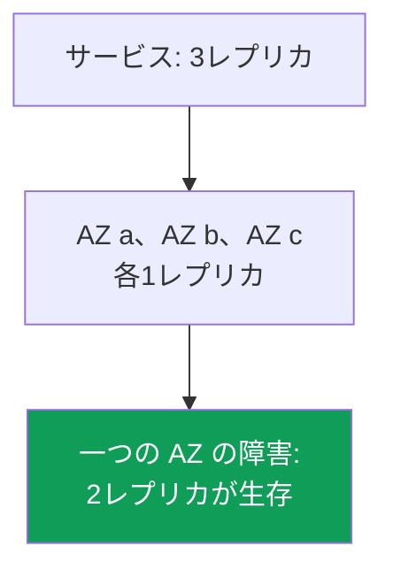
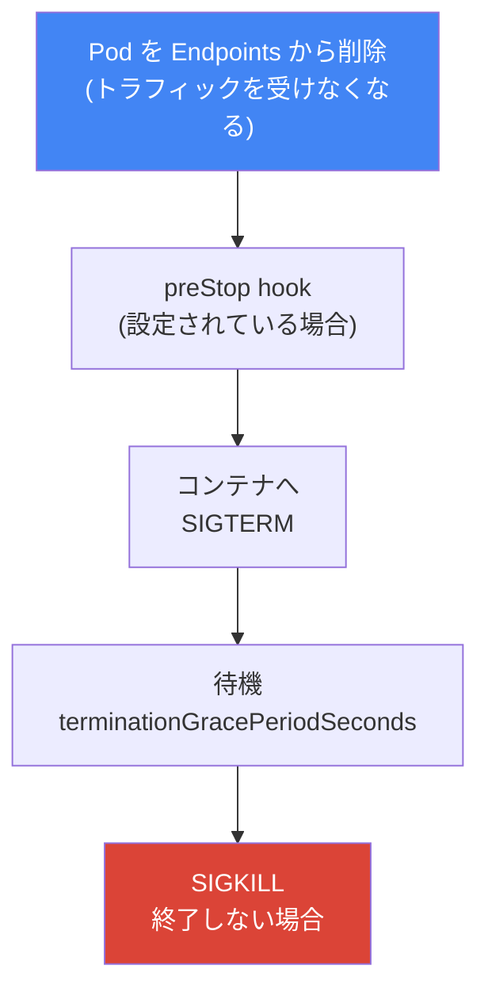
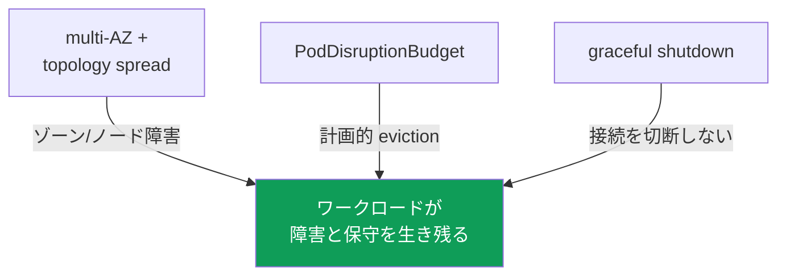

[Eng version](en.md) · [Versión en español](es.md) · [Version française](fr.md) · [Deutsche Version](de.md) · [Русская версия](ru.md) · [ქართული ვერსია](ge.md) · [繁體中文版](tw.md)
# 第40章. 信頼性: multi-AZ、PDB、topology spread、適切なノード停止

> **次は何か。** 第38章と第39章ではクラスターのバージョン、すなわち control plane とノードのアップグレード、7日間のウィンドウ内でのロールバックを扱いました。これは control plane の信頼性です。ここではワークロードの信頼性、つまり Pod が突然の障害（ノードまたはゾーンの停止）と計画保守（drain、アップグレード、consolidation）の両方をどう生き残るかを扱います。関連内容は他章にあります。Karpenter の disruption と consolidation、および `do-not-disrupt` は第12章、アップグレード中のノード更新は第38章、spot interruption は第13章、cross-AZ コストと `trafficDistribution` は第31章、ワークロードのスケーリング（HPA）は第35章です。

## 40.1. 「すべてのレプリカが一つのゾーンにある」

オンコールのシナリオです。Deployment は3レプリカで、すべて正常、負荷も処理しています。ところが一つの Availability Zone が停止すると、3レプリカあったにもかかわらずサービス全体が停止します。どこで動いていたかを見ます。

```bash
kubectl get pods -l app=web -o wide
# NAME          READY   STATUS    NODE                          ...
# web-7d..-a2   1/1     Running   ip-10-0-1-15.ec2.internal     # zone eu-west-1a
# web-7d..-b8   1/1     Running   ip-10-0-1-31.ec2.internal     # zone eu-west-1a
# web-7d..-c1   1/1     Running   ip-10-0-1-44.ec2.internal     # zone eu-west-1a
```

3レプリカすべてが一つのゾーンにあり、ときには一つのノード上にさえあります。Kubernetes scheduler はデフォルトでは Pod をゾーンに分散する義務を負いません。リソース上 Pod が収まるノードを探すだけなので、すべてのレプリカを近くに置くことがあります。正常時には見えませんが、ゾーンまたはノードの障害は「3レプリカ」をゼロに変えます。

同じ問題には計画的な版もあります。Karpenter consolidation（第12章）、ノードのアップグレード（第38章）、spot interruption（第13章）はノードをクラスターから外します。すべてのレプリカがそのノードにあれば一度に eviction され、短くても完全な停止になります。さらにノードが終了の時間なく突然停止すれば、開いている接続も切断され、クライアントは適切な再試行ではなくエラーを受け取ります。

これは配置、計画的 eviction 時の保護、適切な終了という三つの別問題です。しかし multi-AZ、topology spread、PodDisruptionBudget、適切なノード停止という、つながった一組の仕組みで解決します。順に確認して組み合わせましょう。

## 40.2. 障害ドメインとしての AZ

Availability Zone は、独立した電源、冷却、ネットワークを持つ、リージョン内の別個のデータセンター群です。リージョンのゾーンは物理的に分離されているため、一つの障害（電源、ネットワーク、自然災害）が他へ影響してはなりません。EKS エンジニアにとってゾーンは「ゾーンが落ちた」ときに丸ごと失われる、基本的な**障害境界**です。

EKS クラスターは最初から複数ゾーンに存在します。subnet は AZ に分散され（第00-3章）、ノードはそれらの subnet で起動し、AWS control plane も自身のコンポーネントを複数ゾーンに保持します。各ノードはゾーンに属し、Kubernetes は標準ラベル `topology.kubernetes.io/zone` を付けます。以降、Pod の分散にはこのラベルを使います。



ここから AWS 信頼性の主原則が得られます。可用性が重要なワークロードは少なくとも二つ、できれば三つのゾーンに分散しなければなりません。そうすれば AZ 障害で失うのは一部のレプリカだけです。これは compute（異なるゾーンのノード）とデータの両方に当てはまります。EBS volume はゾーンに束縛され（第23章）、EFS と FSx はゾーンをまたぐ共有ストレージを提供します（第24章）。

multi-AZ にはコストがあります。ゾーン間トラフィックは双方向で課金され、Pod をゾーンへ分散するとサービス間の cross-AZ トラフィックが増えます（第31章）。節約のために一つのゾーンへ集めたくなりますが、可用性が重要なワークロードでは誤りです。ゾーン障害時の停止コストは、ゾーン間トラフィックのコストとは比較になりません。`trafficDistribution: PreferClose` など第31章の節約策は、単一障害点を作る代価ではなく、適切な場所で使います。信頼性はトラフィック節約より重要です。

## 40.3. voluntary disruption と involuntary disruption

Kubernetes は Pod disruption を二つのクラスに分け、保護方法も異なります。両者の混同は「PDB があるのに、なぜノード障害でサービスが落ちたのか」という誤った期待のよくある原因です。

**voluntary disruption** は operator または controller が意図して開始します。ノード保守時の `kubectl drain`、クラスター更新時のノードアップグレード（第38章）、Karpenter consolidation と drift（第12章）、手動の Pod 削除です。これらは計画、減速、順序付けでき、PodDisruptionBudget はまさにこれらのために設計されています。

**involuntary disruption** は意思に関係なく発生します。ノードのハードウェア障害、AZ 全体の停止、メモリー不足による OOM kill、node-pressure による eviction、2分前通知の spot interruption（第13章）です。すでにノードが消えているため、待つよう頼めません。PDB はここでは役に立ちません。対象が異なるためです。

| クラス | 例 | 保護方法 |
|---|---|---|
| Voluntary | drain、ノードアップグレード、Karpenter consolidation、手動削除 | PDB、graceful shutdown |
| Involuntary | ノード/AZ 障害、OOM、node-pressure eviction、spot interruption | multi-AZ + topology spread、レプリカ |

覚えるべき結論は、**involuntary** disruption は配置（異なるゾーンとノードの複数レプリカ）で、**voluntary** disruption は disruption budget（PDB）と適切な終了で扱うということです。一方は他方を置き換えません。

## 40.4. topologySpreadConstraints: Pod を分散する

`topologySpreadConstraints` は Pod specification のフィールドで、scheduler に「このワークロードのレプリカを指定したドメインへ均等に配置せよ」と指示します。ドメインは `topologyKey` によるノードラベルで指定します。実際には次の二つです。

- `topology.kubernetes.io/zone`: ゾーンへの分散（AZ 障害の保護）。
- `kubernetes.io/hostname`: ノードへの分散（一つのノード障害の保護）。

制約の主なフィールドです。

| フィールド | 指定するもの |
|---|---|
| `maxSkew` | 最も多いドメインと最も少ないドメイン間で許す Pod 数の差 |
| `topologyKey` | ドメインを定義するノードラベル（ゾーン、ノード） |
| `whenUnsatisfiable` | 条件を満たせない場合の動作: `DoNotSchedule` または `ScheduleAnyway` |
| `labelSelector` | 分散を数える Pod（通常はアプリケーション自身のラベル） |
| `minDomains` | 分散対象とする最小ドメイン数（`DoNotSchedule` とのみ使用） |

`maxSkew` は偏りの尺度です。`maxSkew: 1` と三つのゾーンでは、3レプリカは各ゾーンに一つずつ置かれ、最も多いゾーンと最も少ないゾーンの差は1を超えません。`whenUnsatisfiable` は厳格さを決めます。`DoNotSchedule` は厳格な規則で、`maxSkew` を破らずに配置できなければ Pod は `Pending` のままです。`ScheduleAnyway` は緩やかで、scheduler は守ろうとしますが、不可能でも Pod を配置します。`minDomains` は新しいゾーンにまだノードがないときに有用です。少なくとも指定数のドメインがあるものとして扱わせ、他が空だからという理由で一つのゾーンにすべてを置かないようにします。

典型的な組み合わせは、ノードには厳格、ゾーンには緩やか、または同じく厳格という二つの制約です。

```yaml
topologySpreadConstraints:
  - maxSkew: 1
    topologyKey: topology.kubernetes.io/zone
    whenUnsatisfiable: DoNotSchedule      # ゾーンへ厳格に分散
    labelSelector:
      matchLabels: { app: web }
  - maxSkew: 1
    topologyKey: kubernetes.io/hostname
    whenUnsatisfiable: ScheduleAnyway     # ノード間では可能な限り分散
    labelSelector:
      matchLabels: { app: web }
```

同じく Pod を分散する `podAntiAffinity` との関係はどうでしょうか。`podAntiAffinity` は二値的な仕組みです。`requiredDuringScheduling` では「一つのドメインに Pod は一つまで」であり、段階がありません。`topologySpreadConstraints` はより細かく、許容する偏り（`maxSkew`）を指定でき、ゾーン内の二つ目のレプリカを禁止せず、分布を均等化します。「ゾーンとノードへできる限り均等に分散する」には topology spread を使います。厳格な `podAntiAffinity` は、「絶対にノードごとに一つだけ」のケース、たとえばノードリソースを競合するワークロード用に残します。

重要な注意点として、必要なゾーンにノードがないとき `DoNotSchedule` の厳しすぎる分散では Pod は `Pending` になります。Karpenter と組み合わせればこれは通常の動作です。収まらない Pod が、足りないゾーンにノードを起動するシグナルになります（第12章）。静的なノード群では厳格な spread が Pod を長く待機させるため、`ScheduleAnyway` に緩めるか、AZ 間のノードバランスを直します。

別のケースは volume を持つワークロードです。EBS volume はゾーンに属し、その `nodeAffinity` は Pod を volume 作成先の AZ へ恒久的に結び付けます（第23章）。したがって StatefulSet のゾーン間分散はレプリカ作成時には機能しますが、移動には機能しません。偏りの均等化のため別ゾーンで Pod を作り直すことはできず、`volume node affinity conflict` イベントとともに `Pending` になります。二つの帰結があります。StorageClass では `volumeBindingMode: WaitForFirstConsumer` が必須です。そうでなければ Pod より先に任意のゾーンで volume が作られます。また volume を持つワークロードでは、レプリカのゾーンを実質的に決めるのは topology spread ではなく volume です。

### RollingUpdate: 古いレプリカが偏りの計算を壊す

もう一つの罠は rollout でだけ見えます。`RollingUpdate` 中、古い ReplicaSet と新しい ReplicaSet の Pod が同時に存在します。制約の `labelSelector` は通常、共通アプリケーションラベル（`app: web`）を指定するため、scheduler は古い Pod と新しい Pod を同じドメインで数えます。`maxSkew: 1` と `DoNotSchedule` では、古いレプリカがまだいるゾーンに新しい Pod が収まらず `Pending` となり、分布が自然に収束するまで rollout が止まります。

`matchLabelKeys` で解決します。そこに列挙したラベルキーは作成中の Pod 自身から取得され `labelSelector` に追加されるため、偏りはその revision 内だけで数えられます。Deployment には controller が各 ReplicaSet に自動で付ける `pod-template-hash` が使えます。

```yaml
topologySpreadConstraints:
  - maxSkew: 1
    topologyKey: topology.kubernetes.io/zone
    whenUnsatisfiable: DoNotSchedule
    labelSelector:
      matchLabels: { app: web }
    matchLabelKeys:
      - pod-template-hash          # この revision の Pod の偏りを計算
```

このフィールドが期待どおり動く条件は、`matchLabelKeys` を `labelSelector` とともに指定すること、同じキーを両フィールドに置かないことです。Pod にないキーは黙って無視されるため、名前の typo は制約を通常のものへ変えてしまいます。フィールドは beta で Kubernetes 1.27 からデフォルト有効であり、現在の EKS バージョンで利用できます。実行中の Pod へ直接変更するラベルは `matchLabelKeys` に使えません。その変更を kube-apiserver が結合済み selector へ転記しないためです。

## 40.5. PodDisruptionBudget: 計画的 eviction の保護

`PodDisruptionBudget`（PDB）は、ワークロードから同時に eviction できる Pod 数を、**voluntary** disruption について制限するオブジェクトです。下限または上限を指定します。

- `minAvailable`: 利用可能なまま残すべき Pod 数（数またはパーセント）。
- `maxUnavailable`: 同時に停止可能な Pod 数。

仕組みは単純です。eviction API を呼び出すもの（`kubectl drain`、ノードアップグレード、Karpenter consolidation はいずれもこれを行う）があると、Kubernetes は PDB を確認します。eviction が budget を破るなら、十分な正常 Pod が起動するまで eviction はブロックされます。これによりノード drain はすべてのレプリカを同時に落とさず、新しいレプリカが起動するのを待ちながら一つずつ進みます。

```yaml
apiVersion: policy/v1
kind: PodDisruptionBudget
metadata: { name: web-pdb }
spec:
  minAvailable: 2            # 常に少なくとも2 Pod を利用可能に保つ
  selector:
    matchLabels: { app: web }
```

必ず理解すべき重要な制限は、**PDB は voluntary disruption だけを保護する**ことです。ノード障害、ゾーン停止、OOM、spot interruption を PDB は止められません。すでにノードが消えており、budget を問い合わせる相手もいないためです。involuntary disruption は PDB ではなく配置（40.2節と40.4節）で保護します。PDB と topology spread は異なる半分の問題を解決し、共に働きます。

PDB には逆の危険な側面があります。**厳しすぎる budget は、単に減速すべき操作をブロックします**。典型的な落とし穴です。

- `minAvailable` がレプリカ数と等しい（または `maxUnavailable: 0`）場合、Pod を一つも eviction できず、ノード `drain` は永遠に停止します。保守とノードアップグレード（第38章）が止まります。
- 同じ厳格な PDB は Karpenter の consolidation と drift（第12章）をブロックします。Karpenter は PDB を尊重し、budget を超えて Pod を eviction しないため、ノードは consolidation も更新もされません。
- 1レプリカのワークロードに `minAvailable: 1` の PDB を置くと、そのノードの drain は停止なしには不可能であり、budget によって完全に不可能になります。

健全な PDB には余裕があります。3レプリカでは `minAvailable: 2`（または `maxUnavailable: 1`）にすると、すべてを一度に失うのを防ぎながら、一つずつ保守できます。計画保守を生き残る必要があるワークロードでは、少なくとも2レプリカが前提です。1レプリカでは PDB は役に立たないか、drain を完全にブロックします。

### 障害 Pod が drain を止める: unhealthyPodEvictionPolicy

厳しすぎる budget より微妙な罠があり、アプリケーションがすでに悪い状態のときに発動します。`Ready` を報告しない Pod（バグによる `CrashLoopBackOff`、または失敗した readiness probe）は、PDB の正常 Pod と見なされず `status.currentHealthy` に入りません。デフォルトは `IfHealthyBudget` です。この方針では、アプリケーション自体が violation 状態でない、すなわち `currentHealthy` が `desiredHealthy` 以上の場合にのみ、異常 Pod の eviction を許します。すでに苦しいアプリケーションから最後のレプリカを奪わないという意図です。

これにより循環が生じます。3レプリカのうち2つが `CrashLoopBackOff` だとします。`currentHealthy` は1、`minAvailable: 2` の `desiredHealthy` は2です。アプリケーションは violation 状態であり、eviction API は壊れた Pod に対してさえ拒否します。`kubectl drain` は進まず、ノードアップグレード（第38章）と Karpenter consolidation（第12章）は止まります。壊れているのはクラスターでなくアプリケーションなので、Pod が勝手に正常になることもありません。手動でワークロードを修正し、Pod を直接削除するか、PDB を外す必要があります。

通常の解決策は `AlwaysAllow` です。異常 Pod は violation と見なされ、budget にかかわらず eviction されます。一方で正常 Pod は保護されたままです。

```yaml
spec:
  minAvailable: 2
  unhealthyPodEvictionPolicy: AlwaysAllow   # 障害 Pod により drain を止めない
  selector:
    matchLabels: { app: web }
```

このフィールドは Kubernetes 1.31 で stable となり feature gate なしで動きます。指定しなければ `IfHealthyBudget` です。フェーズに関する注意として、`Pending`、`Succeeded`、`Failed` の Pod は常に eviction されます。方針が決めるのは `Running` で `Ready` 条件を満たさない Pod、つまり `CrashLoopBackOff` や readiness を通らない Pod です。`IfHealthyBudget` は、早すぎる削除が保守の停止より危険なリソースまたはデータを守る Pod、たとえば quorum system やストレージに意図して残します。通常のアプリケーションワークロードには `AlwaysAllow` が便利で、壊れた deployment がクラスター全体の運用を妨げません。

## 40.6. 適切なノード停止

配置と PDB は Pod の置き場所と一度に eviction する数を解決します。三つ目は、eviction される Pod が処理中のリクエストを切断せず**適切に**離脱することです。これは graceful termination のライフサイクルです。

計画的なノードの退役は段階的に進みます。まず `cordon`（ノードを `SchedulingDisabled` とし、新しい Pod を受け入れない）、次に `drain`、つまり PDB を尊重して eviction API で Pod を退去させます。各 Pod に対して Kubernetes は同じ終了順序を実行します。



フィールドを見ます。`terminationGracePeriodSeconds`（デフォルト30）は SIGTERM と強制的な SIGKILL の間に Pod を待つ時間です。この間にアプリケーションは接続を閉じ、リクエストを完了しなければなりません。`preStop` は SIGTERM **より前に**実行される hook です。アプリケーションが停止を始める前に、load balancer と kube-proxy が Pod を routing から外す時間を与える短い待機をここに置くことがよくあります。

待機が必要なのは非同期によるずれのためです。Pod の離脱時、同時に（a）Service の Endpoints/EndpointSlice から削除され、（b）SIGTERM を受けます。しかし Endpoints の更新と load balancer からの除外は**非同期**で即時ではありません。終了中の Pod へしばらくトラフィックが届くことがあります。そのため Pod は応答を止める前に、まず ready でなくなり endpoints から外れなければなりません。readiness probe はそのための仕組みです。readiness を失敗させる（または `preStop` の待機を通す）ことで、応答停止前に Pod が endpoints から外れます。

AWS 側には load balancer という別レイヤーがあります。NLB または ALB（第26章）の背後の Pod が eviction されると、AWS Load Balancer Controller は target group から target を deregister します。しかし load balancer は接続を即時には切断しません。target group attribute `deregistration_delay.timeout_seconds`（デフォルト300秒）による **connection draining** が行われます。この時間は target への新規リクエストを止めますが、すでに開いている接続には完了を許します。Pod は load balancer が target を deregister し、アクティブ接続を drain する前に終了してはなりません。`terminationGracePeriodSeconds` が deregistration に必要な時間より短いと、接続の一部が切れます。したがって grace period は deregistration と整合させます。同じ課題には、新しい Pod の到着というもう一つの側面があります。

### Pod readiness gates: target より先に Pod が ready になる

`deregistration_delay` は Pod が load balancer から離脱する側を閉じます。到着側には対称的な穴があります。Kubernetes は自身の readiness probe で Pod を ready と見なし、それに基づいて rollout を続け、次の古い Pod を停止します。しかし AWS では target group の新しい target はまだ `initial` 状態です。load balancer は health check を実行中で、まだトラフィックを送信しません。少ないレプリカで高速に rollout すると、target group に `healthy` 状態の target が一つもない時間が発生します。古い target は `draining`、新しい target は `initial` です。クラスター内のすべての Pod が `Ready` でも、外部からは通常 deployment 中のサービス停止に見えます。

この穴は AWS Load Balancer Controller の pod readiness gate が閉じます。controller は `target-health.elbv2.k8s.aws` prefix の追加 readiness condition を Pod に加え、target group のその Pod の target が `healthy` になるまで false を保ちます。Pod が `Ready` でなければ Deployment controller は先へ進まず、古い Pod を停止しません。有効化は Pod specification ではなく namespace のラベルで行います。controller が mutating webhook により gate configuration を書き込みます。

```bash
# enable gate injection for the namespace
kubectl label namespace prod elbv2.k8s.aws/pod-readiness-gate-inject=enabled
# READINESS GATES column: 0/1 means target is not healthy yet; 1/1 means ready for traffic
kubectl get pods -n prod -o wide
```

この gate が動かない、または意図しない場所で動く条件があります。target group がノードではなく Pod を知る `target-type: ip` のときだけ動きます。`instance` モードでは動きません（第26章）。namespace には Service と、それを参照する TargetGroupBinding が必要です。gate は Pod 作成**時だけ**挿入されるため、namespace ラベルと Service または Ingress は Pod より**前に**作成します。そうしないと、すでに動く Pod には gate が付きません。controller が利用不能な場合の扱いも決めます。webhook の `failurePolicy` であり、`Ignore` は gate なしで Pod を通します（可用性を優先）。`Fail` はラベル付き namespace で Pod 作成を許しません（保証を優先）。

別の話題は、`drain` がなかったノードの**突然の**停止です。compute の種類により（第9章）、複数の仕組みが役立ちます。

| 仕組み | 動作 | 場所 |
|---|---|---|
| graceful node shutdown (kubelet) | OS shutdown を捕捉し、OS 停止前に grace を使って Pod を終了する | kubelet で有効な場合 |
| AWS Node Termination Handler (NTH) | queue から spot ITN、rebalance、ASG lifecycle を捕捉し、cordon と drain を行う | self-managed / MNG |
| Karpenter interruption | SQS queue で interruption に応答し、ノードを cordon と drain する | Karpenter 管理ノード（第13章） |
| EKS Auto Mode | 手動設定なしの組み込みノード適切終了 | Auto Mode（第9章） |

Graceful node shutdown は kubelet の機能です。OS shutdown event を購読し、ノード停止時に Pod をシステムとともに死なせず、grace period を尊重して停止できます。upstream では feature gate は有効ですが、`shutdownGracePeriod` と `shutdownGracePeriodCriticalPods` はデフォルトでゼロです。kubelet configuration に非ゼロ値を設定して明示的に有効化する必要があります（第10章）。NTH と Karpenter は EC2 interruption に同じ問題を解決します。将来のノード停止を早く知り（spot interruption なら例えば2分前）、Pod を適切に退去させます。Karpenter は interruption queue で自ら処理し、NTH は Karpenter が管理しないノードに導入します。EKS Auto Mode にはこの動作が組み込まれています。

## 40.7. まとめて組み合わせる

四つの仕組みは信頼性の異なる半分を閉じ、揃って初めて機能します。どれ一つだけでも十分ではありません。



組み合わせの論理です。

- **multi-AZ + topology spread** はレプリカをゾーンとノードに分散し、AZ またはノード障害で失うのを一部だけにします（involuntary の保護）。
- **PodDisruptionBudget** は計画的 eviction がレプリカを一度に削除するのを防ぎます。drain、アップグレード、consolidation は一つずつ進みます（voluntary の保護）。
- **graceful shutdown**（grace period、preStop、load balancer の connection draining）は、離脱する Pod を接続切断なしに終了します。

どれかを除けば穴ができます。分散がなければ PDB は drain を守れても、ゾーン障害ですべて落ちます。PDB がなければ分散は障害を生き残れても、ノードアップグレードがレプリカを一度に削除します。graceful がなければ、適切に見える eviction でも生きたリクエストを切ります。三つのゾーンに3レプリカ、PDB `minAvailable: 2`、preStop を含む妥当な grace period、整合した `deregistration_delay` があれば、ワークロードはゾーン障害と計画保守の両方に耐えます。

## 40.8. 本番での適用方法

- **重要なワークロードを少なくとも二つのゾーンへ分散する。** `topology.kubernetes.io/zone` による `topologySpreadConstraints` を「いつか後で」ではなく Deployment template に設定します。
- **PDB で保護するものは少なくとも2レプリカにする。** 1レプリカでは PDB は無用か、drain とノードアップグレード（第38章）を完全に止めます。
- **PDB が厳しすぎないか確認する。** レプリカ数と同じ `minAvailable` は、停止した drain とブロックされた Karpenter consolidation（第12章）の典型原因です。
- **grace period を load balancer の deregistration と整合させる。** `terminationGracePeriodSeconds` と `preStop` の待機は target group の `deregistration_delay` を考慮し、接続を切らないようにします。
- **異常 Pod の eviction を許可する。** `unhealthyPodEvictionPolicy: AlwaysAllow` により、`CrashLoopBackOff` の Pod がノード drain やクラスターアップグレード（第38章）を止めません。
- **revision 内で偏りを数える。** topology spread の `pod-template-hash` を持つ `matchLabelKeys` を使います。そうしないと過去の ReplicaSet の Pod が rollout を `Pending` にします。
- **ALB と NLB 背後のワークロードで pod readiness gates を有効にする。** namespace ラベルと `target-type: ip` を設定します。rollout は readiness probe だけでなく target group の `healthy` を待ちます。
- **volume のゾーン束縛を忘れない。** EBS を持つ StatefulSet のレプリカゾーンは topology spread ではなく volume が決めます（第23章）。
- **一つのゾーンにする代価としてトラフィックを節約しない。** cross-AZ traffic（第31章）は停止より安価です。`trafficDistribution` は分散がすでに確保された場所で使います。
- **組み込み interruption 処理に依存する。** Karpenter と EKS Auto Mode は interruption ノードから Pod を自ら退去させます。他のノードには NTH を導入します（第13章）。

## 40.9. ミニ用語集

- **Availability Zone (AZ)**: リージョン内の隔離されたデータセンター群。レプリカを分散する基本障害ドメイン。
- **voluntary disruption**: drain、ノードアップグレード、consolidation など、意図的な Pod eviction。PDB が保護する。
- **involuntary disruption**: ノード/AZ 障害、OOM、spot interruption など、制御不能な disruption。PDB ではなく分散が保護する。
- **topologySpreadConstraints**: レプリカをドメインへ均等に分散する Pod フィールド（`maxSkew`、`topologyKey`、`whenUnsatisfiable`、`minDomains`）。
- **maxSkew**: 最も多いドメインと最も少ないドメインの Pod 数の許容差。
- **PodDisruptionBudget (PDB)**: voluntary disruption で同時に eviction できる Pod 数を制限するオブジェクト（`minAvailable`/`maxUnavailable`）。
- **`unhealthyPodEvictionPolicy`**: PDB のフィールド。デフォルトの `IfHealthyBudget` はアプリケーションが violation 中に異常 Pod を eviction させず、`AlwaysAllow` は常に許す。
- **`matchLabelKeys`**: 分散制約の `labelSelector` に追加される Pod ラベルキー。`pod-template-hash` とともに使うと、Deployment の一つの revision 内で偏りを数える。
- **pod readiness gate**: Pod の追加 readiness condition。AWS Load Balancer Controller は target が `healthy` になるまで `target-health.elbv2.k8s.aws` を false にする。
- **terminationGracePeriodSeconds**: Pod を終了する SIGTERM と SIGKILL 間の時間（デフォルト30）。
- **preStop**: SIGTERM より前に実行される hook。停止前の待機に使う。
- **connection draining**: target deregistration 時にアクティブ接続を排出すること。`deregistration_delay.timeout_seconds` はデフォルト300。
- **graceful node shutdown**: OS 停止時に grace period を使って Pod を終了する kubelet 機能。

## 40.10. 章のまとめ

- scheduler はデフォルトでレプリカをゾーンやノードへ分散しない。明示的な分散がなければ一つの AZ に置かれ、その障害でサービス全体が停止する。
- AZ は AWS の基本障害ドメインである。重要なワークロードは `topology.kubernetes.io/zone` ラベルにより少なくとも二つのゾーンへ分散する。信頼性は cross-AZ traffic の節約より重要である。
- disruption は voluntary（drain、アップグレード、consolidation）と involuntary（ノード/AZ 障害、OOM、spot）に分かれ、異なる仕組みで保護する。
- `topologySpreadConstraints`（`maxSkew`、`topologyKey`、`whenUnsatisfiable`、`minDomains`）はレプリカをゾーンとノードへ分散する。二値の `podAntiAffinity` より細かく制御できる。
- PDB（`minAvailable`/`maxUnavailable`）は voluntary disruption だけを保護する。ノードまたはゾーン障害には分散が必要である。
- レプリカ数と等しい、または `maxUnavailable: 0` の厳しすぎる PDB は、drain、ノードアップグレード（第38章）、Karpenter consolidation（第12章）をブロックする。余裕と少なくとも2レプリカを持つ。
- デフォルトでは、アプリケーションがすでに violation 中の異常 Pod を eviction できないため、`CrashLoopBackOff` が drain を手動介入まで止める。`AlwaysAllow` がこれを解消する。
- rollout には二つの罠がある。古いレプリカが偏り計算を歪める（`matchLabelKeys` で解決）、Pod が target の `healthy` より先に `Ready` になる（gate で解決）。
- 適切な終了は cordon、drain、endpoints からの離脱、preStop、SIGTERM、grace period、SIGKILL であり、AWS 側では `deregistration_delay` による connection draining がある。
- 突然のノード停止は kubelet の graceful node shutdown、NTH、Karpenter の組み込み interruption 処理、EKS Auto Mode で緩和する（第9章、第13章）。
- 信頼性 = multi-AZ + topology spread（分散）+ PDB（計画操作の保護）+ graceful（接続を切らない）。仕組みはすべて揃って働く。

## 40.11. 実務での役立ち方

オンコールでこの章が示すのは、「一つのレプリカが落ちた」と「サービスが落ちた」の違いです。ゾーンが停止したり Karpenter がノードを consolidation したりしても、正しく分散、保護されたワークロードは一部のレプリカを失って動作を続けます。分散されないワークロードは丸ごと消えます。重要なサービスで最初に確認するのは `kubectl get pods -o wide` です。レプリカがどこにあり、何ゾーン、何ノードにまたがるかを見ます。すべて一つにあるなら、それは発生を待つインシデントであり、午前3時の調査ではなく分散で直します。

計画時には、可用性が重要なすべての Deployment template にいくつかの必須項目が加わります。2から3レプリカ、ゾーンとノードへの `topologySpreadConstraints`、余裕のある適切な PDB、考え抜かれた終了（grace period、preStop、load balancer deregistration との整合）です。PDB が厳しすぎないことも確認します。クラスターアップグレード（第38章）を失敗させ、Karpenter のノード consolidation（第12章）を妨げる最も多い原因はブロックされた drain です。これらを組み合わせると、計画保守と突然の障害のどちらも緊急事態でなく通常運用になります。

## 40.12. 自己確認問題

1. デフォルトで Deployment の全レプリカが一つの AZ に置かれる理由と危険性は何ですか。
2. なぜ AZ は AWS の基本障害ドメインとされ、Pod の分散にはどのノードラベルを使いますか。
3. multi-AZ の信頼性と cross-AZ traffic のコストはどう関係し、どちらが重要で、なぜですか。
4. voluntary disruption と involuntary disruption の違い、およびそれぞれを保護する仕組みは何ですか。
5. `maxSkew`、`topologyKey`、`whenUnsatisfiable`、`minDomains` は何を指定しますか。
6. `DoNotSchedule` と `ScheduleAnyway` の違いは何で、Pod はいつ `Pending` になりますか。
7. `topologySpreadConstraints` は `podAntiAffinity` よりどのように細かく、いつどちらを選びますか。
8. PDB はどの disruption を保護し、どれを保護しないのはなぜですか。
9. 厳しすぎる PDB が危険な理由と、drain、アップグレード、consolidation をどう壊すかを説明してください。
10. cordon から SIGKILL までの Pod 終了順序を説明してください。
11. Pod はなぜ死ぬ前に endpoints から外れる必要があり、`preStop` と readiness はどう役立ちますか。
12. connection draining とは何で、`deregistration_delay` は grace period の選択にどう影響しますか。
13. graceful node shutdown、NTH、Karpenter の interruption 処理は、突然のノード停止の問題をどう解決しますか。
14. `CrashLoopBackOff` の Pod がなぜ `drain` を完全にブロックできるのか、`unhealthyPodEvictionPolicy: AlwaysAllow` は何を変えるのか、いつ `IfHealthyBudget` を意図して残すのかを説明してください。
15. `RollingUpdate` 中に topology spread のため新しい Pod が `Pending` になる理由と、`pod-template-hash` を使う `matchLabelKeys` がどう解決するかを説明してください。
16. controller の pod readiness gate は何を提供し、なぜ `target-type: instance` では役に立ちませんか。
17. EBS volume を持つ StatefulSet の分散を、別ゾーンで Pod を再作成して均等化できない理由と、`DoNotSchedule` への影響は何ですか。

## Practice

このトピックのコースラボ: [ラボ131: 信頼性: PDB が drain をブロック、topology spread、matchLabelKeys](../../labs/131/README_JP.MD)。ここでは `topologySpreadConstraints` によるゾーン分散、`kubectl drain` を timeout で失敗させる厳しすぎる `PodDisruptionBudget` の症状と修正、`unhealthyPodEvictionPolicy: AlwaysAllow`、新しい revision の偏りを確認する rolling update を扱います。結果は `check_result` コマンドで確認します。

以下は、任意の自分のクラスターで通常コマンドにより行う同じ確認です。まず分散、すなわち重要なサービスのレプリカがどこにあり、何ゾーンにあるかから始めます。

```bash
# nodes hosting the replicas
kubectl get pods -l app=web -o wide
# node zones: match NODE above with its zone label
kubectl get nodes -L topology.kubernetes.io/zone
```

次に、設定されている PDB と余裕を確認します（ALLOWED DISRUPTIONS がゼロより大きければ drain は通り、ゼロならブロックされます）。

```bash
# disruption budgets and allowed eviction count
kubectl get pdb -A
# details of a particular PDB: minAvailable, current/expected pods
kubectl describe pdb web-pdb
# policy for unhealthy pods: empty means IfHealthyBudget
kubectl get pdb -A -o custom-columns=NS:.metadata.namespace,PDB:.metadata.name,POLICY:.spec.unhealthyPodEvictionPolicy
```

実際には eviction せず、dry-run drain で計画的 eviction がどう見えるかを確認し、ノードの説明で status と taint も見ます。

```bash
# pods that would be evicted by drain, without actual eviction
kubectl drain <node> --ignore-daemonsets --dry-run=client
# node status, zone labels, taints, and events
kubectl describe node <node>
```

三つを照合します。レプリカはゾーンとノードへ分散されているか、PDB は eviction の余裕を残すか、Pod に `terminationGracePeriodSeconds` と `preStop` は設定されているかです。ALB と NLB 背後のワークロードでは、`kubectl get pods -o wide` の `READINESS GATES` 列も確認します。空の列は namespace ラベルがなく、rollout が target group の `healthy` を待たないことを意味します。レプリカが一つのゾーンにある、または PDB がすべての drain をブロックするなら、それは今修正する方が安い将来のインシデントです。Karpenter disruption は第12章、spot interruption と NTH は第13章、cross-AZ コストは第31章を参照してください。

---
[目次](../README_JP.md) · [第39章](../39/jp.md) · [第41章](../41/jp.md)
