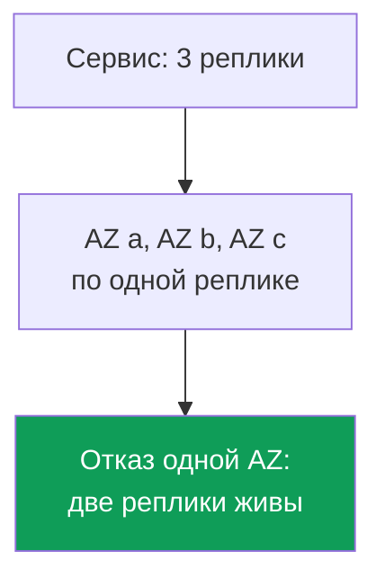
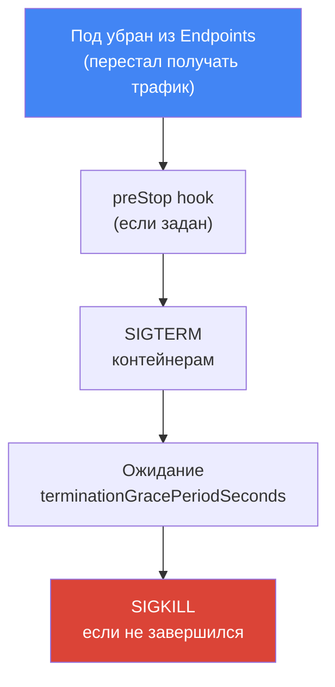
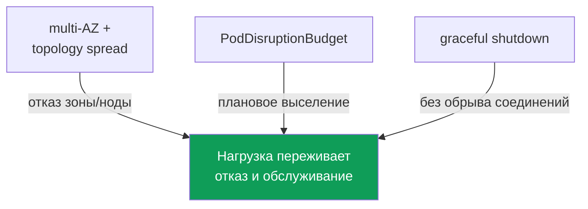

[Eng version](en.md) · [Versión en español](es.md) · [Version française](fr.md) · [Deutsche Version](de.md) · [ქართული ვერსია](ge.md) · [繁體中文版](tw.md) · [日本語版](jp.md)
# Глава 40. Надёжность: multi-AZ, PDB, topology spread, корректное выключение нод

> **Что дальше.** Главы 38 и 39 разобрали версии кластера: апгрейд control plane и нод и
> откат в окне 7 дней. Это надёжность control plane. Здесь - надёжность нагрузок: как поды
> переживают и внезапный отказ (падение ноды или зоны), и плановое обслуживание (drain,
> апгрейд, консолидация). Смежное отдано другим главам: disruption и consolidation Karpenter,
> `do-not-disrupt` - глава 12; обновление нод при апгрейде - глава 38; spot-прерывания - глава
> 13; cross-AZ стоимость и `trafficDistribution` - глава 31; масштабирование нагрузок (HPA) -
> глава 35.

## 40.1. «Все реплики оказались в одной зоне»

Сценарий с дежурства. Deployment на три реплики, всё зелёное, нагрузка держится. Падает одна
Availability Zone - и сервис ложится целиком, хотя реплик было три. Смотрим, где они стояли:

```bash
kubectl get pods -l app=web -o wide
# NAME          READY   STATUS    NODE                          ...
# web-7d..-a2   1/1     Running   ip-10-0-1-15.ec2.internal     # zone eu-west-1a
# web-7d..-b8   1/1     Running   ip-10-0-1-31.ec2.internal     # zone eu-west-1a
# web-7d..-c1   1/1     Running   ip-10-0-1-44.ec2.internal     # zone eu-west-1a
```

Все три реплики - в одной зоне, а иногда и на одной ноде. Планировщик Kubernetes по умолчанию
не обязан разносить поды по зонам: он ищет ноду, где под влезает по ресурсам, и вполне может
сложить все реплики рядом. Пока всё работает, это незаметно. Отказ зоны или ноды превращает
«три реплики» в ноль.

У той же боли есть и плановая версия. Консолидация Karpenter (глава 12), апгрейд нод (глава 38)
или spot-прерывание (глава 13) уводят ноду из кластера. Если все реплики сидели на ней, они
выселяются разом - кратковременный, но полный простой. А если нода при этом выключилась резко,
без времени на завершение, оборванными оказываются и открытые соединения: клиенты получают
ошибки, а не аккуратный повтор запроса.

Три разные проблемы - размещение, защита при плановом выселении и аккуратное завершение - но
решаются они одним связанным набором механизмов: multi-AZ, topology spread, PodDisruptionBudget
и корректное выключение нод. Разберём по очереди и соберём вместе.

## 40.2. AZ как домен отказа

Availability Zone - это отдельный набор дата-центров в регионе с независимым питанием,
охлаждением и сетью. Зоны в регионе физически разнесены, поэтому отказ одной (питание,
сеть, стихия) не должен затрагивать другие. Для инженера EKS зона - это базовая **граница
сбоя**: то, что укладывается целиком, когда «падает зона».

Кластер EKS изначально живёт в нескольких зонах. Подсети раскиданы по AZ (глава 00-3), ноды
поднимаются в этих подсетях, а control plane AWS держит свои компоненты в нескольких зонах сам.
Каждая нода привязана к своей зоне, и Kubernetes проставляет ей стандартную метку
`topology.kubernetes.io/zone`. Именно по этой метке дальше и раскладывают поды.



Отсюда главный принцип надёжности в AWS: нагрузка, которой важна доступность, должна быть
разложена минимум по двум, а лучше по трём зонам, - тогда отказ AZ уносит лишь часть реплик.
Это касается и вычислений (ноды в разных зонах), и данных: у EBS-тома зональная привязка (глава
23), а межзональное общее хранилище дают EFS и FSx (глава 24).

У multi-AZ есть цена. Трафик между зонами тарифицируется в обе стороны, и «размазать» поды по
зонам означает добавить cross-AZ трафик между сервисами (глава 31). Возникает соблазн собрать
всё в одну зону ради экономии. Для нагрузок, которым важна доступность, это ошибка: стоимость
межзонального трафика несопоставима со стоимостью простоя при отказе зоны. Экономию на трафике
(`trafficDistribution: PreferClose` и прочее из главы 31) применяют там, где ей есть место,
а не ценой единой точки отказа. Надёжность важнее экономии трафика.

## 40.3. Добровольные и недобровольные нарушения

Kubernetes делит нарушения работы подов (disruptions) на два класса, и защищаются они
по-разному. Путаница между ними - частый источник ложных ожиданий («у меня же PDB, почему
сервис упал при отказе ноды?»).

**Добровольные нарушения (voluntary disruptions)** запускает оператор или контроллер осознанно:
`kubectl drain` при обслуживании ноды, апгрейд нод при обновлении кластера (глава 38),
консолидация и drift Karpenter (глава 12), ручное удаление пода. Их можно спланировать,
притормозить и упорядочить - и именно на них рассчитан PodDisruptionBudget.

**Недобровольные нарушения (involuntary disruptions)** случаются без спроса: аппаратный отказ
ноды или падение всей AZ, OOM-kill при нехватке памяти, вытеснение по node-pressure,
spot-прерывание с двухминутным уведомлением (глава 13). Их не «попросишь подождать»: узел уже
исчезает. PDB здесь не помогает - он не про это.

| Класс | Примеры | Чем защищаемся |
|---|---|---|
| Voluntary | drain, апгрейд нод, консолидация Karpenter, ручное удаление | PDB, graceful shutdown |
| Involuntary | отказ ноды/AZ, OOM, node-pressure eviction, spot-прерывание | multi-AZ + topology spread, реплики |

Вывод, который держат в голове: от **недобровольных** нарушений спасает раскладка (несколько
реплик в разных зонах и на разных нодах), от **добровольных** - бюджет нарушений (PDB) и
аккуратное завершение. Одно другое не заменяет.

## 40.4. topologySpreadConstraints: раскладываем поды

`topologySpreadConstraints` - это поле в спецификации пода, которым мы говорим планировщику:
«держи реплики этой нагрузки ровно разложенными по такому-то домену». Домен задаётся меткой
ноды через `topologyKey`; на практике это две метки:

- `topology.kubernetes.io/zone` - раскладка по зонам (защита от отказа AZ);
- `kubernetes.io/hostname` - раскладка по нодам (защита от отказа одной ноды).

Ключевые поля ограничения:

| Поле | Что задаёт |
|---|---|
| `maxSkew` | допустимая разница числа подов между самым полным и самым пустым доменом |
| `topologyKey` | метка ноды, определяющая домен (зона, нода) |
| `whenUnsatisfiable` | что делать, если условие не выполнить: `DoNotSchedule` или `ScheduleAnyway` |
| `labelSelector` | по каким подам считать раскладку (обычно метки самого приложения) |
| `minDomains` | минимальное число доменов, по которым надо размазаться (только с `DoNotSchedule`) |

`maxSkew` - мера перекоса. При `maxSkew: 1` и трёх зонах три реплики лягут по одной на зону:
разница между самой полной и самой пустой зоной не превысит 1. `whenUnsatisfiable` определяет
жёсткость: `DoNotSchedule` - строгое правило, под останется `Pending`, если разложить без
нарушения `maxSkew` нельзя; `ScheduleAnyway` - мягкое, планировщик старается соблюсти, но при
невозможности всё равно разместит под. `minDomains` полезен, когда нод в новой зоне ещё нет:
он заставляет считать, что доменов должно быть не меньше заданного числа, и не даёт сложить всё
в одну зону только потому, что другие пока пусты.

Типичная связка - два ограничения сразу: жёстко по нодам и мягко (или тоже жёстко) по зонам.

```yaml
topologySpreadConstraints:
  - maxSkew: 1
    topologyKey: topology.kubernetes.io/zone
    whenUnsatisfiable: DoNotSchedule      # строго размазать по зонам
    labelSelector:
      matchLabels: { app: web }
  - maxSkew: 1
    topologyKey: kubernetes.io/hostname
    whenUnsatisfiable: ScheduleAnyway     # по нодам - по возможности
    labelSelector:
      matchLabels: { app: web }
```

Как это соотносится с `podAntiAffinity`, который тоже разносит поды? `podAntiAffinity` -
булев инструмент: «не более одного пода на домен» при `requiredDuringScheduling`, без градаций.
`topologySpreadConstraints` тоньше: он позволяет задать допустимый перекос (`maxSkew`) и не
запрещает вторую реплику в зоне, а лишь выравнивает распределение. Для «размазать по зонам и
нодам как можно ровнее» берут topology spread; жёсткое `podAntiAffinity` оставляют для случаев
«категорически по одному на ноду» (например, для нагрузок, конкурирующих за ресурс ноды).

Важная тонкость: с `DoNotSchedule` слишком строгая раскладка при нехватке нод в нужной зоне
оставит под в `Pending`. В связке с Karpenter это штатно: невлезающий под становится сигналом
поднять ноду в недостающей зоне (глава 12). Со статичным набором нод строгий spread может
надолго подвесить под - тогда либо смягчают до `ScheduleAnyway`, либо чинят баланс нод по AZ.

Отдельный случай - нагрузка со своим томом. Том EBS зональный, и его `nodeAffinity` навсегда
привязывает под к той AZ, где том создан (глава 23). Поэтому раскладка StatefulSet по зонам
работает на создании реплик, а не на их переезде: пересоздать под в другой зоне ради
выравнивания перекоса нельзя - он встанет в `Pending` с событием `volume node affinity
conflict`. Отсюда два следствия: `volumeBindingMode: WaitForFirstConsumer` в StorageClass
обязателен, иначе том появится в произвольной зоне раньше пода, а для нагрузок с томами зону
реплики фактически определяет её том, а не topology spread.

### RollingUpdate: старые реплики портят расчёт перекоса

Ещё одна ловушка видна только на выкатке. При `RollingUpdate` в кластере одновременно живут
поды старого и нового ReplicaSet, а `labelSelector` ограничения обычно указывает на общую метку
приложения (`app: web`) - значит планировщик считает в одном домене и старые, и новые поды. При
`maxSkew: 1` и `DoNotSchedule` новый под не влезает в зону, где старая реплика ещё жива, и
висит в `Pending`: выкатка топчется на месте, пока баланс не сойдётся сам.

Лечится полем `matchLabelKeys`. Перечисленные в нём ключи меток берутся из самого создаваемого
пода и добавляются к `labelSelector`, поэтому перекос считается только внутри своей ревизии.
Для Deployment подходит `pod-template-hash` - метка, которую контроллер проставляет каждому
ReplicaSet сам.

```yaml
topologySpreadConstraints:
  - maxSkew: 1
    topologyKey: topology.kubernetes.io/zone
    whenUnsatisfiable: DoNotSchedule
    labelSelector:
      matchLabels: { app: web }
    matchLabelKeys:
      - pod-template-hash          # считать перекос по подам своей ревизии
```

Условия, без которых поле не работает или работает не так, как ждут: `matchLabelKeys` задаётся
только вместе с `labelSelector`; один и тот же ключ не может стоять в обоих полях; ключ,
которого у пода нет, молча игнорируется, поэтому опечатка в имени превращает ограничение в
обычное. Поле в статусе beta и включено по умолчанию с Kubernetes 1.27, то есть на актуальных
версиях EKS доступно. Метки, которые правят прямо на живых подах, в `matchLabelKeys` не берут:
такую правку kube-apiserver в объединённый селектор не перенесёт.

## 40.5. PodDisruptionBudget: защита при плановом выселении

`PodDisruptionBudget` (PDB) - это объект, который ограничивает, сколько подов нагрузки можно
одновременно выселить **добровольным** нарушением. Он задаёт нижнюю или верхнюю границу:

- `minAvailable` - сколько подов должно оставаться доступными (число или процент);
- `maxUnavailable` - сколько подов можно одновременно вывести из строя.

Механика простая: когда что-то вызывает eviction API (а `kubectl drain`, апгрейд нод,
консолидация Karpenter делают именно это), Kubernetes проверяет PDB. Если выселение нарушит
бюджет, eviction блокируется до тех пор, пока не встанет достаточно здоровых подов. Так drain
ноды не сносит все реплики разом, а идёт по одной, дожидаясь, пока новая реплика встанет.

```yaml
apiVersion: policy/v1
kind: PodDisruptionBudget
metadata: { name: web-pdb }
spec:
  minAvailable: 2            # всегда держать доступными минимум 2 пода
  selector:
    matchLabels: { app: web }
```

Ключевое ограничение, которое надо усвоить твёрдо: **PDB защищает только от добровольных
нарушений**. Отказ ноды, падение зоны, OOM, spot-прерывание PDB не остановит - узел уже
исчезает, спрашивать бюджет не у кого. От недобровольных нарушений защищает раскладка (раздел
40.2 и 40.4), а не PDB. PDB и topology spread решают разные половины задачи и работают вместе.

У PDB есть обратная, коварная сторона - **слишком жёсткий бюджет блокирует то, что должен был
лишь притормозить**. Классические грабли:

- `minAvailable` равен числу реплик (или `maxUnavailable: 0`): выселить нельзя ни одного пода,
  и `drain` ноды виснет навсегда - обслуживание и апгрейд нод (глава 38) встают.
- тот же жёсткий PDB блокирует консолидацию и drift Karpenter (глава 12): Karpenter уважает PDB
  и не станет выселять поды сверх бюджета, поэтому нода не консолидируется и не обновляется.
- PDB на нагрузку с одной репликой и `minAvailable: 1`: любой drain этой ноды невозможен без
  простоя, а бюджет делает его невозможным вовсе.

Здоровый PDB оставляет запас: для трёх реплик `minAvailable: 2` (или `maxUnavailable: 1`)
защищает от «снесли всё разом», но позволяет обслуживанию идти по одному поду. Для нагрузок,
которые обязаны переживать плановое обслуживание, минимум две реплики - предусловие: с одной
репликой PDB либо бесполезен, либо намертво блокирует drain.

### Упавший под держит drain: unhealthyPodEvictionPolicy

Есть ловушка тоньше жёсткого бюджета, и она срабатывает именно тогда, когда с приложением уже
плохо. Под, который не сообщает `Ready` (`CrashLoopBackOff` из-за бага или проваленная
readiness probe), в статусе PDB здоровым не считается и в `status.currentHealthy` не входит.
По умолчанию
действует политика `IfHealthyBudget`: нездоровый под разрешено выселить только если само
приложение не нарушено, то есть `currentHealthy` не меньше `desiredHealthy`. Замысел добрый -
не отбирать последние реплики у приложения, которому и так тяжело.

Получается замкнутый круг. Пусть из трёх реплик две в `CrashLoopBackOff`: `currentHealthy`
равен 1, при `minAvailable: 2` значение `desiredHealthy` равно 2, приложение нарушено - и
eviction API
отказывает даже на сломанных подах. `kubectl drain` не двигается, апгрейд нод (глава 38) и
консолидация Karpenter (глава 12) встают, а здоровыми поды сами не станут: сломано приложение,
а не кластер. Разгребают руками - чинят нагрузку, удаляют поды напрямую или снимают PDB.

Штатный выход - политика `AlwaysAllow`: нездоровые поды считаются нарушенными и выселяются
независимо от бюджета, а здоровые остаются под защитой.

```yaml
spec:
  minAvailable: 2
  unhealthyPodEvictionPolicy: AlwaysAllow   # не держать drain из-за упавших подов
  selector:
    matchLabels: { app: web }
```

Поле стабильно с Kubernetes 1.31 и работает без feature gate; если его не задать, действует
`IfHealthyBudget`. Оговорка про фазы: поды в `Pending`, `Succeeded` и `Failed` выселяются
всегда, а политика решает судьбу подов в фазе `Running` без условия `Ready` - то есть ровно
`CrashLoopBackOff` и не проходящих readiness. `IfHealthyBudget` оставляют там, где под
сторожит ресурс или данные и его преждевременное удаление опаснее зависшего обслуживания
(кворумные системы, хранилища). Для обычных прикладных нагрузок `AlwaysAllow` удобнее: он не
даёт сломанному деплою заблокировать эксплуатацию всего кластера.

## 40.6. Корректное выключение нод

Раскладка и PDB решают, где стоят поды и сколько выселять разом. Остаётся третья половина -
чтобы выселяемый под уходил **аккуратно**, не обрывая обслуживаемые запросы. Это жизненный цикл
корректного завершения.

Плановое выведение ноды идёт по шагам: сначала `cordon` (нода помечается
`SchedulingDisabled`, новые поды на неё не приходят), затем `drain` - выселение подов через
eviction API с уважением к PDB. Для каждого пода Kubernetes выполняет одну и ту же
последовательность завершения:



Разберём поля. `terminationGracePeriodSeconds` (по умолчанию 30) - сколько под ждёт между
SIGTERM и жёстким SIGKILL. За это время приложение должно закрыть соединения и завершить
запросы. `preStop` - hook, который выполняется **до** SIGTERM: в него часто ставят короткую
паузу, чтобы дать балансировщикам и kube-proxy время убрать под из маршрутизации, прежде чем
приложение начнёт останавливаться.

Почему пауза вообще нужна - из-за рассинхрона. Когда под уходит, он одновременно (а) удаляется
из Endpoints/EndpointSlice сервиса и (б) получает SIGTERM. Но обновление Endpoints и снятие
пода с балансировщика происходят **асинхронно** и не мгновенно: какое-то время трафик ещё может
прилетать на уже завершающийся под. Поэтому под должен сначала перестать быть готовым и уйти из
endpoints, и лишь потом умирать. readiness probe здесь - инструмент: провалив readiness (или
через `preStop`-паузу), под выводится из endpoints до того, как перестанет отвечать.

На стороне AWS есть свой уровень - балансировщик. Когда под за NLB или ALB (глава
26) выселяется, AWS Load Balancer Controller дерегистрирует его target из target group. Но
балансировщик не рвёт соединения мгновенно: действует **connection draining**, управляемый
атрибутом target group `deregistration_delay.timeout_seconds` (по умолчанию 300 секунд). В
течение этого окна балансировщик перестаёт слать новые запросы на target, но даёт завершиться
уже открытым. Смысл: под не должен умереть раньше, чем балансировщик дерегистрирует его target
и сольёт активные соединения. Если `terminationGracePeriodSeconds` меньше, чем нужно на
дерегистрацию, часть соединений оборвётся. Поэтому grace period согласуют с дерегистрацией, а у
той же задачи есть вторая половина - приход нового пода.

### Pod readiness gates: под готов раньше, чем target

`deregistration_delay` закрывает уход пода из балансировщика. На приходе остаётся симметричная
дыра. Kubernetes считает под готовым по своей readiness probe и на этом основании продолжает
выкатку - гасит очередной старый под. А в AWS новый target в target group ещё в состоянии
`initial`: балансировщик прогоняет свои health checks и трафик на него пока не отдаёт. На
быстрой выкатке с малым числом реплик возникает окно, где в target group нет ни одного target в
состоянии `healthy` - старые уже `draining`, новые ещё `initial`. Снаружи это выглядит как
отказ сервиса при штатном деплое, хотя в кластере все поды `Ready`.

Закрывает окно pod readiness gate от AWS Load Balancer Controller. Контроллер добавляет поду
дополнительное условие готовности с префиксом `target-health.elbv2.k8s.aws` и держит его
ложным, пока target этого пода не станет `healthy` в target group. Под не `Ready` - контроллер
Deployment не идёт дальше и не гасит старые поды. Включается это не в спецификации пода, а
меткой на namespace: конфигурацию гейта контроллер вписывает сам мутирующим вебхуком.

```bash
# включить инъекцию гейтов для namespace
kubectl label namespace prod elbv2.k8s.aws/pod-readiness-gate-inject=enabled
# столбец READINESS GATES: 0/1 - target ещё не healthy, 1/1 - готов принимать трафик
kubectl get pods -n prod -o wide
```

Условия, без которых гейт не сработает или сработает не там: он работает только при
`target-type: ip`, потому что в режиме `instance` target group знает ноду, а не под (глава 26);
в namespace должны существовать Service и ссылающийся на него TargetGroupBinding; гейт
вписывается ТОЛЬКО при создании пода, поэтому метку на namespace и объекты Service или Ingress
создают ДО подов, иначе уже запущенные поды остаются без гейта. Отдельно решают, что делать при
недоступном контроллере: это задаёт `failurePolicy` вебхука - `Ignore` пропускает поды без
гейта (доступность важнее), `Fail` не даёт создавать поды в помеченных namespace (гарантия
важнее).

Отдельная тема - **резкое** выключение ноды, когда шага `drain` не было. Тут помогает несколько
механизмов, в зависимости от типа вычислений (глава 9):

| Механизм | Что делает | Где |
|---|---|---|
| graceful node shutdown (kubelet) | ловит системный shutdown, гасит поды с grace до остановки ОС | если включён в kubelet |
| AWS Node Termination Handler (NTH) | ловит spot ITN, rebalance, ASG lifecycle из очереди, cordon и drain | self-managed / MNG |
| Karpenter interruption | по своей очереди SQS реагирует на прерывания, cordon и drain ноды | ноды под Karpenter (глава 13) |
| EKS Auto Mode | корректное завершение нод из коробки, без ручной настройки | Auto Mode (глава 9) |

Graceful node shutdown - функция kubelet: он подписывается на события выключения ОС и при
остановке ноды успевает выселить поды с соблюдением grace period, а не даёт им умереть вместе с
системой. В апстриме feature gate включён, но параметры `shutdownGracePeriod` и
`shutdownGracePeriodCriticalPods` по умолчанию нулевые - функцию надо явно включить,
задав ненулевые значения в конфигурации kubelet (глава 10). NTH и Karpenter решают ту же задачу
для прерываний EC2: узнают о будущей остановке ноды заранее (например, за две минуты при
spot-прерывании) и корректно уводят с неё поды. Karpenter обрабатывает прерывания сам через
interruption-очередь; NTH ставят для нод, которыми Karpenter не управляет; у EKS Auto Mode это
поведение встроено.

## 40.7. Собираем вместе

Четыре механизма закрывают разные половины надёжности и работают только вместе. Ни один из них
по отдельности не спасает.



Логика связки:

- **multi-AZ + topology spread** раскладывают реплики по зонам и нодам - отказ AZ или ноды
  уносит лишь часть, а не всё (защита от involuntary).
- **PodDisruptionBudget** не даёт плановому выселению снести реплики разом - drain, апгрейд,
  консолидация идут по одному поду (защита от voluntary).
- **graceful shutdown** (grace period, preStop, connection draining на балансировщике)
  завершает уходящий под без обрыва соединений.

Убери любой элемент - появляется дыра. Без раскладки PDB защитит от drain, но отказ зоны уронит
всё. Без PDB раскладка переживёт отказ, но апгрейд нод снесёт реплики разом. Без graceful даже
аккуратное выселение оборвёт живые запросы. Три реплики в трёх зонах, PDB `minAvailable: 2`,
разумный grace period с preStop и согласованным `deregistration_delay` - и нагрузка держит и
падение зоны, и плановое обслуживание.

## 40.8. Как это применяют в продакшене

- **Раскладывают критичные нагрузки минимум по двум зонам.** `topologySpreadConstraints` по
  `topology.kubernetes.io/zone` ставят в шаблон Deployment, а не «когда-нибудь потом».
- **Держат минимум две реплики у всего, что защищают PDB.** С одной репликой PDB либо
  бесполезен, либо намертво блокирует drain и апгрейд нод (глава 38).
- **Проверяют PDB на «не слишком жёсткий».** `minAvailable`, равный числу реплик, - типичная
  причина зависшего drain и заблокированной консолидации Karpenter (глава 12).
- **Согласуют grace period с дерегистрацией балансировщика.** `terminationGracePeriodSeconds`
  и `preStop`-пауза учитывают `deregistration_delay` target group, чтобы не рвать соединения.
- **Разрешают выселять нездоровые поды.** `unhealthyPodEvictionPolicy: AlwaysAllow` не даёт
  подам в `CrashLoopBackOff` заблокировать drain нод и апгрейд кластера (глава 38).
- **Считают перекос по своей ревизии.** `matchLabelKeys` с `pod-template-hash` в topology
  spread, иначе поды прошлого ReplicaSet подвешивают выкатку в `Pending`.
- **Включают pod readiness gates для нагрузок за ALB и NLB.** Метка на namespace и
  `target-type: ip`: выкатка ждёт `healthy` в target group, а не только readiness probe.
- **Помнят про зональную привязку томов.** Для StatefulSet с EBS зону реплики определяет её
  том, а не topology spread (глава 23).
- **Не экономят на трафике ценой единой зоны.** cross-AZ трафик (глава 31) дешевле простоя;
  `trafficDistribution` применяют там, где раскладка уже обеспечена.
- **Полагаются на встроенную обработку прерываний.** Karpenter и EKS Auto Mode уводят поды с
  прерываемых нод сами; для прочих нод ставят NTH (глава 13).

## 40.9. Мини-глоссарий

- **Availability Zone (AZ)** - изолированный набор дата-центров региона; базовый домен отказа,
  по которому раскладывают реплики.
- **voluntary disruption** - осознанное выселение подов: drain, апгрейд нод, консолидация;
  защищается PDB.
- **involuntary disruption** - неконтролируемое: отказ ноды/AZ, OOM, spot-прерывание;
  защищается раскладкой, а не PDB.
- **topologySpreadConstraints** - поле пода для равномерной раскладки реплик по доменам
  (`maxSkew`, `topologyKey`, `whenUnsatisfiable`, `minDomains`).
- **maxSkew** - допустимый перекос числа подов между самым полным и самым пустым доменом.
- **PodDisruptionBudget (PDB)** - объект, ограничивающий число одновременно выселяемых
  подов при добровольных нарушениях (`minAvailable`/`maxUnavailable`).
- **`unhealthyPodEvictionPolicy`** - поле PDB: `IfHealthyBudget` (по умолчанию) не даёт
  выселять нездоровые поды при уже нарушенном приложении, `AlwaysAllow` разрешает всегда.
- **`matchLabelKeys`** - ключи меток пода, добавляемые к `labelSelector` ограничения
  раскладки; с `pod-template-hash` перекос считается внутри одной ревизии Deployment.
- **pod readiness gate** - дополнительное условие готовности пода; AWS Load Balancer
  Controller держит `target-health.elbv2.k8s.aws` ложным, пока target не станет `healthy`.
- **terminationGracePeriodSeconds** - время между SIGTERM и SIGKILL для завершения пода
  (по умолчанию 30).
- **preStop** - hook, выполняемый до SIGTERM; используется для паузы перед остановкой.
- **connection draining** - слив активных соединений при дерегистрации target;
  `deregistration_delay.timeout_seconds` (по умолчанию 300).
- **graceful node shutdown** - функция kubelet, гасящая поды с grace period при остановке ОС.

## 40.10. Итоги главы

- Планировщик по умолчанию не разносит реплики по зонам и нодам; без явной раскладки они
  могут оказаться в одной AZ, и её отказ кладёт сервис целиком.
- AZ - базовый домен отказа в AWS; критичные нагрузки раскладывают минимум по двум зонам через
  метку `topology.kubernetes.io/zone`. Надёжность важнее экономии на cross-AZ трафике.
- Нарушения делятся на добровольные (drain, апгрейд, консолидация) и недобровольные (отказ
  ноды/AZ, OOM, spot); защищаются они разными инструментами.
- `topologySpreadConstraints` (`maxSkew`, `topologyKey`, `whenUnsatisfiable`, `minDomains`)
  размазывают реплики по зонам и нодам; тоньше, чем булев `podAntiAffinity`.
- PDB (`minAvailable`/`maxUnavailable`) защищает только от добровольных нарушений; от отказа
  ноды или зоны он не спасает - для этого нужна раскладка.
- Слишком жёсткий PDB (равный числу реплик, `maxUnavailable: 0`) блокирует drain, апгрейд нод
  (глава 38) и консолидацию Karpenter (глава 12); держат запас и минимум две реплики.
- По умолчанию нездоровый под нельзя выселить при уже нарушенном приложении, поэтому
  `CrashLoopBackOff` держит drain до вмешательства руками; снимает это `AlwaysAllow`.
- На выкатке есть две отдельные ловушки: старые реплики искажают расчёт перекоса (лечит
  `matchLabelKeys`) и под становится `Ready` раньше, чем target - `healthy` (лечат гейты).
- Корректное завершение: cordon, drain, уход из endpoints, preStop, SIGTERM, grace period,
  SIGKILL; на стороне AWS - connection draining через `deregistration_delay`.
- Резкое выключение нод сглаживают graceful node shutdown в kubelet, NTH, встроенная обработка
  прерываний Karpenter и EKS Auto Mode (главы 9 и 13).
- Надёжность = multi-AZ + topology spread (разложить) + PDB (защитить плановое) + graceful (не
  рвать соединения); механизмы работают только вместе.

## 40.11. Как это пригодится в реальной работе

На дежурстве эта глава - про разницу между «одна реплика упала» и «сервис лёг». Когда падает
зона или Karpenter консолидирует ноду, правильно разложенная и защищённая нагрузка теряет часть
реплик и продолжает работать, а неразложенная исчезает целиком. Первое, что стоит проверить у
любого критичного сервиса, - `kubectl get pods -o wide`: где стоят реплики, в скольких зонах и
на скольких нодах. Если все в одной - это инцидент, ждущий часа, и чинится он раскладкой,
а не разбором в три часа ночи.

При планировании это добавляет несколько обязательных пунктов в шаблон любого Deployment,
которому важна доступность: две-три реплики, `topologySpreadConstraints` по зонам и нодам,
адекватный PDB с запасом и продуманное завершение (grace period, preStop, согласование с
дерегистрацией балансировщика). Отдельно проверяют, что PDB не слишком жёсткий: именно
заблокированный drain чаще всего срывает апгрейд кластера (глава 38) и мешает Karpenter
консолидировать ноды (глава 12). Вместе эти механизмы делают и плановое обслуживание,
и внезапный отказ рутиной, а не авралом.

## 40.12. Вопросы для самопроверки

1. Почему по умолчанию все реплики Deployment могут оказаться в одной AZ и чем это опасно?
2. Почему AZ считают базовым доменом отказа в AWS и по какой метке ноды раскладывают поды?
3. Как соотносятся надёжность multi-AZ и стоимость cross-AZ трафика, что важнее и почему?
4. Чем добровольные нарушения отличаются от недобровольных и какими инструментами защищаются?
5. Что задают поля `maxSkew`, `topologyKey`, `whenUnsatisfiable` и `minDomains`?
6. В чём разница между `DoNotSchedule` и `ScheduleAnyway` и когда под останется `Pending`?
7. Чем `topologySpreadConstraints` тоньше, чем `podAntiAffinity`, и когда что выбрать?
8. От каких нарушений защищает PDB, а от каких нет, и почему?
9. Почему слишком жёсткий PDB опасен и как он ломает drain, апгрейд и консолидацию?
10. Опишите последовательность завершения пода от cordon до SIGKILL.
11. Зачем под должен уйти из endpoints до смерти и как в этом помогает `preStop` и readiness?
12. Что такое connection draining и как `deregistration_delay` влияет на выбор grace period?
13. Чем graceful node shutdown, NTH и обработка прерываний Karpenter решают проблему резкого
    выключения ноды?
14. Почему под в `CrashLoopBackOff` способен намертво заблокировать `drain`, что меняет
    `unhealthyPodEvictionPolicy: AlwaysAllow` и когда `IfHealthyBudget` оставляют осознанно?
15. Почему при `RollingUpdate` новый под может висеть в `Pending` из-за topology spread и как
    это лечит `matchLabelKeys` с `pod-template-hash`?
16. Что даёт pod readiness gate контроллера и почему он бесполезен при `target-type: instance`?
17. Почему раскладку StatefulSet с томами EBS нельзя выровнять пересозданием пода в другой
    зоне и что из этого следует для `DoNotSchedule`?

## Практика

Лаба курса к этой теме: [лаба 131 - Надёжность: PDB блокирует drain, topology spread,
matchLabelKeys](../../labs/131/README_RU.MD). Там раскладка по зонам через
`topologySpreadConstraints`, симптом слишком жёсткого `PodDisruptionBudget`, который валит
`kubectl drain` по таймауту, его лечение, `unhealthyPodEvictionPolicy: AlwaysAllow` и rolling
update с проверкой перекоса новой ревизии. Результат проверяется командой `check_result`.

Ниже - то же самое на любом своём кластере обычными командами. Начнём с
раскладки: где стоят реплики критичного сервиса и в скольких зонах.

```bash
# на каких нодах стоят реплики
kubectl get pods -l app=web -o wide
# зоны нод: сопоставьте NODE выше с меткой зоны
kubectl get nodes -L topology.kubernetes.io/zone
```

Затем посмотрите, какие PDB заданы и есть ли у них запас (ALLOWED DISRUPTIONS больше нуля -
drain пройдёт, ноль - заблокирует):

```bash
# бюджеты нарушений и разрешённое число выселений
kubectl get pdb -A
# детали конкретного PDB: minAvailable, текущие/ожидаемые поды
kubectl describe pdb web-pdb
# политика для нездоровых подов: пусто означает IfHealthyBudget
kubectl get pdb -A -o custom-columns=NS:.metadata.namespace,PDB:.metadata.name,POLICY:.spec.unhealthyPodEvictionPolicy
```

Гляньте, как выглядит плановое выселение, не выполняя его, - через dry-run drain, и загляните в
описание ноды на предмет статуса и taint:

```bash
# что выселилось бы при drain, без реального выселения
kubectl drain <node> --ignore-daemonsets --dry-run=client
# статус ноды, метки зоны, taint и события
kubectl describe node <node>
```

Сопоставьте три вещи: разложены ли реплики по зонам и нодам, оставляет ли PDB запас на
выселение и заданы ли у подов `terminationGracePeriodSeconds` и `preStop`. Заодно посмотрите на
столбец `READINESS GATES` в выводе `kubectl get pods -o wide` у нагрузок за ALB и NLB: пустой
столбец означает, что метки на namespace нет и выкатка не ждёт `healthy` в target group. Если
реплики в одной
зоне или PDB блокирует любой drain - это будущий инцидент, который дешевле починить сейчас. Про
disruption Karpenter - глава 12, про spot-прерывания и NTH - глава 13, про cross-AZ стоимость -
глава 31.

---
[Оглавление](../README_RU.md) · [Глава 39](../39/ru.md) · [Глава 41](../41/ru.md)
