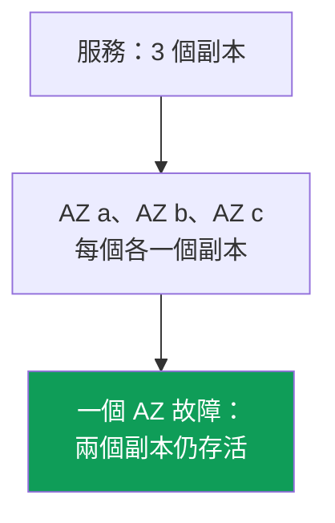
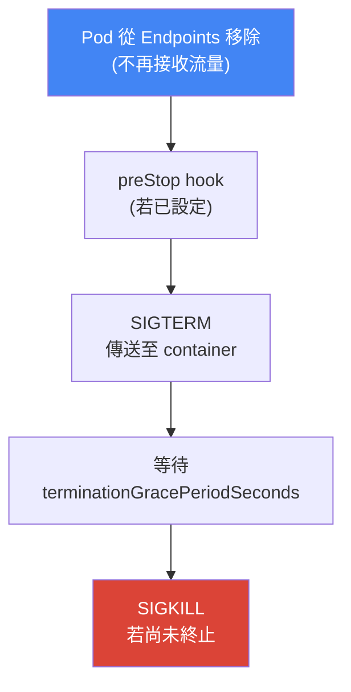
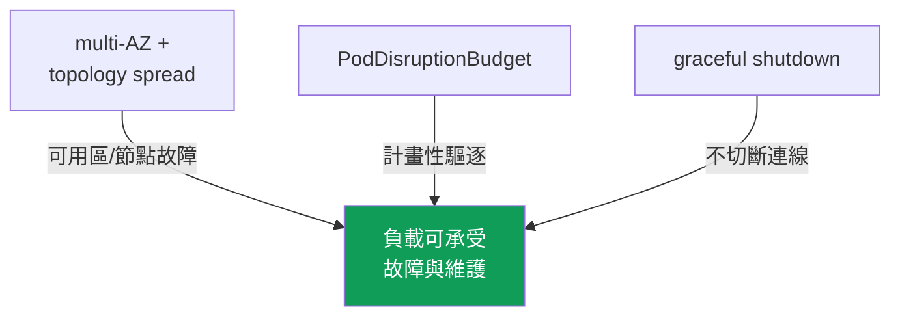

[Русская версия](ru.md) · [Eng version](en.md) · [Versión en español](es.md) · [Version française](fr.md) · [Deutsche Version](de.md) · [ქართული ვერსია](ge.md) · [日本語版](jp.md)
# 第 40 章。可靠性：multi-AZ、PDB、topology spread 與正確關閉節點

> **接下來。** 第 38 與 39 章討論了叢集版本：control plane 與節點升級，以及 7 天視窗內的回滾。那是 control plane 的可靠性。這裡討論負載可靠性：Pod 如何同時承受突發故障（節點或可用區故障）與計畫性維護（drain、升級、consolidation）。相關內容交由其他章節說明：Karpenter 的 disruption 與 consolidation、`do-not-disrupt` 見第 12 章；升級時的節點更新見第 38 章；spot interruption 見第 13 章；cross-AZ 成本與 `trafficDistribution` 見第 31 章；負載擴縮（HPA）見第 35 章。

## 40.1.「所有副本都在同一個可用區」

這是值班時會遇到的情境。Deployment 有三個副本，一切正常，負載也撐得住。一個 Availability Zone 故障後，服務卻完全中斷，儘管有三個副本。查看它們的所在位置：

```bash
kubectl get pods -l app=web -o wide
# NAME          READY   STATUS    NODE                          ...
# web-7d..-a2   1/1     Running   ip-10-0-1-15.ec2.internal     # zone eu-west-1a
# web-7d..-b8   1/1     Running   ip-10-0-1-31.ec2.internal     # zone eu-west-1a
# web-7d..-c1   1/1     Running   ip-10-0-1-44.ec2.internal     # zone eu-west-1a
```

三個副本都在同一個可用區，有時甚至在同一個節點。Kubernetes scheduler 預設沒有義務將 Pod 分散到可用區：它尋找資源可容納該 Pod 的節點，完全可能把所有副本放在一起。只要一切正常，這點不會被注意到。可用區或節點故障會將「三個副本」變成零。

同樣的問題也有計畫性版本。Karpenter consolidation（第 12 章）、節點升級（第 38 章）或 spot interruption（第 13 章）都會讓節點離開叢集。若所有副本都在該節點上，它們會同時被驅逐，造成短暫但完整的中斷。而若該節點是突然關機，沒有完成終止的時間，既有連線也會被中斷：用戶端收到錯誤，而非妥善重試請求。

這是三個不同的問題：放置、計畫性驅逐時的保護，以及妥善終止。但它們透過一組相互關聯的機制解決：multi-AZ、topology spread、PodDisruptionBudget 與正確關閉節點。以下逐一說明，最後再整合起來。

## 40.2. AZ 作為故障網域

Availability Zone 是區域中擁有獨立供電、冷卻與網路的一組資料中心。區域內的可用區在物理上彼此分離，因此一個可用區的故障（供電、網路、自然災害）不應影響其他可用區。對 EKS 工程師來說，可用區是基本的**故障邊界**：當「一個可用區故障」時會整體失效的範圍。

EKS 叢集從一開始就跨多個可用區運作。子網路分布於各 AZ（第 00-3 章），節點在這些子網路中啟動，而 AWS control plane 自身也將元件維持在多個可用區。每個節點都隸屬於自己的可用區，Kubernetes 會為其設定標準標籤 `topology.kubernetes.io/zone`。後續正是依據這個標籤分配 Pod。



因此，AWS 中可靠性的主要原則是：重視可用性的負載至少應分布在兩個、最好三個可用區，這樣 AZ 故障只會帶走部分副本。這同時適用於運算（不同可用區的節點）與資料：EBS 磁碟區具有可用區綁定（第 23 章），而跨可用區的共用儲存則由 EFS 與 FSx 提供（第 24 章）。

multi-AZ 有其成本。可用區間流量雙向計費，而將 Pod「攤開」於不同可用區，代表服務之間增加 cross-AZ 流量（第 31 章）。人們會因省錢而想把一切集中在一個可用區。對重視可用性的負載而言，這是錯誤：跨可用區流量的成本無法與 AZ 故障時的停機成本相比。流量節省方式（`trafficDistribution: PreferClose` 與第 31 章其他內容）應在適用之處採用，而不能以單一故障點為代價。可靠性比節省流量更重要。

## 40.3. 自願與非自願 disruption

Kubernetes 將 Pod 工作的 disruption 分為兩類，且保護方式不同。混淆兩者是錯誤期待的常見來源（「我明明有 PDB，為什麼節點故障時服務還是中斷？」）。

**自願 disruption（voluntary disruptions）**由操作人員或 controller 有意識地啟動：節點維護時的 `kubectl drain`、叢集更新時的節點升級（第 38 章）、Karpenter consolidation 與 drift（第 12 章）、手動刪除 Pod。它們可被規劃、延緩並排序，PodDisruptionBudget 正是為此而設計。

**非自願 disruption（involuntary disruptions）**在未經允許時發生：節點硬體故障或整個 AZ 故障、記憶體不足時的 OOM-kill、node-pressure eviction、附帶兩分鐘通知的 spot interruption（第 13 章）。它們無法「要求稍候」：節點已經消失。PDB 在此無濟於事，因為它不是為此而設計。

| 類別 | 範例 | 保護方式 |
|---|---|---|
| Voluntary | drain、節點升級、Karpenter consolidation、手動刪除 | PDB、graceful shutdown |
| Involuntary | 節點/AZ 故障、OOM、node-pressure eviction、spot interruption | multi-AZ + topology spread、副本 |

要牢記的結論是：**非自願** disruption 靠分配來保護（多個副本位於不同 AZ 與不同節點）；**自願** disruption 靠 disruption budget（PDB）及妥善終止來保護。兩者不能互相取代。

## 40.4. topologySpreadConstraints：分散 Pod

`topologySpreadConstraints` 是 Pod spec 中的欄位，用來告訴 scheduler：「讓這個負載的副本在某個網域中均勻分布。」網域以節點標籤透過 `topologyKey` 指定；實務上有兩個標籤：

- `topology.kubernetes.io/zone`：跨可用區分布（防護 AZ 故障）；
- `kubernetes.io/hostname`：跨節點分布（防護單一節點故障）。

限制條件的關鍵欄位：

| 欄位 | 設定內容 |
|---|---|
| `maxSkew` | 最滿與最空網域之間允許的 Pod 數量差 |
| `topologyKey` | 定義網域的節點標籤（可用區、節點） |
| `whenUnsatisfiable` | 無法滿足條件時的處理方式：`DoNotSchedule` 或 `ScheduleAnyway` |
| `labelSelector` | 據以計算分布的 Pod（通常為應用程式本身的標籤） |
| `minDomains` | 必須分散的最小網域數量（僅搭配 `DoNotSchedule`） |

`maxSkew` 是不均衡程度的度量。`maxSkew: 1` 且有三個可用區時，三個副本各放在一個可用區：最滿與最空可用區的差不超過 1。`whenUnsatisfiable` 定義嚴格程度：`DoNotSchedule` 是嚴格規則，若無法在不違反 `maxSkew` 的情況下分配，Pod 將保持 `Pending`；`ScheduleAnyway` 是寬鬆規則，scheduler 會盡力遵守，但無法滿足時仍會放置 Pod。當新可用區尚未有節點時，`minDomains` 很有用：它要求可用網域數不得少於指定數量，避免僅因其他網域目前為空就將所有 Pod 堆在一個可用區。

典型組合是同時使用兩個限制：節點層級嚴格，AZ 層級寬鬆（或同樣嚴格）。

```yaml
topologySpreadConstraints:
  - maxSkew: 1
    topologyKey: topology.kubernetes.io/zone
    whenUnsatisfiable: DoNotSchedule      # 嚴格分散至各可用區
    labelSelector:
      matchLabels: { app: web }
  - maxSkew: 1
    topologyKey: kubernetes.io/hostname
    whenUnsatisfiable: ScheduleAnyway     # 盡可能跨節點
    labelSelector:
      matchLabels: { app: web }
```

這與同樣能分散 Pod 的 `podAntiAffinity` 有何關係？`podAntiAffinity` 是布林工具：使用 `requiredDuringScheduling` 時是「每個網域最多一個 Pod」，沒有層級。`topologySpreadConstraints` 更精細：可設定允許的不均衡程度（`maxSkew`），不會禁止可用區中的第二個副本，而是平衡分布。若要「盡可能均勻分散在可用區與節點」，使用 topology spread；嚴格的 `podAntiAffinity` 留給「每個節點絕對只能一個」的情境（例如競爭節點資源的負載）。

重要細節：使用 `DoNotSchedule` 時，若所需可用區中的節點不足，過於嚴格的分布會讓 Pod 保持 `Pending`。搭配 Karpenter 時這是正常狀況：無法排程的 Pod 是在缺少的可用區啟動節點的信號（第 12 章）。使用靜態節點集合時，嚴格 spread 可能長期卡住 Pod，此時可改為 `ScheduleAnyway`，或修正各 AZ 的節點平衡。

另一個特殊情況是帶有自己磁碟區的負載。EBS 磁碟區有可用區限制，其 `nodeAffinity` 會永久將 Pod 綁定到建立磁碟區的 AZ（第 23 章）。因此，StatefulSet 跨可用區的分布在建立副本時生效，並非在遷移時：不能為了平衡不均衡而在其他可用區重建 Pod，它將以 `volume node affinity conflict` 事件保持 `Pending`。由此有兩個結論：StorageClass 的 `volumeBindingMode: WaitForFirstConsumer` 是必要的，否則磁碟區會在 Pod 之前建立於任意可用區；對具有磁碟區的負載而言，副本的可用區實際由其磁碟區而非 topology spread 決定。

### RollingUpdate：舊副本會破壞不均衡計算

另一個陷阱只會在 rollout 時顯現。使用 `RollingUpdate` 時，舊與新 ReplicaSet 的 Pod 同時存在於叢集中，而限制條件的 `labelSelector` 通常指向共同應用程式標籤（`app: web`），表示 scheduler 在同一網域中同時計算新舊 Pod。當 `maxSkew: 1` 和 `DoNotSchedule` 時，若某個可用區的舊副本仍存活，新 Pod 就無法進入該可用區而保持 `Pending`：rollout 原地踏步，直到平衡自行恢復。

可透過 `matchLabelKeys` 欄位解決。列出的標籤鍵取自正在建立的 Pod 並加入 `labelSelector`，因此不均衡只在自己的 revision 中計算。對 Deployment 而言，適用的是 `pod-template-hash`，這是 controller 自行設定給每個 ReplicaSet 的標籤。

```yaml
topologySpreadConstraints:
  - maxSkew: 1
    topologyKey: topology.kubernetes.io/zone
    whenUnsatisfiable: DoNotSchedule
    labelSelector:
      matchLabels: { app: web }
    matchLabelKeys:
      - pod-template-hash          # 依自身 revision 的 Pod 計算不均衡
```

此欄位無法運作或運作結果與預期不同的條件包括：`matchLabelKeys` 必須與 `labelSelector` 一起設定；同一鍵不能同時出現在兩個欄位；Pod 沒有的鍵會被靜默忽略，因此名稱拼寫錯誤會讓限制條件變成普通限制。此欄位在 beta 狀態，且自 Kubernetes 1.27 起預設啟用，因此可用於目前的 EKS 版本。不要把直接修改現有 Pod 的標籤用於 `matchLabelKeys`：kube-apiserver 不會將這類修改帶入合併後的 selector。

## 40.5. PodDisruptionBudget：計畫性驅逐時的保護

`PodDisruptionBudget`（PDB）是限制一個負載可因**自願** disruption 同時被驅逐多少 Pod 的物件。它設定下限或上限：

- `minAvailable`：必須保持可用的 Pod 數量（數字或百分比）；
- `maxUnavailable`：可同時停止服務的 Pod 數量。

其機制很簡單：當某項操作呼叫 eviction API（`kubectl drain`、節點升級、Karpenter consolidation 都是如此）時，Kubernetes 會檢查 PDB。若驅逐會違反 budget，eviction 會被阻擋，直到有足夠健康的 Pod 啟動。如此節點 drain 不會一次清除所有副本，而是逐個進行，等待新的副本啟動。

```yaml
apiVersion: policy/v1
kind: PodDisruptionBudget
metadata: { name: web-pdb }
spec:
  minAvailable: 2            # 始終至少保持 2 個可用 Pod
  selector:
    matchLabels: { app: web }
```

必須牢記的關鍵限制：**PDB 僅保護自願 disruption**。節點故障、可用區故障、OOM、spot interruption 不會被 PDB 阻止，因為節點已經消失，無從詢問 budget。防護非自願 disruption 靠的是分布（40.2 與 40.4 節），而不是 PDB。PDB 與 topology spread 解決問題的不同半部，並且共同運作。

PDB 有一個反向且棘手的面向：**過於嚴格的 budget 會阻擋原本只該減速的操作**。常見陷阱：

- `minAvailable` 等於副本數（或 `maxUnavailable: 0`）：無法驅逐任何 Pod，節點 `drain` 永遠卡住，維護與節點升級（第 38 章）停擺。
- 相同的嚴格 PDB 會阻擋 Karpenter consolidation 與 drift（第 12 章）：Karpenter 遵守 PDB，不會超過 budget 驅逐 Pod，因此節點不會被 consolidation 或更新。
- 單一副本負載的 PDB 設為 `minAvailable: 1`：不造成停機便無法 drain 此節點，而 budget 會讓 drain 完全不可能。

健康的 PDB 要保留餘裕：三個副本設定 `minAvailable: 2`（或 `maxUnavailable: 1`）可避免「一次全被移除」，但仍允許維護逐個處理 Pod。對必須承受計畫性維護的負載，至少兩個副本是先決條件：只有一個副本時，PDB 不是無用，就是會徹底阻擋 drain。

### 故障 Pod 卡住 drain：unhealthyPodEvictionPolicy

還有一個比嚴格 budget 更微妙的陷阱，且會在應用程式已出問題時觸發。未回報 `Ready` 的 Pod（因 bug 而 `CrashLoopBackOff` 或 readiness probe 失敗）在 PDB 狀態中不算健康，且不會計入 `status.currentHealthy`。預設套用 `IfHealthyBudget` 政策：僅當應用程式本身未受損，也就是 `currentHealthy` 不小於 `desiredHealthy` 時，才允許驅逐不健康的 Pod。這是善意的設計，避免從已經困難的應用程式取走最後的副本。

但會造成閉環。假設三個副本中有兩個為 `CrashLoopBackOff`：`currentHealthy` 為 1，`minAvailable: 2` 時 `desiredHealthy` 為 2，應用程式已受損，因此 eviction API 連故障 Pod 都會拒絕。`kubectl drain` 無法前進，節點升級（第 38 章）與 Karpenter consolidation（第 12 章）停擺，而 Pod 不會自行恢復健康：壞的是應用程式，不是叢集。只能手動處理：修復負載、直接刪除 Pod，或移除 PDB。

標準解法是 `AlwaysAllow` 政策：不健康 Pod 被視為可驅逐，且無論 budget 為何均可被驅逐，健康 Pod 則仍受保護。

```yaml
spec:
  minAvailable: 2
  unhealthyPodEvictionPolicy: AlwaysAllow   # 不讓故障 Pod 阻擋 drain
  selector:
    matchLabels: { app: web }
```

該欄位自 Kubernetes 1.31 起穩定，無需 feature gate；若未設定，則使用 `IfHealthyBudget`。關於 phase 的說明：`Pending`、`Succeeded` 與 `Failed` 階段的 Pod 一律可被驅逐；該政策決定的是 phase 為 `Running` 但不符合 `Ready` 條件的 Pod，也就是 `CrashLoopBackOff` 與未通過 readiness 的情況。`IfHealthyBudget` 應保留於 Pod 守護某個資源或資料，且過早刪除比維護卡住更危險的情境（quorum 系統、儲存系統）。一般應用程式負載使用 `AlwaysAllow` 較為方便：不會讓故障 deployment 阻擋整個叢集的操作。

## 40.6. 正確關閉節點

分布與 PDB 解決 Pod 放在哪裡，以及可一次驅逐多少個。剩下第三個部分是：讓被驅逐的 Pod **妥善**離開，而不切斷正在處理的請求。這就是 graceful termination lifecycle。

計畫性移除節點會依序進行：先 `cordon`（節點標示為 `SchedulingDisabled`，不會再接收新 Pod），接著 `drain`，即透過遵守 PDB 的 eviction API 驅逐 Pod。對每個 Pod，Kubernetes 執行相同的終止序列：



以下說明欄位。`terminationGracePeriodSeconds`（預設 30）是 Pod 在 SIGTERM 與強制 SIGKILL 之間等待的時間。應用程式應在這段時間內關閉連線並完成請求。`preStop` 是在 SIGTERM **之前**執行的 hook；其中常設一小段暫停，讓 load balancer 與 kube-proxy 有時間在應用程式開始停止前，將 Pod 從路由中移除。

之所以需要暫停，是因為不同步。Pod 離開時會同時（a）從服務的 Endpoints/EndpointSlice 移除，及（b）收到 SIGTERM。但 Endpoints 更新與從 load balancer 移除 Pod 是**非同步**且不即時的：一段時間內，流量仍可能到達已在終止中的 Pod。因此，Pod 必須先變得未就緒並離開 endpoints，之後才停止運作。readiness probe 就是工具：透過使 readiness 失敗（或以 `preStop` 暫停），Pod 在停止回應前會先從 endpoints 移除。

AWS 端還有一層：load balancer。當 ALB 或 NLB 後方的 Pod（第 26 章）被驅逐時，AWS Load Balancer Controller 會將其 target 從 target group deregister。但 load balancer 不會立即切斷連線：會套用由 target group 屬性 `deregistration_delay.timeout_seconds`（預設 300 秒）控制的 **connection draining**。在這段期間，load balancer 不再向 target 傳送新請求，但允許既有請求完成。重點是：Pod 不應在 load balancer deregister target 且清空活躍連線之前終止。若 `terminationGracePeriodSeconds` 小於 deregistration 所需的時間，部分連線將被中斷。因此應讓 grace period 配合 deregistration，而這項工作的另一半是新 Pod 的到來。

### Pod readiness gates：Pod 比 target 更早就緒

`deregistration_delay` 處理 Pod 從 load balancer 離開的情況，但在新 Pod 加入時存在對稱的漏洞。Kubernetes 依其 readiness probe 判定 Pod 已就緒，並據此繼續 rollout，終止下一個舊 Pod。但 AWS target group 中的新 target 仍是 `initial`：load balancer 正在執行自己的 health checks，尚未將流量交給它。若 rollout 很快且副本不多，會出現 target group 中沒有任何 `healthy` target 的視窗，舊 target 已 `draining`，新 target 尚為 `initial`。從外部看，這像是正常 deployment 期間的服務故障，即使叢集裡所有 Pod 都是 `Ready`。

AWS Load Balancer Controller 的 pod readiness gate 可關閉這個視窗。controller 為 Pod 新增前綴為 `target-health.elbv2.k8s.aws` 的額外 readiness condition，並在該 Pod 的 target 尚未在 target group 變成 `healthy` 時讓它保持 false。Pod 不是 `Ready`，Deployment controller 就不會繼續或終止舊 Pod。它不是在 Pod spec 中啟用，而是透過 namespace 標籤：controller 使用 mutating webhook 自行注入 gate 設定。

```bash
# 為 namespace 啟用 gate 注入
kubectl label namespace prod elbv2.k8s.aws/pod-readiness-gate-inject=enabled
# READINESS GATES 欄：0/1 表示 target 尚未 healthy，1/1 表示可接收流量
kubectl get pods -n prod -o wide
```

沒有下列條件時，gate 不會運作或運作在錯誤位置：它僅適用於 `target-type: ip`，因為在 `instance` 模式中 target group 認識的是節點而非 Pod（第 26 章）；namespace 中必須已有 Service 和參照該 Service 的 TargetGroupBinding；gate **僅**在建立 Pod 時注入，因此必須在 Pod 之前建立 namespace 標籤及 Service 或 Ingress 物件，否則既有 Pod 不含 gate。還要分別決定 controller 無法使用時的處理方式：webhook 的 `failurePolicy` 可設定此行為，`Ignore` 讓 Pod 在沒有 gate 時通過（可用性優先），`Fail` 則不允許在已標記的 namespace 建立 Pod（保證優先）。

另一個主題是**突然**關閉節點，也就是沒有執行 `drain` 的情況。根據運算類型，有幾種機制可協助處理（第 9 章）：

| 機制 | 功能 | 適用位置 |
|---|---|---|
| graceful node shutdown (kubelet) | 捕捉系統 shutdown，在 OS 停止前以 grace 關閉 Pod | kubelet 已啟用時 |
| AWS Node Termination Handler (NTH) | 從佇列捕捉 spot ITN、rebalance、ASG lifecycle，執行 cordon 與 drain | self-managed / MNG |
| Karpenter interruption | 透過自己的 SQS 佇列回應 interruption，cordon 並 drain 節點 | Karpenter 節點（第 13 章） |
| EKS Auto Mode | 開箱即用地正確終止節點，無需手動設定 | Auto Mode（第 9 章） |

Graceful node shutdown 是 kubelet 功能：它訂閱 OS 關機事件，在節點停止時有時間以遵守 grace period 的方式驅逐 Pod，而不是讓它們與系統一起死亡。upstream 的 feature gate 已啟用，但 `shutdownGracePeriod` 與 `shutdownGracePeriodCriticalPods` 預設為零，必須在 kubelet 設定中指定非零值，才能明確啟用此功能（第 10 章）。NTH 與 Karpenter 為 EC2 interruption 解決相同問題：它們預先得知節點即將停止（例如 spot interruption 的兩分鐘前），並妥善移走其上的 Pod。Karpenter 經由 interruption queue 自行處理 interruption；NTH 用於非 Karpenter 管理的節點；EKS Auto Mode 則內建此行為。

## 40.7. 整合起來

四種機制涵蓋可靠性的不同部分，且必須一起運作。沒有任何一種可單獨解決全部問題。



這個組合的邏輯：

- **multi-AZ + topology spread** 將副本分散在可用區與節點，AZ 或節點故障只會帶走一部分而不是全部（防護 involuntary）。
- **PodDisruptionBudget** 防止計畫性驅逐一次移除所有副本，drain、升級、consolidation 逐個處理 Pod（防護 voluntary）。
- **graceful shutdown**（grace period、preStop、load balancer 的 connection draining）讓離開的 Pod 不會切斷連線。

拿掉任一元素就會出現缺口。沒有分布時，PDB 可防護 drain，但 AZ 故障會讓一切中斷。沒有 PDB 時，分布可承受故障，但節點升級會同時移除副本。沒有 graceful 時，即使妥善驅逐仍會切斷現有請求。三個副本分布於三個可用區、PDB `minAvailable: 2`、具有 preStop 的合理 grace period，以及配合的 `deregistration_delay`，讓負載可同時承受可用區故障與計畫性維護。

## 40.8. 在 production 中的應用方式

- **將關鍵負載至少分散於兩個可用區。** 將依 `topology.kubernetes.io/zone` 的 `topologySpreadConstraints` 放進 Deployment template，而不是「以後再做」。
- **所有受 PDB 保護的工作負載至少維持兩個副本。** 單一副本時，PDB 不是無用，就是徹底阻擋 drain 與節點升級（第 38 章）。
- **檢查 PDB 是否「不會太嚴格」。** `minAvailable` 等於副本數是 drain 卡住與 Karpenter consolidation 被阻擋的典型原因（第 12 章）。
- **讓 grace period 配合 load balancer deregistration。** `terminationGracePeriodSeconds` 與 `preStop` 暫停應考量 target group 的 `deregistration_delay`，避免中斷連線。
- **允許驅逐不健康 Pod。** `unhealthyPodEvictionPolicy: AlwaysAllow` 防止 `CrashLoopBackOff` 中的 Pod 阻擋節點 drain 與叢集升級（第 38 章）。
- **依自身 revision 計算不均衡。** 在 topology spread 使用含 `pod-template-hash` 的 `matchLabelKeys`，否則過去 ReplicaSet 的 Pod 會讓 rollout 保持 `Pending`。
- **為 ALB 與 NLB 後方的負載啟用 pod readiness gates。** namespace 標籤搭配 `target-type: ip`：rollout 等待 target group 中的 `healthy`，而非僅等待 readiness probe。
- **記住磁碟區的可用區綁定。** 對有 EBS 的 StatefulSet，副本的可用區由其磁碟區而非 topology spread 決定（第 23 章）。
- **不要為了單一可用區而節省流量成本。** cross-AZ 流量（第 31 章）比停機便宜；應在確保分布後再使用 `trafficDistribution`。
- **依賴內建的 interruption 處理。** Karpenter 與 EKS Auto Mode 自行將 Pod 從 interrupted 節點移走；其他節點則使用 NTH（第 13 章）。

## 40.9. 小型詞彙表

- **Availability Zone (AZ)**：區域中隔離的一組資料中心；分散副本時使用的基本故障網域。
- **voluntary disruption**：有意識的 Pod 驅逐：drain、節點升級、consolidation；由 PDB 保護。
- **involuntary disruption**：不受控制的情況：節點/AZ 故障、OOM、spot interruption；由分布而非 PDB 保護。
- **topologySpreadConstraints**：用於讓副本均勻分布到網域的 Pod 欄位（`maxSkew`、`topologyKey`、`whenUnsatisfiable`、`minDomains`）。
- **maxSkew**：最滿與最空網域之間允許的 Pod 數量不均衡。
- **PodDisruptionBudget (PDB)**：限制自願 disruption 時可同時驅逐之 Pod 數量的物件（`minAvailable`/`maxUnavailable`）。
- **`unhealthyPodEvictionPolicy`**：PDB 欄位：`IfHealthyBudget`（預設）在應用程式已受損時不允許驅逐不健康 Pod，`AlwaysAllow` 則始終允許。
- **`matchLabelKeys`**：加入分布限制 `labelSelector` 的 Pod 標籤鍵；使用 `pod-template-hash` 時，不均衡只在單一 Deployment revision 中計算。
- **pod readiness gate**：Pod 的額外 readiness condition；AWS Load Balancer Controller 在 target 變為 `healthy` 前讓 `target-health.elbv2.k8s.aws` 保持 false。
- **terminationGracePeriodSeconds**：Pod 終止時 SIGTERM 與 SIGKILL 之間的時間（預設 30）。
- **preStop**：SIGTERM 前執行的 hook；用於停止前暫停。
- **connection draining**：deregister target 時清空活躍連線；`deregistration_delay.timeout_seconds`（預設 300）。
- **graceful node shutdown**：kubelet 在 OS 關機時以 grace period 關閉 Pod 的功能。

## 40.10. 本章總結

- 預設 scheduler 不會將副本分散至可用區與節點；沒有明確分布時，它們可能全在一個 AZ，而該 AZ 故障會讓服務完全中斷。
- AZ 是 AWS 的基本故障網域；使用 `topology.kubernetes.io/zone` 標籤將關鍵負載至少分散到兩個可用區。可靠性比節省 cross-AZ 流量更重要。
- Disruption 分為自願（drain、升級、consolidation）與非自願（節點/AZ 故障、OOM、spot）；它們由不同工具保護。
- `topologySpreadConstraints`（`maxSkew`、`topologyKey`、`whenUnsatisfiable`、`minDomains`）將副本分散於可用區與節點；它比布林式的 `podAntiAffinity` 更精細。
- PDB（`minAvailable`/`maxUnavailable`）只保護自願 disruption；它無法防護節點或可用區故障，後者需要分布。
- 過於嚴格的 PDB（等於副本數、`maxUnavailable: 0`）會阻擋 drain、節點升級（第 38 章）及 Karpenter consolidation（第 12 章）；應保留餘裕並至少有兩個副本。
- 預設情況下，已受損應用程式中的不健康 Pod 不可被驅逐，因此 `CrashLoopBackOff` 會讓 drain 卡住直到手動介入；`AlwaysAllow` 可解除此問題。
- rollout 有兩個不同陷阱：舊副本會扭曲不均衡計算（以 `matchLabelKeys` 解決），而 Pod 在 target `healthy` 前就成為 `Ready`（以 gates 解決）。
- 正確終止的順序是：cordon、drain、離開 endpoints、preStop、SIGTERM、grace period、SIGKILL；AWS 端則透過 `deregistration_delay` 提供 connection draining。
- 突然關閉節點透過 kubelet 的 graceful node shutdown、NTH、Karpenter 內建 interruption 處理與 EKS Auto Mode 緩和（第 9 與 13 章）。
- 可靠性 = multi-AZ + topology spread（分散）+ PDB（保護計畫性操作）+ graceful（不切斷連線）；這些機制必須共同運作。

## 40.11. 在實際工作中的用處

值班時，本章關乎「一個副本故障」與「服務中斷」之間的差異。當可用區故障或 Karpenter consolidation 一個節點時，正確分散且受保護的負載只失去部分副本並持續運作；未分散的負載則會整體消失。對任何關鍵服務，首先應檢查 `kubectl get pods -o wide`：副本在哪裡、有幾個可用區、跨多少節點。若全部在同一處，這是等待發生的 incident，應以分布修正，而不是在凌晨三點進行分析。

在規劃上，這為每個重視可用性的 Deployment template 增加數個必要項目：兩到三個副本、跨可用區與節點的 `topologySpreadConstraints`、具有餘裕的適當 PDB，以及經過考量的終止方式（grace period、preStop、與 load balancer deregistration 的配合）。還要檢查 PDB 不會過於嚴格：被阻擋的 drain 最常造成叢集升級失敗（第 38 章）並妨礙 Karpenter consolidation 節點（第 12 章）。這些機制共同讓計畫性維護與突發故障都成為例行工作，而非緊急狀況。

## 40.12. 自我檢查問題

1. 為什麼 Deployment 的所有副本預設可能位於同一個 AZ，這有何危險？
2. 為什麼 AZ 被視為 AWS 的基本故障網域，以及透過哪個節點標籤分散 Pod？
3. multi-AZ 可靠性與 cross-AZ 流量成本的關係是什麼，哪個更重要，為什麼？
4. 自願與非自願 disruption 有何不同，各由哪些工具保護？
5. `maxSkew`、`topologyKey`、`whenUnsatisfiable` 與 `minDomains` 欄位設定什麼？
6. `DoNotSchedule` 與 `ScheduleAnyway` 有何差別，何時 Pod 會保持 `Pending`？
7. 為什麼 `topologySpreadConstraints` 比 `podAntiAffinity` 更精細，何時應選擇哪一個？
8. PDB 保護哪些 disruption、不保護哪些 disruption，為什麼？
9. 為什麼過於嚴格的 PDB 危險，它如何破壞 drain、升級與 consolidation？
10. 描述從 cordon 到 SIGKILL 的 Pod 終止順序。
11. 為什麼 Pod 必須在終止前離開 endpoints，`preStop` 與 readiness 如何協助？
12. 什麼是 connection draining，`deregistration_delay` 如何影響 grace period 的選擇？
13. graceful node shutdown、NTH 與 Karpenter interruption 處理如何解決突然關閉節點的問題？
14. 為什麼 `CrashLoopBackOff` 中的 Pod 可永久阻擋 `drain`，`unhealthyPodEvictionPolicy: AlwaysAllow` 改變了什麼，何時會有意識地保留 `IfHealthyBudget`？
15. 為什麼在 `RollingUpdate` 期間，新 Pod 可能因 topology spread 而保持 `Pending`，如何以含 `pod-template-hash` 的 `matchLabelKeys` 解決？
16. controller 的 pod readiness gate 提供什麼作用，為什麼它在 `target-type: instance` 時無用？
17. 為什麼不能透過在其他可用區重建 Pod 來平衡帶有 EBS 磁碟區的 StatefulSet，以及這對 `DoNotSchedule` 有何意義？

## 實作練習

本課程與此主題相關的 lab：[lab 131：可靠性：PDB 阻擋 drain、topology spread、matchLabelKeys](../../labs/131/README_TW.MD)。其中包含透過 `topologySpreadConstraints` 的跨可用區分布、使 `kubectl drain` 因逾時而失敗的過嚴 `PodDisruptionBudget` 症狀及其修正、`unhealthyPodEvictionPolicy: AlwaysAllow`，以及驗證新版 revision 不均衡的 rolling update。結果由 `check_result` 命令驗證。

以下是可在任何自己的叢集上使用一般命令進行的相同操作。首先檢查分布：關鍵服務的副本位於何處，以及跨幾個可用區。

```bash
# 副本位於哪些節點
kubectl get pods -l app=web -o wide
# 節點所在的可用區：將上方的 NODE 與可用區標籤對應
kubectl get nodes -L topology.kubernetes.io/zone
```

接著檢查設定了哪些 PDB，以及它們是否有餘裕（ALLOWED DISRUPTIONS 大於零表示 drain 可通過，零表示會被阻擋）：

```bash
# disruption budget 與允許的驅逐數量
kubectl get pdb -A
# 特定 PDB 詳細資訊：minAvailable、目前/預期 Pod
kubectl describe pdb web-pdb
# 不健康 Pod 的政策：空白代表 IfHealthyBudget
kubectl get pdb -A -o custom-columns=NS:.metadata.namespace,PDB:.metadata.name,POLICY:.spec.unhealthyPodEvictionPolicy
```

透過 dry-run drain 查看計畫性驅逐會是什麼樣子，不實際執行它，並查看節點描述中的狀態與 taint：

```bash
# drain 時會驅逐什麼，不實際驅逐
kubectl drain <node> --ignore-daemonsets --dry-run=client
# 節點狀態、可用區標籤、taint 與事件
kubectl describe node <node>
```

比對三件事：副本是否分散至可用區與節點、PDB 是否為驅逐保留餘裕，以及 Pod 是否設定 `terminationGracePeriodSeconds` 與 `preStop`。同時查看 ALB 與 NLB 後方負載的 `kubectl get pods -o wide` 輸出中的 `READINESS GATES` 欄：空欄代表 namespace 沒有標籤，rollout 不會等待 target group 中的 `healthy`。如果副本位於一個可用區，或 PDB 阻擋所有 drain，這是未來 incident，現在修正會更便宜。Karpenter disruption 見第 12 章，spot interruption 與 NTH 見第 13 章，cross-AZ 成本見第 31 章。

---
[目錄](../README_TW.md) · [第 39 章](../39/tw.md) · [第 41 章](../41/tw.md)
