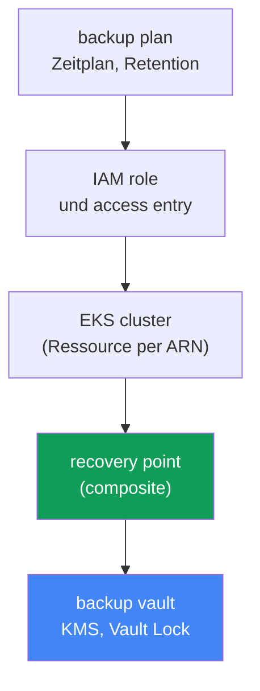
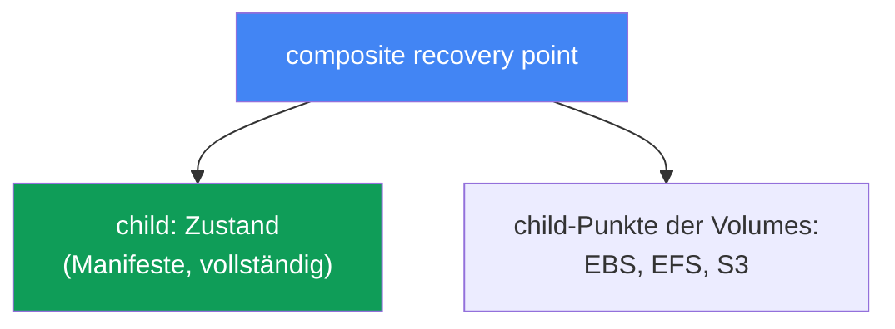
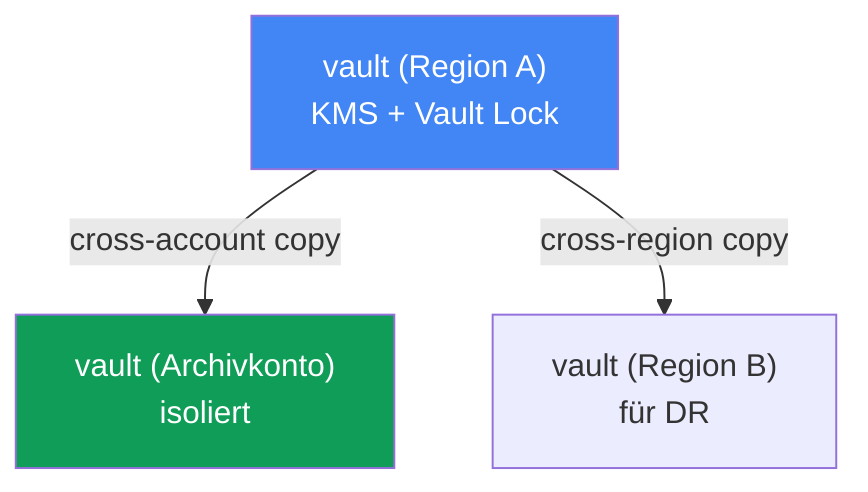

[Eng version](en.md) · [Versión en español](es.md) · [Version française](fr.md) · [Русская версия](ru.md) · [ქართული ვერსია](ge.md) · [繁體中文版](tw.md) · [日本語版](jp.md)
# Kapitel 41. Cluster-Backup mit AWS Backup: Cluster-Zustand, persistente Volumes, Composite Recovery Point

> **Wie es weitergeht.** Die Kapitel 38 bis 40 behandelten den Lebenszyklus des Clusters: Versions-Upgrades, Rollback im 7-Tage-Fenster und die Zuverlässigkeit von Workloads. All das betrifft die Control Plane und Verfügbarkeit, doch nichts davon schützt vor Beschädigung oder Löschung von Daten: Ein Versions-Rollback (Kapitel 39) stellt die Control Plane wieder her, nicht jedoch einen gelöschten Namespace oder ein überschriebenes Volume. Hier geht es um das Backup sowohl des Cluster-Zustands (Kubernetes-Objekte) als auch der Daten persistenter Volumes, konsistent über AWS Backup. Verwandte Themen behandeln andere Kapitel: Wiederherstellung, DR und Velero in Kapitel 42; Versions-Rollback (kein Backup) in Kapitel 39; EBS-Snapshots und StorageClass in Kapitel 23; EFS in Kapitel 24.

## 41.1. „Jemand hat den Namespace prod gelöscht“

Ein Szenario, bei dem es einem kalt den Rücken hinunterläuft. Ein Engineer hat es eilig, verwechselt den kubectl-Kontext und führt im falschen Cluster Folgendes aus:

```bash
kubectl delete namespace prod
# namespace "prod" deleted
```

Mit einem Befehl verschwinden alle Deployments, Services, ConfigMaps, Secrets und, schlimmer noch, PVCs dieses Namespace. Und mit den PVCs werden, wenn die StorageClass `reclaimPolicy: Delete` nutzt, anschließend auch die EBS-Volumes mit den Daten gelöscht (Kapitel 23). Eine Minute später gibt es einen Incident im Chat: prod liegt brach, die Daten sind weg.

Der erste Gedanke des Bereitschaftsdienstes lautet: „Wir rollen zurück.“ Aber es gibt nichts zurückzurollen. Das Versions-Rollback des Clusters (Kapitel 39) arbeitet mit der Control Plane und ihrer Version; es speichert und stellt weder Kubernetes-Objekte noch den Inhalt von Volumes wieder her. Und etcd, in dem diese Objekte leben, wird bei EKS von AWS verwaltet: Direkter Zugriff darauf ist nicht möglich, einen etcd-Dump wie bei einem selbst betriebenen Cluster kann man nicht erstellen. Auch einen Befehl „Stelle den Zustand von gestern wieder her“ gibt es bei einer verwalteten Control Plane nicht.

Es gibt eine noch heimtückischere Variante desselben Problems: keine Löschung, sondern stille Beschädigung. Eine Datenbankmigration läuft fehlerhaft und schreibt Datenmüll in das Volume hinter dem PVC; ein Rollout löscht eine ConfigMap mit der funktionierenden Konfiguration. Der Cluster ist grün, Pods laufen, aber Daten und Zustand sind beschädigt, und es muss zum Zustand „vor dem Release“ zurückgekehrt werden.

Daraus folgt die Erkenntnis dieses Kapitels. Ein Cluster braucht ein echtes Backup: sowohl des **Zustands** (Kubernetes-API-Objekte) als auch der **Daten** persistenter Volumes, **konsistent** zum selben Zeitpunkt erstellt, damit PVC-Manifest und Volume-Inhalt zueinander passen. Andernfalls hilft das Backup kaum: Ein PVC-Manifest ohne Daten ist nutzlos, und ein Volume ohne Manifest kann nirgends angebunden werden. Sehen wir uns an, wie AWS Backup dies umsetzt.

## 41.2. Was bedeutet „Cluster-Backup“ bei EKS: zwei unterschiedliche Dinge

Zuerst muss klar sein: Ein „Cluster-Backup“ ist kein einzelnes Objekt, sondern zwei grundsätzlich unterschiedliche Einheiten, die gemeinsam gesichert werden müssen.

| Komponente | Was es ist | Speicherort | Backup-Methode |
|---|---|---|---|
| Cluster-Zustand | Kubernetes-API-Objekte: Deployment, ConfigMap, Secret, StatefulSet, StorageClass, PVC-Manifeste, RBAC, CRD | etcd (AWS-verwaltet) | Snapshot über die Kubernetes API |
| Volume-Daten | Inhalte von EBS/EFS/S3 hinter PVCs | AWS-Volumes | Snapshots/Backups der Volumes |

Der **Cluster-Zustand** ist der Desired State: Manifeste (YAML oder JSON), welche die Kubernetes-Ressourcen beschreiben. Genau sie verschwinden bei `kubectl delete namespace`. Sie liegen in etcd, und etcd ist Teil der verwalteten Control Plane: AWS gewährt keinen direkten Zugriff darauf. Deshalb wird der Zustand nicht mit einem etcd-Dump gesichert, sondern **über die Kubernetes API**: Objekte werden gelesen und in einem Backup abgelegt.

**Daten persistenter Volumes** sind die Inhalte des EBS-, EFS- oder S3-Speichers, auf den ein Pod über einen PVC zugreift. Das PVC-Manifest beschreibt nur die Anforderung an ein Volume; die Daten selbst liegen im AWS-Volume und werden mit Snapshots (Kapitel 23) oder einem Dateisystem-Backup (Kapitel 24) gesichert.

Die zentrale Erkenntnis: Diese beiden Dinge sind einzeln nutzlos. Manifeste ohne Daten wiederherzustellen bedeutet leere Volumes zu erhalten; Volumes ohne Manifeste wiederherzustellen bedeutet, Datenträger zu haben, die sich nirgends anbinden lassen. Es ist ein Mechanismus nötig, der beides als **eine konsistente Einheit** erfasst. Genau das tut AWS Backup für EKS mit einem Composite Recovery Point (Abschnitt 41.4).

## 41.3. AWS Backup für EKS: Plan, Vault, Wiederherstellungspunkt

AWS Backup ist der zentralisierte Backup-Service von AWS: Er sichert EBS, EFS, RDS, DynamoDB, S3 und weitere Ressourcen nach einheitlichen Regeln. Vor relativ kurzer Zeit kam Amazon EKS zu dieser Liste hinzu: Nun werden Cluster-Zustand und zugehörige Volumes mit demselben Mechanismus aus Plänen und Vaults wie die übrige Infrastruktur gesichert. Die wichtigsten Begriffe:

| Begriff | Was er festlegt |
|---|---|
| backup plan | Backup-Zeitplan, Retention, Übergang in Cold Storage (Lifecycle) |
| backup vault | Speicher für Recovery Points; KMS-Verschlüsselung, Vault Lock für Unveränderlichkeit |
| recovery point | konkreter Wiederherstellungspunkt (ein erstelltes Backup) |
| IAM role | Rolle, unter deren Identität AWS Backup die Ressource liest und das Backup erstellt |

Ein **backup plan** beschreibt, was und wann gesichert werden soll: Zeitplan (beispielsweise einmal täglich), Aufbewahrungsdauer (Retention) und den Zeitpunkt für den Übergang in eine günstige Cold-Storage-Klasse (Lifecycle, `MoveToColdStorageAfterDays`/`DeleteAfterDays`). Dem Plan werden Ressourcen nach Typ oder Tags zugewiesen; für EKS ist die Ressource der Cluster selbst über seinen ARN.

Ein **backup vault** ist der Speicherort für Recovery Points. Der Vault besitzt einen eigenen KMS-Schlüssel zur Verschlüsselung der Backups und eine eigene Zugriffsrichtlinie. Der Schutz der Backups selbst vor Löschung wird auf Vault-Ebene aktiviert (Abschnitt 41.6).

Ein **recovery point** ist das Ergebnis eines erfolgreichen Backup Jobs: ein einzelner Zeitpunkt, zu dem zurückgekehrt werden kann. Bei EKS ist er zusammengesetzt, wie im Folgenden erläutert.

Separat zu betrachten ist die **IAM role**. AWS Backup arbeitet nicht „magisch“, sondern über eine Service-Rolle. Für das Backup von EKS, EBS und EFS genügt die verwaltete Richtlinie `AWSBackupServiceRolePolicyForBackup`; bei S3-Buckets hinter PVCs wird `AWSBackupServiceRolePolicyForS3Backup` ergänzt. Eine wichtige Bedingung speziell für EKS: Der Cluster muss den Autorisierungsmodus `API` oder `API_AND_CONFIG_MAP` verwenden (Access Entries, Kapitel 5). Dann erstellt AWS Backup selbst einen Access Entry und liest die Objekte über die Kubernetes API. Es muss kein Agent oder Add-on im Cluster installiert werden.



## 41.4. Composite Recovery Point

Dies ist der zentrale Begriff des Kapitels. Wenn AWS Backup einen EKS-Cluster sichert, erzeugt es nicht einen einzelnen flachen Punkt, sondern einen **Composite Recovery Point**: einen zusammengesetzten Wiederherstellungspunkt, der mehrere verschachtelte (nested) Punkte als eine konsistente Einheit zusammenfasst:

- **Child Recovery Point des Cluster-Zustands**: ein Snapshot der Kubernetes-Objekte (Manifeste);
- **Child Recovery Points persistenter Volumes**: Backups des EBS-, EFS- und S3-Speichers hinter von AWS Backup unterstützten PVCs.

Genau dies löst das Problem aus Abschnitt 41.1: Zustand und Daten gelangen in ein gemeinsames Backup und werden als Ganzes wiederhergestellt, statt manuell aus verstreuten Snapshots zusammengesetzt zu werden.



Die Statusmechanik: Für den Composite wird ein übergeordneter Backup Job angelegt und für jeden Child Point ein eigener. Der abschließende Status des Composite kann `Completed`, `Partial` oder `Completed with issues` sein. `Partial` bedeutet, dass ein Teil der verschachtelten Jobs nicht erfolgreich beendet wurde oder ein nested Point gelöscht bzw. getrennt wurde; `Completed with issues` bedeutet, dass ein Teil der Kubernetes-Objekte nicht gelesen werden konnte, etwa wenn bei Nichtverfügbarkeit von metrics-server einzelne API-Gruppen für Metriken übersprungen werden. Wiederherstellbar sind die nested Points mit Status `Completed`.

Die Beziehungen innerhalb eines Composite sind nicht symmetrisch. Der Child Point des Cluster-Zustands hat eine 1:1-Beziehung mit dem Parent: Er kann nicht separat kopiert, gelöscht oder getrennt werden. Die Child Points der Volumes lassen sich dagegen jeweils separat kopieren, löschen, trennen und wiederherstellen. Der Composite selbst kann nicht gelöscht werden, solange er verschachtelte Punkte enthält; zunächst müssen die nested Points gelöscht oder getrennt werden.

So wird es aktiviert. Es braucht (1) das Opt-in für Amazon EKS in den AWS-Backup-Einstellungen der Region (`update-region-settings`), (2) einen Backup Plan mit dem Cluster als Ressource, per ARN oder Tag, oder einen On-Demand-Job mit dem Befehl `start-backup-job` und `--resource-arn` des Clusters, sowie (3) den Autorisierungsmodus `API`/`API_AND_CONFIG_MAP` im Cluster. Danach teilt AWS Backup das Backup selbstständig in Composite und verschachtelte Punkte auf.

## 41.5. Was das Backup enthält und was nicht

Eine klare Grenze der Abdeckung ist wichtiger als das Gefühl „Wir haben ein Backup“. Nach der AWS-Backup-Dokumentation umfasst ein EKS-Backup Folgendes bzw. nicht Folgendes:

| Enthalten | Nicht enthalten |
|---|---|
| Cluster-Zustand (Objektmanifeste) | Container-Images aus externen Registries (ECR, Docker) |
| Cluster-Konfiguration: IAM role, VPC, Netzwerk, Logs, Verschlüsselung, Add-ons, Access Entries, Node Groups, Fargate Profiles, Pod Identity | Cluster-Infrastruktur (VPC, Subnetze an sich) |
| EBS-Volumes hinter PVCs (Snapshots) | automatisch erzeugte Objekte: Nodes, System-Pods, Events, Leases, Jobs |
| EFS und S3 hinter PVCs (unterstützte Typen) | FSx über CSI; Volumes mit in-tree/CSI migration/ACK; EFS mit non-root subpath |

Der Cluster-Zustand beinhaltet nicht nur Arbeitsmanifeste (Secret, ConfigMap, StatefulSet, DaemonSet, StorageClass, PVC, CRD, RBAC), sondern auch die Konfiguration des Clusters selbst: Name, IAM role, VPC- und Netzwerkeinstellungen, Logging, Verschlüsselung, Add-ons, Access Entries, Managed Node Groups, Fargate Profiles und Pod Identity Associations. Volume-Daten werden für unterstützte Typen einbezogen: EBS, EFS und S3 über CSI-Treiber der EKS-Add-ons.

Wichtige Einschränkungen müssen vorab geprüft werden, sonst erhalten Sie `Partial`: Volumes über in-tree-Plugins, CSI migration oder ACK-Controller werden nicht unterstützt; FSx über CSI ebenfalls nicht; ebenso wenig EFS mit non-root subpath. Bei S3 wird der gesamte Bucket gesichert, nicht ein einzelnes Präfix, und nur als Snapshot-Backup; ein Cross-Account-Backup von EFS über EKS Backups wird nicht unterstützt. Daten in EFS/FSx oder Drittsystemen, die nicht als unterstützte PVs angebunden sind, werden nicht automatisch abgedeckt und müssen separat gesichert werden.

Zur Konsistenz. Snapshots von Volumes, die „im laufenden Betrieb“ ohne gestoppte Schreibvorgänge erstellt werden, liefern ein **crash-consistent** Ergebnis, als wäre der Strom ausgefallen: Das Dateisystem ist intakt, aber die Anwendung, etwa ein DBMS, kann nicht festgeschriebene Daten verlieren. Ein **application-consistent** Backup setzt voraus, dass die Anwendung ihre Puffer leert und für den Snapshot-Zeitpunkt anhält, üblicherweise durch einen Dump mit den Mitteln des DBMS selbst oder durch Einfrieren des Dateisystems (fs-freeze) vor dem Snapshot und Aufheben der Sperre danach.

Hier gilt eine Einschränkung, die leicht fälschlich als gelöste Aufgabe verstanden wird: **AWS Backup hat keine Hooks innerhalb von Pods**. Der Service erstellt Snapshots der Volumes im bestehenden Zustand und kann keine Befehle vor oder nach dem Snapshot im Container ausführen: Einen VSS-Mechanismus für Konsistenz gibt es nur für EC2 mit Windows; exec-Hooks für Pods gibt es gar nicht. Für StatefulSets mit DBMS gibt es daher drei gangbare Wege: native Datenbank-Dumps neben dem AWS-Backup in S3 speichern; externe Automatisierung aufbauen, wobei Amazon Data Lifecycle Manager pre/post-Skripte über SSM für EBS-Snapshots bietet, aber auf Instanz- statt Pod-Ebene; oder Velero verwenden, das Backup-Hooks standardmäßig unterstützt: Die Annotationen `pre.hook.backup.velero.io/command` und `post.hook.backup.velero.io/command` führen Befehle im Container vor bzw. nach dem Backup aus (Kapitel 42). In der Praxis ist meist die erste Variante üblich: native Dumps für Datenbanken, AWS Backup für Cluster-Zustand und Volumes.

## 41.6. Backup Vault und Schutz der Backups selbst

Ein Backup, das dieselbe Person löschen kann, die auch den Namespace gelöscht hat, vermittelt ein falsches Sicherheitsgefühl. Deshalb müssen auch die Recovery Points selbst geschützt werden. All dies findet auf Ebene des Backup Vault statt.

**KMS-Verschlüsselung.** Die Child Points des Cluster-Zustands werden mit dem KMS-Schlüssel des Vault verschlüsselt, in dem sie abgelegt werden. Die Volume Points werden nach den Regeln ihres Speichertyps verschlüsselt, also EBS-Snapshots, EFS-Backups oder S3. Die Wahl des KMS-Schlüssels gehört zur Konfiguration des Vault.

**Vault Lock.** Dies ist ein WORM-Modus (write-once, read-many) für den Vault: Er schützt Recovery Points vor Löschung, sowohl versehentlicher als auch böswilliger. Es gibt zwei Modi:

| Modus | Wer kann die Sperre entfernen | Wann verwendet |
|---|---|---|
| governance mode | Benutzer mit den erforderlichen IAM-Berechtigungen | Schutz vor versehentlicher Löschung, Flexibilität |
| compliance mode | niemand, auch nicht root oder AWS, nach grace time | strenge Anforderungen an Unveränderlichkeit |

Im **governance mode** können Benutzer mit ausreichenden IAM-Berechtigungen die Sperre entfernen, was vor Fehlern schützt, ohne Flexibilität zu verlieren. Im **compliance mode** wird die Sperre nach der grace time unveränderlich: Kein Benutzer, auch nicht root oder AWS, kann die Backups löschen oder ihren Lifecycle ändern, bevor die Retention abläuft. Das ist mächtig, aber auch gefährlich: Wird die Retention auf „für immer“ gesetzt, können solche Backups anschließend nicht mehr gelöscht werden. Die Retention muss daher bewusst konfiguriert werden.

**Cross-Region- und Cross-Account-Kopien.** Ein Composite kann in eine andere Region und ein anderes Konto kopiert werden; EKS Backups unterstützen alle Kopiertypen mit Ausnahme einzelner Besonderheiten wie Cross-Account-EFS. Das ist die Grundlage für DR: Wenn eine ganze Region oder ein Konto kompromittiert ist, bleibt die Backup-Kopie in einem separaten Archivkonto mit Vault Lock unangetastet. Für eine lange, Compliance-konforme Aufbewahrung wird eine Kopie per Lifecycle in Cold Storage verschoben (`MoveToColdStorageAfterDays`). Das ist günstig, hat aber eine Mindestaufbewahrungsdauer von 90 Tagen. Die Wiederherstellung aus solchen Kopien und das DR-Schema sind Thema von Kapitel 42.



## 41.7. Velero als zweites Werkzeug

AWS Backup ist nicht der einzige Weg, ein Cluster zu sichern. Velero ist ein Kubernetes-natives Werkzeug, das Objekt-Backups in einem S3-Bucket ablegt, Backups nach Namespace oder Label ausführen kann, Volume-Snapshots über CSI erstellt und, anders als AWS Backup, Hooks in Pods vor und nach dem Backup ausführt. Genau damit wird die Konsistenz von DBMS sichergestellt. Velero läuft im Cluster und ist Kubernetes näher, während AWS Backup ein externer AWS-Service mit zentralisierten Plänen, Vaults und Vault Lock ist. Velero und die Auswahl zwischen den Werkzeugen werden in Kapitel 42 ausführlich behandelt; hier genügt es, ihn als zweiten verbreiteten Weg zu kennen.

## 41.8. Wie dies in der Produktion eingesetzt wird

- **Das EKS-Opt-in in AWS Backup wird bewusst aktiviert.** Mit `describe-region-settings` wird geprüft, dass Amazon EKS in der benötigten Region aktiviert ist, andernfalls wird kein Backup Job für den Cluster erstellt.
- **Der Cluster wird im Voraus vorbereitet.** Der Autorisierungsmodus `API` oder `API_AND_CONFIG_MAP` (Kapitel 5) und eine Rolle mit `AWSBackupServiceRolePolicyForBackup` sind Voraussetzungen für das Backup, keine Details.
- **Backups werden in einem separaten Vault mit Vault Lock aufbewahrt.** Der WORM-Modus schützt Wiederherstellungspunkte vor genau der Löschung, gegen die das Backup benötigt wird; governance mode ist ein sinnvoller Standard.
- **Backups werden in ein separates Konto und eine separate Region kopiert.** Eine Cross-Account-Kopie in einem isolierten Archivkonto ist eine Absicherung gegen die Kompromittierung des Hauptkontos (DR, Kapitel 42).
- **Für Datenbanken wird sich nicht ohne zusätzliche Maßnahmen auf AWS Backup verlassen.** Ein Volume-Snapshot ist immer crash-consistent, und der Service besitzt keine Hooks in Pods: Für DBMS werden native Dumps, externe Automatisierung oder Velero mit Backup-Hooks eingerichtet (Kapitel 42).
- **Der Status der Jobs wird überwacht.** `Partial` und `Completed with issues` bedeuten ein unvollständiges Backup; dafür werden Benachrichtigungen eingerichtet, statt die Lücke erst während einer Wiederherstellung zu entdecken.

## 41.9. Mini-Glossar

- **AWS Backup**: zentralisierter Backup-Service von AWS; sichert EKS, EBS, EFS, S3 und andere Ressourcen nach einheitlichen Plänen und Speicherorten.
- **backup plan**: Backup-Plan mit Zeitplan, Retention, Lifecycle (Übergang in Cold Storage) und Ressourcenzuordnung.
- **backup vault**: Speicher für Recovery Points mit KMS-Schlüssel und Zugriffsrichtlinie; darauf wird Vault Lock aktiviert.
- **recovery point**: Wiederherstellungspunkt, Ergebnis eines erfolgreichen Backup Jobs.
- **composite recovery point**: zusammengesetzter Punkt für EKS, der Cluster-Zustand und Volume-Backups als eine Einheit gruppiert.
- **nested (child) recovery point**: verschachtelter Punkt innerhalb eines Composite, entweder Cluster-Zustand oder einzelnes Volume.
- **EKS Cluster State**: Manifeste von Kubernetes-Objekten (Secret, ConfigMap, StatefulSet, PVC, RBAC, CRD usw.) plus Cluster-Konfiguration.
- **Vault Lock**: WORM-Schutz eines Vault gegen die Löschung von Backups; governance mode (per IAM aufhebbar) und compliance mode (nach grace time unveränderlich).
- **crash-consistent / application-consistent**: Snapshot ohne gestoppte Schreibvorgänge gegenüber einem auf Anwendungsebene konsistenten Snapshot. Für EKS bietet AWS Backup nur Ersteren, da es keine Hooks in Pods gibt; Letzterer wird durch Datenbank-Dumps, externe Automatisierung oder Velero-Hooks sichergestellt.

## 41.10. Zusammenfassung des Kapitels

- Ein Versions-Rollback des Clusters (Kapitel 39) stellt keinen gelöschten Namespace, PVC oder Volume-Inhalt wieder her: Es betrifft die Control Plane, nicht Daten oder Objekte. etcd wird bei EKS verwaltet und ist nicht direkt zugänglich.
- Ein „Cluster-Backup“ besteht aus zwei unterschiedlichen Dingen: Zustand (Kubernetes-API-Objekte) und Daten persistenter Volumes. Sie müssen konsistent erfasst werden, denn einzeln sind sie nutzlos.
- Der Zustand wird über die Kubernetes API und nicht per etcd-Dump gesichert; Volume-Daten über Snapshots und Backups von EBS/EFS/S3.
- AWS Backup für EKS arbeitet mit den Begriffen backup plan (Zeitplan, Retention, Lifecycle), backup vault (KMS, Vault Lock) und recovery point; es arbeitet über eine IAM role ohne Agent im Cluster.
- Ein Composite Recovery Point gruppiert den Child Point des Zustands und die Child Points der Volumes als eine konsistente Einheit; Zustand und Daten werden als Ganzes wiederhergestellt.
- Das Backup enthält Zustand und Konfiguration des Clusters sowie unterstützte Volumes (EBS, EFS, S3); nicht enthalten sind Images, VPC-Infrastruktur, automatisch generierte Objekte, FSx und einige Volume-Konfigurationen.
- Volume-Snapshots sind crash-consistent, und AWS Backup hat keine Hooks in Pods: Konsistenz von Datenbanken auf Anwendungsebene liefern native Dumps, externe Automatisierung oder Velero mit Hooks (Kapitel 42).
- Vault Lock (governance/compliance) schützt Backups vor Löschung; Cross-Region- und Cross-Account-Kopien sind Grundlage für DR (Kapitel 42).
- Aktivierung: EKS-Opt-in in der Region, ein Backup Plan oder ein On-Demand-`start-backup-job` über den Cluster-ARN sowie der Autorisierungsmodus `API`/`API_AND_CONFIG_MAP`.

## 41.11. Nutzen in der täglichen Arbeit

Im Bereitschaftsdienst macht dieses Kapitel den Unterschied zwischen „Wir stellen es in einer Stunde wieder her“ und „Die Daten sind für immer verloren“. Wenn jemand einen Namespace gelöscht oder ein Release Daten beschädigt hat, ist ein Versions-Rollback nutzlos: Es wird ein Backup des Zustands und der Volumes zum benötigten Zeitpunkt gebraucht. Das Erste, was im Voraus und nicht erst während des Incidents geprüft werden sollte: Gibt es für den Cluster einen Backup Plan, fällt er unter das EKS-Opt-in der Region, und wann gab es zuletzt einen erfolgreichen Composite Recovery Point mit Status `Completed` statt `Partial`?

Bei der Planung ergänzt dies die Pflichtpunkte für jeden Produktionscluster: aktiviertes EKS-Opt-in, ein Plan mit angemessenem Zeitplan und angemessener Retention, ein separater Vault mit Vault Lock, Cross-Account-Kopien für DR und Verständnis dafür, welche Volumes **NICHT** abgedeckt sind, etwa FSx, non-root subpath und S3 mit Präfixen, und deshalb separat gesichert werden müssen. Für Datenbanken wird zudem die Konsistenz geprüft: Ein Volume-Snapshot allein ist crash-consistent, und das kann für ein DBMS nicht ausreichen. Die Wiederherstellung selbst, also wie Daten aus diesen Punkten in einen bestehenden oder neuen Cluster zurückkehren, behandelt Kapitel 42.

## 41.12. Fragen zur Selbstkontrolle

1. Warum stellt ein Versions-Rollback des Clusters (Kapitel 39) keinen gelöschten Namespace und keine Volume-Daten wieder her?
2. Warum kann bei EKS kein Backup des Zustands per etcd-Dump erstellt werden, und wie wird es stattdessen erstellt?
3. Aus welchen zwei Komponenten besteht ein „Cluster-Backup“, und warum werden sie konsistent erfasst?
4. Was legen backup plan, backup vault und recovery point in AWS Backup fest?
5. Warum benötigt AWS Backup eine IAM role und der Cluster den Autorisierungsmodus `API`/`API_AND_CONFIG_MAP`?
6. Was ist ein Composite Recovery Point, und welche verschachtelten Punkte gruppiert er?
7. Was bedeuten die Composite-Status `Partial` und `Completed with issues`?
8. Was wird in einem EKS-Backup erfasst, und was wird nicht automatisch abgedeckt?
9. Worin unterscheidet sich ein crash-consistent Snapshot von einem application-consistent Snapshot, und warum ist dies für Datenbanken wichtig?
10. Was schützt Vault Lock, und worin unterscheidet sich governance mode von compliance mode?
11. Warum werden Cross-Region- und Cross-Account-Kopien von Backups benötigt, und wie hängt dies mit DR zusammen?
12. Wie wird EKS-Backup aktiviert: Opt-in, Plan oder On-Demand, und welche Anforderungen gelten für den Cluster?
13. Worin unterscheidet sich Velero als Werkzeug für Cluster-Backups von AWS Backup?
14. Warum kann ein application-consistent Backup eines DBMS nicht allein mit AWS Backup erstellt werden, und welche Möglichkeiten gibt es dafür?

## Praxis

Die Kurs-Lab zu diesem Thema: [Lab 122: AWS Backup für EKS](../../labs/122/README_DE.MD). Darin aktivieren Sie das Opt-in, erstellen ein On-Demand-Backup eines Clusters mit einem Volume auf gp3, untersuchen den Composite Recovery Point (Parent sowie verschachtelte EKS- und EBS-Punkte) und führen einen Namespace Restore durch. Die Überprüfung erfolgt mit dem Befehl `check_result`. Start: `TASK=122 make run_eks_task`.

Das Backup eines EBS-Volumes behandelt auch [Lab 129: Mountpoint for S3: Wo die Dateisemantik bricht und warum es kein Backup gibt](../../labs/129/README_DE.MD). Es zeigt, warum ein Volume auf S3 keinen Snapshot hat und was die Daten stattdessen schützt, im Unterschied zum EBS-Volume dieses Kapitels.

Neben dem Lab ist der Backup-Status über die AWS CLI sichtbar. Prüfen Sie zuerst das Opt-in für Amazon EKS in der Region, denn ohne dieses startet das Cluster-Backup nicht:

```bash
# welche Ressourcentypen in der Region für AWS Backup aktiviert sind (nach EKS suchen)
aws backup describe-region-settings --region <region>
```

Sehen Sie nach, welche Pläne und Vaults bereits angelegt wurden:

```bash
# Backup-Pläne: Zeitplan und zugewiesene Ressourcen
aws backup list-backup-plans
# Vaults für Recovery Points
aws backup list-backup-vaults
```

Betrachten Sie einen konkreten Vault und suchen Sie die Composite Recovery Points von EKS und deren Status:

```bash
# Wiederherstellungspunkte im Vault (für EKS: Composite und verschachtelte Punkte)
aws backup list-recovery-points-by-backup-vault --backup-vault-name <vault>
```

Gleichen Sie drei Dinge ab: Ist das EKS-Opt-in aktiviert, gibt es einen Backup Plan mit dem Cluster als Ressource, und wann war der letzte Composite Recovery Point mit Status `Completed` statt `Partial`? Ist das Opt-in deaktiviert oder gibt es keine aktuellen Punkte, hat der Cluster praktisch kein Backup. Das wird vor dem Incident behoben, nicht danach. Die Wiederherstellung aus diesen Punkten, Namespace Restore und Velero behandeln Kapitel 42; EBS-Snapshots und StorageClass Kapitel 23, EFS Kapitel 24.

---
[Inhaltsverzeichnis](../README_DE.md) · [Kapitel 40](../40/de.md) · [Kapitel 42](../42/de.md)
