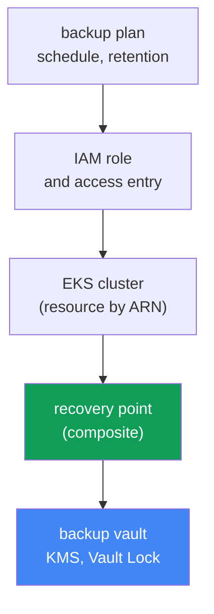
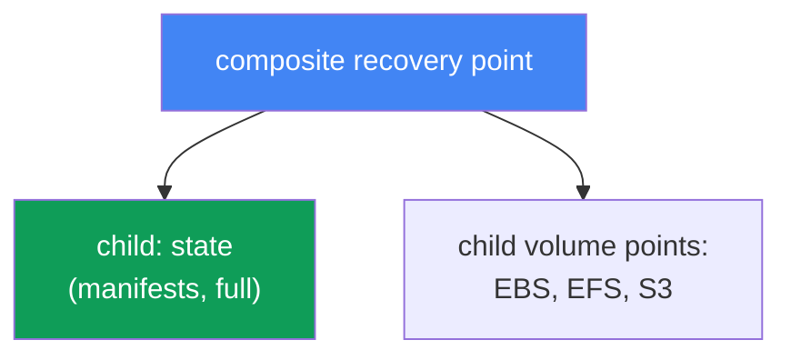
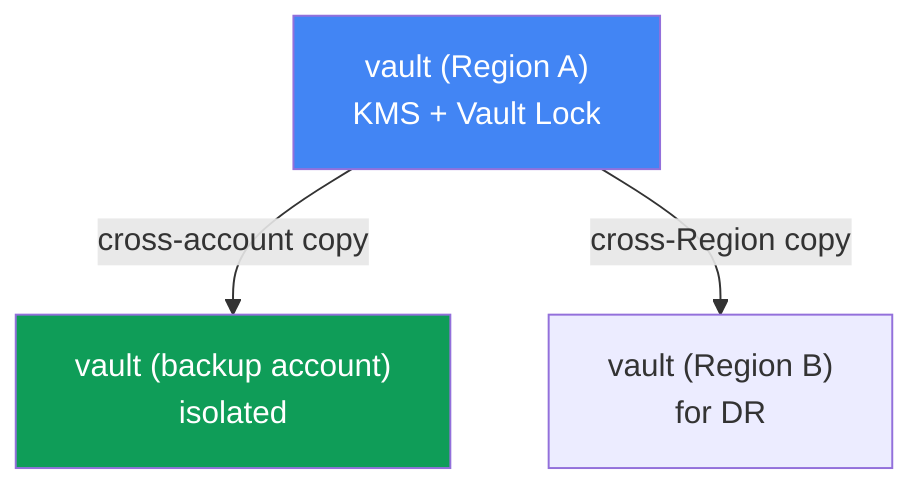

[Versión en español](es.md) · [Русская версия](ru.md) · [Version française](fr.md) · [Deutsche Version](de.md) · [ქართული ვერსია](ge.md) · [繁體中文版](tw.md) · [日本語版](jp.md)
# Chapter 41. Cluster backup with AWS Backup: cluster state, persistent volumes, composite recovery point

> **What comes next.** Chapters 38-40 covered the cluster lifecycle: version upgrades, rollback within the 7-day window, and workload reliability. All of that concerns the control plane and availability, but none of it saves you from data corruption or deletion: a version rollback (Chapter 39) returns the control plane, not a deleted namespace or an overwritten volume. This chapter covers backups of both cluster state (Kubernetes objects) and persistent-volume data, taken consistently through AWS Backup. Related topics belong to other chapters: recovery, DR, and Velero, Chapter 42; version rollback (which is not a backup), Chapter 39; EBS snapshots and StorageClass, Chapter 23; EFS, Chapter 24.

## 41.1. "Someone deleted the prod namespace"

The scenario that makes your blood run cold. An engineer, in a hurry, mixed up their `kubectl`
context and ran this in the wrong cluster:

```bash
kubectl delete namespace prod
# namespace "prod" deleted
```

One command removes every Deployment, Service, ConfigMap, Secret, and, worse, every PVC in that
namespace. Together with the PVCs, if the StorageClass uses `reclaimPolicy: Delete`, the EBS volumes
containing the data are deleted too (Chapter 23). A minute later, the incident chat says that prod is
down and the data is gone.

The first thought of the on-call engineer is "we will roll back." But there is nothing to roll back.
A cluster version rollback (Chapter 39) operates on the control plane and its version; it neither
stores nor returns Kubernetes objects, much less volume contents. And etcd, where those objects live,
is managed by AWS in EKS: there is no direct access to it, so you cannot take an etcd dump as you
would from a self-managed cluster. A managed control plane also has no "return everything to how it
was yesterday" command.

There is an even more insidious version of the same pain: quiet corruption rather than deletion. A
bad database migration writes garbage to the volume behind a PVC; a deployment removes a ConfigMap
with a working configuration. The cluster is green, pods are running, but the data and state are
corrupted and must return to their state "before the release."

This leads to the chapter's conclusion. A cluster needs a real backup of both **state** (Kubernetes
API objects) and persistent-volume **data**, taken **consistently** so that the PVC manifest and the
volume contents belong to the same point in time. Otherwise, the backup is of little use: a PVC
manifest without data is useless, and a volume without its manifest has nowhere to attach. Let us see
how AWS Backup does this.

## 41.2. What "cluster backup" means in EKS: two different things

The first distinction to make is that a "cluster backup" is not one object. It consists of two
fundamentally different things that must be captured together.

| Component | What it is | Where it is stored | How it is backed up |
|---|---|---|---|
| Cluster state | Kubernetes API objects: Deployment, ConfigMap, Secret, StatefulSet, StorageClass, PVC manifests, RBAC, CRD | etcd (managed by AWS) | snapshot through the Kubernetes API |
| Volume data | contents of EBS/EFS/S3 behind PVCs | AWS volumes | volume snapshots/backups |

**Cluster state** is the desired state: manifests (YAML or JSON) that describe Kubernetes resources.
These are exactly what disappear after `kubectl delete namespace`. They live in etcd, and etcd is
part of the managed control plane, so AWS does not provide direct access to it. State is therefore
backed up not by an etcd dump but **through the Kubernetes API**: objects are read and placed in a
backup.

**Persistent-volume data** is the content of EBS, EFS, or S3 storage accessed by a pod through a
PVC. A PVC manifest only describes a request for a volume; the actual data is in the AWS volume and
is backed up by snapshots (Chapter 23) or a filesystem backup (Chapter 24).

The key idea is that these two things are useless separately. Restoring manifests without data gives
you empty volumes; restoring volumes without manifests gives you disks with nowhere to attach them.
You need a mechanism that captures both as **one consistent unit**. That is what AWS Backup does for
EKS through a composite recovery point (Section 41.4).

## 41.3. AWS Backup for EKS: plan, vault, recovery point

AWS Backup is AWS's centralized backup service. It backs up EBS, EFS, RDS, DynamoDB, S3, and other
resources under unified rules. Amazon EKS was added to that list relatively recently: cluster state
and associated volumes can now be backed up using the same plans and vaults as the rest of the
infrastructure. The key concepts are:

| Concept | What it defines |
|---|---|
| backup plan | backup schedule, retention, transition to cold storage (lifecycle) |
| backup vault | recovery-point storage; KMS encryption and Vault Lock for immutability |
| recovery point | a particular recovery point (one completed backup) |
| IAM role | the role AWS Backup uses to read a resource and create a backup |

A **backup plan** describes what to back up and when: the schedule (for example, once a day), how
long to retain it, and when to move it to a less expensive cold-storage class (lifecycle,
`MoveToColdStorageAfterDays`/`DeleteAfterDays`). Resources are associated with a plan by type or
tag; for EKS, the resource is the cluster itself, identified by its ARN.

A **backup vault** is the storage location for recovery points. A vault has its own KMS key for
backup encryption and its own access policy. Protection of the backups themselves from deletion is
configured at the vault level (Section 41.6).

A **recovery point** is the result of a successful backup job: one point you can return to. For EKS,
it is composite, as discussed next.

One more important item is the **IAM role**. AWS Backup does not operate "magically"; it acts through
a service role. The managed policy `AWSBackupServiceRolePolicyForBackup` is sufficient to back up
EKS, EBS, and EFS; add `AWSBackupServiceRolePolicyForS3Backup` for S3 buckets behind PVCs. A
condition specific to EKS is that the cluster must have authorization mode `API` or
`API_AND_CONFIG_MAP` enabled (access entries, Chapter 5). AWS Backup can then create an access entry
for itself and read objects through the Kubernetes API. No agent or add-on needs to be installed in
the cluster.



## 41.4. Composite recovery point

Here is the chapter's central concept. When AWS Backup backs up an EKS cluster, it does not create
one flat point. It creates a **composite recovery point**, a composite recovery point that groups
several nested recovery points as one consistent unit:

- a **child recovery point for cluster state**, a snapshot of Kubernetes objects (manifests);
- **child recovery points for persistent volumes**, backups of EBS, EFS, and S3 storage behind PVCs
  that AWS Backup supports.

This is what solves the problem in Section 41.1: state and data enter one backup and are restored as
a whole rather than manually assembled from unrelated snapshots.



Status mechanics are as follows. A parent backup job is created for the composite, and each child
gets its own job. The final composite status can be `Completed`, `Partial`, or `Completed with issues`.
`Partial` means that some nested jobs did not complete successfully or a nested point was deleted or
disassociated. `Completed with issues` means that some Kubernetes objects could not be read, for
example when certain metrics API groups are skipped because `metrics-server` is unavailable. You can
restore the nested points whose status is `Completed`.

Relationships within a composite are asymmetric. The cluster-state child has a 1:1 relationship with
its parent: it cannot be copied, deleted, or disassociated on its own. Volume child points, in
contrast, can be copied, deleted, disassociated, and restored independently. The composite itself
cannot be deleted while it has nested points; first delete or disassociate the nested points.

How to enable it: you need (1) opt-in for Amazon EKS in the AWS Backup regional settings
(`update-region-settings`), (2) a backup plan with the cluster resource, identified by ARN or tag,
or an on-demand job using `start-backup-job` with the cluster `--resource-arn`, and (3) cluster
authorization mode `API`/`API_AND_CONFIG_MAP`. AWS Backup then automatically breaks the backup into
a composite and nested points.

## 41.5. What the backup includes and excludes

A clear coverage boundary is more important than the feeling that "we have backups." According to
AWS Backup documentation, an EKS backup includes and excludes the following:

| Included | Excluded |
|---|---|
| cluster state (object manifests) | container images from external registries (ECR, Docker) |
| cluster configuration: IAM role, VPC, network, logs, encryption, add-ons, access entries, node groups, Fargate profiles, pod identity | cluster infrastructure (the VPC and subnets themselves) |
| EBS volumes behind PVCs (snapshots) | autogenerated objects: nodes, system pods, events, leases, jobs |
| EFS and S3 behind PVCs (supported types) | FSx through CSI; in-tree/CSI migration/ACK volumes; EFS with a non-root subpath |

Cluster state includes not just workload manifests (Secret, ConfigMap, StatefulSet, DaemonSet,
StorageClass, PVC, CRD, RBAC), but the configuration of the cluster itself: its name, IAM role, VPC
and network settings, logging, encryption, add-ons, access entries, managed node groups, Fargate
profiles, and pod identity associations. Volume data is included for supported types: EBS, EFS, and
S3 through EKS add-on CSI drivers.

Important limitations must be checked in advance, otherwise you get `Partial`: volumes through
in-tree plugins, CSI migration, or ACK controllers are not supported; FSx through CSI is not
supported either; neither is EFS with a non-root subpath. For S3, the whole bucket rather than an
individual prefix is backed up, and only snapshot backups are supported. Cross-account EFS backup
through EKS Backups is not supported. Data in EFS/FSx or third-party systems that is not attached as
a supported PV is not automatically covered and must be backed up separately.

About consistency: volume snapshots taken while writes continue produce a **crash-consistent** result,
as if the power were pulled. The filesystem is intact, but an application such as a DBMS may lose
uncommitted data. An **application-consistent** backup requires the application to flush its buffers
and pause at snapshot time. Usually that means a dump produced by the DBMS itself or freezing the
filesystem (`fs-freeze`) before the snapshot and unfreezing it afterwards.

Here is a limitation that is easy to mistake for a solved problem: **AWS Backup has no hooks inside
pods**. The service snapshots volumes as they are and cannot run a command in a container before or
after a snapshot. Its VSS consistency mechanism exists only for Windows EC2, and it has no pod exec
hooks at all. That leaves three workable approaches for a database StatefulSet: keep native database
dumps in S3 alongside the AWS Backup backup; build external automation (Amazon Data Lifecycle Manager
has pre/post scripts through SSM for EBS snapshots, but that is at the instance level, not the pod
level); or use Velero, which has built-in backup hooks. The annotations
`pre.hook.backup.velero.io/command` and `post.hook.backup.velero.io/command` run a command in a
container before and after backup capture (Chapter 42). In practice, the first approach is most
common: native dumps for database data, AWS Backup for cluster state and volumes.

## 41.6. backup vault and protecting backups themselves

A backup that can be deleted by the same person who deleted the namespace creates a false sense of
security. Protecting the recovery points themselves is therefore a separate task. It all happens at
the backup-vault level.

**KMS encryption.** Cluster-state child points are encrypted with the KMS key of the vault where
they are stored. Volume points are encrypted under the rules of their storage type (EBS snapshots,
EFS backups, S3). Selecting the KMS key is part of vault configuration.

**Vault Lock.** This is WORM (write-once, read-many) mode for a vault. It protects recovery points
from both accidental and malicious deletion. There are two modes:

| Mode | Who can remove the lock | When it is used |
|---|---|---|
| governance mode | users with the required IAM permissions | protection from accidental deletion, flexibility |
| compliance mode | no one, including root and AWS, after the grace time | strict immutability requirements |

In **governance mode**, users with sufficient IAM permissions can remove the lock, protecting against
mistakes without losing flexibility. In **compliance mode**, the lock becomes immutable after the
grace time: no user, including root or AWS, can delete backups or alter their lifecycle until
retention expires. It is powerful but risky: if retention is set to "forever," those backups can no
longer be deleted. Configure retention deliberately.

**Cross-Region and cross-account copies.** A composite can be copied to another Region and account
(EKS Backups supports every copy type except particular nuances such as cross-account EFS). This is
the basis of DR: if an entire Region or account is compromised, a backup copy in a separate backup
account with Vault Lock remains untouched. For long compliance retention, lifecycle moves a copy to
cold storage (`MoveToColdStorageAfterDays`), which is inexpensive but has a minimum retention of 90
days. Restoring those copies and the DR design are covered in Chapter 42.



## 41.7. Velero as a second tool

AWS Backup is not the only way to back up a cluster. Velero is a Kubernetes-native tool that stores
object backups in an S3 bucket, can back up by namespace or label, takes volume snapshots through
CSI, and, unlike AWS Backup, runs hooks in pods before and after backup capture. That is how it
addresses database consistency. It runs inside the cluster and is closer to Kubernetes, whereas AWS
Backup is an external AWS service with centralized plans, vaults, and Vault Lock. Velero and the
choice between these tools are covered in detail in Chapter 42; for now, it is enough to know that it
is another common approach.

## 41.8. How this is used in production

- **Enable EKS opt-in in AWS Backup deliberately.** Check `describe-region-settings` to ensure
  Amazon EKS is enabled in the required Region, otherwise a backup job for the cluster will not be
  created.
- **Prepare the cluster in advance.** Authorization mode `API` or `API_AND_CONFIG_MAP` (Chapter 5)
  and a role with `AWSBackupServiceRolePolicyForBackup` are backup prerequisites, not details.
- **Keep backups in a separate vault with Vault Lock.** WORM mode protects recovery points from the
  same deletion that made the backup necessary; governance mode is a sensible default.
- **Copy backups to a separate account and Region.** A cross-account copy in an isolated backup
  account protects against compromise of the primary account (DR, Chapter 42).
- **Do not rely on AWS Backup alone for databases.** A volume snapshot is always crash-consistent,
  and the service has no hooks inside pods. Configure native dumps, external automation, or Velero
  backup hooks for DBMSs (Chapter 42).
- **Monitor job status.** `Partial` and `Completed with issues` mean an incomplete backup. Subscribe
  to notifications rather than discovering the gap during recovery.

## 41.9. Mini glossary

- **AWS Backup**: AWS's centralized backup service; it backs up EKS, EBS, EFS, S3, and other
  resources through unified plans and vaults.
- **backup plan**: a backup plan containing the schedule, retention, lifecycle (cold-storage
  transition), and resource associations.
- **backup vault**: recovery-point storage with a KMS key and access policy; Vault Lock is enabled
  on it.
- **recovery point**: a recovery point, the result of a successful backup job.
- **composite recovery point**: a composite EKS point that groups cluster state and volume backups
  as one unit.
- **nested (child) recovery point**: a nested point in a composite: cluster state or an individual
  volume.
- **EKS Cluster State**: Kubernetes object manifests (Secret, ConfigMap, StatefulSet, PVC, RBAC,
  CRD, and so on) plus cluster configuration.
- **Vault Lock**: WORM protection of a vault against backup deletion; governance mode (removable
  through IAM) and compliance mode (immutable after the grace time).
- **crash-consistent / application-consistent**: a snapshot without stopping writes versus a
  snapshot coordinated at the application level. AWS Backup for EKS provides only the first because
  it has no pod hooks; provide the second with database dumps, external automation, or Velero hooks.

## 41.10. Chapter summary

- A cluster version rollback (Chapter 39) does not return a deleted namespace, PVC, or volume
  contents: it is about the control plane, not data and objects. etcd in EKS is managed and directly
  inaccessible.
- A "cluster backup" consists of two distinct things: state (Kubernetes API objects) and
  persistent-volume data. They must be captured consistently because they are useless separately.
- State is backed up through the Kubernetes API, not an etcd dump; volume data is backed up through
  EBS/EFS/S3 snapshots and backups.
- AWS Backup for EKS uses backup plans (schedule, retention, lifecycle), backup vaults (KMS, Vault
  Lock), and recovery points. It acts through an IAM role with no cluster agent.
- A composite recovery point groups the child state point and child volume points as one consistent
  unit; state and data are restored as a whole.
- The backup includes cluster state and configuration and supported volumes (EBS, EFS, S3). It does
  not include images, VPC infrastructure, autogenerated objects, FSx, or certain volume setups.
- Volume snapshots are crash-consistent, and AWS Backup has no pod hooks. Application-level database
  consistency comes from native dumps, external automation, or Velero hooks (Chapter 42).
- Vault Lock (governance/compliance) protects backups from deletion; cross-Region and cross-account
  copies are the basis of DR (Chapter 42).
- To enable it, opt in to EKS in the Region, configure a backup plan or on-demand
  `start-backup-job` for the cluster ARN, and use authorization mode `API`/`API_AND_CONFIG_MAP`.

## 41.11. How this helps in real work

During on-call duty, this chapter is the difference between "we will recover in an hour" and "the
data is gone forever." When someone deletes a namespace or a release corrupts data, rolling back the
version is useless: you need a backup of state and volumes at the needed time. The first things to
check in advance, rather than during the incident, are whether the cluster has a backup plan, whether
it falls under EKS opt-in in its Region, and when the latest successful composite recovery point had
status `Completed` rather than `Partial`.

In planning, this adds mandatory items to every production-cluster design: EKS opt-in enabled, a plan
with an appropriate schedule and retention, a separate vault with Vault Lock, cross-account copies
for DR, and an understanding of which volumes are NOT covered (FSx, non-root subpaths, S3 prefixes)
and need separate backups. Database consistency is checked separately: a volume snapshot alone is
crash-consistent, which may not be enough for a DBMS. Recovery itself, returning data from these
points to an existing or new cluster, is covered in Chapter 42.

## 41.12. Self-check questions

1. Why does a cluster version rollback (Chapter 39) not return a deleted namespace or volume data?
2. Why can you not back up state in EKS with an etcd dump, and how is it captured instead?
3. Which two components make up a "cluster backup," and why must they be captured consistently?
4. What do a backup plan, backup vault, and recovery point define in AWS Backup?
5. Why does AWS Backup need an IAM role and cluster authorization mode `API`/`API_AND_CONFIG_MAP`?
6. What is a composite recovery point, and which nested points does it group?
7. What do composite statuses `Partial` and `Completed with issues` mean?
8. What is included in an EKS backup, and what is not covered automatically?
9. How does a crash-consistent snapshot differ from an application-consistent one, and why does that
   matter for databases?
10. What does Vault Lock protect, and how does governance mode differ from compliance mode?
11. Why are cross-Region and cross-account backup copies needed, and how do they relate to DR?
12. How do you enable EKS backup: opt-in, plan or on-demand job, and cluster requirements?
13. How does Velero differ from AWS Backup as a cluster-backup tool?
14. Why can you not get an application-consistent DBMS backup with AWS Backup alone, and what are the
    options for providing it?

## Practice

The course lab for this topic is [Lab 122: AWS Backup for EKS](../../labs/122/README.MD). In it, you
enable opt-in, take an on-demand backup of a cluster with a gp3 volume, examine the composite
recovery point (parent and nested EKS and EBS points), and perform a namespace restore. Verify it
with the `check_result` command. Start it with `TASK=122 make run_eks_task`.

EBS volume backup is also covered in [Lab 129: Mountpoint for S3: where filesystem semantics break
and why there is no backup](../../labs/129/README.MD). It shows why an S3 volume has no snapshot and
what protects its data instead, unlike the EBS volume in this chapter.

In addition to the lab, AWS CLI shows backup state. First check Amazon EKS opt-in in the Region. The
cluster backup will not start without it:

```bash
# resource types enabled for AWS Backup in the Region (look for EKS)
aws backup describe-region-settings --region <region>
```

See which plans and vaults already exist:

```bash
# backup plans: schedule and associated resources
aws backup list-backup-plans
# recovery-point vaults
aws backup list-backup-vaults
```

Look in a specific vault for EKS composite recovery points and their statuses:

```bash
# recovery points in the vault (for EKS: composite and nested)
aws backup list-recovery-points-by-backup-vault --backup-vault-name <vault>
```

Compare three things: whether EKS opt-in is enabled, whether a backup plan includes the cluster
resource, and when the latest composite recovery point had status `Completed` rather than `Partial`.
If opt-in is off or no recent points exist, the cluster effectively has no backup. Fix that before an
incident, not afterwards. Recovery from these points, namespace restore, and Velero are covered in
Chapter 42; EBS snapshots and StorageClass in Chapter 23; EFS in Chapter 24.

---
[Table of Contents](../README.md) · [Chapter 40](../40/en.md) · [Chapter 42](../42/en.md)
