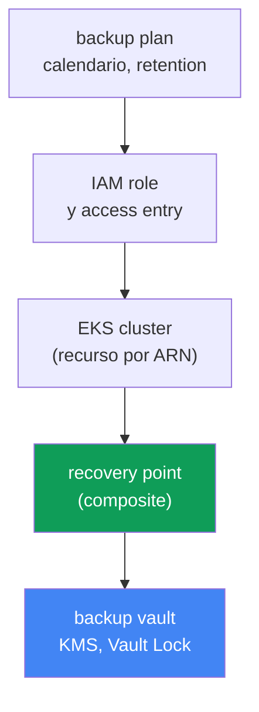
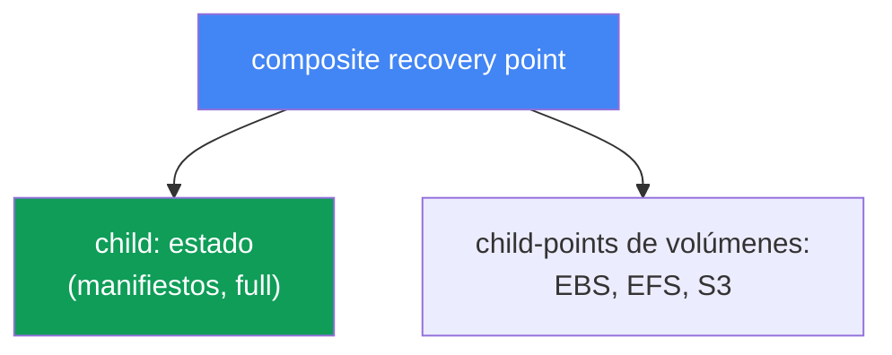
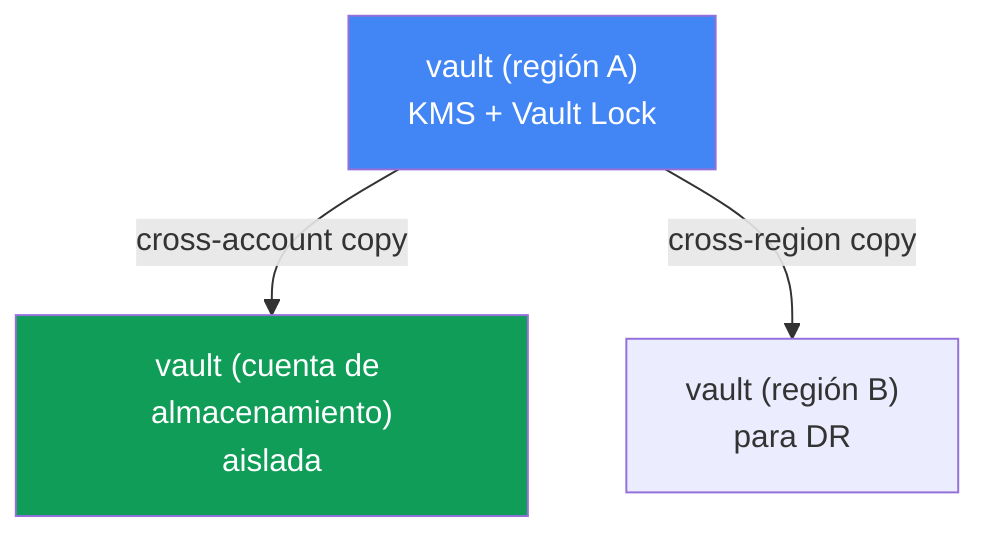

[Русская версия](ru.md) · [Eng version](en.md) · [Version française](fr.md) · [Deutsche Version](de.md) · [ქართული ვერსია](ge.md) · [繁體中文版](tw.md) · [日本語版](jp.md)
# Capítulo 41. Copia de seguridad del clúster con AWS Backup: estado del clúster, volúmenes persistentes y composite recovery point

> **Qué sigue.** Los capítulos 38-40 cubrieron el ciclo de vida del clúster: actualizaciones de versión, reversión dentro de una ventana de 7 días y fiabilidad de las cargas. Todo ello se refiere al control plane y a la disponibilidad, pero nada de eso protege frente a la corrupción o eliminación de datos: una reversión de versión (capítulo 39) devuelve el control plane, no un namespace eliminado ni un volumen sobrescrito. Aquí se trata tanto la copia de seguridad del estado del clúster (objetos Kubernetes) como de los datos de los volúmenes persistentes, de forma coherente, mediante AWS Backup. Los temas relacionados se delegan a otros capítulos: restauración, DR y Velero, capítulo 42; reversión de versión (no es una copia de seguridad), capítulo 39; snapshots de EBS y StorageClass, capítulo 23; EFS, capítulo 24.

## 41.1. «Alguien eliminó el namespace prod»

Un escenario que hiela la sangre. Un ingeniero, con prisas, confundió el contexto de kubectl y ejecutó el comando en el clúster equivocado:

```bash
kubectl delete namespace prod
# namespace "prod" deleted
```

Con un solo comando desaparecieron todos los Deployment, Service, ConfigMap, Secret y, peor aún, PVC de ese namespace. Junto con los PVC, si la StorageClass tiene `reclaimPolicy: Delete`, los volúmenes EBS con los datos se eliminan después (capítulo 23). Un minuto más tarde llega el incidente al chat: prod está caído y los datos no están.

El primer pensamiento de quien está de guardia es: «revertimos». Pero no hay nada que revertir. La reversión de la versión del clúster (capítulo 39) funciona con el control plane y su versión, no almacena ni devuelve objetos Kubernetes ni, mucho menos, el contenido de los volúmenes. Además, etcd, donde viven esos objetos, está gestionado por AWS en EKS: no hay acceso directo, y no se puede tomar un volcado de etcd como en un clúster autogestionado. Tampoco existe en el control plane gestionado un comando de «vuelve a como estaba ayer».

Hay una variante aún más insidiosa del mismo problema: no una eliminación, sino una corrupción silenciosa. Una migración de base de datos salió mal y escribió basura en el volumen detrás de un PVC; un despliegue eliminó un ConfigMap con una configuración válida. El clúster está en verde, los pods se ejecutan, pero los datos y el estado están corruptos y se necesita volver al estado «anterior al release».

De aquí se desprende la conclusión del capítulo. Un clúster necesita una copia de seguridad real, tanto del **estado** (objetos de la API de Kubernetes) como de los **datos** de los volúmenes persistentes, tomados de forma **coherente**, de modo que el manifiesto PVC y el contenido del volumen correspondan al mismo instante. De otro modo, la copia sirve de poco: un manifiesto PVC sin datos es inútil y un volumen sin manifiesto no tiene dónde conectarse. Veamos cómo lo hace AWS Backup.

## 41.2. Qué es una «copia de seguridad del clúster» en EKS: dos cosas distintas

Lo primero que hay que distinguir: una «copia de seguridad del clúster» no es un solo objeto, sino dos entidades fundamentalmente distintas que deben capturarse juntas.

| Componente | Qué es | Dónde se almacena | Cómo se respalda |
|---|---|---|---|
| Estado del clúster | objetos de la API de Kubernetes: Deployment, ConfigMap, Secret, StatefulSet, StorageClass, manifiestos PVC, RBAC, CRD | etcd (gestionado por AWS) | snapshot mediante la API de Kubernetes |
| Datos de volúmenes | contenido de EBS/EFS/S3 detrás de PVC | volúmenes de AWS | snapshots/copias de seguridad de volúmenes |

El **estado del clúster** es el desired state: manifiestos (YAML o JSON) que describen recursos Kubernetes. Son precisamente los que desaparecen al ejecutar `kubectl delete namespace`. Viven en etcd, y etcd es parte del control plane gestionado: AWS no proporciona acceso directo. Por eso el estado no se respalda con un volcado de etcd, sino **a través de la API de Kubernetes**: se leen los objetos y se almacenan en una copia de seguridad.

Los **datos de volúmenes persistentes** son el contenido del almacenamiento EBS, EFS o S3 al que accede un pod mediante PVC. El manifiesto PVC describe solo la solicitud de un volumen; los datos propiamente dichos se encuentran en el volumen AWS y se respaldan con snapshots (capítulo 23) o con una copia de seguridad del sistema de archivos (capítulo 24).

La idea clave: estas dos cosas son inútiles por separado. Restaurar manifiestos sin datos da volúmenes vacíos; restaurar volúmenes sin manifiestos deja discos que no se pueden conectar en ningún lugar. Hace falta un mecanismo que capture ambos como **una única unidad coherente**. Eso es lo que AWS Backup hace para EKS mediante un composite recovery point (sección 41.4).

## 41.3. AWS Backup para EKS: plan, almacén y punto de recuperación

AWS Backup es el servicio centralizado de copias de seguridad de AWS: respalda EBS, EFS, RDS, DynamoDB, S3 y otros recursos con reglas unificadas. Hace relativamente poco se añadió Amazon EKS a esta lista: ahora el estado del clúster y los volúmenes relacionados se respaldan mediante el mismo mecanismo de planes y almacenes que el resto de la infraestructura. Conceptos clave:

| Concepto | Qué define |
|---|---|
| backup plan | calendario de copias, retention, transición a cold storage (lifecycle) |
| backup vault | almacén de recovery points; cifrado KMS, Vault Lock para immutability |
| recovery point | punto concreto de recuperación (una copia tomada) |
| IAM role | rol bajo el cual AWS Backup lee el recurso y crea la copia |

Un **backup plan** describe qué respaldar y cuándo: el calendario (por ejemplo, una vez al día), cuánto tiempo conservarlo (retention) y cuándo moverlo a una clase de almacenamiento en frío más barata (lifecycle, `MoveToColdStorageAfterDays`/`DeleteAfterDays`). Al plan se asocian recursos por tipo o etiquetas; para EKS, el recurso es el propio clúster por su ARN.

Un **backup vault** es el almacén donde se guardan los recovery points. El vault tiene su propia clave KMS, con la que se cifran las copias, y su propia política de acceso. La protección de las copias contra su eliminación se activa precisamente en el nivel del vault (sección 41.6).

Un **recovery point** es el resultado de un backup job satisfactorio: un punto al que se puede volver. Para EKS es compuesto, como veremos a continuación.

Por separado, el **IAM role**. AWS Backup no funciona «mágicamente», sino con un rol de servicio. Para respaldar EKS, EBS y EFS basta la política gestionada `AWSBackupServiceRolePolicyForBackup`; para buckets S3 detrás de PVC se añade `AWSBackupServiceRolePolicyForS3Backup`. Una condición importante específicamente para EKS: el clúster debe tener habilitado el modo de autorización `API` o `API_AND_CONFIG_MAP` (access entries, capítulo 5). Entonces AWS Backup crea por sí mismo una access entry y lee los objetos a través de la API de Kubernetes. No es necesario instalar ningún agente ni addon en el clúster.



## 41.4. Composite recovery point

Este es el concepto central del capítulo. Cuando AWS Backup respalda un clúster EKS, no crea un único punto plano, sino un **composite recovery point**: un punto de recuperación compuesto que agrupa varios puntos anidados (nested) como una sola unidad coherente:

- **child recovery point del estado del clúster**: snapshot de objetos Kubernetes (manifiestos);
- **child recovery points de volúmenes persistentes**: copias de seguridad de almacenamiento EBS, EFS y S3 detrás de PVC, compatibles con AWS Backup.

Esto resuelve precisamente el problema de la sección 41.1: el estado y los datos entran en una misma copia y se restauran como un conjunto, en lugar de ensamblarse manualmente desde snapshots dispersos.



Mecánica de estados. Se crea un backup job padre para el composite y uno propio para cada child. El estado final del composite puede ser `Completed`, `Partial` o `Completed with issues`. `Partial` significa que parte de los job anidados no terminó correctamente o que se eliminó o desvinculó un punto nested; `Completed with issues` significa que no se pudieron leer algunos objetos Kubernetes (por ejemplo, si metrics-server no está disponible, se omiten grupos de API de métricas concretos). Se pueden restaurar los puntos nested cuyo estado sea `Completed`.

Las relaciones dentro de un composite no son simétricas. El child del estado del clúster mantiene una relación 1:1 con el padre: no se puede copiar, eliminar ni desvincular por separado. En cambio, los child-points de volúmenes se pueden copiar, eliminar, desvincular y restaurar individualmente. El propio composite no se puede eliminar mientras contenga puntos anidados; primero hay que eliminar o desvincular los nested.

Cómo activarlo. Se necesita (1) opt-in para Amazon EKS en la configuración regional de AWS Backup (`update-region-settings`), (2) un backup plan con el recurso clúster (por ARN o etiqueta) o un job on-demand mediante el comando `start-backup-job` con el `--resource-arn` del clúster y (3) el clúster en modo de autorización `API`/`API_AND_CONFIG_MAP`. Después de ello, AWS Backup descompone por sí mismo la copia en un composite y puntos anidados.

## 41.5. Qué entra en la copia y qué no

Un límite de cobertura claro es más importante que la sensación de «tenemos copia de seguridad». Según la documentación de AWS Backup, una copia EKS incluye y no incluye lo siguiente:

| Incluye | No incluye |
|---|---|
| estado del clúster (manifiestos de objetos) | imágenes de contenedor de registros externos (ECR, Docker) |
| configuración del clúster: IAM role, VPC, red, logs, cifrado, addons, access entries, node groups, Fargate profiles, pod identity | infraestructura del clúster (VPC, subredes en sí mismas) |
| volúmenes EBS detrás de PVC (snapshots) | objetos autogenerados: nodos, pods de servicio, events, leases, jobs |
| EFS y S3 detrás de PVC (tipos compatibles) | FSx mediante CSI; volúmenes in-tree/CSI migration/ACK; EFS con non-root subpath |

El estado del clúster incluye no solo manifiestos de trabajo (Secret, ConfigMap, StatefulSet, DaemonSet, StorageClass, PVC, CRD, RBAC), sino también la configuración del propio clúster: nombre, IAM role, configuración de VPC y red, logging, cifrado, addons, access entries, managed node groups, Fargate profiles y pod identity associations. Los datos de volumen están incluidos para los tipos compatibles: EBS, EFS y S3 mediante los controladores CSI de addons EKS.

Limitaciones importantes que se verifican por adelantado (de lo contrario se obtendrá `Partial`): no se admiten los volúmenes mediante plugins in-tree, CSI migration o controladores ACK; tampoco FSx mediante CSI; tampoco EFS con non-root subpath; para S3 se respalda el bucket completo, no un prefijo individual, y solo como copia snapshot; la copia cross-account de EFS mediante EKS Backups no es compatible. Los datos en EFS/FSx o en sistemas de terceros que no estén conectados como PV compatibles no quedan cubiertos automáticamente y se respaldan por separado.

Sobre la coherencia. Los snapshots de volúmenes tomados «en caliente» sin detener las escrituras producen un resultado **crash-consistent**, como si se hubiera desconectado la alimentación: el sistema de archivos permanece íntegro, pero la aplicación (por ejemplo, un SGBD) puede perder datos no confirmados. Una copia **application-consistent** requiere que la aplicación vacíe sus búferes y se congele en el instante del snapshot; normalmente es un dump con las herramientas del propio SGBD o congelar el sistema de archivos (fs-freeze) antes del snapshot y descongelarlo después.

Y aquí hay una limitación fácil de confundir con un problema resuelto: **AWS Backup no tiene hooks dentro de los pods**. El servicio toma los volúmenes tal como están y no puede ejecutar un comando en un contenedor antes o después del snapshot: solo dispone del mecanismo de coherencia VSS para EC2 con Windows, y no hay exec-hooks en pods en absoluto. De ahí tres caminos funcionales para StatefulSet con SGBD: mantener dumps nativos de la base en S3 junto con la copia AWS Backup; construir automatización externa (Amazon Data Lifecycle Manager tiene scripts pre/post mediante SSM para snapshots EBS, pero es a nivel de instancia, no de pod); o utilizar Velero, que tiene hooks de copia integrados: las anotaciones `pre.hook.backup.velero.io/command` y `post.hook.backup.velero.io/command` ejecutan un comando en el contenedor antes y después de tomar la copia (capítulo 42). En la práctica, lo más frecuente es la primera opción: dumps nativos para los datos de la base de datos, AWS Backup para el estado del clúster y los volúmenes.

## 41.6. Backup vault y protección de las propias copias

Una copia que puede eliminar la misma persona que eliminó el namespace es una falsa sensación de seguridad. Por ello, una tarea independiente es proteger los propios recovery points. Todo esto se gestiona a nivel de backup vault.

**Cifrado KMS.** Los child-points del estado del clúster se cifran con la clave KMS del vault donde se almacenan. Los puntos de volumen se cifran conforme a las reglas de su tipo de almacenamiento (snapshots EBS, copias EFS, S3). Elegir la clave KMS forma parte de la configuración del vault.

**Vault Lock.** Es un modo WORM (write-once, read-many) para el vault: protege los recovery points frente a la eliminación, tanto accidental como maliciosa. Hay dos modos:

| Modo | Quién puede quitar el bloqueo | Cuándo se usa |
|---|---|---|
| governance mode | usuarios con los permisos IAM necesarios | protección frente a eliminaciones accidentales, flexibilidad |
| compliance mode | nadie, ni siquiera root ni AWS, tras el grace time | requisitos estrictos de inmutabilidad |

En **governance mode**, los usuarios con permisos IAM suficientes pueden quitar el bloqueo: se protege frente a errores sin perder flexibilidad. En **compliance mode**, tras el grace time el bloqueo pasa a ser inmutable: ningún usuario, incluidos root y AWS, puede eliminar las copias ni modificar su lifecycle hasta que termine el retention. Es potente, pero también peligroso: si se configura un retention «para siempre», ya no será posible eliminar esas copias, por lo que el retention se debe configurar conscientemente.

**Copias cross-region y cross-account.** El composite se puede copiar a otra región y otra cuenta (EKS Backups admite todos los tipos de copia, salvo matices concretos como cross-account EFS). Esta es la base de DR: si toda la región o cuenta resulta comprometida, la copia de seguridad en una cuenta de almacenamiento separada con Vault Lock permanece intacta. Para una retención prolongada bajo compliance, la copia se mueve a cold storage por lifecycle (`MoveToColdStorageAfterDays`), barato pero con un período mínimo de conservación de 90 días. La restauración desde esas copias y el diseño de DR son el tema del capítulo 42.



## 41.7. Velero como segunda herramienta

AWS Backup no es la única manera de respaldar un clúster. Velero es una herramienta nativa de Kubernetes que guarda las copias de objetos en un bucket S3, puede respaldar por namespace o label, toma snapshots de volúmenes mediante CSI y, a diferencia de AWS Backup, ejecuta hooks en los pods antes y después de tomar la copia, que es justo lo que resuelve la coherencia de un SGBD. Vive dentro del clúster y está más cerca de Kubernetes, mientras que AWS Backup es un servicio AWS externo con planes centralizados, vault y Vault Lock. Velero y la elección entre herramientas se tratan en detalle en el capítulo 42; aquí basta saber que es el segundo enfoque habitual.

## 41.8. Cómo se aplica en producción

- **Activan opt-in EKS en AWS Backup conscientemente.** Comprueban con `describe-region-settings` que Amazon EKS esté activado en la región necesaria; de lo contrario, no se creará el backup job del clúster.
- **Preparan el clúster de antemano.** El modo de autorización `API` o `API_AND_CONFIG_MAP` (capítulo 5) y el rol con `AWSBackupServiceRolePolicyForBackup` son prerrequisitos de la copia, no detalles.
- **Mantienen las copias en un vault separado con Vault Lock.** El modo WORM protege los puntos de recuperación frente a la misma eliminación para la que se necesita la copia; governance mode es un valor predeterminado sensato.
- **Copian las copias a otra cuenta y región.** Una copia cross-account en una cuenta de almacenamiento aislada es un seguro ante el compromiso de la principal (DR, capítulo 42).
- **No se apoyan en AWS Backup para bases de datos sin automatización adicional.** El snapshot de volumen siempre es crash-consistent y el servicio no tiene hooks dentro de los pods: para un SGBD se configuran dumps nativos, automatización externa o Velero con hooks de copia (capítulo 42).
- **Vigilan el estado de los job.** `Partial` y `Completed with issues` indican una copia incompleta; se configuran notificaciones para ellos, en lugar de descubrir la brecha durante una restauración.

## 41.9. Mini glosario

- **AWS Backup**: servicio centralizado de copias de seguridad de AWS; respalda EKS, EBS, EFS, S3 y otros recursos con planes y almacenes unificados.
- **backup plan**: plan de copias: calendario, retention, lifecycle (transición a cold storage) y asociación de recursos.
- **backup vault**: almacén de recovery points con clave KMS y política de acceso; en él se activa Vault Lock.
- **recovery point**: punto de recuperación, resultado de un backup job satisfactorio.
- **composite recovery point**: punto compuesto para EKS que agrupa el estado del clúster y las copias de volúmenes como una unidad.
- **nested (child) recovery point**: punto anidado dentro de un composite: estado del clúster o un volumen individual.
- **EKS Cluster State**: manifiestos de objetos Kubernetes (Secret, ConfigMap, StatefulSet, PVC, RBAC, CRD, etc.) más la configuración del clúster.
- **Vault Lock**: protección WORM del vault frente a la eliminación de copias; governance mode (se quita mediante IAM) y compliance mode (inmutable tras grace time).
- **crash-consistent / application-consistent**: snapshot sin detener las escrituras frente a snapshot con coherencia en el nivel de aplicación. Para EKS, AWS Backup solo ofrece el primero: no hay hooks en pods; el segundo se obtiene con dumps de base de datos, automatización externa o hooks de Velero.

## 41.10. Conclusiones del capítulo

- La reversión de versión del clúster (capítulo 39) no devuelve un namespace eliminado, PVC ni contenido de volúmenes: trata del control plane, no de los datos ni los objetos. etcd en EKS está gestionado y no es accesible directamente.
- Una «copia de seguridad del clúster» son dos cosas distintas: estado (objetos de la API de Kubernetes) y datos de volúmenes persistentes; deben tomarse de forma coherente, porque por separado son inútiles.
- El estado se respalda a través de la API de Kubernetes, no mediante un volcado de etcd; los datos de volumen, mediante snapshots y copias de EBS/EFS/S3.
- AWS Backup para EKS utiliza los conceptos de backup plan (calendario, retention, lifecycle), backup vault (KMS, Vault Lock) y recovery point; funciona con un IAM role, sin agente en el clúster.
- Un composite recovery point agrupa el child-point de estado y los child-points de volumen como una unidad coherente; el estado y los datos se restauran como un todo.
- La copia incluye el estado y la configuración del clúster y los volúmenes compatibles (EBS, EFS, S3); no incluye imágenes, infraestructura VPC, objetos autogenerados, FSx ni varias configuraciones de volumen.
- Los snapshots de volumen son crash-consistent y AWS Backup no tiene hooks dentro de los pods: la coherencia de una base de datos en el nivel de aplicación se logra con dumps nativos, automatización externa o Velero con hooks (capítulo 42).
- Vault Lock (governance/compliance) protege las copias contra la eliminación; las copias cross-region y cross-account son la base de DR (capítulo 42).
- Activación: opt-in EKS en la región, backup plan o `start-backup-job` on-demand para el ARN del clúster, y modo de autorización `API`/`API_AND_CONFIG_MAP`.

## 41.11. Cómo sirve en el trabajo real

Durante una guardia, este capítulo es la diferencia entre «restauraremos en una hora» y «los datos se han perdido para siempre». Cuando alguien elimina un namespace o un release corrompe los datos, revertir la versión no sirve: se necesita una copia del estado y los volúmenes en el momento adecuado. Lo primero que conviene comprobar de antemano (no durante el incidente) es si el clúster tiene un backup plan, si queda incluido en el opt-in EKS de la región y cuándo fue el último composite recovery point satisfactorio con estado `Completed`, no `Partial`.

Durante la planificación, esto añade puntos obligatorios al diseño de cualquier clúster de producción: opt-in EKS activado, un plan con calendario y retention adecuados, un vault separado con Vault Lock, copias cross-account para DR y comprensión de qué volúmenes NO están cubiertos (FSx, non-root subpath, S3 con prefijos) y deben respaldarse por separado. También se comprueba la coherencia de las bases de datos: un snapshot de volumen por sí solo es crash-consistent, y puede no ser suficiente para un SGBD. La propia restauración, es decir, cómo devolver datos de estos puntos a un clúster existente o nuevo, se explica en el capítulo 42.

## 41.12. Preguntas de autoevaluación

1. ¿Por qué una reversión de versión del clúster (capítulo 39) no devuelve un namespace eliminado ni los datos de volumen?
2. ¿Por qué no se puede tomar una copia del estado mediante un volcado de etcd en EKS y cómo se toma en su lugar?
3. ¿De qué dos componentes se compone una «copia de seguridad del clúster» y por qué se capturan de forma coherente?
4. ¿Qué definen backup plan, backup vault y recovery point en AWS Backup?
5. ¿Por qué AWS Backup necesita un IAM role y que el clúster tenga el modo de autorización `API`/`API_AND_CONFIG_MAP`?
6. ¿Qué es un composite recovery point y qué puntos anidados agrupa?
7. ¿Qué significan los estados `Partial` y `Completed with issues` de un composite?
8. ¿Qué entra en la copia EKS y qué no queda cubierto automáticamente?
9. ¿En qué se diferencia un snapshot crash-consistent de uno application-consistent y por qué importa para una base de datos?
10. ¿Qué protege Vault Lock y en qué se diferencia governance mode de compliance mode?
11. ¿Por qué se necesitan copias cross-region y cross-account y cómo se relaciona esto con DR?
12. ¿Cómo se activa la copia EKS: opt-in, plan u on-demand, y cuáles son los requisitos del clúster?
13. ¿En qué se diferencia Velero de AWS Backup como herramienta de copia del clúster?
14. ¿Por qué no se puede obtener una copia application-consistent de un SGBD solo con AWS Backup y qué opciones hay para solucionarlo?

## Práctica

La práctica del curso para este tema: [laboratorio 122 - AWS Backup para EKS](../../labs/122/README_ES.MD). En ella activa opt-in, toma una copia on-demand del clúster con un volumen gp3, analiza el composite recovery point (parent y puntos anidados EKS y EBS) y realiza un namespace-restore; la verificación se hace con el comando `check_result`. Ejecución: `TASK=122 make run_eks_task`.

La copia de un volumen EBS también se analiza en el [laboratorio 129 - Mountpoint for S3: dónde se rompe la semántica de archivos y por qué no hay copia de seguridad](../../labs/129/README_ES.MD). Allí se muestra por qué un volumen en S3 no tiene snapshot y qué protege los datos en su lugar, a diferencia del volumen EBS de este capítulo.

Además del laboratorio, el estado de las copias se puede consultar desde AWS CLI. Primero compruebe el opt-in para Amazon EKS en la región: sin él, la copia del clúster no se iniciará:

```bash
# qué tipos de recursos están habilitados para AWS Backup en la región (busque EKS)
aws backup describe-region-settings --region <region>
```

Vea qué planes y almacenes ya existen:

```bash
# planes de copia: calendario y recursos asociados
aws backup list-backup-plans
# almacenes de recovery points
aws backup list-backup-vaults
```

Examine un vault concreto y encuentre los composite recovery points de EKS y sus estados:

```bash
# puntos de recuperación en el almacén (para EKS: composite y anidados)
aws backup list-recovery-points-by-backup-vault --backup-vault-name <vault>
```

Relacione tres cosas: si el opt-in EKS está activado, si existe un backup plan con el recurso clúster y cuándo fue el último composite recovery point con estado `Completed` (no `Partial`). Si el opt-in está desactivado o no hay puntos recientes, el clúster no tiene realmente una copia de seguridad; esto se corrige antes del incidente, no después. La restauración desde estos puntos, namespace-restore y Velero se tratan en el capítulo 42; los snapshots EBS y StorageClass, en el capítulo 23; EFS, en el capítulo 24.

---
[Índice](../README_ES.md) · [Capítulo 40](../40/es.md) · [Capítulo 42](../42/es.md)
