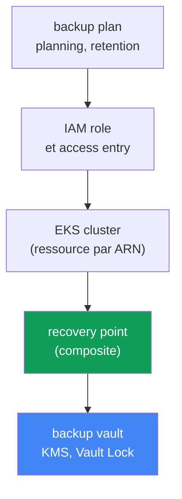
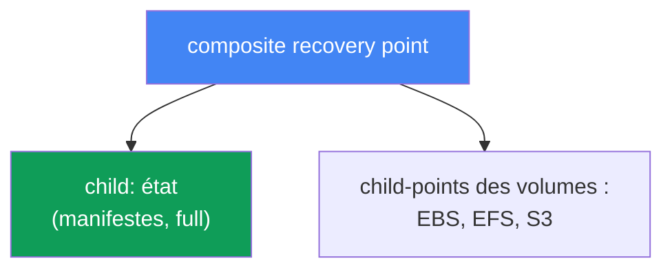
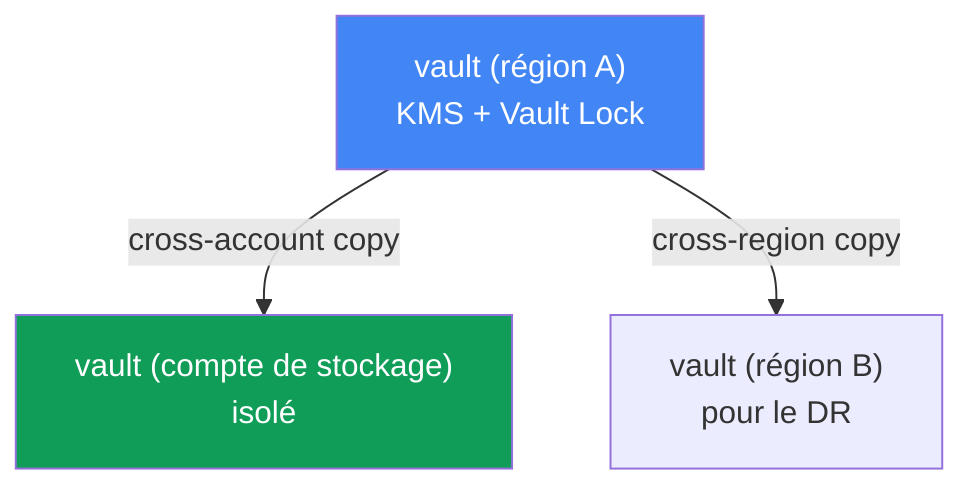

[Eng version](en.md) · [Versión en español](es.md) · [Русская версия](ru.md) · [Deutsche Version](de.md) · [ქართული ვერსია](ge.md) · [繁體中文版](tw.md) · [日本語版](jp.md)
# Chapitre 41. Sauvegarde du cluster avec AWS Backup : état du cluster, volumes persistants, composite recovery point

> **La suite.** Les chapitres 38 à 40 ont couvert le cycle de vie du cluster : mise à niveau des versions, rollback dans une fenêtre de 7 jours et fiabilité des charges. Tout cela concerne le control plane et la disponibilité, mais rien de tout cela ne protège contre la corruption ou la suppression des données : un rollback de version (chapitre 39) restaure le control plane, pas un namespace supprimé ni un volume écrasé. Ce chapitre traite de la sauvegarde de l'état du cluster (objets Kubernetes) et des données des volumes persistants, de manière cohérente, via AWS Backup. Les sujets associés sont traités dans d'autres chapitres : restauration, DR et Velero, chapitre 42 ; rollback de version (ce n'est pas une sauvegarde), chapitre 39 ; snapshots EBS et StorageClass, chapitre 23 ; EFS, chapitre 24.

## 41.1. « Quelqu'un a supprimé le namespace prod »

Le scénario qui glace le sang. Un ingénieur pressé a confondu le contexte kubectl et exécuté
la commande dans le mauvais cluster :

```bash
kubectl delete namespace prod
# namespace "prod" deleted
```

En une commande, tous les Deployment, Service, ConfigMap, Secret et, pire encore, PVC de ce
namespace disparaissent. Avec les PVC, si la StorageClass porte `reclaimPolicy: Delete`, les
volumes EBS contenant les données sont aussi supprimés (chapitre 23). Une minute plus tard, un
incident est signalé sur le chat : prod est à l'arrêt, les données ont disparu.

La première pensée de la personne d'astreinte est : « revenons en arrière ». Mais il n'y a rien
à restaurer ainsi. Le rollback de version du cluster (chapitre 39) agit sur le control plane et
sa version, il ne conserve ni ne restaure les objets Kubernetes, encore moins le contenu des
volumes. Et etcd, où vivent ces objets, est géré par AWS dans EKS : aucun accès direct n'y est
disponible, il est impossible de faire un dump etcd comme sur un cluster autonome. Il n'existe
pas non plus de commande « remets l'état d'hier » sur un managed control plane.

Il existe une variante encore plus insidieuse de la même douleur : non pas une suppression, mais
une corruption silencieuse. Une migration de base de données s'est mal déroulée et a écrit des
données invalides dans le volume derrière un PVC ; un déploiement a supprimé un ConfigMap avec
une configuration fonctionnelle. Le cluster est au vert, les pods s'exécutent, mais les données
et l'état sont corrompus, et il faut revenir à l'état « avant la release ».

D'où la conclusion du chapitre. Un cluster a besoin d'une véritable sauvegarde, à la fois de
**l'état** (objets de l'API Kubernetes) et des **données** des volumes persistants, prises de
manière **cohérente**, afin que le manifeste PVC et le contenu du volume correspondent au même
instant. Sinon, une sauvegarde est peu utile : un manifeste PVC sans données ne sert à rien, et
un volume sans manifeste n'a nulle part où être attaché. Voyons comment AWS Backup le réalise.

## 41.2. Qu'est-ce qu'une « sauvegarde de cluster » dans EKS : deux choses distinctes

La première distinction à faire est que la « sauvegarde de cluster » n'est pas un seul objet,
mais deux entités fondamentalement différentes, à prendre ensemble.

| Composant | Ce que c'est | Où il est stocké | Mode de sauvegarde |
|---|---|---|---|
| État du cluster | objets de l'API Kubernetes : Deployment, ConfigMap, Secret, StatefulSet, StorageClass, manifestes PVC, RBAC, CRD | etcd (géré par AWS) | snapshot via l'API Kubernetes |
| Données des volumes | contenu EBS/EFS/S3 derrière les PVC | volumes AWS | snapshots/sauvegardes des volumes |

**L'état du cluster** est le desired state : les manifestes (YAML ou JSON) décrivant les
ressources Kubernetes. Ce sont précisément eux qui disparaissent avec `kubectl delete namespace`.
Ils vivent dans etcd, qui fait partie du managed control plane : AWS ne donne pas d'accès direct
à celui-ci. L'état n'est donc pas sauvegardé par dump etcd, mais **via l'API Kubernetes** : les
objets sont lus puis enregistrés dans la sauvegarde.

Les **données des volumes persistants** sont le contenu du stockage EBS, EFS ou S3 auquel un pod
accède via un PVC. Le manifeste PVC décrit seulement une demande de volume ; les données elles-
mêmes se trouvent sur le volume AWS et sont sauvegardées par snapshots (chapitre 23) ou par
sauvegarde de système de fichiers (chapitre 24).

L'idée clé est que ces deux éléments sont inutiles séparément. Restaurer les manifestes sans les
données donne des volumes vides ; restaurer les volumes sans manifestes donne des disques qu'il
est impossible d'attacher. Il faut un mécanisme qui capture les deux comme **une seule unité
cohérente**. C'est ce qu'AWS Backup fait pour EKS avec un composite recovery point (section 41.4).

## 41.3. AWS Backup pour EKS : plan, coffre, point de récupération

AWS Backup est le service centralisé de sauvegarde d'AWS : il sauvegarde EBS, EFS, RDS,
DynamoDB, S3 et d'autres ressources selon des règles communes. Amazon EKS a été ajouté plus
récemment à cette liste : l'état du cluster et les volumes associés sont désormais sauvegardés
avec le même mécanisme de plans et de coffres que le reste de l'infrastructure. Concepts clés :

| Concept | Ce qu'il définit |
|---|---|
| backup plan | planning des sauvegardes, retention, passage au cold storage (lifecycle) |
| backup vault | stockage des recovery points ; chiffrement KMS, Vault Lock pour l'immutability |
| recovery point | point de récupération concret (une sauvegarde prise) |
| IAM role | rôle au nom duquel AWS Backup lit la ressource et crée la sauvegarde |

Un **backup plan** définit quoi sauvegarder et quand : le planning (par exemple, une fois par
jour), la durée de conservation (retention) et le moment de passage vers une classe de stockage
à froid moins coûteuse (lifecycle, `MoveToColdStorageAfterDays`/`DeleteAfterDays`). Des ressources
sont associées au plan, par type ou par tags ; pour EKS, la ressource est le cluster lui-même,
identifié par son ARN.

Un **backup vault** est le coffre dans lequel les recovery points sont stockés. Le vault possède
sa propre clé KMS, qui chiffre les sauvegardes, et sa propre politique d'accès. C'est au niveau
du vault que l'on active la protection des sauvegardes elles-mêmes contre la suppression
(section 41.6).

Un **recovery point** est le résultat d'un backup job réussi : un point auquel il est possible de
revenir. Pour EKS, il est composé de plusieurs éléments, comme nous allons le voir.

À part, l'**IAM role**. AWS Backup ne fonctionne pas « magiquement », mais au nom d'un rôle de
service. Pour sauvegarder EKS, EBS et EFS, la stratégie gérée
`AWSBackupServiceRolePolicyForBackup` suffit ; pour des buckets S3 derrière des PVC, ajoutez
`AWSBackupServiceRolePolicyForS3Backup`. Condition importante propre à EKS : le mode
d'autorisation du cluster doit être `API` ou `API_AND_CONFIG_MAP` (access entries, chapitre 5) ;
AWS Backup crée alors lui-même une access entry et lit les objets via l'API Kubernetes. Aucun
agent ni add-on ne doit être installé dans le cluster.



## 41.4. Composite recovery point

Voici le concept central du chapitre. Quand AWS Backup sauvegarde un cluster EKS, il ne crée pas
un seul point plat, mais un **composite recovery point** : un point de récupération composé, qui
regroupe plusieurs points imbriqués (nested) comme une unité cohérente :

- **child recovery point de l'état du cluster** : snapshot des objets Kubernetes (manifestes) ;
- **child recovery points des volumes persistants** : sauvegardes des stockages EBS, EFS et S3
  derrière les PVC, pris en charge par AWS Backup.

C'est précisément ce qui résout le problème de la section 41.1 : l'état et les données entrent
dans une même sauvegarde et sont restaurés ensemble, sans assemblage manuel de snapshots épars.



Mécanique des statuts. Un backup job parent est créé pour le composite, et un job propre à chaque
child. Le statut final du composite peut être `Completed`, `Partial` ou `Completed with issues`.
`Partial` signifie qu'une partie des jobs imbriqués ne s'est pas terminée avec succès, ou qu'un
point nested a été supprimé/dissocié ; `Completed with issues` signifie qu'une partie des objets
Kubernetes n'a pas pu être lue (par exemple, si metrics-server est indisponible, certaines
API groups de métriques sont ignorées). Les points nested ayant le statut `Completed` peuvent
être restaurés.

Les relations au sein du composite sont asymétriques. Le child de l'état du cluster a une relation
1:1 avec le parent : il ne peut être copié, supprimé ou dissocié séparément. Les child-points des
volumes, en revanche, peuvent être copiés, supprimés, dissociés et restaurés séparément. Le
composite lui-même ne peut pas être supprimé tant qu'il contient des points imbriqués : il faut
d'abord supprimer ou dissocier les nested.

Comment l'activer. Il faut (1) activer l'opt-in pour Amazon EKS dans les paramètres AWS Backup
de la région (`update-region-settings`), (2) un backup plan avec le cluster comme ressource (par
ARN ou tag), ou un job on-demand à l'aide de `start-backup-job` avec le `--resource-arn` du
cluster, et (3) le cluster en mode d'autorisation `API`/`API_AND_CONFIG_MAP`. AWS Backup répartit
alors lui-même la sauvegarde entre le composite et les points imbriqués.

## 41.5. Ce qui entre dans la sauvegarde, et ce qui n'y entre pas

Une limite de couverture claire est plus importante que le sentiment de « nous avons une
sauvegarde ». Selon la documentation AWS Backup, une sauvegarde EKS inclut et n'inclut pas les
éléments suivants :

| Inclus | Non inclus |
|---|---|
| état du cluster (manifestes des objets) | images de conteneur de registres externes (ECR, Docker) |
| configuration du cluster : IAM role, VPC, réseau, logs, chiffrement, add-ons, access entries, node groups, Fargate profiles, pod identity | infrastructure du cluster (VPC, sous-réseaux en eux-mêmes) |
| volumes EBS derrière des PVC (snapshots) | objets autogénérés : nœuds, pods système, events, leases, jobs |
| EFS et S3 derrière des PVC (types pris en charge) | FSx via CSI ; volumes in-tree/CSI migration/ACK ; EFS avec non-root subpath |

L'état du cluster inclut non seulement les manifestes de charge (Secret, ConfigMap, StatefulSet,
DaemonSet, StorageClass, PVC, CRD, RBAC), mais aussi la configuration du cluster lui-même : nom,
IAM role, paramètres VPC et réseau, logs, chiffrement, add-ons, access entries, managed node
groups, Fargate profiles et pod identity associations. Les données des volumes sont incluses pour
les types pris en charge : EBS, EFS et S3 via les pilotes CSI des add-ons EKS.

Il faut vérifier à l'avance des limites importantes (sinon vous obtiendrez `Partial`) : les volumes
via des plugins in-tree, CSI migration ou contrôleurs ACK ne sont pas pris en charge ; FSx via
CSI ne l'est pas non plus ; EFS avec non-root subpath non plus ; pour S3, le bucket entier est
sauvegardé, et non un préfixe spécifique, et uniquement par sauvegarde snapshot ; la sauvegarde
EFS cross-account via EKS Backups n'est pas prise en charge. Les données dans EFS/FSx ou des
systèmes tiers, qui ne sont pas attachés comme PV pris en charge, ne sont pas couvertes
automatiquement : elles doivent être sauvegardées séparément.

À propos de la cohérence. Les snapshots de volumes pris « à chaud », sans arrêt des écritures,
donnent un résultat **crash-consistent**, comme si l'alimentation avait été coupée : le système de
fichiers est intact, mais l'application (par exemple, le SGBD) peut perdre des données non
validées. Une sauvegarde **application-consistent** nécessite que l'application vide ses buffers
et se fige au moment du snapshot : il s'agit généralement d'un dump avec les outils du SGBD lui-
même, ou du gel du système de fichiers (fs-freeze) avant le snapshot et de son dégel après.

Voici une limite facile à prendre pour un problème résolu : **AWS Backup ne dispose pas de hooks
à l'intérieur des pods**. Le service capture les volumes tels quels et ne sait pas exécuter une
commande dans le conteneur avant et après le snapshot : son mécanisme de cohérence VSS n'existe
que pour EC2 avec Windows, et il n'existe aucun exec-hook pour les pods. Il y a donc trois voies
fonctionnelles pour un StatefulSet avec SGBD : conserver des dumps natifs de la base dans S3 à
côté de la sauvegarde AWS Backup ; construire une automatisation externe (Amazon Data Lifecycle
Manager propose des pre/post-scripts via SSM pour les snapshots EBS, mais au niveau de l'instance,
pas du pod) ; ou choisir Velero, qui offre des hooks de sauvegarde natifs : les annotations
`pre.hook.backup.velero.io/command` et `post.hook.backup.velero.io/command` exécutent une
commande dans le conteneur avant et après la sauvegarde (chapitre 42). En pratique, le premier
choix est le plus courant : des dumps natifs pour les données de base de données, AWS Backup pour
l'état du cluster et les volumes.

## 41.6. backup vault et protection des sauvegardes elles-mêmes

Une sauvegarde que peut supprimer la même personne qui a supprimé le namespace procure un faux
sentiment de sécurité. Il faut donc aussi protéger les recovery points eux-mêmes. Tout cela vit
au niveau du backup vault.

**Chiffrement KMS.** Les child-points de l'état du cluster sont chiffrés avec la clé KMS du vault
dans lequel ils sont placés. Les points des volumes sont chiffrés selon les règles de leur type de
stockage (snapshots EBS, sauvegardes EFS, S3). Le choix de la clé KMS fait partie du paramétrage
du vault.

**Vault Lock.** Il s'agit du mode WORM (write-once, read-many) du vault : il protège les recovery
points contre la suppression, accidentelle comme malveillante. Deux modes existent :

| Mode | Qui peut retirer le verrou | Cas d'usage |
|---|---|---|
| governance mode | utilisateurs disposant des droits IAM requis | protection contre la suppression accidentelle, souplesse |
| compliance mode | personne, même pas root ni AWS, après le grace time | exigences strictes d'immutabilité |

En **governance mode**, les utilisateurs avec des droits IAM suffisants peuvent retirer le verrou :
une protection contre l'erreur sans perdre de souplesse. En **compliance mode**, après le grace
time, le verrou devient immuable : aucun utilisateur, y compris root et AWS, ne peut supprimer
les sauvegardes ni modifier leur lifecycle avant la fin de la retention. C'est puissant, mais
aussi dangereux : si la retention est définie sur « pour toujours », il sera ensuite impossible de
supprimer ces sauvegardes ; configurez donc la retention consciemment.

**Copies cross-region et cross-account.** Un composite peut être copié vers une autre région et
un autre compte (EKS Backups prend en charge tous les types de copies, à l'exception de nuances
comme EFS cross-account). C'est le fondement du DR : si toute la région ou le compte est compromis,
une copie de sauvegarde dans un compte de stockage séparé avec Vault Lock demeure intacte. Pour
une conservation longue sous compliance, une copie est déplacée vers le cold storage par lifecycle
(`MoveToColdStorageAfterDays`) : peu coûteux, mais avec une durée de conservation minimale de
90 jours. La restauration depuis ces copies et le schéma DR sont le sujet du chapitre 42.



## 41.7. Velero comme second outil

AWS Backup n'est pas le seul moyen de sauvegarder un cluster. Velero est un outil Kubernetes-
native qui stocke les sauvegardes d'objets dans un bucket S3, sait sauvegarder par namespace ou
label, prend des snapshots de volumes via CSI et, contrairement à AWS Backup, lance des hooks
dans les pods avant et après une sauvegarde, ce qui couvre précisément la cohérence des SGBD. Il
vit dans le cluster et est plus proche de Kubernetes, alors qu'AWS Backup est un service AWS
externe avec des plans, vaults et Vault Lock centralisés. Velero et le choix entre ces outils sont
détaillés au chapitre 42 ; ici, il suffit de savoir qu'il s'agit de la seconde voie courante.

## 41.8. Application en production

- **Activez consciemment l'opt-in EKS dans AWS Backup.** Vérifiez avec `describe-region-settings`
  qu'Amazon EKS est activé dans la région voulue, sinon aucun backup job ne sera créé pour le
  cluster.
- **Préparez le cluster à l'avance.** Le mode d'autorisation `API` ou `API_AND_CONFIG_MAP`
  (chapitre 5) et un rôle avec `AWSBackupServiceRolePolicyForBackup` sont des prérequis de la
  sauvegarde, pas des détails.
- **Conservez les sauvegardes dans un vault séparé avec Vault Lock.** Le mode WORM protège les
  points de récupération contre la suppression même qui justifie la sauvegarde ; governance mode
  est un défaut raisonnable.
- **Copiez les sauvegardes vers un compte et une région séparés.** Une copie cross-account dans
  un compte de stockage isolé est une assurance en cas de compromission du principal (DR,
  chapitre 42).
- **Ne comptez pas sur AWS Backup seul pour les bases de données.** Le snapshot d'un volume est
  toujours crash-consistent, et le service ne dispose pas de hooks dans les pods : pour les SGBD,
  configurez des dumps natifs, une automatisation externe ou Velero avec hooks de sauvegarde
  (chapitre 42).
- **Surveillez le statut des jobs.** `Partial` et `Completed with issues` indiquent une sauvegarde
  incomplète ; abonnez-y des notifications plutôt que de découvrir la lacune pendant la
  restauration.

## 41.9. Mini-glossaire

- **AWS Backup** : service centralisé de sauvegarde AWS ; sauvegarde EKS, EBS, EFS, S3 et d'autres
  ressources selon des plans et coffres communs.
- **backup plan** : plan de sauvegarde : planning, retention, lifecycle (passage au cold storage)
  et association des ressources.
- **backup vault** : coffre de recovery points avec clé KMS et politique d'accès ; Vault Lock y
  est activé.
- **recovery point** : point de récupération, résultat d'un backup job réussi.
- **composite recovery point** : point composé pour EKS, qui regroupe l'état du cluster et les
  sauvegardes de volumes comme une seule unité.
- **nested (child) recovery point** : point imbriqué dans un composite : état du cluster ou volume
  individuel.
- **EKS Cluster State** : manifestes des objets Kubernetes (Secret, ConfigMap, StatefulSet, PVC,
  RBAC, CRD, etc.) et configuration du cluster.
- **Vault Lock** : protection WORM du vault contre la suppression des sauvegardes ; governance
  mode (retirable par IAM) et compliance mode (immuable après grace time).
- **crash-consistent / application-consistent** : snapshot sans arrêt des écritures contre
  snapshot avec cohérence au niveau de l'application. AWS Backup pour EKS ne fournit que le
  premier : il n'existe pas de hooks dans les pods ; le second est assuré par les dumps de base,
  une automatisation externe ou les hooks Velero.

## 41.10. Résumé du chapitre

- Le rollback de version du cluster (chapitre 39) ne restaure ni namespace supprimé, ni PVC, ni
  contenu de volume : il concerne le control plane, et non les données et objets. etcd est géré
  dans EKS et directement inaccessible.
- La « sauvegarde de cluster » recouvre deux choses distinctes : l'état (objets de l'API
  Kubernetes) et les données des volumes persistants ; elles doivent être prises de façon
  cohérente, car séparées, elles sont inutiles.
- L'état est sauvegardé via l'API Kubernetes, et non par dump etcd ; les données de volumes, par
  snapshots et sauvegardes EBS/EFS/S3.
- AWS Backup pour EKS emploie les notions de backup plan (planning, retention, lifecycle), backup
  vault (KMS, Vault Lock) et recovery point ; il fonctionne via un IAM role, sans agent dans le
  cluster.
- Un composite recovery point regroupe le child-point de l'état et les child-points des volumes
  dans une seule unité cohérente ; état et données sont restaurés ensemble.
- La sauvegarde inclut l'état et la configuration du cluster ainsi que les volumes pris en charge
  (EBS, EFS, S3) ; elle n'inclut pas les images, l'infrastructure VPC, les objets autogénérés, FSx
  et certaines configurations de volumes.
- Les snapshots de volumes sont crash-consistent, et AWS Backup n'offre pas de hooks dans les
  pods : la cohérence de base de données au niveau applicatif est fournie par les dumps natifs,
  une automatisation externe ou Velero avec hooks (chapitre 42).
- Vault Lock (governance/compliance) protège les sauvegardes contre la suppression ; les copies
  cross-region et cross-account sont la base du DR (chapitre 42).
- Activation : opt-in EKS dans la région, backup plan ou `start-backup-job` on-demand par ARN du
  cluster, et mode d'autorisation `API`/`API_AND_CONFIG_MAP`.

## 41.11. Utilité dans le travail réel

En astreinte, ce chapitre fait la différence entre « nous restaurerons en une heure » et « les
données ont disparu à jamais ». Lorsqu'une personne a supprimé un namespace ou qu'une release a
corrompu les données, faire un rollback de version est inutile : il faut une sauvegarde de l'état
et des volumes au bon instant. La première chose à vérifier à l'avance, et non pendant l'incident,
est que le cluster possède un backup plan, qu'il relève de l'opt-in EKS dans la région, et que le
dernier composite recovery point réussi a le statut `Completed`, et non `Partial`.

Lors de la planification, cela ajoute des éléments obligatoires à l'architecture de tout cluster
de production : opt-in EKS activé, plan avec un planning et une retention appropriés, vault séparé
avec Vault Lock, copies cross-account pour le DR, et compréhension des volumes qui NE sont PAS
couverts (FSx, non-root subpath, S3 avec préfixes) et doivent être sauvegardés séparément. Il faut
également vérifier la cohérence des bases de données : un snapshot de volume seul est crash-
consistent, ce qui peut être insuffisant pour un SGBD. La restauration elle-même, c'est-à-dire le
retour des données depuis ces points vers un cluster existant ou nouveau, est traitée au chapitre
42.

## 41.12. Questions d'auto-évaluation

1. Pourquoi le rollback de version du cluster (chapitre 39) ne restaure-t-il pas un namespace supprimé ni les données des volumes ?
2. Pourquoi ne peut-on pas sauvegarder l'état par dump etcd dans EKS et comment le sauvegarde-t-on à la place ?
3. De quels deux composants se compose une « sauvegarde de cluster » et pourquoi les capture-t-on de manière cohérente ?
4. Que définissent backup plan, backup vault et recovery point dans AWS Backup ?
5. Pourquoi AWS Backup a-t-il besoin d'un IAM role et du mode d'autorisation `API`/`API_AND_CONFIG_MAP` du cluster ?
6. Qu'est-ce qu'un composite recovery point et quels points imbriqués regroupe-t-il ?
7. Que signifient les statuts composite `Partial` et `Completed with issues` ?
8. Qu'est-ce qui entre dans la sauvegarde EKS et qu'est-ce qui n'est pas couvert automatiquement ?
9. En quoi un snapshot crash-consistent diffère-t-il d'un snapshot application-consistent et pourquoi est-ce important pour les bases de données ?
10. Que protège Vault Lock et en quoi governance mode diffère-t-il de compliance mode ?
11. Pourquoi des copies de sauvegardes cross-region et cross-account sont-elles nécessaires et quel est le lien avec le DR ?
12. Comment activer la sauvegarde EKS : opt-in, plan ou on-demand, et quelles sont les exigences pour le cluster ?
13. En quoi Velero diffère-t-il d'AWS Backup comme outil de sauvegarde de cluster ?
14. Pourquoi ne peut-on pas obtenir une sauvegarde application-consistent de SGBD avec AWS Backup seul et quelles sont les possibilités pour y remédier ?

## Pratique

Lab du cours pour ce thème : [lab 122 - AWS Backup pour EKS](../../labs/122/README_FR.MD). Vous
y activez l'opt-in, prenez une sauvegarde on-demand du cluster avec un volume en gp3, examinez le
composite recovery point (parent et points EKS et EBS imbriqués) et effectuez un namespace-restore ;
la vérification s'exécute avec la commande `check_result`. Lancement : `TASK=122 make run_eks_task`.

La sauvegarde d'un volume EBS est également étudiée dans le [lab 129 - Mountpoint for S3 : où la
sémantique des fichiers casse et pourquoi il n'y a pas de sauvegarde](../../labs/129/README_FR.MD) :
il montre pourquoi un volume sur S3 n'a pas de snapshot et ce qui protège les données à la place,
contrairement au volume EBS de ce chapitre.

Outre le lab, l'état de la sauvegarde est visible depuis l'AWS CLI. Vérifiez d'abord l'opt-in
pour Amazon EKS dans la région : sans lui, la sauvegarde du cluster ne démarrera pas :

```bash
# quels types de ressources sont activés pour AWS Backup dans la région (cherchez EKS)
aws backup describe-region-settings --region <region>
```

Examinez les plans et coffres déjà créés :

```bash
# plans de sauvegarde : planning et ressources associées
aws backup list-backup-plans
# coffres de recovery points
aws backup list-backup-vaults
```

Examinez un vault spécifique et trouvez les composite recovery points EKS ainsi que leurs statuts :

```bash
# points de récupération dans le coffre (pour EKS : composite et imbriqués)
aws backup list-recovery-points-by-backup-vault --backup-vault-name <vault>
```

Comparez trois éléments : l'opt-in EKS est-il activé, existe-t-il un backup plan avec le cluster
comme ressource, et quand le dernier composite recovery point a-t-il eu le statut `Completed` (et
non `Partial`) ? Si l'opt-in est désactivé ou s'il n'existe pas de points récents, le cluster n'a
en fait aucune sauvegarde. Corrigez cela avant l'incident, et non après. La restauration depuis ces
points, le namespace-restore et Velero sont traités au chapitre 42 ; les snapshots EBS et
StorageClass, au chapitre 23 ; EFS, au chapitre 24.

---
[Table des matières](../README_FR.md) · [Chapitre 40](../40/fr.md) · [Chapitre 42](../42/fr.md)
