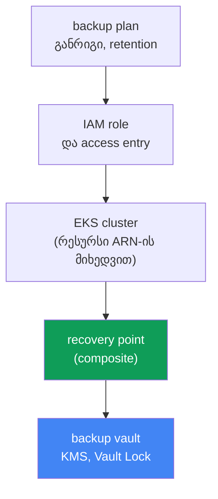
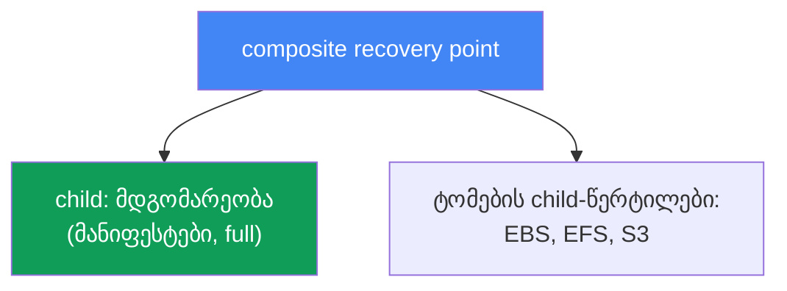
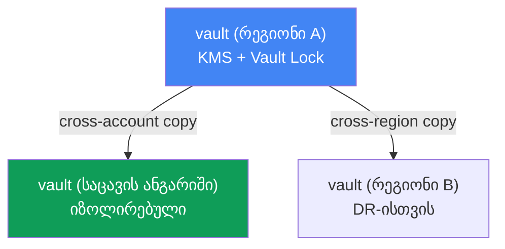

[Русская версия](ru.md) · [Eng version](en.md) · [Versión en español](es.md) · [Version française](fr.md) · [Deutsche Version](de.md) · [繁體中文版](tw.md) · [日本語版](jp.md)
# თავი 41. კლასტერის ბექაპი AWS Backup-ის მეშვეობით: კლასტერის მდგომარეობა, მუდმივი ტომები, composite recovery point

> **რა არის შემდეგ.** 38-40 თავებში კლასტერის სასიცოცხლო ციკლი განვიხილეთ: ვერსიების განახლება,
> უკან დაბრუნება 7-დღიან ფანჯარაში და დატვირთვების საიმედოობა. ეს ყველაფერი control plane-სა და
> ხელმისაწვდომობას ეხება, მაგრამ არცერთი მათგანი არ გვიცავს მონაცემების დაზიანებისგან ან წაშლისგან:
> ვერსიის უკან დაბრუნება (თავი 39) control plane-ს აბრუნებს და არა წაშლილ namespace-ს ან გადაწერილ
> ტომს. აქ განვიხილავთ როგორც კლასტერის მდგომარეობის (Kubernetes-ის ობიექტების), ისე მუდმივი ტომების
> მონაცემების შეთანხმებულ ბექაპს AWS Backup-ის მეშვეობით. მომიჯნავე თემები სხვა თავებშია:
> აღდგენა, DR და Velero - თავი 42; ვერსიის უკან დაბრუნება (ეს ბექაპი არ არის) - თავი 39;
> EBS-სნეპშოტები და StorageClass - თავი 23; EFS - თავი 24.

## 41.1. „ვიღაცამ namespace prod წაშალა“

სცენარი, რომლის წარმოდგენაც კი შემზარავია. ინჟინერმა სიჩქარეში kubectl-ის კონტექსტები აურია და
ბრძანება არასწორ კლასტერში შეასრულა:

```bash
kubectl delete namespace prod
# namespace "prod" deleted
```

ერთი ბრძანებით გაქრა ამ namespace-ის ყველა Deployment, Service, ConfigMap, Secret და, რაც უფრო
უარესია, PVC. PVC-სთან ერთად, თუ StorageClass-ში `reclaimPolicy: Delete` არის მითითებული,
მონაცემების შემცველი EBS-ტომებიც იშლება (თავი 23). ერთი წუთის შემდეგ ჩატში ინციდენტია: prod
გათიშულია, მონაცემები აღარ არსებობს.

მორიგე ინჟინრის პირველი აზრია - „უკან დავბრუნდეთ“. მაგრამ დასაბრუნებელი არაფერია. კლასტერის
ვერსიის უკან დაბრუნება (თავი 39) control plane-სა და მის ვერსიასთან მუშაობს, ის Kubernetes-ის
ობიექტებს არ ინახავს და არ აბრუნებს, მით უმეტეს, ტომების შიგთავსს. ხოლო etcd-ს, სადაც ეს
ობიექტები ინახება, EKS-ში AWS მართავს: მასზე პირდაპირი წვდომა არ არსებობს და etcd-ის dump-ის
გაკეთება, როგორც თვითმართვად კლასტერში, შეუძლებელია. Managed control plane-ს არც ბრძანება
„დააბრუნე გუშინდელ მდგომარეობაში“ აქვს.

ამავე პრობლემის კიდევ უფრო ვერაგი ვარიანტია არა წაშლა, არამედ ფარული დაზიანება. DB-ის მიგრაცია
არასწორად შესრულდა და PVC-ის უკან მდებარე ტომში ნაგავი ჩაწერა; განთავსებამ გამართული
კონფიგურაციის ConfigMap წაშალა. კლასტერი მწვანეა, პოდები მუშაობს, მაგრამ მონაცემები და
მდგომარეობა დაზიანებულია და საჭიროა „რელიზამდე“ არსებულ მდგომარეობაზე დაბრუნება.

აქედან გამომდინარეობს ამ თავის დასკვნა. კლასტერს სჭირდება ნამდვილი ბექაპი - როგორც
**მდგომარეობის** (Kubernetes API-ის ობიექტების), ისე **მუდმივი ტომების მონაცემების**, რომლებიც
**შეთანხმებულად** უნდა გადაიღოს, რათა PVC-ის მანიფესტი და ტომის შიგთავსი დროის ერთსა და იმავე
მომენტს ეკუთვნოდეს. სხვაგვარად ბექაპი თითქმის უსარგებლოა: PVC-ის მანიფესტი მონაცემების გარეშე
გამოუსადეგარია, ხოლო ტომი მანიფესტის გარეშე ვერაფერს მიუერთდება. განვიხილოთ, როგორ აკეთებს ამას
AWS Backup.

## 41.2. რას ნიშნავს „კლასტერის ბექაპი“ EKS-ში: ორი სხვადასხვა რამ

პირველი, რაც მკაფიოდ უნდა გავმიჯნოთ: „კლასტერის ბექაპი“ ერთი ობიექტი კი არა, ორი პრინციპულად
განსხვავებული არსია, რომლებიც ერთად უნდა გადაიღოთ.

| კომპონენტი | რა არის | სად ინახება | რით იქმნება ბექაპი |
|---|---|---|---|
| კლასტერის მდგომარეობა | Kubernetes API-ის ობიექტები: Deployment, ConfigMap, Secret, StatefulSet, StorageClass, PVC-ის მანიფესტები, RBAC, CRD | etcd (managed AWS) | სნეპშოტი Kubernetes API-ის მეშვეობით |
| ტომების მონაცემები | PVC-ის უკან მდებარე EBS/EFS/S3-ის შიგთავსი | AWS-ის ტომები | ტომების სნეპშოტები/ბექაპები |

**კლასტერის მდგომარეობა** არის desired state: მანიფესტები (YAML ან JSON), რომლებიც Kubernetes-ის
რესურსებს აღწერს. სწორედ ისინი ქრება `kubectl delete namespace`-ის შესრულებისას. ისინი etcd-ში
ინახება, ხოლო etcd managed control plane-ის ნაწილია: AWS მასზე პირდაპირ წვდომას არ იძლევა.
ამიტომ მდგომარეობის ბექაპი etcd-ის dump-ით კი არა, **Kubernetes API-ის მეშვეობით** კეთდება:
ობიექტებს კითხულობენ და ბექაპში ინახავენ.

**მუდმივი ტომების მონაცემები** არის EBS-, EFS- ან S3-საცავის შიგთავსი, რომელსაც პოდი PVC-ის
მეშვეობით იყენებს. PVC-ის მანიფესტი მხოლოდ ტომზე მოთხოვნას აღწერს; თავად მონაცემები AWS-ის ტომში
ინახება და მათი ბექაპი სნეპშოტებით (თავი 23) ან ფაილური სისტემის ბექაპით (თავი 24) იქმნება.

მთავარი აზრი: ეს ორი რამ ცალ-ცალკე უსარგებლოა. მანიფესტების მონაცემების გარეშე აღდგენა ცარიელ
ტომებს მოგვცემს; ტომების მანიფესტების გარეშე აღდგენა კი დისკებს მოგვცემს, რომლებსაც ვერაფერს
მივუერთებთ. საჭიროა მექანიზმი, რომელიც ორივეს **ერთ შეთანხმებულ ერთეულად** გადაიღებს. სწორედ
ამას აკეთებს AWS Backup EKS-ისთვის composite recovery point-ის მეშვეობით (განყოფილება 41.4).

## 41.3. AWS Backup EKS-ისთვის: გეგმა, საცავი, აღდგენის წერტილი

AWS Backup არის AWS-ის ცენტრალიზებული სარეზერვო კოპირების სერვისი: ის ერთიანი წესებით ქმნის EBS,
EFS, RDS, DynamoDB, S3 და სხვა რესურსების ბექაპებს. შედარებით ცოტა ხნის წინ ამ სიას Amazon EKS-იც
დაემატა: ახლა კლასტერის მდგომარეობისა და დაკავშირებული ტომების ბექაპები იმავე გეგმებისა და
საცავების მექანიზმით იქმნება, რომლითაც დანარჩენი ინფრასტრუქტურის. ძირითადი ცნებებია:

| ცნება | რას განსაზღვრავს |
|---|---|
| backup plan | ბექაპების განრიგს, retention-ს, cold storage-ში გადასვლას (lifecycle) |
| backup vault | recovery points-ის საცავს; KMS-ით დაშიფვრას, Vault Lock-ს immutability-სთვის |
| recovery point | აღდგენის კონკრეტულ წერტილს (ერთ გადაღებულ ბექაპს) |
| IAM role | როლს, რომლის სახელითაც AWS Backup რესურსს კითხულობს და ბექაპს ქმნის |

**backup plan** აღწერს, რისი და როდის უნდა შეიქმნას ბექაპი: განრიგი (მაგალითად, დღეში ერთხელ),
შენახვის ხანგრძლივობა (retention) და იაფ ცივ საცავის კლასში გადასვლის დრო (lifecycle,
`MoveToColdStorageAfterDays`/`DeleteAfterDays`). გეგმას რესურსები ტიპის ან ტეგების მიხედვით
უკავშირდება; EKS-ისთვის რესურსი თავად კლასტერია, მისი ARN-ის მიხედვით.

**backup vault** არის საცავი, რომელშიც recovery points ინახება. Vault-ს აქვს საკუთარი KMS გასაღები,
რომლითაც ბექაპები იშიფრება, და საკუთარი წვდომის პოლიტიკა. თავად ბექაპების წაშლისგან დაცვა სწორედ
vault-ის დონეზე ირთვება (განყოფილება 41.6).

**recovery point** არის წარმატებული backup job-ის შედეგი: ერთი წერტილი, რომელზეც დაბრუნება შეიძლება.
EKS-ისთვის ის შედგენილია, რასაც შემდეგ განვიხილავთ.

ცალკე საკითხია **IAM role**. AWS Backup „ჯადოსნურად“ კი არა, სერვისული როლის სახელით მუშაობს.
EKS-ის, EBS-ისა და EFS-ის ბექაპისთვის საკმარისია მართვადი პოლიტიკა
`AWSBackupServiceRolePolicyForBackup`; PVC-ის უკან S3-ბაკეტების არსებობისას ემატება
`AWSBackupServiceRolePolicyForS3Backup`. უშუალოდ EKS-ისთვის მნიშვნელოვანი პირობაა: კლასტერში
ავტორიზაციის რეჟიმი `API` ან `API_AND_CONFIG_MAP` (access entries, თავი 5) უნდა იყოს ჩართული.
ამ შემთხვევაში AWS Backup თავისთვის access entry-ს თავად ქმნის და ობიექტებს Kubernetes API-ის
მეშვეობით კითხულობს. კლასტერში არც აგენტის და არც ადონის დაყენება არ არის საჭირო.



## 41.4. Composite recovery point

ეს ამ თავის ცენტრალური ცნებაა. როდესაც AWS Backup EKS-კლასტერის ბექაპს ქმნის, ის ერთ ბრტყელ
წერტილს კი არა, **composite recovery point**-ს ქმნის. ეს შედგენილი აღდგენის წერტილია, რომელიც
რამდენიმე ჩადგმულ (nested) წერტილს ერთ შეთანხმებულ ერთეულად აჯგუფებს:

- **კლასტერის მდგომარეობის child recovery point** - Kubernetes-ის ობიექტების (მანიფესტების)
  სნეპშოტი;
- **მუდმივი ტომების child recovery points** - PVC-ის უკან მდებარე და AWS Backup-ის მიერ
  მხარდაჭერილი EBS-, EFS- და S3-საცავების ბექაპები.

სწორედ ეს წყვეტს 41.1 განყოფილების პრობლემას: მდგომარეობა და მონაცემები ერთ ბექაპში ხვდება და
აღდგება როგორც ერთი მთლიანობა, ნაცვლად იმისა, რომ სხვადასხვა სნეპშოტიდან ხელით შეიკრიბოს.



სტატუსების მექანიკა ასეთია. Composite-ისთვის იქმნება მშობელი backup job, ხოლო თითოეული child-ისთვის
თავისი. Composite-ის საბოლოო სტატუსი შეიძლება იყოს `Completed`, `Partial` ან
`Completed with issues`. `Partial` ნიშნავს, რომ ჩადგმული job-ების ნაწილი წარმატებით არ დასრულდა
ან nested-წერტილი წაიშალა/განცალკევდა; `Completed with issues` ნიშნავს, რომ Kubernetes-ის
ზოგიერთი ობიექტის წაკითხვა ვერ მოხერხდა (მაგალითად, metrics-server-ის მიუწვდომლობისას მეტრიკების
ცალკეული API-ჯგუფები გამოტოვებულია). აღდგენა შესაძლებელია იმ nested-წერტილებიდან, რომელთა სტატუსია
`Completed`.

Composite-ის შიგნით ურთიერთობები არასიმეტრიულია. კლასტერის მდგომარეობის child მშობელთან 1:1 კავშირს
ინარჩუნებს: მისი ცალკე კოპირება, წაშლა ან განცალკევება შეუძლებელია. ტომების child-წერტილების კი,
პირიქით, ცალკე კოპირება, წაშლა, განცალკევება და აღდგენა შეიძლება. თავად composite-ის წაშლა,
სანამ მასში ჩადგმული წერტილებია, შეუძლებელია: ჯერ nested-წერტილები უნდა წაშალოთ ან განაცალკევოთ.

როგორ ჩაირთოს. საჭიროა (1) რეგიონში AWS Backup-ის პარამეტრებში Amazon EKS-ის opt-in
(`update-region-settings`), (2) backup plan კლასტერი-რესურსით (ARN-ის ან ტეგის მიხედვით) ან
on-demand job ბრძანებით `start-backup-job`, კლასტერის `--resource-arn`-ის მითითებით, და (3)
კლასტერი ავტორიზაციის რეჟიმში `API`/`API_AND_CONFIG_MAP`. ამის შემდეგ AWS Backup ბექაპს composite
და ჩადგმულ წერტილებად თავად დაყოფს.

## 41.5. რა ხვდება ბექაპში და რა არა

დაფარვის მკაფიო საზღვარი უფრო მნიშვნელოვანია, ვიდრე განცდა, რომ „ბექაპი გვაქვს“. AWS Backup-ის
დოკუმენტაციის მიხედვით, EKS-ის ბექაპში შემდეგი კომპონენტები ხვდება ან არ ხვდება:

| ხვდება | არ ხვდება |
|---|---|
| კლასტერის მდგომარეობა (ობიექტების მანიფესტები) | კონტეინერის image-ები გარე რეესტრებიდან (ECR, Docker) |
| კლასტერის კონფიგურაცია: IAM role, VPC, ქსელი, ლოგები, დაშიფვრა, ადონები, access entries, node groups, Fargate profiles, pod identity | კლასტერის ინფრასტრუქტურა (თავად VPC და subnet-ები) |
| PVC-ის უკან მდებარე EBS-ტომები (სნეპშოტები) | ავტომატურად გენერირებული ობიექტები: ნოდები, სერვისული პოდები, events, leases, jobs |
| PVC-ის უკან მდებარე EFS და S3 (მხარდაჭერილი ტიპები) | FSx CSI-ის მეშვეობით; in-tree/CSI migration/ACK ტომები; EFS non-root subpath-ით |

კლასტერის მდგომარეობა მოიცავს არა მხოლოდ სამუშაო მანიფესტებს (Secret, ConfigMap, StatefulSet,
DaemonSet, StorageClass, PVC, CRD, RBAC), არამედ თავად კლასტერის კონფიგურაციასაც: სახელს, IAM role-ს,
VPC-ისა და ქსელის პარამეტრებს, ლოგირებას, დაშიფვრას, ადონებს, access entries-ს, managed node groups-ს,
Fargate profiles-ს, pod identity associations-ს. ტომების მონაცემები მხარდაჭერილი ტიპებისთვის შედის:
EBS, EFS და S3 EKS-ის ადონების CSI-დრაივერების მეშვეობით.

მნიშვნელოვანი შეზღუდვები, რომლებიც წინასწარ უნდა შეამოწმოთ (თორემ მიიღებთ `Partial`-ს): in-tree
პლაგინების, CSI migration-ის ან ACK-კონტროლერების მეშვეობით შექმნილი ტომები არ არის მხარდაჭერილი;
FSx CSI-ის მეშვეობით ასევე არ არის მხარდაჭერილი; EFS non-root subpath-ითაც არ არის მხარდაჭერილი;
S3-ისთვის იქმნება მთელი ბაკეტის და არა ცალკეული პრეფიქსის ბექაპი და მხოლოდ snapshot-ბექაპი;
EKS Backups-ის მეშვეობით EFS-ის cross-account ბექაპი არ არის მხარდაჭერილი. EFS/FSx-ში ან მესამე
მხარის სისტემებში არსებული მონაცემები, რომლებიც მხარდაჭერილი PV-ის სახით არ არის მიერთებული,
ავტომატურად არ იფარება და მათი ბექაპი ცალკე უნდა შეიქმნას.

შეთანხმებულობის შესახებ. ტომების „მუშაობისას“, ჩაწერის შეჩერების გარეშე გადაღებული სნეპშოტები
**crash-consistent** შედეგს იძლევა, თითქოს კვების წყარო გამოაძვრეს: ფაილური სისტემა მთლიანია,
მაგრამ აპლიკაციას (მაგალითად, DBMS-ს) შეიძლება დაუკომიტებელი მონაცემები აკლდეს.
**Application-consistent** ბექაპისთვის საჭიროა, რომ აპლიკაციამ ბუფერები ჩაწეროს და სნეპშოტის
გადაღების მომენტში გაჩერდეს. ჩვეულებრივ, ამისთვის თავად DBMS-ის საშუალებებით dump კეთდება ან
სნეპშოტამდე ფაილური სისტემა იყინება (fs-freeze), შემდეგ კი ყინვა იხსნება.

აქ არის შეზღუდვა, რომელიც ადვილად შეიძლება შეცდომით გადაწყვეტილად ჩათვალოთ: **AWS Backup-ს
პოდების შიგნით ჰუკები არ აქვს**. სერვისი ტომებს არსებულ მდგომარეობაში იღებს და სნეპშოტამდე და
მის შემდეგ კონტეინერში ბრძანების შესრულება არ შეუძლია: VSS-შეთანხმების მექანიზმი მხოლოდ Windows-ის
მქონე EC2-სთვის აქვს, პოდებში exec-ჰუკები კი საერთოდ არ არსებობს. აქედან StatefulSet-ში DBMS-ისთვის
სამი პრაქტიკული გზა გამომდინარეობს: AWS Backup-ის ბექაპთან ერთად ბაზის ნატიური dump-ები S3-ში
შეინახოთ; გარე გარსი ააწყოთ (Amazon Data Lifecycle Manager-ს EBS-სნეპშოტებისთვის SSM-ის მეშვეობით
pre/post-სკრიპტები აქვს, მაგრამ ეს ინსტანსის და არა პოდის დონეა); ან გამოიყენოთ Velero, რომელსაც
ბექაპის ჰუკები სტანდარტულად აქვს: ანოტაციები `pre.hook.backup.velero.io/command` და
`post.hook.backup.velero.io/command` ბექაპის გადაღებამდე და მის შემდეგ კონტეინერში ბრძანებას
ასრულებს (თავი 42). პრაქტიკაში ყველაზე ხშირად პირველ ვარიანტს იყენებენ: ნატიური dump-ები DB-ის
მონაცემებისთვის, AWS Backup კი კლასტერის მდგომარეობისა და ტომებისთვის.

## 41.6. backup vault და თავად ბექაპების დაცვა

ბექაპი, რომლის წაშლაც იმავე ადამიანს შეუძლია, ვინც namespace წაშალა, უსაფრთხოების ცრუ განცდას
ქმნის. ამიტომ ცალკე ამოცანაა თავად recovery points-ის დაცვა. ეს ყველაფერი backup vault-ის დონეზე
ხდება.

**KMS-ით დაშიფვრა.** კლასტერის მდგომარეობის child-წერტილები იმ vault-ის KMS გასაღებით იშიფრება,
სადაც ისინი ინახება. ტომების წერტილები საცავის საკუთარი ტიპის წესებით იშიფრება (EBS-სნეპშოტები,
EFS-ისა და S3-ის ბექაპები). KMS გასაღების არჩევა vault-ის კონფიგურაციის ნაწილია.

**Vault Lock.** ეს vault-ისთვის განკუთვნილი WORM-რეჟიმია (write-once, read-many): ის recovery points-ს
როგორც შემთხვევითი, ისე ბოროტგანზრახული წაშლისგან იცავს. არსებობს ორი რეჟიმი:

| რეჟიმი | ვის შეუძლია lock-ის მოხსნა | როდის იყენებენ |
|---|---|---|
| governance mode | საჭირო IAM-უფლებების მქონე მომხმარებლებს | შემთხვევითი წაშლისგან დაცვა, მოქნილობა |
| compliance mode | grace time-ის შემდეგ არავის, root-სა და AWS-საც კი | უცვლელობის მკაცრი მოთხოვნები |

**governance mode**-ში lock-ის მოხსნა საკმარისი IAM-უფლებების მქონე მომხმარებლებს შეუძლიათ. ეს
შეცდომისგან დაცვას მოქნილობის დაკარგვის გარეშე უზრუნველყოფს. **compliance mode**-ში grace time-ის
შემდეგ lock უცვლელი ხდება: ვერცერთი მომხმარებელი, root-ისა და AWS-ის ჩათვლით, ვერ წაშლის ბექაპებს
ან შეცვლის მათ lifecycle-ს retention-ის დასრულებამდე. ეს ძლიერი, მაგრამ სახიფათო მექანიზმია:
თუ retention-ს „სამუდამოდ“ დააყენებთ, ასეთი ბექაპების წაშლა უკვე შეუძლებელი იქნება, ამიტომ retention
გააზრებულად უნდა დააკონფიგურიროთ.

**Cross-region და cross-account ასლები.** Composite-ის სხვა რეგიონში და სხვა ანგარიშში კოპირება
შეიძლება (EKS Backups ყველა ტიპის ასლს უჭერს მხარს, გარდა ცალკეული ნიუანსებისა, როგორიცაა
cross-account EFS). ეს DR-ის საფუძველია: თუ მთელი რეგიონი ან ანგარიში კომპრომეტირებულია, Vault Lock-ის
მქონე ცალკე საცავის ანგარიშში მოთავსებული ბექაპის ასლი ხელუხლებელი რჩება. Compliance-ის მოთხოვნებით
ხანგრძლივი შენახვისთვის ასლი lifecycle-ის მიხედვით cold storage-ში (`MoveToColdStorageAfterDays`)
გადადის. ეს იაფია, თუმცა შენახვის მინიმალური ვადა 90 დღეა. ასეთი ასლებიდან აღდგენა და DR-ის სქემა
42-ე თავის თემაა.



## 41.7. Velero, როგორც მეორე ინსტრუმენტი

AWS Backup კლასტერის ბექაპის ერთადერთი გზა არ არის. Velero Kubernetes-native ინსტრუმენტია,
რომელიც ობიექტების ბექაპს S3-ბაკეტში ინახავს, namespace-ის ან label-ის მიხედვით ბექაპის შექმნა
შეუძლია, ტომების სნეპშოტებს CSI-ის მეშვეობით იღებს და, AWS Backup-ისგან განსხვავებით, ბექაპამდე და
მის შემდეგ პოდებში ჰუკებს უშვებს. DBMS-ის შეთანხმებულობას სწორედ ამით უზრუნველყოფენ. ის კლასტერის
შიგნით მუშაობს და Kubernetes-თან უფრო ახლოსაა, ხოლო AWS Backup არის AWS-ის გარე სერვისი
ცენტრალიზებული გეგმებით, vault-ითა და Vault Lock-ით. Velero და ინსტრუმენტებს შორის არჩევანი
დეტალურად 42-ე თავში განიხილება; აქ საკმარისია ვიცოდეთ, რომ ეს მეორე გავრცელებული გზაა.

## 41.8. როგორ იყენებენ ამას production-ში

- **AWS Backup-ში EKS-ის opt-in-ს გააზრებულად რთავენ.** `describe-region-settings`-ით ამოწმებენ,
  რომ Amazon EKS საჭირო რეგიონში ჩართულია, წინააღმდეგ შემთხვევაში კლასტერისთვის backup job
  უბრალოდ არ შეიქმნება.
- **კლასტერს წინასწარ ამზადებენ.** ავტორიზაციის რეჟიმი `API` ან `API_AND_CONFIG_MAP` (თავი 5) და
  როლი `AWSBackupServiceRolePolicyForBackup`-ით ბექაპის წინაპირობაა და არა უმნიშვნელო დეტალი.
- **ბექაპებს Vault Lock-ის მქონე ცალკე vault-ში ინახავენ.** WORM-რეჟიმი აღდგენის წერტილებს იმავე
  წაშლისგან იცავს, რომლის გამოც ბექაპია საჭირო; governance mode გონივრული ნაგულისხმევი არჩევანია.
- **ბექაპებს ცალკე ანგარიშსა და რეგიონში აკოპირებენ.** იზოლირებულ საცავის ანგარიშში არსებული
  cross-account ასლი ძირითადი ანგარიშის კომპრომეტირებისგან დაზღვევაა (DR, თავი 42).
- **გარე გარსის გარეშე მონაცემთა ბაზებისთვის მხოლოდ AWS Backup-ს არ ეყრდნობიან.** ტომის სნეპშოტი
  ყოველთვის crash-consistent-ია, ხოლო სერვისს პოდების შიგნით ჰუკები არ აქვს: DBMS-ისთვის აწყობენ
  ნატიურ dump-ებს, გარე ავტომატიზაციას ან Velero-ს ბექაპის ჰუკებით (თავი 42).
- **Job-ის სტატუსს აკვირდებიან.** `Partial` და `Completed with issues` არასრულ ბექაპს ნიშნავს;
  მათზე შეტყობინებებს აწყობენ, რათა ხარვეზი მხოლოდ აღდგენისას არ აღმოაჩინონ.

## 41.9. მინი-ლექსიკონი

- **AWS Backup** - AWS-ის ცენტრალიზებული სარეზერვო კოპირების სერვისი; ერთიანი გეგმებითა და
  საცავებით ქმნის EKS-ის, EBS-ის, EFS-ის, S3-ისა და სხვა რესურსების ბექაპებს.
- **backup plan** - ბექაპის გეგმა: განრიგი, retention, lifecycle (cold storage-ში გადასვლა) და
  რესურსების მიბმა.
- **backup vault** - recovery points-ის საცავი KMS გასაღებითა და წვდომის პოლიტიკით; მასზე
  ირთვება Vault Lock.
- **recovery point** - აღდგენის წერტილი, წარმატებული backup job-ის შედეგი.
- **composite recovery point** - EKS-ის შედგენილი წერტილი, რომელიც კლასტერის მდგომარეობასა და
  ტომების ბექაპებს ერთ ერთეულად აჯგუფებს.
- **nested (child) recovery point** - composite-ის შიგნით ჩადგმული წერტილი: კლასტერის მდგომარეობა
  ან ცალკე ტომი.
- **EKS Cluster State** - Kubernetes-ის ობიექტების მანიფესტები (Secret, ConfigMap, StatefulSet,
  PVC, RBAC, CRD და სხვ.) და კლასტერის კონფიგურაცია.
- **Vault Lock** - vault-ის WORM-დაცვა ბექაპების წაშლისგან; governance mode (იხსნება IAM-ის
  მიხედვით) და compliance mode (grace time-ის შემდეგ უცვლელია).
- **crash-consistent / application-consistent** - სნეპშოტი ჩაწერის შეუჩერებლად და სნეპშოტი
  აპლიკაციის დონეზე შეთანხმებით. AWS Backup-ისთვის EKS-ში მხოლოდ პირველი ვარიანტია ხელმისაწვდომი:
  პოდებში ჰუკები არ არის, მეორეს კი DB-ის dump-ები, გარე გარსი ან Velero-ს ჰუკები უზრუნველყოფს.

## 41.10. თავის შეჯამება

- კლასტერის ვერსიის უკან დაბრუნება (თავი 39) წაშლილ namespace-ს, PVC-ს ან ტომის შიგთავსს არ
  აბრუნებს: ის control plane-ს ეხება და არა მონაცემებსა და ობიექტებს. EKS-ში etcd managed არის
  და პირდაპირ მიუწვდომელია.
- „კლასტერის ბექაპი“ ორი სხვადასხვა რამაა: მდგომარეობა (Kubernetes API-ის ობიექტები) და მუდმივი
  ტომების მონაცემები; ისინი შეთანხმებულად უნდა გადაიღოთ, რადგან ცალ-ცალკე უსარგებლოა.
- მდგომარეობის ბექაპი Kubernetes API-ის მეშვეობით და არა etcd-ის dump-ით იქმნება; ტომების
  მონაცემების ბექაპი კი EBS/EFS/S3-ის სნეპშოტებითა და ბექაპებით.
- AWS Backup EKS-ისთვის იყენებს ცნებებს backup plan (განრიგი, retention, lifecycle), backup vault
  (KMS, Vault Lock) და recovery point; მუშაობს IAM role-ის სახელით, კლასტერში აგენტის გარეშე.
- Composite recovery point მდგომარეობის child-წერტილსა და ტომების child-წერტილებს ერთ შეთანხმებულ
  ერთეულად აჯგუფებს; მდგომარეობა და მონაცემები ერთი მთლიანობის სახით აღდგება.
- ბექაპში შედის კლასტერის მდგომარეობა და კონფიგურაცია, ასევე მხარდაჭერილი ტომები (EBS, EFS, S3);
  არ შედის image-ები, VPC-ის ინფრასტრუქტურა, ავტომატურად გენერირებული ობიექტები, FSx და ტომების
  ზოგიერთი კონფიგურაცია.
- ტომების სნეპშოტები crash-consistent-ია, ხოლო AWS Backup-ს პოდების შიგნით ჰუკები არ აქვს:
  DB-ის აპლიკაციის დონის შეთანხმებულობას ნატიური dump-ები, გარე გარსი ან ჰუკების მქონე Velero
  უზრუნველყოფს (თავი 42).
- Vault Lock (governance/compliance) ბექაპებს წაშლისგან იცავს; cross-region და cross-account
  ასლები DR-ის საფუძველია (თავი 42).
- ჩართვა: რეგიონში EKS-ის opt-in, backup plan ან on-demand `start-backup-job` კლასტერის ARN-ის
  მიხედვით, ავტორიზაციის რეჟიმი `API`/`API_AND_CONFIG_MAP`.

## 41.11. როგორ გამოგადგებათ ეს რეალურ სამუშაოში

მორიგეობისას ეს თავი არის განსხვავება „ერთ საათში აღვადგენთ“ და „მონაცემები სამუდამოდ დაიკარგა“
შორის. როდესაც ვინმე namespace-ს წაშლის ან რელიზი მონაცემებს დააზიანებს, ვერსიის უკან დაბრუნება
უსარგებლოა: საჭიროა შესაბამისი მომენტისთვის მდგომარეობისა და ტომების ბექაპი. პირველი, რაც წინასწარ
უნდა შეამოწმოთ (და არა ინციდენტის დროს), არის ის, აქვს თუ არა კლასტერს backup plan, ხვდება თუ არა
ის რეგიონში EKS-ის opt-in-ის ქვეშ და როდის შეიქმნა ბოლო წარმატებული composite recovery point
სტატუსით `Completed` და არა `Partial`.

დაგეგმვისას ეს ნებისმიერი production-კლასტერის მოწყობას სავალდებულო პუნქტებს უმატებს: ჩართული
EKS opt-in, ადეკვატური განრიგისა და retention-ის მქონე გეგმა, Vault Lock-ის მქონე ცალკე vault,
DR-ისთვის cross-account ასლები და იმის ცოდნა, თუ რომელი ტომები არ იფარება (FSx, non-root subpath,
S3 პრეფიქსებით) და რომელთა ბექაპიც ცალკე უნდა შეიქმნას. მონაცემთა ბაზებისთვის შეთანხმებულობა ცალკე
მოწმდება: ტომის სნეპშოტი თავისთავად crash-consistent-ია და DBMS-ისთვის ეს შეიძლება საკმარისი არ იყოს.
თავად აღდგენა, ანუ როგორ დაბრუნდეს ამ წერტილებიდან მონაცემები არსებულ ან ახალ კლასტერში, 42-ე თავში
განიხილება.

## 41.12. თვითშემოწმების კითხვები

1. რატომ არ აბრუნებს კლასტერის ვერსიის უკან დაბრუნება (თავი 39) წაშლილ namespace-სა და ტომების
   მონაცემებს?
2. რატომ არ შეიძლება EKS-ში მდგომარეობის ბექაპის etcd-ის dump-ით შექმნა და მის ნაცვლად როგორ
   იქმნება ბექაპი?
3. რომელი ორი კომპონენტისგან შედგება „კლასტერის ბექაპი“ და რატომ იღებენ მათ შეთანხმებულად?
4. რას განსაზღვრავს backup plan, backup vault და recovery point AWS Backup-ში?
5. რატომ სჭირდება AWS Backup-ს IAM role და კლასტერს ავტორიზაციის რეჟიმი
   `API`/`API_AND_CONFIG_MAP`?
6. რა არის composite recovery point და რომელ ჩადგმულ წერტილებს აჯგუფებს ის?
7. რას ნიშნავს composite-ის სტატუსები `Partial` და `Completed with issues`?
8. რა ხვდება EKS-ის ბექაპში და რა არ იფარება ავტომატურად?
9. რით განსხვავდება crash-consistent სნეპშოტი application-consistent-ისგან და რატომ არის ეს
   მნიშვნელოვანი DB-ისთვის?
10. რას იცავს Vault Lock და რით განსხვავდება governance mode compliance mode-ისგან?
11. რატომ არის საჭირო ბექაპების cross-region და cross-account ასლები და როგორ უკავშირდება ეს DR-ს?
12. როგორ ჩაირთოს EKS-ის ბექაპი: opt-in, გეგმა ან on-demand, კლასტერის მოთხოვნები?
13. რით განსხვავდება Velero AWS Backup-ისგან, როგორც კლასტერის ბექაპის ინსტრუმენტი?
14. რატომ ვერ მიიღებთ DBMS-ის application-consistent ბექაპს მხოლოდ AWS Backup-ით და რა ვარიანტები
    არსებობს ამის უზრუნველსაყოფად?

## პრაქტიკა

კურსის ლაბა ამ თემისთვის: [ლაბა 122 - AWS Backup EKS-ისთვის](../../labs/122/README_GE.MD). მასში
ჩართავთ opt-in-ს, გადაიღებთ gp3-ზე ტომის მქონე კლასტერის on-demand ბექაპს, გააანალიზებთ composite
recovery point-ს (parent და EKS-ისა და EBS-ის ჩადგმულ წერტილებს) და შეასრულებთ namespace-restore-ს;
შემოწმება ხდება ბრძანებით `check_result`. გაშვება: `TASK=122 make run_eks_task`.

EBS-ტომის ბექაპი ასევე განიხილება [ლაბაში 129 - Mountpoint for S3: სად ირღვევა ფაილების სემანტიკა
და რატომ არ არსებობს ბექაპი](../../labs/129/README_GE.MD). იქ ნაჩვენებია, რატომ არ აქვს S3-ზე
არსებულ ტომს სნეპშოტი და რა იცავს მონაცემებს მის ნაცვლად, ამ თავის EBS-ტომისგან განსხვავებით.

ლაბის გარდა, ბექაპის მდგომარეობის ნახვა AWS CLI-დანაც შეიძლება. ჯერ რეგიონში Amazon EKS-ისთვის
opt-in შეამოწმეთ, რადგან მის გარეშე კლასტერის ბექაპი არ გაეშვება:

```bash
# რესურსების რომელი ტიპებია ჩართული რეგიონში AWS Backup-ისთვის (მოძებნეთ EKS)
aws backup describe-region-settings --region <region>
```

ნახეთ, რომელი გეგმები და საცავებია უკვე შექმნილი:

```bash
# ბექაპის გეგმები: განრიგი და მიბმული რესურსები
aws backup list-backup-plans
# recovery points-ის საცავები
aws backup list-backup-vaults
```

ჩახედეთ კონკრეტულ vault-ს და იპოვეთ EKS-ის composite recovery points და მათი სტატუსები:

```bash
# აღდგენის წერტილები საცავში (EKS-ისთვის - composite და ჩადგმული)
aws backup list-recovery-points-by-backup-vault --backup-vault-name <vault>
```

ერთმანეთს შეუდარეთ სამი რამ: ჩართულია თუ არა EKS-ის opt-in, არსებობს თუ არა კლასტერი-რესურსის მქონე
backup plan და როდის შეიქმნა ბოლო composite recovery point სტატუსით `Completed` (და არა `Partial`).
თუ opt-in გამორთულია ან ახალი წერტილები არ არსებობს, კლასტერს ფაქტობრივად ბექაპი არ აქვს და ეს
ინციდენტამდე უნდა გამოსწორდეს, არა მის შემდეგ. ამ წერტილებიდან აღდგენა, namespace-restore და Velero
განიხილება 42-ე თავში, EBS-სნეპშოტები და StorageClass - 23-ე თავში, EFS - 24-ე თავში.

---
[სარჩევი](../README_GE.md) · [თავი 40](../40/ge.md) · [თავი 42](../42/ge.md)
