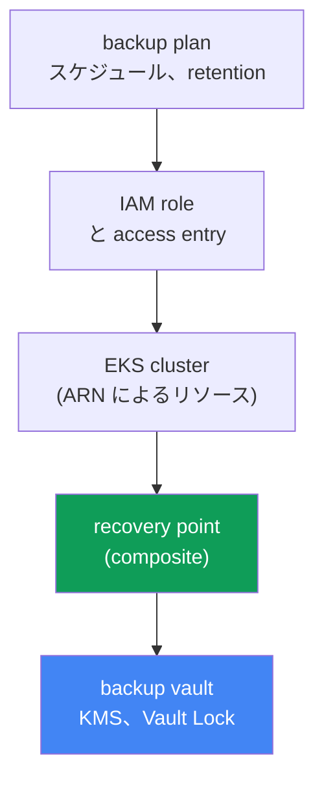
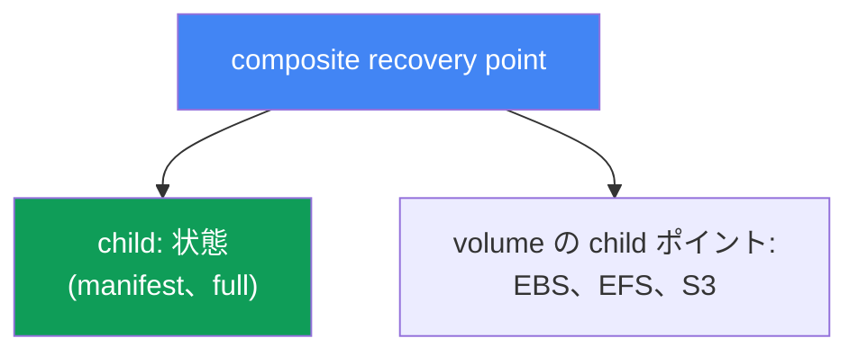
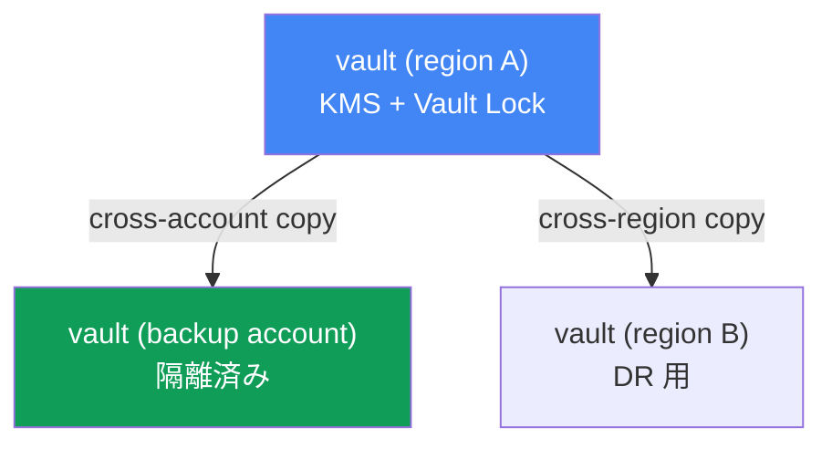

[ロシア語版](ru.md) · [英語版](en.md) · [スペイン語版](es.md) · [フランス語版](fr.md) · [ドイツ語版](de.md) · [ジョージア語版](ge.md) · [繁体字中国語版](tw.md)
# 第41章. AWS Backup によるクラスターのバックアップ: クラスター状態、永続ボリューム、composite recovery point

> **次は何か。** 第38-40章ではクラスターのライフサイクル、すなわちバージョンのアップグレード、7日間のウィンドウ内でのロールバック、ワークロードの信頼性を扱いました。これらは control plane と可用性に関するものですが、データの破損や削除は防げません。バージョンのロールバック（第39章）は control plane を戻しますが、削除された namespace や上書きされた volume は戻しません。ここでは AWS Backup を使い、クラスター状態（Kubernetes オブジェクト）と永続ボリュームのデータを整合的にバックアップします。関連する内容は他章で扱います。復元、DR、Velero は第42章、バージョンのロールバック（これはバックアップではない）は第39章、EBS snapshot と StorageClass は第23章、EFS は第24章です。

## 41.1. 「誰かが namespace prod を削除した」

背筋が凍るシナリオです。急いでいたエンジニアが kubectl の context を取り違え、別のクラスターで次を実行しました。

```bash
kubectl delete namespace prod
# namespace "prod" deleted
```

この一つのコマンドで、その namespace の Deployment、Service、ConfigMap、Secret、そしてさらに悪いことに PVC がすべて失われます。StorageClass が `reclaimPolicy: Delete` なら、PVC とともにデータを持つ EBS volume も続いて削除されます（第23章）。1分後にはインシデントのチャットに、prod は停止し、データもないという報告が届きます。

オンコール担当者が最初に考えるのは「ロールバックしよう」です。しかしロールバックするものはありません。クラスターのバージョンロールバック（第39章）は control plane とそのバージョンを対象にするもので、Kubernetes オブジェクトや、まして volume の内容を保持も復元もしません。これらのオブジェクトが存在する etcd は EKS では AWS により管理され、直接アクセスはできません。セルフマネージドクラスターのように etcd dump を取得することは不可能です。managed control plane にも「昨日の状態へ戻す」コマンドはありません。

同じ苦痛には、さらに厄介な形があります。それは削除ではなく、静かな破損です。DB migration が失敗して PVC の背後の volume に不要なデータを書き込み、デプロイが正常な設定を持つ ConfigMap を削除しました。クラスターは green で、Pod も実行中ですが、データと状態は壊れており、「リリース前」の状態へ戻す必要があります。

ここからこの章の結論が得られます。クラスターには、**状態**（Kubernetes API オブジェクト）と、同じ時点に属するよう**整合的に**取得された永続ボリュームの**データ**の、真のバックアップが必要です。そうでなければバックアップはほとんど役に立ちません。データのない PVC manifest は無用であり、manifest のない volume には接続先がありません。AWS Backup がこれをどう実現するかを見ていきましょう。

## 41.2. EKS における「クラスターのバックアップ」: 二つの異なるもの

まず理解すべきことは、「クラスターのバックアップ」は一つのオブジェクトではなく、同時に取得すべき二つの根本的に異なる実体だということです。

| コンポーネント | 内容 | 保存場所 | バックアップ方法 |
|---|---|---|---|
| クラスター状態 | Kubernetes API オブジェクト: Deployment、ConfigMap、Secret、StatefulSet、StorageClass、PVC manifest、RBAC、CRD | etcd（AWS 管理） | Kubernetes API 経由の snapshot |
| volume データ | PVC の背後にある EBS/EFS/S3 の内容 | AWS volume | volume snapshot/backup |

**クラスター状態**は desired state、すなわち Kubernetes リソースを記述する manifest（YAML または JSON）です。`kubectl delete namespace` で消えるのはまさにこれです。これは etcd にあり、etcd は managed control plane の一部であるため AWS は直接アクセスを提供しません。したがって状態は etcd dump ではなく、**Kubernetes API 経由**でバックアップします。オブジェクトを読み取り、バックアップへ格納します。

**永続ボリュームのデータ**は、PVC 経由で Pod がアクセスする EBS、EFS、または S3 storage の内容です。PVC manifest は volume への要求を記述するだけで、データ自体は AWS volume にあり、snapshot（第23章）または filesystem backup（第24章）でバックアップします。

重要な点は、この二つは単独では役に立たないことです。データなしに manifest を復元すれば空の volume になり、manifest なしに volume を復元しても接続先のない disk が残るだけです。両方を**一つの整合した単位**として取得する仕組みが必要です。AWS Backup は EKS に対して composite recovery point を通じ、これを実現します（41.4節）。

## 41.3. EKS 向け AWS Backup: plan、vault、recovery point

AWS Backup は AWS の一元的なバックアップサービスです。統一されたルールで EBS、EFS、RDS、DynamoDB、S3、その他のリソースをバックアップします。比較的最近、この一覧に Amazon EKS も加わりました。これにより、クラスター状態と関連 volume は、他のインフラストラクチャと同じ plan と vault の仕組みでバックアップできます。主要な概念は次のとおりです。

| 概念 | 設定するもの |
|---|---|
| backup plan | バックアップのスケジュール、retention、cold storage への移行（lifecycle） |
| backup vault | recovery point の保存先、KMS encryption、immutability のための Vault Lock |
| recovery point | 一つの具体的な復元ポイント（取得済みの一つのバックアップ） |
| IAM role | AWS Backup がリソースを読み取りバックアップを作成するときに使用する role |

**backup plan** は、何をいつバックアップするかを記述します。スケジュール（たとえば1日1回）、保存期間（retention）、低価格な cold storage class へ移す時期（lifecycle、`MoveToColdStorageAfterDays`/`DeleteAfterDays`）です。リソースはタイプまたは tag によって plan に関連付けます。EKS のリソースは ARN で指定するクラスター自体です。

**backup vault** は recovery point を格納する保存先です。vault にはバックアップを暗号化する独自の KMS key と、独自のアクセス policy があります。バックアップ自身を削除から保護する機能は vault レベルで有効化します（41.6節）。

**recovery point** は成功した backup job の結果であり、戻せる一つの時点です。EKS では後述のように複合的です。

**IAM role** も重要です。AWS Backup は「魔法」で動作するのではなく、service role の権限で動作します。EKS、EBS、EFS のバックアップには managed policy `AWSBackupServiceRolePolicyForBackup` で十分です。PVC の背後に S3 bucket がある場合は `AWSBackupServiceRolePolicyForS3Backup` を追加します。EKS 固有の重要な前提条件は、クラスターで authorization mode `API` または `API_AND_CONFIG_MAP`（access entry、第5章）が有効であることです。これにより AWS Backup は自身の access entry を作成し、Kubernetes API 経由でオブジェクトを読み取れます。クラスターに agent や addon をインストールする必要はありません。



## 41.4. Composite recovery point

ここがこの章の中心概念です。AWS Backup が EKS クラスターをバックアップするとき、一つの平坦なポイントではなく、複数の nested ポイントを一つの整合した単位として束ねる**composite recovery point**、すなわち複合復元ポイントを作成します。

- **クラスター状態の child recovery point**: Kubernetes オブジェクト（manifest）の snapshot。
- **永続ボリュームの child recovery points**: AWS Backup がサポートする PVC の背後にある EBS、EFS、S3 storage のバックアップ。

これが41.1節の問題を解決します。状態とデータが一つのバックアップに入り、分散した snapshot を手作業で組み合わせるのでなく、全体として復元できます。



status の仕組みです。composite には parent backup job が作成され、各 child にはそれぞれの job が作成されます。composite の最終 status は `Completed`、`Partial`、または `Completed with issues` です。`Partial` は nested job の一部が正常に完了しなかったか、nested ポイントが削除または関連解除されたことを意味します。`Completed with issues` は Kubernetes オブジェクトの一部を読み取れなかったことを意味します。たとえば metrics-server が利用できない場合、個別の metrics API group はスキップされます。status が `Completed` の nested ポイントは復元できます。

composite 内部の関係は対称ではありません。クラスター状態の child は parent と 1:1 の関係を持ち、個別にコピー、削除、関連解除はできません。一方、volume の child ポイントは個別にコピー、削除、関連解除、復元できます。composite 自体は nested ポイントを含む間は削除できません。先に nested を削除または関連解除します。

有効化方法です。(1) リージョンの AWS Backup 設定で Amazon EKS の opt-in を有効にします（`update-region-settings`）。(2) クラスターをリソースにする backup plan を ARN または tag で作成するか、クラスターの `--resource-arn` を指定して `start-backup-job` を実行する on-demand job を使います。(3) クラスターを `API`/`API_AND_CONFIG_MAP` authorization mode にします。以後、AWS Backup はバックアップを composite と nested ポイントへ自動的に分解します。

## 41.5. バックアップに含まれるもの、含まれないもの

「バックアップがある」という感覚より、coverage の明確な境界の方が重要です。AWS Backup のドキュメントによると、EKS バックアップには次のものが含まれ、含まれません。

| 含まれるもの | 含まれないもの |
|---|---|
| クラスター状態（オブジェクトの manifest） | 外部 registry の container image（ECR、Docker） |
| クラスター設定: IAM role、VPC、ネットワーク、ログ、暗号化、addon、access entry、node group、Fargate profile、pod identity | クラスターのインフラストラクチャ（VPC、subnet 自体） |
| PVC の背後にある EBS volume（snapshot） | 自動生成オブジェクト: node、system Pod、event、lease、job |
| PVC の背後にある EFS と S3（サポートされるタイプ） | CSI 経由の FSx、in-tree/CSI migration/ACK の volume、non-root subpath を使用する EFS |

クラスター状態には、ワークロードの manifest（Secret、ConfigMap、StatefulSet、DaemonSet、StorageClass、PVC、CRD、RBAC）だけでなく、クラスター自身の設定も含まれます。名前、IAM role、VPC とネットワーク設定、logging、encryption、addon、access entry、managed node group、Fargate profile、pod identity association です。volume データは、EKS addon の CSI driver 経由でサポートされる EBS、EFS、S3 のタイプで含まれます。

事前に確認すべき重要な制限があります。確認しなければ `Partial` になります。in-tree plugin、CSI migration、ACK controller 経由の volume はサポートされません。CSI 経由の FSx も対象外です。non-root subpath を持つ EFS も対象外です。S3 は個別の prefix ではなく bucket 全体がバックアップされ、snapshot backup のみです。EKS Backups による EFS の cross-account backup はサポートされません。サポートされる PV として接続されていない EFS/FSx やサードパーティーシステムのデータは自動的には対象にならず、別途バックアップします。

整合性についてです。書き込みを止めずに「実行中」で取得する volume snapshot は**crash-consistent**な結果になります。電源を抜いたような状態で、filesystem は健全でも、アプリケーション（たとえば DBMS）は commit されていないデータを失う可能性があります。**application-consistent**なバックアップでは、アプリケーションが buffer を flush して snapshot の時点で停止する必要があります。通常は DBMS 自身の機能による dump、または snapshot 前の filesystem freeze（fs-freeze）と、その後の unfreeze によって実現します。

ここには、解決済みの問題だと誤解しやすい制限があります。**AWS Backup には Pod 内の hook がありません**。サービスは volume をそのまま取得し、snapshot 前後に container 内でコマンドを実行できません。VSS による整合性の仕組みは Windows の EC2 にのみあり、Pod への exec hook は一切ありません。したがって DBMS を持つ StatefulSet には三つの実践的な方法があります。DB の native dump を AWS Backup と並行して S3 に保存する、外部の仕組みを構築する（Amazon Data Lifecycle Manager には EBS snapshot 向けの SSM 経由 pre/post script がありますが、これは Pod ではなく instance レベルです）、または backup hook が標準である Velero を使用することです。annotation `pre.hook.backup.velero.io/command` と `post.hook.backup.velero.io/command` は、バックアップの取得前後に container 内でコマンドを実行します（第42章）。実務では多くの場合、最初の方法を採ります。DB データには native dump、クラスター状態と volume には AWS Backup を使用します。

## 41.6. backup vault とバックアップ自身の保護

namespace を削除した人物が同じように削除できるバックアップは、誤った安心感を与えるだけです。したがって recovery point 自身を保護することも別の課題です。これはすべて backup vault レベルで実現します。

**KMS encryption。** クラスター状態の child ポイントは、保存先 vault の KMS key で暗号化されます。volume ポイントは storage type ごとのルールに従って暗号化されます（EBS snapshot、EFS backup、S3）。KMS key の選択は vault 設定の一部です。

**Vault Lock。** これは vault の WORM mode（write-once, read-many）であり、偶発的または悪意ある削除から recovery point を保護します。二つの mode があります。

| モード | lock を解除できる者 | 使用する場面 |
|---|---|---|
| governance mode | 必要な IAM 権限を持つユーザー | 偶発的削除からの保護、柔軟性 |
| compliance mode | grace time 後は root や AWS を含め誰もできない | 厳格な immutability 要件 |

**governance mode** では、十分な IAM 権限を持つユーザーが lock を解除できます。柔軟性を失わずにミスから保護します。**compliance mode** では、grace time 後に lock は不変になります。retention が終了するまで、root や AWS を含むいかなるユーザーもバックアップの削除や lifecycle の変更ができません。強力ですが危険でもあります。retention を「永久」に設定すると、そのバックアップを削除することはできなくなるため、retention は慎重に設定します。

**Cross-region と cross-account copy。** composite は別の region や account にコピーできます。EKS Backups は、EFS の cross-account など一部の注意点を除き、すべての copy type をサポートします。これは DR の基盤です。region 全体または account が侵害されても、Vault Lock を持つ隔離された backup account 内のコピーは影響を受けません。compliance のために長期保存する場合、lifecycle によりコピーを cold storage に移します（`MoveToColdStorageAfterDays`）。安価ですが、最小保存期間は90日です。これらのコピーからの復元と DR の設計は第42章のテーマです。



## 41.7. 第二のツールとしての Velero

AWS Backup はクラスターをバックアップする唯一の方法ではありません。Velero は Kubernetes-native のツールであり、オブジェクトのバックアップを S3 bucket に格納します。namespace または label 単位のバックアップができ、CSI 経由で volume snapshot を取得します。AWS Backup と異なり、バックアップ前後に Pod 内で hook を実行できます。これにより DBMS の整合性を実現します。Velero はクラスター内で動作し Kubernetes に近い一方、AWS Backup は一元的な plan、vault、Vault Lock を持つ外部 AWS サービスです。Velero の詳細とツール間の選択は第42章で扱います。ここでは、これがもう一つの一般的な選択肢であることを理解すれば十分です。

## 41.8. 本番環境での適用方法

- **AWS Backup で EKS の opt-in を意図的に有効化します。** `describe-region-settings` で Amazon EKS が必要な region に有効化されていることを確認します。有効でなければ、クラスターの backup job は作成されません。
- **クラスターを事前に準備します。** `API` または `API_AND_CONFIG_MAP` authorization mode（第5章）と、`AWSBackupServiceRolePolicyForBackup` を持つ role は、細部ではなくバックアップの前提条件です。
- **Vault Lock を持つ別の vault にバックアップを保存します。** WORM mode は、バックアップが必要となる削除そのものから recovery point を保護します。governance mode は妥当な default です。
- **バックアップを別の account と region にコピーします。** 隔離された backup account への cross-account copy は、主要 account の侵害に対する保険です（DR、第42章）。
- **追加の仕組みなしに DB 用 AWS Backup へ依存しません。** volume snapshot は常に crash-consistent であり、サービスには Pod 内 hook がありません。DBMS には native dump、外部 automation、または backup hook を持つ Velero（第42章）を設定します。
- **job の status を監視します。** `Partial` と `Completed with issues` は不完全なバックアップを意味します。復元時に穴を知るのではなく、これらに通知を設定します。

## 41.9. ミニ用語集

- **AWS Backup**: EKS、EBS、EFS、S3、その他のリソースを統一された plan と vault でバックアップする AWS の一元的バックアップサービス。
- **backup plan**: スケジュール、retention、lifecycle（cold storage への移行）、リソースの関連付けを定義するバックアップ計画。
- **backup vault**: KMS key とアクセス policy を持つ recovery point の保存先。ここで Vault Lock を有効化する。
- **recovery point**: 成功した backup job の結果である復元ポイント。
- **composite recovery point**: クラスター状態と volume backup を一つの単位にグループ化する、EKS 用の複合復元ポイント。
- **nested (child) recovery point**: composite 内の nested ポイント。クラスター状態または個別の volume。
- **EKS Cluster State**: Kubernetes オブジェクトの manifest（Secret、ConfigMap、StatefulSet、PVC、RBAC、CRD など）とクラスター設定。
- **Vault Lock**: バックアップ削除から vault を保護する WORM 機能。governance mode（IAM により解除可能）と compliance mode（grace time 後は不変）がある。
- **crash-consistent / application-consistent**: 書き込みを停止せずに取得する snapshot と、アプリケーションレベルで整合させた snapshot。EKS の AWS Backup で利用できるのは前者のみです。Pod hook がないため、後者は DB dump、外部の仕組み、または Velero hook で確保します。

## 41.10. この章のまとめ

- クラスターのバージョンロールバック（第39章）は、削除された namespace、PVC、volume の内容を戻しません。これは control plane に関するもので、データやオブジェクトに関するものではありません。EKS の etcd は managed であり、直接アクセスできません。
- 「クラスターのバックアップ」は二つの異なるものです。状態（Kubernetes API オブジェクト）と永続 volume のデータであり、整合的に取得する必要があります。別々では役に立ちません。
- 状態は etcd dump ではなく Kubernetes API 経由でバックアップし、volume データは EBS/EFS/S3 の snapshot と backup で取得します。
- EKS 向け AWS Backup は backup plan（スケジュール、retention、lifecycle）、backup vault（KMS、Vault Lock）、recovery point の概念で動作します。クラスター内の agent なしに IAM role を使用します。
- composite recovery point は状態の child ポイントと volume の child ポイントを一つの整合した単位としてグループ化し、状態とデータは全体として復元されます。
- バックアップにはクラスターの状態、設定、サポートされる volume（EBS、EFS、S3）が含まれます。image、VPC infrastructure、自動生成オブジェクト、FSx、一部の volume 設定は含まれません。
- volume snapshot は crash-consistent であり、AWS Backup には Pod 内 hook がありません。アプリケーションレベルの DB 整合性は native dump、外部の仕組み、または hook を持つ Velero（第42章）で確保します。
- Vault Lock（governance/compliance）はバックアップを削除から保護します。cross-region と cross-account copy は DR（第42章）の基盤です。
- 有効化には、region での EKS opt-in、クラスター ARN を対象とした backup plan または on-demand `start-backup-job`、`API`/`API_AND_CONFIG_MAP` authorization mode が必要です。

## 41.11. 実務での役立ち方

オンコールでは、この章の内容が「1時間で復元できる」と「データが永久に失われる」の違いになります。誰かが namespace を削除したり、リリースがデータを破損したりした場合、バージョンをロールバックしても役に立ちません。必要な時点の状態と volume のバックアップが必要です。インシデント時ではなく事前に最初に確認すべきことは、クラスターに backup plan があるか、region の EKS opt-in の対象か、そして最後に成功した composite recovery point が `Partial` ではなく `Completed` status であるのはいつかです。

計画時には、これがすべての本番クラスターの設計に必須の項目を加えます。有効化された EKS opt-in、適切なスケジュールと retention の plan、Vault Lock を持つ別の vault、DR 用の cross-account copy、そしてどの volume が**対象外**であるか（FSx、non-root subpath、prefix を持つ S3）を理解して個別にバックアップすることです。DB の整合性も別途確認します。volume snapshot 自体は crash-consistent であり、DBMS には不十分なことがあります。これらのポイントからデータを既存または新規クラスターへ戻す復元自体は第42章で扱います。

## 41.12. 自己確認の質問

1. クラスターのバージョンロールバック（第39章）が、削除された namespace と volume データを戻さないのはなぜですか。
2. EKS で etcd dump により状態をバックアップできないのはなぜですか。代わりにどう取得しますか。
3. 「クラスターのバックアップ」はどの二つのコンポーネントから成り、なぜ整合的に取得する必要がありますか。
4. AWS Backup において backup plan、backup vault、recovery point はそれぞれ何を定義しますか。
5. AWS Backup に IAM role と、クラスターの `API`/`API_AND_CONFIG_MAP` authorization mode が必要なのはなぜですか。
6. composite recovery point とは何ですか。どの nested ポイントをグループ化しますか。
7. composite の `Partial` と `Completed with issues` status は何を意味しますか。
8. EKS backup には何が含まれ、何が自動的には対象外ですか。
9. crash-consistent snapshot と application-consistent snapshot はどう異なり、なぜ DB にとって重要ですか。
10. Vault Lock は何を保護し、governance mode と compliance mode はどう異なりますか。
11. backup の cross-region と cross-account copy が必要な理由と、DR との関係を説明してください。
12. EKS backup を有効化する手順、すなわち opt-in、plan または on-demand、クラスター要件は何ですか。
13. クラスターのバックアップツールとして、Velero は AWS Backup とどう異なりますか。
14. なぜ AWS Backup だけでは application-consistent な DBMS backup を得られないのですか。これを補う選択肢は何ですか。

## 実践

このテーマのコース lab は、[lab 122 - AWS Backup for EKS](../../labs/122/README_JP.MD) です。この lab では opt-in を有効化し、gp3 上の volume を含むクラスターの on-demand backup を取得し、composite recovery point（parent と nested EKS/EBS ポイント）を確認して namespace-restore を実行します。確認には `check_result` コマンドを使います。実行は `TASK=122 make run_eks_task` です。

EBS volume のバックアップは、[lab 129 - Mountpoint for S3: ファイルセマンティクスが壊れる場所とバックアップがない理由](../../labs/129/README_JP.MD) でも扱います。この lab は、S3 上の volume には snapshot がない理由と、この章の EBS volume とは異なり、代わりに何がデータを保護するかを示します。

lab に加えて、AWS CLI でバックアップ状態を確認できます。最初に region で Amazon EKS の opt-in を確認します。これがなければクラスターのバックアップは開始しません。

```bash
# region で AWS Backup に有効化されているリソース type を確認する（EKS を探す）
aws backup describe-region-settings --region <region>
```

すでに作成されている plan と vault を確認します。

```bash
# backup plan: スケジュールと関連付けられたリソース
aws backup list-backup-plans
# recovery point の vault
aws backup list-backup-vaults
```

特定の vault を確認し、EKS の composite recovery point とその status を探します。

```bash
# vault 内の recovery point（EKS では composite と nested ポイント）
aws backup list-recovery-points-by-backup-vault --backup-vault-name <vault>
```

三つの点を対応付けてください。EKS opt-in が有効か、クラスターをリソースに持つ backup plan があるか、最後の composite recovery point が `Partial` ではなく `Completed` status だったのはいつかです。opt-in が無効、または新しいポイントがなければ、そのクラスターには実質的にバックアップがありません。インシデント後ではなく、発生前に修正します。これらのポイントからの復元、namespace-restore、Velero は第42章、EBS snapshot と StorageClass は第23章、EFS は第24章を参照してください。

---
[目次](../README_JP.md) · [第40章](../40/jp.md) · [第42章](../42/jp.md)
