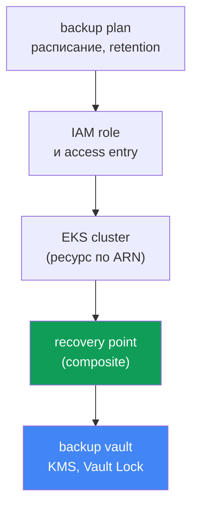
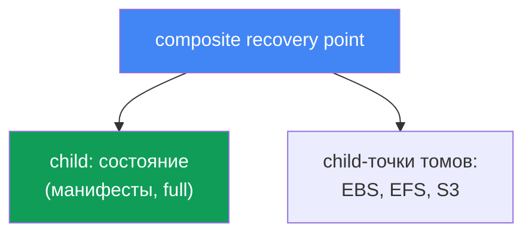
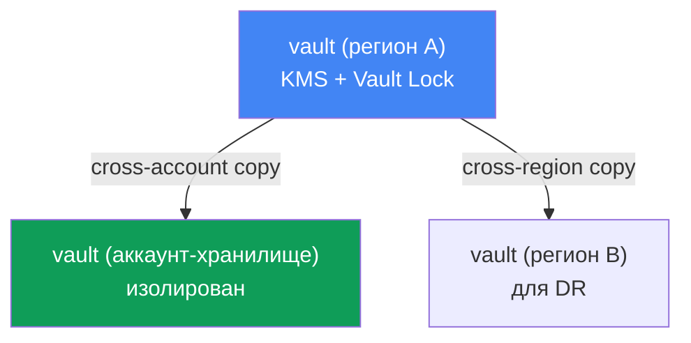

# Глава 41. Бэкап кластера через AWS Backup: состояние кластера, постоянные тома, composite recovery point

> **Что дальше.** Главы 38-40 закрыли жизненный цикл кластера: апгрейд версий, откат в окне
> 7 дней и надёжность нагрузок. Всё это про control plane и доступность, но ни одно из этого
> не спасает от порчи или удаления данных: откат версии (глава 39) возвращает control plane,
> а не удалённый namespace и не затёртый том. Здесь - бэкап и состояния кластера (объекты
> Kubernetes), и данных постоянных томов, причём согласованно, через AWS Backup. Смежное отдано
> другим главам: восстановление, DR и Velero - глава 42; откат версии (это не бэкап) - глава
> 39; EBS-снапшоты и StorageClass - глава 23; EFS - глава 24.

## 41.1. «Кто-то удалил namespace prod»

Сценарий, от которого холодеет спина. Инженер в спешке перепутал контекст kubectl и выполнил
не в том кластере:

```bash
kubectl delete namespace prod
# namespace "prod" deleted
```

За одну команду ушли все Deployment, Service, ConfigMap, Secret и, что хуже, PVC этого
namespace. А вместе с PVC, если у StorageClass стоит `reclaimPolicy: Delete`, EBS-тома с
данными удаляются следом (глава 23). Через минуту в чате инцидент: prod лежит, данных нет.

Первая мысль дежурного - «откатимся». Но откатывать нечего. Откат версии кластера (глава 39)
работает с control plane и его версией, он не хранит и не возвращает объекты Kubernetes и уж
тем более содержимое томов. А etcd, где эти объекты и живут, в EKS управляется AWS: прямого
доступа к нему нет, снять дамп etcd, как на самостоятельном кластере, нельзя. Никакой команды
«верни как было вчера» у managed control plane тоже нет.

Есть ещё коварнее вариант той же боли - не удаление, а тихая порча. Миграция БД прошла криво и
записала мусор в том за PVC; выкатка снесла ConfigMap с рабочей конфигурацией. Кластер зелёный,
поды бегут, но данные и состояние испорчены, и нужно вернуться к состоянию «до релиза».

Отсюда вывод главы. Кластеру нужен настоящий бэкап - и **состояния** (объекты Kubernetes API),
и **данных** постоянных томов, снятых **согласованно**, чтобы манифест PVC и содержимое тома
относились к одному моменту. Иначе от бэкапа мало проку: манифест PVC без данных бесполезен, а
том без манифеста некуда подключить. Разберём, как это делает AWS Backup.

## 41.2. Что такое «бэкап кластера» в EKS: две разные вещи

Первое, что надо развести в голове: «бэкап кластера» - это не один объект, а две принципиально
разные сущности, которые надо снимать вместе.

| Компонент | Что это | Где хранится | Чем бэкапится |
|---|---|---|---|
| Состояние кластера | объекты Kubernetes API: Deployment, ConfigMap, Secret, StatefulSet, StorageClass, PVC-манифесты, RBAC, CRD | etcd (managed AWS) | снимок через Kubernetes API |
| Данные томов | содержимое EBS/EFS/S3 за PVC | тома AWS | снапшоты/бэкапы томов |

**Состояние кластера** - это desired state: манифесты (YAML или JSON), описывающие ресурсы
Kubernetes. Именно они исчезают при `kubectl delete namespace`. Живут они в etcd, а etcd -
часть managed control plane: AWS не даёт к нему прямого доступа. Поэтому состояние бэкапят не
дампом etcd, а **через Kubernetes API** - читают объекты и складывают их в бэкап.

**Данные постоянных томов** - это содержимое EBS-, EFS- или S3-хранилища, к которому под ходит
через PVC. Манифест PVC описывает лишь запрос на том; сами данные лежат в томе AWS и бэкапятся
снапшотами (глава 23) или бэкапом файловой системы (глава 24).

Ключевая мысль: эти две вещи бесполезны порознь. Восстановить манифесты без данных - получить
пустые тома; восстановить тома без манифестов - иметь диски, которые некуда подключить. Нужен
механизм, который снимет и то, и другое как **одну согласованную единицу**. Это и делает
AWS Backup для EKS через composite recovery point (раздел 41.4).

## 41.3. AWS Backup для EKS: план, хранилище, точка восстановления

AWS Backup - централизованный сервис резервного копирования AWS: он бэкапит EBS, EFS, RDS,
DynamoDB, S3 и другие ресурсы по единым правилам. Относительно недавно в этот список добавили и
Amazon EKS: теперь состояние кластера и связанные тома бэкапятся тем же механизмом планов и
хранилищ, что и остальная инфраструктура. Ключевые понятия:

| Понятие | Что задаёт |
|---|---|
| backup plan | расписание бэкапов, retention, переход в cold storage (lifecycle) |
| backup vault | хранилище recovery points; шифрование KMS, Vault Lock для immutability |
| recovery point | конкретная точка восстановления (один снятый бэкап) |
| IAM role | роль, от имени которой AWS Backup читает ресурс и создаёт бэкап |

**backup plan** описывает, что и когда бэкапить: расписание (например, раз в сутки), сколько
хранить (retention) и когда переводить в дешёвый холодный класс хранения (lifecycle,
`MoveToColdStorageAfterDays`/`DeleteAfterDays`). К плану привязывают ресурсы - по типу или по
тегам; для EKS ресурс - сам кластер по его ARN.

**backup vault** - это хранилище, куда складываются recovery points. У vault свой ключ KMS,
которым шифруются бэкапы, и своя политика доступа. Именно на уровне vault включается защита
самих бэкапов от удаления (раздел 41.6).

**recovery point** - результат успешного backup job: одна точка, к которой можно вернуться.
Для EKS она составная, о чём дальше.

Отдельно - **IAM role**. AWS Backup работает не «магически», а от имени сервисной роли. Для
бэкапа EKS, EBS и EFS хватает управляемой политики `AWSBackupServiceRolePolicyForBackup`; при
S3-бакетах за PVC добавляют `AWSBackupServiceRolePolicyForS3Backup`. Важное
условие именно для EKS: у кластера должен быть включён режим авторизации `API` или
`API_AND_CONFIG_MAP` (access entries, глава 5) - тогда AWS Backup сам создаёт себе access entry
и читает объекты через Kubernetes API. Никакого агента или аддона в кластер ставить не нужно.



## 41.4. Composite recovery point

Вот центральное понятие главы. Когда AWS Backup бэкапит EKS-кластер, он создаёт не одну плоскую
точку, а **composite recovery point** - составную точку восстановления, которая группирует под
собой несколько вложенных (nested) точек как одну согласованную единицу:

- **child recovery point состояния кластера** - снимок объектов Kubernetes (манифесты);
- **child recovery points постоянных томов** - бэкапы EBS-, EFS- и S3-хранилищ за PVC,
  поддержанные AWS Backup.

Именно это решает проблему из раздела 41.1: состояние и данные попадают в один бэкап и
восстанавливаются как целое, а не собираются вручную из разрозненных снапшотов.



Механика статусов. На composite заводится родительский backup job, а на каждый child - свой.
Итоговый статус composite бывает `Completed`, `Partial` или `Completed with issues`. `Partial`
означает, что часть вложенных job не завершилась успешно или nested-точку удалили/отвязали;
`Completed with issues` - что часть объектов Kubernetes не удалось прочитать (например, при
недоступности metrics-server отдельные API-группы метрик пропускаются). Восстановить можно те
nested-точки, у которых статус `Completed`.

Отношения внутри composite несимметричны. Child состояния кластера держит связь 1:1 с
родителем: его нельзя скопировать, удалить или отвязать отдельно. Child-точки томов, наоборот,
можно копировать, удалять, отвязывать и восстанавливать по отдельности. Сам composite, пока в
нём есть вложенные точки, удалить нельзя - сначала удаляют или отвязывают nested.

Как включить. Нужно (1) opt-in для Amazon EKS в настройках AWS Backup в регионе
(`update-region-settings`), (2) backup plan с ресурсом-кластером (по ARN или тегу) либо
on-demand job командой `start-backup-job` с `--resource-arn` кластера, и (3) кластер в режиме
авторизации `API`/`API_AND_CONFIG_MAP`. После этого AWS Backup сам разложит бэкап на composite
и вложенные точки.

## 41.5. Что попадает в бэкап, а что нет

Ясная граница покрытия важнее, чем ощущение «у нас есть бэкап». По документации AWS Backup в
бэкап EKS входит и не входит следующее:

| Попадает | Не попадает |
|---|---|
| состояние кластера (манифесты объектов) | образы контейнеров из внешних реестров (ECR, Docker) |
| конфигурация кластера: IAM role, VPC, сеть, логи, шифрование, аддоны, access entries, node groups, Fargate profiles, pod identity | инфраструктура кластера (VPC, подсети сами по себе) |
| EBS-тома за PVC (снапшоты) | автогенерируемые объекты: ноды, служебные поды, events, leases, jobs |
| EFS и S3 за PVC (поддержанные типы) | FSx через CSI; тома in-tree/CSI migration/ACK; EFS с non-root subpath |

Состояние кластера включает не только рабочие манифесты (Secret, ConfigMap, StatefulSet,
DaemonSet, StorageClass, PVC, CRD, RBAC), но и конфигурацию самого кластера: имя, IAM role,
настройки VPC и сети, логирование, шифрование, аддоны, access entries, managed node groups,
Fargate profiles, pod identity associations. Данные томов входят для поддержанных типов: EBS,
EFS и S3 через CSI-драйверы аддонов EKS.

Важные ограничения, которые проверяют заранее (иначе получите `Partial`): тома через in-tree
плагины, CSI migration или ACK-контроллеры не поддерживаются; FSx через CSI - тоже;
EFS с non-root subpath - тоже; для S3 бэкапится бакет целиком, а не отдельный префикс, и только
snapshot-бэкап; cross-account бэкап EFS через EKS Backups не поддерживается. Данные в EFS/FSx
или сторонних системах, не подключённые как поддержанные PV, автоматически не покрываются - их
бэкапят отдельно.

Про согласованность. Снапшоты томов, снятые «на лету» без остановки записи, дают
**crash-consistent** результат - как будто питание выдернули: файловая система цела, но
приложение (например, СУБД) может не досчитаться незакоммиченных данных.
**Application-consistent** бэкап требует, чтобы приложение сбросило буферы и замерло на момент
снимка. AWS Backup снимает тома без остановки нагрузки, поэтому для StatefulSet с базами данных
согласованность на уровне приложения обеспечивают своими средствами: native-дамп БД либо
pre/post-хуки, которые перед снимком сбрасывают буферы и на миг замораживают файловую систему
(fs-freeze) или приостанавливают запись, а после снимка снимают заморозку.

## 41.6. backup vault и защита самих бэкапов

Бэкап, который может удалить тот же, кто удалил namespace, - это ложное чувство безопасности.
Поэтому отдельная задача - защитить сами recovery points. Всё это живёт на уровне backup vault.

**Шифрование KMS.** child-точки состояния кластера шифруются ключом KMS того vault, куда
складываются. Точки томов шифруются по правилам своего типа хранения (снапшоты EBS, бэкапы EFS,
S3). Выбор ключа KMS - часть настройки vault.

**Vault Lock.** Это WORM-режим (write-once, read-many) для vault: он защищает recovery points
от удаления - и случайного, и злонамеренного. Два режима:

| Режим | Кто может снять лок | Когда применяют |
|---|---|---|
| governance mode | пользователи с нужными IAM-правами | защита от случайного удаления, гибкость |
| compliance mode | никто, даже root и AWS, после grace time | жёсткие требования по неизменяемости |

В **governance mode** лок снимают пользователи с достаточными IAM-правами - защита от ошибки
без потери гибкости. В **compliance mode** после grace time лок становится неизменяемым:
ни один пользователь, включая root и AWS, не может удалить бэкапы или изменить их lifecycle,
пока не завершится retention. Мощно, но и опасно: если задать retention «навсегда», удалить
такие бэкапы будет уже нельзя - retention настраивают осознанно.

**Cross-region и cross-account копии.** Composite можно копировать в другой регион и другой
аккаунт (EKS Backups поддерживает все типы копий, кроме отдельных нюансов вроде cross-account
EFS). Это основа DR: если весь регион или аккаунт скомпрометирован, копия бэкапа в отдельном
аккаунте-хранилище с Vault Lock остаётся нетронутой. Для долгого хранения под compliance копию
по lifecycle переводят в cold storage (`MoveToColdStorageAfterDays`) - дёшево, но с минимальным
сроком хранения 90 дней. Восстановление из таких копий и схема DR - тема главы 42.



## 41.7. Velero как второй инструмент

AWS Backup - не единственный способ бэкапить кластер. Velero - Kubernetes-native инструмент,
который складывает бэкап объектов в S3-бакет, умеет бэкапить по namespace или label и снимает
снапшоты томов через CSI. Он живёт внутри кластера и ближе к Kubernetes, тогда как AWS Backup -
внешний сервис AWS с централизованными планами, vault и Vault Lock. Подробно Velero и выбор
между инструментами - в главе 42; здесь достаточно знать, что это второй распространённый путь.

## 41.8. Как это применяют в продакшене

- **Включают opt-in EKS в AWS Backup осознанно.** Проверяют `describe-region-settings`, что
  Amazon EKS включён в нужном регионе, иначе backup job для кластера просто не создастся.
- **Готовят кластер заранее.** Режим авторизации `API` или `API_AND_CONFIG_MAP` (глава 5) и
  роль с `AWSBackupServiceRolePolicyForBackup` - предусловие бэкапа, а не деталь.
- **Держат бэкапы в отдельном vault с Vault Lock.** WORM-режим защищает точки восстановления от
  того же удаления, от которого бэкап и нужен; governance mode - разумный дефолт.
- **Копируют бэкапы в отдельный аккаунт и регион.** cross-account копия в изолированном
  аккаунте-хранилище - страховка на случай компрометации основного (DR, глава 42).
- **Не полагаются на снапшот для баз данных.** Для StatefulSet с СУБД добавляют
  application-consistent приём (дамп, quiesce), потому что снапшот тома crash-consistent.
- **Следят за статусом job.** `Partial` и `Completed with issues` означают неполный бэкап;
  на них подписывают уведомления, а не узнают о дыре во время восстановления.

## 41.9. Мини-глоссарий

- **AWS Backup** - централизованный сервис резервного копирования AWS; бэкапит EKS, EBS, EFS,
  S3 и другие ресурсы по единым планам и хранилищам.
- **backup plan** - план бэкапа: расписание, retention, lifecycle (переход в cold storage) и
  привязка ресурсов.
- **backup vault** - хранилище recovery points с ключом KMS и политикой доступа; на нём
  включается Vault Lock.
- **recovery point** - точка восстановления, результат успешного backup job.
- **composite recovery point** - составная точка для EKS, группирующая состояние кластера и
  бэкапы томов как одну единицу.
- **nested (child) recovery point** - вложенная точка внутри composite: состояние кластера или
  отдельный том.
- **EKS Cluster State** - манифесты объектов Kubernetes (Secret, ConfigMap, StatefulSet, PVC,
  RBAC, CRD и т.п.) плюс конфигурация кластера.
- **Vault Lock** - WORM-защита vault от удаления бэкапов; governance mode (снимается по IAM) и
  compliance mode (неизменяем после grace time).
- **crash-consistent / application-consistent** - снимок без остановки записи против снимка с
  согласованием на уровне приложения.

## 41.10. Итоги главы

- Откат версии кластера (глава 39) не возвращает удалённый namespace, PVC или содержимое тома:
  он про control plane, а не про данные и объекты. etcd в EKS managed и напрямую недоступен.
- «Бэкап кластера» - две разные вещи: состояние (объекты Kubernetes API) и данные постоянных
  томов; их надо снимать согласованно, порознь они бесполезны.
- Состояние бэкапится через Kubernetes API, а не дампом etcd; данные томов - снапшотами и
  бэкапами EBS/EFS/S3.
- AWS Backup для EKS оперирует понятиями backup plan (расписание, retention, lifecycle),
  backup vault (KMS, Vault Lock) и recovery point; работает от IAM role, без агента в кластере.
- composite recovery point группирует child-точку состояния и child-точки томов как одну
  согласованную единицу; состояние и данные восстанавливаются как целое.
- В бэкап входят состояние и конфигурация кластера и поддержанные тома (EBS, EFS, S3); не
  входят образы, инфраструктура VPC, автогенерируемые объекты, FSx и ряд конфигураций томов.
- Снапшоты томов crash-consistent; для баз данных добавляют application-consistent приёмы.
- Vault Lock (governance/compliance) защищает бэкапы от удаления; cross-region и cross-account
  копии - основа DR (глава 42).
- Включение: opt-in EKS в регионе, backup plan или on-demand `start-backup-job` по ARN
  кластера, режим авторизации `API`/`API_AND_CONFIG_MAP`.

## 41.11. Как это пригодится в реальной работе

На дежурстве эта глава - разница между «восстановим за час» и «данные ушли навсегда». Когда
кто-то снёс namespace или релиз испортил данные, откатывать версию бесполезно: нужен бэкап
состояния и томов на нужный момент. Первое, что стоит проверить заранее (а не в момент
инцидента), - есть ли у кластера backup plan, попадает ли он под opt-in EKS в регионе, и когда
был последний успешный composite recovery point со статусом `Completed`, а не `Partial`.

При планировании это добавляет обязательные пункты в устройство любого продакшн-кластера:
включённый opt-in EKS, план с адекватным расписанием и retention, отдельный vault с Vault Lock,
cross-account копии для DR и понимание, какие тома НЕ покрываются (FSx, non-root subpath, S3 с
префиксами) и бэкапятся отдельно. Отдельно проверяют согласованность для баз данных: снапшот
тома сам по себе crash-consistent, и для СУБД этого может не хватить. Само восстановление - как
вернуть данные из этих точек в существующий или новый кластер - разбирается в главе 42.

## 41.12. Вопросы для самопроверки

1. Почему откат версии кластера (глава 39) не возвращает удалённый namespace и данные томов?
2. Почему в EKS нельзя снять бэкап состояния дампом etcd и как его снимают вместо этого?
3. Из каких двух компонентов состоит «бэкап кластера» и почему их снимают согласованно?
4. Что задают backup plan, backup vault и recovery point в AWS Backup?
5. Зачем AWS Backup нужен IAM role и режим авторизации `API`/`API_AND_CONFIG_MAP` у кластера?
6. Что такое composite recovery point и какие вложенные точки он группирует?
7. Что означают статусы composite `Partial` и `Completed with issues`?
8. Что попадает в бэкап EKS, а что не покрывается автоматически?
9. Чем crash-consistent снимок отличается от application-consistent и почему это важно для БД?
10. Что защищает Vault Lock и чем governance mode отличается от compliance mode?
11. Зачем нужны cross-region и cross-account копии бэкапов и как это связано с DR?
12. Как включить бэкап EKS: opt-in, план или on-demand, требования к кластеру?
13. Чем Velero отличается от AWS Backup как инструмент бэкапа кластера?

## Практика

Своей лабы у главы пока нет, но состояние бэкапа видно из AWS CLI. Сначала проверьте opt-in
для Amazon EKS в регионе - без него бэкап кластера не запустится:

```bash
# какие типы ресурсов включены для AWS Backup в регионе (ищите EKS)
aws backup describe-region-settings --region <region>
```

Посмотрите, какие планы и хранилища уже заведены:

```bash
# планы бэкапа: расписание и привязанные ресурсы
aws backup list-backup-plans
# хранилища recovery points
aws backup list-backup-vaults
```

Загляните в конкретный vault и найдите composite recovery points EKS и их статусы:

```bash
# точки восстановления в хранилище (для EKS - composite и вложенные)
aws backup list-recovery-points-by-backup-vault --backup-vault-name <vault>
```

Сопоставьте три вещи: включён ли opt-in EKS, есть ли backup plan с ресурсом-кластером и когда
был последний composite recovery point со статусом `Completed` (а не `Partial`). Если opt-in
выключен или свежих точек нет - у кластера фактически нет бэкапа, и это чинят до инцидента, а
не после. Про восстановление из этих точек, namespace-restore и Velero - глава 42, про
EBS-снапшоты и StorageClass - глава 23, про EFS - глава 24.

---
[Оглавление](../README_RU.md) · [Глава 40](../40/ru.md) · [Глава 42](../42/ru.md)
