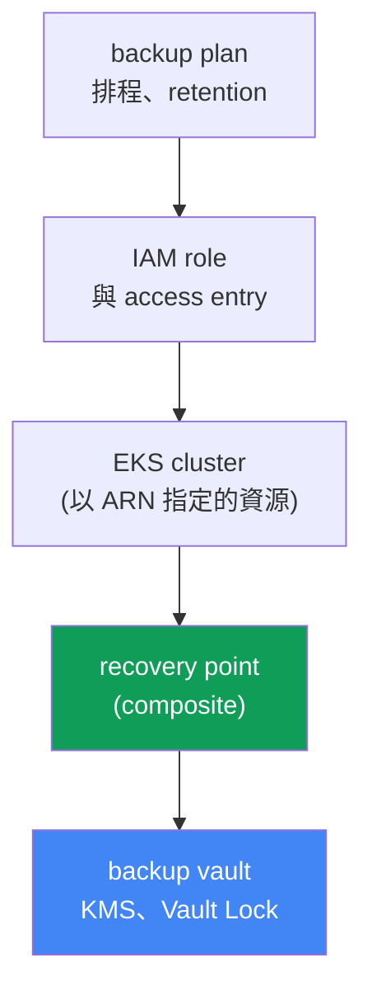
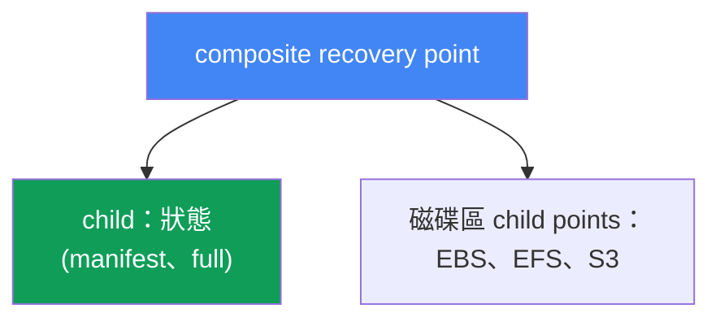
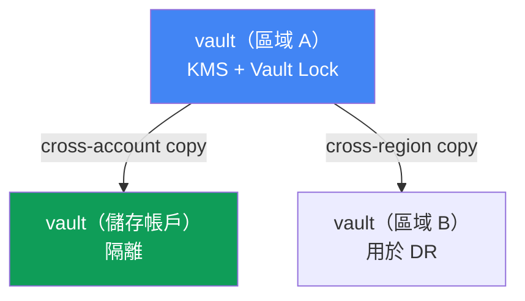

[Русская версия](ru.md) · [Eng version](en.md) · [Versión en español](es.md) · [Version française](fr.md) · [Deutsche Version](de.md) · [ქართული ვერსია](ge.md) · [日本語版](jp.md)
# 第 41 章。透過 AWS Backup 備份叢集：叢集狀態、持久化磁碟區、composite recovery point

> **接下來。** 第 38 至 40 章涵蓋了叢集生命週期：版本升級、7 天視窗內的回滾，以及工作負載可靠性。這些都關乎 control plane 與可用性，但無一能挽救資料損毀或刪除：版本回滾（第 39 章）會還原 control plane，而不會還原被刪除的 namespace 或被覆寫的磁碟區。這裡會透過 AWS Backup 一致地備份叢集**狀態**（Kubernetes 物件）與持久化磁碟區資料。相關主題交由其他章節說明：還原、DR 與 Velero 見第 42 章；版本回滾（它不是備份）見第 39 章；EBS snapshot 與 StorageClass 見第 23 章；EFS 見第 24 章。

## 41.1.「有人刪除了 namespace prod」

這是讓人背脊發涼的情境。工程師在匆忙中弄錯 kubectl context，並在錯誤的叢集執行：

```bash
kubectl delete namespace prod
# namespace "prod" deleted
```

一條指令便移除了該 namespace 的所有 Deployment、Service、ConfigMap、Secret，以及更糟的是 PVC。而當 StorageClass 設為 `reclaimPolicy: Delete` 時，連同 PVC 的 EBS 磁碟區資料也會隨之刪除（第 23 章）。一分鐘後，incident 出現在聊天室：prod 停擺，資料不見了。

值班人員的第一個念頭是「回滾吧」。但沒有任何東西可回滾。叢集版本回滾（第 39 章）處理的是 control plane 及其版本，它不保存也不還原 Kubernetes 物件，更不用說磁碟區內容。儲存這些物件的 etcd 在 EKS 中由 AWS 管理：沒有直接存取權，無法像自管叢集一樣擷取 etcd dump。managed control plane 也沒有「還原到昨天」這類指令。

同一種痛苦還有更陰險的形式：不是刪除，而是無聲的損毀。資料庫 migration 出錯，將垃圾資料寫入 PVC 背後的磁碟區；一次 rollout 刪掉了包含正常設定的 ConfigMap。叢集一切正常、Pod 正在執行，但資料和狀態已損毀，必須回到「發布之前」的狀態。

這就是本章的結論。叢集需要真正的備份，既備份**狀態**（Kubernetes API 物件），也備份持久化磁碟區的**資料**，並且要**一致地**擷取，讓 PVC manifest 和磁碟區內容屬於同一時刻。否則備份用處不大：沒有資料的 PVC manifest 沒有意義，而沒有 manifest 的磁碟區也無處掛載。以下說明 AWS Backup 如何做到這件事。

## 41.2. EKS 中的「叢集備份」是什麼：兩件不同的事

首先要釐清：「叢集備份」不是一個物件，而是必須一起擷取的兩種本質不同實體。

| 元件 | 是什麼 | 儲存位置 | 備份方式 |
|---|---|---|---|
| 叢集狀態 | Kubernetes API 物件：Deployment、ConfigMap、Secret、StatefulSet、StorageClass、PVC manifest、RBAC、CRD | etcd（由 AWS 管理） | 透過 Kubernetes API 擷取 snapshot |
| 磁碟區資料 | PVC 背後的 EBS/EFS/S3 內容 | AWS 磁碟區 | 磁碟區 snapshot/backup |

**叢集狀態**是 desired state：描述 Kubernetes 資源的 manifest（YAML 或 JSON）。它們正是在執行 `kubectl delete namespace` 時消失的東西。它們存在 etcd 中，而 etcd 是 managed control plane 的一部分：AWS 不提供直接存取。因此，狀態不是用 etcd dump 備份，而是**透過 Kubernetes API**備份：讀取物件並放入備份。

**持久化磁碟區資料**是 Pod 透過 PVC 存取的 EBS、EFS 或 S3 儲存體內容。PVC manifest 僅描述對磁碟區的請求；資料本身位於 AWS 磁碟區，以 snapshot（第 23 章）或檔案系統 backup（第 24 章）備份。

關鍵觀念是：這兩者單獨存在都沒有用。還原沒有資料的 manifest，得到的是空磁碟區；還原沒有 manifest 的磁碟區，只會得到無處可掛載的磁碟。需要一個機制將兩者作為**一個一致的單位**擷取。這正是 AWS Backup 為 EKS 透過 composite recovery point 所做的事（第 41.4 節）。

## 41.3. 適用於 EKS 的 AWS Backup：plan、vault、recovery point

AWS Backup 是 AWS 的集中式備份服務：它依統一規則備份 EBS、EFS、RDS、DynamoDB、S3 及其他資源。最近 Amazon EKS 也加入此清單：現在叢集狀態與相關磁碟區可採用與其餘基礎設施相同的 plan 和 vault 機制備份。關鍵概念如下：

| 概念 | 定義內容 |
|---|---|
| backup plan | 備份排程、retention、轉入 cold storage（lifecycle） |
| backup vault | recovery points 的儲存位置；KMS 加密、用於 immutability 的 Vault Lock |
| recovery point | 一個特定還原點（一次擷取的備份） |
| IAM role | AWS Backup 用來讀取資源並建立備份時所假設的角色 |

**backup plan** 定義備份什麼、何時備份：排程（例如每日一次）、保存多久（retention），以及何時轉移至較便宜的 cold storage 類別（lifecycle，`MoveToColdStorageAfterDays`/`DeleteAfterDays`）。資源會依類型或標籤與 plan 關聯；對 EKS 而言，資源是以 ARN 指定的叢集本身。

**backup vault** 是存放 recovery points 的儲存庫。vault 有自己的 KMS key 用於加密備份，也有自己的存取政策。備份本身的防刪除保護正是在 vault 層級啟用（第 41.6 節）。

**recovery point** 是成功 backup job 的結果：可回復到的一個時間點。對 EKS 而言，它是複合的，後文會說明。

還有 **IAM role**。AWS Backup 並非「神奇地」運作，而是代表 service role 執行。備份 EKS、EBS 和 EFS 時，受管政策 `AWSBackupServiceRolePolicyForBackup` 已足夠；若 PVC 背後有 S3 bucket，則額外加入 `AWSBackupServiceRolePolicyForS3Backup`。EKS 特有的重要條件是：叢集必須啟用 `API` 或 `API_AND_CONFIG_MAP` authorization mode（access entries，第 5 章），如此 AWS Backup 會自行建立 access entry，並透過 Kubernetes API 讀取物件。不需要在叢集中安裝 agent 或 addon。



## 41.4. Composite recovery point

這是本章的核心概念。AWS Backup 備份 EKS 叢集時，建立的不是單一平面還原點，而是 **composite recovery point**，也就是將多個巢狀（nested）還原點集中為一個一致單位的複合還原點：

- **叢集狀態 child recovery point**：Kubernetes 物件（manifest）的 snapshot；
- **持久化磁碟區 child recovery points**：AWS Backup 支援之 PVC 背後 EBS、EFS 與 S3 儲存體的 backup。

這正是對第 41.1 節問題的解答：狀態與資料會進入同一份備份，並作為整體還原，而不是從零散的 snapshot 手動拼湊。



狀態機制如下。composite 有一個父 backup job，每個 child 各有自己的 job。composite 的最終狀態可以是 `Completed`、`Partial` 或 `Completed with issues`。`Partial` 表示某些巢狀 job 未成功完成，或 nested point 被刪除/解除關聯；`Completed with issues` 表示某些 Kubernetes 物件無法讀取（例如 metrics-server 無法使用時，個別 metrics API group 會被略過）。只有狀態為 `Completed` 的 nested points 可以還原。

composite 內部的關係並不對稱。叢集狀態 child 與父項維持 1:1 關係：不能單獨複製、刪除或解除關聯。相反地，磁碟區 child points 可以單獨複製、刪除、解除關聯及還原。只要 composite 仍有 nested points，就不能刪除它，必須先刪除或解除關聯 nested points。

如何啟用：(1) 在該區域的 AWS Backup 設定中為 Amazon EKS opt-in（`update-region-settings`），(2) 建立包含叢集資源（依 ARN 或標籤）的 backup plan，或透過以叢集為 `--resource-arn` 的 `start-backup-job` 指令建立 on-demand job，以及 (3) 叢集使用 `API`/`API_AND_CONFIG_MAP` authorization mode。之後 AWS Backup 會自動將備份拆分為 composite 和 nested points。

## 41.5. 備份包含什麼，以及不包含什麼

清楚劃定涵蓋範圍，比「我們有備份」的感覺更重要。根據 AWS Backup 文件，EKS 備份包含及不包含以下內容：

| 包含 | 不包含 |
|---|---|
| 叢集狀態（物件 manifest） | 外部 registry 中的 container image（ECR、Docker） |
| 叢集設定：IAM role、VPC、網路、日誌、加密、addon、access entries、node groups、Fargate profiles、pod identity | 叢集基礎設施（VPC、subnet 本身） |
| PVC 背後的 EBS 磁碟區（snapshot） | 自動產生的物件：node、系統 Pod、event、lease、job |
| PVC 背後的 EFS 和 S3（支援的類型） | 透過 CSI 的 FSx；in-tree/CSI migration/ACK 磁碟區；使用 non-root subpath 的 EFS |

叢集狀態不僅包含工作 manifest（Secret、ConfigMap、StatefulSet、DaemonSet、StorageClass、PVC、CRD、RBAC），還包含叢集本身的設定：名稱、IAM role、VPC 與網路設定、logging、encryption、addon、access entries、managed node groups、Fargate profiles、pod identity associations。受支援的磁碟區類型資料也會包含在內：透過 EKS addon CSI driver 的 EBS、EFS 與 S3。

有些重要限制必須預先檢查（否則會得到 `Partial`）：不支援透過 in-tree plugin、CSI migration 或 ACK controller 的磁碟區；也不支援透過 CSI 的 FSx；也不支援使用 non-root subpath 的 EFS；S3 則是備份整個 bucket 而不是個別 prefix，且僅支援 snapshot backup；EKS Backups 不支援跨帳戶備份 EFS。未作為受支援 PV 連接的 EFS/FSx 或第三方系統中的資料，不會自動受保護，必須另行備份。

關於一致性。在不中斷寫入的情況下「即時」建立磁碟區 snapshot，會產生 **crash-consistent** 結果，彷彿直接拔掉電源：檔案系統完整，但應用程式（例如 DB）可能遺失尚未 commit 的資料。**Application-consistent** backup 則要求應用程式在 snapshot 時清空 buffer 並暫停，通常是使用 DB 本身工具的 dump，或在 snapshot 前凍結檔案系統（fs-freeze）、之後解除凍結。

此處有一個容易誤以為已解決問題的限制：**AWS Backup 沒有 Pod 內 hook**。服務只能依原樣擷取磁碟區，無法在 snapshot 前後於 container 中執行指令：它僅對 Windows EC2 提供 VSS 一致性機制，完全沒有 Pod exec hook。因此 StatefulSet 中 DB 有三種可行方式：將原生 DB dump 存於 S3，與 AWS Backup 並行；建立外部包裝（Amazon Data Lifecycle Manager 對 EBS snapshot 有透過 SSM 的 pre/post script，但那是 instance 層級而非 Pod 層級）；或使用原生提供 backup hook 的 Velero，透過註解 `pre.hook.backup.velero.io/command` 和 `post.hook.backup.velero.io/command` 在擷取 backup 前後於 container 執行指令（第 42 章）。實務上最常採取第一種方式：使用原生 dump 處理 DB 資料，AWS Backup 處理叢集狀態與磁碟區。

## 41.6. backup vault 與備份本身的保護

若能被刪除 namespace 的同一人刪掉，備份只會帶來虛假的安全感。因此，另一個任務是保護 recovery points 本身。這一切都在 backup vault 層級完成。

**KMS encryption。**叢集狀態 child points 以其所存 vault 的 KMS key 加密。磁碟區 points 依各自儲存類型規則加密（EBS snapshot、EFS backup、S3）。選擇 KMS key 是 vault 設定的一部分。

**Vault Lock。**這是 vault 的 WORM（write-once, read-many）模式：它保護 recovery points 不被刪除，無論是意外或惡意刪除。分為兩種模式：

| 模式 | 誰可以解除 lock | 使用時機 |
|---|---|---|
| governance mode | 具有必要 IAM 權限的使用者 | 防止意外刪除，保有彈性 |
| compliance mode | grace time 後無人可解除，包含 root 和 AWS | 嚴格的 immutability 要求 |

在 **governance mode** 中，具備足夠 IAM 權限的使用者可解除 lock，這能防範失誤而不犧牲彈性。在 **compliance mode** 中，grace time 過後 lock 即不可變更：在 retention 結束前，任何使用者，包括 root 與 AWS，都不能刪除 backup 或變更其 lifecycle。它很強大，但也有風險：若設定「永久」retention，之後將無法刪除這些 backup，因此須審慎設定 retention。

**Cross-region 與 cross-account copies。**Composite 可複製到另一區域與另一帳戶（EKS Backups 支援所有 copy 類型，除少數如 cross-account EFS 的細節外）。這是 DR 的基礎：若整個區域或帳戶遭到入侵，使用 Vault Lock 的獨立儲存帳戶中的備份副本仍不受影響。針對 compliance 下的長期保存，可透過 lifecycle 將副本移至 cold storage（`MoveToColdStorageAfterDays`），成本較低，但最短保存期限為 90 天。從這類副本還原及 DR 架構是第 42 章的主題。



## 41.7. Velero 作為第二種工具

AWS Backup 並非備份叢集的唯一方法。Velero 是 Kubernetes-native 工具，它將物件 backup 存入 S3 bucket，可依 namespace 或 label 備份，能透過 CSI 建立磁碟區 snapshot，且不同於 AWS Backup，它會在擷取 backup 前後於 Pod 執行 hook，正是用來解決 DB 一致性問題的功能。它在叢集內運作，更貼近 Kubernetes；AWS Backup 則是具有集中式 plan、vault 與 Vault Lock 的外部 AWS 服務。第 42 章會詳細說明 Velero 和工具選擇；此處只要知道它是第二種常用選項即可。

## 41.8. 在 production 中如何套用

- **有意識地為 AWS Backup 啟用 EKS opt-in。**使用 `describe-region-settings` 確認目標區域的 Amazon EKS 已啟用，否則根本無法建立叢集 backup job。
- **預先準備叢集。**`API` 或 `API_AND_CONFIG_MAP` authorization mode（第 5 章）以及具有 `AWSBackupServiceRolePolicyForBackup` 的 role，是 backup 前提，而非細節。
- **將 backup 保留在啟用 Vault Lock 的獨立 vault。**WORM 模式會保護 recovery points，避免被備份原本要防範的同一種刪除行為影響；governance mode 是合理的預設選擇。
- **將 backup 複製至獨立帳戶與區域。**隔離儲存帳戶中的 cross-account copy，可作為主要帳戶遭入侵時的保險（DR，第 42 章）。
- **不要在沒有額外措施下依賴 AWS Backup 備份 DB。**磁碟區 snapshot 永遠是 crash-consistent，服務也沒有 Pod 內 hook：DB 應設定原生 dump、外部自動化，或採用帶有 backup hook 的 Velero（第 42 章）。
- **監控 job 狀態。**`Partial` 與 `Completed with issues` 表示 backup 不完整；應對它們設定通知，而非在還原時才發現漏洞。

## 41.9. 小型詞彙表

- **AWS Backup**：AWS 的集中式備份服務；依統一的 plan 與 vault 備份 EKS、EBS、EFS、S3 及其他資源。
- **backup plan**：備份計畫：排程、retention、lifecycle（轉入 cold storage）及資源關聯。
- **backup vault**：具有 KMS key 與存取政策的 recovery points 儲存庫；在此啟用 Vault Lock。
- **recovery point**：還原點，成功 backup job 的結果。
- **composite recovery point**：EKS 的複合還原點，將叢集狀態和磁碟區 backup 集中為一個單位。
- **nested (child) recovery point**：composite 中的巢狀點：叢集狀態或個別磁碟區。
- **EKS Cluster State**：Kubernetes 物件 manifest（Secret、ConfigMap、StatefulSet、PVC、RBAC、CRD 等）及叢集設定。
- **Vault Lock**：保護 vault 中 backup 不被刪除的 WORM 機制；governance mode（透過 IAM 可解除）及 compliance mode（grace time 後不可變更）。
- **crash-consistent / application-consistent**：不中斷寫入的 snapshot，對比在應用程式層級協調的 snapshot。AWS Backup 對 EKS 僅提供前者：沒有 Pod 內 hook，後者需以 DB dump、外部包裝或 Velero hook 達成。

## 41.10. 本章重點

- 叢集版本回滾（第 39 章）不會還原已刪除的 namespace、PVC 或磁碟區內容：它關乎 control plane，而非資料與物件。EKS 中的 etcd 由 AWS 管理，不能直接存取。
- 「叢集備份」是兩件不同的事：狀態（Kubernetes API 物件）與持久化磁碟區資料；必須一致地擷取，單獨存在沒有用。
- 狀態是透過 Kubernetes API 備份，而不是 etcd dump；磁碟區資料則以 EBS/EFS/S3 snapshot 與 backup 備份。
- 適用於 EKS 的 AWS Backup 使用 backup plan（排程、retention、lifecycle）、backup vault（KMS、Vault Lock）與 recovery point；它以 IAM role 運作，叢集中不需要 agent。
- composite recovery point 將狀態 child point 與磁碟區 child points 集中為一個一致單位；狀態和資料作為整體還原。
- 備份包含叢集狀態、設定和受支援磁碟區（EBS、EFS、S3）；不包含 image、VPC 基礎設施、自動產生物件、FSx 和部分磁碟區設定。
- 磁碟區 snapshot 是 crash-consistent，AWS Backup 沒有 Pod 內 hook：應用程式層級的 DB 一致性可透過原生 dump、外部包裝或有 hook 的 Velero 達成（第 42 章）。
- Vault Lock（governance/compliance）可防止 backup 被刪除；cross-region 與 cross-account copy 是 DR 的基礎（第 42 章）。
- 啟用方式：在區域中 opt-in EKS，為叢集 ARN 建立 backup plan 或 on-demand `start-backup-job`，並使用 `API`/`API_AND_CONFIG_MAP` authorization mode。

## 41.11. 如何在實際工作中運用

值班時，本章決定了「一小時內還原」與「資料永遠消失」之間的差異。當有人刪掉 namespace 或某次發布損毀資料時，回滾版本毫無用處：你需要恰當時間點的狀態與磁碟區 backup。第一件應預先檢查的事（而非 incident 發生時）是：叢集是否有 backup plan、是否屬於該區域的 EKS opt-in 範圍，以及最近一次 composite recovery point 是否成功且狀態為 `Completed`，而不是 `Partial`。

規劃時，這會為任何 production 叢集架構新增必要項目：已啟用的 EKS opt-in、具合理排程與 retention 的 plan、啟用 Vault Lock 的獨立 vault、用於 DR 的 cross-account copy，以及清楚理解哪些磁碟區**不受涵蓋**（FSx、non-root subpath、帶有 prefix 的 S3）並需分開備份。DB 的一致性需特別檢查：磁碟區 snapshot 本身是 crash-consistent，對 DB 可能不足夠。如何從這些 points 還原資料至既有或新叢集，請見第 42 章。

## 41.12. 自我檢查問題

1. 為何叢集版本回滾（第 39 章）無法還原被刪除的 namespace 與磁碟區資料？
2. 為何 EKS 中無法用 etcd dump 備份狀態，以及改以何種方式擷取？
3. 「叢集備份」由哪兩個元件構成，為何必須一致地擷取？
4. AWS Backup 中的 backup plan、backup vault 與 recovery point 分別定義什麼？
5. 為何 AWS Backup 需要 IAM role，以及叢集的 `API`/`API_AND_CONFIG_MAP` authorization mode？
6. 什麼是 composite recovery point，它集中哪些 nested points？
7. composite 的 `Partial` 與 `Completed with issues` 狀態代表什麼？
8. EKS backup 包含什麼，又有哪些內容不會自動受到保護？
9. crash-consistent snapshot 與 application-consistent snapshot 有何差異，為何對 DB 很重要？
10. Vault Lock 保護什麼，governance mode 與 compliance mode 有何不同？
11. 為何需要 backup 的 cross-region 與 cross-account copy，它與 DR 有何關係？
12. 如何啟用 EKS backup：opt-in、plan 或 on-demand，以及叢集要求是什麼？
13. Velero 作為叢集 backup 工具，與 AWS Backup 有何不同？
14. 為何不能僅靠 AWS Backup 取得 DB 的 application-consistent backup，有哪些可行方法？

## 實作練習

本課程對應的 lab：[lab 122 - 適用於 EKS 的 AWS Backup](../../labs/122/README_TW.MD)。其中會啟用 opt-in，為具有 gp3 磁碟區的叢集建立 on-demand backup，分析 composite recovery point（parent、巢狀 EKS 與 EBS points），並進行 namespace restore；以 `check_result` 指令驗證。啟動方式：`TASK=122 make run_eks_task`。

EBS 磁碟區 backup 亦於 [lab 129 - Mountpoint for S3：檔案語意在哪裡失效，以及為何沒有 backup](../../labs/129/README_TW.MD) 討論，該 lab 說明為何 S3 磁碟區沒有 snapshot，以及與本章 EBS 磁碟區不同，什麼機制能保護其中資料。

除 lab 外，也可以透過 AWS CLI 檢視 backup 狀態。先檢查區域中 Amazon EKS 的 opt-in，未啟用時不會開始叢集 backup：

```bash
# 該區域哪些資源類型已啟用 AWS Backup（尋找 EKS）
aws backup describe-region-settings --region <region>
```

查看已建立的 plan 和 vault：

```bash
# backup plan：排程與已關聯的資源
aws backup list-backup-plans
# recovery points 的 vault
aws backup list-backup-vaults
```

查看特定 vault，尋找 EKS composite recovery points 及其狀態：

```bash
# vault 中的 recovery points（EKS 為 composite 和巢狀 points）
aws backup list-recovery-points-by-backup-vault --backup-vault-name <vault>
```

對照三件事：EKS opt-in 是否已啟用、是否有包含叢集資源的 backup plan，以及最近的 composite recovery point 是否為 `Completed`（而非 `Partial`）。若 opt-in 未啟用或沒有近期 point，該叢集實際上沒有 backup，必須在 incident 前而不是之後修正。如何從這些 points 還原、namespace restore 與 Velero 請見第 42 章；EBS snapshot 與 StorageClass 請見第 23 章；EFS 請見第 24 章。

---
[目錄](../README_TW.md) · [第 40 章](../40/tw.md) · [第 42 章](../42/tw.md)
