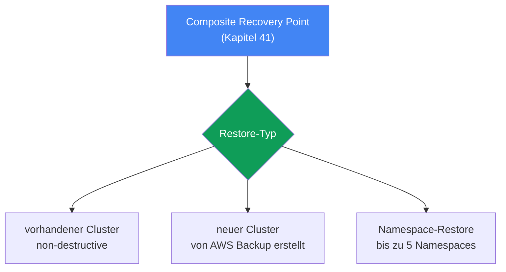
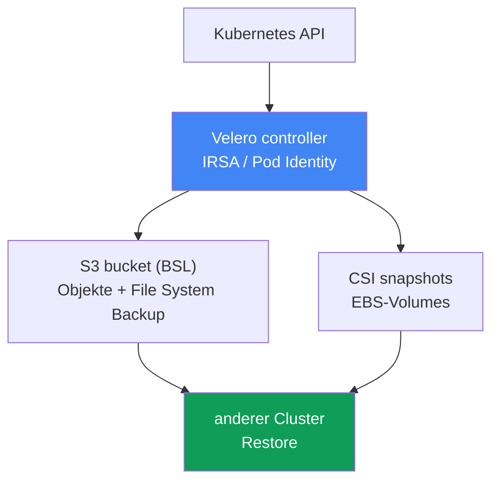

[Русская версия](ru.md) · [Eng version](en.md) · [Versión en español](es.md) · [Version française](fr.md) · [ქართული ვერსია](ge.md) · [繁體中文版](tw.md) · [日本語版](jp.md)
# Kapitel 42. Wiederherstellung und DR: Restore in einen vorhandenen und neuen Cluster, Namespace-Restore, Velero

> **Wie es weitergeht.** Kapitel 41 behandelte das Backup: AWS Backup, den Composite Recovery Point, den Cluster-Zustand und Volumes in einem konsistenten Zeitpunkt. Ein Backup ist jedoch nur die halbe Arbeit: Ein nicht überprüftes Backup ist kein Backup. Hier geht es darum, von diesem Punkt zurückzukehren: Restore in einen vorhandenen und einen neuen Cluster, gezielte Wiederherstellung eines Namespace, Velero als zweites Werkzeug sowie RTO/RPO und DR-Strategien. Verwandte Themen behandeln andere Kapitel: das Backup selbst und der Composite Recovery Point in Kapitel 41; die Bindung von EBS-Volumes an eine AZ in Kapitel 23; Multi-Cluster- und Multi-Account-Konnektivität für DR in Kapitel 32; das Rollback einer Cluster-Version (das ist kein Daten-Restore) in Kapitel 39.

## 42.1. Das Backup ist vorhanden, aber niemand hat versucht, daraus wiederherzustellen

Kehren wir zum Incident aus Kapitel 41 zurück: Jemand hat `kubectl delete namespace prod` im falschen Cluster ausgeführt. Diesmal gibt es gute Nachrichten: Der Cluster hat einen backup plan, und der gestrige Composite Recovery Point ist vorhanden, mit dem Status `Completed`. Der Bereitschaftsdienst öffnet die AWS-Backup-Konsole, findet den Punkt und stößt auf Fragen, die niemand vorher beantwortet hat:

- Den gesamten Cluster oder nur den Namespace `prod` wiederherstellen?
- In denselben Cluster zurückspielen (er läuft, die anderen Namespaces funktionieren) oder in einen neuen?
- Überschreibt der Restore, was sich derzeit im Cluster befindet?
- In welcher AZ werden Volumes aus Snapshots hochgefahren, und gibt es dort Nodes?
- Wie lange dauert es, Minuten oder Stunden, und erfüllt es die dem Business zugesagte Zeit?

Genau das ist das Problem dieses Kapitels. Ein Backup ohne geübten Restore ist eine Illusion von Schutz. Der erste echte Restore geschieht fast immer im Notfall, unter Druck, wenn keine Zeit bleibt, Dokumentation zu lesen. Noch schlimmer: Die Szenarien unterscheiden sich. Ein Namespace wurde gelöscht: Es wird eine gezielte Wiederherstellung in einen laufenden Cluster benötigt. Der gesamte Cluster ging verloren, die Region fiel aus oder Ransomware verschlüsselte die Daten: Es wird ein Restore in einen neuen Cluster benötigt, möglicherweise in einer anderen Region oder einem anderen Account. Das sind unterschiedliche Vorgänge mit unterschiedlicher Dauer und unterschiedlichen Fallen, und beide müssen vor einem Incident verstanden werden, nicht währenddessen.

Daraus ergibt sich der Plan des Kapitels: zuerst Restore mit AWS Backup (vorhandener Cluster, neuer Cluster, cross-region und cross-account), dann gezielter Namespace-Restore, danach Velero und die Wahl zwischen den Werkzeugen und zum Schluss DR-Konzepte, RTO/RPO und typische Restore-Fallen.

## 42.2. Restore mit AWS Backup: drei Szenarien

AWS Backup stellt einen Composite Recovery Point (Kapitel 41) wieder her: sowohl den Cluster-Zustand (Kubernetes-Objekte) als auch die zugehörigen Volumes. Die zentrale Regel lautet: **Ein Restore erfolgt immer in einen target EKS cluster**, also in einen vorhandenen Cluster. Eine Wiederherstellung „ins Nichts“ ist nicht möglich: Entweder existiert der Cluster bereits, oder AWS Backup erstellt ihn im Rahmen des Restore selbst. Daraus ergeben sich drei Szenarien:

| Szenario | Ziel | Wann es verwendet wird |
|---|---|---|
| Existing cluster restore | der Quellcluster oder ein anderer vorhandener Cluster | gezielte Wiederherstellung, Cluster läuft |
| New cluster restore | AWS Backup erstellt einen neuen Cluster und stellt darin wieder her | Katastrophe, Verlust von Cluster/Region |
| Namespace restore | ein vorhandener Cluster, bis zu 5 Namespaces | Namespace gelöscht, teilweiser Verlust |

Eine wichtige Eigenschaft aller AWS-Backup-Restores ist, dass sie **non-destructive** sind. Ein Restore überschreibt keine vorhandenen Kubernetes-Objekte im Zielcluster und ändert dessen Version nicht. Existiert ein Objekt bereits, wird es übersprungen statt überschrieben. Übersprungene Objekte werden über SNS-Benachrichtigungen sichtbar, die im Voraus abonniert werden sollten. Das schützt einen laufenden Cluster vor Schäden, bedeutet aber auch, dass ein Restore über einem beschädigten Objekt dieses nicht „repariert“, wie im Abschnitt zu den Fallen behandelt wird.

**Restore in einen vorhandenen Cluster** dient der gezielten Wiederherstellung, wenn der Cluster läuft, aber einige Daten oder Objekte fehlen. Voraussetzung: Die benötigten CSI-Treiber müssen im Zielcluster bereits installiert sein (EBS/EFS/S3 über Add-ons, Kapitel 23), andernfalls gibt es keinen Ort, an dem die Volumes eingehängt werden können.

**Restore in einen neuen Cluster** ist für eine Katastrophe vorgesehen. AWS Backup erstellt den Cluster selbst, allerdings mit einem begrenzten Satz an Optionen: Name, Kubernetes-Version, VPC/Subnetze, IAM role, security groups, node groups, Fargate profiles und pod identity associations. Für vollständige Kontrolle wird der Cluster im Voraus erstellt (Konsole/eksctl/Terraform) und als Ziel angegeben. Beim Erstellen eines neuen Clusters fügt AWS Backup nach der Bereitschaft des Clusters einen Puffer von etwa 15 Minuten hinzu, bevor Ressourcen erstellt werden, damit Komponenten Zeit zur Initialisierung haben.



**Cross-region- und cross-account-Restore.** Kopien eines Recovery Point in einer anderen Region und einem anderen Account (Kapitel 41) bilden die Grundlage für die Wiederherstellung bei Verlust der primären Region oder Kompromittierung des Accounts. Ein Restore aus einer Kopie funktioniert gleich, bringt jedoch zusätzliche Anforderungen mit sich: War der Quellcluster verschlüsselt, wird `encryptionConfigProviderKeyArn` mit einem KMS-Schlüssel des Ziels benötigt (ein eigener Schlüssel für cross-region/cross-account); außerdem müssen IAM-Rollen, auf die Workloads verwiesen haben (IRSA, Pod Identity, OIDC-Provider), im Ziel-Account und in der Zielregion existieren. Diese Rollen erstellt AWS Backup nicht. Zur Zuordnung von ARN siehe Abschnitt 42.8.

Der Restore wird mit `aws backup start-restore-job` und EKS-Metadaten gestartet: `clusterName` ist erforderlich; für einen neuen Cluster sind `newCluster=true` und verschachtelte Felder erforderlich (`eksClusterVersion`, `clusterRole`, `clusterVpcConfig`, `nodeGroups`, `fargateProfiles`, `podIdentityAssociations`). Die Berechtigungen liefert die verwaltete Richtlinie `AWSBackupServiceRolePolicyForRestores`, für S3-Buckets `AWSBackupServiceRolePolicyForS3Restore`.

## 42.3. Gezielte (selective) Wiederherstellung eines Namespace

Ein vollständiger DR-Restore ist ein schwergewichtiger Vorgang: Der ganze Cluster muss hochgefahren werden, wenn er nicht mehr existiert. Weitaus häufiger ist ein kleinerer Fall: Ein einzelner Namespace wurde gelöscht oder beschädigt, während der Rest des Clusters funktioniert. Hier einen vollständigen Restore durchzuführen, ist nachteilig, langsam und riskant. Dafür gibt es den Namespace-Restore.

Der Namespace-Restore spielt in einen vorhandenen Cluster nur die angegebenen Namespaces (bis zu 5 gleichzeitig), ihre namespace-scoped Ressourcen und die zugehörigen persistenten Volumes ein. Cluster-scoped Ressourcen (CRD, StorageClass, das Namespace-Objekt selbst, PersistentVolume) werden dabei ausgeschlossen, mit Ausnahme von PVs, die mit wiederhergestellten Volumes verbunden sind. Es gilt dieselbe non-destructive-Logik: Was bereits im Cluster vorhanden ist, wird nicht überschrieben.

Der wesentliche Unterschied zum vollständigen DR-Restore:

| | Namespace-Restore | Full/new cluster restore |
|---|---|---|
| Ziel | einen Teil in einen laufenden Cluster zurückbringen | Cluster neu aufbauen |
| Was wiederhergestellt wird | bis zu 5 Namespaces + ihre Volumes | gesamter Zustand + alle Volumes |
| Cluster-scoped Ressourcen | ausgeschlossen (außer zugehörigen PVs) | werden wiederhergestellt |
| Typischer Auslöser | Namespace prod wurde gelöscht | Verlust von Cluster/Region |
| RTO | Minuten bis einige zehn Minuten | Stunden |

Praktisch bedeutet das: Der Namespace-Restore ist das reguläre Werkzeug für Operatoren im Alltag, ein DR-Restore in einen neuen Cluster ist ein seltenes, schwergewichtiges Ereignis. Beide werden getestet, aber unterschiedlich (Abschnitt 42.8).

## 42.4. Reihenfolge der Wiederherstellung von Objekten

Beim Restore ist die Reihenfolge der Objekterstellung wichtig: PVC müssen vor Pods erstellt werden, CRD vor Custom-Ressourcen, der Namespace vor seinem Inhalt. AWS Backup verwendet standardmäßig eine sinnvolle Reihenfolge: zuerst cluster-scoped Ressourcen (CustomResourceDefinitions, Namespaces, StorageClasses, PersistentVolumes), danach namespace-scoped Ressourcen (PersistentVolumeClaims, Secrets, ConfigMaps, ServiceAccounts, LimitRanges, Pods, ReplicaSets). Bei Bedarf lässt sich diese Reihenfolge über `kubernetesRestoreOrder` überschreiben (Format `group/version/kind` oder `version/kind`).

Nach der Wiederherstellung der Objekte erfolgt die Bindung des Speichers. Für einen EBS-Snapshot muss eine Availability Zone angegeben werden, in der das Volume erstellt wird; AWS Backup versucht, den Pod in derselben AZ hochzufahren, damit das Volume eingehängt werden kann (Zusammenhang mit Kapitel 23). EFS wird unter einem zufälligen Präfix wiederhergestellt und erfordert nach dem Restore die manuelle Erstellung eines access point. AWS Backup erstellt ihn nicht selbst.

## 42.5. Velero: Kubernetes-native Sicherung und Wiederherstellung

Velero ist ein Open-Source-Werkzeug für Backup und Wiederherstellung, das im Cluster lebt. Anders als AWS Backup (ein externer AWS-Service) arbeitet Velero über die Kubernetes API und ist näher am Cluster selbst. Seine Stärke ist die Portabilität: Es kann in **einen anderen** Cluster wiederherstellen und ist daher sowohl ein Migrations- als auch ein DR-Werkzeug.

Die Integration in AWS stellt das offizielle Plugin velero-plugin-for-aws bereit: Es fügt ein object store plugin für S3 (BSL) und ein volume snapshotter plugin für EBS-Snapshots hinzu. Das Plugin wird bei `velero install` mit dem Flag `--plugins velero/velero-plugin-for-aws:<version>` angegeben. So funktioniert es:

- **Backup von Objekten.** Velero liest Objekte über die Kubernetes API und legt sie als Tarball im Object Storage ab, also im S3-Bucket, der über BackupStorageLocation (BSL) angegeben ist.
- **Volume-Snapshots.** Daten von PV werden entweder über CSI volume snapshots (EBS-Snapshot mittels Treiber) oder über File System Backup gesichert (dateiweise Kopie des Volume-Inhalts in denselben Bucket, funktioniert auch zwischen Providern).
- **Selektoren.** Ein Backup wird nach Namespace (`--include-namespaces`) oder Label (`--selector`) eingeschränkt. Das ermöglicht eine feine, gezielte Abdeckung bis hin zu einzelnen Workloads.
- **Zeitpläne.** Das Objekt Schedule (`velero schedule create --schedule="0 2 * * *"`) erstellt ein Backup per cron; die Häufigkeit des Zeitplans bestimmt direkt den RPO (Abschnitt 42.7).
- **Backup hooks.** Über die Annotationen `pre.hook.backup.velero.io/command` und `post.hook.backup.velero.io/command` führt Velero vor und nach dem Backup einen Befehl im Container aus: Datenbankpuffer leeren, das Dateisystem einfrieren und wieder freigeben. Das gibt es bei AWS Backup nicht (Kapitel 41) und ist das wichtigste Argument für Velero bei StatefulSet mit Datenbanken. Der Befehl wird nicht in einer Shell ausgeführt, daher wird er als Argumentliste und nicht als Zeichenkette mit Pipes geschrieben.
- **Restore hooks.** Beim Restore kann Velero init-Container und exec-Hooks in Pods ausführen, etwa um auf die Bereitschaft eines Volumes zu warten oder den Zustand vor dem Start einer Anwendung aufzuwärmen.
- **Restore in einen anderen Cluster.** `velero restore create --from-backup <name>`, im Zielcluster mit derselben BSL ausgeführt, stellt Workloads aus dem Backup wieder her. Das ist die Grundlage für Migration und DR.

Velero erhält AWS-Zugriff nicht über statische Schlüssel, sondern über **IRSA oder EKS Pod Identity** (Kapitel 16-17): Der ServiceAccount des Velero-Controllers wird mit einer IAM-Rolle verbunden, die Berechtigungen für den S3-Bucket (BSL) und für EBS-Snapshots besitzt. Das ist dasselbe Least-Privilege-Prinzip wie für jeden Controller im Cluster.

**S3 Object Lock für Velero-Backups.** Velero-Backups liegen in einem S3-Bucket, und dieselbe IAM-Rolle, die sie schreibt, kann sie standardmäßig auch löschen: Bei Kompromittierung des Clusters oder Ransomware werden Backups zuerst gelöscht oder verschlüsselt. Der Schutz des Buckets liegt hier vollständig in Ihrer Verantwortung; ein verwaltetes Vault Lock wie bei AWS Backup gibt es nicht. Die Antwort ist S3 Object Lock (WORM): Auf dem Bucket aktiviert (Versioning ist erforderlich), macht es im Compliance-Modus Objektversionen für die Dauer der Retention unveränderlich, und selbst root kann sie nicht löschen. So übersteht ein Backup sowohl ein irrtümliches `velero backup delete` als auch einen Angreifer mit Berechtigungen für den Bucket.

Zwei Nuancen täuschen Erwartungen. Erstens schützt Object Lock **Objektversionen**, verbietet jedoch nicht, einen delete marker darüber zu setzen. Ein einfaches `DELETE` ohne version id beantwortet S3 mit `200 OK`; die geschützte Version bleibt bestehen, ist aber nicht mehr aktuell und erscheint nicht mehr in der Auflistung des Backup-Buckets, sodass sie für Velero verschwunden ist. WORM bietet also Wiederherstellbarkeit (der delete marker kann entfernt werden, die Versionen sind intakt), nicht die Garantie, dass ein Backup sichtbar ist: Das Vorhandensein von Wiederherstellungspunkten muss weiterhin überwacht werden. Zweitens wird die Sperrfrist auf die TTL des Zeitplans abgestimmt, und zwar richtig herum: Die TTL darf nicht kürzer sein als Object Lock. Ein abgelaufenes Backup löscht Velero mit demselben einfachen `DELETE`, deshalb tritt kein `AccessDenied` auf. Bei einer kürzeren TTL als der Sperrfrist gilt das Backup als gelöscht, während seine Versionen bis zum Ende der Retention liegen bleiben und Kosten verursachen; auch eine Lifecycle-Regel entfernt sie nicht. Der Fehler `AccessDenied` (403) trifft etwas anderes: Wer eine Version gezielt mit version id löscht, etwa bei manueller Bucket-Bereinigung, Batch Operations oder einem Skript zur Notfall-Freigabe von Speicherplatz.



## 42.6. Velero oder AWS Backup

Die Werkzeuge schließen sich nicht gegenseitig aus, betrachten die Aufgaben jedoch aus unterschiedlichen Perspektiven. Eine Orientierung für die Auswahl:

| Kriterium | AWS Backup | Velero |
|---|---|---|
| Art | verwalteter AWS-Service | k8s-native, wird im Cluster installiert |
| Einheit | Composite Recovery Point | Backup (Objekte + Volumes) |
| Richtlinien/Schutz | backup plan, vault, Vault Lock (WORM) | Retention von Schedule; Schutz des Buckets ist S3 Object Lock (WORM), Ihre Verantwortung |
| Portabilität | innerhalb von AWS (cross-region/account) | zwischen Clustern, Distributionen und Clouds |
| Selective | Namespace-Restore (bis zu 5) | fein granular: Namespace, Label, Ressourcen |
| Migration | kein Schwerpunkt | Schwerpunkt-Szenario |

Kurz gesagt: **AWS Backup** wird verwendet, wenn ein verwaltetes Backup mit zentralisierten Richtlinien, Composite-Punkten und Unveränderlichkeit (Vault Lock) innerhalb von AWS benötigt wird. **Velero** wird verwendet, wenn Portabilität und Migration zwischen Clustern und Clouds, feine Auswahl und Kubernetes-native Backup-Verwaltung benötigt werden. Viele Teams betreiben beide: AWS Backup als Richtlinie und DR innerhalb von AWS, Velero für Migrationen und granulare Wiederherstellungen.

## 42.7. DR-Konzepte: RTO, RPO und Strategien

Jede Diskussion über Restore führt zu zwei Metriken:

- **RTO (recovery time objective)**: Die Zeit, nach der ein Service nach einem Ausfall wieder verfügbar sein muss.
- **RPO (recovery point objective)**: Die Menge an Daten, die verloren gehen darf, also der Zeitpunkt in der Vergangenheit, auf den zurückgegangen wird. **Der RPO wird direkt durch die Backup-Häufigkeit festgelegt**: ein Backup pro Tag bedeutet RPO bis zu einem Tag; ein stündlicher Velero-Zeitplan bedeutet einen RPO von etwa einer Stunde.

AWS unterscheidet vier DR-Strategien mit steigenden Kosten und sinkendem RTO/RPO (Well-Architected):

| Strategie | RPO / RTO | Grundidee |
|---|---|---|
| Backup and restore | RPO Stunden, RTO bis zu einem Tag | Backup in einer anderen Region, Restore bei Eintritt des Ausfalls |
| Pilot light | RPO Minuten, RTO einige zehn Minuten | Daten werden repliziert, der Kern ist ausgeschaltet und wird bei Ausfall eingeschaltet |
| Warm standby | geringer | eine verkleinerte Kopie läuft immer und wird bei Ausfall skaliert |
| Multi-site active-active | nahezu null | vollständiger Betrieb in mehreren Regionen gleichzeitig |

Für einen typischen EKS-Cluster ist die Wiederherstellung aus AWS Backup oder Velero die Strategie **backup and restore**: kostengünstig, aber der RTO wird in Stunden gemessen (Cluster hochfahren, Zustand und Volumes wiederherstellen, Load Balancer und DNS neu erstellen). Der Weg zu pilot light und darüber hinaus bedeutet bereits einen fertigen Reservecluster und Datenreplikation in eine andere Region (Konnektivität in Kapitel 32), was teurer ist. Die Wahl der Strategie ist ein bewusster Kompromiss zwischen RTO/RPO und Kosten, nicht „wir machen es zuverlässiger“.

## 42.8. Restore-Fallen

Ein Restore scheitert nicht am Backup, sondern an Details der Umgebung. Folgendes wird vorher geprüft:

- **Bindung von PV an eine AZ.** Ein Volume wird aus einem Snapshot in einer bestimmten AZ wiederhergestellt, und der Pod muss sich in derselben AZ befinden, andernfalls kann das Volume nicht eingehängt werden (Kapitel 23). Für neue PVC helfen `volumeBindingMode: WaitForFirstConsumer` und topology-aware provisioning; bei einem Restore aus einem Snapshot ist die AZ durch den Snapshot festgelegt, und in der Ziel-AZ müssen Nodes existieren.
- **Starre `nodeSelector`, affinity und taints.** Wiederhergestellte Manifeste enthalten Anforderungen an Nodes des Quellclusters, während der Pool im Zielcluster anders aufgebaut ist: andere Pool-Labels, kein benötigter Instanztyp, eigene taints. Die Pods werden erstellt und bleiben dauerhaft in `Pending` mit `node(s) didn't match Pod's node affinity/selector` oder `node(s) had untolerated taint`. Entscheidend: Der Scheduler vergleicht **Labels**, nicht Namen von node group oder NodePool. Der DR-Cluster wird daher nach Labels vorbereitet, nicht durch Umbenennen von Pools. Schlüssel und Werte, nach denen ein Workload seine Node auswählt, müssen übereinstimmen (`karpenter.sh/nodepool`, `karpenter.sh/capacity-type`, `kubernetes.io/arch`, Labels mit dem Präfix `eks.amazonaws.com` bei managed node groups). Derselbe Effekt entsteht durch `topologySpreadConstraints` mit `whenUnsatisfiable: DoNotSchedule`, wenn der Zielcluster weniger Zonen besitzt. In Velero lässt sich das beim Restore korrigieren: Resource Modifiers sind ein ConfigMap mit JSON-Patches, angebunden mit dem Flag `--resource-modifier-configmap`, in dem ein `remove`-Vorgang `nodeSelector` entfernt oder ein Label ersetzt (Bedingungen in Regeln werden mit dem **QUELL**-Namespace geschrieben, selbst wenn der Restore mit `--namespace-mappings` erfolgt). AWS Backup bietet keine Mutation von Manifesten: Labels im Zielcluster werden im Voraus an die Quelle angepasst oder Objekte nach dem Restore korrigiert.
- **Non-destructive und ein laufender Cluster.** Ein Restore überschreibt keine vorhandenen Objekte. Ist ein Objekt beschädigt, aber vorhanden, überspringt der Restore es: Für eine Rückkehr zu einer „guten“ Version wird das Objekt zuerst gelöscht und dann wiederhergestellt. Unveränderliche Felder (beispielsweise der selector eines Deployment, Teile der Felder von Service) führen bei Konflikten ebenfalls zum Überspringen, nicht zum Überschreiben.
- **Zuordnung von IRSA/Pod Identity und ARN.** Bei einem Restore in einen anderen Account oder eine andere Region existieren IRSA-Rollen, der OIDC-Provider und Pod Identity associations aus dem Quell-Account dort nicht. Ein SA mit Annotation auf den alten Rollen-ARN funktioniert nicht, bis die Rollen im Ziel-Account erneut erstellt wurden.
- **Load Balancer und DNS.** NLB/ALB und Route-53-Einträge sind an die Quellumgebung gebunden. Nach dem Restore erstellt der AWS Load Balancer Controller die Load Balancer erneut (Kapitel 26-28), und external-dns sowie cert-manager DNS und Zertifikate (Kapitel 29); Adressen und ARN ändern sich und müssen im Plan berücksichtigt werden.
- **Reihenfolge und Versionen.** Zuerst Namespace und CRD, dann StorageClass und PV, danach Workloads (Abschnitt 42.4). API-Versionen der Objekte müssen vom Zielcluster unterstützt werden: Ein Restore zwischen stark unterschiedlichen Kubernetes-Versionen ist best effort, Inkompatibilitäten sind möglich.
- **Images und Registries.** Ein Backup speichert keine Container-Images (Kapitel 41). Der Ziel-Account bzw. die Zielregion muss Zugriff auf ECR oder die Registry besitzen, aus der Images geladen werden, andernfalls starten die Pods nicht.

Und die wichtigste Regel: Restores werden regelmäßig getestet, nicht erst beim Incident. Einmal pro Quartal wird ein game day durchgeführt: Ein Recovery Point (oder Velero-Backup) wird in einem separaten Namespace oder temporären Cluster wiederhergestellt und der tatsächliche RTO gemessen. Ein in einem game day überprüfter Restore ist der einzige, auf den man sich im Incident verlassen kann.

## 42.9. Game day: Übung eines Regionalausfalls (region failover)

Die DR-Strategien (Abschnitt 42.7) und die game-day-Praxis wurden getrennt beschrieben. Führen wir sie in einem konkreten Szenario zusammen: vollständiger Ausfall der primären Region. Es ist ein schwergewichtiger Restore in einen neuen Cluster (Abschnitt 42.2) aus einer cross-region-Kopie (Kapitel 41), mit Verkehrsumschaltung über DNS. Er wird als Übung Schritt für Schritt durchgeführt, wobei tatsächlicher RTO/RPO gemessen wird:

1. **Failover ausrufen.** Die primäre Region ist nicht erreichbar; es wird in die vorab ausgewählte Reserve-Region gewechselt, in der cross-region-Kopien des Recovery Point liegen (Kapitel 41).
2. **Cluster hochfahren.** Entweder ist ein warm standby / blue-green-Cluster bereits bereit, oder ein neuer wird erstellt (eksctl/Terraform). Voraussetzungen sind, dass IAM-Rollen für IRSA/Pod Identity, der OIDC-Provider und Zugriff auf ECR in der Reserve-Region vorher erstellt werden (Abschnitt 42.8).
3. **Zustand und Volumes wiederherstellen.** `aws backup start-restore-job` aus der cross-region-Kopie mit dem KMS-Schlüssel des Ziels (Abschnitt 42.2) oder `velero restore create` aus S3 im Zielcluster.
4. **Konnektivität prüfen.** Multi-Region-Netzwerk und Zugriff auf Daten und Abhängigkeiten in der Reserve-Region werden gemäß Kapitel 32 geprüft.
5. **Daten prüfen.** Vor der Verkehrsumschaltung wird sichergestellt, dass die Volumes eingehängt sind und die Daten intakt sind: Smoke-Test der Anwendung und Abgleich mit dem Zeitpunkt der wiederhergestellten Kopie (RPO), nicht nur „Pods sind gestartet, also fertig“.
6. **Traffic umschalten.** Route 53 schaltet Einträge mit weighted/failover records und health check auf die neue Region um (Kapitel 29): Ein failover-Eintrag leitet Traffic in die Reserve-Region, wenn der health check der primären Region „rot“ ist; die Load Balancer erstellt der Controller erneut (Abschnitt 42.8).
7. **RTO/RPO messen.** Tatsächliche Zeit bis zur Rückkehr des Service (RTO) und der Datenzeitpunkt in der Kopie (RPO) werden gegen die Ziele aus dem SLA (Abschnitt 42.7) festgehalten; eine Abweichung ist ein Input für den nächsten game day.

Wie stark die Schritte 2-3 den RTO bestimmen, hängt von der gewählten DR-Strategie ab (Abschnitt 42.7): Bei backup and restore werden Cluster und Daten von Grund auf hochgefahren, der RTO beträgt Stunden; bei pilot light/warm standby läuft die Reserve-Region bereits teilweise, und das Failover reduziert sich auf Skalierung und die Route-53-Umschaltung.

## 42.10. So wird es in der Produktion eingesetzt

- **Ein Restore-Runbook wird im Voraus geschrieben.** Ein Szenario für beide Fälle (Namespace-Restore in einen laufenden Cluster und vollständiger Restore in einen neuen) mit Befehlen und Verantwortlichen, nicht „wir klären es vor Ort“.
- **Game days werden regelmäßig durchgeführt.** Einmal pro Quartal wird ein aktueller Punkt in einen separaten Namespace oder temporären Cluster wiederhergestellt und der tatsächliche RTO gegen das Ziel festgehalten.
- **Der Ziel-Account für DR wird vorher vorbereitet.** IAM-Rollen für IRSA/Pod Identity, OIDC-Provider, security groups und ECR-Zugriff werden im DR-Account vor dem Ausfall erstellt, nicht beim Restore. Dazu gehören auch Labels der Node-Pools: Schlüssel und Werte, nach denen Workloads eine Node wählen, müssen im Reservecluster existieren, sonst bleiben wiederhergestellte Pods in `Pending`.
- **SNS für übersprungene Objekte abonnieren.** Ein non-destructive Restore überspringt vorhandene Objekte stillschweigend; ohne Benachrichtigungen über Überspringen kann leicht eine unvollständige Wiederherstellung entstehen.
- **RTO/RPO im SLA festhalten.** Backup-Häufigkeit (RPO) und Zielzeit der Wiederherstellung (RTO) werden mit dem Business abgestimmt und mit der DR-Strategie abgeglichen, nicht nach Gefühl gewählt.
- **Beide Werkzeuge bewusst einsetzen.** AWS Backup ist Richtlinie und DR in AWS, Velero Migration und feine selective-Wiederherstellungen; für jedes ist klar, wann es primär ist.

## 42.11. Mini-Glossar

- **restore job**: Wiederherstellungsaufgabe in AWS Backup; wird mit `start-restore-job` gestartet und mit `list-restore-jobs`/`describe-restore-job` verfolgt.
- **target EKS cluster**: vorhandener Cluster, in den der Restore erfolgt; alternativ wird er von AWS Backup im Rahmen des Restore erstellt (`newCluster=true`).
- **non-destructive restore**: Modus, in dem vorhandene Objekte nicht überschrieben, sondern übersprungen werden (Überspringen ist über SNS sichtbar).
- **namespace restore**: gezielte Wiederherstellung von bis zu 5 Namespaces in einen vorhandenen Cluster ohne cluster-scoped Ressourcen (außer zugehörigen PVs).
- **Velero**: Kubernetes-native Backup/Restore-Lösung; Objekte in S3 (BackupStorageLocation), Volumes über CSI snapshots oder File System Backup.
- **BackupStorageLocation (BSL)**: Speicherort für Velero-Backups (S3-Bucket).
- **velero-plugin-for-aws**: offizielles Velero-Plugin für AWS: object store für S3 (BSL) und volume snapshotter für EBS-Snapshots.
- **S3 Object Lock**: WORM-Schutz für einen S3-Bucket: Unveränderlichkeit von Objektversionen während der Retention (Governance/Compliance), schützt Velero-Backups vor Löschung und Verschlüsselung.
- **Schedule**: Velero-Objekt für regelmäßiges Backup per cron; legt den RPO fest.
- **restore hook**: init-Container oder exec-Befehl, den Velero beim Restore eines Pod ausführt.
- **Resource Modifiers**: Velero-ConfigMap mit JSON-Patches für Objekte zum Zeitpunkt des Restore (`--resource-modifier-configmap`); damit werden zum Zielcluster inkompatible Felder entfernt.
- **RTO**: Zielzeit für die Wiederherstellung eines Service nach einem Ausfall.
- **RPO**: zulässige Menge an Datenverlust; wird durch die Backup-Häufigkeit festgelegt.

## 42.12. Zusammenfassung des Kapitels

- Ein nicht überprüftes Backup ist kein Backup: Der erste Restore darf nicht bis zum Ausfall verschoben werden, sondern wird im Voraus in einem game day geübt.
- Restore-Szenarien unterscheiden sich: Gezielter Namespace-Restore in einen laufenden Cluster und vollständiger DR-Restore in einen neuen Cluster sind unterschiedliche Vorgänge mit unterschiedlichem RTO und unterschiedlichen Fallen.
- AWS Backup stellt immer in einen target EKS cluster wieder her: einen vorhandenen oder einen von ihm erstellten; alle Restores sind non-destructive und überschreiben weder vorhandene Objekte noch die Cluster-Version.
- Ein Namespace-Restore spielt bis zu 5 Namespaces mit ihren Volumes in einen vorhandenen Cluster ein und schließt cluster-scoped Ressourcen mit Ausnahme zugehöriger PVs aus.
- Cross-region- und cross-account-Restore aus Kopien (Kapitel 41) sind die Grundlage von DR; sie erfordern den KMS-Schlüssel des Ziels und vorab erstellte IAM-Rollen im Ziel-Account.
- Die Restore-Reihenfolge ist wichtig: zuerst CRD/Namespaces/StorageClasses/PV, dann PVC/Secrets/Pods; ein EBS-Volume wird in der AZ des Snapshots hochgefahren, EFS benötigt einen manuellen access point.
- Velero ist Kubernetes-native Backup/Restore: Objekte in S3 (BSL), Volumes über CSI oder File System Backup, Selektoren, Schedule, restore hooks und Restore in einen anderen Cluster (Migration und DR).
- AWS Backup ist verwaltet, composite und bietet Vault Lock; Velero ist portabel, fein selective und für Migration zwischen Clustern und Clouds geeignet; häufig werden beide betrieben; den Velero-Bucket schützt S3 Object Lock.
- Der RPO wird durch die Backup-Häufigkeit bestimmt, DR-Strategien (backup and restore, pilot light, warm standby, multi-site) sind ein Kompromiss von RTO/RPO gegen Kosten.
- Restore-Fallen sind: AZ von Volumes, Node-Labels bei striktem `nodeSelector` und taints, non-destructive Überspringen, Zuordnung von IRSA/ARN, Neuerstellung von Load Balancern und DNS, Reihenfolge und Versionskompatibilität sowie Zugriff auf Images.

## 42.13. Wie dies in der realen Arbeit hilft

Im Bereitschaftsdienst macht dieses Kapitel aus einem Backup eine tatsächliche Wiederherstellung. Wenn ein Namespace gelöscht wurde oder der Cluster verloren ging, lautet die Frage nicht „Gibt es ein Backup?“ (das wurde in Kapitel 41 geprüft), sondern „Wie und in welcher Zeit kann ich es wiederherstellen?“. Die Antwort muss vor dem Incident im Runbook stehen: Welcher Restore-Typ für welches Szenario, in welchen Cluster, welche Voraussetzungen (CSI-Treiber, IAM-Rollen, Zugriff auf ECR) und welcher RTO zu erwarten ist. Im Ausfall wird mit diesem Runbook wiederhergestellt, nicht improvisiert.

Bei der Cluster-Planung kommen damit Pflichtpunkte hinzu: Mit dem Business abgestimmte RTO/RPO und eine dazu passende DR-Strategie; in einem game day geübter Restore (Namespace und vollständig); ein vorbereiteter DR-Account mit neu erstellten Rollen und Zugängen; die Berücksichtigung, dass Restore LB und DNS neu erstellt und Volumes an eine AZ gebunden sind. Zusammen mit dem Backup aus Kapitel 41 ergibt das einen vollständigen Schutzkreislauf: Backup plus geprüfter Restore plus DR-Plan mit RTO/RPO ist tatsächlicher Schutz, keine Illusion.

## 42.14. Fragen zur Selbstkontrolle

1. Warum gilt ein nicht überprüftes Backup nicht als Backup, und was wird in der Praxis dagegen getan?
2. Worin unterscheidet sich ein Restore in einen vorhandenen Cluster vom Restore in einen neuen Cluster hinsichtlich des Szenarios?
3. Was bedeutet non-destructive restore in AWS Backup, und welche Folge hat diese Eigenschaft?
4. Was stellt ein Namespace-Restore wieder her, und welche Ressourcen schließt er aus?
5. Warum erfolgt ein Restore in einen target EKS cluster, und was macht AWS Backup bei `newCluster=true`?
6. Welche zusätzlichen Anforderungen entstehen bei cross-region- und cross-account-Restore?
7. In welcher Reihenfolge stellt AWS Backup Objekte wieder her, und warum ist die Reihenfolge wichtig?
8. Wie sichert Velero Objekte und Volumes, und worin unterscheidet sich File System Backup von einem CSI-Snapshot?
9. Wie stellt Velero in einen anderen Cluster wieder her, und warum benötigt es IRSA oder Pod Identity?
10. Wann wird AWS Backup und wann Velero gewählt, und warum werden häufig beide verwendet?
11. Was sind RTO und RPO, und wie hängt die Backup-Häufigkeit mit dem RPO zusammen?
12. Worin unterscheiden sich die DR-Strategien (backup and restore, pilot light, warm standby, multi-site)?
13. Warum kann ein wiederhergestelltes EBS-Volume nicht eingehängt werden, und wie hängt das mit der AZ zusammen (Kapitel 23)?
14. Welche Fallen erwarten bei einem Restore in einen anderen Account: Rollen, Load Balancer, DNS, Images?
15. Warum können wiederhergestellte Pods im DR-Cluster dauerhaft in `Pending` bleiben, und was kann bzw. kann nicht mit Velero und AWS Backup dagegen getan werden?
16. Was genau schützt S3 Object Lock bei Velero-Backups, warum funktioniert ein delete marker über einer geschützten Version, und wie hängt dies mit der TTL eines Zeitplans zusammen?

## Praxis

Das Kurslabor zu diesem Thema: [Labor 122: AWS Backup für EKS](../../labs/122/README_DE.MD). Darin führen Sie einen Namespace-Restore in einen laufenden Cluster durch, sehen das non-destructive-Verhalten (vorhandene Objekte werden nicht überschrieben) und untersuchen, warum ein Rollback der Cluster-Version einen gelöschten Namespace nicht zurückbringt; die Prüfung erfolgt mit dem Befehl `check_result`. Start: `TASK=122 make run_eks_task`.

Neben dem Labor ist der Wiederherstellungsstatus über die Werkzeuge sichtbar. Beginnen Sie mit AWS Backup: Prüfen Sie verfügbare Punkte und starten Sie einen Test-Restore in einen separaten Namespace, nicht in prod.

```bash
# Verlauf der Restore-Jobs (Status, Dauer)
aws backup list-restore-jobs
# Details einer konkreten Wiederherstellungsaufgabe
aws backup describe-restore-job --restore-job-id <id>
```

Der Start der Wiederherstellung erfolgt über `start-restore-job` mit EKS-Metadaten (mindestens `clusterName`); beim Namespace-Restore werden Zielcluster und Namespace-Namen angegeben. Den vollständigen Satz der Metadatenfelder gleichen Sie mit der AWS-Backup-Dokumentation ab, damit es im Notfall keine Fehler gibt.

Prüfen Sie für Velero, dass Backups erstellt und wiederhergestellt werden, und üben Sie einen Restore in einen Test-Namespace:

```bash
# Liste der Backups und Zeitpläne
velero backup get
velero schedule get
# vollständiges Backup oder nur Namespace in einen Testbereich wiederherstellen
velero restore create --from-backup <backup> --include-namespaces test-restore
# Status der Wiederherstellungen
velero restore get
```

Die wichtigste Praxis dieses Kapitels ist ein regelmäßiger game day: Stellen Sie einmal pro Quartal einen aktuellen Punkt in einem separaten Namespace oder temporären Cluster wieder her und messen Sie den tatsächlichen RTO. Zum Backup selbst und zum Composite Recovery Point siehe Kapitel 41, zur Bindung von Volumes an eine AZ Kapitel 23, zu Multi-Cluster-Konnektivität für DR Kapitel 32 und zum Rollback der Cluster-Version (das kein Daten-Restore ist) Kapitel 39.

---
[Inhaltsverzeichnis](../README_DE.md) · [Kapitel 41](../41/de.md) · [Kapitel 43](../43/de.md)
