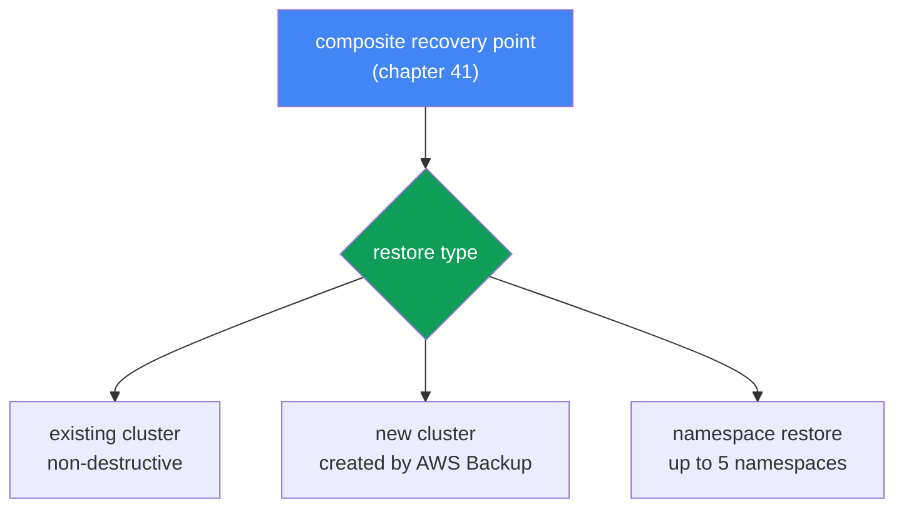
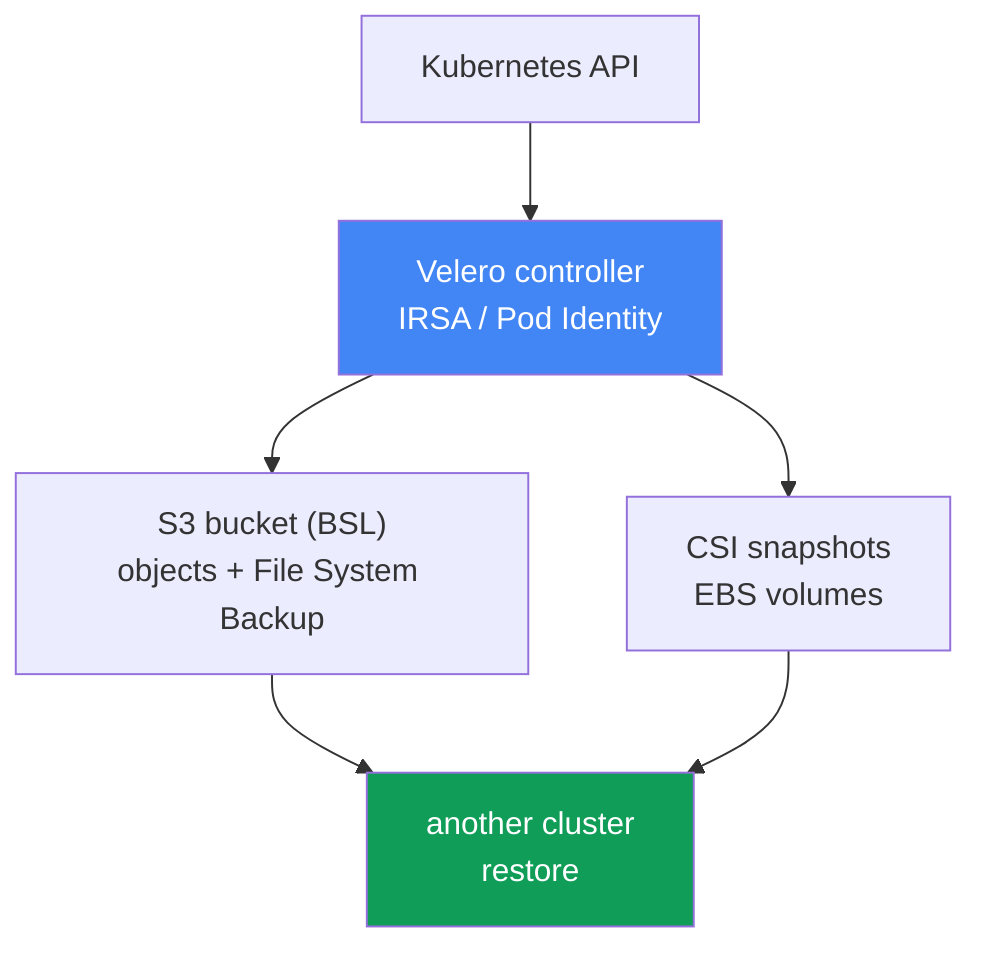

[Русская версия](ru.md) · [Versión en español](es.md) · [Version française](fr.md) · [Deutsche Version](de.md) · [ქართული ვერსია](ge.md) · [繁體中文版](tw.md) · [日本語版](jp.md)
# Chapter 42. Recovery and DR: restore to an existing and new cluster, namespace restore, Velero

> **What is next.** Chapter 41 covered backup: AWS Backup, a composite recovery point, cluster and volume state at one consistent point. But a backup is only half the work: an unverified backup is not a backup. This chapter covers getting back from that point: restoring to an existing and a new cluster, targeted namespace recovery, Velero as a second tool, plus RTO/RPO and DR strategies. Related subjects belong to other chapters: backup itself and the composite recovery point are in chapter 41; EBS volume affinity to an AZ is in chapter 23; multi-cluster and multi-account connectivity for DR is in chapter 32; rolling back a cluster version (which is not data restore) is in chapter 39.

## 42.1. There is a backup, but no one has tried to recover from it

Return to the incident in chapter 41: someone ran `kubectl delete namespace prod` in the wrong cluster. This time there is good news: the cluster has a backup plan, and yesterday's composite recovery point is present with status `Completed`. The on-call engineer opens the AWS Backup console, finds the point, and runs into questions no one answered beforehand:

- Restore the entire cluster or only the `prod` namespace?
- Restore to the same cluster (it is alive and the other namespaces work) or to a new one?
- Will restore overwrite what is currently in the cluster?
- In which AZ will volumes from snapshots be brought up, and will nodes exist there?
- How long will it take, minutes or hours, and does it meet the time promised to the business?

That is the problem this chapter addresses. A backup without a rehearsed restore is an illusion of protection. The first real restore almost always happens during an emergency, under pressure, when there is no time to read documentation. Worse, the scenarios differ. One namespace was deleted: targeted recovery into a live cluster is needed. The entire cluster was lost, the Region was destroyed, or ransomware encrypted the data: restore into a new cluster is needed, possibly in another Region or account. These are different operations with different durations and pitfalls, and both must be understood before an incident, not during it.

This defines the chapter plan: first restore with AWS Backup (existing cluster, new cluster, cross-Region, and cross-account), then targeted namespace restore, then Velero and choosing between tools, and finally DR concepts, RTO/RPO, and common restore pitfalls.

## 42.2. Restore with AWS Backup: three scenarios

AWS Backup restores a composite recovery point (chapter 41): both cluster state (Kubernetes objects) and associated volumes together. The key rule is: **restore always goes to a target EKS cluster**, an existing cluster. You cannot restore “into nothing”: either the cluster already exists, or AWS Backup creates a new one as part of the restore itself. This leads to three scenarios:

| Scenario | Destination | When it is used |
|---|---|---|
| Existing cluster restore | the source or another existing cluster | targeted recovery, cluster is alive |
| New cluster restore | AWS Backup creates a new cluster and restores into it | disaster, cluster/Region loss |
| Namespace restore | an existing cluster, up to 5 namespaces | a namespace was deleted, partial loss |

An important property of all AWS Backup restores is that they are **non-destructive**. Restore does not overwrite existing Kubernetes objects in the target cluster and does not change its version. If an object already exists, it is skipped rather than overwritten. Skipped objects are visible through SNS notifications, which you should subscribe to in advance. This protects a live cluster from damage, but also means a restore on top of a corrupted object will not “fix” it, as covered in the pitfalls section.

**Restore to an existing cluster** is for targeted recovery when the cluster is alive but some data or objects are gone. Prerequisite: the required CSI drivers must already be installed in the target cluster (EBS/EFS/S3 through add-ons, chapter 23), otherwise the volumes have nowhere to mount.

**Restore to a new cluster** is for a disaster. AWS Backup creates the cluster itself, but with a limited set of options: name, Kubernetes version, VPC/subnets, IAM role, security groups, node groups, Fargate profiles, and pod identity associations. For full control, create the cluster in advance (console/eksctl/Terraform) and specify it as the target. When creating a new cluster, AWS Backup adds a buffer of approximately 15 minutes after the cluster becomes ready before creating resources, so that components have time to initialize.



**Cross-Region and cross-account restore.** Copies of a recovery point in another Region and account (chapter 41) are what you restore from after the primary Region is lost or an account is compromised. Restore from a copy works the same way, but adds requirements: if the source cluster was encrypted, an `encryptionConfigProviderKeyArn` with the destination KMS key is required (a separate key for cross-Region/cross-account), and IAM roles referenced by workloads (IRSA, Pod Identity, OIDC provider) must exist in the destination account and Region. AWS Backup does not create those roles. For ARN remapping, see section 42.8.

Start a restore with `aws backup start-restore-job` and EKS metadata: `clusterName` is required; for a new cluster, use `newCluster=true` and nested fields (`eksClusterVersion`, `clusterRole`, `clusterVpcConfig`, `nodeGroups`, `fargateProfiles`, `podIdentityAssociations`). Permissions come from the managed policy `AWSBackupServiceRolePolicyForRestores`; S3 buckets require `AWSBackupServiceRolePolicyForS3Restore`.

## 42.3. Targeted (selective) namespace recovery

A full DR restore is a heavy operation: bringing up an entire cluster is necessary when it no longer exists. Much more often, the incident is smaller: one namespace was deleted or corrupted while the rest of the cluster works. Running a full restore is harmful here: it is slow and risky. Namespace restore exists for this purpose.

Namespace restore puts only the specified namespaces (up to 5 at a time), their namespace-scoped resources, and their related persistent volumes into an existing cluster. Cluster-scoped resources (CRD, StorageClass, the Namespace object itself, PersistentVolume) are excluded, except for PVs associated with restored volumes. The logic is also non-destructive: what already exists in the cluster is not overwritten.

The essential difference from a full DR restore:

| | Namespace restore | Full/new cluster restore |
|---|---|---|
| Goal | return part of a live cluster | rebuild the cluster |
| What is restored | up to 5 namespaces and their volumes | all state and all volumes |
| Cluster-scoped resources | excluded (except related PVs) | restored |
| Typical trigger | the prod namespace was deleted | cluster/Region loss |
| RTO | minutes to tens of minutes | hours |

In practical terms, namespace restore is an everyday operator tool, while DR restore to a new cluster is a rare, heavy event. Both are tested, but differently (section 42.8).

## 42.4. Object restore order

When restoring, object creation order matters: PVCs must be created before Pods, CRDs before custom resources, and a namespace before what is inside it. AWS Backup applies a sensible default order: cluster-scoped resources first (CustomResourceDefinitions, Namespaces, StorageClasses, PersistentVolumes), then namespace-scoped resources (PersistentVolumeClaims, Secrets, ConfigMaps, ServiceAccounts, LimitRanges, Pods, ReplicaSets). Override this order when necessary through `kubernetesRestoreOrder` (the `group/version/kind` or `version/kind` format).

After objects are restored, storage is attached. For an EBS snapshot, specify the Availability Zone where the volume will be created; AWS Backup will try to bring up the Pod in the same AZ so the volume mounts (related to chapter 23). EFS is restored to a random prefix and requires you to manually create an access point after restore. AWS Backup does not create it.

## 42.5. Velero: Kubernetes-native backup and restore

Velero is an open-source backup and recovery tool that runs inside the cluster. Unlike AWS Backup, an external AWS service, Velero works through the Kubernetes API and is closer to the cluster itself. Its strength is portability: it can restore to **another** cluster, which makes it a tool for both migration and DR.

AWS integration comes through the official velero-plugin-for-aws: it adds an object store plugin for S3 (BSL) and a volume snapshotter plugin for EBS snapshots. Specify the plugin with `--plugins velero/velero-plugin-for-aws:<version>` during `velero install`. How it works:

- **Object backup.** Velero reads objects through the Kubernetes API and stores them as a tarball in object storage, an S3 bucket configured through BackupStorageLocation (BSL).
- **Volume snapshots.** PV data is captured either through CSI volume snapshots (an EBS snapshot made by the driver) or through File System Backup (a file-by-file copy of volume contents into the same bucket, which also works across providers).
- **Selectors.** Limit a backup by namespace (`--include-namespaces`) or label (`--selector`) for fine-grained, targeted coverage down to individual workloads.
- **Schedules.** A Schedule object (`velero schedule create --schedule="0 2 * * *"`) runs a backup by cron; the schedule frequency directly defines RPO (section 42.7).
- **Backup hooks.** With the `pre.hook.backup.velero.io/command` and `post.hook.backup.velero.io/command` annotations, Velero runs a command in a container before and after taking a backup: flush database buffers, freeze and unfreeze the file system. This is not available in AWS Backup (chapter 41) and is the main case for Velero with database StatefulSets. The command runs outside a shell, so write it as an argument list, not a string with pipes.
- **Restore hooks.** During restore, Velero can run init containers and exec hooks in Pods, for example, to wait until a volume is ready or warm state before the application starts.
- **Restore to another cluster.** `velero restore create --from-backup <name>`, run in a target cluster with the same BSL, brings workloads up from backup. This is the basis of migration and DR.

Give Velero AWS access not through static keys but through **IRSA or EKS Pod Identity** (chapters 16-17): the Velero controller ServiceAccount is associated with an IAM role that has permissions for the S3 bucket (BSL) and EBS snapshots. This is the same least-privilege principle as for any controller in the cluster.

**S3 Object Lock for Velero backups.** Velero backups reside in an S3 bucket, and the same IAM role that writes them can delete them by default: when the cluster is compromised or ransomware strikes, backups are among the first data to be erased or encrypted. Bucket protection is entirely your responsibility here: unlike AWS Backup, there is no managed Vault Lock. The answer is S3 Object Lock (WORM): enabled on the bucket (versioning is required), Compliance mode makes object versions immutable for the retention period, and even root cannot delete them. This lets a backup survive both an accidental `velero backup delete` and an attacker with bucket permissions.

Two nuances can mislead expectations. First, Object Lock protects **object versions**, but it does not prevent placing a delete marker on top of them. A simple `DELETE` without a version ID succeeds in S3 with `200 OK`; the protected version remains, but becomes noncurrent, is no longer listed in the backup bucket, and disappears for Velero. Thus WORM provides recoverability (remove the delete marker and the versions remain intact), not a guarantee that the backup is visible: you still must monitor whether recovery points exist. Second, align the lock period with the schedule TTL in the right direction: TTL must not be shorter than the Object Lock period. Velero deletes an expired backup with the same simple `DELETE`, so it does not fail with `AccessDenied`; when TTL is shorter than the lock period, the backup is considered deleted but its versions remain, incur charges until retention ends, and even a lifecycle rule will not remove them. An `AccessDenied` (403) error is returned to something else: an actor deleting a version explicitly with a version ID, such as manual bucket cleanup, Batch Operations, or an emergency space-reclamation script.



## 42.6. Velero or AWS Backup

The tools are not mutually exclusive, but address problems from different angles. Use this as a selection guide:

| Criterion | AWS Backup | Velero |
|---|---|---|
| Nature | managed AWS service | k8s-native, installed in the cluster |
| Unit | composite recovery point | Backup (objects + volumes) |
| Policies/protection | backup plan, vault, Vault Lock (WORM) | Schedule retention; bucket protection is S3 Object Lock (WORM), your responsibility |
| Portability | within AWS (cross-Region/account) | across clusters, distributions, and clouds |
| Selective | namespace restore (up to 5) | fine-grained: namespace, label, resources |
| Migration | not its primary purpose | primary use case |

In short: choose **AWS Backup** when you need managed backup with centralized policies, composite points, and immutability (Vault Lock) within AWS. Choose **Velero** when you need portability and migration between clusters and clouds, fine-grained selection, and Kubernetes-native backup management. Many teams use both: AWS Backup for policy and DR within AWS, Velero for migrations and granular recoveries.

## 42.7. DR concepts: RTO, RPO, and strategies

Every discussion of restore comes down to two metrics:

- **RTO (recovery time objective)**: how long a service may take to return after an incident.
- **RPO (recovery point objective)**: how much data loss is acceptable, that is, how far back in time you can roll back. **RPO is directly set by backup frequency**: a daily backup means an RPO of up to a day; an hourly Velero schedule means an RPO of about an hour.

AWS identifies four DR strategies with increasing cost and decreasing RTO/RPO (Well-Architected):

| Strategy | RPO / RTO | Essence |
|---|---|---|
| Backup and restore | RPO hours, RTO up to a day | backup to another Region, restore after an incident |
| Pilot light | RPO minutes, RTO tens of minutes | data replicates, the core is off, and is enabled during an incident |
| Warm standby | lower | a reduced copy always runs and is scaled during an incident |
| Multi-site active-active | near zero | full operation in multiple Regions at once |

For a typical EKS cluster, recovery through AWS Backup or Velero is a **backup and restore** strategy: inexpensive, but RTO is measured in hours (bring up the cluster, restore state and volumes, recreate load balancers and DNS). Moving to pilot light and beyond means having a ready standby cluster and replicating data to another Region (connectivity is in chapter 32), which costs more. Choosing a strategy is a deliberate trade-off between RTO/RPO and cost, not “let's make it more reliable.”

## 42.8. Restore pitfalls

Restore fails not on the backup, but on environment details. Verify these in advance:

- **PV affinity to an AZ.** A volume is restored from a snapshot into a specific AZ, and the Pod must land there or the volume will not mount (chapter 23). For new PVCs, `volumeBindingMode: WaitForFirstConsumer` and topology-aware provisioning help; when restoring from a snapshot, the snapshot fixes the AZ and nodes must exist in the target AZ.
- **Strict `nodeSelector`, affinity, and taints.** Restored manifests retain requirements for nodes in the source cluster, while the target fleet is arranged differently: different pool labels, no required instance type, or its own taints. Pods will be created and remain permanently in `Pending` with `node(s) didn't match Pod's node affinity/selector` or `node(s) had untolerated taint`. Crucially, the scheduler checks **labels**, not node group or NodePool names, so prepare the DR cluster by labels, not by renaming pools. The keys and values used to select the workload must match (`karpenter.sh/nodepool`, `karpenter.sh/capacity-type`, `kubernetes.io/arch`, and labels prefixed with `eks.amazonaws.com` on managed node groups). `topologySpreadConstraints` with `whenUnsatisfiable: DoNotSchedule` has the same effect if the target cluster has fewer zones. Velero can correct this in flight: Resource Modifiers is a ConfigMap with JSON patches, connected with `--resource-modifier-configmap`, where a `remove` operation removes a `nodeSelector` or replaces a label (rule conditions are written for the SOURCE namespace, even if restore uses `--namespace-mappings`). AWS Backup cannot mutate manifests: make labels in the target cluster match the source beforehand, or modify objects after restore.
- **Non-destructive behavior and a live cluster.** Restore does not overwrite existing objects. If an object is corrupted but present, restore skips it: to roll back to a “good” version, delete the object first, then restore it. Immutable fields (for example, a Deployment selector or some Service fields) also result in a skip rather than an overwrite on conflict.
- **IRSA/Pod Identity and ARN remapping.** When restoring to another account/Region, IRSA roles, the OIDC provider, and Pod Identity associations from the source account do not exist there. An SA annotated with the old role ARN will not work until the roles are recreated in the target account.
- **Load balancers and DNS.** NLB/ALB and Route 53 records are tied to the source environment. After restore, AWS Load Balancer Controller recreates load balancers (chapters 26-28), while external-dns and cert-manager recreate DNS and certificates (chapter 29); addresses and ARNs change, so account for this in the plan.
- **Order and versions.** First namespace and CRD, then StorageClass and PV, then workloads (section 42.4). Object API versions must be supported by the target cluster: restoring between very different Kubernetes versions is best effort and incompatibilities are possible.
- **Images and registries.** A backup does not store container images (chapter 41). The target account/Region must be able to access ECR or the registry from which images are pulled, otherwise Pods will not start.

And the main rule: test restores regularly instead of waiting for an incident. Each quarter, hold a game day: restore a recovery point (or Velero backup) to a separate namespace or temporary cluster, and measure actual RTO. A restore verified on a game day is the only one you can rely on during an incident.

## 42.9. Game day: rehearsing a Region failure (Region failover)

DR strategies (section 42.7) and game-day practice have been described separately; bring them together in one concrete scenario: complete failure of the primary Region. This is a heavy restore to a new cluster (section 42.2) from a cross-Region copy (chapter 41), with traffic switched through DNS. Rehearse it as a drill step by step, measuring real RTO/RPO:

1. **Declare failover.** The primary Region is unavailable; move to a preselected standby Region that contains cross-Region recovery-point copies (chapter 41).
2. **Bring up the cluster.** Either a warm standby / blue-green cluster is already ready, or create a new one (eksctl/Terraform); prerequisites are that IRSA/Pod Identity IAM roles, the OIDC provider, and ECR access in the standby Region are created in advance (section 42.8).
3. **Restore state and volumes.** Use `aws backup start-restore-job` from the cross-Region copy with the destination KMS key (section 42.2), or `velero restore create` from S3 in the target cluster.
4. **Verify connectivity.** Verify multi-Region networking and access to data and dependencies in the standby Region according to chapter 32.
5. **Verify data.** Before switching traffic, make sure volumes are mounted and data is intact: run an application smoke test and compare with the point in time of the recovered copy (RPO), not “the Pods started, so it is ready.”
6. **Switch traffic.** Route 53 points records to the new Region through weighted/failover records with a health check (chapter 29): a failover record routes traffic to the standby Region when the primary health check is “red”; the controller recreates load balancers (section 42.8).
7. **Measure RTO/RPO.** Record the actual time until the service returns (RTO) and the data point in the copy (RPO) against SLA targets (section 42.7); any gap is input for the next game day.

How strongly steps 2-3 determine RTO depends on the selected DR strategy (section 42.7): with backup and restore, bring up the cluster and data from scratch, so RTO is hours; with pilot light/warm standby, the standby Region is partly alive already and failover is limited to scaling and switching Route 53.

## 42.10. How this is used in production

- **Write the restore runbook in advance.** Cover both scenarios, namespace restore to a live cluster and full restore to a new one, with commands and owners, rather than “we will figure it out on the spot.”
- **Run game days regularly.** Each quarter, restore a recent point into a separate namespace or temporary cluster, and record actual RTO against the target.
- **Prepare the DR target account in advance.** Create IRSA/Pod Identity IAM roles, the OIDC provider, security groups, and ECR access in the DR account before an incident, not at restore time. This also includes node-pool labels: the keys and values by which workloads select a node must exist in the standby cluster, or restored Pods will remain in `Pending`.
- **Subscribe to SNS notifications about skipped objects.** Non-destructive restore silently skips what already exists; without skip notifications, it is easy to get an incomplete recovery.
- **Set RTO/RPO in the SLA.** Agree backup frequency (RPO) and target recovery time (RTO) with the business, and compare them with the DR strategy instead of choosing by intuition.
- **Keep both tools deliberately.** AWS Backup is policy and DR in AWS; Velero is migration and granular selective recovery. Know which is primary for each case.

## 42.11. Mini glossary

- **restore job**: an AWS Backup recovery task; start it with `start-restore-job` and track it with `list-restore-jobs`/`describe-restore-job`.
- **target EKS cluster**: an existing cluster into which restore goes, or a cluster AWS Backup creates during restore (`newCluster=true`).
- **non-destructive restore**: a mode in which existing objects are not overwritten but skipped (skips are visible through SNS).
- **namespace restore**: targeted recovery of up to 5 namespaces to an existing cluster, without cluster-scoped resources except related PVs.
- **Velero**: Kubernetes-native backup/restore; objects in S3 (BackupStorageLocation), volumes through CSI snapshots or File System Backup.
- **BackupStorageLocation (BSL)**: the Velero backup storage location (an S3 bucket).
- **velero-plugin-for-aws**: the official Velero plugin for AWS: object storage for S3 (BSL) and a volume snapshotter for EBS snapshots.
- **S3 Object Lock**: WORM protection for an S3 bucket: immutability of object versions for the retention period (Governance/Compliance), protecting Velero backups from deletion and encryption.
- **Schedule**: a Velero object for periodic cron backups; it sets RPO.
- **restore hook**: an init container or exec command Velero starts while restoring a Pod.
- **Resource Modifiers**: a Velero ConfigMap with JSON patches for objects at restore time (`--resource-modifier-configmap`), used to remove fields incompatible with the target cluster.
- **RTO**: target time to recover a service after an incident.
- **RPO**: acceptable data loss; set by backup frequency.

## 42.12. Chapter summary

- An unverified backup is not a backup: do not defer the first restore until an incident, rehearse it in advance on a game day.
- Restore scenarios differ: targeted namespace restore to a live cluster and full DR restore to a new cluster are different operations with different RTOs and pitfalls.
- AWS Backup always restores to a target EKS cluster, either existing or created by it; all restores are non-destructive and do not overwrite existing objects or the cluster version.
- Namespace restore puts up to 5 namespaces with their volumes into an existing cluster, excluding cluster-scoped resources except related PVs.
- Cross-Region and cross-account restore from copies (chapter 41) is the basis for DR; it requires a destination KMS key and IAM roles created in advance in the target account.
- Restore order matters: first CRDs/Namespaces/StorageClasses/PVs, then PVCs/Secrets/Pods; an EBS volume comes up in the snapshot AZ, while EFS requires a manual access point.
- Velero is Kubernetes-native backup/restore: objects in S3 (BSL), volumes through CSI or File System Backup, selectors, Schedule, restore hooks, and restore to another cluster (migration and DR).
- AWS Backup is managed, composite, and has Vault Lock; Velero is portable, fine-grained selective, and supports migration between clusters and clouds. Teams often keep both; protect the Velero bucket with S3 Object Lock.
- RPO is set by backup frequency; DR strategies (backup and restore, pilot light, warm standby, multi-site) are a trade-off between RTO/RPO and cost.
- Restore pitfalls include volume AZs, node labels with strict `nodeSelector` and taints, non-destructive skips, IRSA/ARN remapping, recreated load balancers and DNS, order and version compatibility, and image access.

## 42.13. How this helps in real work

While on call, this chapter is what turns backup into actual recovery. When a namespace is deleted or a cluster is lost, the question is not “is there a backup?” (that was verified in chapter 41), but “how and how quickly will I bring it back?” The answer must be in a runbook before the incident: which restore type applies to which scenario, which cluster to use, what prerequisites exist (CSI drivers, IAM roles, ECR access), and the expected RTO. During an incident, use that runbook to recover, not improvise.

When planning a cluster, this adds mandatory items: RTO/RPO agreed with the business and a DR strategy selected for them; a game-day-tested restore (namespace and full); a ready DR account with recreated roles and access; and awareness that restore recreates LB and DNS while volumes are tied to an AZ. Together with the backup in chapter 41, this completes the protection loop: backup plus verified restore plus a DR plan with RTO/RPO is real protection, not an illusion.

## 42.14. Self-check questions

1. Why is an unverified backup not considered a backup, and what is done about it in practice?
2. How does restore to an existing cluster differ from restore to a new cluster in terms of scenario?
3. What does non-destructive restore in AWS Backup mean, and what consequence does that property have?
4. What does namespace restore recover, and which resources does it exclude?
5. Why does restore go to a target EKS cluster, and what does AWS Backup do with `newCluster=true`?
6. What additional requirements arise for cross-Region and cross-account restore?
7. In which order does AWS Backup restore objects, and why does order matter?
8. How does Velero back up objects and volumes, and how does File System Backup differ from a CSI snapshot?
9. How does Velero restore to another cluster, and why does it need IRSA or Pod Identity?
10. When do you choose AWS Backup versus Velero, and why do teams often keep both?
11. What are RTO and RPO, and how is backup frequency related to RPO?
12. How do DR strategies (backup and restore, pilot light, warm standby, multi-site) differ?
13. Why might a recovered EBS volume fail to mount, and how is this related to the AZ (chapter 23)?
14. What pitfalls await when restoring to another account: roles, load balancers, DNS, and images?
15. Why can recovered Pods remain in `Pending` forever in a DR cluster, and what can and cannot be done here with Velero and AWS Backup?
16. What exactly does S3 Object Lock protect for Velero backups, why does a delete marker over a protected version succeed, and how is this related to the schedule TTL?

## Practice

The course lab for this topic is [lab 122: AWS Backup for EKS](../../labs/122/README.MD). In it, you perform namespace restore to a live cluster, observe non-destructive behavior (existing objects are not overwritten), and examine why rolling back the cluster version does not restore a deleted namespace; verify with the `check_result` command. Start it with `TASK=122 make run_eks_task`.

Beyond the lab, recovery state is visible through tools. Start with AWS Backup: view available recovery points and start a test restore to a separate namespace, not prod.

```bash
# restore job history (statuses, duration)
aws backup list-restore-jobs
# details of a specific recovery task
aws backup describe-restore-job --restore-job-id <id>
```

Start recovery through `start-restore-job` with EKS metadata (at a minimum, `clusterName`); for namespace restore, specify the target cluster and namespace names. Check the full set of metadata fields against the AWS Backup documentation so you do not miss them during an incident.

For Velero, verify that backups are taken and recoverable, and rehearse restore to a test namespace:

```bash
# list backups and schedules
velero backup get
velero schedule get
# restore an entire backup or only a namespace to the test environment
velero restore create --from-backup <backup> --include-namespaces test-restore
# restore statuses
velero restore get
```

The main practice in this chapter is a regular game day: each quarter, restore a fresh point to a separate namespace or temporary cluster and measure real RTO. For backup and the composite recovery point, see chapter 41; for volume affinity to an AZ, see chapter 23; for multi-cluster connectivity for DR, see chapter 32; for rolling back a cluster version (which is not data restore), see chapter 39.

---
[Table of contents](../README.md) · [Chapter 41](../41/en.md) · [Chapter 43](../43/en.md)
