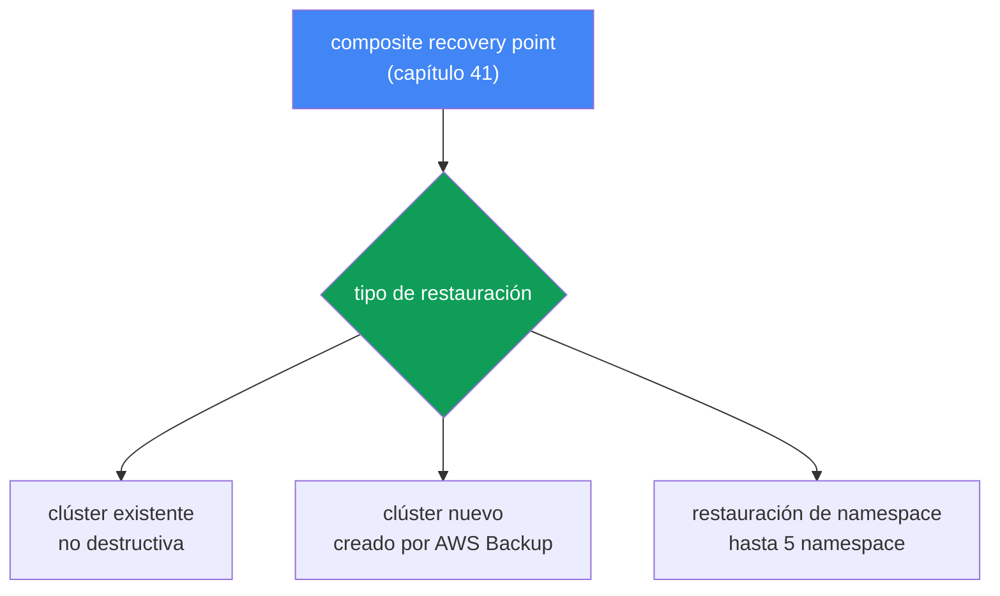
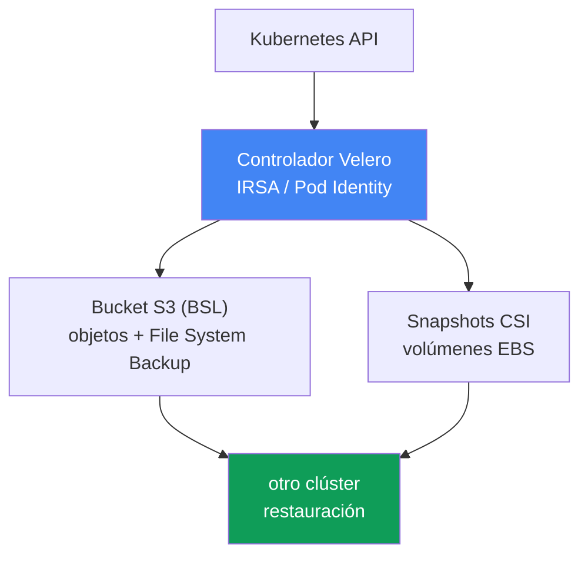

[Eng version](en.md) · [Русская версия](ru.md) · [Version française](fr.md) · [Deutsche Version](de.md) · [ქართული ვერსია](ge.md) · [繁體中文版](tw.md) · [日本語版](jp.md)
# Capítulo 42. Recuperación y DR: restauración en un clúster existente y uno nuevo, restauración de namespace, Velero

> **Qué sigue.** El capítulo 41 trató las copias de seguridad: AWS Backup, un composite recovery point y el estado del clúster y los volúmenes en un único punto coherente. Pero una copia de seguridad es solo la mitad del trabajo: una copia no verificada no es una copia de seguridad. Este capítulo explica cómo recuperarse desde ese punto: restaurar en un clúster existente y en uno nuevo, recuperación selectiva de namespace, Velero como segunda herramienta, además de RTO/RPO y estrategias de DR. Los temas relacionados pertenecen a otros capítulos: la copia de seguridad en sí y el composite recovery point están en el capítulo 41; la afinidad de un volumen EBS con una AZ está en el capítulo 23; la conectividad multiclúster y multicuenta para DR está en el capítulo 32; revertir una versión de clúster, que no es restaurar datos, está en el capítulo 39.

## 42.1. Hay una copia de seguridad, pero nadie ha intentado recuperarse desde ella

Volvamos al incidente del capítulo 41: alguien ejecutó `kubectl delete namespace prod` en el clúster equivocado. Esta vez hay buenas noticias: el clúster tiene un backup plan y el composite recovery point de ayer está presente con estado `Completed`. La persona de guardia abre la consola de AWS Backup, encuentra el punto y se enfrenta a preguntas que nadie respondió de antemano:

- ¿Restaurar todo el clúster o solo el namespace `prod`?
- ¿Restaurar en el mismo clúster, que sigue vivo y donde funcionan los otros namespace, o en uno nuevo?
- ¿La restauración sobrescribirá lo que hay actualmente en el clúster?
- ¿En qué AZ se crearán los volúmenes de los snapshots, y habrá nodos allí?
- ¿Cuánto tiempo tardará, minutos u horas, y cumple el plazo prometido al negocio?

Ese es el problema que aborda este capítulo. Una copia de seguridad sin una restauración ensayada es una ilusión de protección. La primera restauración real casi siempre ocurre durante una emergencia, bajo presión, cuando no hay tiempo para leer documentación. Peor aún, los escenarios son distintos. Se eliminó un namespace: se necesita una recuperación selectiva en un clúster activo. Se perdió todo el clúster, se destruyó la Region o ransomware cifró los datos: se necesita restaurar en un clúster nuevo, posiblemente en otra Region o cuenta. Son operaciones diferentes, con duraciones y dificultades distintas, y ambas deben entenderse antes de un incidente, no durante él.

Esto define el plan del capítulo: primero, restauración con AWS Backup, tanto en clústeres existentes como nuevos, entre regiones y entre cuentas; después, restauración selectiva de namespace; luego Velero y cómo elegir entre las herramientas; y por último conceptos de DR, RTO/RPO y dificultades comunes de la restauración.

## 42.2. Restauración con AWS Backup: tres escenarios

AWS Backup restaura un composite recovery point (capítulo 41): tanto el estado del clúster, es decir, los objetos Kubernetes, como los volúmenes asociados. La regla clave es: **la restauración siempre se realiza en un target EKS cluster**, un clúster existente. No se puede restaurar «en la nada»: o bien el clúster ya existe, o AWS Backup crea uno nuevo como parte de la propia restauración. Esto lleva a tres escenarios:

| Escenario | Destino | Cuándo se usa |
|---|---|---|
| Restauración en clúster existente | el clúster de origen u otro clúster existente | recuperación selectiva, el clúster sigue activo |
| Restauración en clúster nuevo | AWS Backup crea un clúster nuevo y restaura en él | desastre, pérdida del clúster o la Region |
| Restauración de namespace | un clúster existente, hasta 5 namespace | se eliminó un namespace, pérdida parcial |

Una propiedad importante de todas las restauraciones de AWS Backup es que son **no destructivas**. La restauración no sobrescribe objetos Kubernetes existentes en el clúster de destino ni cambia su versión. Si un objeto ya existe, se omite en vez de sobrescribirse. Los objetos omitidos son visibles mediante notificaciones de SNS, a las que conviene suscribirse de antemano. Esto protege un clúster activo frente a daños, pero también significa que una restauración sobre un objeto dañado no lo «reparará», como se explica en la sección de dificultades.

**Restaurar en un clúster existente** sirve para una recuperación selectiva cuando el clúster sigue activo, pero faltan algunos datos u objetos. Requisito previo: los controladores CSI necesarios ya deben estar instalados en el clúster de destino, EBS/EFS/S3 mediante add-ons, capítulo 23; de lo contrario, los volúmenes no tendrán dónde montarse.

**Restaurar en un clúster nuevo** sirve para un desastre. AWS Backup crea el clúster por sí mismo, pero con un conjunto limitado de opciones: nombre, versión de Kubernetes, VPC/subredes, IAM role, security groups, node groups, Fargate profiles y pod identity associations. Para tener control total, cree el clúster de antemano, mediante consola/eksctl/Terraform, y especifíquelo como destino. Al crear un clúster nuevo, AWS Backup añade un margen de aproximadamente 15 minutos después de que el clúster esté preparado antes de crear recursos, para que los componentes tengan tiempo de inicializarse.



**Restauración entre regiones y entre cuentas.** Las copias de un recovery point en otra Region y cuenta, capítulo 41, son el origen desde el que se restaura cuando se pierde la Region principal o se compromete una cuenta. Restaurar desde una copia funciona igual, pero añade requisitos: si el clúster de origen estaba cifrado, se requiere un `encryptionConfigProviderKeyArn` con la clave KMS de destino, una clave distinta para restauración entre regiones o entre cuentas, y los roles IAM referenciados por las cargas de trabajo, IRSA, Pod Identity y el proveedor OIDC, deben existir en la cuenta y Region de destino. AWS Backup no crea esos roles. Para la reasignación de ARN, consulte la sección 42.8.

Inicie una restauración con `aws backup start-restore-job` y los metadatos de EKS: `clusterName` es obligatorio; para un clúster nuevo, use `newCluster=true` y los campos anidados (`eksClusterVersion`, `clusterRole`, `clusterVpcConfig`, `nodeGroups`, `fargateProfiles`, `podIdentityAssociations`). Los permisos provienen de la política administrada `AWSBackupServiceRolePolicyForRestores`; los buckets S3 requieren `AWSBackupServiceRolePolicyForS3Restore`.

## 42.3. Recuperación selectiva de namespace

Una restauración DR completa es una operación pesada: levantar un clúster entero es necesario cuando ya no existe. Con mucha más frecuencia, el incidente es menor: un namespace se eliminó o dañó mientras el resto del clúster funciona. Ejecutar una restauración completa aquí es perjudicial: es lento y arriesgado. Para ello existe la restauración de namespace.

La restauración de namespace coloca solo los namespace especificados, hasta 5 a la vez, sus recursos con ámbito de namespace y sus volúmenes persistentes relacionados en un clúster existente. Los recursos con ámbito de clúster, CRD, StorageClass, el propio objeto Namespace y PersistentVolume, se excluyen, excepto los PV asociados con volúmenes restaurados. La lógica también es no destructiva: lo que ya existe en el clúster no se sobrescribe.

La diferencia esencial con una restauración DR completa:

| | Restauración de namespace | Restauración completa/en clúster nuevo |
|---|---|---|
| Objetivo | recuperar una parte de un clúster activo | reconstruir el clúster |
| Qué se restaura | hasta 5 namespace y sus volúmenes | todo el estado y todos los volúmenes |
| Recursos con ámbito de clúster | excluidos, excepto PV relacionados | restaurados |
| Desencadenante típico | se eliminó el namespace prod | pérdida del clúster o la Region |
| RTO | de minutos a decenas de minutos | horas |

En la práctica, la restauración de namespace es una herramienta cotidiana del operador, mientras que la restauración DR en un clúster nuevo es un evento poco frecuente y pesado. Ambas se prueban, pero de forma distinta, sección 42.8.

## 42.4. Orden de restauración de objetos

Al restaurar, el orden de creación de los objetos importa: los PVC deben crearse antes que los Pods, los CRD antes que los recursos personalizados, y un namespace antes de lo que contiene. AWS Backup aplica un orden predeterminado razonable: primero recursos con ámbito de clúster, CustomResourceDefinitions, Namespaces, StorageClasses y PersistentVolumes, y después recursos con ámbito de namespace, PersistentVolumeClaims, Secrets, ConfigMaps, ServiceAccounts, LimitRanges, Pods y ReplicaSets. Anule este orden cuando sea necesario mediante `kubernetesRestoreOrder`, con formato `group/version/kind` o `version/kind`.

Después de restaurar los objetos, se conecta el almacenamiento. Para un snapshot de EBS, especifique la Availability Zone donde se creará el volumen; AWS Backup intentará levantar el Pod en la misma AZ para que el volumen se monte, relacionado con el capítulo 23. EFS se restaura en un prefijo aleatorio y exige crear manualmente un access point después de la restauración. AWS Backup no lo crea.

## 42.5. Velero: copia de seguridad y restauración nativas de Kubernetes

Velero es una herramienta de copia de seguridad y recuperación de código abierto que se ejecuta dentro del clúster. A diferencia de AWS Backup, un servicio externo de AWS, Velero funciona mediante la API de Kubernetes y está más cerca del propio clúster. Su fortaleza es la portabilidad: puede restaurar en **otro** clúster, lo que la convierte en una herramienta tanto para migración como para DR.

La integración con AWS se realiza mediante el plugin oficial velero-plugin-for-aws: añade un plugin de almacenamiento de objetos para S3, BSL, y un plugin de instantáneas de volúmenes para snapshots de EBS. Especifique el plugin con `--plugins velero/velero-plugin-for-aws:<version>` durante `velero install`. Así funciona:

- **Copia de objetos.** Velero lee objetos mediante la API de Kubernetes y los guarda como un tarball en almacenamiento de objetos, un bucket S3 configurado mediante BackupStorageLocation (BSL).
- **Snapshots de volúmenes.** Los datos de PV se capturan mediante CSI volume snapshots, un snapshot EBS creado por el controlador, o mediante File System Backup, una copia archivo por archivo del contenido del volumen en el mismo bucket, que también funciona entre proveedores.
- **Selectores.** Limite una copia por namespace (`--include-namespaces`) o por etiqueta (`--selector`) para una cobertura precisa y selectiva, hasta cargas de trabajo individuales.
- **Programaciones.** Un objeto Schedule (`velero schedule create --schedule="0 2 * * *"`) ejecuta una copia mediante cron; la frecuencia de la programación define directamente el RPO, sección 42.7.
- **Backup hooks.** Con las anotaciones `pre.hook.backup.velero.io/command` y `post.hook.backup.velero.io/command`, Velero ejecuta un comando en un contenedor antes y después de realizar una copia: vaciar búferes de la base de datos, congelar y descongelar el sistema de archivos. Esto no está disponible en AWS Backup, capítulo 41, y es el principal caso de uso de Velero con StatefulSets de bases de datos. El comando se ejecuta fuera de un shell, por lo que debe escribirse como lista de argumentos y no como una cadena con tuberías.
- **Restore hooks.** Durante la restauración, Velero puede ejecutar init containers y hooks exec en Pods, por ejemplo, para esperar a que un volumen esté listo o preparar el estado antes de que se inicie la aplicación.
- **Restauración en otro clúster.** `velero restore create --from-backup <name>`, ejecutado en un clúster de destino con el mismo BSL, levanta las cargas de trabajo desde la copia. Esta es la base de la migración y DR.

Conceda a Velero acceso a AWS no mediante claves estáticas, sino con **IRSA o EKS Pod Identity**, capítulos 16-17: el ServiceAccount del controlador de Velero se asocia a un IAM role con permisos para el bucket S3, BSL, y los snapshots de EBS. Es el mismo principio de privilegios mínimos que para cualquier controlador del clúster.

**S3 Object Lock para las copias de Velero.** Las copias de Velero residen en un bucket S3 y, de forma predeterminada, el mismo IAM role que las escribe puede eliminarlas: cuando el clúster se ve comprometido o ataca ransomware, las copias están entre los primeros datos que se borran o cifran. La protección del bucket es enteramente su responsabilidad aquí: a diferencia de AWS Backup, no hay un Vault Lock administrado. La respuesta es S3 Object Lock (WORM): habilitado en el bucket, se requiere versioning, el modo Compliance vuelve inmutables las versiones de objetos durante el período de retention, e incluso root no puede eliminarlas. Esto permite que una copia sobreviva tanto a un `velero backup delete` accidental como a un atacante con permisos sobre el bucket.

Dos matices pueden inducir a error. Primero, Object Lock protege las **versiones de objetos**, pero no impide colocar un delete marker sobre ellas. Un `DELETE` simple sin un ID de versión tiene éxito en S3 con `200 OK`; la versión protegida permanece, pero deja de estar vigente, ya no se lista en el bucket de copias y desaparece para Velero. Por tanto, WORM proporciona recuperabilidad, elimine el delete marker y las versiones seguirán intactas, no una garantía de que la copia sea visible: aun así debe supervisar si existen recovery points. Segundo, alinee el período de bloqueo con el TTL de Schedule en la dirección correcta: el TTL no debe ser menor que el período de Object Lock. Velero elimina una copia caducada con el mismo `DELETE` simple, por lo que no falla con `AccessDenied`; si el TTL es menor que el período de bloqueo, la copia se considera eliminada, pero sus versiones permanecen, generan cargos hasta que finaliza la retention, e incluso una regla de lifecycle no las eliminará. Un error `AccessDenied` (403) se devuelve en otro caso: un actor que elimina explícitamente una versión con un ID de versión, como durante una limpieza manual del bucket, Batch Operations o un script de recuperación de espacio de emergencia.



## 42.6. Velero o AWS Backup

Las herramientas no se excluyen mutuamente, pero abordan los problemas desde ángulos diferentes. Use esto como guía de selección:

| Criterio | AWS Backup | Velero |
|---|---|---|
| Naturaleza | servicio de AWS administrado | nativo de k8s, instalado en el clúster |
| Unidad | composite recovery point | Backup, objetos + volúmenes |
| Políticas/protección | backup plan, vault, Vault Lock (WORM) | retention de Schedule; la protección del bucket es S3 Object Lock (WORM), su responsabilidad |
| Portabilidad | dentro de AWS, entre regiones/cuentas | entre clústeres, distribuciones y nubes |
| Selectivo | restauración de namespace, hasta 5 | granular: namespace, etiqueta, recursos |
| Migración | no es su objetivo principal | caso de uso principal |

En resumen: elija **AWS Backup** cuando necesite una copia administrada con políticas centralizadas, puntos compuestos e inmutabilidad, Vault Lock, dentro de AWS. Elija **Velero** cuando necesite portabilidad y migración entre clústeres y nubes, selección granular y administración de copias nativa de Kubernetes. Muchos equipos usan ambos: AWS Backup para políticas y DR dentro de AWS, y Velero para migraciones y recuperaciones granulares.

## 42.7. Conceptos de DR: RTO, RPO y estrategias

Toda discusión sobre restauración se reduce a dos métricas:

- **RTO (recovery time objective)**: cuánto tiempo puede tardar un servicio en volver después de un incidente.
- **RPO (recovery point objective)**: cuánta pérdida de datos es aceptable, es decir, hasta qué punto en el tiempo se puede retroceder. **El RPO se establece directamente mediante la frecuencia de la copia**: una copia diaria implica un RPO de hasta un día; una programación horaria de Velero implica un RPO de aproximadamente una hora.

AWS identifica cuatro estrategias de DR con coste creciente y RTO/RPO decrecientes, Well-Architected:

| Estrategia | RPO / RTO | Esencia |
|---|---|---|
| Backup and restore | RPO de horas, RTO de hasta un día | copia en otra Region, restauración después de un incidente |
| Pilot light | RPO de minutos, RTO de decenas de minutos | los datos se replican, el núcleo está apagado y se habilita durante un incidente |
| Warm standby | menor | una copia reducida siempre se ejecuta y se escala durante un incidente |
| Multi-site active-active | cercano a cero | operación completa en varias Regions a la vez |

Para un clúster EKS típico, la recuperación mediante AWS Backup o Velero es una estrategia de **backup and restore**: económica, pero con un RTO medido en horas, levantar el clúster, restaurar estado y volúmenes, recrear balanceadores de carga y DNS. Avanzar a pilot light y más allá implica tener un clúster de reserva preparado y replicar datos a otra Region, la conectividad se trata en el capítulo 32, lo que cuesta más. Elegir una estrategia es un compromiso deliberado entre RTO/RPO y coste, no «hagámoslo más fiable».

## 42.8. Dificultades de la restauración

La restauración no falla por la copia de seguridad, sino por detalles del entorno. Verifique estos por adelantado:

- **Afinidad de PV con una AZ.** Un volumen se restaura desde un snapshot a una AZ concreta y el Pod debe ubicarse allí o el volumen no se montará, capítulo 23. Para PVC nuevos, ayudan `volumeBindingMode: WaitForFirstConsumer` y el aprovisionamiento consciente de topología; al restaurar desde un snapshot, este fija la AZ y deben existir nodos en la AZ de destino.
- **`nodeSelector`, affinity y taints estrictos.** Los manifiestos restaurados conservan requisitos para nodos del clúster de origen, mientras que el conjunto de destino está organizado de otro modo: etiquetas de pool distintas, no existe el tipo de instancia requerido o tiene sus propios taints. Los Pods se crearán y permanecerán permanentemente en `Pending` con `node(s) didn't match Pod's node affinity/selector` o `node(s) had untolerated taint`. Es fundamental que el scheduler comprueba **etiquetas**, no nombres de node group o NodePool; por tanto, prepare el clúster DR mediante etiquetas, no renombrando pools. Las claves y valores utilizados para seleccionar la carga de trabajo deben coincidir, `karpenter.sh/nodepool`, `karpenter.sh/capacity-type`, `kubernetes.io/arch` y etiquetas con prefijo `eks.amazonaws.com` en managed node groups. `topologySpreadConstraints` con `whenUnsatisfiable: DoNotSchedule` tiene el mismo efecto si el clúster de destino cuenta con menos zonas. Velero puede corregirlo en marcha: Resource Modifiers es un ConfigMap con parches JSON, conectado con `--resource-modifier-configmap`, donde una operación `remove` quita un `nodeSelector` o reemplaza una etiqueta. Las condiciones de las reglas se escriben para el namespace de ORIGEN, incluso si la restauración usa `--namespace-mappings`. AWS Backup no puede modificar manifiestos: haga que las etiquetas del clúster de destino coincidan de antemano con las de origen, o modifique los objetos después de restaurar.
- **Comportamiento no destructivo y un clúster activo.** La restauración no sobrescribe los objetos existentes. Si un objeto está dañado pero presente, la restauración lo omite: para volver a una versión «correcta», elimine primero el objeto y luego restáurelo. Los campos inmutables, por ejemplo un selector de Deployment o algunos campos de Service, también provocan una omisión en lugar de sobrescritura en caso de conflicto.
- **IRSA/Pod Identity y reasignación de ARN.** Al restaurar en otra cuenta o Region, los roles IRSA, el proveedor OIDC y las asociaciones de Pod Identity de la cuenta de origen no existen allí. Un SA anotado con el ARN del rol antiguo no funcionará hasta que los roles se recreen en la cuenta de destino.
- **Balanceadores de carga y DNS.** NLB/ALB y los registros de Route 53 están ligados al entorno de origen. Después de restaurar, AWS Load Balancer Controller recrea los balanceadores de carga, capítulos 26-28, mientras que external-dns y cert-manager recrean DNS y certificados, capítulo 29; las direcciones y ARN cambian, así que téngalo en cuenta en el plan.
- **Orden y versiones.** Primero namespace y CRD, luego StorageClass y PV, después las cargas de trabajo, sección 42.4. Las versiones de la API de objetos deben ser compatibles con el clúster de destino: restaurar entre versiones de Kubernetes muy distintas es best effort y puede haber incompatibilidades.
- **Imágenes y registros.** Una copia de seguridad no almacena imágenes de contenedor, capítulo 41. La cuenta o Region de destino debe poder acceder a ECR o al registro desde el que se descargan las imágenes; de lo contrario, los Pods no se iniciarán.

Y la regla principal: pruebe las restauraciones regularmente en vez de esperar a un incidente. Cada trimestre, organice un game day: restaure un recovery point, o una copia de Velero, en un namespace separado o en un clúster temporal, y mida el RTO real. Una restauración verificada en un game day es la única en la que puede confiar durante un incidente.

## 42.9. Game day: ensayar un fallo de Region (Region failover)

Las estrategias de DR, sección 42.7, y la práctica de game day se describieron por separado; reúnalas en un escenario concreto: un fallo completo de la Region primaria. Es una restauración pesada en un clúster nuevo, sección 42.2, a partir de una copia entre regiones, capítulo 41, con el tráfico cambiado mediante DNS. Ensáyelo como un ejercicio paso a paso, midiendo el RTO/RPO real:

1. **Declare el failover.** La Region primaria no está disponible; cambie a una Region de reserva preseleccionada que contenga copias de recovery points entre regiones, capítulo 41.
2. **Levante el clúster.** O bien ya está preparado un clúster warm standby / blue-green, o cree uno nuevo, eksctl/Terraform; los requisitos previos son que los roles IAM de IRSA/Pod Identity, el proveedor OIDC y el acceso a ECR en la Region de reserva se hayan creado con antelación, sección 42.8.
3. **Restaure estado y volúmenes.** Use `aws backup start-restore-job` desde la copia entre regiones con la clave KMS de destino, sección 42.2, o `velero restore create` desde S3 en el clúster de destino.
4. **Verifique la conectividad.** Verifique las redes multirregión y el acceso a datos y dependencias en la Region de reserva según el capítulo 32.
5. **Verifique los datos.** Antes de cambiar el tráfico, asegúrese de que los volúmenes están montados y los datos intactos: ejecute una prueba de humo de la aplicación y compárela con el punto temporal de la copia recuperada, RPO, no con «los Pods se iniciaron, así que está listo».
6. **Cambie el tráfico.** Route 53 dirige los registros a la nueva Region mediante registros weighted/failover con un health check, capítulo 29: un registro de failover enruta el tráfico a la Region de reserva cuando el health check principal está «rojo»; el controlador recrea los balanceadores de carga, sección 42.8.
7. **Mida RTO/RPO.** Registre el tiempo real hasta que el servicio vuelve, RTO, y el punto de datos de la copia, RPO, frente a los objetivos del SLA, sección 42.7; cualquier diferencia será una aportación para el siguiente game day.

La medida en que los pasos 2-3 determinan el RTO depende de la estrategia DR elegida, sección 42.7: con backup and restore, el clúster y los datos se levantan desde cero, por lo que el RTO es de horas; con pilot light/warm standby, la Region de reserva ya está parcialmente activa y el failover se limita al escalado y al cambio de Route 53.

## 42.10. Cómo se usa esto en producción

- **Escriba el runbook de restauración de antemano.** Cubra ambos escenarios, restauración de namespace en un clúster activo y restauración completa en uno nuevo, con comandos y responsables, en lugar de «ya lo resolveremos en el momento».
- **Realice game days regularmente.** Cada trimestre, restaure un punto reciente en un namespace separado o un clúster temporal, y registre el RTO real frente al objetivo.
- **Prepare de antemano la cuenta de destino para DR.** Cree los roles IAM de IRSA/Pod Identity, el proveedor OIDC, los security groups y el acceso a ECR en la cuenta DR antes de un incidente, no durante la restauración. Esto también incluye etiquetas de node pool: las claves y valores mediante los cuales las cargas seleccionan un nodo deben existir en el clúster de reserva, o los Pods restaurados permanecerán en `Pending`.
- **Suscríbase a las notificaciones SNS sobre objetos omitidos.** La restauración no destructiva omite silenciosamente lo que ya existe; sin notificaciones de omisiones, es fácil obtener una recuperación incompleta.
- **Establezca RTO/RPO en el SLA.** Acuerde con el negocio la frecuencia de las copias, RPO, y el tiempo de recuperación objetivo, RTO, y compárelos con la estrategia DR en vez de elegir por intuición.
- **Mantenga ambas herramientas deliberadamente.** AWS Backup son las políticas y DR en AWS; Velero es migración y recuperación selectiva granular. Sepa cuál es la principal para cada caso.

## 42.11. Mini glosario

- **restore job**: una tarea de recuperación de AWS Backup; iníciela con `start-restore-job` y sígala con `list-restore-jobs`/`describe-restore-job`.
- **target EKS cluster**: un clúster existente al que se dirige la restauración, o un clúster que AWS Backup crea durante la restauración (`newCluster=true`).
- **non-destructive restore**: un modo en que los objetos existentes no se sobrescriben, sino que se omiten; las omisiones son visibles mediante SNS.
- **namespace restore**: recuperación selectiva de hasta 5 namespace en un clúster existente, sin recursos con ámbito de clúster excepto los PV relacionados.
- **Velero**: copia de seguridad/restauración nativa de Kubernetes; objetos en S3 (BackupStorageLocation), volúmenes mediante snapshots CSI o File System Backup.
- **BackupStorageLocation (BSL)**: la ubicación de almacenamiento de copias de Velero, un bucket S3.
- **velero-plugin-for-aws**: el plugin oficial de Velero para AWS: almacenamiento de objetos para S3 (BSL) y un volume snapshotter para snapshots de EBS.
- **S3 Object Lock**: protección WORM para un bucket S3: inmutabilidad de las versiones de objetos durante el período de retention (Governance/Compliance), que protege las copias de Velero frente a eliminación y cifrado.
- **Schedule**: un objeto Velero para copias cron periódicas; establece el RPO.
- **restore hook**: un init container o comando exec que Velero inicia mientras restaura un Pod.
- **Resource Modifiers**: un ConfigMap de Velero con parches JSON para objetos durante la restauración (`--resource-modifier-configmap`), utilizado para quitar campos incompatibles con el clúster de destino.
- **RTO**: tiempo objetivo para recuperar un servicio después de un incidente.
- **RPO**: pérdida de datos aceptable; se establece por la frecuencia de las copias.

## 42.12. Resumen del capítulo

- Una copia no verificada no es una copia de seguridad: no deje la primera restauración para un incidente, ensáyela de antemano en un game day.
- Los escenarios de restauración difieren: la recuperación selectiva de namespace en un clúster activo y la restauración DR completa en un clúster nuevo son operaciones diferentes con RTO y dificultades distintos.
- AWS Backup siempre restaura en un target EKS cluster, existente o creado por él; todas las restauraciones son no destructivas y no sobrescriben los objetos existentes ni la versión del clúster.
- La restauración de namespace coloca hasta 5 namespace con sus volúmenes en un clúster existente, excluyendo recursos con ámbito de clúster excepto los PV relacionados.
- La restauración entre regiones y entre cuentas desde copias, capítulo 41, es la base de DR; exige una clave KMS de destino y roles IAM creados de antemano en la cuenta de destino.
- El orden de restauración importa: primero CRD/Namespaces/StorageClasses/PV, después PVC/Secrets/Pods; un volumen EBS se crea en la AZ del snapshot, mientras que EFS requiere un access point manual.
- Velero es copia de seguridad/restauración nativa de Kubernetes: objetos en S3 (BSL), volúmenes mediante CSI o File System Backup, selectores, Schedule, restore hooks y restauración en otro clúster, migración y DR.
- AWS Backup es administrado, compuesto y cuenta con Vault Lock; Velero es portátil, granular y selectivo, y admite migración entre clústeres y nubes. Los equipos suelen mantener ambos; proteja el bucket de Velero con S3 Object Lock.
- El RPO se establece mediante la frecuencia de la copia; las estrategias de DR, backup and restore, pilot light, warm standby y multi-site, son un compromiso entre RTO/RPO y coste.
- Las dificultades de restauración incluyen AZ de volúmenes, etiquetas de nodos con `nodeSelector` y taints estrictos, omisiones no destructivas, reasignación de IRSA/ARN, balanceadores de carga y DNS recreados, compatibilidad de orden y versiones, y acceso a imágenes.

## 42.13. Cómo ayuda esto en el trabajo real

Durante una guardia, este capítulo convierte una copia de seguridad en una recuperación real. Cuando se elimina un namespace o se pierde un clúster, la pregunta no es «¿hay una copia de seguridad?», eso se verificó en el capítulo 41, sino «¿cómo y con qué rapidez lo recuperaré?». La respuesta debe estar en un runbook antes del incidente: qué tipo de restauración se aplica a cada escenario, qué clúster se utilizará, qué requisitos existen, controladores CSI, roles IAM y acceso a ECR, y cuál es el RTO esperado. Durante un incidente, utilice ese runbook para recuperarse, no improvise.

Al planificar un clúster, esto añade elementos obligatorios: RTO/RPO acordados con el negocio y una estrategia DR elegida para ellos; una restauración probada en un game day, tanto de namespace como completa; una cuenta DR preparada con roles y accesos recreados; y la conciencia de que la restauración recrea LB y DNS mientras los volúmenes están vinculados a una AZ. Junto con la copia de seguridad del capítulo 41, esto completa el ciclo de protección: copia de seguridad más restauración verificada más un plan DR con RTO/RPO es protección real, no una ilusión.

## 42.14. Preguntas de autoevaluación

1. ¿Por qué una copia de seguridad no verificada no se considera una copia de seguridad y qué se hace al respecto en la práctica?
2. ¿En qué se diferencia la restauración en un clúster existente de la restauración en un clúster nuevo en cuanto al escenario?
3. ¿Qué significa una restauración no destructiva en AWS Backup y qué consecuencia tiene esa propiedad?
4. ¿Qué recupera una restauración de namespace y qué recursos excluye?
5. ¿Por qué la restauración se dirige a un target EKS cluster y qué hace AWS Backup con `newCluster=true`?
6. ¿Qué requisitos adicionales surgen para una restauración entre regiones y entre cuentas?
7. ¿En qué orden restaura AWS Backup los objetos y por qué importa el orden?
8. ¿Cómo realiza Velero copias de objetos y volúmenes, y en qué se diferencia File System Backup de un snapshot CSI?
9. ¿Cómo restaura Velero en otro clúster y por qué necesita IRSA o Pod Identity?
10. ¿Cuándo se elige AWS Backup frente a Velero y por qué los equipos suelen mantener ambos?
11. ¿Qué son RTO y RPO, y cómo se relaciona la frecuencia de las copias con el RPO?
12. ¿En qué se diferencian las estrategias DR, backup and restore, pilot light, warm standby y multi-site?
13. ¿Por qué podría no montarse un volumen EBS recuperado y cómo se relaciona esto con la AZ, capítulo 23?
14. ¿Qué dificultades aguardan al restaurar en otra cuenta: roles, balanceadores de carga, DNS e imágenes?
15. ¿Por qué los Pods recuperados pueden permanecer para siempre en `Pending` en un clúster DR, y qué se puede y no se puede hacer con Velero y AWS Backup?
16. ¿Qué protege exactamente S3 Object Lock para las copias de Velero, por qué un delete marker sobre una versión protegida tiene éxito y cómo se relaciona con el TTL de Schedule?

## Practice

El laboratorio del curso para este tema es [laboratorio 122: AWS Backup para EKS](../../labs/122/README_ES.MD). En él realiza una restauración de namespace en un clúster activo, observa el comportamiento no destructivo, los objetos existentes no se sobrescriben, y analiza por qué revertir la versión del clúster no restaura un namespace eliminado; verifíquelo con el comando `check_result`. Inícielo con `TASK=122 make run_eks_task`.

Además del laboratorio, el estado de recuperación es visible mediante herramientas. Empiece con AWS Backup: consulte los recovery points disponibles e inicie una restauración de prueba en un namespace separado, no en prod.

```bash
# historial de restore jobs (estados, duración)
aws backup list-restore-jobs
# detalles de una tarea de recuperación concreta
aws backup describe-restore-job --restore-job-id <id>
```

Inicie la recuperación mediante `start-restore-job` con metadatos de EKS, como mínimo `clusterName`; para restauración de namespace, especifique el clúster de destino y los nombres de namespace. Compruebe el conjunto completo de campos de metadatos en la documentación de AWS Backup para no omitirlos durante un incidente.

Para Velero, verifique que las copias se realizan y se pueden recuperar, y ensaye la restauración en un namespace de prueba:

```bash
# listar copias y programaciones
velero backup get
velero schedule get
# restaurar una copia completa o solo un namespace en el entorno de prueba
velero restore create --from-backup <backup> --include-namespaces test-restore
# estados de las restauraciones
velero restore get
```

La práctica principal de este capítulo es un game day regular: cada trimestre, restaure un punto reciente en un namespace separado o un clúster temporal y mida el RTO real. Para la copia de seguridad y el composite recovery point, consulte el capítulo 41; para la afinidad de volúmenes con una AZ, el capítulo 23; para conectividad multiclúster para DR, el capítulo 32; y para revertir una versión de clúster, que no es restaurar datos, el capítulo 39.

---
[Tabla de contenidos](../README_ES.md) · [Capítulo 41](../41/es.md) · [Capítulo 43](../43/es.md)
