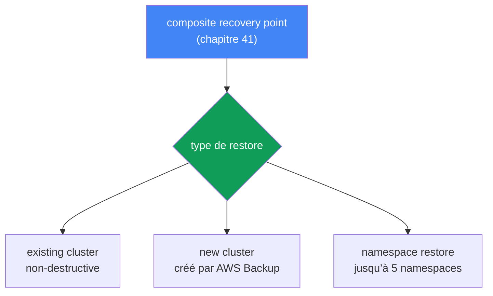
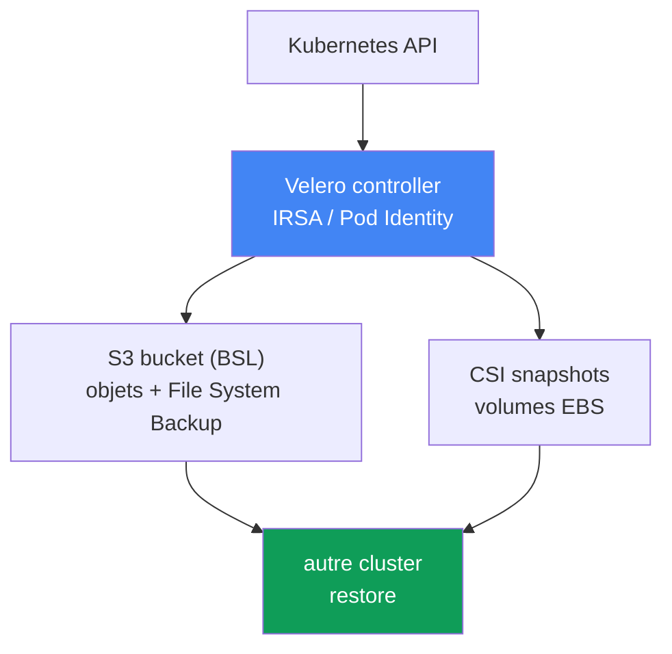

[Русская версия](ru.md) · [Eng version](en.md) · [Versión en español](es.md) · [Deutsche Version](de.md) · [ქართული ვერსია](ge.md) · [繁體中文版](tw.md) · [日本語版](jp.md)
# Chapitre 42. Restauration et DR : restore dans un cluster existant et nouveau, namespace-restore, Velero

> **À suivre.** Le chapitre 41 a présenté la sauvegarde : AWS Backup, le composite recovery point, l’état du cluster et les volumes dans un point cohérent unique. Mais une sauvegarde ne fait que la moitié du travail : une sauvegarde non vérifiée n’est pas une sauvegarde. Nous verrons ici comment repartir de ce point : restore dans un cluster existant et nouveau, restauration ciblée d’un namespace, Velero comme second outil, ainsi que RTO/RPO et les stratégies DR. Les sujets connexes sont traités dans d’autres chapitres : la sauvegarde elle-même et le composite recovery point au chapitre 41 ; l’attachement des volumes EBS à une AZ au chapitre 23 ; la connectivité multi-cluster et multi-compte pour le DR au chapitre 32 ; le rollback de version du cluster (ce n’est pas une restauration de données) au chapitre 39.

## 42.1. La sauvegarde existe, mais personne n’a essayé de la restaurer

Reprenons l’incident du chapitre 41 : quelqu’un a exécuté `kubectl delete namespace prod` dans le mauvais cluster. Cette fois, bonne nouvelle : le cluster dispose d’un backup plan et le composite recovery point d’hier est bien là, avec le statut `Completed`. L’astreinte ouvre la console AWS Backup, trouve le point et se heurte à des questions auxquelles personne n’a répondu à l’avance :

- Restaurer le cluster entier ou seulement le namespace `prod` ?
- Restaurer dans le même cluster (il est vivant, les autres namespaces fonctionnent) ou dans un nouveau ?
- Le restore va-t-il écraser ce qui se trouve actuellement dans le cluster ?
- Dans quelle AZ les volumes issus des snapshots seront-ils relevés et y trouveront-ils des nœuds ?
- Combien de temps cela prendra-t-il : des minutes ou des heures, et cela respecte-t-il le délai promis au métier ?

C’est tout l’enjeu du chapitre. Une sauvegarde sans restore éprouvé est une illusion de protection. Le premier vrai restore survient presque toujours pendant une urgence, sous pression, quand il n’y a pas le temps de lire la documentation. Pire encore, les scénarios diffèrent. Un seul namespace a été supprimé : il faut une restauration ciblée dans un cluster en service. Le cluster entier a été perdu, la région est indisponible, ou un ransomware a chiffré les données : il faut un restore dans un nouveau cluster, éventuellement dans une autre région ou un autre compte. Ce sont des opérations distinctes, avec des temps et des pièges différents ; il faut connaître les deux avant l’incident, et non pendant celui-ci.

Voici donc le plan du chapitre : d’abord le restore depuis AWS Backup (cluster existant, nouveau, cross-region et cross-account), puis le namespace-restore ciblé, ensuite Velero et le choix entre les outils, et enfin les concepts DR RTO/RPO et les pièges classiques du restore.

## 42.2. Restore depuis AWS Backup : trois scénarios

AWS Backup restaure un composite recovery point (chapitre 41) : à la fois l’état du cluster (objets Kubernetes) et les volumes associés. Règle essentielle : **le restore se fait toujours dans un target EKS cluster**, c’est-à-dire un cluster existant. On ne peut pas restaurer « dans le vide » : soit le cluster existe déjà, soit AWS Backup en crée un dans le cadre même du restore. Il en résulte trois scénarios :

| Scénario | Destination | Quand l’utiliser |
|---|---|---|
| Existing cluster restore | dans le cluster source ou un autre cluster existant | retour ciblé, cluster encore opérationnel |
| New cluster restore | AWS Backup crée un nouveau cluster et y restaure | catastrophe, perte du cluster/de la région |
| Namespace restore | dans un cluster existant, jusqu’à 5 namespaces | namespace supprimé, perte partielle |

Propriété importante de tous les restore AWS Backup : ils sont **non-destructive**. Un restore n’écrase pas les objets Kubernetes existants dans le target-cluster et ne modifie pas sa version. Si un objet existe déjà, il est ignoré plutôt qu’écrasé. Les objets ignorés sont visibles via les notifications SNS (il faut s’y abonner à l’avance). Cela protège un cluster vivant de toute corruption, mais signifie aussi qu’un restore au-dessus d’un objet corrompu ne le « réparera » pas ; voir la section consacrée aux pièges.

**Le restore dans un cluster existant** est destiné à un retour ciblé lorsque le cluster est vivant, mais qu’une partie des données ou objets a disparu. Prérequis : les CSI drivers nécessaires doivent déjà être installés dans le target-cluster (EBS/EFS/S3 via les add-ons, chapitre 23), sinon il n’y a aucun emplacement où monter les volumes.

**Le restore dans un nouveau cluster** est destiné à une catastrophe. AWS Backup crée lui-même le cluster, mais avec un ensemble d’options limité : nom, version Kubernetes, VPC/subnets, IAM role, security groups, node groups, Fargate profiles, pod identity associations. Pour un contrôle complet, le cluster est créé à l’avance (console/eksctl/Terraform) puis indiqué comme target. Lors de la création d’un nouveau cluster, AWS Backup ajoute un délai tampon d’environ 15 minutes après que le cluster est prêt, avant de créer les ressources, afin que les composants aient le temps de s’initialiser.



**Restore cross-region et cross-account.** Les copies du recovery point dans une autre région et un autre compte (chapitre 41) permettent de redémarrer après la perte de la région principale ou la compromission du compte. Le restore depuis une copie fonctionne de la même manière, mais ajoute des exigences : si le cluster source était chiffré, il faut un `encryptionConfigProviderKeyArn` avec une clé KMS de destination (sa propre clé pour cross-region/cross-account), et les IAM roles référencés par les workloads (IRSA, Pod Identity, OIDC-provider) doivent exister dans le compte et la région de destination. AWS Backup ne crée pas ces rôles ; voir la section 42.8 pour le remappage des ARN.

Le restore est lancé avec `aws backup start-restore-job` et des métadonnées EKS : `clusterName` est obligatoire ; pour un nouveau cluster, il faut `newCluster=true` et les champs imbriqués (`eksClusterVersion`, `clusterRole`, `clusterVpcConfig`, `nodeGroups`, `fargateProfiles`, `podIdentityAssociations`). Les autorisations sont apportées par la politique gérée `AWSBackupServiceRolePolicyForRestores`, et pour les buckets S3 par `AWSBackupServiceRolePolicyForS3Restore`.

## 42.3. Restauration ciblée (selective) d’un namespace

Un restore DR complet est une opération lourde : relever un cluster entier est nécessaire lorsqu’il n’existe plus. Bien plus souvent, le problème est plus limité : un namespace a été supprimé ou corrompu, tandis que le reste du cluster fonctionne. Exécuter un restore complet ici est nuisible : c’est long et risqué. C’est à cela que sert le namespace restore.

Un namespace restore restaure dans un cluster existant uniquement les namespaces indiqués (jusqu’à 5 à la fois), leurs ressources namespace-scoped et les persistent volumes qui leur appartiennent. Les ressources cluster-scoped (CRD, StorageClass, l’objet Namespace lui-même, PersistentVolume) sont exclues, à l’exception des PV liés aux volumes restaurés. La logique reste non-destructive : ce qui existe déjà dans le cluster n’est pas écrasé.

La différence essentielle avec un restore DR complet :

| | Namespace restore | Full/new cluster restore |
|---|---|---|
| Objectif | restaurer une partie dans un cluster vivant | relever entièrement le cluster |
| Contenu restauré | jusqu’à 5 namespaces + leurs volumes | tout l’état + tous les volumes |
| Ressources cluster-scoped | exclues (sauf les PV associés) | restaurées |
| Déclencheur typique | le namespace prod a été supprimé | perte du cluster/de la région |
| RTO | minutes à dizaines de minutes | heures |

En pratique, le namespace restore est un outil courant pour l’opérateur, tandis que le DR-restore dans un nouveau cluster est un événement lourd et rare. Les deux sont testés, mais différemment (section 42.8).

## 42.4. Ordre de restauration des objets

Lors d’un restore, l’ordre de création des objets est important : il faut créer les PVC avant les pods, les CRD avant les custom resources, le namespace avant ce qu’il contient. AWS Backup applique un ordre raisonnable par défaut : d’abord les ressources cluster-scoped (CustomResourceDefinitions, Namespaces, StorageClasses, PersistentVolumes), puis les namespace-scoped (PersistentVolumeClaims, Secrets, ConfigMaps, ServiceAccounts, LimitRanges, Pods, ReplicaSets). Cet ordre peut être remplacé si nécessaire par `kubernetesRestoreOrder` (format `group/version/kind` ou `version/kind`).

Après la restauration des objets vient l’attachement du stockage. Pour un snapshot EBS, il faut indiquer l’Availability Zone dans laquelle le volume sera créé ; AWS Backup essaiera de placer le pod dans cette même AZ pour que le volume puisse être monté (lien avec le chapitre 23). EFS est restauré sous un préfixe aléatoire et requiert la création manuelle d’un access point après le restore ; AWS Backup ne le crée pas lui-même.

## 42.5. Velero : backup et restore Kubernetes-native

Velero est un outil open source de sauvegarde et de restauration qui vit dans le cluster. À la différence d’AWS Backup (service AWS externe), Velero utilise l’API Kubernetes et est plus proche du cluster lui-même. Sa force est la portabilité : il peut restaurer dans **un autre** cluster, ce qui en fait à la fois un outil de migration et de DR.

L’intégration AWS est fournie par le plugin officiel velero-plugin-for-aws : il ajoute un object store plugin pour S3 (BSL) et un volume snapshotter plugin pour les snapshots EBS. Le plugin est indiqué par le flag `--plugins velero/velero-plugin-for-aws:<version>` avec `velero install`. Son fonctionnement :

- **Backup des objets.** Velero lit les objets via l’API Kubernetes et les place dans une archive tar dans un object storage, le bucket S3 défini par BackupStorageLocation (BSL).
- **Snapshots de volumes.** Les données PV sont capturées soit par CSI volume snapshots (snapshot EBS via le driver), soit par File System Backup (copie fichier par fichier du contenu du volume dans le même bucket, y compris entre fournisseurs).
- **Sélecteurs.** Un backup peut être limité par namespace (`--include-namespaces`) ou par label (`--selector`) : une couverture fine et ciblée jusqu’aux workloads individuels.
- **Planifications.** L’objet Schedule (`velero schedule create --schedule="0 2 * * *"`) crée un backup par cron ; la fréquence de la planification définit directement le RPO (section 42.7).
- **Backup hooks.** Avec les annotations `pre.hook.backup.velero.io/command` et `post.hook.backup.velero.io/command`, Velero exécute une commande dans le conteneur avant et après la sauvegarde : vider les buffers d’une base de données, geler puis dégeler le système de fichiers. C’est absent d’AWS Backup (chapitre 41) et constitue l’argument principal pour Velero avec les StatefulSets disposant d’un SGBD. La commande ne s’exécute pas dans un shell ; elle est donc écrite sous forme de liste d’arguments et non de chaîne avec des pipes.
- **Restore hooks.** Lors d’un restore, Velero peut lancer des init-containers et des exec-hooks dans les pods : par exemple, attendre que le volume soit prêt ou préchauffer l’état avant le démarrage de l’application.
- **Restore dans un autre cluster.** `velero restore create --from-backup <name>`, exécuté dans le cluster cible avec le même BSL, relève les workloads depuis le backup : c’est la base de la migration et du DR.

L’accès d’AWS à Velero ne repose pas sur des clés statiques, mais sur **IRSA ou EKS Pod Identity** (chapitres 16-17) : le ServiceAccount du contrôleur Velero est lié à un IAM-role ayant des autorisations sur le bucket S3 (BSL) et les snapshots EBS. C’est le même principe de moindre privilège que pour n’importe quel contrôleur du cluster.

**S3 Object Lock pour les backups Velero.** Les backups Velero résident dans un bucket S3, et le même IAM-role qui les écrit peut, par défaut, aussi les supprimer : lors d’une compromission du cluster ou d’un ransomware, les backups sont parmi les premiers éléments supprimés ou chiffrés. La protection du bucket vous incombe entièrement : il n’y a pas de Vault Lock géré comme avec AWS Backup. La réponse est S3 Object Lock (WORM) : activé sur le bucket (versioning requis), le mode Compliance rend les versions d’objets immuables pour la durée de retention, même root ne peut les supprimer. Ainsi, le backup survit autant à un `velero backup delete` erroné qu’à un attaquant ayant des droits sur le bucket.

Deux nuances déjouent les attentes. Premièrement, Object Lock protège les **versions d’objets**, mais n’interdit pas de placer un delete marker au-dessus. Un simple `DELETE` sans version id dans S3 renvoie `200 OK` ; la version protégée reste présente, mais devient non courante, disparaît du listing du bucket de backup et Velero ne la voit plus. WORM garantit donc la récupérabilité (il suffit de retirer le delete marker, les versions sont intactes), et non que le backup reste visible : il faut toujours surveiller la présence des points. Deuxièmement, la durée du verrouillage doit être cohérente avec le TTL de la planification, dans le bon sens : le TTL ne doit pas être inférieur à la durée Object Lock. Velero supprime un backup expiré par le même simple `DELETE`, donc il n’y aura pas d’échec `AccessDenied` ; lorsque le TTL est plus court que la période de verrouillage, le backup est considéré supprimé mais ses versions restent facturées jusqu’à la fin de la retention, et même une lifecycle rule ne les supprimera pas. L’erreur `AccessDenied` (403) concerne autre chose : une personne qui supprime explicitement une version avec version id, par exemple lors d’un nettoyage manuel du bucket, avec Batch Operations ou un script d’urgence pour libérer de l’espace.



## 42.6. Velero ou AWS Backup

Les outils ne s’excluent pas mutuellement, mais répondent à des besoins sous des angles différents. Guide de choix :

| Critère | AWS Backup | Velero |
|---|---|---|
| Nature | service AWS géré | k8s-native, installé dans le cluster |
| Unité | composite recovery point | Backup (objets + volumes) |
| Politiques/protection | backup plan, vault, Vault Lock (WORM) | retention Schedule ; protection du bucket : S3 Object Lock (WORM), à votre charge |
| Portabilité | au sein d’AWS (cross-region/account) | entre clusters, distributions et clouds |
| Selective | namespace restore (jusqu’à 5) | granulaire : namespace, label, ressources |
| Migration | pas le cas d’usage principal | cas d’usage principal |

En bref : **AWS Backup** convient lorsqu’une sauvegarde gérée avec des politiques centralisées, des composite-points et l’immuabilité (Vault Lock) est nécessaire dans AWS. **Velero** convient lorsqu’il faut de la portabilité et de la migration entre clusters et clouds, une sélection fine et une gestion Kubernetes-native des backups. De nombreuses équipes conservent les deux : AWS Backup pour la politique et le DR dans AWS, Velero pour les migrations et restaurations granulaires.

## 42.7. Concepts DR : RTO, RPO et stratégies

Toute discussion sur le restore ramène à deux métriques :

- **RTO (recovery time objective)** : le délai dans lequel le service doit revenir après un incident.
- **RPO (recovery point objective)** : le volume de données qu’il est acceptable de perdre, autrement dit le point passé auquel on revient. **Le RPO est directement défini par la fréquence de backup** : un backup quotidien implique un RPO allant jusqu’à une journée ; une planification Velero horaire donne un RPO d’environ une heure.

AWS distingue quatre stratégies DR dont le coût augmente et le RTO/RPO baisse (Well-Architected) :

| Stratégie | RPO / RTO | Principe |
|---|---|---|
| Backup and restore | RPO en heures, RTO jusqu’à un jour | backup dans une autre région, restore au moment de l’incident |
| Pilot light | RPO en minutes, RTO en dizaines de minutes | données répliquées, cœur éteint, activé lors de l’incident |
| Warm standby | inférieur | copie réduite toujours active, mise à l’échelle lors de l’incident |
| Multi-site active-active | proche de zéro | fonctionnement complet simultané dans plusieurs régions |

Pour un cluster EKS typique, la restauration depuis AWS Backup ou Velero correspond à la stratégie **backup and restore** : elle est économique, mais le RTO se mesure en heures (relever le cluster, restaurer l’état et les volumes, recréer les load balancers et DNS). Passer à pilot light et au-delà implique déjà un cluster de secours prêt et une réplication des données vers une autre région (connectivité : chapitre 32), donc un coût supérieur. Le choix de la stratégie est un compromis conscient entre RTO/RPO et coût, et non « rendons-le plus fiable ».

## 42.8. Pièges du restore

Un restore échoue non pas à cause du backup, mais à cause des détails de l’environnement. Voici ce qu’il faut vérifier à l’avance :

- **Attachement d’un PV à une AZ.** Un volume est restauré depuis un snapshot dans une AZ précise, et le pod doit se trouver dans cette même AZ, sinon le volume ne se monte pas (chapitre 23). Pour les nouveaux PVC, `volumeBindingMode: WaitForFirstConsumer` et le topology-aware provisioning aident ; lors d’un restore depuis un snapshot, l’AZ est fixée par le snapshot et des nœuds doivent exister dans l’AZ cible.
- **`nodeSelector`, affinity et taints stricts.** Les manifests restaurés portent les contraintes de nœuds du cluster source, tandis que le parc du cluster cible est différent : labels de pools différents, type d’instance requis absent, taints propres. Les pods seront créés puis resteront indéfiniment en `Pending` avec `node(s) didn't match Pod's node affinity/selector` ou `node(s) had untolerated taint`. Point essentiel : le scheduler compare les **labels**, non les noms de node group ou NodePool. Le cluster DR est donc préparé selon les labels, pas en renommant les pools : les clés et valeurs sélectionnées par le workload doivent correspondre (`karpenter.sh/nodepool`, `karpenter.sh/capacity-type`, `kubernetes.io/arch`, labels au préfixe `eks.amazonaws.com` pour les managed node groups). Le même effet se produit avec `topologySpreadConstraints` et `whenUnsatisfiable: DoNotSchedule` si le cluster cible a moins de zones. Avec Velero, cela se corrige à la volée : Resource Modifiers, un ConfigMap de JSON-patches, est connecté avec le flag `--resource-modifier-configmap`; l’opération `remove` retire le `nodeSelector` ou remplace un label (les conditions des règles sont écrites pour le namespace SOURCE, même si le restore utilise `--namespace-mappings`). AWS Backup ne permet pas de muter les manifests : les labels du cluster cible sont alignés à l’avance sur ceux de la source, ou les objets sont modifiés après le restore.
- **Non-destructive et cluster vivant.** Le restore n’écrase pas les objets existants. Si l’objet est corrompu mais présent, le restore l’ignore : pour revenir à une « bonne » version, il faut d’abord supprimer l’objet puis le restaurer. Les champs immuables (par exemple le selector d’un Deployment, une partie des champs d’un Service) donnent aussi lieu à une omission en cas de conflit, pas à un écrasement.
- **Remappage d’IRSA/Pod Identity et des ARN.** Lors d’un restore dans un autre compte ou une autre région, les rôles IRSA, l’OIDC-provider et les Pod Identity associations du compte source n’y existent pas. Un SA avec une annotation pointant vers l’ancien ARN de rôle ne fonctionnera pas tant que les rôles n’auront pas été recréés dans le compte cible.
- **Load balancers et DNS.** Les NLB/ALB et les enregistrements Route 53 sont liés à l’environnement source. Après un restore, AWS Load Balancer Controller recrée les load balancers (chapitres 26-28), et external-dns et cert-manager recréent DNS et certificats (chapitre 29) ; les adresses et ARN changent, ce qui doit être prévu dans le plan.
- **Ordre et versions.** Viennent d’abord namespace et CRD, puis StorageClass et PV, puis les workloads (section 42.4). Les versions API des objets doivent être prises en charge par le cluster cible : un restore entre versions Kubernetes très différentes est best effort et peut rencontrer des incompatibilités.
- **Images et registres.** Le backup ne stocke pas les images de conteneurs (chapitre 41). Le compte ou la région cible doit pouvoir accéder à ECR ou au registre d’où les images sont téléchargées, sinon les pods ne démarrent pas.

Et la règle principale : les restore sont testés régulièrement, sans attendre un incident. Chaque trimestre, organisez un game day : restaurez un recovery point (ou un backup Velero) dans un namespace séparé ou un cluster temporaire et mesurez le RTO réel. Un restore vérifié lors d’un game day est le seul sur lequel on puisse s’appuyer pendant un incident.

## 42.9. Game day : simulation de défaillance d’une région (region failover)

Les stratégies DR (section 42.7) et la pratique du game day ont été décrites séparément ; réunissons-les dans un scénario concret : l’arrêt complet de la région principale. C’est un restore lourd dans un nouveau cluster (section 42.2), depuis une copie cross-region (chapitre 41), avec basculement du trafic via DNS. Il est exécuté comme un exercice par étapes en mesurant les RTO/RPO réels :

1. **Déclarer le failover.** La région principale est indisponible ; basculez vers la région de secours choisie à l’avance, où se trouvent les copies cross-region du recovery point (chapitre 41).
2. **Relever le cluster.** Soit un cluster warm standby / blue-green est déjà prêt, soit créez-en un nouveau (eksctl/Terraform) ; les prérequis sont que les IAM roles IRSA/Pod Identity, l’OIDC-provider et l’accès à ECR soient créés à l’avance dans la région de secours (section 42.8).
3. **Restaurer l’état et les volumes.** Utilisez `aws backup start-restore-job` depuis la copie cross-region avec la clé KMS de destination (section 42.2), ou `velero restore create` depuis S3 dans le cluster cible.
4. **Vérifier la connectivité.** Vérifiez le réseau multirégion ainsi que l’accès aux données et dépendances de la région de secours en suivant le chapitre 32.
5. **Vérifier les données.** Avant de basculer le trafic, assurez-vous que les volumes sont montés et les données intactes : smoke-test de l’application et comparaison avec le moment de la copie restaurée (RPO), et non « les pods ont démarré, donc c’est prêt ».
6. **Basculer le trafic.** Route 53 redirige les enregistrements vers la nouvelle région au moyen de weighted/failover records avec health check (chapitre 29) : le failover-record détourne le trafic vers la région de secours lorsque le health check principal est « rouge » ; les load balancers sont recréés par le contrôleur (section 42.8).
7. **Mesurer RTO/RPO.** Consignez le temps réellement nécessaire au retour du service (RTO) et le point de données de la copie (RPO), puis comparez-les aux objectifs du SLA (section 42.7) ; l’écart constitue l’entrée du prochain game day.

La mesure dans laquelle les étapes 2-3 déterminent le RTO dépend de la stratégie DR choisie (section 42.7) : avec backup and restore, cluster et données sont relevés à partir de zéro, donc le RTO est de plusieurs heures ; avec pilot light/warm standby, la région de secours est déjà partiellement active et le failover se limite à une mise à l’échelle et au basculement Route 53.

## 42.10. Application en production

- **Écrire le runbook de restore à l’avance.** Prévoir un scénario pour les deux cas (namespace-restore dans un cluster vivant et restore complet dans un nouveau) avec commandes et responsables, plutôt que « nous verrons sur place ».
- **Organiser régulièrement un game day.** Chaque trimestre, restaurez un point récent dans un namespace distinct ou un cluster temporaire et consignez le RTO réel par rapport à l’objectif.
- **Préparer à l’avance le compte cible pour le DR.** Créez IAM roles IRSA/Pod Identity, OIDC-provider, security groups et accès ECR dans le compte DR avant l’incident, non au moment du restore. Cela inclut les labels des pools de nœuds : les clés et valeurs selon lesquelles les workloads choisissent un nœud doivent exister dans le cluster de secours, sinon les pods restaurés resteront en `Pending`.
- **S’abonner à SNS pour les objets ignorés.** Un restore non-destructive ignore silencieusement les objets existants ; sans notification des omissions, une restauration incomplète est facile à obtenir.
- **Fixer RTO/RPO dans le SLA.** La fréquence de backup (RPO) et le délai cible de restauration (RTO) doivent être convenus avec le métier et vérifiés par rapport à la stratégie DR, non choisis à vue d’œil.
- **Conserver les deux outils de manière intentionnelle.** AWS Backup sert à la politique et au DR dans AWS ; Velero sert à la migration et aux restaurations selective fines ; il faut savoir pour chacun quand il est l’outil principal.

## 42.11. Mini-glossaire

- **restore job** : tâche de restauration AWS Backup ; lancée par `start-restore-job`, suivie avec `list-restore-jobs`/`describe-restore-job`.
- **target EKS cluster** : cluster existant dans lequel se fait le restore ; ou cluster créé par AWS Backup pendant le restore (`newCluster=true`).
- **non-destructive restore** : mode dans lequel les objets existants ne sont pas écrasés, mais ignorés (les omissions sont visibles via SNS).
- **namespace restore** : restauration ciblée d’un maximum de 5 namespaces dans un cluster existant, sans ressources cluster-scoped (sauf les PV associés).
- **Velero** : backup/restore Kubernetes-native ; objets dans S3 (BackupStorageLocation), volumes via CSI snapshots ou File System Backup.
- **BackupStorageLocation (BSL)** : emplacement de stockage des backups Velero (bucket S3).
- **velero-plugin-for-aws** : plugin Velero officiel pour AWS : object store S3 (BSL) et volume snapshotter pour les snapshots EBS.
- **S3 Object Lock** : protection WORM d’un bucket S3 : immuabilité des versions d’objets pendant la retention (Governance/Compliance), protège les backups Velero contre suppression et chiffrement.
- **Schedule** : objet Velero de backup périodique par cron ; définit le RPO.
- **restore hook** : init-container ou commande exec lancée par Velero lors du restore d’un pod.
- **Resource Modifiers** : ConfigMap Velero contenant des JSON-patches appliqués aux objets lors du restore (`--resource-modifier-configmap`) ; permet de supprimer les champs incompatibles avec le cluster cible.
- **RTO** : délai cible de restauration du service après un incident.
- **RPO** : volume de perte de données acceptable ; défini par la fréquence de backup.

## 42.12. Bilan du chapitre

- Une sauvegarde non vérifiée n’est pas une sauvegarde : le premier restore ne doit pas attendre l’incident, il est pratiqué à l’avance lors d’un game day.
- Les scénarios de restore sont distincts : namespace-restore ciblé dans un cluster vivant et DR-restore complet dans un nouveau cluster sont des opérations différentes, avec des RTO et pièges différents.
- AWS Backup restaure toujours dans un target EKS cluster : un cluster existant ou créé par lui ; tous les restore sont non-destructive et n’écrasent ni les objets existants ni la version du cluster.
- Namespace restore restaure jusqu’à 5 namespaces avec leurs volumes dans un cluster existant, en excluant les ressources cluster-scoped à l’exception des PV associés.
- Le restore cross-region et cross-account depuis les copies (chapitre 41) est la base du DR ; il requiert une clé KMS de destination et des IAM roles créés à l’avance dans le compte cible.
- L’ordre de restore est important : d’abord CRD/Namespaces/StorageClasses/PV, puis PVC/Secrets/pods ; un volume EBS est relevé dans l’AZ du snapshot et EFS exige un access point manuel.
- Velero est un backup/restore Kubernetes-native : objets dans S3 (BSL), volumes via CSI ou File System Backup, sélecteurs, Schedule, restore hooks et restore dans un autre cluster (migration et DR).
- AWS Backup est géré, composite, avec Vault Lock ; Velero est portable, selective et destiné à la migration entre clusters et clouds ; les deux sont souvent conservés ; le bucket Velero est protégé par S3 Object Lock.
- Le RPO est défini par la fréquence de backup ; les stratégies DR (backup and restore, pilot light, warm standby, multi-site) constituent un compromis RTO/RPO contre coût.
- Les pièges du restore comprennent : AZ des volumes, labels de nœuds avec `nodeSelector` strict et taints, omissions non-destructive, remappage IRSA/ARN, recréation des load balancers et DNS, ordre et compatibilité des versions, accès aux images.

## 42.13. Utilité en situation réelle

En astreinte, ce chapitre est ce qui transforme une sauvegarde en restauration effective. Lorsqu’un namespace est supprimé ou qu’un cluster est perdu, la question n’est pas « y a-t-il un backup » (cela a été vérifié au chapitre 41), mais « en combien de temps et comment le relever ». La réponse doit figurer dans le runbook avant l’incident : quel type de restore pour quel scénario, dans quel cluster, quels prérequis (CSI drivers, IAM roles, accès ECR) et quel RTO attendre. Lors de l’incident, la restauration suit ce runbook, sans improvisation.

Pour la planification du cluster, cela ajoute des points obligatoires : RTO/RPO convenus avec le métier et stratégie DR associée ; restore testé pendant un game day (namespace et complet) ; compte DR prêt avec rôles et accès recréés ; prise en compte que le restore recrée les LB et DNS et que les volumes sont liés à une AZ. Avec le backup du chapitre 41, cela donne une boucle complète de protection : backup plus restore vérifié plus plan DR avec RTO/RPO, soit une protection réelle et non une illusion.

## 42.14. Questions d’autoévaluation

1. Pourquoi une sauvegarde non vérifiée n’est-elle pas considérée comme une sauvegarde, et que fait-on concrètement ?
2. En quoi un restore dans un cluster existant diffère-t-il d’un restore dans un nouveau cluster selon le scénario ?
3. Que signifie non-destructive restore dans AWS Backup et quelle conséquence cette propriété entraîne-t-elle ?
4. Que restaure un namespace restore et quelles ressources exclut-il ?
5. Pourquoi le restore s’exécute-t-il dans un target EKS cluster et que fait AWS Backup avec `newCluster=true` ?
6. Quelles exigences supplémentaires apparaissent pour un restore cross-region et cross-account ?
7. Dans quel ordre AWS Backup restaure-t-il les objets et pourquoi cet ordre est-il important ?
8. Comment Velero sauvegarde-t-il objets et volumes, et en quoi File System Backup diffère-t-il d’un CSI snapshot ?
9. Comment Velero restaure-t-il dans un autre cluster et pourquoi nécessite-t-il IRSA ou Pod Identity ?
10. Quand choisir AWS Backup, quand choisir Velero, et pourquoi les deux sont-ils souvent conservés ?
11. Que sont RTO et RPO, et comment la fréquence de backup est-elle liée au RPO ?
12. En quoi les stratégies DR (backup and restore, pilot light, warm standby, multi-site) diffèrent-elles ?
13. Pourquoi un volume EBS restauré peut-il ne pas se monter et quel est le lien avec l’AZ (chapitre 23) ?
14. Quels pièges attendent un restore dans un autre compte : rôles, load balancers, DNS, images ?
15. Pourquoi les pods restaurés peuvent-ils rester définitivement en `Pending` dans un cluster DR, et que peut-on ou ne peut-on pas faire ici avec Velero et AWS Backup ?
16. Que protège exactement S3 Object Lock pour les backups Velero, pourquoi un delete marker au-dessus d’une version protégée passe-t-il, et quel est le lien avec le TTL de la planification ?

## Pratique

Le lab du cours associé à ce thème : [lab 122 - AWS Backup pour EKS](../../labs/122/README_FR.MD). Vous y effectuez un namespace-restore dans un cluster vivant, observez le comportement non-destructive (les objets existants ne sont pas écrasés) et examinez pourquoi un rollback de version du cluster ne restaure pas un namespace supprimé ; la vérification se fait avec `check_result`. Exécution : `TASK=122 make run_eks_task`.

En plus du lab, l’état de restauration est visible depuis les outils. Commencez par AWS Backup : consultez les points disponibles et lancez un restore de test dans un namespace séparé, et non dans prod.

```bash
# historique des restore jobs (statuts, durée)
aws backup list-restore-jobs
# détails d’une tâche de restauration précise
aws backup describe-restore-job --restore-job-id <id>
```

Le lancement de restauration s’effectue via `start-restore-job` avec les métadonnées EKS (au minimum `clusterName`) ; pour un namespace-restore, indiquez le cluster cible et les noms de namespaces. Vérifiez l’ensemble complet des champs de métadonnées dans la documentation AWS Backup afin de ne pas vous tromper pendant une urgence.

Pour Velero, vérifiez que les backups sont créés et restaurés, puis pratiquez un restore dans un namespace de test :

```bash
# liste des backups et des planifications
velero backup get
velero schedule get
# restaurer entièrement un backup ou uniquement un namespace dans l’environnement de test
velero restore create --from-backup <backup> --include-namespaces test-restore
# statuts des restaurations
velero restore get
```

La pratique principale de ce chapitre est le game day régulier : chaque trimestre, restaurez un point récent dans un namespace séparé ou un cluster temporaire et mesurez le RTO réel. Pour le backup lui-même et le composite recovery point, voir le chapitre 41 ; pour l’attachement des volumes à une AZ, le chapitre 23 ; pour la connectivité multi-cluster pour le DR, le chapitre 32 ; pour le rollback de version du cluster (ce n’est pas une restauration de données), le chapitre 39.

---
[Table des matières](../README_FR.md) · [Chapitre 41](../41/fr.md) · [Chapitre 43](../43/fr.md)
