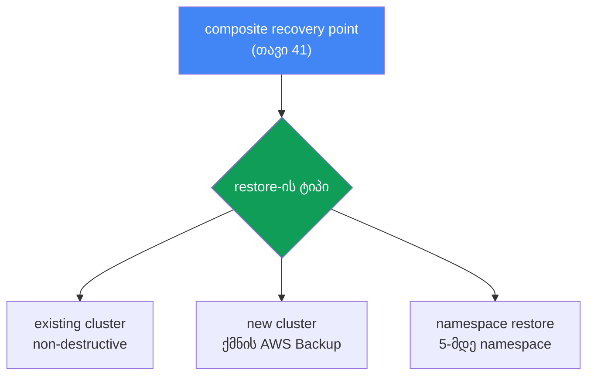
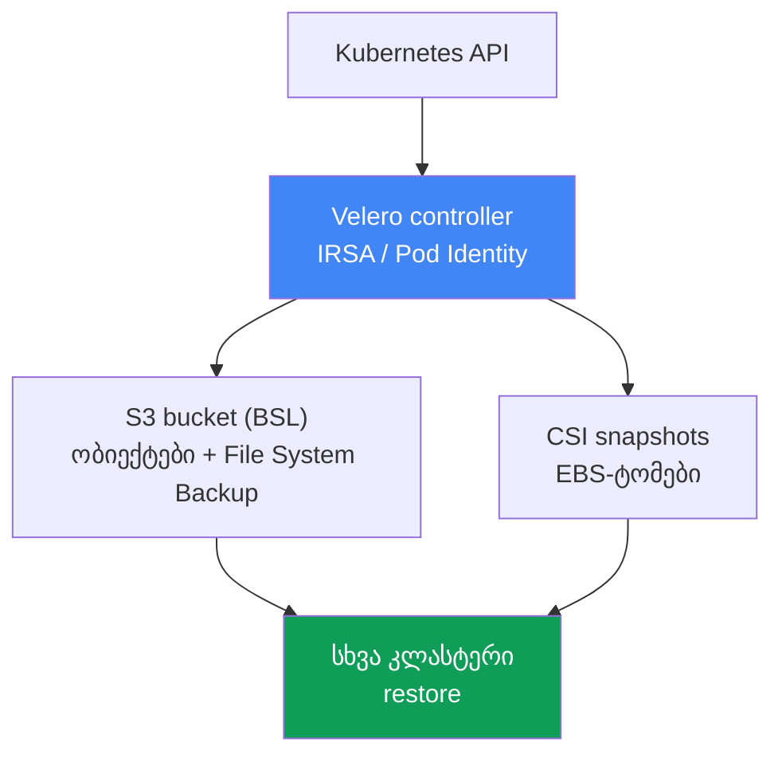

[რუსული ვერსია](ru.md) · [Eng version](en.md) · [Versión en español](es.md) · [Version française](fr.md) · [Deutsche Version](de.md) · [繁體中文版](tw.md) · [日本語版](jp.md)
# თავი 42. აღდგენა და DR: restore არსებულ და ახალ კლასტერში, namespace-restore, Velero

> **რა არის შემდეგ.** 41-ე თავმა ბექაპი მოგვცა: AWS Backup, composite recovery point, კლასტერის
> მდგომარეობა და ტომები ერთ შეთანხმებულ წერტილში. მაგრამ ბექაპი საქმის მხოლოდ ნახევარია:
> შეუმოწმებელი ბექაპი ბექაპი არ არის. აქ განვიხილავთ, როგორ აღვადგინოთ ამ წერტილიდან: restore
> არსებულ და ახალ კლასტერში, namespace-ის წერტილოვანი აღდგენა, Velero როგორც მეორე ინსტრუმენტი,
> ასევე RTO/RPO და DR-ის სტრატეგიები. მომიჯნავე თემები სხვა თავებშია: თავად ბექაპი და composite
> recovery point - თავი 41; EBS-ტომების AZ-თან მიბმა - თავი 23; DR-ისთვის მულტიკლასტერული და
> მულტიაკაუნტური კავშირი - თავი 32; კლასტერის ვერსიის უკან დაბრუნება (ეს მონაცემების restore არ
> არის) - თავი 39.

## 42.1. ბექაპი არსებობს, მაგრამ მისგან აღდგენა არავის უცდია

დავუბრუნდეთ 41-ე თავის ინციდენტს: ვიღაცამ `kubectl delete namespace prod` არასწორ კლასტერში
შეასრულა. ამჯერად კარგი ამბავიც გვაქვს: კლასტერს backup plan აქვს, გუშინდელი composite recovery
point ადგილზეა და მისი სტატუსია `Completed`. მორიგე ხსნის AWS Backup-ის კონსოლს, პოულობს წერტილს
და აწყდება კითხვებს, რომლებზეც წინასწარ არავის უპასუხია:

- მთელი კლასტერი უნდა აღდგეს თუ მხოლოდ namespace `prod`?
- აღდგენა იმავე კლასტერში უნდა მოხდეს (ის მუშაობს, დანარჩენი namespace-ები ფუნქციონირებს) თუ ახალში?
- გადაწერს თუ არა restore იმას, რაც ახლა კლასტერშია?
- რომელ AZ-ში შეიქმნება ტომები სნეპშოტებიდან და იპოვიან თუ არა იქ ნოდებს?
- რამდენ ხანს გასტანს ეს - წუთებს თუ საათებს, და ჩაეტევა თუ არა ბიზნესისთვის დაპირებულ ვადაში?

ეს არის ამ თავის მთავარი პრობლემა. ბექაპი გამოცდილი restore-ის გარეშე დაცვის ილუზიაა. პირველი
ნამდვილი restore თითქმის ყოველთვის ავარიის დროს ხდება, წნეხის ქვეშ, როდესაც დოკუმენტაციის
წასაკითხად დრო არ არის. უფრო მეტიც, სცენარები განსხვავებულია. წაიშალა ერთი namespace - საჭიროა
წერტილოვანი აღდგენა მოქმედ კლასტერში. მთლიანად დაიკარგა კლასტერი, რეგიონი მწყობრიდან გამოვიდა (ან
ransomware-მა მონაცემები დაშიფრა) - საჭიროა restore ახალ კლასტერში, შესაძლოა სხვა რეგიონში ან
აკაუნტში. ეს სხვადასხვა ოპერაციაა, განსხვავებული დროითა და ხაფანგებით, და ორივე ინციდენტამდე უნდა
იცოდეთ და არა ინციდენტის დროს.

აქედან გამომდინარეობს თავის გეგმაც: ჯერ restore AWS Backup-იდან (არსებული და ახალი კლასტერი,
cross-region და cross-account), შემდეგ namespace-ის წერტილოვანი restore, შემდეგ Velero და
ინსტრუმენტებს შორის არჩევანი, ბოლოს კი DR-ის კონცეფციები RTO/RPO და restore-ის ტიპური ხაფანგები.

## 42.2. Restore AWS Backup-იდან: სამი სცენარი

AWS Backup აღადგენს composite recovery point-ს (თავი 41): კლასტერის მდგომარეობას (Kubernetes-ის
ობიექტებს) და დაკავშირებულ ტომებს ერთად. მთავარი წესი: **restore ყოველთვის target EKS cluster-ში
ხდება** - უკვე არსებულ კლასტერში. „სიცარიელეში“ აღდგენა შეუძლებელია: კლასტერი ან უკვე არსებობს, ან
AWS Backup თავად restore-ის ფარგლებში ქმნის ახალს. აქედან გამომდინარეობს სამი სცენარი:

| სცენარი | სად | როდის გამოიყენება |
|---|---|---|
| Existing cluster restore | საწყის ან სხვა არსებულ კლასტერში | წერტილოვანი დაბრუნება, კლასტერი მუშაობს |
| New cluster restore | AWS Backup ქმნის ახალ კლასტერს და მასში აღადგენს | კატასტროფა, კლასტერის/რეგიონის დაკარგვა |
| Namespace restore | არსებულ კლასტერში, 5-მდე namespace | namespace წაიშალა, ნაწილობრივი დანაკარგია |

AWS Backup-ის ყველა restore-ის მნიშვნელოვანი თვისებაა, რომ ისინი **non-destructive** არის. Restore
არ გადაწერს target-კლასტერში არსებულ Kubernetes-ის ობიექტებს და არ ცვლის მის ვერსიას. თუ ობიექტი
უკვე არსებობს, ის გამოტოვდება და არ გადაიწერება. გამოტოვებული ობიექტები SNS-შეტყობინებებში ჩანს
(მათზე წინასწარ უნდა გამოიწეროთ). ეს მოქმედ კლასტერს დაზიანებისგან იცავს, თუმცა იმასაც ნიშნავს,
რომ restore დაზიანებულ არსებულ ობიექტს ვერ „შეაკეთებს“ - ამის შესახებ ხაფანგების სექციაში ვისაუბრებთ.

**Restore არსებულ კლასტერში** გამოიყენება წერტილოვანი დაბრუნებისთვის, როდესაც კლასტერი მუშაობს,
მაგრამ მონაცემების ან ობიექტების ნაწილი გაქრა. წინაპირობა: target-კლასტერში საჭირო CSI-დრაივერები
(EBS/EFS/S3 ადონების მეშვეობით, თავი 23) უკვე დაყენებული უნდა იყოს, წინააღმდეგ შემთხვევაში ტომები
ვერსად დამაუნტდება.

**Restore ახალ კლასტერში** კატასტროფისთვის გამოიყენება. AWS Backup კლასტერს თავად ქმნის, თუმცა
ოფციების შეზღუდული ნაკრებით: სახელი, Kubernetes-ის ვერსია, VPC/ქვექსელები, IAM role, security groups,
node groups, Fargate profiles, pod identity associations. სრული კონტროლისთვის კლასტერს წინასწარ
ქმნიან (კონსოლი/eksctl/Terraform) და მას target-ად უთითებენ. ახალი კლასტერის შექმნისას AWS Backup
კლასტერის მზადყოფნის შემდეგ დაახლოებით 15-წუთიან ბუფერს ამატებს და მხოლოდ ამის შემდეგ ქმნის
რესურსებს, რათა კომპონენტებმა ინიციალიზაცია მოასწრონ.



**Cross-region და cross-account restore.** სხვა რეგიონსა და აკაუნტში არსებული recovery point-ის
ასლები (თავი 41) გამოიყენება ძირითადი რეგიონის დაკარგვის ან აკაუნტის კომპრომეტირებისას. ასლიდან
restore იმავე პრინციპით მუშაობს, მაგრამ დამატებითი მოთხოვნები აქვს: თუ საწყისი კლასტერი დაშიფრული
იყო, საჭიროა `encryptionConfigProviderKeyArn` დანიშნულების KMS-გასაღებით (საკუთარი გასაღები
cross-region/cross-account სცენარისთვის), ხოლო IAM-როლები, რომლებზეც დატვირთვები მიუთითებდა (IRSA,
Pod Identity, OIDC-პროვაიდერი), დანიშნულების აკაუნტსა და რეგიონში უნდა არსებობდეს. AWS Backup ამ
როლებს არ ქმნის - ARN-ების ხელახლა ასახვის შესახებ იხილეთ სექცია 42.8.

Restore იწყება `aws backup start-restore-job` ბრძანებით EKS-ის მეტამონაცემებთან ერთად: `clusterName`
სავალდებულოა, ახალი კლასტერისთვის კი საჭიროა `newCluster=true` და ჩადგმული ველები
(`eksClusterVersion`, `clusterRole`, `clusterVpcConfig`, `nodeGroups`, `fargateProfiles`,
`podIdentityAssociations`). უფლებებს მართვადი პოლიტიკა `AWSBackupServiceRolePolicyForRestores`
იძლევა, S3-ბაკეტებისთვის კი - `AWSBackupServiceRolePolicyForS3Restore`.

## 42.3. Namespace-ის წერტილოვანი (selective) აღდგენა

სრული DR-restore მძიმე ოპერაციაა: მთელი კლასტერის თავიდან აწევა საჭიროა, როდესაც ის აღარ არსებობს.
გაცილებით ხშირად პრობლემა მცირეა: ერთი namespace წაიშალა ან დაზიანდა, დანარჩენი კლასტერი კი
მუშაობს. სრული restore აქ საზიანოა - დიდხანს გრძელდება და სარისკოა. ამისთვის არსებობს namespace
restore.

Namespace restore არსებულ კლასტერში აღადგენს მხოლოდ მითითებულ namespace-ებს (ერთ ჯერზე 5-მდე),
მათ namespace-scoped რესურსებსა და მათთან დაკავშირებულ მუდმივ ტომებს. Cluster-scoped რესურსები
(CRD, StorageClass, თავად Namespace ობიექტი, PersistentVolume) ამ დროს გამოირიცხება, გარდა
აღსადგენ ტომებთან დაკავშირებული PV-ებისა. აქაც იგივე non-destructive ლოგიკა მოქმედებს: ის, რაც
კლასტერში უკვე არსებობს, არ გადაიწერება.

სრული DR-restore-ისგან განსხვავება არსებითად ასეთია:

| | Namespace restore | Full/new cluster restore |
|---|---|---|
| მიზანი | ნაწილის დაბრუნება მოქმედ კლასტერში | კლასტერის თავიდან აწევა |
| რა აღდგება | 5-მდე namespace + მათი ტომები | მთელი მდგომარეობა + ყველა ტომი |
| Cluster-scoped რესურსები | გამორიცხულია (დაკავშირებული PV-ების გარდა) | აღდგება |
| ტიპური ტრიგერი | namespace prod წაიშალა | კლასტერის/რეგიონის დაკარგვა |
| RTO | წუთები ან ათეულობით წუთი | საათები |

პრაქტიკული აზრი ასეთია: namespace restore ოპერატორის ყოველდღიური სტანდარტული ინსტრუმენტია, ახალ
კლასტერში DR-restore კი იშვიათი და მძიმე მოვლენა. ორივეს ტესტირება სჭირდება, თუმცა სხვადასხვა გზით
(სექცია 42.8).

## 42.4. ობიექტების აღდგენის თანმიმდევრობა

Restore-ის დროს ობიექტების შექმნის თანმიმდევრობა მნიშვნელოვანია: PVC პოდებზე ადრე უნდა შეიქმნას,
CRD - custom-რესურსებზე ადრე, namespace კი - მის შიგნით მოთავსებულ რესურსებზე ადრე. AWS Backup
ნაგულისხმევად გონივრულ თანმიმდევრობას იყენებს: ჯერ cluster-scoped რესურსები
(CustomResourceDefinitions, Namespaces, StorageClasses, PersistentVolumes), შემდეგ namespace-scoped
რესურსები (PersistentVolumeClaims, Secrets, ConfigMaps, ServiceAccounts, LimitRanges, Pods,
ReplicaSets). საჭიროების შემთხვევაში ეს თანმიმდევრობა `kubernetesRestoreOrder`-ით იცვლება (ფორმატი
`group/version/kind` ან `version/kind`).

ობიექტების აღდგენის შემდეგ საცავის მიბმა ხდება. EBS-სნეპშოტისთვის უნდა მიეთითოს Availability Zone,
სადაც ტომი შეიქმნება; AWS Backup შეეცდება პოდი იმავე AZ-ში გაუშვას, რათა ტომი დამაუნტდეს (კავშირი
23-ე თავთან). EFS შემთხვევით პრეფიქსზე აღდგება და restore-ის შემდეგ access point-ის ხელით შექმნას
მოითხოვს - AWS Backup მას თავად არ ქმნის.

## 42.5. Velero: Kubernetes-native backup და restore

Velero ბექაპისა და აღდგენის ღია ინსტრუმენტია, რომელიც კლასტერის შიგნით მუშაობს. AWS Backup-ისგან
(AWS-ის გარე სერვისი) განსხვავებით, Velero Kubernetes API-ის მეშვეობით მუშაობს და თავად
კლასტერთან უფრო ახლოსაა. მისი ძლიერი მხარე პორტირებადობაა: მას შეუძლია restore **სხვა** კლასტერში,
რაც მას როგორც მიგრაციის, ისე DR-ის ინსტრუმენტად აქცევს.

AWS-თან ინტეგრაციას ოფიციალური velero-plugin-for-aws პლაგინი უზრუნველყოფს: ის ამატებს object store
plugin-ს S3-ისთვის (BSL) და volume snapshotter plugin-ს EBS-სნეპშოტებისთვის. პლაგინი `velero
install`-ის დროს `--plugins velero/velero-plugin-for-aws:<ვერსია>` ალმით მიეთითება. მისი მოწყობა
ასეთია:

- **ობიექტების Backup.** Velero ობიექტებს Kubernetes API-ის მეშვეობით კითხულობს და tarball-ის სახით
  BackupStorageLocation-ით (BSL) მითითებულ ობიექტურ საცავში, S3-ბაკეტში ათავსებს.
- **ტომების სნეპშოტები.** PV-ის მონაცემები ინახება ან CSI volume snapshots-ის მეშვეობით (EBS-ის
  სნეპშოტი დრაივერის საშუალებით), ან File System Backup-ით (ტომის შიგთავსის ფაილური კოპირება იმავე
  ბაკეტში, რომელიც სხვადასხვა პროვაიდერს შორისაც მუშაობს).
- **სელექტორები.** Backup შეიძლება შეიზღუდოს namespace-ის (`--include-namespaces`) ან label-ის
  (`--selector`) მიხედვით, რაც ცალკეულ დატვირთვებამდე ზუსტ და წერტილოვან დაფარვას იძლევა.
- **განრიგები.** Schedule ობიექტი (`velero schedule create --schedule="0 2 * * *"`) backup-ს cron-ის
  მიხედვით ქმნის; განრიგის სიხშირე პირდაპირ განსაზღვრავს RPO-ს (სექცია 42.7).
- **Backup hooks.** ანოტაციებით `pre.hook.backup.velero.io/command` და
  `post.hook.backup.velero.io/command` Velero ბექაპამდე და მის შემდეგ კონტეინერში ბრძანებას ასრულებს:
  მაგალითად, მონაცემთა ბაზის ბუფერების დაცლა, ფაილური სისტემის გაყინვა და განბლოკვა. ეს AWS Backup-ს
  არ აქვს (თავი 41) და StatefulSet-ში განთავსებული მონაცემთა ბაზისთვის Velero-ს მთავარი უპირატესობაა.
  ბრძანება shell-ში არ სრულდება, ამიტომ ის არგუმენტების სიად უნდა ჩაიწეროს და არა pipe-ების შემცველ
  სტრიქონად.
- **Restore hooks.** Restore-ის დროს Velero-ს შეუძლია init-კონტეინერებისა და exec-hook-ების პოდებში
  გაშვება, მაგალითად, ტომის მზადყოფნისთვის დალოდება ან აპლიკაციის გაშვებამდე მდგომარეობის წინასწარ
  მომზადება.
- **Restore სხვა კლასტერში.** `velero restore create --from-backup <name>`, რომელიც იმავე BSL-ის
  მქონე სამიზნე კლასტერში სრულდება, დატვირთვებს ბექაპიდან აღადგენს - ეს მიგრაციისა და DR-ის საფუძველია.

AWS-ზე წვდომა Velero-ს სტატიკური გასაღებებით კი არა, **IRSA-ს ან EKS Pod Identity-ის** მეშვეობით
ეძლევა (თავები 16-17): Velero-ს კონტროლერის ServiceAccount უკავშირდება IAM-როლს, რომელსაც S3-ბაკეტზე
(BSL) და EBS-სნეპშოტებზე უფლებები აქვს. ეს მინიმალური პრივილეგიების იგივე პრინციპია, რომელიც
კლასტერში ნებისმიერი კონტროლერისთვის გამოიყენება.

**S3 Object Lock Velero-ს ბექაპებისთვის.** Velero-ს ბექაპები S3-ბაკეტში ინახება და იმავე IAM-როლს,
რომელიც მათ წერს, ნაგულისხმევად მათი წაშლაც შეუძლია: კლასტერის კომპრომეტირების ან ransomware-ის
შემთხვევაში ბექაპებს პირველ რიგში შლიან ან შიფრავენ. ბაკეტის დაცვა აქ მთლიანად თქვენზეა: AWS
Backup-ის მსგავსი მართვადი Vault Lock აქ არ არსებობს. გამოსავალია S3 Object Lock (WORM): ბაკეტზე
ჩართული Object Lock (საჭიროა versioning) Compliance რეჟიმში ობიექტების ვერსიებს retention-ის ვადით
უცვლელს ხდის და მათ წაშლას root-იც კი ვერ შეძლებს. ასე გადაურჩება ბექაპი როგორც შეცდომით შესრულებულ
`velero backup delete`-ს, ისე ბაკეტზე უფლებების მქონე თავდამსხმელს.

ორი ნიუანსი მოლოდინს ხშირად აცრუებს. პირველი: Object Lock **ობიექტების ვერსიებს** იცავს, მაგრამ მათ
თავზე delete marker-ის განთავსებას არ კრძალავს. ჩვეულებრივ `DELETE`-ს version id-ის გარეშე S3
`200 OK` პასუხით ასრულებს, დაცული ვერსია ადგილზე რჩება, თუმცა აქტუალური აღარ არის: ბაკეტის სიაში
ბექაპი აღარ ჩანს და Velero-სთვის ქრება. ანუ WORM აღდგენის შესაძლებლობას იძლევა (delete marker-ს
ხსნიან, ვერსიები ხელუხლებელია), მაგრამ ბექაპის ხილვადობის გარანტიას არა: აღდგენის წერტილების
არსებობას მაინც უნდა აკონტროლოთ. მეორე: ბლოკირების ვადა Schedule-ის TTL-ს უნდა შეუთანხმდეს და
სწორი მიმართულებით - TTL Object Lock-ის ვადაზე ნაკლები არ უნდა იყოს. ვადაგასულ ბექაპს Velero
იმავე ჩვეულებრივი `DELETE`-ით შლის, ამიტომ `AccessDenied` შეცდომა არ იქნება; თუ TTL ბლოკირების
ვადაზე ნაკლებია, ბექაპი წაშლილად ჩაითვლება, ვერსიები კი retention-ის დასრულებამდე დარჩება და
დაიტარიფება, თან lifecycle-წესიც ვერ წაშლის მათ. `AccessDenied` (403) სხვა მოქმედებისას მიიღება:
როდესაც ვინმე კონკრეტულ ვერსიას version id-ით შლის, მაგალითად ბაკეტის ხელით გასუფთავებისას,
Batch Operations-ის ან სივრცის ავარიულად გათავისუფლების სკრიპტის გამოყენებისას.



## 42.6. Velero თუ AWS Backup

ეს ინსტრუმენტები ერთმანეთს არ გამორიცხავს, თუმცა ამოცანებს განსხვავებული კუთხით წყვეტს. არჩევის
ორიენტირი ასეთია:

| კრიტერიუმი | AWS Backup | Velero |
|---|---|---|
| ბუნება | AWS-ის მართვადი სერვისი | k8s-native, ყენდება კლასტერში |
| ერთეული | composite recovery point | Backup (ობიექტები + ტომები) |
| პოლიტიკები/დაცვა | backup plan, vault, Vault Lock (WORM) | Schedule retention; ბაკეტის დაცვა - S3 Object Lock (WORM), თქვენზეა |
| პორტირებადობა | AWS-ის შიგნით (cross-region/account) | კლასტერებს, დისტრიბუტივებსა და ღრუბლებს შორის |
| Selective | namespace restore (5-მდე) | ზუსტად: namespace, label, რესურსები |
| მიგრაცია | ძირითადი დანიშნულება არ არის | პროფილური სცენარია |

მოკლედ: **AWS Backup** გამოიყენება, როდესაც საჭიროა მართვადი ბექაპი ცენტრალიზებული პოლიტიკებით,
composite-წერტილებითა და უცვლელობით (Vault Lock) AWS-ის ფარგლებში. **Velero** გამოიყენება, როდესაც
საჭიროა პორტირებადობა და მიგრაცია კლასტერებსა და ღრუბლებს შორის, ზუსტი შერჩევა და ბექაპის
Kubernetes-native მართვა. ბევრი გუნდი ორივეს იყენებს: AWS Backup როგორც პოლიტიკა და DR AWS-ის
შიგნით, Velero კი მიგრაციებისა და გრანულარული აღდგენისთვის.

## 42.7. DR-ის კონცეფციები: RTO, RPO და სტრატეგიები

Restore-ზე ნებისმიერი საუბარი ორ მეტრიკამდე მიდის:

- **RTO (recovery time objective)** - რა დროში უნდა დაბრუნდეს სერვისი ავარიის შემდეგ.
- **RPO (recovery point objective)** - მონაცემების რა მოცულობის დაკარგვაა დასაშვები, ანუ წარსულის
  რომელ მომენტზე ვბრუნდებით. **RPO პირდაპირ განისაზღვრება ბექაპის სიხშირით**: დღეში ერთხელ
  შექმნილი ბექაპი - RPO ერთ დღემდე; Velero-ს საათობრივი განრიგი - RPO დაახლოებით ერთი საათი.

AWS გამოყოფს DR-ის ოთხ სტრატეგიას, რომელთა ღირებულება იზრდება, RTO/RPO კი მცირდება
(Well-Architected):

| სტრატეგია | RPO / RTO | არსი |
|---|---|---|
| Backup and restore | RPO საათები, RTO ერთ დღემდე | ბექაპი სხვა რეგიონში, restore ავარიის შემდეგ |
| Pilot light | RPO წუთები, RTO ათეულობით წუთი | მონაცემები რეპლიცირდება, ბირთვი გამორთულია და ავარიისას ირთვება |
| Warm standby | ნაკლები | შემცირებული ასლი მუდმივად მუშაობს და ავარიისას მასშტაბირდება |
| Multi-site active-active | ნულთან ახლოს | სრულფასოვანი მუშაობა რამდენიმე რეგიონში ერთდროულად |

ტიპური EKS-კლასტერისთვის AWS Backup-იდან ან Velero-დან აღდგენა **backup and restore** სტრატეგიაა:
იაფია, მაგრამ RTO საათებით იზომება (კლასტერის აწევა, მდგომარეობისა და ტომების აღდგენა,
ბალანსირების საშუალებებისა და DNS-ის ხელახლა შექმნა). Pilot light-ზე და უფრო მაღალ დონეზე გადასვლა
უკვე ნიშნავს მზადყოფნაში მყოფ სარეზერვო კლასტერსა და სხვა რეგიონში მონაცემების რეპლიკაციას
(კავშირი - თავი 32), რაც უფრო ძვირია. სტრატეგიის არჩევა RTO/RPO-სა და ღირებულებას შორის გააზრებული
კომპრომისია და არა უბრალოდ „მოდით, უფრო საიმედოდ გავაკეთოთ“.

## 42.8. Restore-ის ხაფანგები

Restore ხშირად არა ბექაპის, არამედ გარემოს დეტალების გამო ფუჭდება. წინასწარ შესამოწმებელია:

- **PV-ის მიბმა AZ-ზე.** ტომი სნეპშოტიდან კონკრეტულ AZ-ში აღდგება და პოდიც იქვე უნდა მოხვდეს,
  წინააღმდეგ შემთხვევაში ტომი ვერ დამაუნტდება (თავი 23). ახალ PVC-ებს ეხმარება
  `volumeBindingMode: WaitForFirstConsumer` და topology-aware provisioning; სნეპშოტიდან restore-ისას
  AZ სნეპშოტითაა ფიქსირებული და სამიზნე AZ-ში ნოდები უნდა არსებობდეს.
- **მკაცრი `nodeSelector`, affinity და taints.** აღდგენილი მანიფესტები საწყისი კლასტერის ნოდებისადმი
  მოთხოვნებს შეიცავს, სამიზნე კლასტერში კი პარკი სხვაგვარადაა მოწყობილი: პულებს სხვა ჭდეები აქვს,
  საჭირო ტიპის ინსტანსი არ არსებობს ან განსხვავებული taints გამოიყენება. პოდები შეიქმნება და
  სამუდამოდ `Pending` მდგომარეობაში დარჩება შეტყობინებით `node(s) didn't match Pod's node
  affinity/selector` ან `node(s) had untolerated taint`. მთავარი ისაა, რომ დამგეგმავი **ჭდეებს**
  ადარებს და არა node group-ის ან NodePool-ის სახელებს, ამიტომ DR-კლასტერს ჭდეების მიხედვით
  ამზადებენ და არა პულების სახელის გადარქმევით. უნდა ემთხვეოდეს ის გასაღებები და მნიშვნელობები,
  რომლებითაც დატვირთვა ნოდს ირჩევს (`karpenter.sh/nodepool`, `karpenter.sh/capacity-type`,
  `kubernetes.io/arch`, managed node groups-ის `eks.amazonaws.com` პრეფიქსიანი ჭდეები). იგივე
  შედეგს იძლევა `topologySpreadConstraints` პარამეტრით `whenUnsatisfiable: DoNotSchedule`, თუ სამიზნე
  კლასტერში ნაკლები ზონაა. Velero-ში ეს პროცესშივე სწორდება: Resource Modifiers არის JSON-პატჩების
  შემცველი ConfigMap, რომელიც `--resource-modifier-configmap` ალმით ერთდება და სადაც `remove`
  ოპერაციით `nodeSelector` იხსნება ან ჭდე იცვლება (წესების პირობები იწერება საწყისი namespace-ის
  მიხედვით, მაშინაც კი, თუ restore `--namespace-mappings`-ით სრულდება). AWS Backup-ს მანიფესტების
  მუტაცია არ შეუძლია: სამიზნე კლასტერის ჭდეებს წინასწარ უთანაბრებენ საწყისისას ან restore-ის შემდეგ
  ასწორებენ ობიექტებს.
- **Non-destructive და მოქმედი კლასტერი.** Restore არსებულ ობიექტებს არ გადაწერს. თუ ობიექტი
  დაზიანებულია, მაგრამ არსებობს, restore მას გამოტოვებს: „კარგ“ ვერსიაზე დასაბრუნებლად ობიექტს ჯერ
  შლიან და შემდეგ აღადგენენ. უცვლელი ველებიც (მაგალითად Deployment-ის selector, Service-ის ზოგი
  ველი) კონფლიქტისას გადაიწერება კი არა, გამოტოვდება.
- **IRSA/Pod Identity-ისა და ARN-ის ხელახლა ასახვა.** სხვა აკაუნტში/რეგიონში restore-ისას საწყისი
  აკაუნტის IRSA-როლები, OIDC-პროვაიდერი და Pod Identity associations არ არსებობს. ძველ role ARN-ზე
  მიმანიშნებელი ანოტაციის მქონე SA ვერ იმუშავებს, სანამ როლები სამიზნე აკაუნტში ხელახლა არ შეიქმნება.
- **ბალანსირების საშუალებები და DNS.** NLB/ALB და Route 53-ის ჩანაწერები საწყის გარემოზეა მიბმული.
  Restore-ის შემდეგ AWS Load Balancer Controller ბალანსირების საშუალებებს ხელახლა ქმნის (თავები
  26-28), external-dns და cert-manager კი - DNS-სა და სერტიფიკატებს (თავი 29); მისამართები და ARN-ები
  იცვლება, რაც გეგმაში უნდა იყოს გათვალისწინებული.
- **თანმიმდევრობა და ვერსიები.** ჯერ namespace და CRD, შემდეგ StorageClass და PV, ბოლოს დატვირთვები
  (სექცია 42.4). ობიექტების API-ვერსიებს სამიზნე კლასტერი უნდა უჭერდეს მხარს: Kubernetes-ის ძლიერ
  განსხვავებულ ვერსიებს შორის restore best effort პრინციპით მუშაობს და შეუთავსებლობა შესაძლებელია.
- **იმიჯები და რეესტრები.** ბექაპი კონტეინერების იმიჯებს არ ინახავს (თავი 41). სამიზნე
  აკაუნტს/რეგიონს ECR-ზე ან იმ რეესტრზე წვდომა უნდა ჰქონდეს, საიდანაც იმიჯები იტვირთება, წინააღმდეგ
  შემთხვევაში პოდები ვერ გაეშვება.

და მთავარი წესი: restore რეგულარულად იტესტება, ავარიას არ ელოდება. კვარტალში ერთხელ ატარებენ game
day-ს - recovery point-ს (ან Velero backup-ს) ცალკე namespace-ში ან დროებით კლასტერში აღადგენენ და
რეალურ RTO-ს ზომავენ. Game day-ზე გამოცდილი restore ერთადერთია, რომელსაც ინციდენტის დროს შეიძლება
დაეყრდნოთ.

## 42.9. Game day: რეგიონის გათიშვის დამუშავება (region failover)

DR-ის სტრატეგიები (სექცია 42.7) და game day-ის პრაქტიკა ცალ-ცალკე აღვწერეთ; ახლა ისინი ერთ კონკრეტულ
სცენარში გავაერთიანოთ - ძირითადი რეგიონის სრული გათიშვა. ეს არის მძიმე restore ახალ კლასტერში
(სექცია 42.2), cross-region ასლიდან (თავი 41), DNS-ის მეშვეობით ტრაფიკის გადართვით. მას წვრთნის
სახით ნაბიჯ-ნაბიჯ ამუშავებენ და რეალურ RTO/RPO-ს ზომავენ:

1. **Failover-ის გამოცხადება.** ძირითადი რეგიონი მიუწვდომელია; გადავდივართ წინასწარ შერჩეულ სარეზერვო
   რეგიონზე, სადაც recovery point-ის cross-region ასლები ინახება (თავი 41).
2. **კლასტერის აწევა.** ან warm standby / blue-green კლასტერი უკვე მზადაა, ან ახალს ვქმნით
   (eksctl/Terraform); წინაპირობები - IAM-როლები IRSA/Pod Identity-ისთვის, OIDC-პროვაიდერი და ECR-ზე
   წვდომა სარეზერვო რეგიონში წინასწარ უნდა იყოს შექმნილი (სექცია 42.8).
3. **მდგომარეობისა და ტომების აღდგენა.** `aws backup start-restore-job` cross-region ასლიდან,
   დანიშნულების KMS-გასაღებით (სექცია 42.2), ან `velero restore create` S3-დან სამიზნე კლასტერში.
4. **კავშირის შემოწმება.** მულტირეგიონული ქსელი და სარეზერვო რეგიონში მონაცემებსა და
   დამოკიდებულებებზე წვდომა 32-ე თავის მიხედვით მოწმდება.
5. **მონაცემების შემოწმება.** ტრაფიკის გადართვამდე რწმუნდებიან, რომ ტომები დამაუნტდა და მონაცემები
   სრულადაა: ტარდება აპლიკაციის smoke-ტესტი და შედეგი აღდგენილი ასლის მომენტს (RPO) ედარება და არა
   უბრალოდ „პოდები გაეშვა - ესე იგი მზადაა“ კრიტერიუმს.
6. **ტრაფიკის გადართვა.** Route 53 ჩანაწერებს ახალ რეგიონზე weighted/failover records-ისა და health
   check-ის მეშვეობით გადართავს (თავი 29): failover-ჩანაწერი ტრაფიკს სარეზერვო რეგიონში მიმართავს,
   როდესაც ძირითადი რეგიონის health check „წითელია“; ბალანსირების საშუალებებს კონტროლერი ხელახლა
   ქმნის (სექცია 42.8).
7. **RTO/RPO-ს გაზომვა.** აფიქსირებენ სერვისის დაბრუნებამდე ფაქტობრივ დროს (RTO) და ასლში მონაცემების
   მომენტს (RPO), შემდეგ კი მათ SLA-ის სამიზნეებს ადარებენ (სექცია 42.7); სხვაობა მომდევნო game
   day-ისთვის საწყისი ინფორმაციაა.

რამდენად განსაზღვრავს ნაბიჯები 2-3 RTO-ს, არჩეულ DR-სტრატეგიაზეა დამოკიდებული (სექცია 42.7): backup
and restore-ის დროს კლასტერი და მონაცემები ნულიდან აღდგება, ამიტომ RTO საათებია; pilot light/warm
standby-ის დროს სარეზერვო რეგიონი უკვე ნაწილობრივ მუშაობს და failover მასშტაბირებასა და Route 53-ის
გადართვამდე მცირდება.

## 42.10. როგორ გამოიყენება ეს production-ში

- **Restore-ის runbook-ს წინასწარ წერენ.** სცენარი ორივე შემთხვევისთვის (namespace-restore მოქმედ
  კლასტერში და სრული restore ახალში), ბრძანებებითა და პასუხისმგებელი პირებით და არა მიდგომით
  „ადგილზე გავარკვევთ“.
- **Game day რეგულარულად ტარდება.** კვარტალში ერთხელ ახალ წერტილს ცალკე namespace-ში ან დროებით
  კლასტერში აღადგენენ და ფაქტობრივ RTO-ს სამიზნეს ადარებენ.
- **DR-ის სამიზნე აკაუნტს წინასწარ ამზადებენ.** IAM-როლებს IRSA/Pod Identity-ისთვის,
  OIDC-პროვაიდერს, security groups-სა და ECR-ზე წვდომას DR-აკაუნტში ავარიამდე ქმნიან და არა restore-ის
  დროს. აქვე შედის ნოდების პულების ჭდეებიც: ის გასაღებები და მნიშვნელობები, რომლებითაც დატვირთვები
  ნოდს ირჩევს, სარეზერვო კლასტერშიც უნდა არსებობდეს, წინააღმდეგ შემთხვევაში აღდგენილი პოდები
  `Pending` მდგომარეობაში დარჩება.
- **გამოტოვებული ობიექტების შესახებ SNS-ს იწერენ.** Non-destructive restore არსებულ ობიექტებს
  უხმაუროდ გამოტოვებს; გამოტოვების შეტყობინებების გარეშე არასრული აღდგენა ადვილად გამოგეპარებათ.
- **RTO/RPO SLA-ში ფიქსირდება.** ბექაპის სიხშირეს (RPO) და აღდგენის სამიზნე დროს (RTO) ბიზნესთან
  ათანხმებენ და DR-ის სტრატეგიას ადარებენ, შემთხვევით კი არ ირჩევენ.
- **ორივე ინსტრუმენტს გააზრებულად იყენებენ.** AWS Backup - პოლიტიკა და DR AWS-ში, Velero - მიგრაცია
  და ზუსტი selective-აღდგენა; თითოეულისთვის გასაგებია, როდის არის ის ძირითადი.

## 42.11. მინი-ლექსიკონი

- **restore job** - აღდგენის დავალება AWS Backup-ში; იწყება `start-restore-job`-ით და კონტროლდება
  `list-restore-jobs`/`describe-restore-job`-ით.
- **target EKS cluster** - არსებული კლასტერი, რომელშიც restore ხდება; ან მას AWS Backup restore-ის
  ფარგლებში ქმნის (`newCluster=true`).
- **non-destructive restore** - რეჟიმი, რომლის დროსაც არსებული ობიექტები არ გადაიწერება და
  გამოტოვდება (გამოტოვებები SNS-ის მეშვეობით ჩანს).
- **namespace restore** - არსებულ კლასტერში 5-მდე namespace-ის წერტილოვანი აღდგენა cluster-scoped
  რესურსების გარეშე (დაკავშირებული PV-ების გარდა).
- **Velero** - Kubernetes-native backup/restore; ობიექტები S3-ში (BackupStorageLocation), ტომები CSI
  snapshots-ის ან File System Backup-ის მეშვეობით.
- **BackupStorageLocation (BSL)** - Velero-ს ბექაპების შენახვის ადგილი (S3-ბაკეტი).
- **velero-plugin-for-aws** - Velero-ს ოფიციალური პლაგინი AWS-ისთვის: object store S3-ისთვის (BSL)
  და volume snapshotter EBS-სნეპშოტებისთვის.
- **S3 Object Lock** - S3-ბაკეტის WORM-დაცვა: ობიექტების ვერსიების უცვლელობა retention-ის ვადით
  (Governance/Compliance), რომელიც Velero-ს ბექაპებს წაშლისა და დაშიფვრისგან იცავს.
- **Schedule** - Velero-ს ობიექტი cron-ის მიხედვით პერიოდული backup-ისთვის; განსაზღვრავს RPO-ს.
- **restore hook** - init-კონტეინერი ან exec-ბრძანება, რომელსაც Velero პოდის restore-ისას უშვებს.
- **Resource Modifiers** - Velero-ს ConfigMap ობიექტებისთვის restore-ის დროს გამოსაყენებელი
  JSON-პატჩებით (`--resource-modifier-configmap`); მისი მეშვეობით იშლება სამიზნე კლასტერთან
  შეუთავსებელი ველები.
- **RTO** - ავარიის შემდეგ სერვისის აღდგენის სამიზნე დრო.
- **RPO** - მონაცემთა დასაშვები დანაკარგი; განისაზღვრება ბექაპის სიხშირით.

## 42.12. თავის შეჯამება

- შეუმოწმებელი ბექაპი ბექაპი არ არის: პირველი restore ავარიამდე უნდა შესრულდეს და წინასწარ game
  day-ზე დამუშავდეს.
- Restore-ის სცენარები განსხვავებულია: მოქმედ კლასტერში წერტილოვანი namespace-restore და ახალ
  კლასტერში სრული DR-restore განსხვავებული ოპერაციებია, განსხვავებული RTO-ითა და ხაფანგებით.
- AWS Backup ყოველთვის target EKS cluster-ში აღადგენს: არსებულში ან მის მიერ შექმნილში; ყველა
  restore non-destructive არის და არც არსებულ ობიექტებს გადაწერს, არც კლასტერის ვერსიას.
- Namespace restore არსებულ კლასტერში 5-მდე namespace-სა და მათ ტომებს აღადგენს და გამორიცხავს
  cluster-scoped რესურსებს, დაკავშირებული PV-ების გარდა.
- Cross-region და cross-account restore ასლებიდან (თავი 41) DR-ის საფუძველია; საჭიროა დანიშნულების
  KMS-გასაღები და სამიზნე აკაუნტში წინასწარ შექმნილი IAM-როლები.
- Restore-ის თანმიმდევრობა მნიშვნელოვანია: ჯერ CRD/Namespaces/StorageClasses/PV, შემდეგ
  PVC/Secrets/პოდები; EBS-ტომი სნეპშოტის AZ-ში იქმნება, EFS კი access point-ის ხელით შექმნას
  მოითხოვს.
- Velero არის Kubernetes-native backup/restore: ობიექტები S3-ში (BSL), ტომები CSI-ის ან File System
  Backup-ის მეშვეობით, სელექტორები, Schedule, restore hooks და restore სხვა კლასტერში (მიგრაცია და DR).
- AWS Backup მართვადია, composite-სა და Vault Lock-ს იყენებს; Velero პორტირებადი, ზუსტი selective
  და კლასტერებსა და ღრუბლებს შორის მიგრაციაზე ორიენტირებულია; ხშირად ორივეს იყენებენ, ხოლო Velero-ს
  ბაკეტს S3 Object Lock იცავს.
- RPO ბექაპის სიხშირით განისაზღვრება, DR-ის სტრატეგიები (backup and restore, pilot light, warm
  standby, multi-site) კი RTO/RPO-სა და ღირებულებას შორის კომპრომისია.
- Restore-ის ხაფანგებია: ტომების AZ, ნოდების ჭდეები მკაცრი `nodeSelector`-ისა და taints-ის პირობებში,
  non-destructive გამოტოვებები, IRSA/ARN-ის ხელახლა ასახვა, ბალანსირების საშუალებებისა და DNS-ის
  ხელახლა შექმნა, თანმიმდევრობა და ვერსიების თავსებადობა, იმიჯებზე წვდომა.

## 42.13. როგორ გამოგადგებათ ეს რეალურ მუშაობაში

მორიგეობისას ეს თავი ბექაპს რეალურ აღდგენად აქცევს. როდესაც namespace წაიშალა ან კლასტერი
დაიკარგა, კითხვა აღარ არის „არსებობს თუ არა ბექაპი“ (ეს 41-ე თავში შემოწმდა), არამედ „რამდენ ხანში
და როგორ აღვადგენ“. პასუხი ინციდენტამდე უნდა იყოს runbook-ში: restore-ის რომელი ტიპი რომელ
სცენარს შეესაბამება, რომელ კლასტერში უნდა შესრულდეს, რა წინაპირობებია საჭირო (CSI-დრაივერები,
IAM-როლები, ECR-ზე წვდომა) და როგორი RTO არის მოსალოდნელი. ავარიის დროს აღდგენა ამ runbook-ის
მიხედვით ხდება და არა იმპროვიზაციით.

კლასტერის დაგეგმვისას ეს სავალდებულო პუნქტებს ამატებს: ბიზნესთან შეთანხმებული RTO/RPO და მათთვის
შერჩეული DR-სტრატეგია; game day-ზე დამუშავებული restore (namespace და სრული); მზადყოფნაში მყოფი
DR-აკაუნტი ხელახლა შექმნილი როლებითა და წვდომებით; იმის გათვალისწინება, რომ restore ხელახლა ქმნის
LB-სა და DNS-ს, ტომები კი AZ-ზეა მიბმული. 41-ე თავის ბექაპთან ერთად ეს დაცვის სრულ ციკლს ქმნის:
ბექაპი, გამოცდილი restore და DR-გეგმა RTO/RPO-ით - რეალური დაცვა და არა ილუზია.

## 42.14. კითხვები თვითშემოწმებისთვის

1. რატომ არ ითვლება შეუმოწმებელი ბექაპი ბექაპად და რას აკეთებენ ამისთვის პრაქტიკაში?
2. სცენარის თვალსაზრისით, რით განსხვავდება restore არსებულ კლასტერში restore-ისგან ახალ კლასტერში?
3. რას ნიშნავს non-destructive restore AWS Backup-ში და რა შედეგი მოჰყვება ამ თვისებას?
4. რას აღადგენს namespace restore და რომელ რესურსებს გამორიცხავს?
5. რატომ ხდება restore target EKS cluster-ში და რას აკეთებს AWS Backup `newCluster=true`-ის დროს?
6. რა დამატებითი მოთხოვნები ჩნდება cross-region და cross-account restore-ისას?
7. რა თანმიმდევრობით აღადგენს AWS Backup ობიექტებს და რატომ არის თანმიმდევრობა მნიშვნელოვანი?
8. როგორ ქმნის Velero ობიექტებისა და ტომების ბექაპს და რით განსხვავდება File System Backup
   CSI-სნეპშოტისგან?
9. როგორ ასრულებს Velero restore-ს სხვა კლასტერში და რატომ სჭირდება IRSA ან Pod Identity?
10. როდის ირჩევენ AWS Backup-ს, როდის Velero-ს და რატომ იყენებენ ხშირად ორივეს?
11. რა არის RTO და RPO და როგორ უკავშირდება ბექაპის სიხშირე RPO-ს?
12. რით განსხვავდება DR-ის სტრატეგიები (backup and restore, pilot light, warm standby, multi-site)?
13. რატომ შეიძლება აღდგენილი EBS-ტომი ვერ დამაუნტდეს და როგორ უკავშირდება ეს AZ-ს (თავი 23)?
14. რა ხაფანგებია სხვა აკაუნტში restore-ისას: როლები, ბალანსირების საშუალებები, DNS, იმიჯები?
15. რატომ შეიძლება აღდგენილი პოდები DR-კლასტერში სამუდამოდ `Pending` მდგომარეობაში დარჩეს და რის
    გაკეთება შეიძლება ან არ შეიძლება Velero-სა და AWS Backup-ის საშუალებით?
16. კონკრეტულად რას იცავს S3 Object Lock Velero-ს ბექაპებში, რატომ იქმნება delete marker დაცული
    ვერსიის თავზე და როგორ უკავშირდება ეს Schedule-ის TTL-ს?

## პრაქტიკა

კურსის ლაბა ამ თემისთვის: [ლაბა 122 - AWS Backup EKS-ისთვის](../../labs/122/README_GE.MD). მასში
მოქმედ კლასტერში namespace-restore-ს ასრულებთ, აკვირდებით non-destructive ქცევას (არსებული ობიექტები
არ გადაიწერება) და არკვევთ, რატომ არ აბრუნებს კლასტერის ვერსიის უკან დაბრუნება წაშლილ namespace-ს;
შემოწმება ხდება `check_result` ბრძანებით. გაშვება - `TASK=122 make run_eks_task`.

ლაბის გარდა, აღდგენის მდგომარეობა ინსტრუმენტებიდანაც ჩანს. დაიწყეთ AWS Backup-ით: ნახეთ
ხელმისაწვდომი წერტილები და სატესტო restore prod-ის ნაცვლად ცალკე namespace-ში გაუშვით.

```bash
# restore job-ის ისტორია (სტატუსები, ხანგრძლივობა)
aws backup list-restore-jobs
# აღდგენის კონკრეტული დავალების დეტალები
aws backup describe-restore-job --restore-job-id <id>
```

აღდგენა `start-restore-job`-ით და EKS-ის მეტამონაცემებით იწყება (მინიმუმ `clusterName`); namespace-
restore-ისთვის სამიზნე კლასტერი და namespace-ების სახელები მიეთითება. მეტამონაცემების ველების სრული
ნაკრები AWS Backup-ის დოკუმენტაციას შეადარეთ, რათა ავარიის დროს შეცდომა არ დაუშვათ.

Velero-სთვის შეამოწმეთ, რომ ბექაპები იქმნება და აღდგება, და სატესტო namespace-ში restore
დაამუშავეთ:

```bash
# ბექაპებისა და განრიგების სია
velero backup get
velero schedule get
# ბექაპის მთლიანად ან მხოლოდ namespace-ის აღდგენა სატესტო გარემოში
velero restore create --from-backup <backup> --include-namespaces test-restore
# აღდგენების სტატუსები
velero restore get
```

ამ თავის მთავარი პრაქტიკაა რეგულარული game day: კვარტალში ერთხელ ახალი წერტილი ცალკე namespace-ში
ან დროებით კლასტერში აღადგინეთ და რეალური RTO გაზომეთ. თავად ბექაპისა და composite recovery point-ის
შესახებ იხილეთ თავი 41, ტომების AZ-ზე მიბმის შესახებ - თავი 23, DR-ის მულტიკლასტერული კავშირის
შესახებ - თავი 32, კლასტერის ვერსიის უკან დაბრუნების (ეს მონაცემების restore არ არის) შესახებ კი -
თავი 39.

---
[სარჩევი](../README_GE.md) · [თავი 41](../41/ge.md) · [თავი 43](../43/ge.md)
