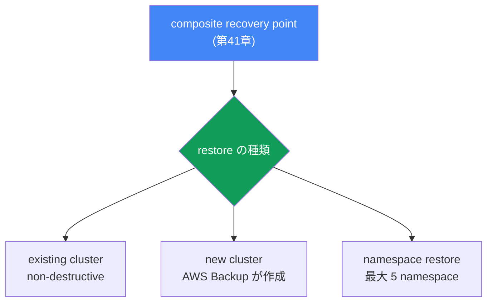
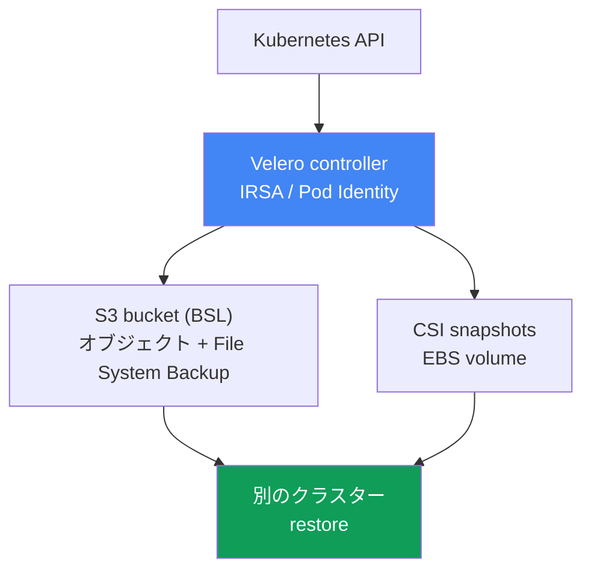

[Eng version](en.md) · [Versión en español](es.md) · [Version française](fr.md) · [Deutsche Version](de.md) · [Русская версия](ru.md) · [ქართული ვერსია](ge.md) · [繁體中文版](tw.md)
# 第42章. リストアと DR: 既存・新規クラスターへの restore、namespace restore、Velero

> **次は何か。** 第41章ではバックアップを扱いました。AWS Backup、composite recovery point、クラスター状態とボリュームを一つの整合した時点にまとめる方法です。しかしバックアップは半分にすぎません。検証されていないバックアップはバックアップではありません。ここでは、この時点から戻す方法を扱います。既存クラスターと新規クラスターへの restore、粒度を絞った namespace の復元、第2のツールとしての Velero、さらに RTO/RPO と DR 戦略です。関連内容は他章で扱います。バックアップと composite recovery point は第41章、EBS volume の AZ への結び付きは第23章、DR のためのマルチクラスター・マルチアカウント接続性は第32章、クラスターのバージョンロールバック（データ restore ではない）は第39章です。

## 42.1. バックアップはあるが、誰もそこから復元を試していない

第41章のインシデントに戻りましょう。誰かが別のクラスターで `kubectl delete namespace prod` を実行しました。今回は良い知らせがあります。クラスターには backup plan があり、昨日の composite recovery point が存在し、status は `Completed` です。オンコール担当者は AWS Backup コンソールを開き、そのポイントを見つけますが、あらかじめ誰も答えていなかった問いに直面します。

- クラスター全体を復元するのか、namespace `prod` だけにするのか。
- 同じクラスターへ戻すのか（クラスターは稼働中で、他の namespace は動いている）、新しいクラスターへ戻すのか。
- restore は現在クラスターにあるものを上書きするのか。
- snapshot の volume はどの AZ に作成され、そこに node は存在するのか。
- 数分か数時間かかるのか。ビジネスに約束した期限内に収まるのか。

これがこの章の痛点です。実行済みの restore がないバックアップは、保護という幻想にすぎません。最初の本番 restore は、ほぼ必ず障害時、プレッシャーの下で、ドキュメントを読む時間がないときに発生します。さらに悪いことに、シナリオは異なります。1つの namespace を削除したなら、稼働中のクラスターへのピンポイント復元が必要です。クラスター全体を失った、リージョンが停止した、あるいは ransomware がデータを暗号化したなら、新規クラスターへの restore が必要で、別リージョンや別アカウントの場合もあります。これらは時間も落とし穴も異なる操作です。インシデント中ではなく、その前に両方を理解しておく必要があります。

そこで本章の進め方は次のとおりです。まず AWS Backup からの restore（既存クラスター、新規クラスター、cross-region、cross-account）、次にピンポイントの namespace restore、次に Velero とツールの選択、最後に RTO/RPO の DR 概念と典型的な restore の落とし穴です。

## 42.2. AWS Backup からの restore: 3つのシナリオ

AWS Backup は composite recovery point（第41章）を復元します。すなわち、クラスター状態（Kubernetes オブジェクト）と関連する volume を一緒に復元します。重要な規則は、**restore は常に target EKS cluster に対して行われる**ことです。つまり既存のクラスターです。「何もない場所」には復元できません。クラスターがすでにあるか、AWS Backup が restore の一部として新しいものを作成する必要があります。したがって、3つのシナリオがあります。

| シナリオ | 復元先 | 使用する場面 |
|---|---|---|
| Existing cluster restore | 元のクラスターまたは別の既存クラスター | ピンポイントの復旧、クラスターは稼働中 |
| New cluster restore | AWS Backup が新規クラスターを作成してそこへ復元 | 災害、クラスター/リージョンの喪失 |
| Namespace restore | 既存クラスター、最大 5 namespace | namespace の削除、部分的な損失 |

AWS Backup のすべての restore における重要な性質は、**non-destructive** であることです。restore は target クラスター内の既存 Kubernetes オブジェクトを上書きせず、クラスターのバージョンも変更しません。オブジェクトがすでに存在する場合は上書きでなくスキップされます。スキップされたオブジェクトは SNS 通知で確認できます（事前に購読しておくべきです）。これは稼働中のクラスターを損傷から保護しますが、壊れたオブジェクトの上に restore しても「修復」はされないことも意味します。これについては落とし穴の節で扱います。

**既存クラスターへの restore** は、クラスターは稼働しているが一部のデータまたはオブジェクトが失われた場合の、ピンポイントの復旧用です。前提条件は、target クラスターに必要な CSI driver（addon 経由の EBS/EFS/S3、第23章）がすでにインストールされていることです。そうでなければ volume を mount できません。

**新規クラスターへの restore** は、災害時のためのものです。AWS Backup がクラスターを作成しますが、選べるオプションは限定されます。名前、Kubernetes バージョン、VPC/subnet、IAM role、security group、node group、Fargate profile、pod identity association です。完全に制御したい場合は、クラスターを事前に作成し（コンソール/eksctl/Terraform）、それを target として指定します。新規クラスターの作成時、AWS Backup はクラスターの準備完了後、リソースを作成するまでに約15分のバッファを加えます。コンポーネントを初期化させるためです。



**Cross-region と cross-account restore。** 別リージョンおよび別アカウントの recovery point コピー（第41章）は、プライマリリージョンの喪失やアカウント侵害時に復元元となるものです。コピーからの restore は同様に動作しますが、追加要件があります。ソースクラスターが暗号化されていた場合、宛先 KMS key を持つ `encryptionConfigProviderKeyArn` が必要です（cross-region/cross-account では独自の key）。また、ワークロードが参照する IAM role（IRSA、Pod Identity、OIDC provider）は、宛先アカウントとリージョンに存在する必要があります。これらの role は AWS Backup が作成しません。ARN の再マッピングは 42.8 節を参照してください。

restore は、EKS metadata を付けた `aws backup start-restore-job` で開始します。`clusterName` は必須です。新規クラスターには `newCluster=true` とネストしたフィールド（`eksClusterVersion`、`clusterRole`、`clusterVpcConfig`、`nodeGroups`、`fargateProfiles`、`podIdentityAssociations`）を指定します。権限には managed policy `AWSBackupServiceRolePolicyForRestores` を使用し、S3 bucket には `AWSBackupServiceRolePolicyForS3Restore` を使用します。

## 42.3. namespace の選択的（selective）復元

完全な DR restore は重い操作です。クラスター全体がないときは、クラスター全体を起動する必要があります。しかし多くの場合、障害はもっと小規模です。1つの namespace が削除または破損し、残りのクラスターは動いています。この場合に完全 restore を実行するのは有害です。時間がかかり、リスクもあります。そのため namespace restore があります。

Namespace restore は、既存クラスターに指定された namespace（1回に最大5個）、その namespace-scoped resource、および関連する永続 volume だけを復元します。Cluster-scoped resource（CRD、StorageClass、Namespace オブジェクト自体、PersistentVolume）は、復元する volume に結び付く PV を除き対象外です。ロジックは同じく non-destructive で、すでにクラスターにあるものは上書きされません。

完全 DR restore との本質的な違いは次のとおりです。

| | Namespace restore | Full/new cluster restore |
|---|---|---|
| 目的 | 稼働中クラスターの一部を戻す | クラスターを再構築する |
| 復元するもの | 最大 5 namespace とその volume | すべての状態とすべての volume |
| Cluster-scoped resource | 除外（関連 PV を除く） | 復元される |
| 典型的なトリガー | namespace prod を削除した | クラスター/リージョンの喪失 |
| RTO | 数分から数十分 | 数時間 |

実務上の意味は明確です。namespace restore は日常的なオペレーターの標準ツールであり、新規クラスターへの DR restore はまれな大規模イベントです。両方をテストしますが、その方法は異なります（42.8節）。

## 42.4. オブジェクトを復元する順序

restore ではオブジェクトの作成順序が重要です。PVC は Pod より先に、CRD は custom resource より先に、namespace はその中のリソースより先に作成する必要があります。AWS Backup はデフォルトで合理的な順序を適用します。まず cluster-scoped（CustomResourceDefinitions、Namespaces、StorageClasses、PersistentVolumes）、次に namespace-scoped（PersistentVolumeClaims、Secrets、ConfigMaps、ServiceAccounts、LimitRanges、Pods、ReplicaSets）です。必要であれば、この順序は `kubernetesRestoreOrder`（`group/version/kind` または `version/kind` 形式）で上書きできます。

オブジェクトの復元後に storage のアタッチが続きます。EBS snapshot では volume を作成する Availability Zone を指定する必要があります。AWS Backup は volume を mount できるよう、同じ AZ で Pod を起動しようとします（第23章との関連）。EFS はランダムな prefix に復元され、restore 後に access point を手動で作成する必要があります。AWS Backup は自動作成しません。

## 42.5. Velero: Kubernetes-native の backup と restore

Velero はクラスター内で動作するオープンソースの backup/restore ツールです。外部 AWS サービスである AWS Backup とは異なり、Velero は Kubernetes API を介して動作し、クラスターそのものに近い位置にあります。その強みは可搬性です。**別の**クラスターに restore できるため、移行と DR の両方のツールになります。

AWS との統合は、公式プラグイン velero-plugin-for-aws によって提供されます。これは S3 用の object store plugin（BSL）と EBS snapshot 用の volume snapshotter plugin を追加します。プラグインは `velero install` 時に `--plugins velero/velero-plugin-for-aws:<version>` フラグで指定します。仕組みは次のとおりです。

- **オブジェクトの backup。** Velero は Kubernetes API 経由でオブジェクトを読み取り、BackupStorageLocation（BSL）で指定した S3 bucket などの object storage に tarball として保存します。
- **volume の snapshot。** PV データは、CSI volume snapshot（driver による EBS snapshot）または File System Backup（volume 内容を同じ bucket にファイル単位でコピーする方式で、provider 間でも動作する）のいずれかで取得されます。
- **Selector。** Backup は namespace（`--include-namespaces`）または label（`--selector`）で限定でき、個々の workload にまで及ぶ細かなピンポイント coverage が可能です。
- **Schedule。** Schedule オブジェクト（`velero schedule create --schedule="0 2 * * *"`）は cron で backup を作成します。スケジュール頻度が RPO を直接決めます（42.7節）。
- **Backup hook。** `pre.hook.backup.velero.io/command` および `post.hook.backup.velero.io/command` annotation により、Velero はバックアップの前後に container 内でコマンドを実行できます。DB buffer の flush、filesystem の freeze と unfreeze などです。これは AWS Backup（第41章）にはないもので、DB を持つ StatefulSet で Velero を選ぶ主な理由です。コマンドは shell では実行されないため、pipe を含む文字列ではなく引数のリストとして記述します。
- **Restore hook。** restore 時、Velero は Pod 内で init container と exec hook を実行できます。たとえば volume の準備完了を待つ、またはアプリケーション起動前に状態を warm-up する用途です。
- **別クラスターへの restore。** 同じ BSL を持つ target クラスターで実行した `velero restore create --from-backup <name>` は、backup から workload を起動します。これは移行と DR の基盤です。

Velero の AWS access には静的 key でなく、**IRSA または EKS Pod Identity**（第16-17章）を使用します。Velero controller の ServiceAccount を、S3 bucket（BSL）と EBS snapshot の権限を持つ IAM role に関連付けます。これはクラスター内のあらゆる controller と同じ、最小権限の原則です。

**Velero backup の S3 Object Lock。** Velero backup は S3 bucket に格納されます。そして、それを書き込む IAM role はデフォルトでは削除もできます。クラスター侵害または ransomware が起きると、backup は最初に消去または暗号化されます。この bucket の保護は完全に利用者の責任です。AWS Backup の Vault Lock のような managed 機能はありません。答えは S3 Object Lock（WORM）です。bucket で有効にします（versioning が必要）。Compliance モードでは、retention 期間中の object version を不変にし、root でさえ削除できません。これにより backup は誤った `velero backup delete` と bucket 権限を持つ攻撃者の両方を生き残れます。

期待を裏切りがちな2つの注意点があります。第1に、Object Lock は**object version**を保護しますが、その上に delete marker を置くことは禁止しません。version id を指定しない通常の `DELETE` は S3 により `200 OK` で実行され、保護された version はその場に残りますが非 current になります。backup bucket の一覧には表示されず、Velero からは消えたように見えます。つまり WORM は復元可能性を与えるものであり（delete marker を除去すれば version は無事です）、backup が見えている保証ではありません。ポイントの存在は依然監視する必要があります。第2に、lock 期間は schedule の TTL と正しい向きで整合させます。TTL は Object Lock 期間以上にします。期限切れの backup を Velero は同じ通常の `DELETE` で削除するため `AccessDenied` にはなりません。TTL が lock 期間より短いと、backup は削除済みと見なされますが version は retention 終了まで残って課金され、lifecycle rule でも削除されません。`AccessDenied`（403）が発生するのは、version id を指定して version を直接削除する主体です。手動 bucket cleanup、Batch Operations、または緊急の容量解放 script などです。



## 42.6. Velero か AWS Backup か

これらのツールは排他的ではありませんが、異なる角度から課題を解決します。選択の目安は次のとおりです。

| 基準 | AWS Backup | Velero |
|---|---|---|
| 性質 | managed AWS service | k8s-native、クラスターに導入 |
| 単位 | composite recovery point | Backup（オブジェクト + volume） |
| policy/保護 | backup plan、vault、Vault Lock（WORM） | Schedule の retention、bucket の保護は S3 Object Lock（WORM）で利用者の責任 |
| 可搬性 | AWS 内（cross-region/account） | クラスター、distribution、cloud 間 |
| Selective | namespace restore（最大5） | 細かい指定: namespace、label、resource |
| 移行 | 主目的ではない | 主目的のシナリオ |

簡潔に言えば、**AWS Backup** は、AWS の範囲で centralized policy、composite point、immutability（Vault Lock）を備えた managed backup が必要な場合に選びます。**Velero** は、クラスター・cloud 間の可搬性と移行、細かな選択、Kubernetes-native な backup 管理が必要な場合に選びます。多くのチームは両方を使います。AWS 内の policy と DR には AWS Backup、移行と粒度の細かい restore には Velero です。

## 42.7. DR の概念: RTO、RPO、戦略

restore に関するあらゆる議論は、2つの metric に行き着きます。

- **RTO (recovery time objective)**: 障害後、サービスを復帰させるべき時間。
- **RPO (recovery point objective)**: 許容されるデータ損失量、すなわちどの過去時点まで戻せるか。**RPO は backup の頻度で直接決まります**。1日1回の backup なら RPO は最大1日、1時間ごとの Velero schedule なら RPO は約1時間です。

AWS は、コストが増え RTO/RPO が小さくなる4つの DR 戦略を示しています（Well-Architected）。

| 戦略 | RPO / RTO | 本質 |
|---|---|---|
| Backup and restore | RPO は時間単位、RTO は最大1日 | 別リージョンに backup を置き、障害時に restore |
| Pilot light | RPO は分単位、RTO は数十分 | データは複製し、中核は停止、障害時に起動 |
| Warm standby | より小さい | 縮小したコピーを常時稼働し、障害時に scale する |
| Multi-site active-active | ほぼゼロ | 複数リージョンで同時に完全稼働 |

典型的な EKS クラスターでは、AWS Backup または Velero からの復元は **backup and restore** 戦略です。安価ですが、RTO は数時間単位です（クラスターを起動し、状態と volume を復元し、load balancer と DNS を再作成するためです）。pilot light 以上へ進むには、すでに準備済みの予備クラスターと、別リージョンへのデータ複製が必要です（接続性は第32章）。これはより高価です。戦略の選択は「より信頼できるものにしよう」ではなく、RTO/RPO とコスト間の意識的なトレードオフです。

## 42.8. Restore の落とし穴

restore は backup ではなく、環境の細部で壊れます。事前に確認する事項は次のとおりです。

- **PV の AZ への結び付き。** Volume は snapshot から特定の AZ に復元され、Pod も同じ AZ に配置されなければ mount されません（第23章）。新しい PVC では `volumeBindingMode: WaitForFirstConsumer` と topology-aware provisioning が有効です。snapshot からの restore では AZ は snapshot に固定されるため、target AZ に node が必要です。
- **厳格な `nodeSelector`、affinity、taint。** 復元された manifest はソースクラスターの node 要件を持ち込みますが、target の node fleet は異なります。pool label が異なる、必要な instance type がない、独自の taint があるなどです。Pod は作成されても、`node(s) didn't match Pod's node affinity/selector` または `node(s) had untolerated taint` により永久に `Pending` のままになります。重要なのは、scheduler が照合するのは node group や NodePool の名前ではなく**label**であることです。そのため DR クラスターは pool のリネームでなく label に従って準備します。workload が選択に使う key と value（`karpenter.sh/nodepool`、`karpenter.sh/capacity-type`、`kubernetes.io/arch`、managed node group の `eks.amazonaws.com` prefix を持つ label）が一致する必要があります。target クラスターの zone が少ない場合、`whenUnsatisfiable: DoNotSchedule` を持つ `topologySpreadConstraints` も同じ結果を招きます。Velero ではその場で修正できます。Resource Modifiers は JSON patch を含む ConfigMap であり、`--resource-modifier-configmap` フラグで接続します。`remove` 操作で `nodeSelector` を外す、または label を置換します（rule 内の条件は、restore が `--namespace-mappings` を使用する場合でも、**元の** namespace に対して記述します）。AWS Backup には manifest の変換機能がありません。target クラスターの label を事前にソースに合わせるか、restore 後にオブジェクトを修正します。
- **Non-destructive と稼働中クラスター。** Restore は既存オブジェクトを上書きしません。オブジェクトが破損していても存在する場合、restore はそれをスキップします。「正常だった」version に戻すには、先にオブジェクトを削除してから復元します。不変 field（たとえば Deployment の selector、Service の一部 field）も、競合時は上書きではなくスキップになります。
- **IRSA/Pod Identity と ARN の再マッピング。** 別アカウントまたは別リージョンへの restore では、ソースアカウントの IRSA role、OIDC provider、Pod Identity association は存在しません。role の古い ARN を annotation に持つ SA は、target アカウントで role が再作成されるまで動作しません。
- **Load balancer と DNS。** NLB/ALB と Route 53 record はソース環境に結び付いています。restore 後、AWS Load Balancer Controller は load balancer を再作成し（第26-28章）、external-dns と cert-manager は DNS と certificate を再作成します（第29章）。address と ARN は変わるため、plan に織り込みます。
- **順序と version。** 先に namespace と CRD、次に StorageClass と PV、次に workload を復元します（42.4節）。オブジェクト API version は target クラスターがサポートしている必要があります。大きく異なる Kubernetes version 間の restore は best effort であり、非互換性がありえます。
- **Image と registry。** Backup は container image を保存しません（第41章）。target アカウント/リージョンは、image を pull する ECR または registry に access できる必要があります。そうでなければ Pod は起動しません。

そして最も重要な規則は、障害を待たずに restore を定期的にテストすることです。四半期に一度 game day を実施し、recovery point（または Velero backup）を別 namespace または一時クラスターに復元して、実際の RTO を測定します。game day で検証された restore だけが、インシデントで頼れる restore です。

## 42.9. Game day: リージョン障害（region failover）の演習

DR 戦略（42.7節）と game day の実践を別々に説明しました。それらを一つの具体的なシナリオ、つまりプライマリリージョンの全面停止にまとめます。これは cross-region copy（第41章）から新規クラスターへ行う重い restore（42.2節）であり、DNS を通じてトラフィックを切り替えます。実際の RTO/RPO を測定しながら、演習として次の手順を実行します。

1. **Failover を宣言する。** プライマリリージョンは利用不能です。cross-region recovery point copy が置かれた、事前に選んだ予備リージョンへ移行します（第41章）。
2. **クラスターを起動する。** warm standby / blue-green クラスターがすでに準備済みであるか、新規に作成します（eksctl/Terraform）。前提条件として、予備リージョンに IRSA/Pod Identity の IAM role、OIDC provider、ECR への access を事前に作成します（42.8節）。
3. **状態と volume を復元する。** 宛先 KMS key を指定して cross-region copy から `aws backup start-restore-job` を実行するか（42.2節）、target クラスターで S3 から `velero restore create` を実行します。
4. **接続性を確認する。** 予備リージョン内のマルチリージョン network と、データ・依存先への access を第32章に従って確認します。
5. **データを確認する。** トラフィック切替前に、volume が mount されデータが無事であることを確認します。アプリケーションの smoke test と、復元コピーの時点（RPO）との照合を行います。「Pod が起動した、だから準備完了」では不十分です。
6. **トラフィックを切り替える。** Route 53 は health check を持つ weighted/failover record を使い、新しいリージョンへ record を切り替えます（第29章）。failover record は、プライマリの health check が red になったとき、トラフィックを予備リージョンへ送ります。load balancer は controller が再作成します（42.8節）。
7. **RTO/RPO を測定する。** SLA の目標（42.7節）と比較して、サービス復帰までの実測時間（RTO）と、コピー内のデータ時点（RPO）を記録します。差異は次の game day への入力になります。

手順2-3が RTO をどの程度左右するかは、選んだ DR 戦略（42.7節）で決まります。backup and restore ではクラスターとデータをゼロから起動するため RTO は数時間です。pilot light/warm standby では予備リージョンがすでに部分的に稼働しているため、failover は scale と Route 53 の切替に集約されます。

## 42.10. 本番環境での適用方法

- **Restore runbook を事前に書く。** 稼働中クラスターへの namespace restore と、新規クラスターへの完全 restore の両方について、コマンドと責任者を含むシナリオを用意します。「その場で考える」ではありません。
- **定期的に game day を実施する。** 四半期に一度、新しい point を別 namespace または一時クラスターに復元し、目標と実際の RTO を記録します。
- **DR 用の target アカウントを事前に準備する。** IRSA/Pod Identity の IAM role、OIDC provider、security group、ECR access は、restore 時でなく障害前に DR アカウントへ作成します。node pool の label も同様です。workload が node を選ぶ key と value は予備クラスターに存在する必要があり、そうでなければ復元した Pod は `Pending` のままになります。
- **スキップされたオブジェクトの SNS を購読する。** Non-destructive restore は既存のものを静かにスキップします。スキップの通知なしでは、不完全な復元になりやすくなります。
- **SLA に RTO/RPO を明記する。** backup の頻度（RPO）と復旧目標時間（RTO）をビジネスと合意し、勘ではなく DR 戦略と照合します。
- **両ツールを意識して運用する。** AWS Backup は AWS 内の policy と DR、Velero は移行ときめ細かい selective restore です。どちらを主とするかを各ケースで明確にします。

## 42.11. ミニ用語集

- **restore job**: AWS Backup の復元タスク。`start-restore-job` で開始し、`list-restore-jobs`/`describe-restore-job` で追跡します。
- **target EKS cluster**: restore の復元先となる既存クラスター。あるいは AWS Backup が restore の一部として作成します（`newCluster=true`）。
- **non-destructive restore**: 既存オブジェクトを上書きせずスキップするモード（スキップは SNS で確認可能）。
- **namespace restore**: 関連 PV を除く cluster-scoped resource を対象にせず、最大5 namespace を既存クラスターへピンポイント復元します。
- **Velero**: Kubernetes-native の backup/restore。オブジェクトは S3（BackupStorageLocation）へ、volume は CSI snapshot または File System Backup により扱います。
- **BackupStorageLocation (BSL)**: Velero backup の保存先（S3 bucket）。
- **velero-plugin-for-aws**: AWS 向け公式 Velero plugin。S3（BSL）の object store と EBS snapshot の volume snapshotter を提供します。
- **S3 Object Lock**: S3 bucket の WORM 保護。retention 期間中の object version を不変にします（Governance/Compliance）。Velero backup を削除と暗号化から保護します。
- **Schedule**: cron による定期 backup の Velero object。RPO を決めます。
- **restore hook**: Pod restore 時に Velero が起動する init container または exec command。
- **Resource Modifiers**: restore 時のオブジェクトに対する JSON patch を持つ Velero ConfigMap（`--resource-modifier-configmap`）。target クラスターと非互換な field を取り除くために使用します。
- **RTO**: 障害後のサービス復旧目標時間。
- **RPO**: 許容されるデータ損失量。backup 頻度で決まります。

## 42.12. 章のまとめ

- 検証されていないバックアップはバックアップではありません。最初の restore を障害時まで延期せず、game day で事前に演習します。
- Restore のシナリオは異なります。稼働中クラスターへのピンポイント namespace restore と、新規クラスターへの完全 DR restore は、RTO も落とし穴も異なる操作です。
- AWS Backup は常に target EKS cluster に復元します。既存クラスターまたは AWS Backup が作成するクラスターです。すべての restore は non-destructive で、既存オブジェクトやクラスター version を上書きしません。
- Namespace restore は、関連 volume を持つ最大5 namespace を既存クラスターへ復元し、関連 PV を除く cluster-scoped resource は除外します。
- copy からの cross-region/cross-account restore（第41章）は DR の基盤です。宛先 KMS key と、target アカウントに事前作成された IAM role が必要です。
- Restore の順序は重要です。最初に CRD/Namespaces/StorageClasses/PV、次に PVC/Secrets/Pod を復元します。EBS volume は snapshot の AZ に作成され、EFS には手動 access point が必要です。
- Velero は Kubernetes-native の backup/restore です。オブジェクトは S3（BSL）、volume は CSI または File System Backup、selector、Schedule、restore hook、別クラスターへの restore（移行と DR）を提供します。
- AWS Backup は managed、composite、Vault Lock を提供します。Velero は可搬性、きめ細かい selective 操作、クラスター・cloud 間の移行を提供します。両方を使うことも多く、Velero bucket は S3 Object Lock で保護します。
- RPO は backup 頻度で決まり、DR 戦略（backup and restore、pilot light、warm standby、multi-site）は RTO/RPO とコストのトレードオフです。
- Restore の落とし穴には、volume の AZ、厳格な `nodeSelector` と taint 下の node label、non-destructive のスキップ、IRSA/ARN の再マッピング、load balancer と DNS の再作成、順序と version の互換性、image access があります。

## 42.13. 実務での役立ち方

オンコールでは、この章の内容がバックアップを実際の復旧へ変えます。namespace を削除した、またはクラスターを失ったとき、問いは「バックアップがあるか」（これは第41章で確認済み）ではなく、「どのように、どれだけの時間で起動するか」です。答えはインシデント前に runbook に記載されている必要があります。どのシナリオにどの restore 種類を使うか、どのクラスターへ戻すか、どの前提条件（CSI driver、IAM role、ECR access）があるか、期待 RTO は何かです。障害時には即興でなく、その runbook に従って復元します。

クラスターの計画時には、必須項目が増えます。ビジネスと合意した RTO/RPO とそれに対応する DR 戦略、game day で実行済みの restore（namespace と完全 restore）、再作成した role と access を持つ準備済み DR アカウント、そして restore が LB と DNS を再作成し volume は AZ に結び付くという考慮です。第41章の backup と組み合わせることで、完全な保護ループが得られます。backup、検証済み restore、RTO/RPO を持つ DR plan。これが幻想でない実際の保護です。

## 42.14. 自己確認の質問

1. 検証されていないバックアップがバックアップと見なされないのはなぜですか。実務では何をしますか。
2. シナリオにおいて、既存クラスターへの restore と新規クラスターへの restore はどう異なりますか。
3. AWS Backup の non-destructive restore とは何を意味し、この性質はどのような結果をもたらしますか。
4. Namespace restore は何を復元し、どの resource を除外しますか。
5. Restore が target EKS cluster に対して実行される理由と、`newCluster=true` で AWS Backup が行うことは何ですか。
6. Cross-region と cross-account restore ではどの追加要件が発生しますか。
7. AWS Backup はどの順序でオブジェクトを復元しますか。なぜ順序が重要ですか。
8. Velero はオブジェクトと volume をどのように backup しますか。File System Backup は CSI snapshot とどう異なりますか。
9. Velero はどのように別クラスターへ復元しますか。また、なぜ IRSA または Pod Identity が必要ですか。
10. AWS Backup と Velero はそれぞれいつ選びますか。なぜ両方を使うことが多いのですか。
11. RTO と RPO とは何ですか。backup 頻度は RPO とどう関係しますか。
12. DR 戦略（backup and restore、pilot light、warm standby、multi-site）はどのように異なりますか。
13. 復元された EBS volume が mount できない理由は何ですか。これは AZ とどのように関係しますか（第23章）。
14. 別アカウントへの restore では、role、load balancer、DNS、image に関してどの落とし穴がありますか。
15. 復元された Pod が DR クラスターで永久に `Pending` のままになるのはなぜですか。Velero と AWS Backup の機能で、それぞれ何ができ、何ができませんか。
16. Velero backup において S3 Object Lock は正確に何を保護しますか。保護された version の上に delete marker を置ける理由と、Schedule の TTL との関係は何ですか。

## 実践

このテーマのコース lab: [lab 122 - EKS のための AWS Backup](../../labs/122/README_JP.MD)。この lab では、稼働中のクラスターに namespace restore を行い、non-destructive の動作（既存オブジェクトが上書きされない）を確認し、クラスター version のロールバックが削除した namespace を戻さない理由を理解します。検証には `check_result` command を使用します。起動は `TASK=122 make run_eks_task` です。

lab に加えて、復元状況はツールから確認できます。まず AWS Backup で、利用可能な point を確認し、prod ではなく別 namespace へのテスト restore を開始します。

```bash
# restore job の履歴（status、所要時間）
aws backup list-restore-jobs
# 特定の復元タスクの詳細
aws backup describe-restore-job --restore-job-id <id>
```

restore は EKS metadata（少なくとも `clusterName`）を付けた `start-restore-job` で開始します。namespace restore では target クラスターと namespace 名を指定します。障害時に間違えないよう、metadata の全 field は AWS Backup のドキュメントで確認してください。

Velero では backup が取得・復元されることを確認し、テスト namespace への restore を演習します。

```bash
# backup と schedule の一覧
velero backup get
velero schedule get
# backup 全体または namespace だけをテスト先へ復元
velero restore create --from-backup <backup> --include-namespaces test-restore
# restore の status
velero restore get
```

この章の主な実践は定期的な game day です。四半期に一度、新しい point を別 namespace または一時クラスターに復元し、実際の RTO を測定してください。backup と composite recovery point は第41章、volume の AZ への結び付きは第23章、DR のためのマルチクラスター接続性は第32章、クラスター version のロールバック（データ restore ではない）は第39章を参照してください。

---
[目次](../README_JP.md) · [第41章](../41/jp.md) · [第43章](../43/jp.md)
