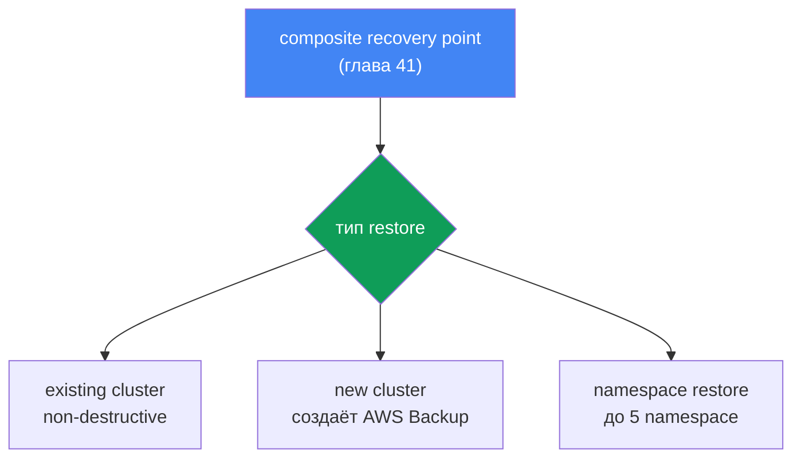
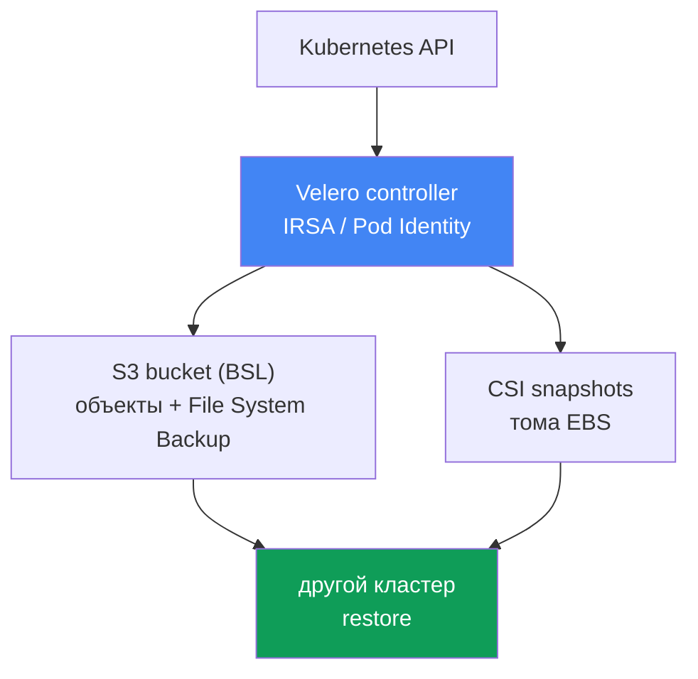

# Глава 42. Восстановление и DR: restore в существующий и новый кластер, namespace-restore, Velero

> **Что дальше.** Глава 41 дала бэкап: AWS Backup, composite recovery point, состояние
> кластера и тома в одной согласованной точке. Но бэкап - это половина дела: непроверенный
> бэкап это не бэкап. Здесь - как из этой точки подняться обратно: restore в существующий и в
> новый кластер, точечное восстановление namespace, Velero как второй инструмент, а также
> RTO/RPO и стратегии DR. Смежное отдано другим главам: сам бэкап и composite recovery point -
> глава 41; привязка EBS-томов к AZ - глава 23; мультикластерная и мультиаккаунтная связность
> для DR - глава 32; откат версии кластера (это не restore данных) - глава 39.

## 42.1. Бэкап есть, а подняться из него никто не пробовал

Вернёмся к инциденту главы 41: кто-то выполнил `kubectl delete namespace prod` не в том
кластере. На этот раз хорошая новость - у кластера есть backup plan, и вчерашний composite
recovery point на месте, статус `Completed`. Дежурный открывает консоль AWS Backup, находит
точку и упирается в вопросы, на которые никто заранее не ответил:

- Восстанавливать весь кластер или только namespace `prod`?
- Лить обратно в тот же кластер (он живой, остальные namespace работают) или в новый?
- Перезатрёт ли restore то, что сейчас в кластере?
- В какой AZ поднимутся тома из снапшотов и найдут ли они там ноды?
- Сколько это займёт - минуты или часы, и укладывается ли в обещанный бизнесу срок?

Это и есть боль главы. Бэкап без отработанного restore - иллюзия защиты. Первый настоящий
restore почти всегда случается в аварии, под давлением, когда времени читать документацию нет.
Хуже того: сценарии бывают разные. Удалили один namespace - нужно точечное восстановление в
живой кластер. Потеряли кластер целиком или сгорел регион (или ransomware зашифровал данные) -
нужен restore в новый кластер, возможно, в другом регионе или аккаунте. Это разные операции с
разным временем и разными ловушками, и обе надо знать до инцидента, а не во время.

Отсюда план главы: сначала restore из AWS Backup (существующий, новый кластер, cross-region и
cross-account), потом точечный namespace-restore, потом Velero и выбор между инструментами, и
в конце DR-концепции RTO/RPO и типичные ловушки restore.

## 42.2. Restore из AWS Backup: три сценария

AWS Backup восстанавливает composite recovery point (глава 41): и состояние кластера (объекты
Kubernetes), и связанные тома вместе. Ключевое правило: **restore всегда идёт в target EKS
cluster** - в уже существующий кластер. Нельзя восстановить «в пустоту»: либо кластер уже есть,
либо AWS Backup создаёт новый в рамках самого restore. Отсюда три сценария:

| Сценарий | Куда | Когда применяют |
|---|---|---|
| Existing cluster restore | в исходный или другой существующий кластер | точечный возврат, кластер жив |
| New cluster restore | AWS Backup создаёт новый кластер и льёт в него | катастрофа, потеря кластера/региона |
| Namespace restore | в существующий кластер, до 5 namespace | удалили namespace, частичная потеря |

Важное свойство всех restore в AWS Backup: они **non-destructive**. Restore не перезаписывает
существующие объекты Kubernetes в target-кластере и не меняет его версию. Если объект
уже есть - он пропускается, а не затирается. Пропущенные объекты видно через SNS-уведомления
(на них стоит подписаться заранее). Это защищает живой кластер от порчи, но и означает, что
restore поверх испорченного объекта его не «починит» - об этом в разделе про ловушки.

**Restore в существующий кластер** - для точечного возврата, когда кластер жив, но часть данных
или объектов пропала. Предусловие: в target-кластере уже установлены нужные CSI-драйверы
(EBS/EFS/S3 через аддоны, глава 23), иначе тома некуда монтировать.

**Restore в новый кластер** - для катастрофы. AWS Backup создаёт кластер сам, но с ограниченным
набором опций: имя, версия Kubernetes, VPC/подсети, IAM role, security groups, node groups,
Fargate profiles, pod identity associations. Для полного контроля кластер создают заранее
(консоль/eksctl/Terraform) и указывают его как target. При создании нового кластера AWS Backup
добавляет буфер ~15 минут после готовности кластера, прежде чем создавать ресурсы - чтобы
компоненты успели инициализироваться.



**Cross-region и cross-account restore.** Копии recovery point в другом регионе и аккаунте
(глава 41) - это то, из чего поднимаются при потере основного региона или компрометации
аккаунта. Restore из копии работает так же, но добавляет требования: если исходный кластер был
зашифрован, нужен `encryptionConfigProviderKeyArn` с ключом KMS назначения (свой ключ для
cross-region/cross-account), а IAM-роли, на которые ссылались нагрузки (IRSA, Pod Identity,
OIDC-провайдер), должны существовать в аккаунте и регионе назначения. Эти роли AWS Backup
не создаёт - о переотображении ARN см. раздел 42.8.

Запускается restore командой `aws backup start-restore-job` с EKS-метаданными: обязателен
`clusterName`, для нового кластера - `newCluster=true` и вложенные поля (`eksClusterVersion`,
`clusterRole`, `clusterVpcConfig`, `nodeGroups`, `fargateProfiles`, `podIdentityAssociations`).
Права даёт управляемая политика `AWSBackupServiceRolePolicyForRestores`, для S3-бакетов -
`AWSBackupServiceRolePolicyForS3Restore`.

## 42.3. Точечное (selective) восстановление namespace

Полный DR-restore - тяжёлая операция: поднять весь кластер целиком нужно, когда его нет.
Гораздо чаще случай мельче: удалили или испортили один namespace, остальной кластер работает.
Гонять полный restore тут вредно - долго и рискованно. Для этого есть namespace restore.

Namespace restore льёт в существующий кластер только указанные namespace (до 5 за раз), их
namespace-scoped ресурсы и относящиеся к ним постоянные тома. Cluster-scoped ресурсы (CRD,
StorageClass, сам объект Namespace, PersistentVolume) при этом исключаются, кроме PV, связанных
с восстанавливаемыми томами. Логика та же non-destructive: то, что в кластере уже есть, не
перезаписывается.

Отличие от полного DR-restore по сути:

| | Namespace restore | Full/new cluster restore |
|---|---|---|
| Цель | вернуть часть в живой кластер | поднять кластер заново |
| Что восстанавливается | до 5 namespace + их тома | всё состояние + все тома |
| Cluster-scoped ресурсы | исключены (кроме связанных PV) | восстанавливаются |
| Типичный триггер | удалили namespace prod | потеря кластера/региона |
| RTO | минуты-десятки минут | часы |

Практический смысл: namespace restore - штатный инструмент оператора на каждый день, DR-restore
в новый кластер - редкое тяжёлое событие. Оба тестируют, но по-разному (раздел 42.8).

## 42.4. Порядок восстановления объектов

При restore порядок создания объектов важен: PVC надо создать раньше подов, CRD - раньше
custom-ресурсов, namespace - раньше того, что внутри. AWS Backup применяет разумный порядок по
умолчанию: сначала cluster-scoped (CustomResourceDefinitions, Namespaces, StorageClasses,
PersistentVolumes), затем namespace-scoped (PersistentVolumeClaims, Secrets, ConfigMaps,
ServiceAccounts, LimitRanges, Pods, ReplicaSets). Этот порядок при необходимости переопределяют
через `kubernetesRestoreOrder` (формат `group/version/kind` или `version/kind`).

После восстановления объектов идёт привязка хранилища. Для EBS-снапшота нужно указать
Availability Zone, где будет создан том; AWS Backup постарается поднять под в той же AZ, чтобы
том примонтировался (связь с главой 23). EFS восстанавливается на случайный префикс и требует
ручного создания access point после restore - AWS Backup сам его не создаёт.

## 42.5. Velero: Kubernetes-native backup и restore

Velero - открытый инструмент бэкапа и восстановления, живущий внутри кластера. В отличие от
AWS Backup (внешний сервис AWS), Velero работает через Kubernetes API и ближе к самому
кластеру. Его сильная сторона - портируемость: он умеет restore в **другой** кластер, что
его инструментом и миграции, и DR.

Интеграция с AWS даётся официальным плагином velero-plugin-for-aws: он добавляет object store
plugin для S3 (BSL) и volume snapshotter plugin для снапшотов EBS. Плагин указывают флагом
`--plugins velero/velero-plugin-for-aws:<версия>` при `velero install`. Как он устроен:

- **Backup объектов.** Velero читает объекты через Kubernetes API и складывает их тарболом в
  объектное хранилище - S3-бакет, заданный через BackupStorageLocation (BSL).
- **Снапшоты томов.** Данные PV снимаются либо через CSI volume snapshots (снапшот EBS
  средствами драйвера), либо через File System Backup (пофайловое копирование содержимого тома
  в тот же бакет, работает и между провайдерами).
- **Селекторы.** Backup ограничивают по namespace (`--include-namespaces`) или по label
  (`--selector`) - тонкое, точечное покрытие вплоть до отдельных нагрузок.
- **Расписания.** Объект Schedule (`velero schedule create --schedule="0 2 * * *"`) снимает
  backup по cron; частота расписания напрямую задаёт RPO (раздел 42.7).
- **Backup hooks.** Аннотациями `pre.hook.backup.velero.io/command` и
  `post.hook.backup.velero.io/command` Velero выполняет команду в контейнере до и после снятия
  бэкапа: сбросить буферы БД, заморозить и разморозить файловую систему. Это то, чего нет у
  AWS Backup (глава 41), и главный аргумент за Velero для StatefulSet с СУБД. Команда
  выполняется не в shell, поэтому её пишут списком аргументов, а не строкой с пайпами.
- **Restore hooks.** При restore Velero умеет запускать init-контейнеры и exec-хуки в подах -
  например, дождаться готовности тома или прогреть состояние перед стартом приложения.
- **Restore в другой кластер.** `velero restore create --from-backup <name>`, выполненный в
  целевом кластере с тем же BSL, поднимает нагрузки из бэкапа - основа миграции и DR.

Доступ к AWS у Velero даётся не статическими ключами, а через **IRSA или EKS Pod Identity**
(главы 16-17): ServiceAccount контроллера Velero связывается с IAM-ролью, у которой есть права
на S3-бакет (BSL) и на снапшоты EBS. Это тот же принцип наименьших привилегий, что и для любого
контроллера в кластере.

**S3 Object Lock для бэкапов Velero.** Бэкапы Velero лежат в S3-бакете, и та же IAM-роль, что
их пишет, по умолчанию может их и удалить: при компрометации кластера или ransomware бэкапы
стирают или шифруют первыми. Защита бакета здесь целиком на вас: управляемого Vault Lock, как
у AWS Backup, тут нет. Ответ - S3 Object Lock (WORM): включённый на бакете (нужен versioning),
в режиме Compliance он делает версии объектов неизменяемыми на срок retention, и удалить их
не может даже root. Так бэкап переживает и ошибочный `velero backup delete`, и атакующего
с правами на бакет.

Два нюанса, которые обманывают ожидания. Первый: Object Lock защищает **версии объектов**, но
не запрещает ставить поверх них delete marker. Простой `DELETE` без version id S3 выполняет с
`200 OK`, защищённая версия остаётся на месте, но становится неактуальной - в листинге бакета
бэкапа больше нет, и для Velero он исчез. То есть WORM даёт восстановимость (delete marker
снимают, версии целы), а не гарантию, что бэкап видно: следить за наличием точек всё равно
надо. Второй: срок блокировки согласуют с TTL расписания, и в правильную сторону - TTL не
меньше срока Object Lock. Удаляет просроченный бэкап Velero тем же простым `DELETE`, поэтому
падения с `AccessDenied` не будет; при TTL меньше срока блокировки бэкап считается удалённым,
а версии лежат и тарифицируются до конца retention, причём и lifecycle-правило их не уберёт.
Ошибка `AccessDenied` (403) прилетает другому - тому, кто удаляет версию адресно, с version
id: ручной чистке бакета, Batch Operations, скрипту аварийного освобождения места.



## 42.6. Velero или AWS Backup

Инструменты не взаимоисключающие, но решают задачи под разным углом. Ориентир для выбора:

| Критерий | AWS Backup | Velero |
|---|---|---|
| Природа | управляемый сервис AWS | k8s-native, ставится в кластер |
| Единица | composite recovery point | Backup (объекты + тома) |
| Политики/защита | backup plan, vault, Vault Lock (WORM) | retention Schedule; защита бакета - S3 Object Lock (WORM), на вас |
| Портируемость | внутри AWS (cross-region/account) | между кластерами, дистрибутивами, облаками |
| Selective | namespace restore (до 5) | тонко: namespace, label, ресурсы |
| Миграция | не профильно | профильный сценарий |

Коротко: **AWS Backup** берут, когда нужен управляемый бэкап с централизованными политиками,
composite-точками и неизменяемостью (Vault Lock) в рамках AWS. **Velero** берут, когда нужна
портируемость и миграция между кластерами и облаками, тонкая выборка и Kubernetes-native
управление бэкапом. Многие команды держат оба: AWS Backup как политика и DR внутри AWS,
Velero для миграций и гранулярных восстановлений.

## 42.7. DR-концепции: RTO, RPO и стратегии

Любой разговор о restore упирается в две метрики:

- **RTO (recovery time objective)** - за какое время сервис должен вернуться после аварии.
- **RPO (recovery point objective)** - какой объём данных допустимо потерять, то есть на какой
  момент в прошлом откатываемся. **RPO напрямую задаётся частотой бэкапа**: бэкап раз в сутки
  - RPO до суток; расписание Velero раз в час - RPO около часа.

AWS выделяет четыре стратегии DR с растущей стоимостью и падающим RTO/RPO (Well-Architected):

| Стратегия | RPO / RTO | Суть |
|---|---|---|
| Backup and restore | RPO часы, RTO до суток | бэкап в другой регион, restore по факту аварии |
| Pilot light | RPO минуты, RTO десятки минут | данные реплицируются, ядро выключено, включают при аварии |
| Warm standby | меньше | уменьшенная копия всегда работает, масштабируют при аварии |
| Multi-site active-active | около нуля | полноценная работа в нескольких регионах одновременно |

Для типичного EKS-кластера восстановление из AWS Backup или Velero - это стратегия **backup and
restore**: дёшево, но RTO измеряется часами (поднять кластер, восстановить состояние и тома,
пересоздать балансировщики и DNS). Двигаться к pilot light и дальше - это уже готовый резервный
кластер и репликация данных в другой регион (связность - глава 32), что дороже.
Выбор стратегии - осознанный компромисс между RTO/RPO и стоимостью, а не «сделаем понадёжнее».

## 42.8. Ловушки restore

Restore ломается не на бэкапе, а на деталях среды. Что проверяют заранее:

- **Привязка PV к AZ.** Том восстанавливается из снапшота в конкретную AZ, и под должен
  оказаться там же, иначе том не примонтируется (глава 23). Для новых PVC помогает
  `volumeBindingMode: WaitForFirstConsumer` и topology-aware provisioning; при restore из
  снапшота AZ фиксирована снапшотом, и в целевой AZ должны быть ноды.
- **Жёсткие `nodeSelector`, affinity и taints.** Восстановленные манифесты несут требования к
  нодам исходного кластера, а в целевом парк устроен иначе: другие метки пулов, нет нужного
  типа инстанса, свои taints. Поды создадутся и навсегда останутся в `Pending` с
  `node(s) didn't match Pod's node affinity/selector` или `node(s) had untolerated taint`.
  Ключевое: планировщик сверяет **метки**, а не имена node group или NodePool, поэтому
  DR-кластер готовят по меткам, а не переименованием пулов - совпасть должны ключи и значения,
  по которым выбирает нагрузка (`karpenter.sh/nodepool`, `karpenter.sh/capacity-type`,
  `kubernetes.io/arch`, метки с префиксом `eks.amazonaws.com` у managed node groups). Тот же
  эффект дают `topologySpreadConstraints` с `whenUnsatisfiable: DoNotSchedule`, если в целевом
  кластере меньше зон. У Velero это правится на лету: Resource Modifiers - ConfigMap с
  JSON-патчами, подключаемый флагом `--resource-modifier-configmap`, где операцией `remove`
  снимают `nodeSelector` или подменяют метку (условия в правилах пишут по ИСХОДНОМУ namespace,
  даже если restore идёт с `--namespace-mappings`). У AWS Backup мутации манифестов нет: метки
  в целевом кластере приводят к исходным заранее либо правят объекты после restore.
- **Non-destructive и живой кластер.** Restore не перезаписывает существующие объекты. Если
  объект испорчен, но присутствует, restore его пропустит: для отката к «хорошей» версии объект
  сначала удаляют, а потом восстанавливают. Неизменяемые поля (например, selector Deployment,
  часть полей Service) при конфликте тоже дают пропуск, а не перезапись.
- **Переотображение IRSA/Pod Identity и ARN.** При restore в другой аккаунт/регион роли IRSA,
  OIDC-провайдер и Pod Identity associations из исходного аккаунта там не существуют. SA
  с аннотацией на старый ARN роли не заработает, пока роли не пересозданы в целевом аккаунте.
- **Балансировщики и DNS.** NLB/ALB и записи Route 53 привязаны к исходной среде. После restore
  AWS Load Balancer Controller пересоздаёт балансировщики (главы 26-28), а external-dns и
  cert-manager - DNS и сертификаты (глава 29); адреса и ARN меняются, это учитывают в плане.
- **Порядок и версии.** Сначала namespace и CRD, потом StorageClass и PV, потом нагрузки
  (раздел 42.4). Версии API объектов должны поддерживаться целевым кластером: restore между
  сильно разными версиями Kubernetes - best effort, возможны несовместимости.
- **Образы и реестры.** Bэкап не хранит образы контейнеров (глава 41). Целевой аккаунт/регион
  должен иметь доступ к ECR или реестру, откуда тянутся образы, иначе поды не стартуют.

И главное правило: restore тестируют регулярно, не дожидаясь аварии. Раз в квартал проводят
game day - восстанавливают recovery point (или Velero backup) в отдельный namespace или
временный кластер и замеряют реальный RTO. Проверенный на game day restore - единственный, на
который можно опереться в инциденте.

## 42.9. Game day: отработка падения региона (region failover)

Стратегии DR (раздел 42.7) и практику game day описали по отдельности; сведём их в один
конкретный сценарий - полный отказ основного региона. Это тяжёлый restore в новый кластер
(раздел 42.2) из cross-region копии (глава 41) с переключением трафика через DNS. Отрабатывают
его как учение по шагам, замеряя реальные RTO/RPO:

1. **Объявить failover.** Основной регион недоступен; переходим на заранее выбранный резервный
   регион, где лежат cross-region копии recovery point (глава 41).
2. **Поднять кластер.** Либо warm standby / blue-green кластер уже готов, либо создаём новый
   (eksctl/Terraform); предусловия - IAM-роли IRSA/Pod Identity, OIDC-провайдер и доступ к ECR
   в резервном регионе созданы заранее (раздел 42.8).
3. **Восстановить состояние и тома.** `aws backup start-restore-job` из cross-region копии с
   ключом KMS назначения (раздел 42.2) или `velero restore create` из S3 в целевом кластере.
4. **Проверить связность.** Мультирегион-сеть и доступ к данным и зависимостям в резервном
   регионе проверяют по главе 32.
5. **Проверить данные.** До переключения трафика убеждаются, что тома примонтировались и данные
   целы: smoke-тест приложения и сверка с моментом восстановленной копии (RPO), а не «поды
   запустились - значит готово».
6. **Переключить трафик.** Route 53 переводит записи на новый регион через weighted/failover
   records с health check (глава 29): failover-запись уводит трафик на резервный регион, когда
   health check основного «красный»; балансировщики пересоздаёт контроллер (раздел 42.8).
7. **Замерить RTO/RPO.** Фиксируют фактическое время до возврата сервиса (RTO) и момент данных
   в копии (RPO) против целевых из SLA (раздел 42.7); расхождение - вход в следующий game day.

Насколько шаги 2-3 определяют RTO, задаёт выбранная стратегия DR (раздел 42.7): при backup and
restore кластер и данные поднимают с нуля - RTO часы; при pilot light/warm standby резервный
регион уже частично живёт, и failover сводится к масштабированию и переключению Route 53.

## 42.10. Как это применяют в продакшене

- **Пишут runbook restore заранее.** Сценарий на оба случая (namespace-restore в живой
  кластер и полный restore в новый), с командами и ответственными, а не «разберёмся на месте».
- **Регулярно проводят game day.** Раз в квартал восстанавливают свежую точку в отдельный
  namespace или временный кластер и фиксируют фактический RTO против целевого.
- **Заранее готовят целевой аккаунт для DR.** IAM-роли IRSA/Pod Identity, OIDC-провайдер,
  security groups и доступ к ECR создают в DR-аккаунте до аварии, а не в момент restore. Сюда
  же метки пулов нод: те ключи и значения, по которым нагрузки выбирают ноду, в резервном
  кластере должны существовать, иначе восстановленные поды останутся в `Pending`.
- **Подписываются на SNS о пропущенных объектах.** Non-destructive restore молча пропускает
  существующее; без уведомлений о пропусках легко получить неполное восстановление.
- **Фиксируют RTO/RPO в SLA.** Частоту бэкапа (RPO) и целевое время восстановления (RTO)
  согласуют с бизнесом и сверяют со стратегией DR, а не выбирают на глаз.
- **Держат оба инструмента осознанно.** AWS Backup - политика и DR в AWS, Velero - миграция
  и тонкие selective-восстановления; для каждого понятно, когда он основной.

## 42.11. Мини-глоссарий

- **restore job** - задача восстановления в AWS Backup; запускается `start-restore-job`,
  отслеживается `list-restore-jobs`/`describe-restore-job`.
- **target EKS cluster** - существующий кластер, в который идёт restore; либо создаётся AWS
  Backup в рамках restore (`newCluster=true`).
- **non-destructive restore** - режим, при котором существующие объекты не перезаписываются, а
  пропускаются (пропуски видны через SNS).
- **namespace restore** - точечное восстановление до 5 namespace в существующий кластер без
  cluster-scoped ресурсов (кроме связанных PV).
- **Velero** - Kubernetes-native backup/restore; объекты в S3 (BackupStorageLocation),
  тома через CSI snapshots или File System Backup.
- **BackupStorageLocation (BSL)** - место хранения бэкапов Velero (S3-бакет).
- **velero-plugin-for-aws** - официальный плагин Velero для AWS: object store для S3 (BSL) и
  volume snapshotter для снапшотов EBS.
- **S3 Object Lock** - WORM-защита S3-бакета: неизменяемость версий объектов на срок retention
  (Governance/Compliance), защищает бэкапы Velero от удаления и шифрования.
- **Schedule** - объект Velero для периодического backup по cron; задаёт RPO.
- **restore hook** - init-контейнер или exec-команда, запускаемая Velero при restore пода.
- **Resource Modifiers** - ConfigMap Velero с JSON-патчами к объектам на момент restore
  (`--resource-modifier-configmap`); чем снимают несовместимые с целевым кластером поля.
- **RTO** - целевое время восстановления сервиса после аварии.
- **RPO** - допустимый объём потери данных; задаётся частотой бэкапа.

## 42.12. Итоги главы

- Непроверенный бэкап это не бэкап: первый restore нельзя откладывать до аварии, его
  отрабатывают заранее на game day.
- Сценарии restore разные: точечный namespace-restore в живой кластер и полный DR-restore в
  новый кластер - разные операции с разным RTO и разными ловушками.
- AWS Backup всегда восстанавливает в target EKS cluster: существующий или создаваемый им;
  все restore non-destructive и не перезаписывают существующие объекты и версию кластера.
- Namespace restore льёт до 5 namespace с их томами в существующий кластер, исключая
  cluster-scoped ресурсы кроме связанных PV.
- Cross-region и cross-account restore из копий (глава 41) - основа DR; требует ключа KMS
  назначения и заранее созданных IAM-ролей в целевом аккаунте.
- Порядок restore важен: сначала CRD/Namespaces/StorageClasses/PV, затем PVC/Secrets/поды;
  EBS-том поднимается в AZ снапшота, EFS требует ручного access point.
- Velero - Kubernetes-native backup/restore: объекты в S3 (BSL), тома через CSI или File System
  Backup, селекторы, Schedule, restore hooks и restore в другой кластер (миграция и DR).
- AWS Backup - управляемый, composite, Vault Lock; Velero - портируемый, тонкий selective и
  миграция между кластерами и облаками; часто держат оба; бакет Velero защищает S3 Object Lock.
- RPO задаётся частотой бэкапа, стратегии DR (backup and restore, pilot light, warm standby,
  multi-site) - компромисс RTO/RPO против стоимости.
- Ловушки restore: AZ томов, метки нод под жёсткими `nodeSelector` и taints, non-destructive
  пропуски, переотображение IRSA/ARN, пересоздание балансировщиков и DNS, порядок и
  совместимость версий, доступ к образам.

## 42.13. Как это пригодится в реальной работе

На дежурстве эта глава - то, что превращает бэкап в реальное восстановление. Когда снесли
namespace или потеряли кластер, вопрос не «есть ли бэкап» (это проверено в главе 41), а «за
сколько и как я его подниму». Ответ должен быть в runbook до инцидента: какой тип restore на
какой сценарий, в какой кластер, какие предусловия (CSI-драйверы, IAM-роли, доступ к ECR) и
какой ожидается RTO. В момент аварии по этому runbook идёт восстановление, а не импровизация.

При планировании кластера это добавляет обязательные пункты: согласованные с бизнесом RTO/RPO и
выбранная под них стратегия DR; отработанный на game day restore (namespace и полный); готовый
DR-аккаунт с пересозданными ролями и доступами; учёт того, что restore пересоздаёт LB
и DNS, а тома привязаны к AZ. Вместе с бэкапом из главы 41 это даёт полную петлю защиты: бэкап
плюс проверенный restore плюс DR-план с RTO/RPO - реальная защита, а не иллюзия.

## 42.14. Вопросы для самопроверки

1. Почему непроверенный бэкап не считается бэкапом и что с этим делают на практике?
2. Чем restore в существующий кластер отличается от restore в новый кластер по сценарию?
3. Что означает non-destructive restore в AWS Backup и какое последствие у этого свойства?
4. Что восстанавливает namespace restore и какие ресурсы он исключает?
5. Почему restore идёт в target EKS cluster и что делает AWS Backup при `newCluster=true`?
6. Какие дополнительные требования появляются при cross-region и cross-account restore?
7. В каком порядке AWS Backup восстанавливает объекты и почему порядок важен?
8. Как Velero бэкапит объекты и тома и чем File System Backup отличается от CSI-снапшота?
9. Как Velero восстанавливает в другой кластер и зачем ему IRSA или Pod Identity?
10. Когда выбирают AWS Backup, а когда Velero, и почему нередко держат оба?
11. Что такое RTO и RPO и как частота бэкапа связана с RPO?
12. Чем стратегии DR (backup and restore, pilot light, warm standby, multi-site) различаются?
13. Почему восстановленный EBS-том может не примонтироваться и как это связано с AZ (глава 23)?
14. Какие ловушки ждут при restore в другой аккаунт: роли, балансировщики, DNS, образы?
15. Почему восстановленные поды могут навсегда остаться в `Pending` в DR-кластере и что тут
    можно, а что нельзя сделать средствами Velero и AWS Backup?
16. Что именно защищает S3 Object Lock у бэкапов Velero, почему delete marker поверх
    защищённой версии проходит и как это связано с TTL расписания?

## Практика

Своей лабы у главы пока нет, но состояние восстановления видно из инструментов. Начните с
AWS Backup: посмотрите доступные точки и запустите тестовый restore в отдельный namespace, а не
в prod.

```bash
# история restore job (статусы, длительность)
aws backup list-restore-jobs
# детали конкретной задачи восстановления
aws backup describe-restore-job --restore-job-id <id>
```

Запуск восстановления идёт через `start-restore-job` с EKS-метаданными (как минимум
`clusterName`); для namespace-restore указывают целевой кластер и имена namespace. Полный набор
полей метаданных сверяйте с документацией AWS Backup, чтобы не промахнуться в аварии.

Для Velero проверьте, что бэкапы снимаются и восстанавливаются, и отработайте restore в
тестовый namespace:

```bash
# список бэкапов и расписаний
velero backup get
velero schedule get
# восстановить бэкап целиком или только namespace в тестовый
velero restore create --from-backup <backup> --include-namespaces test-restore
# статусы восстановлений
velero restore get
```

Главная практика этой главы - регулярный game day: раз в квартал восстанавливайте свежую точку
в отдельный namespace или временный кластер и замеряйте реальный RTO. Про сам бэкап и composite
recovery point - глава 41, про привязку томов к AZ - глава 23, про мультикластерную связность
для DR - глава 32, про откат версии кластера (это не restore данных) - глава 39.

---
[Оглавление](../README_RU.md) · [Глава 41](../41/ru.md) · [Глава 43](../43/ru.md)
