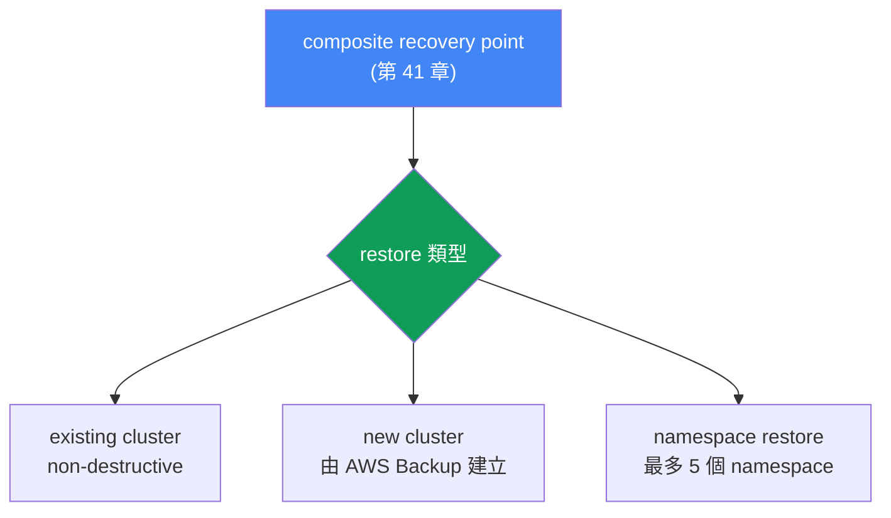
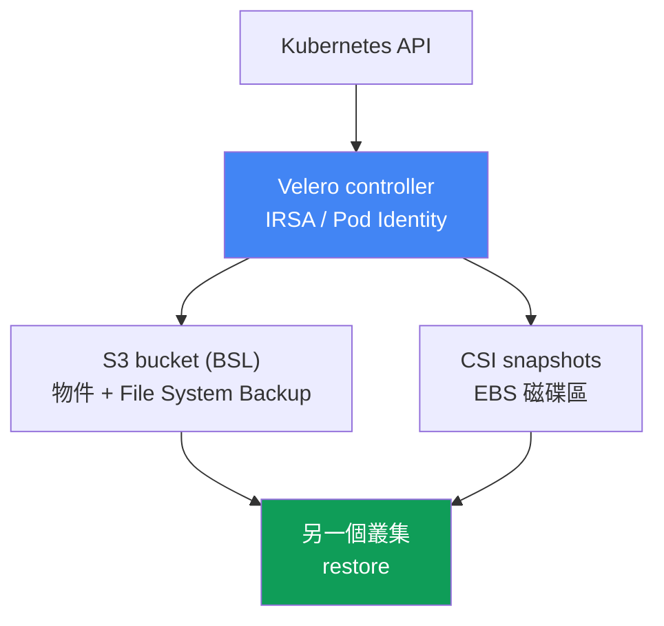

[Русская версия](ru.md) · [Eng version](en.md) · [Versión en español](es.md) · [Version française](fr.md) · [Deutsche Version](de.md) · [ქართული ვერსია](ge.md) · [日本語版](jp.md)
# 第 42 章。復原與 DR：還原至既有與新叢集、namespace restore、Velero

> **接下來。** 第 41 章介紹了備份：AWS Backup、composite recovery point，以及在同一個一致時間點的叢集和磁碟區狀態。但備份只完成一半：未經驗證的備份不算備份。本章說明如何從該時間點重新啟動：還原至既有或新叢集、精確的 namespace 還原、作為第二種工具的 Velero，以及 RTO/RPO 與 DR 策略。相關主題由其他章節說明：備份與 composite recovery point 見第 41 章；EBS 磁碟區與 AZ 的繫結見第 23 章；用於 DR 的多叢集與多帳戶連線見第 32 章；叢集版本回滾（這不是資料還原）見第 39 章。

## 42.1. 有備份，卻沒有人試過從中恢復

回到第 41 章的 incident：有人在錯誤的叢集中執行了 `kubectl delete namespace prod`。這次的好消息是，叢集有 backup plan，昨天的 composite recovery point 仍在，狀態為 `Completed`。值班人員開啟 AWS Backup console，找到該還原點，卻卡在從未有人事先回答的問題：

- 要還原整個叢集，還是只還原 namespace `prod`？
- 要寫回同一個叢集（它仍在運作，其他 namespace 正常工作），還是新的叢集？
- restore 會覆寫目前叢集中的內容嗎？
- snapshot 的磁碟區會在什麼 AZ 啟動，那裡有可用的 node 嗎？
- 這需要多久，是數分鐘還是數小時，能否符合向業務承諾的時間？

這正是本章要處理的痛點。沒有演練過 restore 的備份，只是保護的幻象。第一次真正的 restore 幾乎總是在緊急情況、壓力之下發生，沒有時間閱讀文件。更糟的是，情境各不相同。刪除了一個 namespace，就需要在仍運作的叢集中做精確還原。整個叢集遺失、區域毀損（或 ransomware 加密了資料），就需要還原至新叢集，可能還是在另一個區域或帳戶。這些是不同的操作，有不同的時間與陷阱，兩者都必須在 incident 發生前了解，而非在當下才了解。

因此本章的安排是：先介紹從 AWS Backup 還原（既有叢集、新叢集、cross-region 與 cross-account），再介紹精確的 namespace restore，接著是 Velero 與工具選擇，最後是 RTO/RPO 的 DR 概念與常見 restore 陷阱。

## 42.2. 從 AWS Backup restore：三種情境

AWS Backup 還原 composite recovery point（第 41 章）：叢集狀態（Kubernetes 物件）和相關磁碟區會一併還原。核心規則是：**restore 一律進入 target EKS cluster**，也就是一個既有的叢集。不能還原至「空無一物」：叢集要麼已存在，要麼 AWS Backup 在 restore 過程中建立一個新叢集。因此有三種情境：

| 情境 | 目的地 | 使用時機 |
|---|---|---|
| Existing cluster restore | 原始或另一個既有叢集 | 精確回復，叢集仍在運作 |
| New cluster restore | AWS Backup 建立新叢集並還原至其中 | 災難、叢集或區域遺失 |
| Namespace restore | 既有叢集，最多 5 個 namespace | namespace 被刪除、部分遺失 |

AWS Backup 中所有 restore 都有一項重要特性：它們是 **non-destructive**。restore 不會覆寫 target 叢集中既有的 Kubernetes 物件，也不會變更叢集版本。如果物件已存在，便會略過而非覆寫。略過的物件可透過 SNS 通知看到（應預先訂閱）。這保護仍運作的叢集不受破壞，但也表示在已損毀物件上進行 restore 並不會「修好」它，這會在陷阱章節說明。

**還原至既有叢集**，適用於精確回復：叢集仍在運作，但部分資料或物件遺失。前提是 target 叢集已安裝所需的 CSI driver（透過 addon 使用 EBS/EFS/S3，見第 23 章），否則磁碟區無處掛載。

**還原至新叢集**，適用於災難情況。AWS Backup 可自行建立叢集，但選項有限：名稱、Kubernetes 版本、VPC/subnet、IAM role、security group、node group、Fargate profile、pod identity association。若要完整控制，請預先建立叢集（console/eksctl/Terraform），並指定為 target。建立新叢集時，AWS Backup 會在叢集就緒後增加約 15 分鐘的緩衝時間，才開始建立資源，以便元件完成初始化。



**Cross-region 與 cross-account restore。** 另一個區域及帳戶中的 recovery point 副本（第 41 章），是遺失主要區域或帳戶遭入侵時的復原來源。從副本 restore 的方式相同，但增加了需求：若來源叢集已加密，需要具有目的地 KMS key 的 `encryptionConfigProviderKeyArn`（cross-region/cross-account 使用自己的 key），且工作負載所參考的 IAM role（IRSA、Pod Identity、OIDC provider）必須存在於目的地帳戶與區域。AWS Backup 不會建立這些 role，ARN 重新對應見第 42.8 節。

透過帶有 EKS metadata 的 `aws backup start-restore-job` 指令啟動 restore：必須提供 `clusterName`；對新叢集則須提供 `newCluster=true` 和巢狀欄位（`eksClusterVersion`、`clusterRole`、`clusterVpcConfig`、`nodeGroups`、`fargateProfiles`、`podIdentityAssociations`）。權限由受管政策 `AWSBackupServiceRolePolicyForRestores` 提供；S3 bucket 則使用 `AWSBackupServiceRolePolicyForS3Restore`。

## 42.3. 精確（selective）namespace 還原

完整 DR restore 是重型操作：當整個叢集不存在時，才需從頭啟動整個叢集。更常見的是較小的事件：一個 namespace 被刪除或損毀，而其餘叢集仍在工作。在此執行完整 restore 有害，既耗時又有風險。因此有 namespace restore。

Namespace restore 只將指定的 namespace（一次最多 5 個）、其 namespace-scoped 資源，以及相關的 persistent volume 還原至既有叢集。Cluster-scoped 資源（CRD、StorageClass、Namespace 物件、PersistentVolume）不包括在內，但與所還原磁碟區相關的 PV 除外。其邏輯同樣是 non-destructive：叢集中已存在的內容不會被覆寫。

它與完整 DR restore 的本質差異如下：

| | Namespace restore | Full/new cluster restore |
|---|---|---|
| 目標 | 將一部分還原至仍運作的叢集 | 重新啟動整個叢集 |
| 還原內容 | 最多 5 個 namespace 及其磁碟區 | 全部狀態及所有磁碟區 |
| Cluster-scoped 資源 | 排除（相關 PV 除外） | 會還原 |
| 典型觸發條件 | namespace prod 被刪除 | 叢集/區域遺失 |
| RTO | 數分鐘至數十分鐘 | 數小時 |

實際意義是：namespace restore 是操作人員日常使用的標準工具，而還原至新叢集的 DR-restore 是罕見且重大的事件。兩者都要測試，但測試方式不同（第 42.8 節）。

## 42.4. 物件還原順序

restore 時，物件建立順序很重要：PVC 必須在 Pod 前建立、CRD 必須在 custom resource 前建立、namespace 必須在其內部資源前建立。AWS Backup 預設採用合理順序：先是 cluster-scoped 資源（CustomResourceDefinitions、Namespaces、StorageClasses、PersistentVolumes），接著是 namespace-scoped 資源（PersistentVolumeClaims、Secrets、ConfigMaps、ServiceAccounts、LimitRanges、Pods、ReplicaSets）。必要時，可透過 `kubernetesRestoreOrder` 覆寫此順序（格式為 `group/version/kind` 或 `version/kind`）。

物件還原後，接著是儲存體繫結。對 EBS snapshot，必須指定建立磁碟區的 Availability Zone；AWS Backup 會嘗試在相同的 AZ 啟動 Pod，以便掛載磁碟區（與第 23 章相關）。EFS 還原至隨機前綴，並要求在 restore 後手動建立 access point，AWS Backup 不會自行建立。

## 42.5. Velero：Kubernetes-native backup 與 restore

Velero 是一個在叢集內運作的開源 backup 與 restore 工具。與 AWS Backup（外部 AWS 服務）不同，Velero 透過 Kubernetes API 運作，並且更貼近叢集本身。它的強項是可攜性：它可以 restore 至**另一個**叢集，因此適合用於遷移與 DR。

與 AWS 的整合由官方 velero-plugin-for-aws 提供：它新增 S3 的 object store plugin（BSL）及 EBS snapshot 的 volume snapshotter plugin。安裝 `velero install` 時透過 `--plugins velero/velero-plugin-for-aws:<版本>` 旗標指定此 plugin。其運作方式如下：

- **物件備份。** Velero 透過 Kubernetes API 讀取物件，並將其打包成 tarball 存入 object storage，也就是由 BackupStorageLocation (BSL) 指定的 S3 bucket。
- **磁碟區 snapshot。** PV 資料可透過 CSI volume snapshots（由 driver 建立 EBS snapshot），或透過 File System Backup（將磁碟區內容逐檔複製至同一 bucket，也能跨 provider 運作）擷取。
- **Selector。** Backup 可依 namespace（`--include-namespaces`）或 label（`--selector`）限制，實現精細且精確的涵蓋範圍，甚至到單一工作負載。
- **排程。** Schedule 物件（`velero schedule create --schedule="0 2 * * *"`）依 cron 進行 backup；排程頻率直接決定 RPO（第 42.7 節）。
- **Backup hook。** 透過 `pre.hook.backup.velero.io/command` 與 `post.hook.backup.velero.io/command` annotation，Velero 在擷取 backup 前後於 container 中執行指令：排清 DB buffer、凍結並解除凍結檔案系統。這是 AWS Backup（第 41 章）所沒有的能力，也是對具有 DB 的 StatefulSet 而言選擇 Velero 的主要理由。指令不是在 shell 中執行，因此應寫成 argument 清單，而非帶有 pipe 的字串。
- **Restore hook。** restore 時 Velero 可在 Pod 中執行 init-container 與 exec-hook，例如等待磁碟區就緒，或在應用程式啟動前預熱狀態。
- **還原至另一個叢集。** 在具有相同 BSL 的目標叢集中執行 `velero restore create --from-backup <name>`，即可從 backup 啟動工作負載，這是遷移與 DR 的基礎。

Velero 對 AWS 的存取不是透過靜態 key，而是透過 **IRSA 或 EKS Pod Identity**（第 16 至 17 章）：Velero controller 的 ServiceAccount 與 IAM role 關聯，該 role 具備 S3 bucket（BSL）與 EBS snapshot 的權限。這與任何叢集 controller 相同，遵循最小權限原則。

**Velero backup 的 S3 Object Lock。** Velero backup 位於 S3 bucket，預設情況下，寫入它們的同一 IAM role 也可以刪除它們：若叢集遭入侵或發生 ransomware，backup 往往最先被刪除或加密。此處 bucket 的保護完全由您負責，沒有 AWS Backup 的受管 Vault Lock。答案是 S3 Object Lock（WORM）：在 bucket 上啟用（需要 versioning）後，Compliance 模式會讓物件版本在 retention 期間不可變更，即使 root 也無法刪除。因此 backup 能存活於錯誤的 `velero backup delete`，以及擁有 bucket 權限的攻擊者。

有兩個容易誤導預期的細節。第一，Object Lock 保護的是**物件版本**，但不會阻止在其上建立 delete marker。沒有 version id 的普通 `DELETE` 會以 `200 OK` 成功執行，受保護的版本仍然存在，但會變成非目前版本，backup bucket 的清單中不再顯示它，Velero 也會視其為消失。換言之，WORM 提供的是可復原性（移除 delete marker 後，版本仍完好），而不是保證 backup 始終可見：仍然必須監控還原點是否存在。第二，lock 期限必須與排程 TTL 協調，且方向要正確：TTL 不得小於 Object Lock 期限。Velero 以相同的普通 `DELETE` 刪除過期 backup，因此不會因為 `AccessDenied` 而失敗；若 TTL 小於 lock 期限，backup 會被視為已刪除，但版本仍會保留並計費直到 retention 結束，且 lifecycle rule 也無法清除它。`AccessDenied` (403) 會發生在另一種情況：以 version id 指定刪除版本的人，例如手動清理 bucket、Batch Operations 或緊急釋放空間的 script。



## 42.6. Velero 或 AWS Backup

這些工具並非互斥，但從不同角度解決問題。可依下列準則選擇：

| 準則 | AWS Backup | Velero |
|---|---|---|
| 性質 | 受管 AWS 服務 | k8s-native，安裝於叢集 |
| 單位 | composite recovery point | Backup（物件 + 磁碟區） |
| 政策/保護 | backup plan、vault、Vault Lock (WORM) | Schedule retention；bucket 保護由您負責，使用 S3 Object Lock (WORM) |
| 可攜性 | AWS 內部（cross-region/account） | 跨叢集、distribution、cloud |
| Selective | namespace restore（最多 5 個） | 精細：namespace、label、資源 |
| 遷移 | 非主要用途 | 主要使用情境 |

簡言之，當需要 AWS 範圍內、具有集中式政策、composite 還原點與 immutability（Vault Lock）的受管 backup 時，選擇 **AWS Backup**。當需要跨叢集與 cloud 的可攜性與遷移、精細選取及 Kubernetes-native backup 管理時，選擇 **Velero**。許多團隊同時保留兩者：AWS Backup 用於 AWS 內的政策與 DR，Velero 用於遷移與細粒度 restore。

## 42.7. DR 概念：RTO、RPO 與策略

任何 restore 的討論都歸結於兩個指標：

- **RTO (recovery time objective)**：事故後服務必須在多久內恢復。
- **RPO (recovery point objective)**：可接受遺失多少資料，亦即回退到過去的哪個時間點。**RPO 直接由 backup 頻率決定**：每日 backup 一次，RPO 最多一天；每小時執行一次 Velero 排程，RPO 約一小時。

AWS 定義了四種成本遞增、RTO/RPO 遞減的 DR 策略（Well-Architected）：

| 策略 | RPO / RTO | 核心概念 |
|---|---|---|
| Backup and restore | RPO 數小時，RTO 最多一天 | 在另一個區域備份，發生事故時才 restore |
| Pilot light | RPO 數分鐘，RTO 數十分鐘 | 資料已複寫，核心已關閉，事故時啟用 |
| Warm standby | 更低 | 縮小版副本持續運作，事故時擴展 |
| Multi-site active-active | 接近零 | 多個區域同時完整運作 |

對典型 EKS 叢集，從 AWS Backup 或 Velero 復原屬於 **backup and restore** 策略：成本低，但 RTO 以小時計（啟動叢集、還原狀態與磁碟區、重建 load balancer 與 DNS）。若要走向 pilot light 或更高階策略，則需要預先準備備用叢集，以及將資料複寫至另一個區域（連線見第 32 章），成本更高。選擇策略是 RTO/RPO 與成本之間有意識的取捨，而非「讓它更可靠」。

## 42.8. Restore 陷阱

Restore 並非在 backup 時失敗，而是敗在環境細節。應預先檢查以下內容：

- **PV 與 AZ 的繫結。** 磁碟區會由 snapshot 還原至特定 AZ，Pod 必須也在該 AZ，否則無法掛載磁碟區（第 23 章）。對新的 PVC，`volumeBindingMode: WaitForFirstConsumer` 與 topology-aware provisioning 有幫助；從 snapshot restore 時，AZ 由 snapshot 固定，目標 AZ 必須有 node。
- **嚴格的 `nodeSelector`、affinity 與 taint。** 還原的 manifest 帶有來源叢集的 node 要求，但目標叢集的 node pool 可能不同：pool label 不同、沒有所需 instance type，或有自己的 taint。Pod 會建立卻永遠停在 `Pending`，並顯示 `node(s) didn't match Pod's node affinity/selector` 或 `node(s) had untolerated taint`。關鍵在於：scheduler 比對的是**label**，而不是 node group 或 NodePool 的名稱。因此 DR 叢集應依 label 準備，而非只是重新命名 pool，必須匹配工作負載所選取的 key 與 value（`karpenter.sh/nodepool`、`karpenter.sh/capacity-type`、`kubernetes.io/arch`、managed node group 使用的前綴為 `eks.amazonaws.com` 的 label）。若目標叢集的 zone 較少，帶有 `whenUnsatisfiable: DoNotSchedule` 的 `topologySpreadConstraints` 也有相同效果。Velero 可即時修正：使用 Resource Modifiers，即透過 `--resource-modifier-configmap` 旗標連接的、包含 JSON patch 的 ConfigMap，以 `remove` 操作移除 `nodeSelector` 或替換 label（規則中的條件要依**來源** namespace 寫，即使 restore 使用 `--namespace-mappings`）。AWS Backup 不支援 manifest mutation：必須預先讓目標叢集的 label 與來源一致，或在 restore 後修正物件。
- **Non-destructive 與仍運作的叢集。** Restore 不會覆寫既有物件。若物件已損毀但仍存在，restore 會略過它：要回退至「良好」版本，必須先刪除物件，再還原。不可變欄位（例如 Deployment selector、部分 Service 欄位）發生衝突時也會被略過，而非覆寫。
- **IRSA/Pod Identity 與 ARN 重新對應。** restore 至另一帳戶/區域時，來源帳戶的 IRSA role、OIDC provider 及 Pod Identity association 並不存在。帶有舊 role ARN annotation 的 SA 不會工作，直到在目標帳戶中重新建立 role。
- **Load balancer 與 DNS。** NLB/ALB 及 Route 53 record 繫結於來源環境。restore 後，AWS Load Balancer Controller 會重建 load balancer（第 26 至 28 章），而 external-dns 與 cert-manager 會重建 DNS 與 certificate（第 29 章）；位址與 ARN 都會變更，必須納入計畫。
- **順序與版本。** 先 namespace 與 CRD，接著 StorageClass 與 PV，最後才是工作負載（第 42.4 節）。物件 API 版本必須受目標叢集支援：在 Kubernetes 版本差異很大的叢集間 restore 屬於 best effort，可能發生不相容。
- **映像檔與 registry。** Backup 不保存 container image（第 41 章）。目標帳戶/區域必須可存取 ECR 或 image 所在的 registry，否則 Pod 無法啟動。

最重要的規則是：定期測試 restore，不要等到事故發生。每季進行一次 game day，在獨立 namespace 或臨時叢集中 restore recovery point（或 Velero backup），並測量實際 RTO。只有經過 game day 驗證的 restore，才是在 incident 中可以依靠的 restore。

## 42.9. Game day：演練區域故障（region failover）

DR 策略（第 42.7 節）與 game day 實務已分別說明；現在將兩者合併為一個具體情境：主要區域完全故障。這是從 cross-region 副本（第 41 章）進行、還原至新叢集（第 42.2 節）並透過 DNS 切換流量的重大 restore。按步驟將它作為演練執行，並測量實際 RTO/RPO：

1. **宣告 failover。** 主要區域不可用；切換至事先選定的備用區域，該處存有 recovery point 的 cross-region 副本（第 41 章）。
2. **啟動叢集。** warm standby / blue-green 叢集可能已經就緒，也可能以新方式建立（eksctl/Terraform）；前提是備用區域的 IRSA/Pod Identity IAM role、OIDC provider 及 ECR 存取已預先建立（第 42.8 節）。
3. **還原狀態與磁碟區。** 從 cross-region 副本使用目的地 KMS key 執行 `aws backup start-restore-job`（第 42.2 節），或在目標叢集中從 S3 執行 `velero restore create`。
4. **檢查連線。** 依第 32 章檢查備用區域中的多區域網路、資料與依賴服務存取。
5. **檢查資料。** 在切換流量之前，確認磁碟區已掛載且資料完整：執行應用程式 smoke test，並核對還原副本的時間點（RPO），而不是「Pod 啟動了就表示準備好了」。
6. **切換流量。** Route 53 透過搭配 health check 的 weighted/failover record 將 record 切換至新區域（第 29 章）：當主要區域的 health check 為「紅色」時，failover record 會將流量導向備用區域；load balancer 由 controller 重建（第 42.8 節）。
7. **測量 RTO/RPO。** 對照 SLA 中的目標（第 42.7 節），記錄服務恢復前的實際時間（RTO）及副本中的資料時間點（RPO）；差異將成為下一次 game day 的輸入。

步驟 2 至 3 對 RTO 的影響程度，由選定的 DR 策略（第 42.7 節）決定：在 backup and restore 下，叢集與資料從零啟動，RTO 為數小時；在 pilot light/warm standby 下，備用區域已部分運作，failover 僅剩擴展與切換 Route 53。

## 42.10. 如何在 production 中應用

- **預先撰寫 restore runbook。** 針對兩種情境（仍運作叢集中的 namespace-restore，以及新叢集中的完整 restore）記錄指令與負責人，而不是「到時候再想辦法」。
- **定期進行 game day。** 每季在獨立 namespace 或臨時叢集中 restore 最新還原點，並記錄實際 RTO 與目標的差距。
- **預先準備 DR 的目標帳戶。** 在事故前於 DR 帳戶建立 IRSA/Pod Identity IAM role、OIDC provider、security group 與 ECR 存取，而不是 restore 時才建立。同時準備 node pool label：備用叢集必須擁有工作負載用於選擇 node 的那些 key 與 value，否則還原的 Pod 將停在 `Pending`。
- **訂閱關於略過物件的 SNS 通知。** Non-destructive restore 會靜默略過既有內容；沒有略過通知，很容易得到不完整的復原。
- **在 SLA 中明確定義 RTO/RPO。** 與業務協調 backup 頻率（RPO）及目標恢復時間（RTO），並與 DR 策略對照，而非憑感覺選擇。
- **有意識地同時使用兩種工具。** AWS Backup 用於 AWS 中的政策與 DR，Velero 用於遷移與精確 selective restore；應明確知道各自何時為主要工具。

## 42.11. 小型詞彙表

- **restore job**：AWS Backup 中的還原工作；以 `start-restore-job` 啟動，以 `list-restore-jobs`/`describe-restore-job` 追蹤。
- **target EKS cluster**：restore 寫入的既有叢集；或由 AWS Backup 在 restore 中建立（`newCluster=true`）。
- **non-destructive restore**：既有物件不會被覆寫而是被略過的模式（略過情況可透過 SNS 查看）。
- **namespace restore**：將最多 5 個 namespace 精確還原至既有叢集，不包含 cluster-scoped 資源（相關 PV 除外）。
- **Velero**：Kubernetes-native backup/restore；物件存於 S3（BackupStorageLocation），磁碟區透過 CSI snapshots 或 File System Backup。
- **BackupStorageLocation (BSL)**：Velero backup 的儲存位置（S3 bucket）。
- **velero-plugin-for-aws**：Velero 的 AWS 官方 plugin：為 S3（BSL）提供 object store，並為 EBS snapshot 提供 volume snapshotter。
- **S3 Object Lock**：S3 bucket 的 WORM 保護：在 retention 期間使物件版本不可變更（Governance/Compliance），保護 Velero backup 不被刪除或加密。
- **Schedule**：用於依 cron 定期 backup 的 Velero 物件；決定 RPO。
- **restore hook**：Velero 在 Pod restore 時執行的 init-container 或 exec 指令。
- **Resource Modifiers**：包含 restore 時物件 JSON patch 的 Velero ConfigMap（`--resource-modifier-configmap`）；用於移除與目標叢集不相容的欄位。
- **RTO**：事故後服務恢復的目標時間。
- **RPO**：可接受的資料遺失量；由 backup 頻率決定。

## 42.12. 本章重點

- 未驗證的備份不算備份：第一次 restore 不應延至事故發生時，必須事先在 game day 演練。
- Restore 情境不同：仍運作叢集中的精確 namespace-restore，與新叢集中的完整 DR-restore，是具有不同 RTO 與不同陷阱的不同操作。
- AWS Backup 一律還原至 target EKS cluster：既有叢集或它建立的叢集；所有 restore 都是 non-destructive，不會覆寫既有物件或叢集版本。
- Namespace restore 將最多 5 個 namespace 及其磁碟區還原至既有叢集，排除 cluster-scoped 資源，但相關 PV 除外。
- 從副本進行的 cross-region 與 cross-account restore（第 41 章）是 DR 的基礎；需要目的地 KMS key 與在目標帳戶預先建立的 IAM role。
- Restore 順序很重要：先 CRD/Namespaces/StorageClasses/PV，再 PVC/Secrets/Pod；EBS 磁碟區在 snapshot 的 AZ 啟動，EFS 需要手動 access point。
- Velero 是 Kubernetes-native backup/restore：物件存於 S3 (BSL)，磁碟區透過 CSI 或 File System Backup，具備 selector、Schedule、restore hook 與還原至另一叢集的能力（遷移與 DR）。
- AWS Backup 是受管、composite、具 Vault Lock；Velero 可攜、具精細 selective 還原並可跨叢集與 cloud 遷移；常同時保留兩者；Velero bucket 使用 S3 Object Lock 保護。
- RPO 由 backup 頻率決定，DR 策略（backup and restore、pilot light、warm standby、multi-site）是在 RTO/RPO 與成本之間的取捨。
- Restore 陷阱包括：磁碟區的 AZ、嚴格 `nodeSelector` 與 taint 下的 node label、non-destructive 略過、IRSA/ARN 重新對應、重建 load balancer 與 DNS、順序與版本相容性，以及 image 存取。

## 42.13. 這如何用於實際工作

值班時，本章能將 backup 轉變為真正的復原。當 namespace 被刪除或叢集遺失，問題不是「是否有 backup」（第 41 章已確認），而是「我如何、在多久內將它啟動」。答案必須在 incident 前寫入 runbook：每種情境使用哪一種 restore、目標是哪個叢集、有哪些前提（CSI driver、IAM role、ECR 存取），以及預期 RTO 為何。事故發生時，依這份 runbook 復原，而不是即興處理。

規劃叢集時，這增加了必要項目：與業務協調的 RTO/RPO，以及與之相應的 DR 策略；經 game day 演練的 restore（namespace 與完整）；具有重新建立 role 與存取權的就緒 DR 帳戶；並考量 restore 會重建 LB 與 DNS、磁碟區受限於 AZ。加上第 41 章的 backup，便形成完整保護迴圈：backup 加上經驗證的 restore，再加上具備 RTO/RPO 的 DR 計畫，才是真正的保護，而非幻象。

## 42.14. 自我檢查問題

1. 為什麼未驗證的 backup 不算 backup，實務上如何處理？
2. 依情境而言，還原至既有叢集與還原至新叢集有何不同？
3. AWS Backup 的 non-destructive restore 是什麼意思，這項特性有什麼後果？
4. Namespace restore 還原什麼，排除哪些資源？
5. 為何 restore 會進入 target EKS cluster，AWS Backup 在 `newCluster=true` 時做什麼？
6. Cross-region 與 cross-account restore 會增加哪些額外需求？
7. AWS Backup 依什麼順序還原物件，為什麼順序重要？
8. Velero 如何 backup 物件和磁碟區，File System Backup 與 CSI snapshot 有何不同？
9. Velero 如何還原至另一叢集，為何需要 IRSA 或 Pod Identity？
10. 何時選擇 AWS Backup，何時選擇 Velero，為什麼常同時保留兩者？
11. 什麼是 RTO 和 RPO，backup 頻率如何與 RPO 相關？
12. DR 策略（backup and restore、pilot light、warm standby、multi-site）有何差異？
13. 為何還原的 EBS 磁碟區可能無法掛載，這與 AZ 有何關係（第 23 章）？
14. Restore 至另一帳戶時，role、load balancer、DNS、image 會有哪些陷阱？
15. 為何還原的 Pod 在 DR 叢集中可能永遠處於 `Pending`，而 Velero 與 AWS Backup 各自能做和不能做什麼？
16. S3 Object Lock 對 Velero backup 確切保護什麼，為何在受保護版本上建立 delete marker 仍可成功，以及這與排程 TTL 有何關係？

## 實作練習

本課程針對此主題的 lab：[lab 122 - 適用於 EKS 的 AWS Backup](../../labs/122/README_TW.MD)。在其中，您會將 namespace restore 至仍運作的叢集、看到 non-destructive 行為（既有物件不會被覆寫），並理解為何叢集版本回滾不會帶回已刪除的 namespace；使用 `check_result` 指令驗證。啟動方式為 `TASK=122 make run_eks_task`。

除了 lab 外，也可透過工具查看還原狀態。先使用 AWS Backup：查看可用還原點，並啟動還原至獨立 namespace 的測試 restore，而非 prod。

```bash
# restore job 歷史紀錄（狀態、持續時間）
aws backup list-restore-jobs
# 特定 restore 工作的詳細資料
aws backup describe-restore-job --restore-job-id <id>
```

透過帶有 EKS metadata 的 `start-restore-job` 啟動 restore（至少需要 `clusterName`）；namespace restore 則指定目標叢集與 namespace 名稱。請對照 AWS Backup 文件確認完整 metadata 欄位，以免在事故中出錯。

對 Velero，確認 backup 正在建立並能還原，並演練還原至測試 namespace：

```bash
# backup 與排程清單
velero backup get
velero schedule get
# 將整個 backup 或只有 namespace 還原至測試環境
velero restore create --from-backup <backup> --include-namespaces test-restore
# restore 狀態
velero restore get
```

本章最重要的實作是定期 game day：每季將最新還原點還原至獨立 namespace 或臨時叢集，並測量實際 RTO。關於 backup 與 composite recovery point 見第 41 章；關於磁碟區與 AZ 的繫結見第 23 章；關於用於 DR 的多叢集連線見第 32 章；關於叢集版本回滾（這不是資料 restore）見第 39 章。

---
[目錄](../README_TW.md) · [第 41 章](../41/tw.md) · [第 43 章](../43/tw.md)
