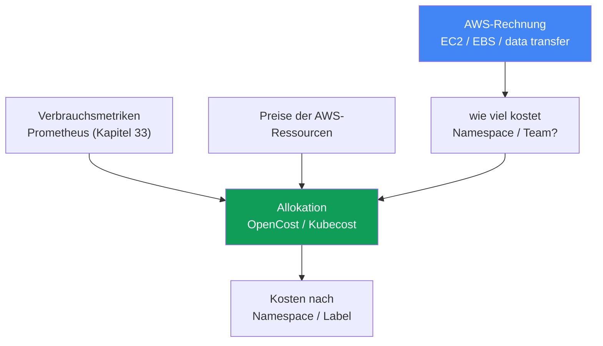
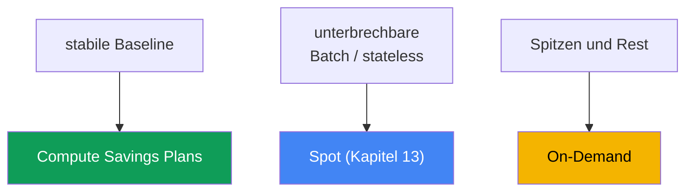

[Eng version](en.md) · [Versión en español](es.md) · [Version française](fr.md) · [Русская версия](ru.md) · [ქართული ვერსია](ge.md) · [繁體中文版](tw.md) · [日本語版](jp.md)
# Kapitel 43. Kosten: OpenCost und Kubecost, Right-Sizing, Savings Plans, Spot-Mix, Datenverkehr

> **Wie es weitergeht.** Die Kapitel 33-36 behandelten die Observability: Metriken, Logs, Traces - Sie sehen, was der Cluster tut. Dieses Kapitel behandelt, was das kostet, und wie Sie die Frage des Business beantworten, „wie viel kostet Team X oder Service Y“. Verwandte Themen behandeln andere Kapitel: Spot und Beschaffungsmodelle für Nodes in Kapitel 13, Sizing von Pods über requests/limits und VPA in Kapitel 14, Consolidation und Bin-Packing mit Karpenter in Kapitel 12, Kosten für Datenverkehr (NAT, cross-AZ, Endpoints) in Kapitel 31, Logs und ihre Kosten in Kapitel 34 sowie gp3 und EBS-Volumes in Kapitel 23. Hier fügen wir dies zu einem Gesamtbild zusammen und ergänzen die Kostenallokation auf Kubernetes-Objekte sowie AWS-Commitment-Modelle.

## 43.1. Die Rechnung steigt, aber es ist unklar, wofür

Die Finanzabteilung kommt mit einer einfachen Frage: Die EKS-Rechnung ist im Quartal um ein Drittel gestiegen, erklären Sie warum und wer das ausgibt. Der Bereitschaftsdienst öffnet Cost Explorer und sieht die AWS-Wahrheit: eine große Zeile `Amazon Elastic Compute Cloud` (die Nodes unter dem Cluster), eine Zeile `EBS`, eine Zeile `data transfer`. Das ist alles. Diese Summen lassen sich nicht nach Namespace, Team oder Service aufschlüsseln - solche Konzepte kennt das AWS-Billing nicht.

Gleichzeitig zeigt `kubectl top` die andere Hälfte des Problems:

```bash
# tatsächlicher Verbrauch der Pods
kubectl top pods -A --sort-by=cpu
# angefordert gegenüber Node-Kapazität
kubectl describe node <node> | grep -A6 "Allocated resources"
```

Das Bild ist typisch: Ein Pod hat `cpu: 2` und `memory: 4Gi` angefordert, aber `kubectl top` zeigt 200m und 600Mi. Requests sind um ein Vielfaches zu hoch. Karpenter (Kapitel 12) hat für diese requests ehrlich Kapazität reserviert und Nodes hochgefahren - für die Sie bezahlen, obwohl die Pods sie nicht nutzen. Die Nodes sind „auf dem Papier“ belegt und faktisch fast leer.

Zwei verschiedene Lücken in einer Rechnung:

- **Keine Allokation.** AWS berechnet Ressourcen (Instanzen, Volumes, Datenverkehr), nicht Namespaces. Auf einem Node laufen Pods vieler Teams - das AWS-Billing unterscheidet sie nicht.
- **Keine Effizienz.** Requests sind zu hoch, Bin-Packing reserviert Leere, Nodes stehen ungenutzt herum. Wir zahlen für Reserviertes, nicht für Genutztes.

Daraus ergibt sich der Plan des Kapitels: zunächst, warum die AWS-Rechnung die Frage nach der Allokation nicht beantwortet und wie sie zurückgewonnen wird (OpenCost, Kubecost); dann der wichtigste Hebel zum Sparen - Right-Sizing; danach die Beschaffungsmodelle für Compute (On-Demand, Spot, Savings Plans, Reserved) und ihr Mix; anschließend Datenverkehrs- und Speicherposten; zum Schluss FinOps-Praktiken und Optimierungsprioritäten.

## 43.2. Warum die AWS-Rechnung nichts über Namespaces weiß

AWS-Billing arbeitet auf Ressourcenebene: Eine EC2-Instanz lief so viele Stunden dieses Typs, ein `gp3`-Volume belegte so viele GiB, so viele Gigabyte gingen cross-AZ und durch NAT. Das sind physische und virtuelle AWS-Entitäten. Kubernetes unterteilt dagegen einen Node in Pods und verteilt sie auf verschiedene Deployments in verschiedenen Namespaces verschiedener Teams. Zwischen „die Instanz `m6i.2xlarge` lief 720 Stunden“ und „der Service `checkout` des Teams `payments` kostete so viel“ liegt eine Lücke, die AWS nicht überbrückt.

Die Verbindung lässt sich nur innerhalb von Kubernetes wiederherstellen: den tatsächlichen Verbrauch jedes Pods (CPU, Arbeitsspeicher, Speicher, Netzwerk) aus Metriken nehmen, den Preis der Node-Ressourcen von AWS nehmen und die Node-Kosten proportional zu ihrem Verbrauch oder ihren requests auf die Pods verteilen. Anschließend die Pods über Labels zu Deployment, Namespace und Team zusammenfassen. Das nennt man Kostenallokation (cost allocation), und sie wird durch ein separates Werkzeug vorgenommen, nicht durch AWS-Billing.



## 43.3. OpenCost und Kubecost

**OpenCost** ist ein offener, herstellerneutraler Standard für die Kostenallokation von Kubernetes, ein CNCF-Projekt (seit Oktober 2024 in Inkubation). Sein Ziel wird als „Prometheus für Kostenmonitoring“ formuliert: ein einheitliches Modell, auf dem andere Lösungen aufbauen. Die Funktionsweise ist direkt:

- Es übernimmt den Verbrauch der Pods aus Metriken (Prometheus, Kapitel 33): CPU, Arbeitsspeicher, Speicher, Netzwerk.
- Es übernimmt die Preise der AWS-Ressourcen - auf EKS zieht es den öffentlichen On-Demand-Preis selbst; eine zusätzliche Konfiguration ist nicht erforderlich.
- Es verteilt die Kosten der Nodes auf Pods und aggregiert nach Namespace, Deployment, Label und SA.

Das Ergebnis wird über eine API und in einem für Dashboards geeigneten Format bereitgestellt. OpenCost ist eine minimal gehaltene Allokations-Engine.

**Kubecost** ist ein auf OpenCost basierendes Produkt: dieselbe Engine plus UI mit Dashboards, Verlauf, Berichten, Optimierungsempfehlungen und Savings Insights. Für EKS gibt es das **Amazon EKS optimized Kubecost bundle**, das als EKS-Add-on oder über Helm installiert wird; Support kann über bestehende AWS-Supportvereinbarungen bezogen werden. Kubecost speichert Daten in einem Prometheus-kompatiblen Speicher (in aktuellen Versionen für Multi-Cluster in S3-kompatiblem Object Storage).

**Exakte Kosten über den Cost and Usage Report.** Der öffentliche On-Demand-Preis zeichnet ein zu hohes Bild: Er kennt Ihre Rabatte nicht. Sowohl OpenCost als auch Kubecost können an den AWS Cost and Usage Report angebunden werden - das detaillierte Billing in S3, das mit Athena-Abfragen gelesen wird - und die Allokation mit der tatsächlich gestellten Rechnung abgleichen (reconcile). Dann fließen die realen Preise einschließlich Rabatten durch Savings Plans, Reserved Instances, Spot und Enterprise-Rabatte in die Node-Kosten ein, statt des Katalogpreises. Ohne diesen Abgleich ist die Allokation in den Verhältnissen zwischen Teams korrekt, absolut jedoch zu hoch.

| | OpenCost | Kubecost |
|---|---|---|
| Was es ist | Allokations-Engine und -Standard (CNCF) | auf OpenCost basierendes Produkt |
| Oberfläche | API, minimales UI | vollständiges UI, Dashboards, Berichte |
| Empfehlungen | nein | Right-Sizing, Savings Insights |
| Auf EKS | Helm, Metriken aus Prometheus | EKS-Add-on oder Helm, EKS-optimized bundle |
| Wann gewählt wird | offener Standard und Daten werden benötigt | UI, Berichte und Empfehlungen sofort verfügbar sein sollen |

**Aufteilung gemeinsamer (shared) Kosten.** Nicht alles lässt sich direkt auf Pods verteilen. Einige Kosten trägt der gesamte Cluster: die stündliche Gebühr für die Control Plane, System-Namespaces (`kube-system` und Add-ons) und vor allem **idle-Kapazität**: die Differenz zwischen dem, wofür wir bezahlen (Node-Kapazität), und dem, was Pods tatsächlich verbrauchen. Das Werkzeug zeigt diese shared costs entweder als separate Zeile oder verteilt sie nach der gewählten Regel auf Teams (gleichmäßig, proportional zum Verbrauch, nach gewichteten Anteilen). Idle ist die wichtigste Zeile: Ein hoher Idle-Wert weist unmittelbar auf zu hohe requests und schlechtes Bin-Packing hin, also auf Right-Sizing-Potenzial (Abschnitt 43.4).

**Showback gegenüber Chargeback.** Die Allokation ist für eines von zwei Modellen erforderlich:

- **showback** - Teams erhalten ihre Kosten als Information, ohne Geldbewegung. Der erste Schritt: Ausgaben sichtbar machen, damit Teams Anomalien selbst bemerken.
- **chargeback** - Kosten werden tatsächlich dem Budget des Teams zugeordnet, Geld wird innerhalb des Unternehmens umgelegt. Das erfordert ein ausgereiftes Accounting, Vertrauen in die Allokationszahlen und abgestimmte Regeln für shared costs.

Fast immer beginnt man mit Showback: Es ist politisch günstiger und verändert bereits das Verhalten.

## 43.4. Right-Sizing - der wichtigste Hebel

Die größte Ersparnis bei EKS entsteht gewöhnlich nicht durch Commitments und nicht durch Spot, sondern durch die Beseitigung von Leere. Die Logik der Kette: Requests sind zu hoch → Bin-Packing (Karpenter, Kapitel 12) reserviert Kapazität → Karpenter fährt Nodes für diese reservierte Kapazität hoch → Sie bezahlen für Nodes, die die Pods nicht verwenden. Überhöhte `requests` sind bezahlte Leere, multipliziert mit der Anzahl der Replikate.

Die Diagnose ist der Vergleich von requested und used:

```bash
# Pod-Requests
kubectl get pods -A -o custom-columns=\
NS:.metadata.namespace,POD:.metadata.name,\
CPU_REQ:.spec.containers[*].resources.requests.cpu,\
MEM_REQ:.spec.containers[*].resources.requests.memory
# tatsächlicher Verbrauch
kubectl top pods -A
```

Genauer und über die Zeit liefern dies die Metriken (Kapitel 33) und VPA-Empfehlungen im Empfehlungsmodus (Kapitel 14): VPA beobachtet den Verbrauch und schlägt angemessene Werte für `requests` vor. Das Senken der requests auf den tatsächlichen Verbrauch (mit Reserve für Spitzen) verdichtet die Nodes: Auf denselben Node passen mehr Pods, die Consolidation von Karpenter (Kapitel 12) entfernt überflüssige Nodes, die Rechnung sinkt.

Grenzen der Vorsicht:

- **memory `limits` und OOMKill.** Ein zu niedriges Speicherlimit führt dazu, dass der Pod durch OOM beendet wird. Arbeitsspeicher ist eine nicht komprimierbare Ressource: Das Limit wird vorsichtig gesenkt, mit Reserve für Spitzen und unter Berücksichtigung der tatsächlichen Spitzenwerte aus Metriken.
- **CPU `limits` und Throttling.** Ein hartes CPU-Limit drosselt einen Pod bei Spitzen durch Throttling. Oft ist es richtiger, `requests` zu setzen und kein CPU-`limit` zu setzen (oder ein großzügiges zu geben) - siehe Kapitel 14.
- **Baseline nicht zu niedrig ansetzen.** Right-Sizing richtet sich nach nachhaltigem Verbrauch plus Headroom, nicht nach dem Minimum: Andernfalls wird die reguläre Tagesspitze zu einem Incident.

Right-Sizing und Bin-Packing stehen in der Optimierungsreihenfolge an erster Stelle: Sie senken die tatsächlich benötigte Kapazität, und erst auf das verringerte, stabile Volumen werden Rabattmodelle angewendet (Abschnitt 43.6).

## 43.5. Beschaffungsmodelle für Compute

EKS-Nodes sind EC2, und Sie können auf verschiedene Arten dafür bezahlen. Rabattmodelle ändern nicht, wie viel Sie verbrauchen; sie ändern den Preis pro Einheit. Deshalb werden sie nach dem Right-Sizing auf ein bereits stabiles Volumen angewendet (andernfalls committen Sie Leere).

| Modell | Verpflichtung | Unterbrechbarkeit | Einsatzgebiet |
|---|---|---|---|
| On-Demand | keine | nein | Spitzen, Rest, alles Nichtabgedeckte |
| Spot | keine | ja, mit Benachrichtigung | fehlertolerant, Batch, stateless (Kapitel 13) |
| Compute Savings Plans | $/Stunde für 1 oder 3 Jahre | nein | stabiler Compute-Baseline |
| Reserved Instances | konkrete Konfiguration, 1-3 Jahre | nein | langfristige stabile spezifische Workloads |

- **On-Demand** ist der Basismodus: Sie bezahlen die Betriebsstunde ohne Verpflichtung, zum höchsten Preis. Das ist der Standard und der „Rest“, der alles abdeckt, was nicht in andere Modelle fällt.
- **Spot** (Kapitel 13) ist freie AWS-Kapazität mit hohem Rabatt, die jedoch mit kurzer Benachrichtigung entzogen werden kann. Geeignet ist sie für Workloads, die eine Unterbrechung überstehen: stateless Services mit mehreren Replikaten, Queue-Verarbeitung, Batch und CI. Diversifizierung über Instanztypen und AZ reduziert das Risiko eines gleichzeitigen Entzugs - ausführlich in Kapitel 13.
- **Compute Savings Plans** sind die Verpflichtung, über 1 oder 3 Jahre einen bestimmten Betrag pro Stunde für Compute auszugeben, im Austausch für einen Rabatt. Sie sind flexibel: Der Rabatt gilt unabhängig von Instanzfamilie, Region, Betriebssystem und sogar für Fargate und Lambda. Sie sind ideal für eine vorhersagbare Baseline.
- **Reserved Instances** sind ein älterer Mechanismus: eine Verpflichtung für eine konkrete Konfiguration (Familie, Region) für 1-3 Jahre. Sie sind weniger flexibel als Savings Plans; für EKS-Compute werden häufiger Savings Plans gewählt, während RI für spezifische langlebige Ressourcen verwendet werden.

**Commitment und Spot konkurrieren um dieselbe Basis.** Savings Plans gelten nicht für Spot-Verbrauch: Spot wird nicht durch ein Commitment abgedeckt und erhält keinen zusätzlichen Rabatt auf den Spot-Preis. Daraus ergibt sich ein typischer Fehler: Ein Commitment wird nach dem aktuellen Verbrauch gekauft, danach wird ein Teil des Fuhrparks auf Spot umgestellt (Karpenter oder Node Group) - die abdeckbare Basis sinkt, das Commitment bleibt ungenutzt. „Das gleicht sich später aus“ funktioniert nicht: Das Commitment gilt stündlich, ein ungenutzter Rest einer Stunde wird nicht in die nächste übertragen, die Unterauslastung verfällt jede Stunde, statt am Ende der Laufzeit verrechnet zu werden. Deshalb wird vom Baseline-Anteil der Teil abgezogen, den man auf Spot halten will, und nur der nicht unterbrechbare Rest wird committed. Doch „Spot abziehen“ bedeutet nicht „die gesamte Kapazität von Spot-Pools abziehen“: Der Fallback auf On-Demand bei fehlender Spot-Kapazität (Kapitel 13) führt einen Teil des Verbrauchs wieder unter das Commitment. Daher wird der dauerhaft erreichbare Spot-Anteil abgezogen, nicht der geplante, und das Commitment wird anhand der Realität statt anhand des Plans überprüft. Die Anwendungsreihenfolge: Savings Plans folgen auf Reserved Instances, EC2 Instance Savings Plans vor Compute Savings Plans, und innerhalb davon beginnt es mit dem Verbrauch mit dem höchsten Rabattprozentsatz; das erklärt, warum ein Commitment in einem gemischten Fuhrpark anders verwendet wird als erwartet.

**Mix-Strategie.** Ein gesunder Node-Fuhrpark kombiniert gewöhnlich alle Modi: Compute Savings Plans decken die stabile Baseline ab, Spot übernimmt flexible und Batch-Workloads, On-Demand deckt Spitzen sowie alles, was weder unterbrochen noch committed werden kann. Die Anteile hängen vom Anteil unterbrechbarer Workloads und vom Vertrauen in die Baseline ab; konkrete Rabattsätze sind mit der aktuellen AWS-Preisgestaltung abzugleichen.

**Was auf der Rechnung EKS-spezifisch ist:**

- Die **Control Plane** wird pro Cluster stündlich abgerechnet, unabhängig von der Last - ein fixer Posten und ein Argument gegen eine Vielzahl kleiner Cluster (Kapitel 32).
- **Extended Support** ist teurer als Standard-Support: Für einen Cluster auf einer Version im Extended Support wird eine erhöhte stündliche Gebühr für die Control Plane berechnet (Kapitel 38) - ein weiterer Anreiz, rechtzeitig zu aktualisieren.
- **Fargate** wird anders abgerechnet als EC2-Nodes: Sie bezahlen für vCPU und Speicher, die dem Pod für seine Lebensdauer zugeteilt sind, ohne verwaltete Nodes (Details und Szenarien in Kapitel 15).
- **Rabattmodelle decken nicht alles ab:** Compute Savings Plans gelten für EC2, Fargate, Lambda und SageMaker AI, die stündliche Gebühr für die EKS-Control-Plane gehört jedoch nicht dazu, und der fixe Clusterposten wird durch Rabattmodelle nicht gesenkt (Kapitel 9).



## 43.6. Datenverkehr und Speicher als Kostenposten

Nach Compute verbleiben auf der EKS-Rechnung zwei große Gruppen, die leicht übersehen werden: Sie sind über die Architektur „verteilt“. Die Fachkapitel behandeln sie im Detail, hier der Beitrag jeder Gruppe:

| Posten | Wo gespart wird | Kapitel |
|---|---|---|
| Cross-AZ-Datenverkehr | topology-aware routing, Pod-Lokalität | Kapitel 31 |
| NAT Gateway | Verarbeitung und per-GB über NAT sind teuer | Kapitel 31 |
| VPC endpoints / PrivateLink | Datenverkehr zu AWS-Services an NAT vorbeiführen | Kapitel 31 |
| Logs | Volumen, Retention, Sampling, Filter | Kapitel 34 |
| EBS-Volumes | gp3 statt gp2, Größe, Snapshots | Kapitel 23 |

- **Cross-AZ.** Datenverkehr zwischen Zonen wird in beide Richtungen berechnet. Ein Service in einer AZ, der eine Datenbank in einer anderen aufruft, bezahlt für jedes Gigabyte. Allokations- und Netzwerkmetriken helfen, dies zu erkennen; die Behebung (topology aware hints, Lokalität) behandelt Kapitel 31.
- **NAT Gateway.** Berechnet sowohl die Betriebsstunde als auch jedes verarbeitete Gigabyte. Pods, die über NAT ins Internet oder zu AWS-Services gehen, treiben die Rechnung hoch - hier helfen VPC endpoints und PrivateLink (Kapitel 31).
- **Logs.** CloudWatch Logs, OpenSearch und der Datenverkehr bei der Log-Zustellung sind bei gesprächigen Anwendungen und langer Retention ein relevanter Posten. Die Kontrolle von Volumen, Retention und Sampling behandelt Kapitel 34.
- **Speicher.** `gp3` ist bei gleichem Volumen in der Regel günstiger als `gp2` und ermöglicht die getrennte Festlegung von IOPS und Throughput; ungenutzte Volumes und alte Snapshots sind ein stilles Leck (Kapitel 23).

## 43.7. FinOps-Praktiken

Allokation und Beschaffungsmodelle sind Werkzeuge; FinOps ist der Prozess, der sie nachhaltig macht.

- **Cost allocation tags plus Kubernetes labels.** Auf AWS-Seite werden Ressourcen mit Tags (`team`, `env`, `cost-center`) versehen, und user-defined Tags werden in der Billing-Konsole aktiviert - ohne Aktivierung erscheinen sie nicht in Cost Explorer und Budgets. Im Cluster tragen Namespace und Workload dieselben Dimensionen als Labels, nach denen OpenCost/Kubecost aufschlüsselt. Beide Markierungen müssen in ihrer Bedeutung übereinstimmen, damit die AWS- und Clusteransichten zusammenpassen.
- **AWS Budgets und Alerts.** Es werden Budgets (gesamt und nach Tags/Services) mit Schwellenwerten und Benachrichtigungen eingerichtet, damit ein Anstieg zum Zeitpunkt seines Auftretens erkannt wird und nicht erst am Monatsende anhand der Rechnung.
- **Cost Anomaly Detection.** Ein separater Cost-Management-Service: ML erstellt eine Basislinie der Ausgaben und erkennt anomale Spitzen; Alerts werden per E-Mail oder an SNS gesendet (und von dort über AWS Chatbot an Slack oder Teams). Anders als Budgets mit festem Schwellenwert erkennt es gerade die Abweichung vom üblichen Muster - einen Anstieg, der noch in ein statisches Budget passt, aber aus der Norm fällt.
- **Commitment überwachen.** Cost Explorer enthält den Bericht Savings Plans utilization (wie viel des Commitments tatsächlich verbraucht wird) und den Bericht Savings Plans coverage (welcher Anteil des passenden Verbrauchs durch ein Commitment abgedeckt ist), während AWS Budgets einen eigenen Budgettyp für Savings Plans mit utilization und coverage sowie Alerts über SNS bietet. Die utilization wird wie eine Kostenüberschreitung überwacht: Ein Rückgang nach der Umstellung von Workloads auf Spot wird sofort sichtbar, nicht erst nach einem Monat auf der Rechnung.
- **Cost Explorer mit Gruppierung nach Tags.** Die Untersuchung der Rechnung nach aktivierten Tags ist der reguläre Weg, die Entwicklung nach Team, Umgebung und Service zu sehen.
- **Showback für Teams.** Ein regelmäßiger Bericht „wie viel Ihr Anteil kostete“ verändert Verhalten stärker als jede Vorschrift: Das Team bemerkt selbst einen vergessenen LoadBalancer oder aufgeblähte requests.

**Optimierungspriorität** (von oben nach unten, nach Wirkung/Risiko-Verhältnis):

1. **Right-Size und Bin-Pack** - das tatsächlich verbrauchte Volumen senken (Abschnitt 43.4, Kapitel 12). Das reduziert die Basis, auf die alles Weitere angewendet wird.
2. **Savings Plans für die stabile Baseline** - das bereits reduzierte stabile Volumen committen, nicht das ursprünglich aufgeblähte.
3. **Spot für flexible Workloads** - unterbrechbare Workloads auf Spot verlagern (Kapitel 13).
4. **Datenverkehr, Logs, Speicher** - cross-AZ und NAT bereinigen (Kapitel 31), Log-Retention (Kapitel 34), Volumes und Snapshots (Kapitel 23).

Die Reihenfolge ist wichtig: Vor Right-Sizing (Schritt 1) zu committen (Schritt 2) bedeutet, die Zahlung für Leere für ein bis drei Jahre festzuschreiben.

## 43.8. So wird es in der Produktion angewendet

- **Allokation vor Streit über Geld einführen.** OpenCost oder Kubecost wird frühzeitig ausgerollt, damit beim Gespräch mit der Finanzabteilung bereits Zahlen nach Namespace vorliegen und nicht nur „wir versuchen, das zu berechnen“.
- **Mit Showback beginnen.** Teams sehen zunächst ihre Kosten, und erst bei ausgereiftem Accounting wird zu Chargeback mit Budgetbewegung übergegangen.
- **Right-Sizing als Routine betreiben.** Requests werden regelmäßig mit dem Verbrauch abgeglichen (Metriken, VPA-Empfehlungen), überhöhte Werte gesenkt und Consolidation die Verdichtung der Nodes ermöglicht.
- **Nur die stabile Baseline committen.** Savings Plans werden nach dem Right-Sizing für ein über Monate stabiles Volumen erworben; Spitzen und Wachstum bleiben auf On-Demand und Spot.
- **Tags und Labels konsistent verwenden.** Ein Satz von Dimensionen (team, env, service) in AWS cost allocation tags und Kubernetes labels; user-defined Tags werden in Billing aktiviert.
- **Budgets mit Alerts einrichten.** Budgets nach Teams und Services mit Schwellenwerten erkennen Anomalien im Moment ihrer Entstehung statt nachträglich.

## 43.9. Mini-Glossar

- **cost allocation (Allokation)** - Verteilung der Kosten von AWS-Ressourcen auf Kubernetes-Objekte (Namespace, Deployment, Label) nach Verbrauch oder requests.
- **OpenCost** - offener, herstellerneutraler Standard und Engine für Kostenallokation, ein CNCF-Projekt; übernimmt Verbrauch aus Prometheus und Preise von AWS-Ressourcen.
- **Kubecost** - auf OpenCost basierendes Produkt mit UI, Berichten und Empfehlungen; auf EKS gibt es ein EKS-optimized bundle (Add-on oder Helm).
- **idle-Kapazität** - Differenz zwischen bezahlter Node-Kapazität und tatsächlich verbrauchter Kapazität; ein Marker für überhöhte requests und schlechtes Bin-Packing.
- **shared costs** - gemeinsame Clusterkosten (Control Plane, System-Namespaces, idle), die nach einer Regel auf Teams verteilt oder separat ausgewiesen werden.
- **showback** - Teams sehen ihre Kosten ohne Geldbewegung.
- **chargeback** - Kosten werden tatsächlich dem Budget des Teams zugeordnet.
- **right-sizing** - Anpassung von requests/limits an den tatsächlichen Verbrauch zur Verdichtung der Nodes.
- **Compute Savings Plans** - Verpflichtung zu stündlichen Ausgaben über 1-3 Jahre im Austausch für einen Rabatt, flexibel bezüglich Instanzfamilien, Region und Fargate/Lambda; das Commitment gilt stündlich, wird nicht zwischen Stunden übertragen und erstreckt sich nicht auf Spot; sein Verbrauch ist in den Berichten Savings Plans utilization (verbraucht) und coverage (abgedeckt) in Cost Explorer sichtbar.
- **cost allocation tags** - AWS-Tags zur Aufschlüsselung der Rechnung; user-defined Tags müssen in der Billing-Konsole aktiviert werden.
- **Cost and Usage Report** - detailliertes AWS-Billing in S3; das Lesen über Athena ermöglicht OpenCost/Kubecost, die Allokation mit der tatsächlichen Rechnung einschließlich Rabatten abzugleichen.
- **Cost Anomaly Detection** - AWS-Service zur ML-Erkennung anomaler Ausgabenanstiege mit Alerts per E-Mail oder SNS (Slack/Teams über AWS Chatbot).

## 43.10. Zusammenfassung des Kapitels

- Die AWS-Rechnung wird für Ressourcen (EC2, EBS, data transfer), nicht für Namespaces erstellt; auf einem Node laufen Pods vieler Teams, und das Billing unterscheidet sie nicht.
- Die Frage „wie viel kostet Team X“ lässt sich nur durch Allokation innerhalb von Kubernetes beantworten: Verbrauch aus Metriken plus AWS-Preise, verteilt auf Objekte nach Verbrauch oder requests.
- OpenCost ist ein offener Standard und eine Allokations-Engine (CNCF); Kubecost ist ein darauf basierendes Produkt mit UI, Berichten und Empfehlungen und auf EKS als EKS-optimized bundle verfügbar.
- Shared costs (Control Plane, System-Namespaces, idle) werden verteilt oder separat ausgewiesen; ein hoher Idle-Wert ist ein unmittelbares Signal für Right-Sizing.
- Showback (Kosten zeigen) ist der erste Schritt, Chargeback (dem Budget zuordnen) ist der reife Schritt.
- Right-Sizing ist der wichtigste Hebel: Überhöhte requests zwingen Bin-Packing, Leere zu reservieren und zusätzliche Nodes hochzufahren; das Senken von requests verdichtet Nodes.
- Bei limits ist Vorsicht nötig: Ein niedriges memory-Limit führt zu OOMKill, ein hartes CPU-Limit zu Throttling; Right-Size nach nachhaltigem Verbrauch plus Headroom.
- Beschaffungsmodelle: On-Demand (keine Verpflichtung, teuer), Spot (günstig, unterbrechbar), Compute Savings Plans (Ausgaben-Commitment, flexibel), Reserved (konkrete Konfiguration).
- Mix: Savings Plans für die Baseline, Spot für Flexibles, On-Demand für Spitzen; erst nach Right-Sizing und nur für stabiles Volumen committen.
- Spot und Commitment konkurrieren um dieselbe Basis: Savings Plans decken Spot nicht ab, und ein stündliches Commitment wird nicht zwischen Stunden übertragen, daher wird der dauerhaft erreichbare Spot-Anteil von der Baseline abgezogen.
- EKS-spezifische Rechnungsposten: stündliche Control Plane pro Cluster, teurer im Extended Support (Kapitel 38), separate Preisgestaltung für Fargate (Kapitel 15); Datenverkehr und Speicher behandeln die Kapitel 31, 34 und 23.
- Für exakte Allokationszahlen wird der Cost and Usage Report (über Athena) angebunden: Dann sind Savings-Plans-/RI-/Spot-Rabatte enthalten, nicht der öffentliche Preis; Cost Anomaly Detection erkennt anomale Ausgabenanstiege mit Alerts und ergänzt schwellenwertbasierte Budgets durch Abweichungen vom üblichen Muster.

## 43.11. Wie dies in der realen Arbeit hilft

Im Bereitschaftsdienst und bei der Planung verwandelt dieses Kapitel die Rechnung von einer Blackbox in eine steuerbare Größe. Wenn die Finanzabteilung fragt, warum die Rechnung gestiegen ist, raten Sie nicht anhand der Zeile `Amazon EC2`, sondern öffnen die Allokation nach Namespace und zeigen, wer den Anstieg verursacht hat, wobei Sie idle vom tatsächlichen Verbrauch trennen. Das verschiebt das Gespräch von „zu teuer“ zu „hier ist das konkrete Deployment mit überhöhten requests“ - und anschließend zu einer Handlung.

Bei der Cluster-Planung werden Kosten neben Zuverlässigkeit zu einer Pflichtdimension: ausgerollte Allokation (OpenCost oder Kubecost), abgestimmte cost allocation tags und labels, Budgets mit Alerts, ein etablierter Right-Sizing-Zyklus und ein bewusster Beschaffungsmix (Savings Plans für die Baseline, Spot für Flexibles, On-Demand für den Rest). Die Optimierungsreihenfolge ist fest: zuerst das Volumen reduzieren, dann das Stabile committen, dann Spot, dann Datenverkehr und Speicher. Dann ist die Einsparung nachhaltig und keine einmalige Aktion vor Quartalsschluss.

## 43.12. Fragen zur Selbstkontrolle

1. Warum beantwortet die AWS-Rechnung nicht die Frage „wie viel kostet ein Namespace“, und was wird benötigt, um sie zu beantworten?
2. Wie stellt die Allokation die Verbindung zwischen AWS-Ressourcen und Kubernetes-Objekten wieder her?
3. Was ist OpenCost, woher bezieht es Verbrauch und Preise, und warum ist es ein CNCF-Projekt?
4. Wie unterscheidet sich Kubecost von OpenCost, und was bietet das EKS-optimized Kubecost bundle?
5. Was zählt zu shared costs, und warum ist ein hoher Idle-Wert ein Signal für Right-Sizing?
6. Was ist der Unterschied zwischen Showback und Chargeback, und womit beginnt man üblicherweise?
7. Warum führen überhöhte requests zur Zahlung für leere Nodes (Rolle von Bin-Packing und Karpenter)?
8. Welche Risiken bringt ein aggressives Senken von limits mit sich, und wie werden sie vermieden?
9. Wie unterscheiden sich On-Demand, Spot, Savings Plans und Reserved bei Verpflichtung und Flexibilität?
10. Wie wird ein Mix der Beschaffungsmodelle aufgebaut, und warum werden Savings Plans nur für die Baseline erworben?
11. Warum stehen der Kauf von Savings Plans und die Umstellung eines Fuhrparks auf Spot in Konflikt, und was wird von der Baseline abgezogen, bevor committed wird?
12. Was ist an der EKS-Rechnung spezifisch: Control Plane, Extended Support, Fargate?
13. Welche Datenverkehrs- und Speicherposten werden optimiert, und welche Kapitel behandeln sie?
14. Was ist die Optimierungspriorität, und warum dürfen Savings Plans nicht vor Right-Sizing committed werden?
15. Warum sollten OpenCost/Kubecost an den Cost and Usage Report angebunden werden, und wie ergänzt Cost Anomaly Detection AWS Budgets?

## Praxis

Die Kosten des Datenverkehrs behandelt auch [Lab 117 - Datenverkehr und Kosten: NAT pro Zone gegenüber einem NAT, VPC endpoints, cross-AZ](../../labs/117/README_DE.MD). Dieses Kapitel hat kein eigenes Lab, doch das Gesamtbild ist auf einem Live-Cluster und in der AWS-Konsole sichtbar. Beginnen Sie mit der Differenz zwischen requested und used - sie ist die wichtigste Einsparquelle:

```bash
# tatsächlicher Verbrauch gegenüber Requests
kubectl top pods -A --sort-by=cpu
kubectl top nodes
# wie viele Node-Ressourcen bereits durch requests reserviert sind
kubectl describe node <node> | grep -A6 "Allocated resources"
```

Rollen Sie die Allokation aus (OpenCost oder EKS-optimized Kubecost bundle) und betrachten Sie die Kosten nach Namespace und Label, wobei Sie auf die idle-Zeile achten - sie zeigt überhöhte requests:

```bash
# Kubecost-UI über port-forward (Namespace kubecost)
kubectl -n kubecost port-forward deploy/kubecost-cost-analyzer 9090
# Allokationsabfrage über die OpenCost/Kubecost-API
curl "http://localhost:9090/model/allocation?window=7d&aggregate=namespace"
```

Gleichen Sie die Ansicht auf AWS-Seite mit dem Billing ab: Aktivieren Sie user-defined cost allocation tags in der Billing-Konsole, gruppieren Sie die Rechnung in Cost Explorer nach Tags und erstellen Sie ein Budget mit Alert. Für exakte Zahlen binden Sie die Allokation an den Cost and Usage Report an und konfigurieren Sie Cost Anomaly Detection für anomale Anstiege mit einer Benachrichtigung an SNS.

```bash
# Summen nach Services für einen Zeitraum (Cost Explorer API)
aws ce get-cost-and-usage \
  --time-period Start=2024-01-01,End=2024-02-01 \
  --granularity MONTHLY --metrics "UnblendedCost" \
  --group-by Type=DIMENSION,Key=SERVICE
# Aufschlüsselung nach Team-Tag
aws ce get-cost-and-usage \
  --time-period Start=2024-01-01,End=2024-02-01 \
  --granularity MONTHLY --metrics "UnblendedCost" \
  --group-by Type=TAG,Key=team
```

Gehen Sie anschließend nach Priorität vor: Right-Size und Bin-Pack (Abschnitt 43.4, Kapitel 12), Savings Plans für die Baseline, Spot für Flexibles (Kapitel 13), dann Datenverkehr und Speicher (Kapitel 31, 34, 23). Konkrete Preise und Rabattprozentsätze sind immer mit der aktuellen AWS-Preisgestaltung abzugleichen, nicht mit Zahlen aus Artikeln.

---
[Inhaltsverzeichnis](../README_DE.md) · [Kapitel 42](../42/de.md) · [Kapitel 44](../44/de.md)
