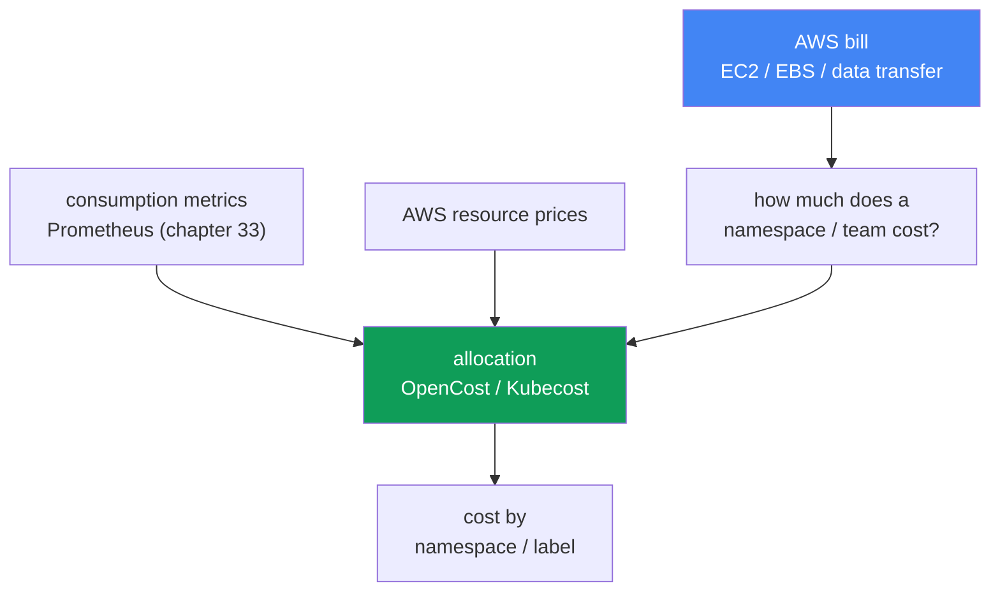
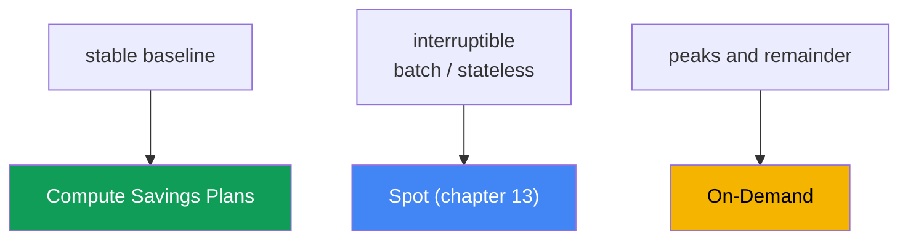

[Русская версия](ru.md) · [Versión en español](es.md) · [Version française](fr.md) · [Deutsche Version](de.md) · [ქართული ვერსია](ge.md) · [繁體中文版](tw.md) · [日本語版](jp.md)
# Chapter 43. Cost: OpenCost and Kubecost, right-sizing, Savings Plans, Spot mix, traffic

> **What is next.** Chapters 33-36 provided observability: metrics, logs, traces, so you can see what the cluster does. This chapter is about what it costs, and how to answer the business question, “how much does team X or service Y cost?” Related topics belong to other chapters: Spot and node purchasing models are in chapter 13, Pod sizing through requests/limits and VPA is in chapter 14, Karpenter consolidation and bin-packing are in chapter 12, traffic costs (NAT, cross-AZ, endpoints) are in chapter 31, logs and their costs are in chapter 34, and gp3 and EBS volumes are in chapter 23. Here we bring them together and add cost allocation to Kubernetes objects and AWS commitment models.

## 43.1. The bill is growing, but it is unclear what is causing it

Finance arrives with a simple question: the EKS bill grew by a third over the quarter, explain why and who is spending it. The on-call engineer opens Cost Explorer and sees the AWS truth: a large `Amazon Elastic Compute Cloud` line (the nodes underneath the cluster), an `EBS` line, and a `data transfer` line. That is all. There is no way to break those amounts down by namespace, team, or service because AWS billing has no such concepts.

At the same time, `kubectl top` shows the other half of the pain:

```bash
# actual Pod consumption
kubectl top pods -A --sort-by=cpu
# requested versus node capacity
kubectl describe node <node> | grep -A6 "Allocated resources"
```

The picture is typical: a Pod requested `cpu: 2` and `memory: 4Gi`, while `kubectl top` shows 200m and 600Mi. Requests are several times too high. Karpenter (chapter 12) honestly reserved capacity for those requests and launched nodes, which you pay for even though the Pods do not use them. Nodes are occupied “on paper” and almost empty in reality.

Two distinct failures in one bill:

- **No allocation.** AWS charges for resources (instances, volumes, traffic), not namespaces. Pods from many teams run on one node, and AWS billing does not distinguish them.
- **No efficiency.** Requests are inflated, bin-packing reserves emptiness, and nodes sit idle. You pay for reserved capacity, not used capacity.

This defines the chapter plan: first, why the AWS bill does not answer the allocation question and how to restore that answer (OpenCost, Kubecost); then the main savings lever, right-sizing; then compute purchasing models (On-Demand, Spot, Savings Plans, Reserved) and their mix; then traffic and storage line items; and finally FinOps practices and optimization priorities.

## 43.2. Why the AWS bill knows nothing about namespaces

AWS billing operates at the resource level: an EC2 instance ran for a number of hours of a given type, a `gp3` volume occupied a number of GiB, and a number of gigabytes went cross-AZ and through NAT. These are AWS physical and virtual entities. Kubernetes splits a node among Pods and assigns them to different Deployments in different namespaces for different teams. Between “an `m6i.2xlarge` instance ran for 720 hours” and “the `checkout` service of the `payments` team cost this much” lies a gap that AWS does not bridge.

The connection can only be restored inside Kubernetes: take actual consumption for every Pod (CPU, memory, disk, network) from metrics, take the AWS price of node resources, and distribute the node cost among Pods in proportion to their consumption or requests. Then roll Pods up into Deployments, namespaces, and teams using labels. This is called cost allocation, and it requires a dedicated tool rather than AWS billing.



## 43.3. OpenCost and Kubecost

**OpenCost** is an open, vendor-neutral Kubernetes cost-allocation standard, a CNCF project (in incubation since October 2024). Its goal is described as “Prometheus for cost monitoring”: a common model on which other solutions can build. Its mechanics are straightforward:

- it takes Pod consumption from metrics (Prometheus, chapter 33): CPU, memory, disk, and network;
- it takes AWS resource prices, and on EKS it automatically retrieves public on-demand pricing with no additional configuration required;
- it distributes node costs to Pods and aggregates them by namespace, Deployment, label, and SA.

It returns results through an API and in a dashboard-ready format. OpenCost is a minimal allocation engine.

**Kubecost** is a product based on OpenCost: the same engine plus a UI with dashboards, history, reports, optimization recommendations, and savings insights. For EKS, the **Amazon EKS optimized Kubecost bundle** is available as an EKS add-on or through Helm; support is available under active AWS Support agreements. Kubecost stores data in Prometheus-compatible storage (in recent versions, S3-compatible object storage for multi-cluster deployments).

**Accurate cost through the Cost and Usage Report.** Public on-demand pricing overstates the picture because it does not know your discounts. Both OpenCost and Kubecost can connect to the AWS Cost and Usage Report, detailed billing in S3 queried through Athena, and reconcile allocation with the actual bill. Node costs then reflect actual Savings Plans, Reserved Instances, Spot, and Enterprise-discount rates rather than catalog prices. Without this reconciliation, allocation proportions between teams are correct, but absolute amounts are overstated.

| | OpenCost | Kubecost |
|---|---|---|
| What it is | allocation engine and standard (CNCF) | product based on OpenCost |
| Interface | API, minimal UI | full UI, dashboards, reports |
| Recommendations | no | right-sizing, savings insights |
| On EKS | Helm, Prometheus metrics | EKS add-on or Helm, EKS-optimized bundle |
| When to choose it | an open standard and data are needed | UI, reports, and out-of-the-box recommendations are needed |

**Allocating shared costs.** Not everything can be assigned directly to Pods. Some costs are borne by the entire cluster: the hourly control-plane charge, system namespaces (`kube-system` and add-ons), and most importantly, **idle capacity**: the difference between what you pay for (node capacity) and what Pods actually consume. The tool either shows shared costs as a separate line or assigns them to teams by a chosen rule (equally, proportional to consumption, or weighted shares). Idle is the most important line: high idle directly indicates inflated requests and poor bin-packing, meaning right-sizing potential (section 43.4).

**Showback versus chargeback.** Allocation is needed for one of two models:

- **showback** means teams see their cost as information, with no movement of money. It is the first step: make spending visible so teams notice anomalies themselves.
- **chargeback** means cost is actually charged to the team budget and money moves inside the company. It requires mature accounting, trust in allocation figures, and agreed rules for shared costs.

Almost everyone begins with showback: it is politically cheaper and already changes behavior.

## 43.4. Right-sizing is the main lever

The greatest EKS saving is usually not commitments or Spot, but eliminating emptiness. The chain of logic is: requests are inflated → bin-packing (Karpenter, chapter 12) reserves capacity → Karpenter launches nodes for that reserved capacity → you pay for nodes the Pods do not use. An inflated `requests` value is paid-for emptiness multiplied by the number of replicas.

The diagnosis is a comparison of requested versus used:

```bash
# Pod requests
kubectl get pods -A -o custom-columns=\
NS:.metadata.namespace,POD:.metadata.name,\
CPU_REQ:.spec.containers[*].resources.requests.cpu,\
MEM_REQ:.spec.containers[*].resources.requests.memory
# actual consumption
kubectl top pods -A
```

Metrics (chapter 33) and VPA recommendations in recommendation mode (chapter 14) provide a more precise, dynamic view: VPA observes consumption and suggests appropriate `requests` values. Reducing requests toward actual consumption, with headroom for peaks, packs nodes more densely: more Pods fit on the same node, Karpenter consolidation (chapter 12) removes surplus nodes, and the bill falls.

Safety boundaries:

- **memory `limits` and OOMKill.** A memory limit that is too low gets a Pod killed by OOM. Memory is an incompressible resource, so reduce its limit carefully, leaving room for peaks and considering actual peak values in metrics.
- **CPU `limits` and throttling.** A hard CPU limit throttles a Pod during bursts. It is often better to set `requests` and omit a CPU `limit`, or make it generous. See chapter 14.
- **do not undersize the baseline.** Right-size from sustained consumption plus headroom, not from the minimum. Otherwise, an ordinary daily peak becomes an incident.

Right-sizing and bin-packing come first in the optimization order: they reduce capacity consumption itself, and discount models are applied afterward to the reduced, stable volume (section 43.6).

## 43.5. Compute purchasing models

EKS nodes are EC2, and you can pay for them in different ways. Discount models do not change how much you consume; they change the rate per unit. Therefore, apply them after right-sizing, to an already stable volume, or you will commit to emptiness.

| Model | Commitment | Interruptible | Where to use it |
|---|---|---|---|
| On-Demand | none | no | peaks, remainder, all uncovered usage |
| Spot | none | yes, with notice | fault-tolerant, batch, stateless (chapter 13) |
| Compute Savings Plans | $/hour for 1 or 3 years | no | stable compute baseline |
| Reserved Instances | a specific configuration, 1-3 years | no | long-lived, stable, specific workloads |

- **On-Demand** is the basic mode: you pay per running hour with no commitment, at the highest rate. It is the default and the “remainder” covering everything not covered by other models.
- **Spot** (chapter 13) is spare AWS capacity with a large discount, but AWS can reclaim it with short notice. It suits workloads that survive interruption: stateless services with multiple replicas, queue processing, batch, and CI. Diversifying across instance types and AZs reduces the risk of simultaneous reclamation, as covered in chapter 13.
- **Compute Savings Plans** are a commitment to spend a certain amount per hour on compute for 1 or 3 years in exchange for a discount. They are flexible: the discount applies regardless of instance family, Region, OS, and even to Fargate and Lambda. They are ideal for a predictable baseline.
- **Reserved Instances** are an older mechanism: a commitment to a particular configuration (family, Region) for 1-3 years. They are less flexible than Savings Plans. For EKS compute, Savings Plans are chosen more often, while RIs are kept for specific long-lived resources.

**Commitments and Spot compete for the same baseline.** Savings Plans do not apply to Spot usage: Spot is not covered by a commitment and receives no extra discount on top of the Spot price. This creates a common error: a commitment is purchased for current consumption, then part of the fleet is moved to Spot through Karpenter or a node group. The covered base shrinks while the commitment remains underutilized. “It will balance out later” does not work: the commitment is hourly, unused value from one hour does not carry into the next, and the shortfall expires every hour rather than being settled at the end of the term. Therefore, subtract the portion planned for Spot from the baseline and commit to the non-interruptible remainder. But “subtract Spot” does not mean “subtract the full capacity of Spot pools”: fallback to On-Demand when Spot capacity is unavailable (chapter 13) returns some consumption to the commitment. Subtract the consistently achieved Spot share, not the planned share, and review the commitment using actual results rather than the plan. Application order is: Savings Plans follow Reserved Instances, EC2 Instance Savings Plans precede Compute Savings Plans, and within them usage with the highest discount percentage is covered first. This explains why, in a mixed fleet, a commitment can go somewhere other than expected.

**Mix strategy.** A healthy node fleet usually combines all modes: Compute Savings Plans cover the stable baseline, Spot takes flexible and batch workloads, and On-Demand covers peaks and anything that cannot be interrupted or committed. Proportions depend on the share of interruptible workloads and confidence in the baseline; check specific discount percentages against current AWS pricing.

**What is EKS-specific in the bill:**

- the **control plane** is billed hourly for every cluster regardless of workload, making it a fixed line item and an argument against a scattering of small clusters (chapter 32);
- **extended support** costs more than standard support: a cluster version in extended support has a higher hourly control-plane charge (chapter 38), which is another incentive to upgrade on time;
- **Fargate** is billed differently from EC2 nodes: you pay for the vCPU and memory allocated to a Pod for its lifetime, without managed nodes (details and use cases are in chapter 15);
- **discount models do not cover everything:** Compute Savings Plans cover EC2, Fargate, Lambda, and SageMaker AI, but not the EKS hourly control-plane fee, so discount models do not reduce that fixed per-cluster line item (chapter 9).



## 43.6. Traffic and storage as bill line items

After compute, two large groups remain on an EKS bill that are easy to miss because they are spread throughout the architecture. Dedicated chapters cover them in depth; here is what each contributes:

| Line item | Where savings come from | Chapter |
|---|---|---|
| Cross-AZ traffic | topology-aware routing, Pod locality | chapter 31 |
| NAT Gateway | processing and per-GB NAT charges are expensive | chapter 31 |
| VPC endpoints / PrivateLink | route traffic to AWS services around NAT | chapter 31 |
| Logs | volume, retention, sampling, filters | chapter 34 |
| EBS volumes | gp3 instead of gp2, size, snapshots | chapter 23 |

- **Cross-AZ.** Traffic between Availability Zones is charged in both directions. A service in one AZ calling a database in another pays for every gigabyte. Allocation and network metrics help reveal it; mitigating it through topology-aware hints and locality is covered in chapter 31.
- **NAT Gateway.** It charges both per running hour and per processed gigabyte. Pods that access the internet or AWS services through NAT add to the bill, which is where VPC endpoints and PrivateLink help (chapter 31).
- **Logs.** CloudWatch Logs, OpenSearch, and log-delivery traffic are a material line item for chatty applications and long retention. Control volume, retention, and sampling as described in chapter 34.
- **Storage.** At equal capacity, `gp3` is usually more cost-effective than `gp2` and lets you set IOPS and throughput independently. Unused volumes and old snapshots are a quiet leak (chapter 23).

## 43.7. FinOps practices

Allocation and purchasing models are tools; FinOps is the process that makes them sustainable.

- **Cost allocation tags plus Kubernetes labels.** On the AWS side, mark resources with tags (`team`, `env`, `cost-center`), and activate user-defined tags in the Billing console. Without activation, they do not appear in Cost Explorer or Budgets. In the cluster, namespaces and workloads carry the same dimensions as labels, which OpenCost/Kubecost uses for segmentation. The two tag sets must align semantically so AWS and cluster views reconcile.
- **AWS Budgets and alerts.** Create budgets, both overall and by tags/services, with thresholds and notifications to catch growth as it occurs instead of at the end of the month when the bill arrives.
- **Cost Anomaly Detection.** This separate Cost Management service uses ML to build a spending baseline, detect anomalous spikes, and send alerts by email or to SNS, then through AWS Chatbot to Slack or Teams. Unlike Budgets with fixed thresholds, it detects deviation from a familiar pattern: growth that still fits a static budget but is abnormal.
- **Commitment monitoring.** Cost Explorer offers a Savings Plans utilization report (how much of a commitment is actually consumed) and a Savings Plans coverage report (what share of eligible consumption is covered). AWS Budgets also has a Savings Plans budget type for utilization and coverage, with SNS alerts. Watch utilization like overspending: a drop after moving workloads to Spot is visible immediately instead of a month later in the bill.
- **Cost Explorer grouped by tags.** Analyzing the bill by activated tags is the standard way to see trends by team, environment, and service.
- **Showback to teams.** A regular report of “how much your share cost” changes behavior more than any policy: teams notice a forgotten LoadBalancer or inflated requests themselves.

**Optimization priority** (top down, by effect-to-risk ratio):

1. **Right-size and bin-pack** to reduce consumed volume itself (section 43.4, chapter 12). This reduces the base to which everything else applies.
2. **Savings Plans for the stable baseline** to commit to an already reduced, stable volume rather than the original inflated one.
3. **Spot for flexible workloads** to move interruptible workloads to Spot (chapter 13).
4. **Traffic, logs, and storage** to clean up cross-AZ and NAT costs (chapter 31), log retention (chapter 34), and volumes and snapshots (chapter 23).

Order matters: committing in step 2 before right-sizing in step 1 means locking in payment for emptiness for one to three years.

## 43.8. How this is applied in production

- **Install allocation before money disputes.** Deploy OpenCost or Kubecost in advance so that when finance asks, namespace figures already exist instead of “we will try to calculate it.”
- **Start with showback.** Teams first see their cost, and only after accounting matures do you move to chargeback with budget movement.
- **Make right-sizing routine.** Regularly compare requests with consumption using metrics and VPA recommendations, reduce inflated values, and let consolidation pack nodes more densely.
- **Commit only to a stable baseline.** Purchase Savings Plans after right-sizing for volume that persists for months, leaving peaks and growth on On-Demand and Spot.
- **Align tags and labels.** Use one set of dimensions (`team`, `env`, `service`) in both AWS cost allocation tags and Kubernetes labels, and activate user-defined tags in Billing.
- **Create Budgets with alerts.** Budgets by team and service with thresholds catch an anomaly as it occurs rather than after the fact.

## 43.9. Mini glossary

- **cost allocation** is the distribution of AWS resource cost to Kubernetes objects (namespace, Deployment, label) by consumption or requests.
- **OpenCost** is an open, vendor-neutral cost-allocation standard and engine, a CNCF project; it takes consumption from Prometheus and AWS resource prices.
- **Kubecost** is an OpenCost-based product with a UI, reports, and recommendations; EKS has an EKS-optimized bundle as an add-on or through Helm.
- **idle capacity** is the difference between paid node capacity and actual consumption, a marker of inflated requests and poor bin-packing.
- **shared costs** are shared cluster costs (control plane, system namespaces, idle) assigned to teams by a rule or shown separately.
- **showback** means showing teams their cost without moving money.
- **chargeback** means actually charging cost to a team budget.
- **right-sizing** means aligning requests/limits with actual consumption to pack nodes more densely.
- **Compute Savings Plans** are a commitment to hourly spend for 1-3 years in exchange for a discount, flexible across instance families, Regions, and Fargate/Lambda. The commitment is hourly, does not carry between hours, and does not apply to Spot; its usage is visible in Savings Plans utilization (consumed) and coverage (covered) reports in Cost Explorer.
- **cost allocation tags** are AWS tags for breaking down the bill; user-defined tags must be activated in the Billing console.
- **Cost and Usage Report** is detailed AWS billing in S3. Querying it through Athena allows OpenCost/Kubecost to reconcile allocation with the discounted actual bill.
- **Cost Anomaly Detection** is an AWS service that uses ML to detect anomalous spending growth and alert through email or SNS (Slack/Teams through AWS Chatbot).

## 43.10. Chapter summary

- AWS bills for resources (EC2, EBS, data transfer), not namespaces. Pods from many teams run on one node, and billing does not distinguish them.
- The question “how much does team X cost?” can only be answered through allocation inside Kubernetes: metric consumption plus AWS prices distributed to objects by consumption or requests.
- OpenCost is an open allocation standard and engine (CNCF); Kubecost is its product layer with a UI, reports, and recommendations, and is available on EKS as an EKS-optimized bundle.
- Shared costs (control plane, system namespaces, idle) are assigned or shown separately. High idle is a direct signal for right-sizing.
- Showback (showing cost) is the first step; chargeback (charging a budget) is mature practice.
- Right-sizing is the main lever: inflated requests make bin-packing reserve emptiness and launch unnecessary nodes; reducing requests packs nodes more densely.
- Be careful with limits: a low memory limit leads to OOMKill, and a hard CPU limit to throttling. Right-size for sustained consumption plus headroom.
- Purchasing models are On-Demand (no commitment, expensive), Spot (cheap, interruptible), Compute Savings Plans (spend commitment, flexible), and Reserved (specific configuration).
- The mix is Savings Plans for the baseline, Spot for flexible workloads, and On-Demand for peaks. Commit only after right-sizing and only to stable volume.
- Spot and commitments compete for the same base: Savings Plans do not cover Spot, and an hourly commitment does not carry between hours, so subtract the consistently achieved Spot share from the baseline.
- EKS bill specifics are the hourly control plane per cluster, higher cost in extended support (chapter 38), and separate Fargate pricing (chapter 15); traffic and storage are covered in chapters 31, 34, and 23.
- For accurate figures, connect allocation to the Cost and Usage Report through Athena so Savings Plans/RI/Spot discounts are included rather than public pricing. Cost Anomaly Detection catches anomalous spending growth through alerts, complementing threshold-based Budgets with deviation from the familiar pattern.

## 43.11. How this helps in real work

For on-call work and planning, this chapter turns the bill from a black box into a controllable quantity. When finance asks why the bill grew, you do not guess from the `Amazon EC2` line: you open allocation by namespace and show who drove the increase, separating idle from actual consumption. This shifts the conversation from “it is expensive” to “here is a specific Deployment with inflated requests,” followed by an action.

When planning a cluster, cost becomes a required dimension alongside reliability: deployed allocation (OpenCost or Kubecost), aligned cost allocation tags and labels, budgets with alerts, an established right-sizing cycle, and a deliberate purchasing mix (Savings Plans for the baseline, Spot for flexible workloads, On-Demand for the remainder). The optimization order is fixed: first reduce volume, then commit to what has stabilized, then use Spot, then traffic and storage. Savings are then sustainable rather than a one-time effort before quarter close.

## 43.12. Self-check questions

1. Why does the AWS bill not answer “how much does a namespace cost,” and what is needed to answer it?
2. How does allocation restore the connection between AWS resources and Kubernetes objects?
3. What is OpenCost, where does it obtain consumption and prices, and why is it a CNCF project?
4. How does Kubecost differ from OpenCost, and what does the EKS-optimized Kubecost bundle provide?
5. What belongs to shared costs, and why is high idle a signal for right-sizing?
6. What is the difference between showback and chargeback, and which one do organizations usually start with?
7. Why do inflated requests lead to paying for empty nodes, and what are the roles of bin-packing and Karpenter?
8. What are the risks of aggressively reducing limits, and how are they avoided?
9. How do On-Demand, Spot, Savings Plans, and Reserved differ in commitment and flexibility?
10. How is a purchasing-model mix built, and why are Savings Plans purchased only for the baseline?
11. Why do purchasing Savings Plans and moving a fleet to Spot conflict, and what is subtracted from the baseline before committing?
12. What is specific to the EKS bill: the control plane, extended support, and Fargate?
13. Which traffic and storage line items are optimized, and which chapters cover them?
14. What is the optimization priority, and why must Savings Plans not be committed before right-sizing?
15. Why connect OpenCost/Kubecost to the Cost and Usage Report, and how does Cost Anomaly Detection complement AWS Budgets?

## Practice

Traffic costs are also covered in [lab 117: Traffic and cost: NAT per AZ versus one NAT, VPC endpoints, cross-AZ](../../labs/117/README.MD). This chapter has no separate lab, but the whole picture is visible in a live cluster and the AWS console. Start with the gap between requested and used, which is the main source of savings:

```bash
# actual consumption versus requests
kubectl top pods -A --sort-by=cpu
kubectl top nodes
# how many node resources are already reserved by requests
kubectl describe node <node> | grep -A6 "Allocated resources"
```

Deploy allocation, either OpenCost or the EKS-optimized Kubecost bundle, and examine cost by namespace and label. Pay attention to the idle line, which represents inflated requests:

```bash
# Kubecost UI through port-forward (kubecost namespace)
kubectl -n kubecost port-forward deploy/kubecost-cost-analyzer 9090
# allocation query through the OpenCost/Kubecost API
curl "http://localhost:9090/model/allocation?window=7d&aggregate=namespace"
```

On the AWS side, reconcile the picture in billing: activate user-defined cost allocation tags in the Billing console, group the bill by tags in Cost Explorer, and create a budget with an alert. For accurate numbers, connect allocation to the Cost and Usage Report, and attach Cost Anomaly Detection with SNS notification to anomalous growth.

```bash
# amounts by service for a period (Cost Explorer API)
aws ce get-cost-and-usage \
  --time-period Start=2024-01-01,End=2024-02-01 \
  --granularity MONTHLY --metrics "UnblendedCost" \
  --group-by Type=DIMENSION,Key=SERVICE
# breakdown by team tag
aws ce get-cost-and-usage \
  --time-period Start=2024-01-01,End=2024-02-01 \
  --granularity MONTHLY --metrics "UnblendedCost" \
  --group-by Type=TAG,Key=team
```

Then follow the priority: right-size and bin-pack (section 43.4, chapter 12), Savings Plans for the baseline, Spot for flexible workloads (chapter 13), then traffic and storage (chapters 31, 34, and 23). Always check specific prices and discount percentages against current AWS pricing rather than numbers in articles.

---
[Contents](../README.md) · [Chapter 42](../42/en.md) · [Chapter 44](../44/en.md)
