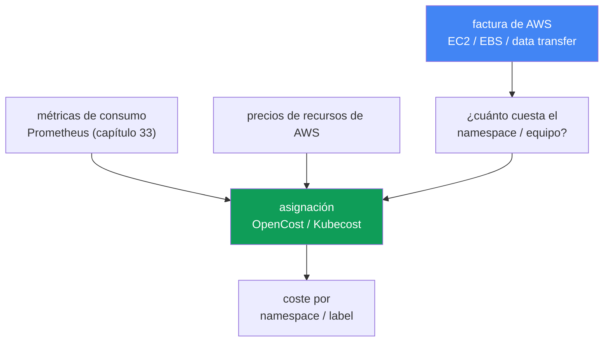
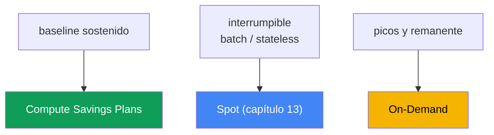

[Русская версия](ru.md) · [Eng version](en.md) · [Version française](fr.md) · [Deutsche Version](de.md) · [ქართული ვერსია](ge.md) · [繁體中文版](tw.md) · [日本語版](jp.md)
# Capítulo 43. Coste: OpenCost y Kubecost, right-sizing, Savings Plans, mezcla de Spot, tráfico

> **Qué sigue.** Los capítulos 33-36 aportaron observabilidad: métricas, logs y trazas, así que puede ver qué hace el clúster. Este capítulo trata de cuánto cuesta y de cómo responder a la pregunta de negocio «¿cuánto cuesta el equipo X o el servicio Y?». Los temas relacionados se tratan en otros capítulos: Spot y los modelos de compra de nodos, capítulo 13; dimensionamiento de Pods mediante requests/limits y VPA, capítulo 14; consolidation y bin-packing de Karpenter, capítulo 12; coste del tráfico (NAT, cross-AZ, endpoints), capítulo 31; logs y sus costes, capítulo 34; y gp3 y los volúmenes EBS, capítulo 23. Aquí reunimos todo en una sola imagen y añadimos la asignación de costes a objetos de Kubernetes y los modelos de compromiso de AWS.

## 43.1. La factura crece, pero no está claro en qué

Finanzas llega con una pregunta simple: la factura de EKS creció un tercio en el trimestre, expliquen por qué y quién está gastando. La persona de guardia abre Cost Explorer y ve la verdad de AWS: una línea grande `Amazon Elastic Compute Cloud` (las nodos bajo el clúster), una línea `EBS` y una línea `data transfer`. Eso es todo. No hay forma de dividir esos importes por namespace, equipo o servicio, porque la facturación de AWS no tiene esos conceptos.

Al mismo tiempo, `kubectl top` muestra la otra mitad del problema:

```bash
# consumo real de los Pods
kubectl top pods -A --sort-by=cpu
# solicitado frente a la capacidad de la nodo
kubectl describe node <node> | grep -A6 "Allocated resources"
```

El patrón es típico: un Pod solicitó `cpu: 2` y `memory: 4Gi`, mientras que `kubectl top` muestra 200m y 600Mi. Los requests están inflados varias veces. Karpenter (capítulo 12) reservó honestamente capacidad para esos requests y levantó nodos, por los que paga aunque los Pods no los usen. Los nodos están ocupados «en el papel» y casi vacíos en realidad.

Dos fallos distintos en una sola factura:

- **No hay asignación.** AWS cobra por recursos (instancias, volúmenes, tráfico), no por namespaces. En una nodo viven Pods de muchos equipos y la facturación de AWS no los diferencia.
- **No hay eficiencia.** Los requests están inflados, el bin-packing reserva vacío y los nodos quedan ociosos. Se paga por lo reservado, no por lo utilizado.

De ahí el plan del capítulo: primero, por qué la factura de AWS no responde a la pregunta de asignación y cómo recuperarla (OpenCost, Kubecost); después, la principal palanca de ahorro, el right-sizing; luego, los modelos de compra de cómputo (On-Demand, Spot, Savings Plans, Reserved) y su mezcla; después, las partidas de tráfico y almacenamiento; y al final, prácticas de FinOps y prioridades de optimización.

## 43.2. Por qué la factura de AWS no sabe nada de los namespaces

La facturación de AWS funciona a nivel de recursos: una instancia EC2 trabajó cierto número de horas de un tipo determinado, un volumen `gp3` ocupó cierto número de GiB y cierto número de gigabytes cruzó AZ o NAT. Son entidades físicas y virtuales de AWS. Kubernetes divide una nodo en Pods y los entrega a distintos Deployments en diferentes namespaces de diferentes equipos. Entre «la instancia `m6i.2xlarge` funcionó 720 horas» y «el servicio `checkout` del equipo `payments` costó tanto» hay un abismo que AWS no cruza.

Solo se puede restaurar la relación dentro de Kubernetes: tomar de las métricas el consumo real de cada Pod (CPU, memoria, disco, red), tomar de AWS el precio de los recursos de nodo y distribuir el coste de la nodo entre los Pods proporcionalmente a su consumo o sus requests. Después, agrupar los Pods en Deployment, namespace y equipo según labels. Esto se llama asignación de costes (cost allocation), y lo realiza una herramienta independiente, no la facturación de AWS.



## 43.3. OpenCost y Kubecost

**OpenCost** es un estándar abierto y agnóstico del proveedor para la asignación de costes de Kubernetes, un proyecto CNCF (en incubación desde octubre de 2024). Su objetivo se formula como «Prometheus para la monitorización de costes»: un modelo único sobre el que se construyen otras soluciones. El funcionamiento es directo:

- toma el consumo de Pods de las métricas (Prometheus, capítulo 33): CPU, memoria, disco y red;
- toma los precios de recursos de AWS: en EKS recupera por sí mismo el precio público on-demand, sin configuración adicional;
- distribuye el coste de los nodos entre los Pods y agrega por namespace, Deployment, label y SA.

El resultado se entrega mediante API y en un formato apto para dashboards. OpenCost es el motor de asignación con una composición mínima.

**Kubecost** es un producto basado en OpenCost: el mismo motor más una UI con dashboards, historial, informes, recomendaciones de optimización y savings insights. Para EKS existe el **Amazon EKS optimized Kubecost bundle**, que se instala como EKS add-on o mediante Helm; puede obtener soporte según sus acuerdos vigentes de AWS Support. Kubecost guarda datos en un almacenamiento compatible con Prometheus (en las versiones recientes, para multiclúster, en almacenamiento de objetos compatible con S3).

**Coste preciso mediante Cost and Usage Report.** El precio público on-demand sobreestima la situación: no conoce sus descuentos. Tanto OpenCost como Kubecost pueden conectarse a AWS Cost and Usage Report, la facturación detallada en S3 que se consulta mediante Athena, y reconciliar (reconcile) la asignación con la factura realmente emitida. Así, el coste de los nodos incorpora las tarifas reales con descuentos de Savings Plans, Reserved Instances, Spot y descuentos Enterprise, en vez del precio de catálogo. Sin esta reconciliación, la asignación es correcta en las proporciones entre equipos, pero está sobreestimada en términos absolutos.

| | OpenCost | Kubecost |
|---|---|---|
| Qué es | motor y estándar de asignación (CNCF) | producto basado en OpenCost |
| Interfaz | API, UI mínima | UI completa, dashboards, informes |
| Recomendaciones | no | right-sizing, savings insights |
| En EKS | Helm, métricas de Prometheus | EKS add-on o Helm, EKS-optimized bundle |
| Cuándo usarlo | se necesita un estándar abierto y datos | se necesita UI, informes y recomendaciones listos para usar |

**Distribución de costes compartidos (shared).** No todo se divide directamente entre Pods. Hay costes que asume el clúster completo: la tarifa horaria por el control plane, los namespaces del sistema (`kube-system` y add-ons) y, sobre todo, la **capacidad idle**: la diferencia entre aquello por lo que se paga (capacidad de los nodos) y lo que realmente consumieron los Pods. La herramienta muestra estos costes shared como una línea separada o los distribuye entre los equipos mediante la regla elegida (por igual, proporcionalmente al consumo o por participaciones weighted). Idle es la línea más importante: un idle alto señala directamente requests inflados y bin-packing deficiente, es decir, potencial para right-sizing (sección 43.4).

**Showback frente a chargeback.** La asignación se necesita para uno de dos modelos:

- **showback**: se muestra a los equipos su coste como información, sin movimiento de dinero. Es el primer paso: hacer visibles los gastos para que los equipos detecten las anomalías por sí mismos.
- **chargeback**: el coste se imputa realmente al presupuesto del equipo, moviendo dinero dentro de la empresa. Requiere contabilidad madura, confianza en las cifras de asignación y reglas acordadas para los costes shared.

Casi siempre se empieza por showback: es políticamente más barato y ya cambia el comportamiento.

## 43.4. Right-sizing, la palanca principal

El mayor ahorro en EKS normalmente no son los compromisos ni Spot, sino eliminar el vacío. La lógica de la cadena es: los requests están inflados → bin-packing (Karpenter, capítulo 12) reserva capacidad → Karpenter levanta nodos para esa capacidad reservada → usted paga por nodos que los Pods no usan. Un `requests` inflado es vacío pagado, multiplicado por el número de réplicas.

El diagnóstico es comparar requested frente a used:

```bash
# requests de los Pods
kubectl get pods -A -o custom-columns=\
NS:.metadata.namespace,POD:.metadata.name,\
CPU_REQ:.spec.containers[*].resources.requests.cpu,\
MEM_REQ:.spec.containers[*].resources.requests.memory
# consumo real
kubectl top pods -A
```

Las métricas (capítulo 33) y las recomendaciones de VPA en modo de recomendación (capítulo 14) lo dan con más precisión y en dinámica: VPA observa el consumo y propone valores adecuados de `requests`. Reducir los requests al consumo real, con margen para picos, densifica los nodos: en la misma nodo caben más Pods, la consolidation de Karpenter (capítulo 12) elimina los nodos sobrantes y la factura baja.

Límites de precaución:

- **`limits` de memoria y OOMKill.** Un límite de memoria demasiado bajo hace que el Pod sea eliminado por OOM. La memoria es un recurso no compresible: reduzca el límite con cuidado, dejando margen para picos y atendiendo a los valores pico reales de las métricas.
- **`limits` de CPU y throttling.** Un límite rígido de CPU estrangula el Pod con throttling durante picos. A menudo es más correcto definir `requests` y no fijar un `limit` de CPU, o darle uno generoso; consulte el capítulo 14.
- **no reducir el baseline en exceso.** El right-sizing se basa en consumo sostenido más headroom, no en el mínimo; de lo contrario, el pico diario normal se convertirá en un incidente.

Right-sizing y bin-packing van primero en el orden de optimización: reducen la capacidad realmente consumida, y los modelos de descuento se aplican después al volumen ya reducido y estabilizado (sección 43.6).

## 43.5. Modelos de compra de cómputo

Los nodos EKS son EC2 y se pueden pagar de varias formas. Los modelos de descuento no cambian cuánto consume; cambian la tarifa por unidad. Por ello se aplican tras el right-sizing, al volumen ya estabilizado, pues de lo contrario comprometerá vacío.

| Modelo | Compromiso | Interrumpible | Para qué |
|---|---|---|---|
| On-Demand | ninguno | no | picos, remanente, todo lo no cubierto |
| Spot | ninguno | sí, con aviso | fault-tolerant, batch, stateless (capítulo 13) |
| Compute Savings Plans | $/hora durante 1 o 3 años | no | baseline estable de cómputo |
| Reserved Instances | configuración concreta, 1-3 años | no | cargas específicas estables y de larga duración |

- **On-Demand** es el modo básico: paga por hora de funcionamiento sin compromisos, con la tarifa más alta. Es el valor predeterminado y el «remanente» que cubre todo lo que no entra en otros modelos.
- **Spot** (capítulo 13) es capacidad libre de AWS con gran descuento, pero puede retirarse con poco aviso. Es adecuado para cargas que toleran la interrupción: servicios stateless con varias réplicas, procesamiento de colas, batch y CI. La diversificación por tipos de instancia y AZ reduce el riesgo de retirada simultánea; se explica en detalle en el capítulo 13.
- **Compute Savings Plans** es el compromiso de gastar una cantidad determinada por hora en cómputo durante 1 o 3 años a cambio de un descuento. Son flexibles: el descuento se aplica independientemente de la familia de instancia, Region, SO e incluso a Fargate y Lambda. Son ideales para un baseline predecible.
- **Reserved Instances** es un mecanismo más antiguo: compromiso para una configuración concreta (familia, Region) durante 1-3 años. Es menos flexible que Savings Plans; para cómputo EKS se suele elegir Savings Plans y se mantienen RI para recursos específicos y longevos.

**El compromiso y Spot compiten por la misma base.** Savings Plans no se aplican al consumo Spot: Spot no queda cubierto por el compromiso ni recibe un descuento adicional sobre el precio Spot. De ahí un error típico: se compra un compromiso según el consumo actual y luego se pasa parte del parque a Spot (Karpenter o node group). La base que se puede cubrir disminuye y el compromiso queda infrautilizado. «Luego se equilibrará» no funciona: el compromiso es horario, el remanente no utilizado de una hora no pasa a la siguiente, la carencia se pierde cada hora y no se ajusta al final del plazo. Por ello, del baseline se resta la parte que se planea mantener en Spot y se compromete el remanente no interrumpible. Pero «restar Spot» no significa «restar toda la potencia de los pools Spot»: el fallback a On-Demand cuando falta capacidad Spot (capítulo 13) devuelve parte del consumo al compromiso. Por eso se resta la proporción Spot que se logra de forma sostenida, no la proyectada, y se revisa el compromiso según los hechos, no según el plan. Orden de aplicación: Savings Plans van después de Reserved Instances, EC2 Instance Savings Plans antes de Compute Savings Plans y, dentro de estos, se empieza por el consumo con mayor porcentaje de descuento; esto explica por qué en un parque mixto el compromiso se destina a un lugar distinto del esperado.

**Estrategia de mezcla.** Un parque sano de nodos suele combinar todos los modos: Compute Savings Plans cubren el baseline sostenido, Spot asume las cargas flexibles y por lotes, y On-Demand cubre los picos y todo lo que no se puede interrumpir o comprometer. Las proporciones dependen de la fracción de cargas interrumpibles y de la confianza en el baseline; los porcentajes concretos de descuento deben comprobarse con los precios actuales de AWS.

**Lo específico de EKS en la factura:**

- el **control plane** se cobra por hora por cada clúster, independientemente de la carga: es una línea constante y un argumento contra dispersar muchos clústeres pequeños (capítulo 32);
- **extended support** es más caro que el soporte estándar: se cobra una tarifa horaria mayor por el control plane de un clúster en una versión con extended support (capítulo 38), otro incentivo para actualizar a tiempo;
- **Fargate** se factura de modo distinto a los nodos EC2: paga por la vCPU y memoria asignadas al Pod durante su vida, sin nodos que gestionar (detalles y escenarios en el capítulo 15);
- los **modelos de descuento no cubren todo**: Compute Savings Plans incluye EC2, Fargate, Lambda y SageMaker AI, pero la tarifa horaria del control plane de EKS no está en esa lista, así que los modelos de descuento no reducen la línea constante por clúster (capítulo 9).



## 43.6. Tráfico y almacenamiento como partidas de la factura

Después del cómputo, quedan dos grupos grandes en la factura EKS que es fácil pasar por alto: están «dispersos» por la arquitectura. Los capítulos especializados los examinan; aquí se indica qué aporta cada uno:

| Partida | Dónde ahorrar | Capítulo |
|---|---|---|
| Tráfico cross-AZ | topology-aware routing, localidad de los Pods | capítulo 31 |
| NAT Gateway | el procesamiento y cada GB por NAT son caros | capítulo 31 |
| VPC endpoints / PrivateLink | llevar el tráfico a servicios AWS sin pasar por NAT | capítulo 31 |
| Logs | volumen, retention, sampling, filtros | capítulo 34 |
| Volúmenes EBS | gp3 en lugar de gp2, tamaño, snapshots | capítulo 23 |

- **Cross-AZ.** El tráfico entre zonas se cobra en ambos sentidos. Un servicio de una AZ que llama a una base de datos en otra paga por cada gigabyte. La asignación y las métricas de red ayudan a verlo; combatirlo con topology aware hints y localidad se trata en el capítulo 31.
- **NAT Gateway.** Cobra tanto por hora de funcionamiento como por cada gigabyte procesado. Los Pods que salen a Internet o a servicios de AWS a través de NAT inflan la factura; aquí ayudan VPC endpoints y PrivateLink (capítulo 31).
- **Logs.** CloudWatch Logs, OpenSearch y el tráfico de entrega de logs son una partida notable con aplicaciones verbosas y retention prolongado. El control del volumen, retention y sampling se trata en el capítulo 34.
- **Almacenamiento.** `gp3`, con el mismo volumen, suele ser más económico que `gp2` y permite definir IOPS y throughput por separado; los volúmenes sin usar y snapshots antiguos son una fuga silenciosa (capítulo 23).

## 43.7. Prácticas de FinOps

La asignación y los modelos de compra son herramientas; FinOps es el proceso que los hace sostenibles.

- **Cost allocation tags más Kubernetes labels.** En AWS se etiquetan los recursos con tags (`team`, `env`, `cost-center`) y se activan los tags definidos por el usuario en la consola Billing. Sin activarlos, no aparecen en Cost Explorer ni Budgets. En el clúster, las mismas dimensiones se llevan como labels en namespace y workload, que OpenCost/Kubecost utiliza para segmentar. Las dos clasificaciones deben coincidir en significado para que las vistas de AWS y del clúster concuerden.
- **AWS Budgets y alertas.** Se crean presupuestos, globales y por tags/servicios, con umbrales y notificaciones para detectar el crecimiento cuando ocurre, no al final del mes al recibir la factura.
- **Cost Anomaly Detection.** Servicio independiente de Cost Management: ML construye una línea base de gasto y detecta picos anómalos, enviando alertas por email o SNS, y desde allí mediante AWS Chatbot a Slack o Teams. A diferencia de Budgets con un umbral fijo, detecta la desviación respecto al patrón habitual, un crecimiento que aún cabe en un presupuesto estático pero se sale de la norma.
- **Monitorización del compromiso.** Cost Explorer incluye el informe Savings Plans utilization, que indica cuánto compromiso se consumió realmente, y Savings Plans coverage, que muestra qué parte del consumo elegible cubre el compromiso. AWS Budgets incluye un tipo de presupuesto independiente para Savings Plans, por utilization y coverage, con alertas mediante SNS. Utilization se vigila igual que el sobrecoste: la caída tras mover cargas a Spot se ve de inmediato, no un mes después en la factura.
- **Cost Explorer agrupado por tags.** Analizar la factura según los tags activados es el método normal para ver la evolución por equipo, entorno y servicio.
- **Showback a los equipos.** Un informe regular de «cuánto costó su parte» cambia el comportamiento más que cualquier reglamento: el propio equipo detecta un LoadBalancer olvidado o requests inflados.

**Prioridad de optimización** (de arriba abajo, según relación efecto/riesgo):

1. **Right-size y bin-pack**: reducir el volumen realmente consumido (sección 43.4, capítulo 12). Esto disminuye la base a la que se aplica todo lo demás.
2. **Savings Plans para el baseline estabilizado**: comprometer el volumen estable ya reducido, no el original inflado.
3. **Spot para cargas flexibles**: trasladar a Spot lo interrumpible (capítulo 13).
4. **Tráfico, logs y almacenamiento**: depurar cross-AZ y NAT (capítulo 31), retention de logs (cap. 34), volúmenes y snapshots (capítulo 23).

El orden es importante: comprometer (paso 2) antes del right-sizing (paso 1) significa fijar el pago por vacío durante uno a tres años.

## 43.8. Cómo se aplica en producción

- **Instalan la asignación antes de discutir sobre dinero.** Despliegan OpenCost o Kubecost de antemano, para que al hablar con Finanzas ya tengan cifras por namespace y no «intentemos calcularlo».
- **Empiezan por showback.** Los equipos ven primero su coste, y solo con una contabilidad madura pasan a chargeback con movimiento de presupuesto.
- **Convierten el right-sizing en rutina.** Comparan regularmente los requests con el consumo mediante métricas y recomendaciones de VPA, reducen lo inflado y permiten que consolidation densifique los nodos.
- **Comprometen solo el baseline estabilizado.** Adquieren Savings Plans después del right-sizing, para un volumen que se mantiene durante meses, dejando picos y crecimiento en On-Demand y Spot.
- **Etiquetan de forma coherente con tags y labels.** Un conjunto de dimensiones, `team`, `env`, `service`, tanto en los cost allocation tags de AWS como en los labels de Kubernetes; activan los tags definidos por el usuario en Billing.
- **Configuran Budgets con alertas.** Los presupuestos por equipos y servicios con umbrales detectan una anomalía cuando surge, no a posteriori.

## 43.9. Mini glosario

- **cost allocation (asignación)**: distribución del coste de recursos AWS entre objetos Kubernetes (namespace, Deployment, label) según consumo o requests.
- **OpenCost**: estándar abierto y agnóstico del proveedor, y motor de asignación de costes, proyecto CNCF; toma el consumo de Prometheus y los precios de recursos AWS.
- **Kubecost**: producto basado en OpenCost con UI, informes y recomendaciones; en EKS existe EKS-optimized bundle como add-on o Helm.
- **capacidad idle**: diferencia entre la capacidad pagada de los nodos y la realmente consumida; indicador de requests inflados y bin-packing deficiente.
- **shared costs**: costes compartidos del clúster (control plane, namespaces de sistema, idle), distribuidos entre equipos según una regla o mostrados por separado.
- **showback**: se muestra a los equipos su coste sin movimiento de dinero.
- **chargeback**: el coste se imputa realmente al presupuesto del equipo.
- **right-sizing**: adecuar requests/limits al consumo real para densificar los nodos.
- **Compute Savings Plans**: compromiso de gasto por hora durante 1-3 años a cambio de descuento, flexible entre familias de instancia, Region y Fargate/Lambda; el compromiso es horario, no se transfiere entre horas ni se aplica a Spot, y su consumo se ve en los informes Savings Plans utilization (consumido) y coverage (cubierto) de Cost Explorer.
- **cost allocation tags**: tags de AWS para segmentar la factura; los tags definidos por el usuario deben activarse en la consola Billing.
- **Cost and Usage Report**: facturación detallada de AWS en S3; la lectura mediante Athena permite a OpenCost/Kubecost reconciliar la asignación con la factura real y sus descuentos.
- **Cost Anomaly Detection**: servicio de AWS que detecta mediante ML el crecimiento anómalo del gasto y alerta por email o SNS, con Slack/Teams mediante AWS Chatbot.

## 43.10. Resumen del capítulo

- La factura de AWS se emite por recursos (EC2, EBS, data transfer), no por namespace; en una nodo viven Pods de muchos equipos y la facturación no los distingue.
- Solo se puede responder «¿cuánto cuesta el equipo X?» con asignación dentro de Kubernetes: consumo de métricas más precios de AWS, distribuidos entre objetos según consumo o requests.
- OpenCost es el estándar abierto y motor de asignación (CNCF); Kubecost es un producto basado en él con UI, informes y recomendaciones, disponible en EKS como EKS-optimized bundle.
- Los costes shared (control plane, namespaces de sistema, idle) se distribuyen o se muestran por separado; un idle alto es una señal directa para right-sizing.
- Showback, mostrar el coste, es el primer paso; chargeback, imputarlo al presupuesto, es el modelo maduro.
- Right-sizing es la palanca principal: los requests inflados obligan a bin-packing a reservar vacío y levantar nodos adicionales; reducir requests densifica los nodos.
- Precaución con limits: un límite bajo de memoria lleva a OOMKill y uno rígido de CPU a throttling; haga right-size según el consumo sostenido más headroom.
- Modelos de compra: On-Demand (sin compromiso, caro), Spot (barato, interrumpible), Compute Savings Plans (compromiso de gasto, flexible) y Reserved (configuración concreta).
- Mezcla: Savings Plans para el baseline, Spot para lo flexible y On-Demand para picos; comprometa solo tras right-sizing y solo el volumen estabilizado.
- Spot y el compromiso compiten por la misma base: Savings Plans no cubre Spot y el compromiso horario no se transfiere entre horas, así que del baseline se resta la parte Spot alcanzada de forma sostenida.
- Particularidades de la factura EKS: control plane horario por clúster, más caro en extended support (cap. 38), precio distinto de Fargate (capítulo 15); tráfico y almacenamiento, capítulos 31, 34 y 23.
- Para cifras exactas, conecte la asignación a Cost and Usage Report mediante Athena: así se tienen en cuenta descuentos Savings Plans/RI/Spot, no el precio público; Cost Anomaly Detection captura el crecimiento anómalo con alertas y complementa los Budgets basados en umbral con la desviación respecto al patrón habitual.

## 43.11. Cómo ayudará en el trabajo real

Durante la guardia y en la planificación, este capítulo transforma la factura de una caja negra en una variable gestionable. Cuando Finanzas pregunta por qué creció la factura, no adivina a partir de la línea `Amazon EC2`: abre la asignación por namespace y muestra quién causó el aumento, separando idle del consumo real. La conversación pasa de «es caro» a «este Deployment concreto tiene requests inflados» y, a continuación, a una acción.

Al planificar el clúster, el coste se vuelve una dimensión obligatoria junto con la fiabilidad: asignación desplegada (OpenCost o Kubecost), cost allocation tags y labels coherentes, presupuestos con alertas, un ciclo probado de right-sizing y una mezcla consciente de compra, Savings Plans para baseline, Spot para lo flexible y On-Demand para el remanente. El orden de optimización está fijado: primero reducir el volumen, luego comprometer lo estabilizado, después Spot, y por último tráfico y almacenamiento. Así, el ahorro es sostenible y no una acción única antes del cierre del trimestre.

## 43.12. Preguntas de autoevaluación

1. ¿Por qué la factura de AWS no responde a «cuánto cuesta un namespace» y qué hace falta para responderlo?
2. ¿Cómo restaura la asignación la relación entre recursos AWS y objetos Kubernetes?
3. ¿Qué es OpenCost, de dónde toma consumo y precios, y por qué es un proyecto CNCF?
4. ¿En qué se diferencia Kubecost de OpenCost y qué aporta EKS-optimized Kubecost bundle?
5. ¿Qué se considera costes shared y por qué un idle alto es señal para right-sizing?
6. ¿Cuál es la diferencia entre showback y chargeback, y por cuál se empieza normalmente?
7. ¿Por qué los requests inflados llevan a pagar nodos vacíos, y qué papel tienen bin-packing y Karpenter?
8. ¿Qué riesgos tiene reducir limits de forma agresiva y cómo se evitan?
9. ¿En qué se diferencian On-Demand, Spot, Savings Plans y Reserved por compromiso y flexibilidad?
10. ¿Cómo se construye una mezcla de modelos de compra y por qué Savings Plans se adquiere solo para el baseline?
11. ¿Por qué comprar Savings Plans y mover el parque a Spot entra en conflicto, y qué se resta del baseline antes de comprometer?
12. ¿Qué es específico de la factura EKS: control plane, extended support y Fargate?
13. ¿Qué partidas de tráfico y almacenamiento se optimizan, y qué capítulos las tratan?
14. ¿Cuál es la prioridad de optimización y por qué no se puede comprometer Savings Plans antes del right-sizing?
15. ¿Para qué conectar OpenCost/Kubecost a Cost and Usage Report y cómo complementa Cost Anomaly Detection a AWS Budgets?

## Práctica

El coste del tráfico también se analiza en el [lab 117: Tráfico y coste: NAT por zona frente a un NAT único, VPC endpoints, cross-AZ](../../labs/117/README_ES.MD). Este capítulo no tiene un lab separado, pero se puede ver todo el panorama en un clúster activo y en la consola de AWS. Empiece por la diferencia entre requested y used: es la principal fuente de ahorro.

```bash
# consumo real frente a requests
kubectl top pods -A --sort-by=cpu
kubectl top nodes
# cuántos recursos de nodo ya reservan los requests
kubectl describe node <node> | grep -A6 "Allocated resources"
```

Despliegue la asignación, OpenCost o EKS-optimized Kubecost bundle, y examine el coste por namespace y label, atendiendo a la línea idle: eso son los requests inflados.

```bash
# UI de Kubecost mediante port-forward (namespace kubecost)
kubectl -n kubecost port-forward deploy/kubecost-cost-analyzer 9090
# consulta de asignación mediante la API de OpenCost/Kubecost
curl "http://localhost:9090/model/allocation?window=7d&aggregate=namespace"
```

En AWS, contraste la situación en la facturación: active los user-defined cost allocation tags en la consola Billing, agrupe la factura por tags en Cost Explorer y cree un presupuesto con alerta. Para cifras exactas, conecte la asignación a Cost and Usage Report y configure Cost Anomaly Detection con una notificación en SNS para el crecimiento anómalo.

```bash
# importes por servicios durante un periodo (API de Cost Explorer)
aws ce get-cost-and-usage \
  --time-period Start=2024-01-01,End=2024-02-01 \
  --granularity MONTHLY --metrics "UnblendedCost" \
  --group-by Type=DIMENSION,Key=SERVICE
# desglose por tag de equipo
aws ce get-cost-and-usage \
  --time-period Start=2024-01-01,End=2024-02-01 \
  --granularity MONTHLY --metrics "UnblendedCost" \
  --group-by Type=TAG,Key=team
```

Después, siga la prioridad: right-size y bin-pack (sección 43.4, capítulo 12), Savings Plans para el baseline, Spot para lo flexible (capítulo 13), y luego tráfico y almacenamiento (capítulos 31, 34 y 23). Compruebe siempre los precios concretos y los porcentajes de descuento con los precios actuales de AWS, no con números de artículos.

---
[Índice](../README_ES.md) · [Capítulo 42](../42/es.md) · [Capítulo 44](../44/es.md)
