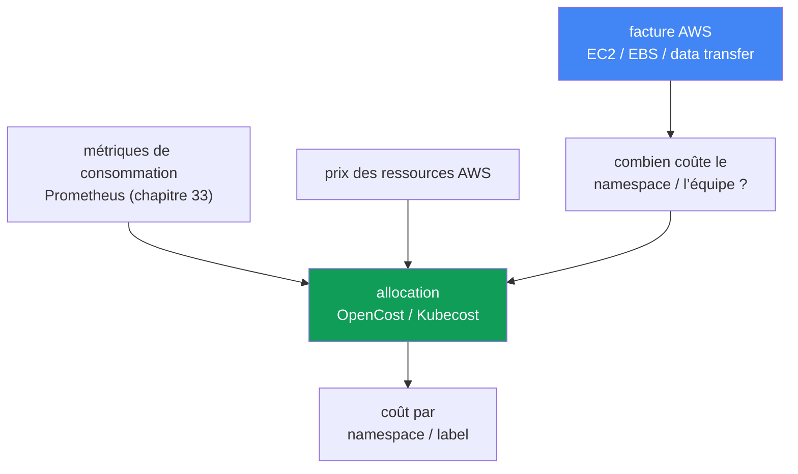
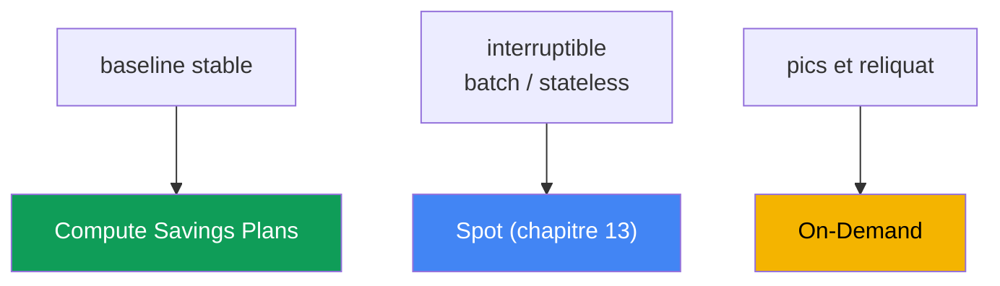

[Русская версия](ru.md) · [Eng version](en.md) · [Versión en español](es.md) · [Deutsche Version](de.md) · [ქართული ვერსია](ge.md) · [繁體中文版](tw.md) · [日本語版](jp.md)
# Chapitre 43. Coûts : OpenCost et Kubecost, right-sizing, Savings Plans, mix spot, trafic

> **La suite.** Les chapitres 33 à 36 ont apporté l’observabilité : métriques, logs, traces, vous voyez ce que fait le cluster. Ce chapitre traite de ce qu’il coûte et de la réponse à la question métier « combien coûte l’équipe X ou le service Y ». Les thèmes connexes sont confiés à d’autres chapitres : spot et modèles d’achat des nœuds au chapitre 13, dimensionnement des pods via requests/limits et VPA au chapitre 14, consolidation et bin-packing de Karpenter au chapitre 12, coût du trafic (NAT, cross-AZ, endpoints) au chapitre 31, logs et leurs dépenses au chapitre 34, gp3 et volumes EBS au chapitre 23. Ici, nous réunissons ces éléments dans une même vue et ajoutons l’allocation des coûts aux objets Kubernetes et les modèles d’engagement AWS.

## 43.1. La facture augmente, mais on ignore pourquoi

La finance arrive avec une question simple : la facture EKS a augmenté d’un tiers sur le trimestre, expliquez pourquoi et qui dépense cela. L’astreinte ouvre Cost Explorer et voit la réalité AWS : une grosse ligne `Amazon Elastic Compute Cloud` (les nœuds sous le cluster), une ligne `EBS`, une ligne `data transfer`. C’est tout. Impossible de répartir ces montants par namespace, équipe ou service : ces notions n’existent pas dans la facturation AWS.

En parallèle, `kubectl top` montre l’autre moitié du problème :

```bash
# consommation réelle des pods
kubectl top pods -A --sort-by=cpu
# ressources demandées par rapport à la capacité du nœud
kubectl describe node <node> | grep -A6 "Allocated resources"
```

Le tableau est classique : un pod demande `cpu: 2` et `memory: 4Gi`, mais `kubectl top` affiche 200m et 600Mi. Les requests sont surévaluées plusieurs fois. Karpenter (chapitre 12) a honnêtement réservé la capacité correspondant à ces requests et créé des nœuds, que vous payez alors que les pods ne les utilisent pas. Les nœuds sont occupés « sur le papier » et presque vides dans les faits.

Deux défaillances différentes dans une même facture :

- **Pas d’allocation.** AWS facture les ressources (instances, volumes, trafic), pas les namespaces. Des pods de nombreuses équipes vivent sur un même nœud, AWS Billing ne les distingue pas.
- **Pas d’efficacité.** Les requests sont surévaluées, le bin-packing réserve du vide, les nœuds restent inactifs. Nous payons la capacité réservée, non celle utilisée.

Voici donc le plan du chapitre : d’abord, pourquoi la facture AWS ne répond pas à la question de l’allocation et comment la rétablir (OpenCost, Kubecost) ; ensuite, le principal levier d’économie, le right-sizing ; puis les modèles d’achat du calcul (On-Demand, Spot, Savings Plans, Reserved) et leur mix ; ensuite le trafic et le stockage ; enfin les pratiques FinOps et les priorités d’optimisation.

## 43.2. Pourquoi la facture AWS ne connaît pas les namespaces

La facturation AWS fonctionne au niveau des ressources : une instance EC2 a exécuté tant d’heures d’un certain type, un volume `gp3` a occupé tant de GiB, tant de gigaoctets ont transité cross-AZ et via NAT. Ce sont des entités AWS physiques et virtuelles. Kubernetes découpe le nœud en pods et les distribue à différents Deployments, dans différents namespaces et équipes. Entre « l’instance `m6i.2xlarge` a fonctionné 720 heures » et « le service `checkout` de l’équipe `payments` a coûté tant », il y a un fossé qu’AWS ne franchit pas.

On ne peut rétablir le lien qu’au sein de Kubernetes : prendre dans les métriques la consommation réelle de chaque pod (CPU, mémoire, disque, réseau), prendre chez AWS le prix des ressources du nœud et répartir le coût du nœud entre les pods proportionnellement à leur consommation ou à leurs requests. Puis agréger les pods en Deployment, namespace, team, selon les labels. C’est l’allocation de coût (cost allocation), qui nécessite un outil dédié et non AWS Billing.



## 43.3. OpenCost et Kubecost

**OpenCost** est un standard ouvert et indépendant des fournisseurs pour l’allocation des coûts Kubernetes, un projet CNCF (en incubation depuis octobre 2024). Son objectif est résumé comme « Prometheus pour le suivi des coûts » : un modèle unique sur lequel d’autres solutions peuvent être construites. Son fonctionnement est direct :

- il prend la consommation des pods dans les métriques (Prometheus, chapitre 33) : CPU, mémoire, disque, réseau ;
- il prend les prix des ressources AWS : sur EKS, il récupère lui-même les prix on-demand publics, sans configuration supplémentaire ;
- il répartit le coût des nœuds sur les pods et l’agrège par namespace, Deployment, label, SA.

Le résultat est fourni par API et dans un format utilisable par les tableaux de bord. OpenCost est un moteur d’allocation minimaliste.

**Kubecost** est un produit basé sur OpenCost : le même moteur, auquel s’ajoutent une UI avec tableaux de bord, l’historique, des rapports, des recommandations d’optimisation et des savings insights. Pour EKS, il existe le **Amazon EKS optimized Kubecost bundle**, installable comme EKS add-on ou via Helm ; le support peut être obtenu dans le cadre des accords AWS Support en vigueur. Kubecost stocke ses données dans un stockage compatible Prometheus (dans les versions récentes, pour le multi-cluster, dans un stockage objet compatible S3).

**Coût exact via Cost and Usage Report.** Le prix on-demand public surestime l’image : il ne connaît pas vos remises. OpenCost et Kubecost peuvent tous deux se connecter à AWS Cost and Usage Report, la facturation détaillée dans S3 lue par des requêtes Athena, et réconcilier (reconcile) l’allocation avec la facture réellement émise. Le coût des nœuds inclut alors les tarifs effectifs et les remises Savings Plans, Reserved Instances, Spot et Enterprise, plutôt que le prix catalogue. Sans cette réconciliation, les proportions entre équipes sont correctes, mais le montant absolu est surestimé.

| | OpenCost | Kubecost |
|---|---|---|
| Ce que c’est | moteur et standard d’allocation (CNCF) | produit basé sur OpenCost |
| Interface | API, UI minimale | UI complète, tableaux de bord, rapports |
| Recommandations | non | right-sizing, savings insights |
| Sur EKS | Helm, métriques de Prometheus | EKS add-on ou Helm, EKS-optimized bundle |
| À choisir si | un standard ouvert et les données suffisent | une UI, des rapports et recommandations sont nécessaires immédiatement |

**Répartition des coûts communs (shared).** Tout ne se répartit pas directement sur les pods. Certains coûts sont supportés par le cluster entier : le coût horaire du control plane, les namespaces système (`kube-system` et les add-ons), et surtout la **capacité idle** : l’écart entre ce que nous payons (capacité des nœuds) et ce que les pods ont réellement consommé. L’outil affiche ces coûts shared séparément ou les répartit sur les équipes selon la règle retenue (à parts égales, proportionnellement à la consommation, selon des parts pondérées). Idle est la ligne la plus importante : un idle élevé indique directement des requests surévaluées et un mauvais bin-packing, donc un potentiel de right-sizing (section 43.4).

**Showback contre chargeback.** L’allocation sert à l’un des deux modèles :

- **showback** : les équipes voient leur coût comme information, sans transfert d’argent. C’est la première étape : rendre les dépenses visibles afin que les équipes repèrent elles-mêmes les anomalies.
- **chargeback** : le coût est réellement imputé au budget de l’équipe, les montants sont transférés au sein de l’entreprise. Cela exige une comptabilité mature, la confiance dans les chiffres d’allocation et des règles partagées pour les coûts shared.

On commence presque toujours par le showback : il coûte moins cher politiquement et modifie déjà les comportements.

## 43.4. Right-sizing, le principal levier

La plus grande économie sur EKS ne provient généralement ni des engagements ni du spot, mais de l’élimination du vide. La chaîne est la suivante : les requests sont surévaluées → le bin-packing (Karpenter, chapitre 12) réserve de la capacité → Karpenter crée des nœuds pour cette capacité réservée → vous payez des nœuds que les pods n’utilisent pas. Des `requests` surévaluées sont du vide payé, multiplié par le nombre de réplicas.

Le diagnostic consiste à comparer requested et used :

```bash
# requests des pods
kubectl get pods -A -o custom-columns=\
NS:.metadata.namespace,POD:.metadata.name,\
CPU_REQ:.spec.containers[*].resources.requests.cpu,\
MEM_REQ:.spec.containers[*].resources.requests.memory
# consommation réelle
kubectl top pods -A
```

Les métriques (chapitre 33) et les recommandations VPA en mode recommandation (chapitre 14) le fournissent plus précisément et dans le temps : VPA observe la consommation et propose des valeurs `requests` adaptées. Abaisser les requests au niveau de la consommation réelle, avec une marge pour les pics, densifie les nœuds : davantage de pods tiennent sur le même nœud, la consolidation de Karpenter (chapitre 12) supprime les nœuds superflus et la facture baisse.

Limites de prudence :

- **`limits` mémoire et OOMKill.** Une limite mémoire trop basse fait tuer le pod par OOM. La mémoire est une ressource non compressible : réduisez la limite avec précaution, en gardant une marge pour les pics et en regardant les valeurs de pointe réelles dans les métriques.
- **`limits` CPU et throttling.** Une limite CPU stricte étrangle le pod par throttling lors des pics. Il est souvent préférable de définir les `requests` sans définir de `limit` CPU, ou avec une valeur généreuse, voir chapitre 14.
- **ne pas sous-dimensionner le baseline.** Le right-sizing se fonde sur la consommation stable plus du headroom, non sur le minimum ; sinon le pic quotidien normal devient un incident.

Right-sizing et bin-packing viennent en premier dans l’ordre d’optimisation : ils réduisent la capacité consommée elle-même, puis les modèles de réduction sont appliqués à ce volume réduit et stabilisé (section 43.6).

## 43.5. Modèles d’achat du calcul

Les nœuds EKS sont des EC2, et vous pouvez les payer de différentes manières. Les modèles de réduction ne changent pas ce que vous consommez ; ils changent le tarif unitaire. On les applique donc après le right-sizing, sur un volume déjà stabilisé, sinon vous vous engagez sur du vide.

| Modèle | Engagement | Interruptible | Pour |
|---|---|---|---|
| On-Demand | aucun | non | pics, reliquat, tout ce qui n’est pas couvert |
| Spot | aucun | oui, avec préavis | fault-tolerant, batch, stateless (chapitre 13) |
| Compute Savings Plans | $/heure pendant 1 ou 3 ans | non | baseline de calcul stable |
| Reserved Instances | configuration précise, 1 à 3 ans | non | charges spécifiques stables et durables |

- **On-Demand** est le mode de base : paiement à l’heure sans engagement, au tarif le plus élevé. C’est le défaut et le « reliquat » qui couvre tout ce qui n’entre pas dans les autres modèles.
- **Spot** (chapitre 13) est de la capacité AWS disponible avec une forte remise, mais récupérable avec un court préavis. Il convient aux charges supportant l’interruption : services stateless à plusieurs réplicas, traitement de files, batch, CI. La diversification des types d’instances et des AZ réduit le risque de retrait simultané, comme expliqué au chapitre 13.
- **Compute Savings Plans** sont un engagement à dépenser un montant déterminé par heure en calcul pendant 1 ou 3 ans, contre une remise. Ils sont flexibles : la remise s’applique quel que soit le type d’instance, la région, l’OS, et même à Fargate et Lambda. Ils conviennent parfaitement à un baseline prévisible.
- **Reserved Instances** sont un mécanisme plus ancien : un engagement sur une configuration précise (famille, région) pour 1 à 3 ans. Ils sont moins flexibles que les Savings Plans ; pour le calcul EKS, on choisit plus souvent les Savings Plans, en gardant les RI pour des ressources spécifiques de longue durée.

**L’engagement et Spot se disputent une même base.** Les Savings Plans ne s’appliquent pas à la consommation Spot : Spot n’est pas couvert par l’engagement et ne reçoit pas de remise supplémentaire par-dessus son prix spot. Une erreur classique consiste à acheter un engagement sur la consommation actuelle, puis à convertir une partie du parc en Spot, via Karpenter ou un node group. La base couverte diminue, l’engagement reste sous-utilisé. « Cela s’équilibrera plus tard » ne fonctionne pas : l’engagement est horaire, le reliquat non consommé ne passe pas à l’heure suivante, il est perdu chaque heure et non compensé à la fin de la période. Il faut donc soustraire du baseline la part prévue en Spot et engager le reliquat non interruptible. Mais « soustraire Spot » ne signifie pas soustraire toute la puissance des pools spot : le fallback vers On-Demand lorsque la capacité spot manque (chapitre 13) replace une partie de la consommation sous l’engagement. Il faut donc soustraire la part Spot durablement atteignable, non la part projetée, et revoir l’engagement sur la réalité plutôt que le plan. Ordre d’application : les Savings Plans viennent après les Reserved Instances, les EC2 Instance Savings Plans avant les Compute Savings Plans, et à l’intérieur, à partir de la consommation ayant le plus fort pourcentage de remise. Cela explique pourquoi, sur un parc mixte, l’engagement part parfois ailleurs que prévu.

**Stratégie de mix.** Un parc de nœuds sain combine généralement tous les modes : les Compute Savings Plans couvrent le baseline stable, Spot prend les charges flexibles et batch, On-Demand couvre les pics et ce qui ne peut être ni interrompu ni engagé. Les proportions dépendent de la part de charges interruptibles et de la confiance dans le baseline ; vérifiez les pourcentages de remise avec la tarification AWS actuelle.

**Ce qui est spécifique à EKS dans la facture :**

- le **control plane** est facturé à l’heure pour chaque cluster, indépendamment de la charge. C’est une ligne fixe et un argument contre la multiplication des petits clusters (chapitre 32) ;
- l’**extended support** coûte plus cher que le support standard : un cluster sur une version en extended support paie un tarif horaire accru pour le control plane (chapitre 38), une raison supplémentaire de mettre à jour à temps ;
- **Fargate** est tarifé différemment des nœuds EC2 : vous payez le vCPU et la mémoire alloués au pod pendant sa durée de vie, sans nœuds à gérer (détails et cas d’usage au chapitre 15) ;
- les **modèles de réduction ne couvrent pas tout** : Compute Savings Plans couvre EC2, Fargate, Lambda et SageMaker AI, mais pas le coût horaire du control plane EKS. La ligne fixe par cluster ne diminue donc pas avec les modèles de réduction (chapitre 9).



## 43.6. Trafic et stockage comme postes de facture

Après le calcul, deux grands groupes restent dans la facture EKS et sont faciles à manquer, car ils sont dispersés dans l’architecture. Les chapitres spécialisés les détaillent ; voici ce que chacun apporte :

| Poste | Où économiser | Chapitre |
|---|---|---|
| Trafic cross-AZ | topology-aware routing, localité des pods | chapitre 31 |
| NAT Gateway | traitement et per-GB via NAT coûteux | chapitre 31 |
| VPC endpoints / PrivateLink | faire passer le trafic vers les services AWS hors NAT | chapitre 31 |
| Logs | volume, retention, échantillonnage, filtres | chapitre 34 |
| Volumes EBS | gp3 plutôt que gp2, taille, snapshots | chapitre 23 |

- **Cross-AZ.** Le trafic entre zones est facturé dans les deux sens. Un service dans une AZ qui appelle une base dans une autre paie pour chaque gigaoctet. L’allocation et les métriques réseau aident à le voir ; les moyens de le réduire, topology aware hints et localité, sont au chapitre 31.
- **NAT Gateway.** Il facture l’heure de fonctionnement et chaque gigaoctet traité. Les pods allant vers Internet ou les services AWS via NAT font augmenter la facture ; les VPC endpoints et PrivateLink sont utiles ici (chapitre 31).
- **Logs.** CloudWatch Logs, OpenSearch et le trafic de livraison des logs représentent une ligne notable pour des applications bavardes et une retention longue. Le contrôle du volume, de la retention et l’échantillonnage sont traités au chapitre 34.
- **Stockage.** À volume égal, `gp3` est généralement plus avantageux que `gp2` et permet de définir séparément les IOPS et le throughput ; les volumes inutilisés et anciens snapshots sont une fuite discrète (chapitre 23).

## 43.7. Pratiques FinOps

L’allocation et les modèles d’achat sont des outils ; FinOps est le processus qui les rend durables.

- **Cost allocation tags et Kubernetes labels.** Côté AWS, marquez les ressources avec des tags (`team`, `env`, `cost-center`) et activez les tags user-defined dans la console Billing, sinon ils n’apparaîtront pas dans Cost Explorer et Budgets. Dans le cluster, les namespaces et workloads portent les mêmes dimensions sous forme de labels, utilisées par OpenCost/Kubecost. Les deux marquages doivent correspondre sémantiquement pour que les vues AWS et cluster concordent.
- **AWS Budgets et alertes.** Créez des budgets, globaux et par tags/services, avec des seuils et notifications pour détecter une hausse au moment où elle se produit, non à la fin du mois à la réception de la facture.
- **Cost Anomaly Detection.** Ce service distinct de Cost Management utilise le ML pour établir une ligne de base des dépenses et détecter les hausses anormales ; il envoie des alertes par email ou SNS, puis via AWS Chatbot vers Slack ou Teams. Contrairement aux Budgets à seuil fixe, il détecte l’écart au modèle habituel, y compris une hausse qui reste dans un budget statique mais sort de la norme.
- **Suivi de l’engagement.** Cost Explorer fournit Savings Plans utilization, soit la part réellement consommée de l’engagement, et Savings Plans coverage, soit la part de consommation éligible couverte. AWS Budgets possède aussi un type dédié aux Savings Plans, selon utilization ou coverage, avec alertes via SNS. Suivez utilization comme les surcoûts : une chute après le basculement de charges vers Spot est visible immédiatement, pas un mois plus tard dans la facture.
- **Cost Explorer groupé par tags.** Analyser la facture par tags activés est le moyen standard de voir l’évolution par équipe, environnement et service.
- **Showback aux équipes.** Un rapport régulier « combien a coûté votre part » modifie davantage les comportements que toute procédure : l’équipe repère elle-même un LoadBalancer oublié ou des requests gonflées.

**Priorité d’optimisation** (du haut vers le bas, selon le rapport effet/risque) :

1. **Right-size et bin-pack** : réduire le volume réellement consommé (sections 43.4, chapitre 12). Cela réduit la base à laquelle tout le reste est appliqué.
2. **Savings Plans sur le baseline stabilisé** : engager le volume stable déjà réduit, pas le volume initial gonflé.
3. **Spot pour les charges flexibles** : placer l’interruptible sur Spot (chapitre 13).
4. **Trafic, logs, stockage** : nettoyer le cross-AZ et NAT (chapitre 31), la retention des logs (chapitre 34), les volumes et snapshots (chapitre 23).

L’ordre est important : s’engager à l’étape 2 avant le right-sizing à l’étape 1 revient à fixer le paiement du vide pour un à trois ans.

## 43.8. Application en production

- **Installez l’allocation avant les discussions financières.** Déployez OpenCost ou Kubecost à l’avance pour disposer de chiffres par namespace lors de la discussion avec la finance, plutôt que de dire « nous allons essayer de calculer ».
- **Commencez par le showback.** Les équipes voient d’abord leur coût ; ne passez au chargeback avec transfert de budget que lorsque le suivi est mature.
- **Faites du right-sizing une routine.** Comparez régulièrement requests et consommation, à l’aide des métriques et recommandations VPA, réduisez les excès et laissez la consolidation densifier les nœuds.
- **Engagez uniquement le baseline stabilisé.** Achetez les Savings Plans après le right-sizing, pour un volume stable pendant des mois, en réservant les pics et la croissance à On-Demand et Spot.
- **Alignez tags et labels.** Utilisez un même ensemble de dimensions, team, env, service, dans les cost allocation tags AWS et les labels Kubernetes ; activez les tags user-defined dans Billing.
- **Configurez Budgets avec alertes.** Les budgets par équipes et services avec seuils détectent l’anomalie à son apparition, non après coup.

## 43.9. Mini-glossaire

- **cost allocation (allocation)** : répartition du coût des ressources AWS sur les objets Kubernetes (namespace, Deployment, label), selon la consommation ou les requests.
- **OpenCost** : standard ouvert et moteur indépendant des fournisseurs pour l’allocation des coûts, projet CNCF ; il prend la consommation dans Prometheus et les prix des ressources AWS.
- **Kubecost** : produit basé sur OpenCost avec UI, rapports et recommandations ; EKS dispose d’un EKS-optimized bundle, add-on ou Helm.
- **capacité idle** : différence entre capacité de nœuds payée et consommation réelle ; marqueur de requests surévaluées et de mauvais bin-packing.
- **shared costs** : coûts communs du cluster, control plane, namespaces système, idle, répartis entre les équipes selon une règle ou affichés séparément.
- **showback** : les équipes voient leur coût sans transfert d’argent.
- **chargeback** : le coût est réellement imputé au budget de l’équipe.
- **right-sizing** : adaptation des requests/limits à la consommation réelle pour densifier les nœuds.
- **Compute Savings Plans** : engagement de dépense horaire sur 1 à 3 ans contre remise, flexible entre familles d’instances, régions et Fargate/Lambda ; l’engagement est horaire, ne se reporte pas entre les heures et ne s’applique pas à Spot. Sa consommation apparaît dans les rapports Savings Plans utilization (consommé) et coverage (couvert) de Cost Explorer.
- **cost allocation tags** : tags AWS pour ventiler la facture ; les tags user-defined doivent être activés dans la console Billing.
- **Cost and Usage Report** : facturation AWS détaillée dans S3 ; la lecture via Athena permet à OpenCost/Kubecost de réconcilier l’allocation avec la facture effective tenant compte des remises.
- **Cost Anomaly Detection** : service AWS de détection ML des hausses anormales de dépenses, avec alertes email ou SNS, Slack/Teams via AWS Chatbot.

## 43.10. Bilan du chapitre

- AWS facture des ressources, EC2, EBS, data transfer, pas des namespaces ; les pods de nombreuses équipes peuvent vivre sur un même nœud et Billing ne les différencie pas.
- On ne répond à « combien coûte l’équipe X » que par une allocation interne à Kubernetes : consommation des métriques et prix AWS, répartis sur les objets selon leur consommation ou leurs requests.
- OpenCost est le standard et moteur ouvert d’allocation CNCF ; Kubecost est le produit qui le complète avec UI, rapports et recommandations, disponible sur EKS comme EKS-optimized bundle.
- Les coûts shared, control plane, namespaces système, idle, sont répartis ou affichés séparément ; un idle élevé est un signal direct de right-sizing.
- Showback, montrer le coût, est la première étape ; chargeback, l’imputer au budget, est une pratique mature.
- Le right-sizing est le principal levier : des requests gonflées font réserver du vide par le bin-packing et créer des nœuds superflus ; les réduire densifie les nœuds.
- Soyez prudent avec les limits : un `limit` mémoire bas mène à OOMKill, un `limit` CPU strict au throttling ; right-sizez selon la consommation stable plus du headroom.
- Modèles d’achat : On-Demand, sans engagement et coûteux ; Spot, peu coûteux et interruptible ; Compute Savings Plans, engagement de dépense flexible ; Reserved, configuration précise.
- Mix : Savings Plans pour le baseline, Spot pour le flexible, On-Demand pour les pics ; n’engagez qu’après le right-sizing et sur un volume stabilisé.
- Spot et l’engagement se disputent une même base : les Savings Plans ne couvrent pas Spot et l’engagement horaire ne passe pas entre les heures. Soustrayez donc du baseline la part Spot durablement atteignable.
- Particularités de la facture EKS : control plane horaire par cluster, plus cher en extended support (chapitre 38), tarification Fargate distincte (chapitre 15) ; trafic et stockage sont traités aux chapitres 31, 34 et 23.
- Pour des chiffres exacts, connectez l’allocation à Cost and Usage Report via Athena : les remises Savings Plans/RI/Spot sont alors incluses, plutôt que le prix public ; Cost Anomaly Detection détecte les hausses anormales par alertes et complète les Budgets à seuil.

## 43.11. Utilité dans le travail réel

En astreinte et en planification, ce chapitre transforme la facture d’une boîte noire en quantité gérable. Lorsque la finance demande pourquoi la facture a augmenté, vous ne devinez pas à partir de la ligne `Amazon EC2` : vous ouvrez l’allocation par namespace, montrez qui a causé l’augmentation et séparez idle de la consommation réelle. La discussion passe de « c’est cher » à « voici ce Deployment concret avec des requests gonflées », puis à l’action.

Lors de la planification du cluster, le coût devient une dimension obligatoire au même titre que la fiabilité : allocation déployée, OpenCost ou Kubecost, cost allocation tags et labels cohérents, budgets avec alertes, cycle de right-sizing établi et mix d’achat réfléchi, Savings Plans pour le baseline, Spot pour le flexible, On-Demand pour le reliquat. L’ordre d’optimisation est fixe : réduire d’abord le volume, engager ensuite ce qui est stabilisé, puis spot, puis trafic et stockage. Les économies sont alors durables, et non une action ponctuelle avant la clôture trimestrielle.

## 43.12. Questions d’auto-évaluation

1. Pourquoi la facture AWS ne répond-elle pas à « combien coûte un namespace » et que faut-il pour y répondre ?
2. Comment l’allocation rétablit-elle le lien entre les ressources AWS et les objets Kubernetes ?
3. Qu’est-ce qu’OpenCost, où prend-il la consommation et les prix, et pourquoi est-ce un projet CNCF ?
4. En quoi Kubecost diffère-t-il d’OpenCost et qu’apporte l’EKS-optimized Kubecost bundle ?
5. Que comprend-on dans les coûts shared et pourquoi un idle élevé signale-t-il un besoin de right-sizing ?
6. Quelle est la différence entre showback et chargeback, et par lequel commence-t-on généralement ?
7. Pourquoi des requests surévaluées font-elles payer des nœuds vides, rôle du bin-packing et de Karpenter ?
8. Quels risques présente une baisse agressive des limits et comment les éviter ?
9. En quoi On-Demand, Spot, Savings Plans et Reserved diffèrent-ils en engagement et flexibilité ?
10. Comment construire un mix de modèles d’achat et pourquoi les Savings Plans ne concernent-ils que le baseline ?
11. Pourquoi l’achat de Savings Plans et la conversion du parc vers Spot sont-ils en conflit, et que soustraire du baseline avant de s’engager ?
12. Quelles sont les spécificités de la facture EKS : control plane, extended support, Fargate ?
13. Quels postes de trafic et stockage faut-il optimiser, et quels chapitres les traitent ?
14. Quelle est la priorité d’optimisation et pourquoi ne peut-on pas acheter les Savings Plans avant le right-sizing ?
15. Pourquoi connecter OpenCost/Kubecost à Cost and Usage Report et comment Cost Anomaly Detection complète-t-il AWS Budgets ?

## Pratique

Le coût du trafic est aussi traité dans le [lab 117 - Trafic et coût : NAT par zone contre un NAT unique, VPC endpoints, cross-AZ](../../labs/117/README_FR.MD). Ce chapitre n’a pas de lab distinct, mais la vue d’ensemble est visible sur un cluster en fonctionnement et dans la console AWS. Commencez par l’écart entre requested et used, principale source d’économies :

```bash
# consommation réelle par rapport aux requests
kubectl top pods -A --sort-by=cpu
kubectl top nodes
# quantité des ressources de nœud déjà réservée par les requests
kubectl describe node <node> | grep -A6 "Allocated resources"
```

Déployez l’allocation, OpenCost ou EKS-optimized Kubecost bundle, et observez le coût par namespace et label, en prêtant attention à la ligne idle : elle représente les requests surévaluées.

```bash
# UI Kubecost via port-forward (namespace kubecost)
kubectl -n kubecost port-forward deploy/kubecost-cost-analyzer 9090
# requête d’allocation via l’API OpenCost/Kubecost
curl "http://localhost:9090/model/allocation?window=7d&aggregate=namespace"
```

Côté AWS, comparez la vue avec la facturation : activez les user-defined cost allocation tags dans la console Billing, groupez la facture par tags dans Cost Explorer et créez un budget avec alerte. Pour des chiffres exacts, connectez l’allocation à Cost and Usage Report et ajoutez une notification SNS à Cost Anomaly Detection pour les hausses anormales.

```bash
# montants par service sur une période (API Cost Explorer)
aws ce get-cost-and-usage \
  --time-period Start=2024-01-01,End=2024-02-01 \
  --granularity MONTHLY --metrics "UnblendedCost" \
  --group-by Type=DIMENSION,Key=SERVICE
# répartition par tag d’équipe
aws ce get-cost-and-usage \
  --time-period Start=2024-01-01,End=2024-02-01 \
  --granularity MONTHLY --metrics "UnblendedCost" \
  --group-by Type=TAG,Key=team
```

Continuez par ordre de priorité : right-size et bin-pack (sections 43.4, chapitre 12), Savings Plans sur le baseline, Spot pour le flexible (chapitre 13), puis trafic et stockage (chapitres 31, 34, 23). Vérifiez toujours les prix et pourcentages de remise avec la tarification AWS en vigueur, et non avec les chiffres d’articles.

---
[Table des matières](../README_FR.md) · [Chapitre 42](../42/fr.md) · [Chapitre 44](../44/fr.md)