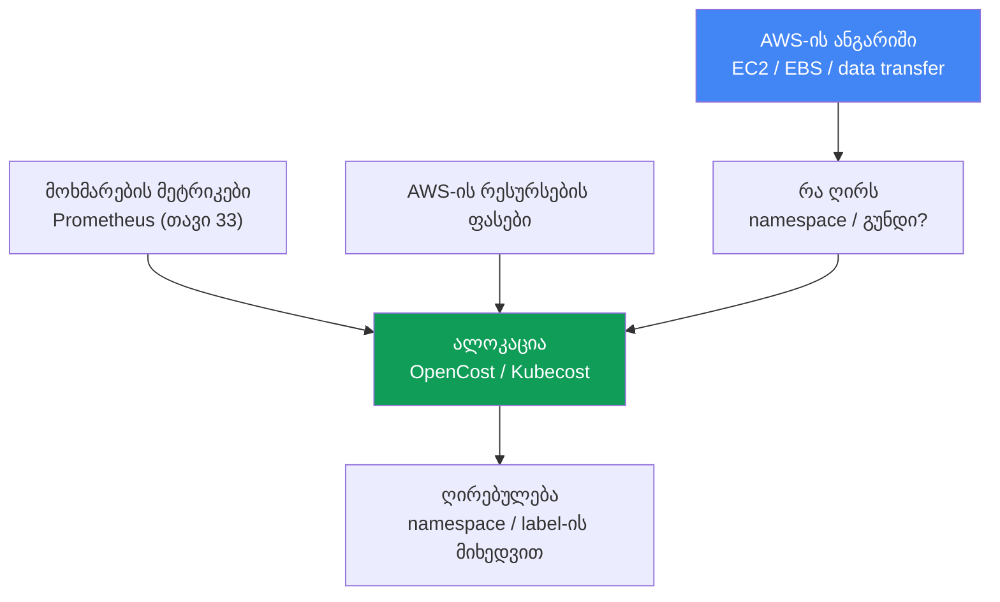
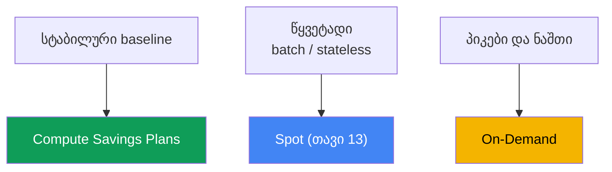

[რუსული ვერსია](ru.md) · [Eng version](en.md) · [Versión en español](es.md) · [Version française](fr.md) · [Deutsche Version](de.md) · [繁體中文版](tw.md) · [日本語版](jp.md)
# თავი 43. ღირებულება: OpenCost და Kubecost, right-sizing, Savings Plans, Spot-ის მიქსი, ტრაფიკი

> **რა არის შემდეგ.** 33-36 თავებმა observability მოგვცა: მეტრიკები, ლოგები, ტრეისები - ხედავთ, რას
> აკეთებს კლასტერი. ეს თავი ეხება იმას, თუ რა ჯდება ეს ყველაფერი და როგორ ვუპასუხოთ ბიზნესის კითხვას:
> „რა ღირს გუნდი X ან სერვისი Y“. მომიჯნავე თემები სხვა თავებშია: Spot და ნოდების შეძენის მოდელები -
> თავი 13, პოდების sizing requests/limits-ისა და VPA-ის მეშვეობით - თავი 14, Karpenter-ის consolidation
> და bin-packing - თავი 12, ტრაფიკის ღირებულება (NAT, cross-AZ, endpoints) - თავი 31, ლოგები და მათი
> ხარჯები - თავი 34, gp3 და EBS-ტომები - თავი 23. აქ ყველაფერს ერთ სურათად ვკრავთ და ვამატებთ
> ღირებულების ალოკაციას Kubernetes-ის ობიექტებზე და AWS-ის commitment-მოდელებს.

## 43.1. ანგარიში იზრდება, მაგრამ რის გამო - გაუგებარია

ფინანსების გუნდი მარტივი კითხვით მოდის: EKS-ის ანგარიში კვარტალში მესამედით გაიზარდა, ახსენით რატომ
და ვინ ხარჯავს ამ თანხას. მორიგე ხსნის Cost Explorer-ს და ხედავს AWS-ის სიმართლეს: დიდი სტრიქონი
`Amazon Elastic Compute Cloud` (ეს კლასტერის ქვეშ არსებული ნოდებია), სტრიქონი `EBS`, სტრიქონი
`data transfer`. სულ ესაა. ამ თანხების namespace-ის, გუნდის ან სერვისის მიხედვით დაყოფა შეუძლებელია -
AWS-ის ბილინგში ასეთი ცნებები არ არსებობს.

ამავე დროს `kubectl top` პრობლემის მეორე ნახევარს აჩვენებს:

```bash
# პოდების რეალური მოხმარება
kubectl top pods -A --sort-by=cpu
# მოთხოვნილი რესურსი ნოდის მოცულობასთან შედარებით
kubectl describe node <node> | grep -A6 "Allocated resources"
```

სურათი ტიპურია: პოდმა მოითხოვა `cpu: 2` და `memory: 4Gi`, ხოლო `kubectl top` აჩვენებს 200m-სა და
600Mi-ს. Requests რამდენჯერმე გადაჭარბებულია. Karpenter-მა (თავი 12) კეთილსინდისიერად დაარეზერვა ამ
requests-ისთვის მოცულობა და აამუშავა ნოდები, რომლებშიც ფულს იხდით, თუმცა პოდები მათ არ იყენებენ.
ნოდები „ქაღალდზე“ დაკავებულია, ფაქტობრივად კი თითქმის ცარიელია.

ერთ ანგარიშში ორი განსხვავებული ჩავარდნაა:

- **ალოკაცია არ არსებობს.** AWS თანხას იღებს რესურსებისთვის (ინსტანსები, ტომები, ტრაფიკი) და არა
  namespace-ისთვის. ერთ ნოდზე მრავალი გუნდის პოდები მუშაობს - AWS-ის ბილინგი მათ ვერ განასხვავებს.
- **ეფექტიანობა არ არსებობს.** Requests გადაჭარბებულია, bin-packing სიცარიელეს არეზერვებს, ნოდები
  უქმადაა. ვიხდით დარეზერვებულ და არა გამოყენებულ რესურსში.

აქედან გამომდინარეობს თავის გეგმა: ჯერ განვიხილავთ, რატომ ვერ პასუხობს AWS-ის ანგარიში ალოკაციის
კითხვას და როგორ აღვადგინოთ იგი (OpenCost, Kubecost); შემდეგ ეკონომიის მთავარ ბერკეტს - right-sizing-ს;
შემდეგ გამოთვლითი რესურსების შეძენის მოდელებს (On-Demand, Spot, Savings Plans, Reserved) და მათ მიქსს;
ამის შემდეგ ტრაფიკისა და შენახვის ხარჯებს; ბოლოს კი FinOps-ის პრაქტიკებსა და ოპტიმიზაციის პრიორიტეტს.

## 43.2. რატომ არაფერი იცის AWS-ის ანგარიშმა namespace-ის შესახებ

AWS-ის ბილინგი რესურსების დონეზე მუშაობს: EC2-ინსტანსმა ამ ტიპით ამდენი საათი იმუშავა, `gp3` ტომმა
ამდენი GiB დაიკავა, ამდენმა გიგაბაიტმა გაიარა cross-AZ და NAT. ეს AWS-ის ფიზიკური და ვირტუალური
ობიექტებია. Kubernetes კი ნოდს პოდებად ყოფს და მათ სხვადასხვა namespace-ში, სხვადასხვა გუნდის
სხვადასხვა Deployment-ს უნაწილებს. „ინსტანსმა `m6i.2xlarge` 720 საათი იმუშავა“ და „`payments`
გუნდის `checkout` სერვისი ამდენი დაჯდა“ ერთმანეთს უზარმაზარი უფსკრულითაა დაშორებული, რომელსაც AWS
ვერ კვეთს.

კავშირის აღდგენა მხოლოდ Kubernetes-ის შიგნით შეიძლება: მეტრიკებიდან ავიღოთ თითოეული პოდის რეალური
მოხმარება (CPU, მეხსიერება, დისკი, ქსელი), AWS-იდან ავიღოთ ნოდის რესურსების ფასი და ნოდის ღირებულება
პოდებს მათი მოხმარების ან requests-ის პროპორციულად გავუნაწილოთ. შემდეგ პოდები Deployment-ში,
namespace-ში, team-ში გავაერთიანოთ - labels-ის მიხედვით. ამას ღირებულების ალოკაცია (cost allocation)
ეწოდება და ამას ცალკე ინსტრუმენტი ასრულებს და არა AWS-ის ბილინგი.



## 43.3. OpenCost და Kubecost

**OpenCost** - Kubernetes-ის ღირებულების ალოკაციის ღია, მომწოდებლისგან დამოუკიდებელი სტანდარტია,
CNCF-ის პროექტი (ინკუბაციაშია 2024 წლის ოქტომბრიდან). მისი მიზანი ფორმულირებულია როგორც „Prometheus
ღირებულების მონიტორინგისთვის“: ერთიანი მოდელი, რომლის თავზეც სხვა გადაწყვეტილებები შენდება. მექანიკა
პირდაპირია:

- პოდების მოხმარებას იღებს მეტრიკებიდან (Prometheus, თავი 33): CPU, მეხსიერება, დისკი, ქსელი;
- AWS-ის რესურსების ფასებს იღებს - EKS-ზე თავად ჩამოტვირთავს საჯარო on-demand ფასს, დამატებითი
  კონფიგურაცია საჭირო არ არის;
- ნოდების ღირებულებას პოდებზე ანაწილებს და აჯამებს namespace-ის, Deployment-ის, label-ის, SA-ის მიხედვით.

შედეგი ხელმისაწვდომია API-ით და dashboard-ებისთვის გამოსადეგ ფორმატში. OpenCost შემადგენლობით
მინიმალური ალოკაციის ძრავაა.

**Kubecost** - OpenCost-ზე დაფუძნებული პროდუქტია: იგივე ძრავა, დამატებული UI dashboard-ებით, ისტორია,
ანგარიშები, ოპტიმიზაციის რეკომენდაციები და savings insights. EKS-ისთვის არსებობს **Amazon EKS optimized
Kubecost bundle**, რომელიც EKS add-on-ის ან Helm-ის მეშვეობით ინსტალირდება; მხარდაჭერის მიღება AWS
Support-ის მოქმედი შეთანხმებების ფარგლებში შეიძლება. Kubecost მონაცემებს Prometheus-თან თავსებად
საცავში ინახავს (ახალ ვერსიებში მულტიკლასტერისთვის - S3-თან თავსებად ობიექტურ საცავში).

**ზუსტი ღირებულება Cost and Usage Report-ის მეშვეობით.** საჯარო on-demand ფასი სურათს ზედმეტად
ზრდის: მან თქვენი ფასდაკლებების შესახებ არაფერი იცის. OpenCost-საც და Kubecost-საც შეუძლია დაუკავშირდეს
AWS Cost and Usage Report-ს - S3-ში მოთავსებულ დეტალურ ბილინგს, რომელსაც Athena-ს მოთხოვნებით კითხულობენ -
და ალოკაცია ფაქტობრივად გამოწერილ ანგარიშს შეუჯეროს (reconcile). მაშინ ნოდების ღირებულებაში მოხვდება
რეალური ტარიფები Savings Plans-ის, Reserved Instances-ის, Spot-ისა და Enterprise-ფასდაკლებების
გათვალისწინებით და არა კატალოგის ფასი. ამ შეჯერების გარეშე ალოკაცია გუნდებს შორის პროპორციების მხრივ
სწორია, მაგრამ აბსოლუტური მნიშვნელობა გადაჭარბებულია.

| | OpenCost | Kubecost |
|---|---|---|
| რა არის | ალოკაციის ძრავა და სტანდარტი (CNCF) | OpenCost-ზე დაფუძნებული პროდუქტი |
| ინტერფეისი | API, მინიმალური UI | სრულფასოვანი UI, dashboard-ები, ანგარიშები |
| რეკომენდაციები | არა | right-sizing, savings insights |
| EKS-ზე | Helm, მეტრიკები Prometheus-იდან | EKS add-on ან Helm, EKS-optimized bundle |
| როდის ირჩევენ | საჭიროა ღია სტანდარტი და მონაცემები | საჭიროა მზა UI, ანგარიშები და რეკომენდაციები |

**საერთო (shared) ხარჯების განაწილება.** ყველაფრის პირდაპირ პოდებზე განაწილება შეუძლებელია. არსებობს
ხარჯები, რომლებსაც მთელი კლასტერი ეწევა: control plane-ის საათობრივი გადასახადი, სისტემური namespace-ები
(`kube-system` და add-on-ები) და, რაც მთავარია, **idle-მოცულობა**: სხვაობა იმ რესურსს, რომელშიც ფულს
ვიხდით (ნოდების მოცულობა), და პოდების რეალურ მოხმარებას შორის. ინსტრუმენტი ამ shared-ხარჯებს ან ცალკე
სტრიქონად აჩვენებს, ან შერჩეული წესით ანაწილებს გუნდებზე (თანაბრად, მოხმარების პროპორციულად, weighted-
წილების მიხედვით). Idle უმნიშვნელოვანესი სტრიქონია: დიდი idle პირდაპირ მიუთითებს გადაჭარბებულ requests-სა
და ცუდ bin-packing-ზე, ანუ right-sizing-ის პოტენციალზე (განყოფილება 43.4).

**Showback და chargeback.** ალოკაცია ორი მოდელიდან ერთ-ერთისთვისაა საჭირო:

- **showback** - გუნდებს მათ ღირებულებას ინფორმაციის სახით აჩვენებენ, თანხის მოძრაობის გარეშე. პირველი
  ნაბიჯია ხარჯების ხილული გახდომა, რათა გუნდებმა ანომალიები თავად შეამჩნიონ.
- **chargeback** - ღირებულებას რეალურად აკისრებენ გუნდის ბიუჯეტს, თანხები კომპანიის შიგნით გადაადგილდება.
  მოითხოვს მომწიფებულ აღრიცხვას, ალოკაციის ციფრებისადმი ნდობასა და shared-ხარჯების შეთანხმებულ წესებს.

თითქმის ყოველთვის showback-ით იწყებენ: პოლიტიკურად უფრო იაფია და ქცევას უკვე ცვლის.

## 43.4. Right-sizing - მთავარი ბერკეტი

EKS-ში ყველაზე დიდი ეკონომია, როგორც წესი, commitment-იდან ან Spot-იდან კი არა, სიცარიელის აღმოფხვრიდან
მიიღება. ჯაჭვის ლოგიკა ასეთია: requests გადაჭარბებულია → bin-packing (Karpenter, თავი 12) მოცულობას
არეზერვებს → Karpenter ამ დარეზერვებული მოცულობისთვის ნოდებს ამუშავებს → თქვენ ფულს იხდით ნოდებში,
რომლებსაც პოდები არ იყენებენ. გადაჭარბებული `requests` არის ფასიანი სიცარიელე, გამრავლებული რეპლიკების
რაოდენობაზე.

დიაგნოსტიკა requested-ისა და used-ის შედარებაა:

```bash
# პოდების მოთხოვნები
kubectl get pods -A -o custom-columns=\
NS:.metadata.namespace,POD:.metadata.name,\
CPU_REQ:.spec.containers[*].resources.requests.cpu,\
MEM_REQ:.spec.containers[*].resources.requests.memory
# რეალური მოხმარება
kubectl top pods -A
```

ამას უფრო ზუსტად და დინამიკაში მეტრიკები (თავი 33) და რეკომენდაციის რეჟიმში VPA-ის რეკომენდაციები
(თავი 14) გვაძლევს: VPA აკვირდება მოხმარებას და `requests`-ის ადეკვატურ მნიშვნელობებს გვთავაზობს.
Requests-ის რეალურ მოხმარებამდე შემცირება (პიკებისთვის მარაგით) ნოდებს ამჭიდროებს: იმავე ნოდზე მეტი
პოდი ეტევა, ზედმეტ ნოდებს Karpenter-ის consolidation (თავი 12) შლის და ანგარიში მცირდება.

სიფრთხილის საზღვრები:

- **memory `limits` და OOMKill.** მეხსიერების ზედმეტად დაბალი ლიმიტის გამო პოდი OOM-ით კვდება.
  მეხსიერება არაკუმშვადი რესურსია: ლიმიტი ფრთხილად, პიკებისთვის მარაგითა და მეტრიკებში ნანახი რეალური
  პიკური მნიშვნელობების გათვალისწინებით მცირდება.
- **CPU `limits` და throttling.** CPU-ის მკაცრი ლიმიტი პოდს პიკების დროს throttling-ით ახშობს. ხშირად
  უმჯობესია `requests` მიუთითოთ და CPU `limit` არ დააყენოთ (ან უხვად მისცეთ) - იხ. თავი 14.
- **არ შეამციროთ baseline ზედმეტად.** Right-size დგინდება სტაბილური მოხმარებისა და headroom-ის მიხედვით
  და არა მინიმუმის მიხედვით: წინააღმდეგ შემთხვევაში ჩვეულებრივი დღის პიკი ინციდენტად იქცევა.

Right-sizing და bin-packing ოპტიმიზაციის რიგში პირველია: ისინი თავად მოხმარებულ მოცულობას ამცირებს,
ხოლო შემდეგ შემცირებულ და დასტაბილურებულ მოცულობაზე ვრცელდება ფასდაკლების მოდელები (განყოფილება 43.6).

## 43.5. გამოთვლითი რესურსების შეძენის მოდელები

EKS-ის ნოდები EC2-ია და მათში ფულის გადახდა სხვადასხვა გზით შეიძლება. ფასდაკლების მოდელები არ ცვლის
იმას, რამდენს მოიხმართ; ისინი ერთეულის ტარიფს ცვლის. ამიტომ მათ right-sizing-ის შემდეგ, უკვე
დასტაბილურებულ მოცულობაზე იყენებენ (წინააღმდეგ შემთხვევაში სიცარიელეზე აიღებთ commitment-ს).

| მოდელი | ვალდებულება | წყვეტადობა | რისთვის |
|---|---|---|---|
| On-Demand | არა | არა | პიკები, ნაშთი, ყველაფერი დაუფარავი |
| Spot | არა | დიახ, შეტყობინებით | fault-tolerant, batch, stateless (თავი 13) |
| Compute Savings Plans | $/საათი 1 ან 3 წლით | არა | გამოთვლითი რესურსების სტაბილური baseline |
| Reserved Instances | კონკრეტული კონფიგურაცია, 1-3 წელი | არა | ხანგრძლივი, სტაბილური, სპეციფიკური დატვირთვები |

- **On-Demand** - საბაზისო რეჟიმია: იხდით მუშაობის საათში ვალდებულებების გარეშე, ტარიფი ყველაზე მაღალია.
  ეს არის ნაგულისხმევი რეჟიმი და „ნაშთი“, რომლითაც სხვა მოდელებში ვერმოხვედრილი ყველაფერი იფარება.
- **Spot** (თავი 13) - AWS-ის თავისუფალი მოცულობა დიდი ფასდაკლებით, თუმცა მისი წართმევა მოკლე
  შეტყობინებით შეიძლება. გამოდგება წყვეტის ამტანი დატვირთვებისთვის: stateless-სერვისები რამდენიმე
  რეპლიკით, რიგების დამუშავება, batch, CI. ინსტანსების ტიპებისა და AZ-ების მიხედვით დივერსიფიკაცია
  ერთდროული გამოთხოვის რისკს ამცირებს - დეტალურად იხილეთ თავი 13.
- **Compute Savings Plans** - ვალდებულება, რომ 1 ან 3 წლის განმავლობაში გამოთვლით რესურსებში საათში
  განსაზღვრულ თანხას დახარჯავთ ფასდაკლების სანაცვლოდ. მოქნილია: ფასდაკლება ინსტანსების ოჯახის,
  რეგიონისა და OS-ის მიუხედავად ვრცელდება, ასევე Fargate-სა და Lambda-ზეც. იდეალურია პროგნოზირებადი
  baseline-ისთვის.
- **Reserved Instances** - უფრო ძველი მექანიზმია: ვალდებულება კონკრეტულ კონფიგურაციაზე (ოჯახი, რეგიონი)
  1-3 წლით. Savings Plans-ზე ნაკლებად მოქნილია; EKS-ის გამოთვლითი რესურსებისთვის უფრო ხშირად Savings
  Plans-ს ირჩევენ, RI-ს კი სპეციფიკური, ხანგრძლივად არსებული რესურსებისთვის ინარჩუნებენ.

**Commitment და Spot ერთი ბაზისთვის კონკურირებს.** Savings Plans Spot-მოხმარებაზე არ ვრცელდება: Spot
commitment-ით არ იფარება და Spot-ფასის ზემოდან დამატებით ფასდაკლებას არ იღებს. აქედან მოდის ტიპური
შეცდომა: commitment-ს მიმდინარე მოხმარების მიხედვით ყიდულობენ, შემდეგ კი პარკის ნაწილი Spot-ზე
გადააქვთ (Karpenter ან node group) - დასაფარი ბაზა მცირდება, commitment კი არასრულად გამოყენებული რჩება.
„მოგვიანებით გათანაბრდება“ არ მუშაობს: commitment საათობრივია, საათის გამოუყენებელი ნაშთი შემდეგ საათზე
არ გადადის, დანაკლისი ყოველ საათში იკარგება და არა ვადის ბოლოს ჯამდება. ამიტომ baseline-ს აკლებენ იმ
ნაწილს, რომლის Spot-ზე დატოვებასაც გეგმავენ, და commitment-ს უწყვეტ ნაშთზე იღებენ. მაგრამ „Spot-ის
გამოკლება“ არ ნიშნავს „Spot-პულების სრული სიმძლავრის გამოკლებას“: Spot-მოცულობის უკმარისობისას
On-Demand-ზე fallback (თავი 13) მოხმარების ნაწილს commitment-ის ქვეშ აბრუნებს, ამიტომ აკლებენ Spot-ის
სტაბილურად მისაღწევ წილს და არა საპროექტოს, ხოლო commitment-ს ფაქტის მიხედვით გადახედავენ და არა გეგმის.
გამოყენების რიგი ასეთია: Savings Plans გამოიყენება Reserved Instances-ის შემდეგ, EC2 Instance Savings
Plans - Compute Savings Plans-ზე ადრე, ხოლო შიგნით - მოხმარებიდან, რომელსაც ფასდაკლების ყველაზე მაღალი
პროცენტი აქვს; ეს ხსნის, რატომ იხარჯება commitment შერეულ პარკში არა იქ, სადაც ელოდნენ.

**მიქსის სტრატეგია.** ნოდების ჯანსაღი პარკი, როგორც წესი, ყველა რეჟიმს აერთიანებს: Compute Savings
Plans ფარავს სტაბილურ baseline-ს, Spot იღებს მოქნილ და პაკეტურ დატვირთვებს, On-Demand კი ფარავს პიკებს
და ყველაფერს, რისი შეწყვეტა ან commitment-ით დაფარვა შეუძლებელია. პროპორციები დამოკიდებულია წყვეტადი
დატვირთვების წილსა და baseline-ის პროგნოზირებადობაზე; ფასდაკლებების კონკრეტული პროცენტები AWS-ის
აქტუალურ ფასებთან უნდა შეჯერდეს.

**რა არის EKS-ისთვის სპეციფიკური ანგარიშში:**

- **control plane** თითოეული კლასტერისთვის საათობრივად ტარიფდება, დატვირთვის მიუხედავად - ეს მუდმივი
  სტრიქონია და ბევრი მცირე კლასტერის შექმნის საწინააღმდეგო არგუმენტი (თავი 32).
- **extended support** სტანდარტულზე ძვირია: extended support-ში მყოფი ვერსიის მქონე კლასტერზე control
  plane-ის გაზრდილ საათობრივ გადასახადს იღებენ (თავი 38) - კიდევ ერთი სტიმული დროული განახლებისთვის.
- **Fargate** EC2-ნოდებისგან განსხვავებულად ტარიფდება: იხდით პოდისთვის გამოყოფილ vCPU-სა და მეხსიერებაში,
  მისი არსებობის დროის მიხედვით, სამართავი ნოდების გარეშე (დეტალები და სცენარები - თავი 15).
- **ფასდაკლების მოდელები ყველაფერს არ ფარავს:** Compute Savings Plans ვრცელდება EC2-ზე, Fargate-ზე,
  Lambda-სა და SageMaker AI-ზე, მაგრამ EKS control plane-ის საათობრივი გადასახადი ამ სიაში არ შედის და
  კლასტერის მუდმივი სტრიქონი ფასდაკლების მოდელებით არ მცირდება (თავი 9).



## 43.6. ტრაფიკი და შენახვა, როგორც ანგარიშის ხარჯები

გამოთვლითი რესურსების შემდეგ EKS-ის ანგარიშში ორი დიდი ჯგუფი რჩება, რომლებიც ადვილად შეიძლება
გამოგრჩეთ: ისინი არქიტექტურაშია „გაფანტული“. მათ პროფილური თავები განიხილავს, აქ კი ნაჩვენებია, რას
გვაძლევს თითოეული მათგანი:

| ხარჯი | სად არის ეკონომია | თავი |
|---|---|---|
| Cross-AZ ტრაფიკი | topology-aware routing, პოდების ლოკალურობა | თავი 31 |
| NAT Gateway | დამუშავება და per-GB NAT-ის გავლით ძვირია | თავი 31 |
| VPC endpoints / PrivateLink | AWS-სერვისებისკენ ტრაფიკის NAT-ის გვერდის ავლით გატარება | თავი 31 |
| ლოგები | მოცულობა, retention, სემპლირება, ფილტრები | თავი 34 |
| EBS-ტომები | gp3 ნაცვლად gp2-ისა, ზომა, სნეპშოტები | თავი 23 |

- **Cross-AZ.** ზონებს შორის ტრაფიკი ორივე მიმართულებით ტარიფდება. ერთ AZ-ში მყოფი სერვისი, რომელიც
  სხვა AZ-ში მდებარე ბაზას მიმართავს, თითოეულ გიგაბაიტში იხდის. ალოკაცია და ქსელის მეტრიკები ამის
  დანახვაში გვეხმარება; მასთან ბრძოლა (topology aware hints, ლოკალურობა) განხილულია 31-ე თავში.
- **NAT Gateway.** თანხას იღებს როგორც მუშაობის საათებში, ისე თითოეულ დამუშავებულ გიგაბაიტში. პოდები,
  რომლებიც ინტერნეტს ან AWS-სერვისებს NAT-ის გავლით მიმართავს, ანგარიშს ზრდის - სწორედ აქ გვეხმარება
  VPC endpoints და PrivateLink (თავი 31).
- **ლოგები.** CloudWatch Logs, OpenSearch და ლოგების მიწოდების ტრაფიკი შესამჩნევი ხარჯია მრავალსიტყვიანი
  აპლიკაციებისა და ხანგრძლივი retention-ის შემთხვევაში. მოცულობის, retention-ისა და სემპლირების კონტროლი
  განხილულია 34-ე თავში.
- **შენახვა.** თანაბარი მოცულობისას `gp3`, როგორც წესი, `gp2`-ზე მომგებიანია და IOPS-ისა და throughput-ის
  ცალ-ცალკე მითითების საშუალებას იძლევა; გამოუყენებელი ტომები და ძველი სნეპშოტები ჩუმი გაჟონვაა (თავი 23).

## 43.7. FinOps-ის პრაქტიკები

ალოკაცია და შეძენის მოდელები ინსტრუმენტებია; FinOps კი პროცესია, რომელიც მათ მდგრადს ხდის.

- **Cost allocation tags და Kubernetes labels.** AWS-ის მხარეს რესურსებს tags-ით (`team`, `env`,
  `cost-center`) ნიშნავენ, ხოლო user-defined tags Billing-ის კონსოლში უნდა გააქტიურდეს - გააქტიურების
  გარეშე ისინი Cost Explorer-სა და Budgets-ში არ გამოჩნდება. კლასტერში იმავე განზომილებებს namespace-სა
  და workload-ზე არსებული labels ატარებს, რომელთა მიხედვითაც OpenCost/Kubecost ჭრის მონაცემებს. ორივე
  მონიშვნა შინაარსობრივად უნდა ემთხვეოდეს, რათა AWS-ისა და კლასტერის სურათები ერთმანეთს დაემთხვეს.
- **AWS Budgets და შეტყობინებები.** ქმნიან ბიუჯეტებს (საერთოსა და tags/services-ის მიხედვით) ზღვრებითა და
  შეტყობინებებით, რათა ზრდა მომენტალურად დაიჭირონ და არა თვის ბოლოს, ანგარიშის მიღების შემდეგ.
- **Cost Anomaly Detection.** Cost Management-ის ცალკე სერვისი: ML ხარჯების საბაზისო ხაზს აგებს,
  ანომალიურ ნახტომებს იჭერს და შეტყობინებებს email-ით ან SNS-ში აგზავნის (იქიდან AWS Chatbot-ის
  მეშვეობით Slack-ში ან Teams-ში). ფიქსირებული ზღვრის მქონე Budgets-ისგან განსხვავებით, სწორედ ჩვეული
  პატერნიდან გადახრას იჭერს - ზრდას, რომელიც ჯერ კიდევ ეტევა სტატიკურ ბიუჯეტში, მაგრამ ნორმას სცდება.
- **Commitment-ის მონიტორინგი.** Cost Explorer-ში არის Savings Plans utilization-ის ანგარიში (commitment-ის
  რა ნაწილი დაიხარჯა რეალურად) და Savings Plans coverage-ის ანგარიში (შესაბამისი მოხმარების რა წილია
  დაფარული commitment-ით), ხოლო AWS Budgets-ში - Savings Plans-ისთვის განკუთვნილი ბიუჯეტის ცალკე ტიპი,
  utilization-ისა და coverage-ის მიხედვით, SNS-ის შეტყობინებებით. Utilization-ს ისევე აკვირდებიან, როგორც
  ზედმეტ ხარჯვას: დატვირთვების Spot-ზე გადატანის შემდეგ ვარდნა დაუყოვნებლივ ჩანს და არა ერთი თვის შემდეგ
  ანგარიშში.
- **Cost Explorer tags-ის მიხედვით დაჯგუფებით.** გააქტიურებული tags-ის მიხედვით ანგარიშის გარჩევა გუნდის,
  გარემოსა და სერვისის დინამიკის სანახავად სტანდარტული გზაა.
- **Showback გუნდებისთვის.** რეგულარული ანგარიში „რა დაჯდა თქვენი ნაწილი“ ქცევას ნებისმიერ რეგლამენტზე
  ძლიერ ცვლის: გუნდი თავად ამჩნევს დავიწყებულ LoadBalancer-ს ან გაბერილ requests-ს.

**ოპტიმიზაციის პრიორიტეტი** (ზემოდან ქვემოთ, ეფექტისა და რისკის თანაფარდობის მიხედვით):

1. **Right-size და bin-pack** - თავად მოხმარებული მოცულობის შემცირება (განყოფილება 43.4, თავი 12). ეს
   ამცირებს ბაზას, რომელზეც ყველაფერი დანარჩენი ვრცელდება.
2. **Savings Plans დასტაბილურებულ baseline-ზე** - commitment-ის აღება უკვე შემცირებულ სტაბილურ მოცულობაზე
   და არა საწყის, გაბერილ მოცულობაზე.
3. **Spot მოქნილი დატვირთვებისთვის** - წყვეტადი დატვირთვების Spot-ზე გადატანა (თავი 13).
4. **ტრაფიკი, ლოგები, შენახვა** - cross-AZ-ისა და NAT-ის მოწესრიგება (თავი 31), ლოგების retention-ის
   (თავი 34), ტომებისა და სნეპშოტების (თავი 23) მოწესრიგება.

თანმიმდევრობა მნიშვნელოვანია: commitment-ის აღება (ნაბიჯი 2) right-sizing-მდე (ნაბიჯი 1) ნიშნავს
სიცარიელის საფასურის ერთიდან სამ წლამდე დაფიქსირებას.

## 43.8. როგორ იყენებენ ამას production-ში

- **ალოკაციას ფულზე კამათამდე აყენებენ.** OpenCost ან Kubecost წინასწარ იშლება, რათა ფინანსებთან საუბრისას
  namespace-ის მიხედვით ციფრები უკვე არსებობდეს და არა დაპირება „დათვლას ვცდით“.
- **Showback-ით იწყებენ.** გუნდები ჯერ საკუთარ ღირებულებას ხედავს და მხოლოდ მომწიფებული აღრიცხვის შემდეგ
  გადადის chargeback-ზე, ბიუჯეტის მოძრაობით.
- **Right-sizing-ს რუტინად აქცევენ.** რეგულარულად ადარებენ requests-ს მოხმარებასთან (მეტრიკები, VPA-ის
  რეკომენდაციები), ამცირებენ გადაჭარბებულ მნიშვნელობებს და consolidation-ს ნოდების შემჭიდროების
  საშუალებას აძლევენ.
- **Commitment-ს მხოლოდ დასტაბილურებულ baseline-ზე იღებენ.** Savings Plans-ს right-sizing-ის შემდეგ,
  თვეების განმავლობაში შენარჩუნებულ მოცულობაზე იღებენ, პიკებსა და ზრდას კი On-Demand-სა და Spot-ს უტოვებენ.
- **Tags-სა და labels-ს შეთანხმებულად იყენებენ.** განზომილებების ერთი ნაკრები (team, env, service)
  გამოიყენება როგორც AWS-ის cost allocation tags-ში, ისე Kubernetes labels-ში; user-defined tags
  Billing-ში აქტიურდება.
- **Budgets-ს შეტყობინებებით აყენებენ.** გუნდებისა და სერვისების მიხედვით ბიუჯეტები ზღვრებით ანომალიას
  წარმოშობის მომენტში იჭერს და არა ფაქტის შემდეგ.

## 43.9. მინი-ლექსიკონი

- **cost allocation (ალოკაცია)** - AWS-ის რესურსების ღირებულების განაწილება Kubernetes-ის ობიექტებზე
  (namespace, Deployment, label) მოხმარების ან requests-ის მიხედვით.
- **OpenCost** - ღირებულების ალოკაციის ღია, მომწოდებლისგან დამოუკიდებელი სტანდარტი და ძრავა, CNCF-ის
  პროექტი; მოხმარებას Prometheus-იდან იღებს, რესურსების ფასებს კი AWS-იდან.
- **Kubecost** - OpenCost-ზე დაფუძნებული პროდუქტი UI-ით, ანგარიშებითა და რეკომენდაციებით; EKS-ზე არსებობს
  EKS-optimized bundle (add-on ან Helm).
- **idle-მოცულობა** - სხვაობა ნოდების ფასიან მოცულობასა და რეალურ მოხმარებას შორის; გადაჭარბებული
  requests-ისა და ცუდი bin-packing-ის მაჩვენებელი.
- **shared costs** - კლასტერის საერთო ხარჯები (control plane, სისტემური namespace-ები, idle), რომლებიც
  წესის მიხედვით გუნდებზე ნაწილდება ან ცალკე აისახება.
- **showback** - გუნდებს საკუთარ ღირებულებას ფულის მოძრაობის გარეშე აჩვენებენ.
- **chargeback** - ღირებულებას რეალურად აკისრებენ გუნდის ბიუჯეტს.
- **right-sizing** - ნოდების შემჭიდროებისთვის requests/limits-ის რეალურ მოხმარებასთან შესაბამისობაში მოყვანა.
- **Compute Savings Plans** - ვალდებულება 1-3 წლის განმავლობაში საათში განსაზღვრული თანხის ხარჯვაზე
  ფასდაკლების სანაცვლოდ, მოქნილი ინსტანსების ოჯახების, რეგიონისა და Fargate/Lambda-ს მიხედვით; commitment
  საათობრივია, საათებს შორის არ გადადის და Spot-ზე არ ვრცელდება, მისი ხარჯვა კი Cost Explorer-ის Savings
  Plans utilization (დახარჯული) და coverage (დაფარული) ანგარიშებში ჩანს.
- **cost allocation tags** - AWS-ის tags ანგარიშის დასაყოფად; user-defined tags Billing-ის კონსოლში
  უნდა გააქტიურდეს.
- **Cost and Usage Report** - AWS-ის დეტალური ბილინგი S3-ში; Athena-ით წაკითხვა OpenCost/Kubecost-ს
  ალოკაციის ფასდაკლებებიან ფაქტობრივ ანგარიშთან შეჯერების საშუალებას აძლევს.
- **Cost Anomaly Detection** - AWS-ის სერვისი, ხარჯების ანომალიური ზრდის ML-დეტექცია email-ში ან SNS-ში
  შეტყობინებებით (Slack/Teams AWS Chatbot-ის მეშვეობით).

## 43.10. თავის შეჯამება

- AWS-ის ანგარიში გამოიწერება რესურსებისთვის (EC2, EBS, data transfer) და არა namespace-ისთვის; ერთ ნოდზე
  მრავალი გუნდის პოდები მუშაობს და ბილინგი მათ ვერ განასხვავებს.
- კითხვას „რა ღირს გუნდი X“ პასუხი მხოლოდ Kubernetes-ის შიგნით ალოკაციით გაეცემა: მეტრიკებიდან მიღებული
  მოხმარება და AWS-ის ფასები, რომლებიც ობიექტებზე მოხმარების ან requests-ის მიხედვით ნაწილდება.
- OpenCost ალოკაციის ღია სტანდარტი და ძრავაა (CNCF); Kubecost მასზე დაფუძნებული პროდუქტია UI-ით,
  ანგარიშებითა და რეკომენდაციებით, EKS-ზე კი EKS-optimized bundle-ის სახითაა ხელმისაწვდომი.
- Shared-ხარჯებს (control plane, სისტემური namespace-ები, idle) ან ანაწილებენ, ან ცალკე აჩვენებენ;
  დიდი idle right-sizing-ის საჭიროების პირდაპირი სიგნალია.
- Showback (ღირებულების ჩვენება) პირველი ნაბიჯია, chargeback (ბიუჯეტზე დაკისრება) კი მომწიფებული ეტაპი.
- Right-sizing მთავარი ბერკეტია: გადაჭარბებული requests აიძულებს bin-packing-ს სიცარიელე დაარეზერვოს და
  ზედმეტი ნოდები აამუშაოს; requests-ის შემცირება ნოდებს ამჭიდროებს.
- Limits სიფრთხილით შეამცირეთ: დაბალი memory-ლიმიტი OOMKill-ს იწვევს, მკაცრი CPU-ლიმიტი კი throttling-ს;
  right-size განსაზღვრეთ სტაბილური მოხმარებისა და headroom-ის მიხედვით.
- შეძენის მოდელები: On-Demand (ვალდებულებების გარეშე, ძვირი), Spot (იაფი, წყვეტადი), Compute Savings
  Plans (ხარჯვის commitment, მოქნილი), Reserved (კონკრეტული კონფიგურაცია).
- მიქსი: Savings Plans baseline-ისთვის, Spot მოქნილი დატვირთვებისთვის, On-Demand პიკებისთვის; commitment
  მხოლოდ right-sizing-ის შემდეგ და მხოლოდ დასტაბილურებულ მოცულობაზე აიღეთ.
- Spot და commitment ერთი ბაზისთვის კონკურირებს: Savings Plans Spot-ს არ ფარავს, საათობრივი commitment
  კი საათებს შორის არ გადადის, ამიტომ baseline-ს Spot-ის სტაბილურად მისაღწევ წილს აკლებენ.
- EKS-ის ანგარიშის სპეციფიკა: კლასტერის საათობრივი control plane, უფრო ძვირი extended support-ში
  (თავი 38), Fargate-ის ცალკე ფასები (თავი 15); ტრაფიკი და შენახვა - თავები 31, 34, 23.
- ზუსტი ციფრებისთვის ალოკაციას Cost and Usage Report-ს უკავშირებენ (Athena-ს მეშვეობით): მაშინ საჯარო
  ფასის ნაცვლად Savings Plans/RI/Spot-ის ფასდაკლებები გაითვალისწინება; Cost Anomaly Detection კი ხარჯების
  ანომალიურ ზრდას შეტყობინებებით იჭერს და ზღვრულ Budgets-ს ჩვეული პატერნიდან გადახრით ავსებს.

## 43.11. როგორ გამოგადგებათ ეს რეალურ სამუშაოში

მორიგეობისა და დაგეგმვისას ეს თავი ანგარიშს შავი ყუთიდან მართვად სიდიდედ აქცევს. როდესაც ფინანსები
კითხულობს, რატომ გაიზარდა ანგარიში, თქვენ `Amazon EC2` სტრიქონის მიხედვით კი არ მარჩიელობთ, არამედ
namespace-ის მიხედვით ალოკაციას ხსნით და აჩვენებთ, ვინ გამოიწვია ზრდა, idle-ს რეალური მოხმარებისგან
აცალკევებთ. ეს საუბარს „ძვირია“-დან „აი კონკრეტული Deployment გადაჭარბებული requests-ით“-ზე და შემდეგ
ქმედებაზე გადაიყვანს.

კლასტერის დაგეგმვისას ღირებულება საიმედოობის თანაბარ აუცილებელ განზომილებად იქცევა: გაშლილი ალოკაცია
(OpenCost ან Kubecost), შეთანხმებული cost allocation tags და labels, ბიუჯეტები შეტყობინებებით,
right-sizing-ის გამართული ციკლი და შეძენის გააზრებული მიქსი (Savings Plans baseline-ზე, Spot მოქნილზე,
On-Demand ნაშთზე). ოპტიმიზაციის რიგი ფიქსირებულია: ჯერ მოცულობა შეამცირეთ, შემდეგ დასტაბილურებულზე აიღეთ
commitment, შემდეგ გამოიყენეთ Spot, ბოლოს კი ტრაფიკი და შენახვა მოაწესრიგეთ. მაშინ ეკონომია მდგრადია და
არა კვარტლის დახურვამდე ჩატარებული ერთჯერადი აქცია.

## 43.12. თვითშემოწმების კითხვები

1. რატომ ვერ პასუხობს AWS-ის ანგარიში კითხვას „რა ღირს namespace“ და რა არის საჭირო პასუხისთვის?
2. როგორ აღადგენს ალოკაცია AWS-ის რესურსებსა და Kubernetes-ის ობიექტებს შორის კავშირს?
3. რა არის OpenCost, საიდან იღებს მოხმარებასა და ფასებს და რატომ არის ის CNCF-ის პროექტი?
4. რით განსხვავდება Kubecost OpenCost-ისგან და რას გვაძლევს EKS-optimized Kubecost bundle?
5. რას მიაკუთვნებენ shared-ხარჯებს და რატომ არის დიდი idle right-sizing-ის სიგნალი?
6. რა განსხვავებაა showback-სა და chargeback-ს შორის და ჩვეულებრივ რომლით იწყებენ?
7. რატომ იწვევს გადაჭარბებული requests ცარიელი ნოდების საფასურის გადახდას (bin-packing-ისა და Karpenter-ის როლი)?
8. რა რისკები ახლავს limits-ის აგრესიულ შემცირებას და როგორ ავიცილოთ ისინი?
9. რით განსხვავდება On-Demand, Spot, Savings Plans და Reserved ვალდებულებისა და მოქნილობის მიხედვით?
10. როგორ აწყობენ შეძენის მოდელების მიქსს და რატომ იღებენ Savings Plans-ს მხოლოდ baseline-ზე?
11. რატომ უპირისპირდება Savings Plans-ის შეძენა პარკის Spot-ზე გადატანას და რას აკლებენ baseline-ს
    commitment-ის აღებამდე?
12. რა არის EKS-ის ანგარიშისთვის სპეციფიკური: control plane, extended support, Fargate?
13. ტრაფიკისა და შენახვის რომელ ხარჯებს უკეთებენ ოპტიმიზაციას და რომელი თავები განიხილავს მათ?
14. როგორია ოპტიმიზაციის პრიორიტეტი და რატომ არ შეიძლება Savings Plans-ზე commitment-ის აღება right-sizing-მდე?
15. რატომ უნდა დაუკავშიროთ OpenCost/Kubecost Cost and Usage Report-ს და როგორ ავსებს Cost Anomaly Detection
    AWS Budgets-ს?

## პრაქტიკა

ტრაფიკის ღირებულება ასევე განხილულია [ლაბაში 117 - ტრაფიკი და ღირებულება: NAT ზონების მიხედვით ერთი
NAT-ის წინააღმდეგ, VPC endpoints, cross-AZ](../../labs/117/README_GE.MD). ამ თავს ცალკე ლაბა არ აქვს,
მაგრამ სრული სურათი მოქმედ კლასტერსა და AWS-ის კონსოლში ჩანს. დაიწყეთ requested-სა და used-ს შორის
სხვაობით - ეს ეკონომიის მთავარი წყაროა:

```bash
# რეალური მოხმარება მოთხოვნებთან შედარებით
kubectl top pods -A --sort-by=cpu
kubectl top nodes
# ნოდის რამდენი რესურსია უკვე დარეზერვებული requests-ით
kubectl describe node <node> | grep -A6 "Allocated resources"
```

გაშალეთ ალოკაცია (OpenCost ან EKS-optimized Kubecost bundle) და ნახეთ ღირებულება namespace-ისა და label-ის
მიხედვით, ყურადღება მიაქციეთ idle სტრიქონს - სწორედ ესაა გადაჭარბებული requests:

```bash
# Kubecost-ის UI port-forward-ის მეშვეობით (namespace kubecost)
kubectl -n kubecost port-forward deploy/kubecost-cost-analyzer 9090
# ალოკაციის მოთხოვნა OpenCost/Kubecost API-ის მეშვეობით
curl "http://localhost:9090/model/allocation?window=7d&aggregate=namespace"
```

AWS-ის მხარეს სურათი ბილინგში შეაჯერეთ: Billing-ის კონსოლში გაააქტიურეთ user-defined cost allocation tags,
Cost Explorer-ში ანგარიში tags-ის მიხედვით დააჯგუფეთ და შეტყობინებიანი ბიუჯეტი შექმენით. ზუსტი ციფრებისთვის
ალოკაციას Cost and Usage Report დაუკავშირეთ, ხოლო ანომალიური ზრდისთვის Cost Anomaly Detection დააყენეთ
SNS-ში შეტყობინებით.

```bash
# თანხები სერვისების მიხედვით პერიოდის განმავლობაში (Cost Explorer API)
aws ce get-cost-and-usage \
  --time-period Start=2024-01-01,End=2024-02-01 \
  --granularity MONTHLY --metrics "UnblendedCost" \
  --group-by Type=DIMENSION,Key=SERVICE
# დაყოფა გუნდის tag-ის მიხედვით
aws ce get-cost-and-usage \
  --time-period Start=2024-01-01,End=2024-02-01 \
  --granularity MONTHLY --metrics "UnblendedCost" \
  --group-by Type=TAG,Key=team
```

შემდეგ პრიორიტეტს მიჰყევით: right-size და bin-pack (განყოფილება 43.4, თავი 12), Savings Plans baseline-ზე,
Spot მოქნილი დატვირთვებისთვის (თავი 13), შემდეგ ტრაფიკი და შენახვა (თავები 31, 34, 23). კონკრეტული ფასები
და ფასდაკლების პროცენტები ყოველთვის AWS-ის აქტუალურ ფასებს შეაჯერეთ და არა სტატიებში მოცემულ რიცხვებს.

---
[სარჩევი](../README_GE.md) · [თავი 42](../42/ge.md) · [თავი 44](../44/ge.md)
