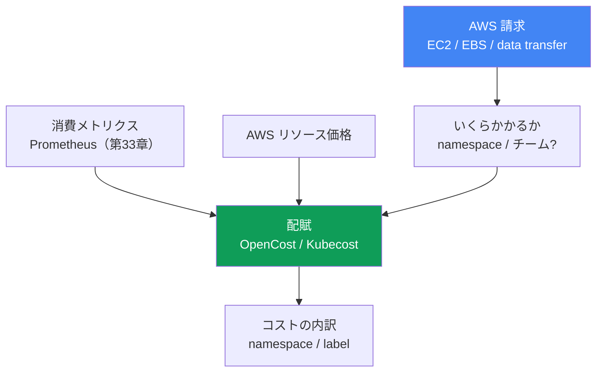
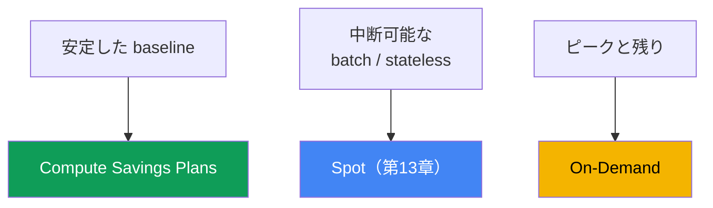

[Eng version](en.md) · [Versión en español](es.md) · [Version française](fr.md) · [Deutsche Version](de.md) · [Русская версия](ru.md) · [ქართული ვერსია](ge.md) · [繁體中文版](tw.md)
# 第43章. コスト: OpenCost と Kubecost、right-sizing、Savings Plans、Spot ミックス、トラフィック

> **次は何か。** 第33-36章で可観測性を扱いました。メトリクス、ログ、トレースにより、クラスターが何をしているかを確認できます。本章は、それにどれだけの費用がかかるか、そして「チーム X またはサービス Y のコストはいくらか」というビジネスからの問いにどう答えるかを扱います。関連内容は他章に委ねます。Spot とノードの購入モデルは第13章、requests/limits と VPA による Pod のサイジングは第14章、Karpenter の consolidation と bin-packing は第12章、トラフィックコスト（NAT、cross-AZ、endpoints）は第31章、ログとその費用は第34章、gp3 と EBS volume は第23章です。本章では、これらを一つの全体像にまとめ、Kubernetes オブジェクトへのコスト配賦と AWS のコミットメントモデルを追加します。

## 43.1. 請求額は増えているが、何に使われたのか分からない

財務部門は単純な質問を持ってきます。EKS の請求額が四半期で 3 分の 1 増えた。理由と、誰が使っているのかを説明してほしい、と。オンコール担当者が Cost Explorer を開くと、AWS の事実が見えます。大きな `Amazon Elastic Compute Cloud` の行（クラスター配下のノード）、`EBS` の行、`data transfer` の行です。それだけです。これらの金額を namespace、チーム、サービスごとに分解する方法はありません。AWS billing にはそのような概念がないからです。

同時に、`kubectl top` はもう半分の問題を示します。

```bash
# Pod の実際の消費量
kubectl top pods -A --sort-by=cpu
# リクエスト済みとノード容量の比較
kubectl describe node <node> | grep -A6 "Allocated resources"
```

典型的な状況です。Pod は `cpu: 2` と `memory: 4Gi` をリクエストしているのに、`kubectl top` は 200m と 600Mi を示します。Requests は何倍も過大です。Karpenter（第12章）はその requests に対して正直に容量を予約し、そのためのノードを起動します。Pod が利用していないノードにも支払います。ノードは「書類上は」埋まっていますが、実際にはほぼ空です。

一つの請求額に二つの異なる失敗があります。

- **配賦がない。** AWS は namespace ではなく、リソース（インスタンス、volume、トラフィック）に課金します。一つのノードには多くのチームの Pod が存在しますが、AWS billing はそれらを区別しません。
- **効率がない。** Requests が過大で、bin-packing が空き容量を予約し、ノードが遊休化します。使用分ではなく、予約分に支払っています。

したがって本章の進め方は次のとおりです。まず、AWS 請求が配賦の問いに答えられない理由と、それを取り戻す方法（OpenCost、Kubecost）。次に最大の節約レバーである right-sizing。続いてコンピューティングの購入モデル（On-Demand、Spot、Savings Plans、Reserved）とそのミックス。さらにトラフィックとストレージの費目。最後に FinOps の実践と最適化の優先順位です。

## 43.2. AWS の請求が namespace を知らない理由

AWS billing はリソースレベルで機能します。EC2 インスタンスがあるタイプで何時間稼働した、`gp3` volume が何 GiB 使用した、何 GB が cross-AZ と NAT 経由で転送された、というものです。これらは AWS の物理的・仮想的なエンティティです。一方 Kubernetes はノードを Pod に分割し、異なるチームの異なる namespace にある異なる Deployment へ配分します。「`m6i.2xlarge` インスタンスが 720 時間稼働した」と「`payments` チームの `checkout` サービスの費用はいくらか」の間には、AWS が越えられない隔たりがあります。

この関係を復元できるのは Kubernetes 内部だけです。メトリクスから各 Pod の実際の消費量（CPU、メモリ、ディスク、ネットワーク）を取得し、AWS からノードリソースの価格を取得します。その後、消費量または requests に比例してノードコストを Pod に配分します。さらにラベルにより Pod を Deployment、namespace、team へ集約します。これをコスト配賦（cost allocation）と呼び、AWS billing ではなく専用ツールが実行します。



## 43.3. OpenCost と Kubecost

**OpenCost** は、Kubernetes コスト配賦のオープンでベンダー中立な標準であり、CNCF のプロジェクトです（2024 年 10 月から incubation）。その目標は「コスト監視のための Prometheus」と表現されています。これは他のソリューションを構築するための統一モデルです。仕組みは直接的です。

- メトリクス（Prometheus、第33章）から Pod の消費量を取得します。CPU、メモリ、ディスク、ネットワークです。
- AWS リソースの価格を取得します。EKS 上では公開 on-demand price を自動取得するため、追加設定は不要です。
- ノードコストを Pod に配分し、namespace、Deployment、label、SA ごとに集約します。

結果は API とダッシュボード向けの形式で提供されます。OpenCost は最小構成の配賦エンジンです。

**Kubecost** は OpenCost を基盤とした製品です。同じエンジンに加えて、ダッシュボード付き UI、履歴、レポート、最適化の推奨、savings insights を備えます。EKS には **Amazon EKS optimized Kubecost bundle** があり、EKS add-on または Helm でインストールできます。サポートは有効な AWS Support 契約に基づいて受けられます。Kubecost はデータを Prometheus 互換ストレージに保存します（新しいバージョンのマルチクラスターでは、S3 互換のオブジェクトストレージに保存します）。

**Cost and Usage Report による正確なコスト。** 公開 on-demand price は実態より高くなります。独自の割引を認識しないためです。OpenCost と Kubecost はどちらも AWS Cost and Usage Report に接続できます。これは Athena クエリで読み取る S3 上の詳細な billing データです。これにより、配賦を実際に請求された金額と照合（reconcile）できます。するとノードコストにはカタログ価格ではなく、Savings Plans、Reserved Instances、Spot、Enterprise 割引を反映した実効レートが含まれます。この照合なしでもチーム間の比率としては正しい配賦ですが、絶対額は過大になります。

| | OpenCost | Kubecost |
|---|---|---|
| 概要 | 配賦エンジンと標準（CNCF） | OpenCost を基盤とする製品 |
| インターフェース | API、最小限の UI | 完全な UI、ダッシュボード、レポート |
| 推奨 | なし | right-sizing、savings insights |
| EKS 上 | Helm、Prometheus からのメトリクス | EKS add-on または Helm、EKS-optimized bundle |
| 選定する場合 | オープン標準とデータが必要 | UI、レポート、推奨をすぐに必要 |

**共有（shared）コストの分配。** すべてを直接 Pod に分配できるわけではありません。クラスター全体で発生するコストがあります。control plane の時間単位料金、システム namespace（`kube-system` と add-on）、そして最も重要な **idle 容量**、すなわち支払い対象（ノード容量）と Pod の実際の消費量の差です。ツールはこれらの shared コストを別行として表示するか、選択したルール（均等、消費量比例、weighted share）によりチームへ分配します。Idle は最重要の行です。idle が大きければ、過大な requests と不十分な bin-packing、すなわち right-sizing の可能性を直接示します（43.4節）。

**Showback と chargeback。** 配賦は二つのモデルのどちらかに必要です。

- **showback** は、資金移動なしに情報としてチームへそのコストを表示します。最初のステップは費用を可視化し、チーム自身が異常に気づけるようにすることです。
- **chargeback** は、実際にコストをチームの予算へ割り当て、社内で資金を移します。成熟した会計、配賦額への信頼、shared コストに関する合意済みルールが必要です。

ほぼ常に showback から始めます。政治的なコストが低く、それだけで行動が変わるからです。

## 43.4. Right-sizing は最大のレバー

EKS で最大の節約は通常、コミットメントや Spot ではなく、空き容量の排除です。連鎖の論理は次のとおりです。requests が過大 → bin-packing（Karpenter、第12章）が容量を予約 → Karpenter がその予約容量のためにノードを起動 → Pod が使用しないノードに支払う。過大な `requests` は、レプリカ数を掛けた有償の空き容量です。

診断では requested と used を比較します。

```bash
# Pod のリクエスト
kubectl get pods -A -o custom-columns=\
NS:.metadata.namespace,POD:.metadata.name,\
CPU_REQ:.spec.containers[*].resources.requests.cpu,\
MEM_REQ:.spec.containers[*].resources.requests.memory
# 実際の消費量
kubectl top pods -A
```

より正確に、かつ時間的推移も含めるには、メトリクス（第33章）と推奨モードの VPA（第14章）を使用します。VPA は消費量を観察し、適切な `requests` 値を提案します。requests を実際の消費量まで下げる（ピークへの余裕は残す）と、ノード密度が上がります。同じノードにより多くの Pod が収まり、Karpenter の consolidation（第12章）が余分なノードを削除し、請求額が下がります。

注意すべき境界があります。

- **memory `limits` と OOMKill。** memory limit を低くしすぎると、Pod は OOM により kill されます。メモリは圧縮できないリソースです。ピークへの余裕を残し、メトリクスの実際のピーク値を考慮して、慎重に limit を下げます。
- **CPU `limits` と throttling。** 厳しい CPU limit は、スパイク時に throttling で Pod を抑制します。多くの場合、`requests` を設定し、CPU `limit` は設定しない（または十分に大きくする）ほうが正しい選択です。第14章を参照してください。
- **baseline を過小評価しない。** Right-sizing は最小値ではなく、安定した消費量に headroom を加えた値で行います。そうしないと通常の日中ピークがインシデントになります。

Right-sizing と bin-packing は最適化の優先順位で最初です。これらは消費容量そのものを減らし、その後に小さく安定した容量へ割引モデルを適用します（43.6節）。

## 43.5. コンピューティングの購入モデル

EKS のノードは EC2 であり、支払い方法には選択肢があります。割引モデルは消費量を変えず、単価を変えます。そのため right-sizing 後、すでに安定した容量へ適用します（そうしなければ空きをコミットすることになります）。

| モデル | コミットメント | 中断可能性 | 適用先 |
|---|---|---|---|
| On-Demand | なし | なし | ピーク、残り、未カバーのすべて |
| Spot | なし | あり、通知付き | fault-tolerant、batch、stateless（第13章） |
| Compute Savings Plans | 1 または 3 年間の $/時間 | なし | 安定したコンピューティング baseline |
| Reserved Instances | 特定構成、1-3 年 | なし | 長期で安定した特定ワークロード |

- **On-Demand** は基本モードです。コミットメントなしで稼働時間に支払い、最も高いレートです。これがデフォルトであり、他のモデルに入らないすべてを埋める「残り」です。
- **Spot**（第13章）は大幅な割引を受けられる AWS の余剰容量ですが、短い通知で回収される可能性があります。複数レプリカを持つ stateless サービス、キュー処理、batch、CI など、中断を許容できるワークロードに適しています。インスタンスタイプと AZ による多様化は同時回収のリスクを下げます。詳細は第13章です。
- **Compute Savings Plans** は、割引と引き換えに、1 または 3 年間、コンピューティングへ時間あたり一定額を支出するコミットメントです。柔軟性があり、インスタンスファミリー、リージョン、OS に関係なく、Fargate と Lambda にも割引が適用されます。予測可能な baseline に理想的です。
- **Reserved Instances** はより古い仕組みです。特定構成（ファミリー、リージョン）に 1-3 年コミットします。Savings Plans より柔軟性が低いため、EKS コンピューティングでは通常 Savings Plans を選び、RI は特定の長期リソース向けに保持します。

**コミットメントと Spot は同じ基盤を競合します。** Savings Plans は Spot 消費には適用されません。Spot はコミットメントでカバーされず、Spot 価格への追加割引も得られません。ここで典型的な誤りが発生します。現在の消費量に基づいてコミットメントを購入し、その後、フリートの一部を Spot（Karpenter または node group）に移します。カバー対象の基盤が減少し、コミットメントは未使用のままです。「後で均される」は機能しません。コミットメントは時間単位であり、その時間の未使用残高は次の時間へ持ち越せず、不足分は契約期間の終わりに精算されるのではなく毎時間失効します。そのため、Spot で維持する予定の部分を baseline から差し引き、中断不可能な残りにコミットします。ただし「Spot を差し引く」は「spot pool の全容量を差し引く」ことではありません。Spot 容量不足時の On-Demand への fallback（第13章）では消費の一部が再びコミットメント対象に戻るため、設計上の割合ではなく安定して達成できる Spot 割合を差し引き、計画ではなく実績に基づいてコミットメントを見直します。適用順は、Savings Plans が Reserved Instances の後、EC2 Instance Savings Plans が Compute Savings Plans より先であり、内部では割引率が最も高い消費から始まります。これは、混在フリートでコミットメントが期待した場所に使われない理由を説明します。

**ミックス戦略。** 健全なノードフリートは通常、すべてのモードを組み合わせます。Compute Savings Plans は安定した baseline をカバーし、Spot は柔軟な batch ワークロードを担い、On-Demand はピークと中断・コミットできないすべてをカバーします。比率は中断可能なワークロードの割合と baseline への確信度に依存します。具体的な割引率は、常に最新の AWS pricing で確認してください。

**請求における EKS 固有の事項。**

- **control plane** は、ワークロードに関係なく各クラスターに時間単位で課金されます。これは固定の費目であり、小さなクラスターを大量に作らない理由です（第32章）。
- **extended support** は標準サポートより高額です。extended support のバージョンにあるクラスターは control plane の時間単位料金が上がります（第38章）。これは適時更新へのもう一つの動機です。
- **Fargate** は EC2 ノードと異なる方法で課金されます。管理対象ノードなしで、Pod に割り当てられた vCPU とメモリ、その存続時間に対して支払います（詳細とシナリオは第15章）。
- **割引モデルですべてはカバーされません。** Compute Savings Plans の対象には EC2、Fargate、Lambda、SageMaker AI が含まれますが、EKS control plane の時間単位料金は含まれません。クラスターごとの固定費目は割引モデルでは減りません（第9章）。



## 43.6. 請求費目としてのトラフィックとストレージ

コンピューティングの後、EKS 請求には見逃しやすい二つの大きなグループが残ります。アーキテクチャ全体に「分散」しているためです。詳細は専門の章で扱いますが、ここでは各項目が何をもたらすかを示します。

| 費目 | 節約できる場所 | 章 |
|---|---|---|
| Cross-AZ トラフィック | topology-aware routing、Pod の局所性 | 第31章 |
| NAT Gateway | NAT の処理と per-GB は高額 | 第31章 |
| VPC endpoints / PrivateLink | AWS サービスへのトラフィックを NAT から外す | 第31章 |
| ログ | 容量、retention、sampling、filters | 第34章 |
| EBS volume | gp2 ではなく gp3、サイズ、snapshots | 第23章 |

- **Cross-AZ。** AZ 間トラフィックは両方向で課金されます。一つの AZ のサービスが別の AZ のデータベースを呼び出すと、GB ごとに支払います。配賦とネットワークメトリクスはこれを可視化します。対策（topology aware hints、局所性）は第31章で扱います。
- **NAT Gateway。** 稼働時間と、処理する GB ごとの両方に課金されます。インターネットまたは NAT 経由で AWS サービスへアクセスする Pod は請求額を増やします。ここで VPC endpoints と PrivateLink（第31章）が役立ちます。
- **ログ。** CloudWatch Logs、OpenSearch、ログ配信トラフィックは、出力が多いアプリケーションと長い retention では目立つ費目です。容量、retention、sampling の制御は第34章で扱います。
- **ストレージ。** 同容量なら `gp3` は通常 `gp2` より有利で、IOPS と throughput を個別に設定できます。未使用 volume と古い snapshots は静かな漏出です（第23章）。

## 43.7. FinOps の実践

配賦と購入モデルはツールです。FinOps はそれらを持続可能にするプロセスです。

- **Cost allocation tags と Kubernetes labels。** AWS 側ではリソースにタグ（`team`、`env`、`cost-center`）を付け、user-defined タグを Billing コンソールで有効にします。有効化しなければ Cost Explorer と Budgets に現れません。クラスターでは namespace と workload の labels に同じディメンションを持たせ、OpenCost/Kubecost がそれにより分割します。二つのラベリングは意味が一致していなければなりません。そうすれば AWS とクラスターの表示が一致します。
- **AWS Budgets とアラート。** 予算（全体、およびタグ/サービス別）をしきい値と通知付きで作成し、月末に請求額から判明するのではなく、増加した時点で捉えます。
- **Cost Anomaly Detection。** 個別の Cost Management サービスです。ML が支出の基準線を構築して異常な急増を検出し、email または SNS（そこから AWS Chatbot を介して Slack または Teams）でアラートを送ります。固定しきい値の Budgets と異なり、静的な予算にはまだ収まっていても通常パターンから外れた増加を検出します。
- **コミットメントの監視。** Cost Explorer には Savings Plans utilization レポート（実際に消費したコミットメント量）と Savings Plans coverage レポート（適格な消費のうちコミットメントでカバーされた割合）があります。AWS Budgets には Savings Plans 用の独立した予算タイプがあり、utilization と coverage に基づいて SNS 経由のアラートを設定できます。過剰消費と同様に utilization を監視します。ワークロードを Spot に移した後の低下を、請求額が届く一か月後ではなくすぐに確認できます。
- **タグでグループ化した Cost Explorer。** 有効化したタグにより請求を分析することは、チーム、環境、サービスごとの推移を確認する標準的な方法です。
- **チームへの Showback。** 「あなたの部分にいくらかかったか」という定期レポートは、どんな規程よりも行動を変えます。チーム自身が放置した LoadBalancer や膨らんだ requests に気づきます。

**最適化の優先順位**（効果とリスクの比に基づく上から下の順）：

1. **Right-size と bin-pack**。消費容量そのものを減らします（43.4節、第12章）。これにより、他のすべてを適用する基盤が縮小します。
2. **安定した baseline に Savings Plans**。最初の膨らんだ容量ではなく、すでに縮小した安定容量をコミットします。
3. **柔軟なワークロードに Spot**。中断可能なものを Spot に移します（第13章）。
4. **トラフィック、ログ、ストレージ**。cross-AZ と NAT（第31章）、ログ retention（第34章）、volume と snapshots（第23章）を整理します。

順序は重要です。right-sizing（ステップ 1）より前に Savings Plans（ステップ 2）へコミットすることは、空き容量への支払いを 1-3 年固定することです。

## 43.8. 本番環境での適用方法

- **費用を巡る議論の前に配賦を導入する。** OpenCost または Kubecost をあらかじめデプロイし、財務との会話時には「計算してみます」ではなく namespace ごとの数値を準備します。
- **Showback から始める。** チームはまず自分たちのコストを確認し、会計が成熟してから予算を移動する chargeback へ進みます。
- **Right-sizing をルーチン化する。** requests と消費量（メトリクス、VPA の推奨）を定期的に比較し、過大な値を減らして consolidation がノードを高密度化できるようにします。
- **安定した baseline のみにコミットする。** Savings Plans は right-sizing の後、数か月にわたり維持される容量に対して購入し、ピークと成長分は On-Demand と Spot に残します。
- **タグと labels を整合させる。** team、env、service という一組のディメンションを AWS の cost allocation tags と Kubernetes の labels の両方で使用し、user-defined タグを Billing で有効化します。
- **アラート付き Budgets を設定する。** しきい値を設けたチーム・サービス別の予算は、事後ではなく発生時点で異常を捉えます。

## 43.9. ミニ用語集

- **cost allocation（配賦）** は、消費量または requests に基づき、AWS リソースのコストを Kubernetes オブジェクト（namespace、Deployment、label）に分配することです。
- **OpenCost** は、CNCF プロジェクトであるオープンかつベンダー中立なコスト配賦の標準とエンジンです。Prometheus から消費量を、AWS からリソース価格を取得します。
- **Kubecost** は UI、レポート、推奨を備えた OpenCost ベースの製品です。EKS には EKS-optimized bundle（add-on または Helm）があります。
- **idle 容量** は、支払い済みノード容量と実際の消費量の差です。過大な requests と不十分な bin-packing の指標です。
- **shared costs** は、ルールによりチームへ分配するか別表示する、クラスターの共通コスト（control plane、システム namespace、idle）です。
- **showback** は、資金移動なしにチームへそのコストを表示することです。
- **chargeback** は、実際にコストをチームの予算へ計上することです。
- **right-sizing** は、ノード密度を上げるために requests/limits を実際の消費量へ合わせることです。
- **Compute Savings Plans** は、割引と引き換えに 1-3 年間の時間あたり支出をコミットするものです。インスタンスファミリー、リージョン、Fargate/Lambda に柔軟であり、コミットメントは時間単位、時間間で持ち越されず、Spot には適用されません。使用状況は Cost Explorer の Savings Plans utilization（消費済み）および coverage（カバー済み）レポートで確認できます。
- **cost allocation tags** は請求を分解するための AWS タグです。user-defined タグは Billing コンソールで有効化する必要があります。
- **Cost and Usage Report** は S3 上の詳細な AWS billing データです。Athena で読み取ることで、OpenCost/Kubecost は割引を反映した実際の請求と配賦を照合できます。
- **Cost Anomaly Detection** は異常な支出増加を ML で検出し、email または SNS（AWS Chatbot 経由で Slack/Teams）にアラートを送る AWS サービスです。

## 43.10. 章のまとめ

- AWS 請求は namespace ではなくリソース（EC2、EBS、data transfer）に対して発行されます。一つのノードには多数のチームの Pod が存在し、billing はそれらを区別しません。
- 「チーム X のコストはいくらか」には、Kubernetes 内部での配賦によってのみ答えられます。メトリクスの消費量と AWS 価格を、消費量または requests によりオブジェクトへ分配します。
- OpenCost はオープンな配賦の標準とエンジン（CNCF）です。Kubecost は UI、レポート、推奨を備えたそのベースの製品であり、EKS では EKS-optimized bundle として利用できます。
- Shared コスト（control plane、システム namespace、idle）は分配するか別表示します。大きな idle は right-sizing の直接的なシグナルです。
- Showback（コストを見せる）が最初のステップで、chargeback（予算へ計上する）は成熟した段階です。
- Right-sizing は最大のレバーです。過大な requests は bin-packing に空き容量を予約させ、余分なノードを起動させます。requests を減らすとノード密度が上がります。
- limits には注意が必要です。低い memory limit は OOMKill につながり、厳しい CPU limit は throttling につながります。安定した消費量に headroom を加えて right-size してください。
- 購入モデルは、On-Demand（コミットメントなし、高価）、Spot（安価、中断可能）、Compute Savings Plans（支出コミットメント、柔軟）、Reserved（特定構成）です。
- ミックスは baseline に Savings Plans、柔軟なものに Spot、ピークに On-Demand です。コミットするのは right-sizing 後の安定した容量だけです。
- Spot とコミットメントは同じ基盤を競合します。Savings Plans は Spot をカバーせず、時間単位のコミットメントは時間間で持ち越されません。そのため baseline からは安定して達成できる Spot 割合を差し引きます。
- EKS 請求の固有事項は、クラスターごとの時間単位 control plane、extended support での増額（第38章）、Fargate の別料金（第15章）です。トラフィックとストレージは第31、34、23章で扱います。
- 正確な数値のために、配賦を Cost and Usage Report（Athena 経由）に接続します。これにより公開価格ではなく Savings Plans/RI/Spot 割引を考慮できます。Cost Anomaly Detection は、通常パターンからの逸脱によりしきい値型 Budgets を補完します。

## 43.11. 実務での役立ち方

オンコールと計画において、本章は請求額をブラックボックスから管理可能な値に変えます。財務部門から請求額が増えた理由を尋ねられても、`Amazon EC2` の行から推測するのではなく、namespace ごとの配賦を開いて、idle と実際の消費量を分けながら、何が増加をもたらしたかを示せます。これにより会話は「高い」から「過大な requests を持つ具体的な Deployment がこれです」へ、さらに行動へ移ります。

クラスターを計画する際、コストは信頼性と並ぶ必須の観点になります。導入済みの配賦（OpenCost または Kubecost）、整合した cost allocation tags と labels、アラート付き予算、確立した right-sizing サイクル、意図的な購入ミックス（baseline に Savings Plans、柔軟なものに Spot、残りに On-Demand）です。最適化の順序は固定です。まず容量を減らし、次に安定した分をコミットし、その次に Spot、最後にトラフィックとストレージです。こうすれば節約は四半期末の一時的な施策ではなく、持続的なものになります。

## 43.12. 自己確認の質問

1. AWS 請求が「namespace のコストはいくらか」に答えられない理由と、答えるために必要なものは何ですか。
2. 配賦は AWS リソースと Kubernetes オブジェクトの関係をどのように復元しますか。
3. OpenCost とは何で、消費量と価格をどこから取得し、なぜ CNCF プロジェクトなのですか。
4. Kubecost は OpenCost と何が異なり、EKS-optimized Kubecost bundle は何を提供しますか。
5. shared コストには何が含まれ、大きな idle が right-sizing のシグナルである理由は何ですか。
6. showback と chargeback の違いは何で、通常はどちらから始めますか。
7. 過大な requests はなぜ空のノードへの支払いにつながりますか（bin-packing と Karpenter の役割）。
8. limits を積極的に下げるリスクは何で、どのように回避しますか。
9. On-Demand、Spot、Savings Plans、Reserved はコミットメントと柔軟性においてどう異なりますか。
10. 購入モデルのミックスはどのように構築し、なぜ Savings Plans は baseline のみに購入しますか。
11. Savings Plans の購入とフリートの Spot への移行が競合する理由は何で、コミット前に baseline から何を差し引きますか。
12. EKS 請求に固有の control plane、extended support、Fargate とは何ですか。
13. 最適化するトラフィックとストレージの費目は何で、どの章がそれらを扱いますか。
14. 最適化の優先順位は何で、right-sizing より前に Savings Plans をコミットできない理由は何ですか。
15. OpenCost/Kubecost を Cost and Usage Report に接続する理由は何で、Cost Anomaly Detection は AWS Budgets をどのように補完しますか。

## 実践

トラフィックコストは、[ラボ 117 - トラフィックとコスト: AZ ごとの NAT 対単一 NAT、VPC endpoints、cross-AZ](../../labs/117/README_JP.MD)でも扱います。本章専用のラボはありませんが、全体像は稼働中のクラスターと AWS コンソールで確認できます。まず requested と used の差から始めましょう。これが最大の節約源です。

```bash
# 実際の消費量とリクエストの比較
kubectl top pods -A --sort-by=cpu
kubectl top nodes
# requests によりすでに予約されたノードリソースの量
kubectl describe node <node> | grep -A6 "Allocated resources"
```

配賦（OpenCost または EKS-optimized Kubecost bundle）をデプロイし、namespace と label ごとのコストを確認します。idle の行に注目してください。これが過大な requests です。

```bash
# port-forward 経由の Kubecost UI（namespace kubecost）
kubectl -n kubecost port-forward deploy/kubecost-cost-analyzer 9090
# OpenCost/Kubecost API 経由の配賦クエリ
curl "http://localhost:9090/model/allocation?window=7d&aggregate=namespace"
```

AWS 側では billing の内容を照合します。Billing コンソールで user-defined cost allocation tags を有効化し、Cost Explorer でタグにより請求をグループ化し、アラート付き予算を作成します。正確な数値のために配賦を Cost and Usage Report へ接続し、異常な増加には SNS 通知付きの Cost Anomaly Detection を設定します。

```bash
# 指定期間のサービス別金額（Cost Explorer API）
aws ce get-cost-and-usage \
  --time-period Start=2024-01-01,End=2024-02-01 \
  --granularity MONTHLY --metrics "UnblendedCost" \
  --group-by Type=DIMENSION,Key=SERVICE
# チームタグ別の内訳
aws ce get-cost-and-usage \
  --time-period Start=2024-01-01,End=2024-02-01 \
  --granularity MONTHLY --metrics "UnblendedCost" \
  --group-by Type=TAG,Key=team
```

次に優先順位に従って進めます。right-size と bin-pack（43.4節、第12章）、baseline に Savings Plans、柔軟なものに Spot（第13章）、その後にトラフィックとストレージ（第31、34、23章）です。具体的な価格と割引率は、記事中の数値ではなく、常に最新の AWS pricing で確認してください。

---
[目次](../README_JP.md) · [第42章](../42/jp.md) · [第44章](../44/jp.md)
