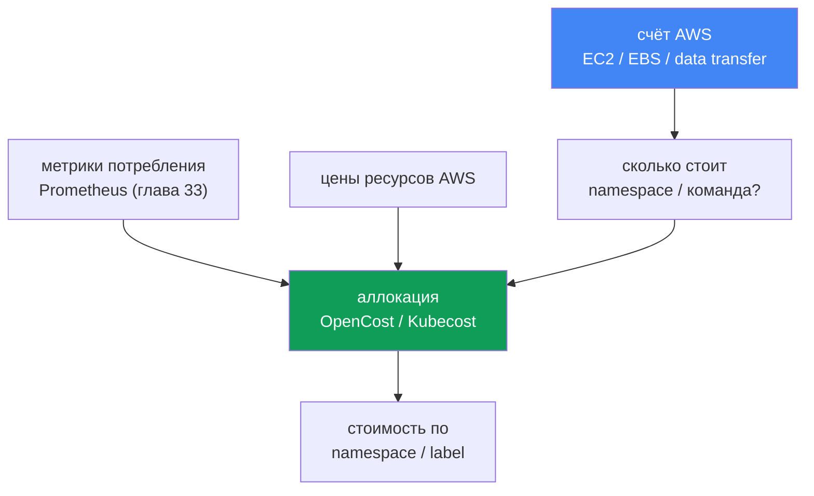
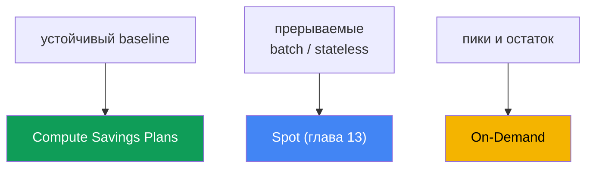

# Глава 43. Стоимость: OpenCost и Kubecost, right-sizing, Savings Plans, спот-микс, трафик

> **Что дальше.** Главы 33-36 дали наблюдаемость: метрики, логи, трейсы - вы видите, что
> кластер делает. Эта глава про то, во что это обходится, и как ответить бизнесу на вопрос
> «сколько стоит команда X или сервис Y». Смежное отдано другим главам: spot и модели покупки
> нод - глава 13, сайзинг подов через requests/limits и VPA - глава 14, consolidation и
> bin-packing Karpenter - глава 12, стоимость трафика (NAT, cross-AZ, endpoints) - глава 31,
> логи и их расходы - глава 34, gp3 и тома EBS - глава 23. Здесь мы собираем это в одну картину
> и добавляем аллокацию стоимости на объекты Kubernetes и модели коммитов AWS.

## 43.1. Счёт растёт, а на что - непонятно

Финансы приходят с простым вопросом: счёт за EKS вырос на треть за квартал, объясните почему и
кто это тратит. Дежурный открывает Cost Explorer и видит правду AWS: крупная строка `Amazon
Elastic Compute Cloud` (это ноды под кластером), строка `EBS`, строка `data transfer`. Всё.
Разбить эти суммы по namespace, команде или сервису нечем - в биллинге AWS таких понятий нет.

Одновременно `kubectl top` показывает вторую половину боли:

```bash
# реальное потребление подов
kubectl top pods -A --sort-by=cpu
# запрошено против ёмкости ноды
kubectl describe node <node> | grep -A6 "Allocated resources"
```

Картина типичная: под запросил `cpu: 2` и `memory: 4Gi`, а `kubectl top` показывает 200m и
600Mi. Requests завышены в разы. Karpenter (глава 12) честно зарезервировал под эти requests
ёмкость и поднял ноды - за которые вы платите, хотя поды их не используют. Ноды заняты «на
бумаге» и почти пусты по факту.

Два разных провала в одном счёте:

- **Нет аллокации.** AWS берёт плату за ресурсы (инстансы, тома, трафик), а не за namespace.
  На одной ноде живут поды многих команд - биллинг AWS их не различает.
- **Нет эффективности.** Requests завышены, bin-packing резервирует пустоту, ноды пустуют.
  Платим за зарезервированное, а не за использованное.

Отсюда план главы: сначала почему счёт AWS не отвечает на вопрос об аллокации и как её вернуть
(OpenCost, Kubecost); потом главный рычаг экономии - right-sizing; потом модели покупки
вычислений (On-Demand, Spot, Savings Plans, Reserved) и их микс; затем статьи трафика и
хранения; в конце - FinOps-практики и приоритет оптимизации.

## 43.2. Почему счёт AWS не знает про namespace

Биллинг AWS работает на уровне ресурсов: EC2-инстанс отработал столько-то часов такого-то типа,
том `gp3` занял столько-то GiB, столько-то гигабайт ушло cross-AZ и через NAT. Это физические
и виртуальные сущности AWS. Kubernetes же режет ноду на поды и раздаёт их разным Deployment в
разных namespace разных команд. Между «инстанс `m6i.2xlarge` работал 720 часов» и «сервис
`checkout` команды `payments` стоил столько-то» лежит пропасть, которую AWS не пересекает.

Восстановить связь можно только внутри Kubernetes: взять реальное потребление каждого пода
(CPU, память, диск, сеть) из метрик, взять цену ресурсов ноды у AWS и распределить стоимость
ноды по подам пропорционально их потреблению или их requests. Потом свернуть поды в Deployment,
namespace, team - по меткам. Это и называется аллокацией стоимости (cost allocation), и делает
её отдельный инструмент, а не биллинг AWS.



## 43.3. OpenCost и Kubecost

**OpenCost** - открытый вендонейтральный стандарт аллокации стоимости Kubernetes, проект CNCF
(в инкубации с октября 2024). Его цель сформулирована как «Prometheus для мониторинга
стоимости»: единая модель, поверх которой строят другие решения. Механика прямая:

- берёт потребление подов из метрик (Prometheus, глава 33): CPU, память, диск, сеть;
- берёт цены ресурсов AWS - на EKS сам подтягивает публичный on-demand прайс, дополнительная
  настройка не нужна;
- распределяет стоимость нод на поды и агрегирует по namespace, Deployment, label, SA.

Результат отдаётся через API и в формате, пригодном для дашбордов. OpenCost - это движок
аллокации, минимальный по составу.

**Kubecost** - продукт на базе OpenCost: тот же движок плюс UI с дашбордами, история, отчёты,
рекомендации по оптимизации и savings insights. Для EKS есть **Amazon EKS optimized Kubecost
bundle**, который ставится как EKS add-on или через Helm; поддержку можно получать по
действующим соглашениям AWS Support. Данные Kubecost хранит в Prometheus-совместимом хранилище
(в свежих версиях для мультикластера - в S3-совместимом объектном хранилище).

**Точная стоимость через Cost and Usage Report.** Публичный on-demand прайс завышает картину:
он не знает про ваши скидки. И OpenCost, и Kubecost умеют подключаться к AWS Cost and Usage
Report - детальному биллингу в S3, который читают запросами Athena - и сверять (reconcile)
аллокацию с фактически выставленным счётом. Тогда в стоимость нод попадают реальные ставки со
скидками Savings Plans, Reserved Instances, Spot и Enterprise-скидок, а не цена из каталога.
Без этой сверки аллокация верна по пропорциям между командами, но завышена по абсолюту.

| | OpenCost | Kubecost |
|---|---|---|
| Что это | движок и стандарт аллокации (CNCF) | продукт на базе OpenCost |
| Интерфейс | API, минимальный UI | полноценный UI, дашборды, отчёты |
| Рекомендации | нет | right-sizing, savings insights |
| На EKS | Helm, метрики из Prometheus | EKS add-on или Helm, EKS-optimized bundle |
| Когда берут | нужен открытый стандарт и данные | нужен UI, отчёты и рекомендации из коробки |

**Разделение общих (shared) затрат.** Не всё делится на поды напрямую. Есть затраты, которые
несёт кластер целиком: почасовая плата за control plane, системные namespace (`kube-system` и
аддоны), и главное - **idle-ёмкость**: разница между тем, за что платим (ёмкость нод), и тем,
что реально потребили поды. Эти shared-затраты инструмент либо показывает отдельной строкой,
либо разносит на команды по выбранному правилу (поровну, пропорционально потреблению, по
weighted-долям). Idle - важнейшая строка: большой idle прямо указывает на завышенные requests
и плохой bin-packing, то есть на потенциал right-sizing (раздел 43.4).

**Showback против chargeback.** Аллокация нужна для одной из двух моделей:

- **showback** - командам показывают их стоимость как информацию, без движения денег. Первый
  шаг: сделать расходы видимыми, чтобы команды сами замечали аномалии.
- **chargeback** - стоимость реально относят на бюджет команды, деньги перекладываются внутри
  компании. Требует зрелого учёта, доверия к цифрам аллокации и согласованных правил на shared.

Начинают почти всегда с showback: он дешевле политически и уже меняет поведение.

## 43.4. Right-sizing - главный рычаг

Самая большая экономия в EKS - обычно не коммиты и не spot, а устранение пустоты. Логика
цепочки такая: requests завышены → bin-packing (Karpenter, глава 12) резервирует ёмкость →
Karpenter поднимает ноды под эту зарезервированную ёмкость → вы платите за ноды, которые поды
не используют. Завышенный `requests` - это оплаченная пустота, помноженная на число реплик.

Диагностика - сравнение requested против used:

```bash
# запросы подов
kubectl get pods -A -o custom-columns=\
NS:.metadata.namespace,POD:.metadata.name,\
CPU_REQ:.spec.containers[*].resources.requests.cpu,\
MEM_REQ:.spec.containers[*].resources.requests.memory
# реальное потребление
kubectl top pods -A
```

Точнее и в динамике это дают метрики (глава 33) и рекомендации VPA в режиме рекомендаций
(глава 14): VPA наблюдает потребление и предлагает адекватные значения `requests`. Снижение
requests до реального потребления (с запасом на пики) уплотняет ноды: на той же ноде помещается
больше подов, лишние ноды consolidation Karpenter (глава 12) убирает, счёт падает.

Границы осторожности:

- **memory `limits` и OOMKill.** Слишком низкий лимит памяти - под убивают по OOM. Память
  несжимаемый ресурс: лимит режут аккуратно, с запасом на пики и с оглядкой на реальные пиковые
  значения из метрик.
- **CPU `limits` и throttling.** Жёсткий лимит CPU душит под троттлингом на всплесках. Часто
  правильнее задавать `requests` и не ставить (или дать щедрый) CPU `limit` - см. главу 14.
- **не занижать baseline.** Right-size ведут по устойчивому потреблению плюс headroom, а не по
  минимуму: иначе штатный дневной пик станет инцидентом.

Right-sizing и bin-packing идут первыми в порядке оптимизации: они снижают саму потребляемую
ёмкость, а уже к уменьшенному и устоявшемуся объёму применяют скидочные модели (раздел 43.6).

## 43.5. Модели покупки вычислений

Ноды EKS - это EC2, и платить за них можно по-разному. Скидочные модели не меняют, сколько вы
потребляете; они меняют ставку за единицу. Поэтому их применяют после right-sizing, к уже
устоявшемуся объёму (иначе закоммитите пустоту).

| Модель | Обязательство | Прерываемость | Куда |
|---|---|---|---|
| On-Demand | нет | нет | пики, остаток, всё непокрытое |
| Spot | нет | да, с уведомлением | fault-tolerant, batch, stateless (глава 13) |
| Compute Savings Plans | $/час на 1 или 3 года | нет | стабильный baseline вычислений |
| Reserved Instances | конкретная конфигурация, 1-3 года | нет | долгие стабильные специфичные нагрузки |

- **On-Demand** - базовый режим: платите за час работы без обязательств, самая высокая ставка.
  Это дефолт и «остаток», которым закрывают всё, что не попало в другие модели.
- **Spot** (глава 13) - свободная ёмкость AWS с большой скидкой, но её могут забрать с коротким
  уведомлением. Годится для нагрузок, переживающих прерывание: stateless-сервисы с несколькими
  репликами, обработка очередей, batch, CI. Диверсификация по типам инстансов и AZ снижает риск
  одновременного отзыва - подробно в главе 13.
- **Compute Savings Plans** - обязательство тратить определённую сумму в час на вычисления в
  течение 1 или 3 лет в обмен на скидку. Гибкие: скидка применяется независимо от семейства
  инстансов, региона, ОС и даже к Fargate и Lambda. Идеальны под предсказуемый baseline.
- **Reserved Instances** - более старый механизм: обязательство под конкретную конфигурацию
  (семейство, регион) на 1-3 года. Менее гибок, чем Savings Plans; на вычислениях EKS чаще
  выбирают Savings Plans, а RI держат под специфичные долгоживущие ресурсы.

**Стратегия микса.** Здоровый парк нод обычно комбинирует все режимы: Compute Savings Plans
покрывают устойчивый baseline, Spot берёт гибкие и пакетные нагрузки, On-Demand закрывает пики
и всё, что нельзя прервать или закоммитить. Пропорции зависят от доли прерываемых нагрузок и
уверенности в baseline; конкретные проценты скидок сверяют с актуальным прайсингом AWS.

**Что специфично для EKS в счёте:**

- **control plane** тарифицируется почасово за каждый кластер, независимо от нагрузки - это
  постоянная строка, аргумент против россыпи мелких кластеров (глава 32).
- **extended support** дороже стандартного: за кластер на версии в extended support берут
  повышенную почасовую плату за control plane (глава 38) - ещё один стимул обновляться вовремя.
- **Fargate** тарифицируется иначе, чем EC2-ноды: платите за vCPU и память, выделенные поду, за
  время его жизни, без нод под управлением (детали и сценарии - глава 15).



## 43.6. Трафик и хранение как статьи счёта

После вычислений в счёте EKS остаются две крупные группы, которые легко упустить: они
«размазаны» по архитектуре. Их разбирают профильные главы, здесь - что даёт каждая:

| Статья | Где экономия | Глава |
|---|---|---|
| Cross-AZ трафик | topology-aware routing, локальность подов | глава 31 |
| NAT Gateway | обработка и per-GB через NAT дорогие | глава 31 |
| VPC endpoints / PrivateLink | увести трафик к AWS-сервисам мимо NAT | глава 31 |
| Логи | объём, retention, семплирование, фильтры | глава 34 |
| Тома EBS | gp3 вместо gp2, размер, снапшоты | глава 23 |

- **Cross-AZ.** Трафик между зонами тарифицируется в обе стороны. Сервис в одной AZ, зовущий
  базу в другой, платит за каждый гигабайт. Аллокация и сетевые метрики помогают это увидеть;
  борьба с этим (topology aware hints, локальность) - в главе 31.
- **NAT Gateway.** Берёт плату и за час работы, и за каждый обработанный гигабайт. Поды, что
  ходящие в интернет или к AWS-сервисам через NAT, накручивают счёт - здесь и выручают VPC
  endpoints и PrivateLink (глава 31).
- **Логи.** CloudWatch Logs, OpenSearch и трафик доставки логов - заметная строка при болтливых
  приложениях и длинном retention. Контроль объёма, retention и семплирование - в главе 34.
- **Хранение.** `gp3` при равном объёме обычно выгоднее `gp2` и позволяет задавать IOPS и
  throughput отдельно; неиспользуемые тома и старые снапшоты - тихая утечка (глава 23).

## 43.7. FinOps-практики

Аллокация и модели покупки - инструменты; FinOps - процесс, который делает их устойчивыми.

- **Cost allocation tags плюс Kubernetes labels.** На стороне AWS размечают ресурсы тегами
  (`team`, `env`, `cost-center`), а user-defined теги активируют в консоли Billing - без
  активации они не появятся в Cost Explorer и Budgets. В кластере те же измерения несут
  labels на namespace и workload, по которым режет OpenCost/Kubecost. Две разметки должны
  совпадать по смыслу, тогда картинки AWS и кластера сходятся.
- **AWS Budgets и алерты.** Заводят бюджеты (общий и по тегам/сервисам) с порогами и
  уведомлениями, чтобы рост ловить в момент, а не в конце месяца по факту счёта.
- **Cost Anomaly Detection.** Отдельный сервис Cost Management: ML строит базовую линию трат и
  ловит аномальные всплески, шлёт алерты по email или в SNS (а оттуда через AWS Chatbot в Slack
  или Teams). В отличие от Budgets с фиксированным порогом, ловит именно отклонение от
  привычного паттерна - рост, что в статичный бюджет ещё влезает, но выбивается из нормы.
- **Cost Explorer с группировкой по тегам.** Разбор счёта по активированным тегам - штатный
  способ увидеть динамику по команде, окружению, сервису.
- **Showback командам.** Регулярный отчёт «сколько стоила ваша часть» меняет поведение сильнее
  любого регламента: команда сама замечает забытый LoadBalancer или раздутые requests.

**Приоритет оптимизации** (сверху вниз, по соотношению эффект/риск):

1. **Right-size и bin-pack** - снизить сам потребляемый объём (разделы 43.4, глава 12). Это
   уменьшает базу, к которой применяется всё остальное.
2. **Savings Plans на устоявшийся baseline** - закоммитить уже уменьшенный стабильный объём, а
   не исходный раздутый.
3. **Spot на гибкие нагрузки** - перевести прерываемое на Spot (глава 13).
4. **Трафик, логи, хранение** - подчистить cross-AZ и NAT (глава 31), retention логов (гл. 34),
   тома и снапшоты (глава 23).

Порядок важен: коммитить (шаг 2) до right-sizing (шаг 1) - значит зафиксировать оплату пустоты
на год-три.

## 43.8. Как это применяют в продакшене

- **Ставят аллокацию до споров о деньгах.** OpenCost или Kubecost разворачивают заранее, чтобы
  к разговору с финансами уже были цифры по namespace, а не «попробуем посчитать».
- **Начинают с showback.** Команды сначала видят свою стоимость, и только на зрелом учёте
  переходят к chargeback с движением бюджета.
- **Гонят right-sizing как рутину.** Регулярно сверяют requests с потреблением (метрики,
  рекомендации VPA), снижают завышенное, дают consolidation уплотнить ноды.
- **Коммитят только устоявшийся baseline.** Savings Plans берут после right-sizing, на объём,
  который держится месяцами, оставляя пики и рост на On-Demand и Spot.
- **Размечают тегами и labels согласованно.** Один набор измерений (team, env, service) и в
  cost allocation tags AWS, и в labels Kubernetes; user-defined теги активируют в Billing.
- **Ставят Budgets с алертами.** Бюджеты по командам и сервисам с порогами ловят аномалию в
  момент возникновения, а не постфактум.

## 43.9. Мини-глоссарий

- **cost allocation (аллокация)** - распределение стоимости ресурсов AWS на объекты Kubernetes
  (namespace, Deployment, label) по потреблению или requests.
- **OpenCost** - открытый вендонейтральный стандарт и движок аллокации стоимости, проект CNCF;
  берёт потребление из Prometheus и цены ресурсов AWS.
- **Kubecost** - продукт на базе OpenCost с UI, отчётами и рекомендациями; на EKS есть
  EKS-optimized bundle (add-on или Helm).
- **idle-ёмкость** - разница между оплаченной ёмкостью нод и реально потреблённым; маркер
  завышенных requests и плохого bin-packing.
- **shared costs** - общие затраты кластера (control plane, системные namespace, idle),
  разносимые на команды по правилу или показываемые отдельно.
- **showback** - командам показывают их стоимость без движения денег.
- **chargeback** - стоимость реально относят на бюджет команды.
- **right-sizing** - приведение requests/limits к реальному потреблению для уплотнения нод.
- **Compute Savings Plans** - обязательство по расходу в час на 1-3 года в обмен на скидку,
  гибкое по семействам инстансов, региону и Fargate/Lambda.
- **cost allocation tags** - теги AWS для разбивки счёта; user-defined теги надо активировать в
  консоли Billing.
- **Cost and Usage Report** - детальный биллинг AWS в S3; чтение через Athena даёт
  OpenCost/Kubecost сверять аллокацию с фактическим счётом со скидками.
- **Cost Anomaly Detection** - сервис AWS, ML-детекция аномального роста трат с алертами в
  email или SNS (Slack/Teams через AWS Chatbot).

## 43.10. Итоги главы

- Счёт AWS выставляется за ресурсы (EC2, EBS, data transfer), а не за namespace; на одной ноде
  живут поды многих команд, и биллинг их не различает.
- Ответить «сколько стоит команда X» можно только аллокацией внутри Kubernetes: потребление из
  метрик плюс цены AWS, распределённые на объекты по потреблению или requests.
- OpenCost - открытый стандарт и движок аллокации (CNCF); Kubecost - продукт на его основе с
  UI, отчётами и рекомендациями, на EKS доступен как EKS-optimized bundle.
- Shared-затраты (control plane, системные namespace, idle) разносят или показывают отдельно;
  большой idle - прямой сигнал к right-sizing.
- Showback (показать стоимость) - первый шаг, chargeback (относить на бюджет) - зрелый.
- Right-sizing - главный рычаг: завышенные requests заставляют bin-packing резервировать
  пустоту и поднимать лишние ноды; снижение requests уплотняет ноды.
- Осторожно с limits: низкий memory-лимит ведёт к OOMKill, жёсткий CPU-лимит - к троттлингу;
  right-size по устойчивому потреблению плюс headroom.
- Модели покупки: On-Demand (без обязательств, дорого), Spot (дёшево, прерываемо), Compute
  Savings Plans (коммит по расходу, гибко), Reserved (конкретная конфигурация).
- Микс: Savings Plans под baseline, Spot под гибкое, On-Demand на пики; коммитить только после
  right-sizing и только устоявшийся объём.
- EKS-специфика счёта: почасовой control plane за кластер, дороже в extended support (гл. 38),
  отдельное ценообразование Fargate (глава 15); трафик и хранение - главы 31, 34, 23.
- Для точных цифр аллокацию подключают к Cost and Usage Report (через Athena): тогда учтены
  скидки Savings Plans/RI/Spot, а не публичный прайс; Cost Anomaly Detection ловит аномальный
  рост трат алертами, дополняя пороговые Budgets отклонением от привычного паттерна.

## 43.11. Как это пригодится в реальной работе

На дежурстве и в планировании эта глава превращает счёт из чёрного ящика в управляемую
величину. Когда финансы спрашивают, почему вырос счёт, вы не гадаете по строке `Amazon EC2`, а
открываете аллокацию по namespace и показываете, кто дал прирост, отделяя idle от
реального потребления. Это переводит разговор с «дорого» на «вот конкретный Deployment с
завышенными requests» - и дальше на действие.

При планировании кластера стоимость становится обязательным измерением наравне с надёжностью:
развёрнутая аллокация (OpenCost или Kubecost), согласованные cost allocation tags и labels,
бюджеты с алертами, отработанный цикл right-sizing и осознанный микс покупки (Savings Plans на
baseline, Spot на гибкое, On-Demand на остаток). Порядок оптимизации фиксирован: сначала
уменьшить объём, потом закоммитить устоявшееся, потом spot, потом трафик и хранение. Тогда
экономия устойчива, а не разовая акция перед закрытием квартала.

## 43.12. Вопросы для самопроверки

1. Почему счёт AWS не отвечает на вопрос «сколько стоит namespace» и что нужно, чтобы ответить?
2. Как аллокация восстанавливает связь между ресурсами AWS и объектами Kubernetes?
3. Что такое OpenCost, откуда он берёт потребление и цены, и почему это проект CNCF?
4. Чем Kubecost отличается от OpenCost и что даёт EKS-optimized Kubecost bundle?
5. Что относят к shared-затратам и почему большой idle - сигнал к right-sizing?
6. В чём разница между showback и chargeback и с чего обычно начинают?
7. Почему завышенные requests приводят к оплате пустых нод (роль bin-packing и Karpenter)?
8. Какие риски у агрессивного снижения limits и как их обходят?
9. Чем On-Demand, Spot, Savings Plans и Reserved отличаются по обязательству и гибкости?
10. Как строят микс моделей покупки и почему Savings Plans берут только на baseline?
11. Что специфично для счёта EKS: control plane, extended support, Fargate?
12. Какие статьи трафика и хранения оптимизируют и какие главы за них отвечают?
13. Каков приоритет оптимизации и почему нельзя коммитить Savings Plans до right-sizing?
14. Зачем подключать OpenCost/Kubecost к Cost and Usage Report и чем Cost Anomaly Detection
    дополняет AWS Budgets?

## Практика

Своей лабы у главы нет, но всю картину видно на живом кластере и в консоли AWS. Начните с
разрыва между requested и used - это главный источник экономии:

```bash
# реальное потребление против запросов
kubectl top pods -A --sort-by=cpu
kubectl top nodes
# сколько ресурсов ноды уже зарезервировано requests
kubectl describe node <node> | grep -A6 "Allocated resources"
```

Разверните аллокацию (OpenCost или EKS-optimized Kubecost bundle) и посмотрите стоимость по
namespace и label, обращая внимание на строку idle - это и есть завышенные requests:

```bash
# UI Kubecost через port-forward (namespace kubecost)
kubectl -n kubecost port-forward deploy/kubecost-cost-analyzer 9090
# запрос аллокации через API OpenCost/Kubecost
curl "http://localhost:9090/model/allocation?window=7d&aggregate=namespace"
```

Со стороны AWS сверьте картину в биллинге: активируйте user-defined cost allocation tags в
консоли Billing, сгруппируйте счёт по тегам в Cost Explorer и заведите бюджет с алертом. Для
точных цифр подключите аллокацию к Cost and Usage Report, а на аномальный рост навесьте
Cost Anomaly Detection с оповещением в SNS.

```bash
# суммы по сервисам за период (Cost Explorer API)
aws ce get-cost-and-usage \
  --time-period Start=2024-01-01,End=2024-02-01 \
  --granularity MONTHLY --metrics "UnblendedCost" \
  --group-by Type=DIMENSION,Key=SERVICE
# разбивка по тегу команды
aws ce get-cost-and-usage \
  --time-period Start=2024-01-01,End=2024-02-01 \
  --granularity MONTHLY --metrics "UnblendedCost" \
  --group-by Type=TAG,Key=team
```

Дальше идите по приоритету: right-size и bin-pack (разделы 43.4, глава 12), Savings Plans на
baseline, Spot на гибкое (глава 13), затем трафик и хранение (главы 31, 34, 23). Конкретные
цены и проценты скидок всегда сверяйте с актуальным прайсингом AWS, а не с числами из статей.

---
[Оглавление](../README_RU.md) · [Глава 42](../42/ru.md) · [Глава 44](../44/ru.md)
